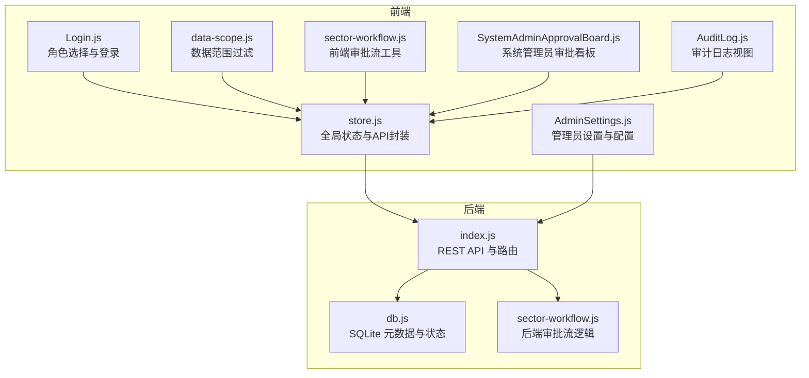
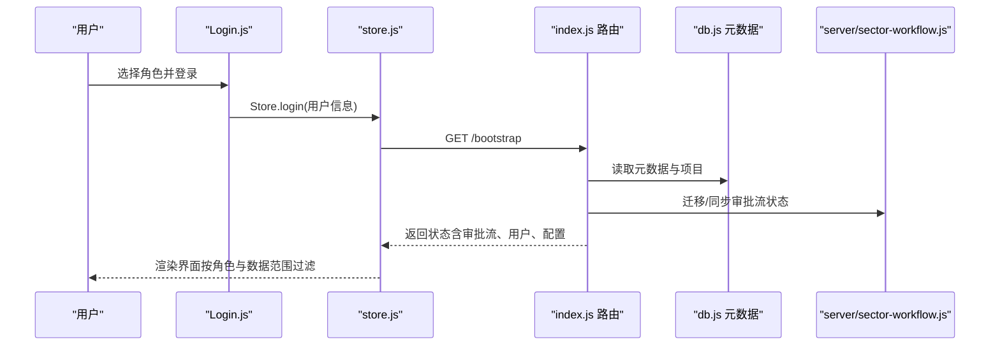
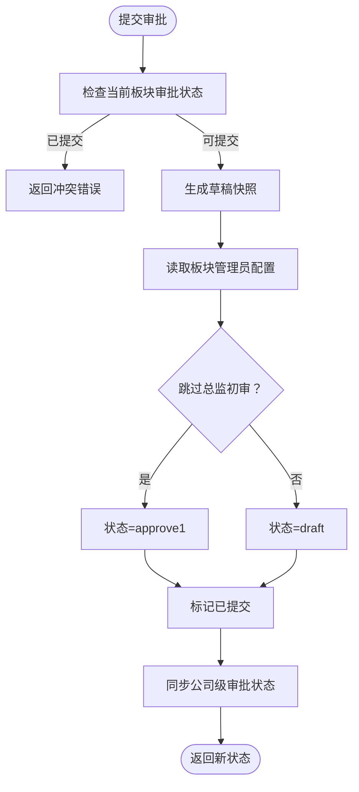
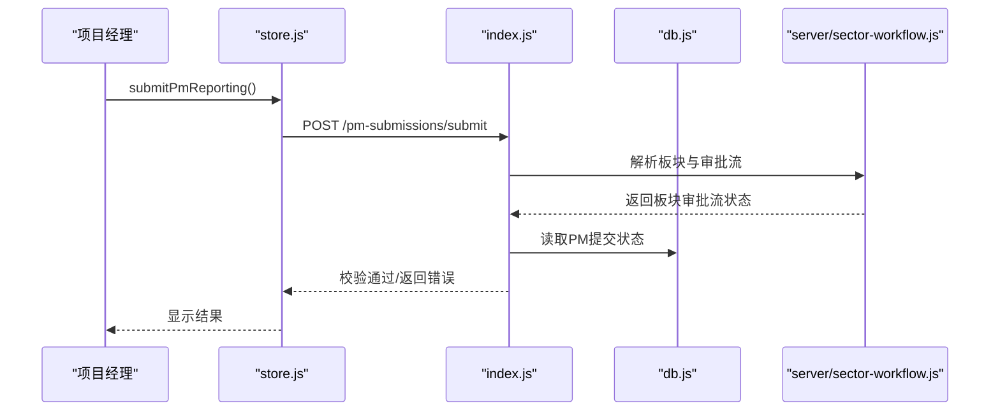
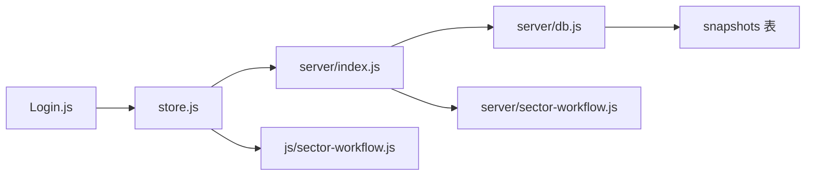

# 权限控制

<cite>
**本文引用的文件**
- [js/sector-workflow.js](file://js/sector-workflow.js)
- [server/sector-workflow.js](file://server/sector-workflow.js)
- [js/store.js](file://js/store.js)
- [server/index.js](file://server/index.js)
- [server/db.js](file://server/db.js)
- [js/views/Login.js](file://js/views/Login.js)
- [js/data-scope.js](file://js/data-scope.js)
- [js/views/AdminSettings.js](file://js/views/AdminSettings.js)
- [js/views/SystemAdminApprovalBoard.js](file://js/views/SystemAdminApprovalBoard.js)
- [js/views/AuditLog.js](file://js/views/AuditLog.js)
- [js/app.js](file://js/app.js)
- [database-schema.sql](file://database-schema.sql)
</cite>

## 目录
1. [简介](#简介)
2. [项目结构](#项目结构)
3. [核心组件](#核心组件)
4. [架构总览](#架构总览)
5. [详细组件分析](#详细组件分析)
6. [依赖分析](#依赖分析)
7. [性能考虑](#性能考虑)
8. [故障排查指南](#故障排查指南)
9. [结论](#结论)
10. [附录](#附录)

## 简介
本文件系统性梳理项目追踪平台的权限控制体系，围绕基于角色的访问控制（RBAC）机制与审批工作流展开，重点解释审批流（sector-workflow.js）中的角色定义、权限分配与数据范围控制。文档面向开发者与运维人员，提供角色权限边界、权限验证流程、数据访问控制、功能可见性控制、权限继承与组合、动态权限更新机制、权限配置指南、角色管理策略、权限审计方法，并总结权限安全最佳实践与权限绕过防护建议。

## 项目结构
权限控制涉及前端状态与后端接口两大部分：
- 前端负责用户登录、角色展示、数据范围过滤、UI 功能可见性控制、审批动作触发与状态更新。
- 后端负责审批流状态持久化、关键操作鉴权、数据一致性与审计日志。

图表来源
- [js/views/Login.js:1-215](file://js/views/Login.js#L1-L215)
- [js/store.js:1-602](file://js/store.js#L1-L602)
- [js/data-scope.js:1-73](file://js/data-scope.js#L1-L73)
- [js/sector-workflow.js:1-180](file://js/sector-workflow.js#L1-L180)
- [js/views/SystemAdminApprovalBoard.js:1-86](file://js/views/SystemAdminApprovalBoard.js#L1-L86)
- [js/views/AdminSettings.js:1-404](file://js/views/AdminSettings.js#L1-L404)
- [js/views/AuditLog.js:1-239](file://js/views/AuditLog.js#L1-L239)
- [server/index.js:1-775](file://server/index.js#L1-L775)
- [server/db.js:1-525](file://server/db.js#L1-L525)
- [server/sector-workflow.js:1-273](file://server/sector-workflow.js#L1-L273)

章节来源
- [js/views/Login.js:1-215](file://js/views/Login.js#L1-L215)
- [js/store.js:1-602](file://js/store.js#L1-L602)
- [js/data-scope.js:1-73](file://js/data-scope.js#L1-L73)
- [js/sector-workflow.js:1-180](file://js/sector-workflow.js#L1-L180)
- [js/views/SystemAdminApprovalBoard.js:1-86](file://js/views/SystemAdminApprovalBoard.js#L1-L86)
- [js/views/AdminSettings.js:1-404](file://js/views/AdminSettings.js#L1-L404)
- [js/views/AuditLog.js:1-239](file://js/views/AuditLog.js#L1-L239)
- [server/index.js:1-775](file://server/index.js#L1-L775)
- [server/db.js:1-525](file://server/db.js#L1-L525)
- [server/sector-workflow.js:1-273](file://server/sector-workflow.js#L1-L273)

## 核心组件
- 角色与登录
  - 前端登录视图定义了系统管理员、经营管理（只读）、板块管理员、项目经理、板块总监、项目群群主等角色及其描述与图标。
  - 登录成功后，前端将用户信息写入本地存储与全局状态，并根据角色决定审计日志可见性。
- 数据范围控制
  - 经营管理（只读）角色支持“全公司/板块/项目群”三种数据范围，通过数据范围过滤器实现。
  - 项目经理与板块管理员分别按 PM 姓名与板块编码过滤项目。
- 审批工作流
  - 前后端共享的审批流状态包括草稿、总监初审、群主复审三阶段，支持按板块维度推进与归档。
  - 板块管理员可配置“跳过总监初审”，影响提交审批后的初始状态。
- 审计与配置
  - 后端提供审计日志写入与查询接口，管理员可导出审计日志。
  - 管理员设置页面支持周期配置、数据锁定/解锁、初始数据导入、板块管理员配置等。

章节来源
- [js/views/Login.js:7-50](file://js/views/Login.js#L7-L50)
- [js/store.js:95-168](file://js/store.js#L95-L168)
- [js/data-scope.js:13-42](file://js/data-scope.js#L13-L42)
- [server/index.js:230-285](file://server/index.js#L230-L285)
- [server/index.js:302-346](file://server/index.js#L302-L346)
- [server/index.js:348-417](file://server/index.js#L348-L417)
- [server/index.js:419-446](file://server/index.js#L419-L446)
- [js/views/AdminSettings.js:67-80](file://js/views/AdminSettings.js#L67-L80)
- [js/views/AuditLog.js:23-34](file://js/views/AuditLog.js#L23-L34)

## 架构总览
权限控制贯穿“前端状态—后端接口—数据库元数据”的闭环：
- 前端通过 Store 统一发起 API 请求，后端在路由层进行鉴权与业务校验，最终写入 SQLite 元数据表。
- 审批流状态与用户配置（如板块管理员）均以元数据形式持久化，确保前后端一致。

图表来源
- [js/views/Login.js:111-123](file://js/views/Login.js#L111-L123)
- [js/store.js:268-275](file://js/store.js#L268-L275)
- [server/index.js:91-100](file://server/index.js#L91-L100)
- [server/db.js:194-266](file://server/db.js#L194-L266)
- [server/sector-workflow.js:119-186](file://server/sector-workflow.js#L119-L186)

## 详细组件分析

### 审批工作流（sector-workflow.js）
- 前端工具
  - 定义审批流阶段、板块注册表、板块名称映射、活动步骤索引与状态文本。
  - 提供板块代码标准化、项目按板块过滤、快照键生成、统计计算等工具函数。
- 后端工具
  - 与前端工具保持一致的阶段与名称映射，提供迁移与同步逻辑，确保历史数据与新结构兼容。
  - 提供“板块管理员跳过总监初审”的配置项，影响提交审批后的初始状态。

图表来源
- [server/index.js:302-346](file://server/index.js#L302-L346)
- [server/sector-workflow.js:119-186](file://server/sector-workflow.js#L119-L186)
- [server/sector-workflow.js:240-248](file://server/sector-workflow.js#L240-L248)

章节来源
- [js/sector-workflow.js:1-180](file://js/sector-workflow.js#L1-L180)
- [server/sector-workflow.js:1-273](file://server/sector-workflow.js#L1-L273)
- [server/index.js:302-346](file://server/index.js#L302-L346)

### 角色定义与权限边界
- 系统管理员
  - 权限：全字段编辑、锁定/解锁、系统配置、公司归档、刷新工程平台数据、字段字典读写、用户与权限配置。
  - 边界：可操作所有板块与项目，不受数据范围限制；可导出审计日志。
- 经营管理（只读）
  - 权限：按公司/板块/群查看汇总，无审批与编辑能力。
  - 边界：通过数据范围过滤器限定可见项目集合。
- 板块管理员
  - 权限：板块数据汇总、异常处理、提交审批、推进审批、驳回审批、生成 D 版快照。
  - 边界：仅能操作其所属板块；可通过配置“跳过总监初审”。
- 项目经理（PM）
  - 权限：本项目产值/进度/WIP 填报；提交当月报表；提交后锁定不可再改。
  - 边界：仅能查看/编辑自身负责的项目；受板块提交状态与锁定状态约束。
- 板块总监
  - 权限：查看数据、初审审批。
  - 边界：仅能操作其所属板块；与板块管理员协作推进审批。
- 项目群群主
  - 权限：跨板块审核、终审确认。
  - 边界：仅能操作其负责的审批节点；与板块总监共同完成审批闭环。

章节来源
- [js/views/Login.js:7-50](file://js/views/Login.js#L7-L50)
- [js/data-scope.js:13-42](file://js/data-scope.js#L13-L42)
- [server/index.js:230-285](file://server/index.js#L230-L285)
- [server/index.js:302-346](file://server/index.js#L302-L346)
- [server/index.js:348-417](file://server/index.js#L348-L417)
- [server/index.js:419-446](file://server/index.js#L419-L446)
- [js/views/AdminSettings.js:338-385](file://js/views/AdminSettings.js#L338-L385)

### 权限验证流程与数据访问控制
- 登录与角色注入
  - 登录成功后，前端将用户信息写入全局状态；若非系统管理员，前端会清空审计日志以限制可见性。
- 数据范围过滤
  - 经营管理（只读）角色按“全公司/板块/项目群”过滤项目集合。
  - 项目经理与板块管理员分别按 PM 姓名与板块编码过滤。
- 审批状态与提交控制
  - PM 提交前检查板块是否已正式提交与自身是否锁定；板块管理员提交审批时检查当前状态与管理员配置。
- 锁定与解锁
  - 系统管理员可手动锁定/解锁，锁定后除管理员外不可编辑；财务核查提醒期不影响只读规则。

图表来源
- [js/store.js:472-495](file://js/store.js#L472-L495)
- [server/index.js:230-285](file://server/index.js#L230-L285)
- [server/sector-workflow.js:113-117](file://server/sector-workflow.js#L113-L117)

章节来源
- [js/store.js:95-168](file://js/store.js#L95-L168)
- [js/data-scope.js:13-42](file://js/data-scope.js#L13-L42)
- [server/index.js:230-285](file://server/index.js#L230-L285)
- [server/index.js:302-346](file://server/index.js#L302-L346)

### 功能可见性控制
- 角色驱动的界面元素显隐
  - 管理员设置页面对非系统管理员隐藏保存按钮与部分操作。
  - 审计日志视图仅系统管理员可见完整日志。
- 数据范围驱动的列表过滤
  - 经营管理（只读）角色在项目列表中仅显示其授权范围内的项目。

章节来源
- [js/views/AdminSettings.js:196-203](file://js/views/AdminSettings.js#L196-L203)
- [js/views/AuditLog.js:21-34](file://js/views/AuditLog.js#L21-L34)

### 权限继承关系、权限组合与动态更新
- 继承与组合
  - 角色之间无显式继承关系，权限通过角色标识与数据范围配置组合实现。
  - 板块管理员配置可叠加“跳过总监初审”等动态行为，影响审批流推进。
- 动态更新
  - 管理员通过设置页面动态更新周期配置、锁定状态、初始数据导入、用户与板块管理员配置。
  - 审计日志实时记录权限相关的关键操作，便于追溯。

章节来源
- [js/views/AdminSettings.js:67-80](file://js/views/AdminSettings.js#L67-L80)
- [server/index.js:661-702](file://server/index.js#L661-L702)
- [server/index.js:170-182](file://server/index.js#L170-L182)

### 权限配置指南
- 板块管理员配置
  - 在管理员设置页面为各板块配置管理员姓名、平台用户ID与“跳过总监初审”开关。
- 周期与锁定配置
  - 设置报告月份、提醒日、月度锁定日、次月解禁日与自动解锁开关。
- 初始数据导入
  - 支持从 Excel 导入项目数据并生成导入快照，作为对比基准。
- 字段字典管理
  - 系统管理员可读取/写入字段字典，写入后自动审计记录。

章节来源
- [js/views/AdminSettings.js:338-385](file://js/views/AdminSettings.js#L338-L385)
- [server/index.js:705-741](file://server/index.js#L705-L741)

### 权限审计方法
- 审计日志
  - 后端提供审计日志写入与查询接口；前端提供审计日志视图与导出功能。
  - 关键操作（如 PM 提交、板块提交审批、推进/驳回、公司归档、锁定状态变更、用户配置变更等）均写入审计日志。
- 日志筛选与导出
  - 支持按时间、操作人、项目号/名称、字段名筛选；支持导出为 Excel。

章节来源
- [server/index.js:170-182](file://server/index.js#L170-L182)
- [js/views/AuditLog.js:23-34](file://js/views/AuditLog.js#L23-L34)
- [js/views/AuditLog.js:61-81](file://js/views/AuditLog.js#L61-L81)

## 依赖分析
- 前端依赖
  - Login.js 依赖 Store 与数据范围过滤器；SystemAdminApprovalBoard 依赖 SectorWorkflow；AdminSettings 依赖 Store 与路由。
- 后端依赖
  - index.js 路由依赖 db.js 元数据与 server/sector-workflow.js 审批流逻辑；审计日志写入依赖 db.js。
- 数据模型
  - 审批快照表 snapshots 记录不可变快照，包含版本键、类型、板块代码、报告月、快照数据与操作者等字段。

图表来源
- [js/views/Login.js:1-215](file://js/views/Login.js#L1-L215)
- [js/store.js:1-602](file://js/store.js#L1-L602)
- [server/index.js:1-775](file://server/index.js#L1-L775)
- [server/db.js:1-525](file://server/db.js#L1-L525)
- [server/sector-workflow.js:1-273](file://server/sector-workflow.js#L1-L273)
- [database-schema.sql:279-286](file://database-schema.sql#L279-L286)

章节来源
- [js/views/Login.js:1-215](file://js/views/Login.js#L1-L215)
- [js/store.js:1-602](file://js/store.js#L1-L602)
- [server/index.js:1-775](file://server/index.js#L1-L775)
- [server/db.js:1-525](file://server/db.js#L1-L525)
- [server/sector-workflow.js:1-273](file://server/sector-workflow.js#L1-L273)
- [database-schema.sql:279-286](file://database-schema.sql#L279-L286)

## 性能考虑
- 前端状态与缓存
  - Store 使用 Vue.observable 与本地存储，减少重复请求；字段字典按需加载，避免阻塞启动。
- 后端查询与索引
  - 审计日志与快照表建立索引，提升查询效率；分页与筛选降低前端渲染压力。
- 审批流状态同步
  - 迁移与同步逻辑一次性完成，避免每次请求重复计算。

[本节为通用指导，无需特定文件引用]

## 故障排查指南
- 登录后审计日志为空
  - 非系统管理员登录时，前端会清空审计日志；切换为系统管理员角色后可查看完整日志。
- PM 无法提交
  - 检查所属板块是否已正式提交审批；检查自身是否处于锁定状态；确认当前报告月与锁定状态。
- 板块管理员提交审批无效
  - 检查当前审批状态是否已提交；确认“跳过总监初审”配置是否正确。
- 锁定状态异常
  - 系统管理员可手动锁定/解锁；检查周期配置中的锁定日与次月解禁日设置。

章节来源
- [js/store.js:164-166](file://js/store.js#L164-L166)
- [server/index.js:230-285](file://server/index.js#L230-L285)
- [server/index.js:302-346](file://server/index.js#L302-L346)
- [js/views/AdminSettings.js:101-136](file://js/views/AdminSettings.js#L101-L136)

## 结论
本系统采用前端角色与后端元数据相结合的 RBAC 模型，通过审批工作流与数据范围过滤实现细粒度的权限控制。系统提供了完善的权限配置、动态更新与审计能力，能够满足多角色协同与合规要求。建议在生产环境中结合平台统一鉴权，进一步强化权限边界与安全防护。

[本节为总结性内容，无需特定文件引用]

## 附录
- 权限安全最佳实践
  - 强制最小权限原则：仅授予完成任务所需的最低权限。
  - 审计留痕：所有关键操作必须记录审计日志，支持可追溯。
  - 定期审查：定期审查角色与配置，清理无效账户与冗余权限。
  - 输入校验：严格校验请求参数，防止越权与注入攻击。
  - 最小暴露面：仅暴露必要的 API 端点，隐藏内部实现细节。
- 权限绕过防护
  - 服务端二次校验：前端权限仅为体验层，服务端必须进行严格的鉴权与业务校验。
  - 参数白名单：对敏感参数进行白名单校验，拒绝未知字段。
  - 会话与令牌：使用安全的会话与令牌机制，防止泄露与重放。
  - 速率限制：对敏感接口实施速率限制，降低暴力破解风险。

[本节为通用指导，无需特定文件引用]