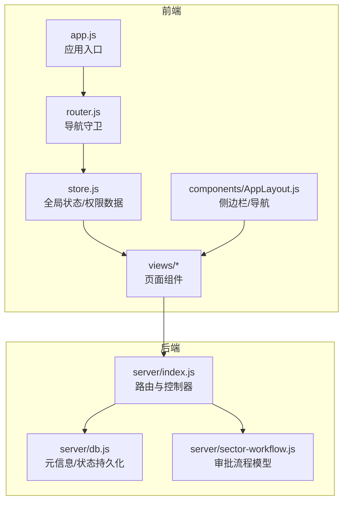
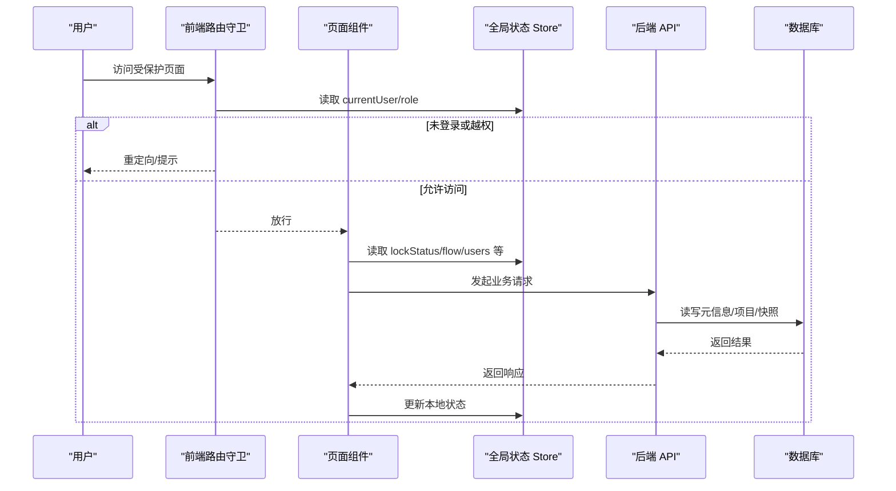
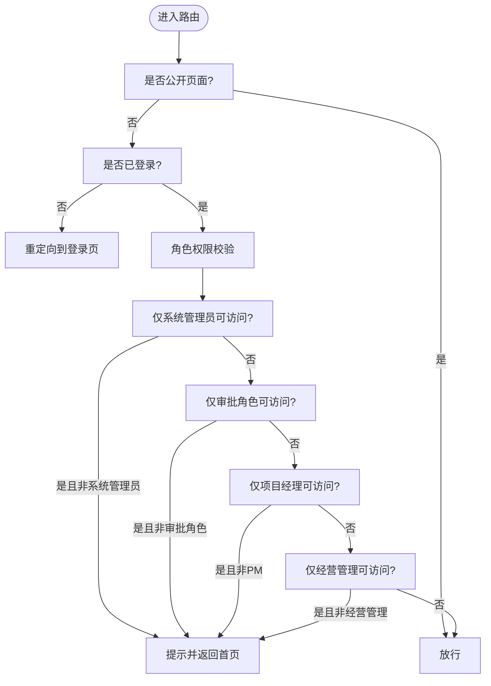
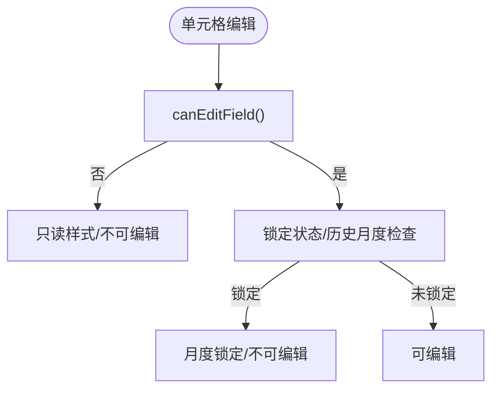
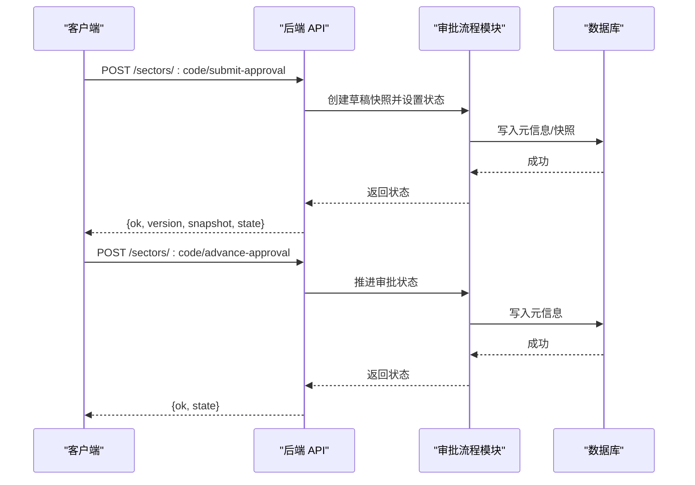
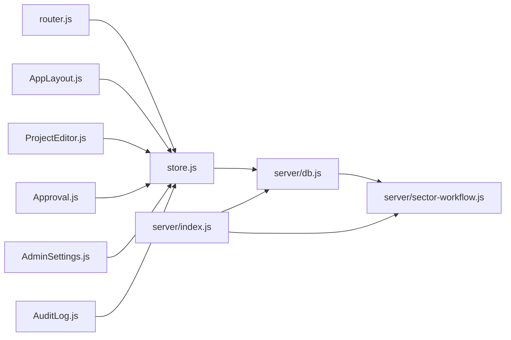

# 权限验证

<cite>
**本文引用的文件**
- [js/app.js](file://js/app.js)
- [js/store.js](file://js/store.js)
- [js/router.js](file://js/router.js)
- [js/views/Login.js](file://js/views/Login.js)
- [js/components/AppLayout.js](file://js/components/AppLayout.js)
- [js/views/ProjectEditor.js](file://js/views/ProjectEditor.js)
- [js/views/Approval.js](file://js/views/Approval.js)
- [js/views/AdminSettings.js](file://js/views/AdminSettings.js)
- [js/views/AuditLog.js](file://js/views/AuditLog.js)
- [js/data-scope.js](file://js/data-scope.js)
- [server/index.js](file://server/index.js)
- [server/db.js](file://server/db.js)
- [server/sector-workflow.js](file://server/sector-workflow.js)
</cite>

## 目录
1. [简介](#简介)
2. [项目结构](#项目结构)
3. [核心组件](#核心组件)
4. [架构总览](#架构总览)
5. [详细组件分析](#详细组件分析)
6. [依赖分析](#依赖分析)
7. [性能考虑](#性能考虑)
8. [故障排查指南](#故障排查指南)
9. [结论](#结论)
10. [附录](#附录)

## 简介
本文件系统性阐述项目追踪表线上化的权限验证机制，覆盖前端路由与界面级权限控制、后端接口与业务流程权限控制、权限检查点与决策算法、权限缓存与更新同步、权限失效处理、权限与审批流程的集成关系，并提供权限验证的调试方法与性能优化建议。

## 项目结构
该项目采用前后端分离架构：
- 前端基于 Vue 生态，通过路由守卫实现页面级权限控制，通过全局状态 Store 管理用户、数据范围、工作流状态等，结合字段字典与视图组件实现字段级权限控制。
- 后端基于 Node.js + Express，提供受控的 API 接口，严格限制敏感操作的访问范围，并通过数据库元信息维护审批流程、锁定状态、用户配置等。

图表来源
- [js/app.js:1-47](file://js/app.js#L1-L47)
- [js/router.js:1-137](file://js/router.js#L1-L137)
- [js/store.js:1-602](file://js/store.js#L1-L602)
- [server/index.js:1-775](file://server/index.js#L1-L775)
- [server/db.js:1-525](file://server/db.js#L1-L525)
- [server/sector-workflow.js:1-273](file://server/sector-workflow.js#L1-L273)

章节来源
- [js/app.js:1-47](file://js/app.js#L1-L47)
- [js/router.js:1-137](file://js/router.js#L1-L137)
- [js/store.js:1-602](file://js/store.js#L1-L602)
- [server/index.js:1-775](file://server/index.js#L1-L775)
- [server/db.js:1-525](file://server/db.js#L1-L525)
- [server/sector-workflow.js:1-273](file://server/sector-workflow.js#L1-L273)

## 核心组件
- 前端权限入口与状态
  - 应用入口负责初始化与错误兜底，确保数据加载失败时给出明确提示。
  - 全局状态 Store 负责用户信息、数据范围、锁定状态、审批状态、快照、字段字典等，是权限判断与界面渲染的基础。
  - 登录页提供角色选择与模拟登录，便于演示与测试。
  - 主布局根据用户角色动态过滤导航项，实现“可见即权限”的直观体验。
- 前端路由与页面级权限
  - 路由守卫统一拦截未登录与越权访问，对公开页面放行，对需要认证的页面进行角色校验。
  - 对特定页面（如管理设置、审计日志、表头配置）进行严格的系统管理员限制。
- 前端字段级权限
  - 字段配置与编辑能力由字段字典与角色、锁定状态共同决定，编辑器在渲染与交互层面严格限制不可编辑列。
- 后端权限与审批
  - 后端 API 对敏感操作进行细粒度控制，如仅系统管理员可锁定/解锁、仅板块管理员可提交审批、仅系统管理员可归档。
  - 审批流程状态机由后端维护，保证跨请求的一致性与原子性。

章节来源
- [js/store.js:1-602](file://js/store.js#L1-L602)
- [js/router.js:1-137](file://js/router.js#L1-L137)
- [js/views/Login.js:1-215](file://js/views/Login.js#L1-L215)
- [js/components/AppLayout.js:1-240](file://js/components/AppLayout.js#L1-L240)
- [js/views/ProjectEditor.js:1-800](file://js/views/ProjectEditor.js#L1-L800)
- [server/index.js:1-775](file://server/index.js#L1-L775)
- [server/db.js:1-525](file://server/db.js#L1-L525)
- [server/sector-workflow.js:1-273](file://server/sector-workflow.js#L1-L273)

## 架构总览
权限验证贯穿“前端路由/界面 → 前端状态/字段 → 后端接口/流程”三层：

图表来源
- [js/router.js:84-132](file://js/router.js#L84-L132)
- [js/store.js:268-275](file://js/store.js#L268-L275)
- [server/index.js:198-218](file://server/index.js#L198-L218)
- [server/db.js:194-266](file://server/db.js#L194-L266)

## 详细组件分析

### 前端权限控制（路由与界面）
- 路由守卫
  - 公开页面（如登录页）直接放行。
  - 需认证页面：若未登录则重定向至登录页。
  - 页面级权限：对 /admin、/fields、/audit 等页面仅系统管理员可访问；项目经理、经营管理只读角色被限制访问审批/审计/管理/表头配置等页面。
  - 板块总监/群主仅能访问审批流程页面。
  - 越权时弹出提示并返回首页。
- 主布局导航
  - 根据用户角色动态过滤导航项，隐藏对当前角色不可见的菜单。
- 登录页
  - 提供多角色选择与演示用户，便于测试不同角色的权限表现。

图表来源
- [js/router.js:84-132](file://js/router.js#L84-L132)

章节来源
- [js/router.js:1-137](file://js/router.js#L1-L137)
- [js/components/AppLayout.js:18-54](file://js/components/AppLayout.js#L18-L54)
- [js/views/Login.js:7-50](file://js/views/Login.js#L7-L50)

### 前端权限控制（字段级与界面行为）
- 字段级编辑权限
  - 编辑器根据角色、锁定状态、字段属性决定列是否可编辑，不可编辑列在 UI 上呈现只读样式。
  - 年度/历史月度字段在编辑器中被锁定，防止跨期修改。
- 界面行为
  - 保存/提交按钮在不可编辑或不可操作状态下禁用。
  - 审批流程页根据当前状态与角色显示“同意/驳回”按钮与流程节点状态。

图表来源
- [js/views/ProjectEditor.js:251-258](file://js/views/ProjectEditor.js#L251-L258)
- [js/views/ProjectEditor.js:374-379](file://js/views/ProjectEditor.js#L374-L379)

章节来源
- [js/views/ProjectEditor.js:1-800](file://js/views/ProjectEditor.js#L1-L800)
- [js/data-scope.js:13-42](file://js/data-scope.js#L13-L42)

### 后端权限控制（接口与审批）
- 敏感操作接口
  - 锁定/解锁：仅系统管理员可调用 PATCH /meta。
  - 归档：仅系统管理员可 POST /company/archive。
  - 审批推进/驳回：仅板块管理员可 POST /sectors/:code/submit-approval；板块总监/群主可 POST /sectors/:code/advance-approval 或 /sectors/:code/reject-approval。
  - 用户与板块管理员配置：仅系统管理员可 PATCH /admin/users。
  - 字段字典：读取 /api/admin/fields；写入 /api/admin/fields 仅系统管理员。
- 审批流程
  - 流程状态机由后端维护，包括 draft、approve1、approve2、final 等阶段，跨请求保持一致性。
  - 提交审批时生成草稿快照，推进审批时更新状态并写入审计日志。

图表来源
- [server/index.js:302-346](file://server/index.js#L302-L346)
- [server/index.js:348-385](file://server/index.js#L348-L385)
- [server/sector-workflow.js:240-248](file://server/sector-workflow.js#L240-L248)

章节来源
- [server/index.js:198-218](file://server/index.js#L198-L218)
- [server/index.js:302-346](file://server/index.js#L302-L346)
- [server/index.js:348-385](file://server/index.js#L348-L385)
- [server/sector-workflow.js:188-221](file://server/sector-workflow.js#L188-L221)

### 权限检查点与决策算法
- 检查点
  - 路由守卫：页面访问权限（公开/认证/角色）。
  - 字段配置：字段编辑权限（角色+锁定状态+字段属性）。
  - 审批流程：当前状态与角色是否允许推进/驳回。
  - 系统操作：锁定/解锁、归档、导入、配置修改等。
- 决策算法
  - 路由决策：基于 currentUser.role 与页面 meta 标记进行白名单/黑名单判定。
  - 字段决策：canEditField(field, role, lockStatus, monthIdx)，综合角色、锁定状态、历史月度等条件。
  - 审批决策：根据 sectorFlows.approvalStatus 与 reportingSubmitted 决定下一步动作。

章节来源
- [js/router.js:84-132](file://js/router.js#L84-L132)
- [js/views/ProjectEditor.js:251-258](file://js/views/ProjectEditor.js#L251-L258)
- [server/sector-workflow.js:232-238](file://server/sector-workflow.js#L232-L238)

### 权限缓存机制、更新同步与失效处理
- 前端缓存
  - Store.bootstrap 一次性拉取并缓存全局状态（项目、快照、流程、用户、字段字典等），后续页面通过 Store 读取，避免重复请求。
  - 字段字典优先从 API 获取，降级到静态资源与 window.FIELD_DICTIONARY。
  - 侧边栏折叠状态与用户信息缓存在 localStorage。
- 后端缓存
  - SQLite 元信息表 meta 存储审批状态、锁定状态、用户配置、板块注册表等，作为流程与权限的权威来源。
- 更新同步
  - 前端通过 Store.apiFetch 调用后端接口，接口返回最新状态并触发 Store.applyBootstrap，实现前端状态与后端一致。
  - 审批推进/归档等操作会同步更新 sectorFlows、approvalStatus、reportingSubmitted 等元信息。
- 失效处理
  - 登录时写入 localStorage，登出时清除，避免跨用户污染。
  - 财务核查提醒与锁定状态按周期自动计算，避免长期缓存导致的权限偏差。

章节来源
- [js/store.js:130-168](file://js/store.js#L130-L168)
- [js/store.js:186-235](file://js/store.js#L186-L235)
- [js/store.js:268-287](file://js/store.js#L268-L287)
- [server/db.js:93-106](file://server/db.js#L93-L106)

### 权限验证与审批流程的集成
- 审批流程状态驱动页面按钮与内容展示，系统管理员在流程末尾执行归档，生成 J 版快照并重置流程循环。
- 板块管理员提交审批生成草稿快照，推进审批时更新状态并写入审计日志，确保可追溯。
- 经营管理（只读）角色通过数据范围过滤仅能看到其权限范围内的项目。

章节来源
- [js/views/Approval.js:107-129](file://js/views/Approval.js#L107-L129)
- [server/index.js:419-446](file://server/index.js#L419-L446)
- [server/sector-workflow.js:188-221](file://server/sector-workflow.js#L188-L221)
- [js/data-scope.js:13-42](file://js/data-scope.js#L13-L42)

### 权限验证代码示例与调试方法
- 前端调试
  - 在浏览器控制台检查 Store.currentUser、Store.lockStatus、Store.sectorFlows 等关键状态。
  - 使用 Vue DevTools 观察组件计算属性与响应式数据变化。
  - 在路由守卫断点处检查 to.meta.requiresAuth 与 currentUser.role。
- 后端调试
  - 通过审计日志接口 /audit 查看最近操作记录，定位权限异常。
  - 使用 /api/admin/users 与 /api/admin/fields 验证用户与字段字典配置。
  - 在 /api/meta 中临时调整周期配置与锁定状态以验证前端行为。

章节来源
- [js/store.js:338-342](file://js/store.js#L338-L342)
- [server/index.js:170-182](file://server/index.js#L170-L182)
- [server/index.js:647-702](file://server/index.js#L647-L702)

## 依赖分析
- 前端
  - router.js 依赖 Store.currentUser 与路由 meta 标记进行权限判断。
  - AppLayout.js 依赖 Store.sectorRegistry、sectorNames、groupRegistry 进行导航过滤。
  - ProjectEditor.js 依赖 FieldConfig.canEdit、StockValidation、ChangeMeta 等模块进行字段级权限与变更追踪。
- 后端
  - server/index.js 依赖 db.js 与 sector-workflow.js 维护流程与元信息。
  - db.js 提供 getMeta/setMeta、getBootstrapState 等基础能力。

图表来源
- [js/router.js:1-137](file://js/router.js#L1-L137)
- [js/components/AppLayout.js:1-240](file://js/components/AppLayout.js#L1-L240)
- [js/views/ProjectEditor.js:1-800](file://js/views/ProjectEditor.js#L1-L800)
- [js/views/Approval.js:1-475](file://js/views/Approval.js#L1-L475)
- [js/views/AdminSettings.js:1-404](file://js/views/AdminSettings.js#L1-L404)
- [js/views/AuditLog.js:1-239](file://js/views/AuditLog.js#L1-L239)
- [server/index.js:1-775](file://server/index.js#L1-L775)
- [server/db.js:1-525](file://server/db.js#L1-L525)
- [server/sector-workflow.js:1-273](file://server/sector-workflow.js#L1-L273)

章节来源
- [js/router.js:1-137](file://js/router.js#L1-L137)
- [js/components/AppLayout.js:1-240](file://js/components/AppLayout.js#L1-L240)
- [js/views/ProjectEditor.js:1-800](file://js/views/ProjectEditor.js#L1-L800)
- [js/views/Approval.js:1-475](file://js/views/Approval.js#L1-L475)
- [js/views/AdminSettings.js:1-404](file://js/views/AdminSettings.js#L1-L404)
- [js/views/AuditLog.js:1-239](file://js/views/AuditLog.js#L1-L239)
- [server/index.js:1-775](file://server/index.js#L1-L775)
- [server/db.js:1-525](file://server/db.js#L1-L525)
- [server/sector-workflow.js:1-273](file://server/sector-workflow.js#L1-L273)

## 性能考虑
- 前端
  - 通过 Store.bootstrap 一次性拉取全局状态，减少多次请求。
  - 字段字典优先从 API 获取，避免重复下载静态资源。
  - 审批流程页仅在必要时刷新快照列表，避免频繁渲染。
- 后端
  - 元信息与项目数据存储于 SQLite，通过事务批量写入，降低 I/O 开销。
  - 审批推进与归档操作采用原子性写入，避免中间态导致的重复计算。

## 故障排查指南
- 登录后页面空白或报错
  - 检查 Store.init 是否成功拉取 /bootstrap 与字段字典。
  - 确认 /api/fields 与 /api/admin/fields 可用。
- 路由跳转异常
  - 检查路由守卫中的 denyAccess 逻辑与 currentUser.role。
- 字段不可编辑
  - 检查 canEditField 的返回值与 lockStatus、历史月度字段限制。
- 审批按钮不可用
  - 检查 sectorFlows.approvalStatus 与 reportingSubmitted，确认角色是否满足推进条件。
- 审计日志缺失
  - 确认系统管理员角色与 /audit 接口可用，检查审计记录是否被清理。

章节来源
- [js/store.js:268-275](file://js/store.js#L268-L275)
- [js/router.js:77-82](file://js/router.js#L77-L82)
- [js/views/ProjectEditor.js:251-258](file://js/views/ProjectEditor.js#L251-L258)
- [server/index.js:170-182](file://server/index.js#L170-L182)

## 结论
本项目通过“前端路由/界面 + 前端状态/字段 + 后端接口/流程”的三层权限控制，实现了清晰、可维护、可扩展的权限体系。前端负责用户体验与即时反馈，后端负责业务一致性与安全边界，两者协同确保权限验证的正确性与稳定性。建议在生产环境中进一步引入统一鉴权与审计埋点，持续优化性能与可观测性。

## 附录
- 关键接口与权限对照
  - GET /api/bootstrap：所有用户
  - GET /api/fields：所有用户
  - PATCH /api/meta：系统管理员（锁定/解锁、周期配置）
  - POST /api/company/archive：系统管理员（归档）
  - POST /api/sectors/:code/submit-approval：板块管理员（提交审批）
  - POST /api/sectors/:code/advance-approval：板块总监/群主（推进审批）
  - POST /api/sectors/:code/reject-approval：板块总监/群主（驳回）
  - PATCH /api/admin/users：系统管理员（用户与板块管理员配置）
  - GET/PUT /api/admin/fields：系统管理员（字段字典）

章节来源
- [server/index.js:91-110](file://server/index.js#L91-L110)
- [server/index.js:198-218](file://server/index.js#L198-L218)
- [server/index.js:302-346](file://server/index.js#L302-L346)
- [server/index.js:348-385](file://server/index.js#L348-L385)
- [server/index.js:647-702](file://server/index.js#L647-L702)
- [server/index.js:704-741](file://server/index.js#L704-L741)