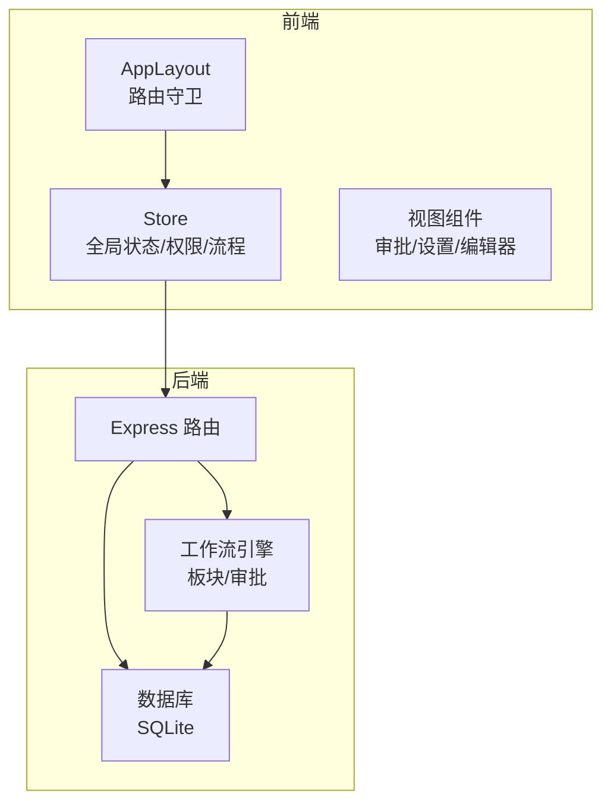
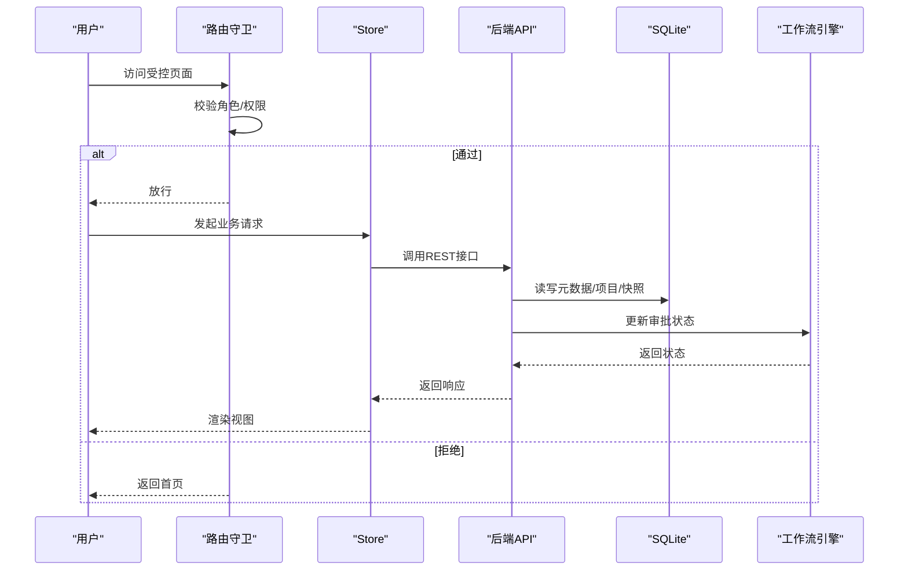
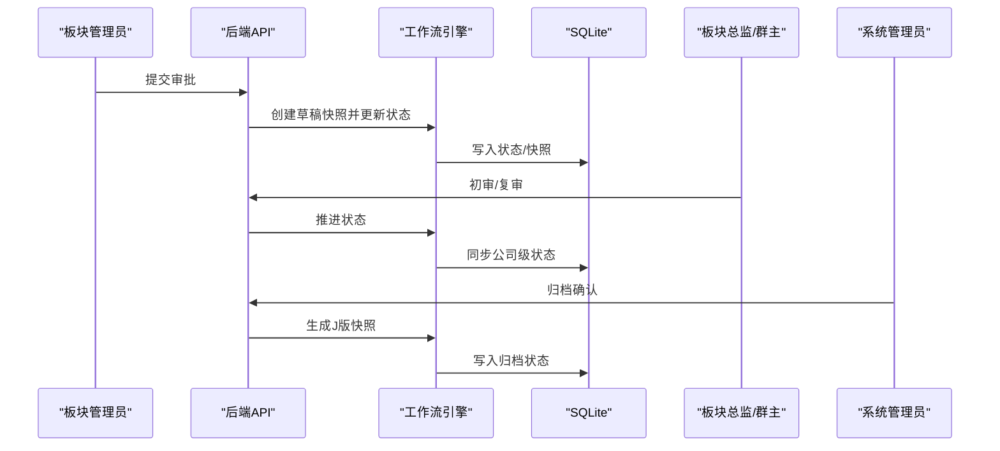
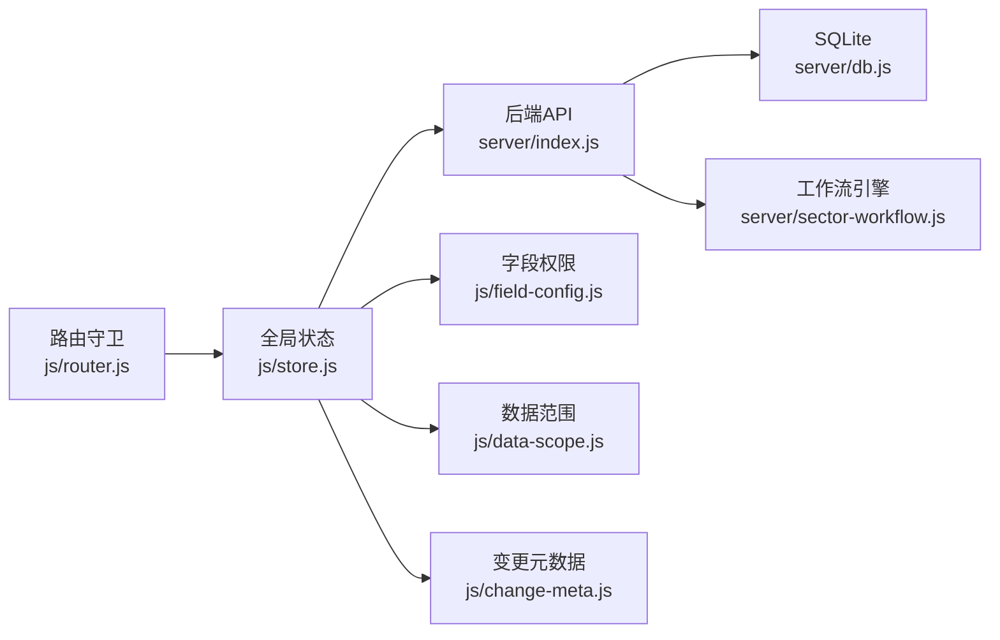

# 角色管理

<cite>
**本文引用的文件**
- [server/index.js](file://server/index.js)
- [server/db.js](file://server/db.js)
- [server/sector-workflow.js](file://server/sector-workflow.js)
- [js/store.js](file://js/store.js)
- [js/router.js](file://js/router.js)
- [js/data-scope.js](file://js/data-scope.js)
- [js/field-config.js](file://js/field-config.js)
- [js/views/AdminSettings.js](file://js/views/AdminSettings.js)
- [js/views/Approval.js](file://js/views/Approval.js)
- [js/components/SystemAdminApprovalBoard.js](file://js/components/SystemAdminApprovalBoard.js)
- [js/components/SystemAdminSectorDock.js](file://js/components/SystemAdminSectorDock.js)
- [js/components/ApprovalReviewSheet.js](file://js/components/ApprovalReviewSheet.js)
- [js/change-meta.js](file://js/change-meta.js)
</cite>

## 目录
1. [简介](#简介)
2. [项目结构](#项目结构)
3. [核心组件](#核心组件)
4. [架构总览](#架构总览)
5. [详细组件分析](#详细组件分析)
6. [依赖分析](#依赖分析)
7. [性能考量](#性能考量)
8. [故障排查指南](#故障排查指南)
9. [结论](#结论)
10. [附录](#附录)

## 简介
本文件系统性梳理项目中的角色管理体系，明确四大核心角色（系统管理员、板块管理员、项目经理、财务人员）的职责边界、权限范围与交互关系；阐述“十二板块”角色编码体系与组织架构的对应方式；说明角色初始化流程、状态管理与审批流程中的流转规则；并提供角色配置示例、权限矩阵与最佳实践，以及安全策略与审计方法。

## 项目结构
角色管理涉及前后端协同：
- 服务端负责角色元数据、板块与审批流程状态持久化、审批接口与审计日志。
- 前端负责基于角色的导航与页面访问控制、字段编辑权限控制、审批流程视图与板块进度看板。

图表来源
- [js/router.js:85-132](file://js/router.js#L85-L132)
- [js/store.js:268-287](file://js/store.js#L268-L287)
- [server/index.js:88-100](file://server/index.js#L88-L100)
- [server/db.js:144-168](file://server/db.js#L144-L168)

章节来源
- [js/router.js:85-132](file://js/router.js#L85-L132)
- [js/store.js:268-287](file://js/store.js#L268-L287)
- [server/index.js:88-100](file://server/index.js#L88-L100)
- [server/db.js:144-168](file://server/db.js#L144-L168)

## 核心组件
- 角色与权限模型
  - 角色类型：system_admin、executive_viewer、sector_admin、pm、sector_director、group_leader。
  - 数据范围：公司级、板块级、项目群级只读角色（executive_viewer）。
  - 字段编辑权限：依据字段来源类型（system_sync、auto_calc、manual_input）与报告月时间窗、锁定期、角色决定可编辑性。
- 板块与审批
  - 十二板块编码（SAS170、SAS610、SAS680、SAS650、SAS710、SAS690、SAS720、SAS670、SAS520、SAS560、SAS550、SAS530）。
  - 审批四阶段：Draft（提交）、Approve1（板块总监初审）、Approve2（项目群群主复审）、J版（公司归档）。
- 管理与审计
  - 管理员设置界面支持板块管理员配置、周期与锁定控制、初始数据导入。
  - 审计日志记录关键操作与字段变更。

章节来源
- [js/field-config.js:1-262](file://js/field-config.js#L1-L262)
- [js/data-scope.js:1-73](file://js/data-scope.js#L1-L73)
- [server/sector-workflow.js:3-273](file://server/sector-workflow.js#L3-L273)
- [js/views/AdminSettings.js:1-404](file://js/views/AdminSettings.js#L1-L404)

## 架构总览
角色与权限在前端与后端的协作链路如下：

图表来源
- [js/router.js:85-132](file://js/router.js#L85-L132)
- [js/store.js:66-93](file://js/store.js#L66-L93)
- [server/index.js:198-218](file://server/index.js#L198-L218)
- [server/db.js:93-106](file://server/db.js#L93-L106)
- [server/sector-workflow.js:232-248](file://server/sector-workflow.js#L232-L248)

## 详细组件分析

### 角色定义与职责边界
- 系统管理员（system_admin）
  - 职责：全公司归档、刷新平台数据、管理用户与字段字典、查看审计日志。
  - 权限：最高权限，可覆盖系统同步字段、跨板块查看与操作、管理设置。
- 板块管理员（sector_admin）
  - 职责：汇总本板块PM填报、提交审批、查看板块变更。
  - 权限：本板块项目数据只读（审批期间可对比快照）、提交审批、查看变更。
- 项目经理（pm）
  - 职责：维护所负责项目的追踪表数据。
  - 权限：仅能编辑自身项目，遵循报告月时间窗与锁定期。
- 财务人员（finance）
  - 职责：财务核查（回款/开票等字段在特定时期只读）。
  - 权限：财务关注字段在报告月当月只读，其他角色可编辑。
- 经营管理（executive_viewer）
  - 职责：按数据范围（公司/板块/项目群）只读查看。
  - 权限：仅只读，无审批、编辑、管理权限。
- 板块总监（sector_director）
  - 职责：初审本板块审批。
  - 权限：在特定阶段可审批或驳回。
- 项目群群主（group_leader）
  - 职责：复审本板块审批。
  - 权限：在特定阶段可审批或驳回。

章节来源
- [js/router.js:97-129](file://js/router.js#L97-L129)
- [js/data-scope.js:13-42](file://js/data-scope.js#L13-L42)
- [js/field-config.js:104-122](file://js/field-config.js#L104-L122)
- [js/views/Approval.js:9-46](file://js/views/Approval.js#L9-L46)

### 角色编码体系与组织架构对应
- 十二板块编码
  - 默认注册板块：SAS170、SAS610、SAS680、SAS650、SAS710、SAS690、SAS720、SAS670、SAS520、SAS560、SAS550、SAS530。
  - 名称映射：每个板块有中文名称，支持动态覆盖。
- 与组织架构的对应
  - 系统管理员与板块管理员由平台全局权限自动带入，本系统仅维护各项目执行板块的板块管理员。
  - 项目群、经营管理范围、总监/群主等权限沿用平台原有组织与权限配置。

章节来源
- [server/sector-workflow.js:3-23](file://server/sector-workflow.js#L3-L23)
- [server/sector-workflow.js:84-105](file://server/sector-workflow.js#L84-L105)
- [js/views/AdminSettings.js:344-384](file://js/views/AdminSettings.js#L344-L384)

### 角色初始化流程
- 默认用户与角色
  - 系统启动时确保默认元数据存在，包括默认用户清单（含系统管理员、板块管理员、项目经理、板块总监、项目群主等）。
- 角色状态迁移
  - 首次启动或迁移时，根据历史状态与项目数据生成板块注册表与审批流状态，并确保名称映射存在。

章节来源
- [server/db.js:144-169](file://server/db.js#L144-L169)
- [server/db.js:81-91](file://server/db.js#L81-L91)
- [server/sector-workflow.js:119-186](file://server/sector-workflow.js#L119-L186)

### 角色状态管理
- 锁定状态
  - 基于报告月与配置计算锁定状态，支持自动解锁与手动锁定。
- 审批状态
  - 板块级审批状态（draft/approve1/approve2）与公司级归档状态（pending/final）联动。
- 用户与板块管理员配置
  - 管理员可维护用户清单与板块管理员配置，支持跳过总监初审的开关。

章节来源
- [server/db.js:121-142](file://server/db.js#L121-L142)
- [server/db.js:194-266](file://server/db.js#L194-L266)
- [server/index.js:661-702](file://server/index.js#L661-L702)
- [js/views/AdminSettings.js:343-385](file://js/views/AdminSettings.js#L343-L385)

### 角色继承机制
- 前端路由与页面访问控制
  - 路由守卫根据角色限制访问路径，如pm/executive_viewer不能访问审批/审计/管理/字段配置。
- 字段编辑权限继承
  - 字段配置模块根据角色、锁定期、报告月时间窗与字段来源类型继承编辑权限。
- 数据范围继承
  - 数据范围模块按角色与配置过滤项目集合（pm按PM姓名过滤，sector_admin按板块过滤，executive_viewer按公司/板块/项目群过滤）。

章节来源
- [js/router.js:97-129](file://js/router.js#L97-L129)
- [js/field-config.js:104-122](file://js/field-config.js#L104-L122)
- [js/data-scope.js:13-42](file://js/data-scope.js#L13-L42)

### 角色在审批流程中的作用与流转规则
- 流程四阶段
  - Draft：板块管理员提交，生成草稿快照。
  - Approve1：板块总监初审，若板块管理员同时具备总监权限则可跳过。
  - Approve2：项目群群主复审，完成后该板块审批完成。
  - J版：系统管理员归档，生成全局J版快照。
- 角色动作
  - 板块管理员：提交审批、推进/驳回审批（受状态与提交标志约束）。
  - 板块总监/群主：在指定阶段推进/驳回。
  - 系统管理员：推进至J版并生成归档快照。

图表来源
- [server/index.js:302-346](file://server/index.js#L302-L346)
- [server/index.js:348-385](file://server/index.js#L348-L385)
- [server/index.js:387-417](file://server/index.js#L387-L417)
- [server/index.js:419-446](file://server/index.js#L419-L446)
- [server/sector-workflow.js:232-248](file://server/sector-workflow.js#L232-L248)

章节来源
- [js/views/Approval.js:9-46](file://js/views/Approval.js#L9-L46)
- [js/views/Approval.js:183-227](file://js/views/Approval.js#L183-L227)
- [js/components/SystemAdminApprovalBoard.js:1-86](file://js/components/SystemAdminApprovalBoard.js#L1-L86)

### 角色配置示例
- 板块管理员配置
  - 在“管理设置”中为每个板块配置管理员姓名、平台用户ID，并可勾选“跳过总监初审”以优化流程。
- 用户与权限配置
  - 管理员可批量维护用户清单与群组注册表，系统将据此生成默认角色与数据范围。

章节来源
- [js/views/AdminSettings.js:343-385](file://js/views/AdminSettings.js#L343-L385)
- [server/index.js:661-702](file://server/index.js#L661-L702)

### 角色权限矩阵（字段编辑）
- 字段来源类型
  - system_sync：工程平台引用列，默认只读，系统管理员可在报告月当月覆盖。
  - auto_calc：自动计算列，只读。
  - manual_input：手工录入列，按角色与时间窗决定可编辑性。
- 编辑规则摘要
  - 月度完成（AV–BG）：报告月当月及之后可写（含系统管理员）。
  - 月度开票/回款（BH–CE）：仅报告月之后可写（当月为工程平台引用，只读）。
  - 其他手工列：按角色+锁定期；系统管理员在锁定期仍可写；板块总监/群主/经营管理始终只读。

章节来源
- [js/field-config.js:7-15](file://js/field-config.js#L7-L15)
- [js/field-config.js:60-68](file://js/field-config.js#L60-L68)
- [js/field-config.js:104-122](file://js/field-config.js#L104-L122)

### 角色管理最佳实践
- 明确角色边界：仅维护执行板块的板块管理员，其他角色由平台统一授权。
- 合理使用“跳过总监初审”：仅在板块管理员同时具备总监权限时启用，避免绕过质量控制。
- 严格控制字段编辑：利用字段来源类型与时间窗规则，减少错误录入。
- 审计留痕：所有关键操作均写入审计日志，便于追溯。
- 锁定策略：结合报告月与自动解锁配置，保障数据一致性。

章节来源
- [js/views/AdminSettings.js:344-384](file://js/views/AdminSettings.js#L344-L384)
- [server/index.js:198-218](file://server/index.js#L198-L218)
- [js/store.js:338-342](file://js/store.js#L338-L342)

### 角色安全策略与审计方法
- 安全策略
  - 路由守卫限制敏感页面访问；系统管理员与板块管理员可刷新平台数据；字段编辑严格按角色与时间窗控制。
- 审计方法
  - 审计日志记录关键操作（如PM提交、板块审批推进/驳回、系统归档、用户与字段字典变更等）。
  - 变更元数据记录字段变更历史，支持批注与版本对比。

章节来源
- [js/router.js:97-129](file://js/router.js#L97-L129)
- [server/index.js:170-182](file://server/index.js#L170-L182)
- [server/index.js:661-702](file://server/index.js#L661-L702)
- [js/change-meta.js:79-151](file://js/change-meta.js#L79-L151)

## 依赖分析
角色管理的关键依赖关系如下：

图表来源
- [js/router.js:85-132](file://js/router.js#L85-L132)
- [js/store.js:268-287](file://js/store.js#L268-L287)
- [server/index.js:88-100](file://server/index.js#L88-L100)
- [server/db.js:144-169](file://server/db.js#L144-L169)
- [server/sector-workflow.js:188-221](file://server/sector-workflow.js#L188-L221)
- [js/field-config.js:104-122](file://js/field-config.js#L104-L122)
- [js/data-scope.js:13-42](file://js/data-scope.js#L13-L42)
- [js/change-meta.js:79-151](file://js/change-meta.js#L79-L151)

章节来源
- [js/router.js:85-132](file://js/router.js#L85-L132)
- [js/store.js:268-287](file://js/store.js#L268-L287)
- [server/index.js:88-100](file://server/index.js#L88-L100)
- [server/db.js:144-169](file://server/db.js#L144-L169)
- [server/sector-workflow.js:188-221](file://server/sector-workflow.js#L188-L221)
- [js/field-config.js:104-122](file://js/field-config.js#L104-L122)
- [js/data-scope.js:13-42](file://js/data-scope.js#L13-L42)
- [js/change-meta.js:79-151](file://js/change-meta.js#L79-L151)

## 性能考量
- 前端状态缓存：Store一次性加载bootstrap数据，减少重复请求。
- 快照版本管理：仅保留必要版本，避免冗余快照占用存储。
- 审计日志截断：限制日志数量，防止膨胀。

## 故障排查指南
- 页面访问被拒绝
  - 检查当前用户角色是否满足目标页面的权限要求（如pm不能访问审批/审计/管理/字段配置）。
- 字段无法编辑
  - 确认字段来源类型、报告月时间窗、锁定期与角色是否满足编辑条件。
- 审批按钮不可用
  - 检查板块审批状态与提交标志，确认当前角色在该阶段是否有审批权限。
- 审计日志缺失
  - 确认当前角色是否为系统管理员（非系统管理员登录时审计日志会被清空）。

章节来源
- [js/router.js:97-129](file://js/router.js#L97-L129)
- [js/field-config.js:104-122](file://js/field-config.js#L104-L122)
- [js/views/Approval.js:107-129](file://js/views/Approval.js#L107-L129)
- [js/store.js:163-167](file://js/store.js#L163-L167)

## 结论
本角色管理体系以“板块+审批”为核心，结合“字段来源类型+报告月时间窗+锁定期”的权限矩阵，实现了精细化的权限控制与可追溯的审计能力。通过明确四大核心角色的职责边界与流转规则，辅以“跳过总监初审”等灵活配置，既保证了流程效率，又维持了质量控制与合规性。

## 附录
- 角色与页面访问对照
  - system_admin：全部页面
  - sector_admin：编辑器、审批（本板块）、审计（系统管理员限定）
  - pm：编辑器（仅自身项目）
  - sector_director/group_leader：审批（本板块）
  - executive_viewer：仅只读（按数据范围）
- 关键接口与功能
  - 管理设置：板块管理员配置、周期与锁定控制、初始数据导入。
  - 审批流程：提交审批、推进/驳回、系统归档。
  - 字段字典：读写字段定义（系统管理员）。

章节来源
- [js/router.js:97-129](file://js/router.js#L97-L129)
- [js/views/AdminSettings.js:1-404](file://js/views/AdminSettings.js#L1-L404)
- [js/views/Approval.js:183-227](file://js/views/Approval.js#L183-L227)
- [server/index.js:661-702](file://server/index.js#L661-L702)