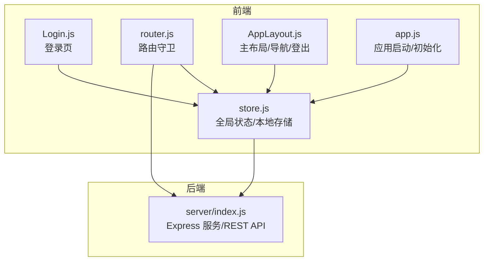
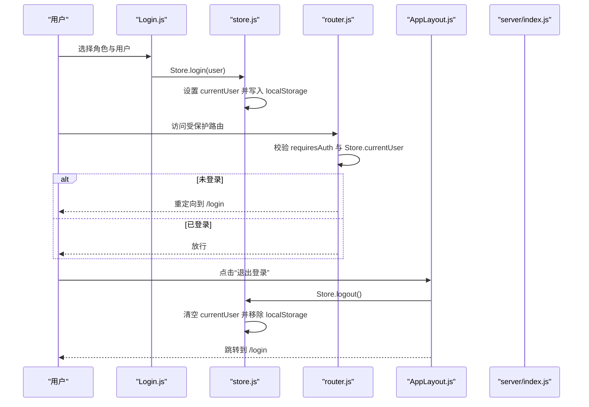
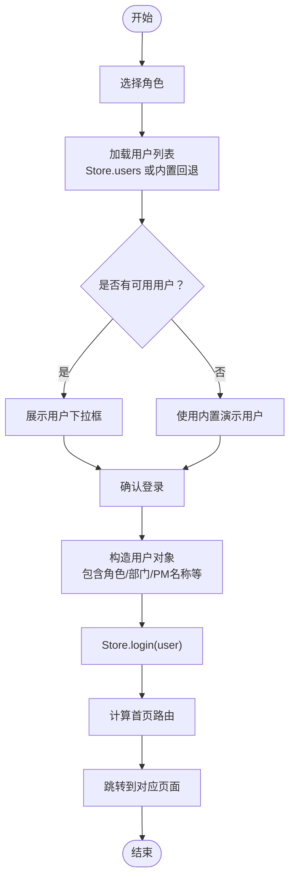
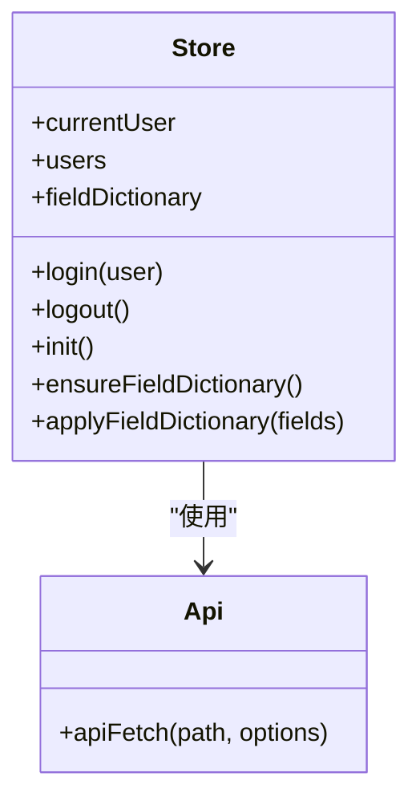
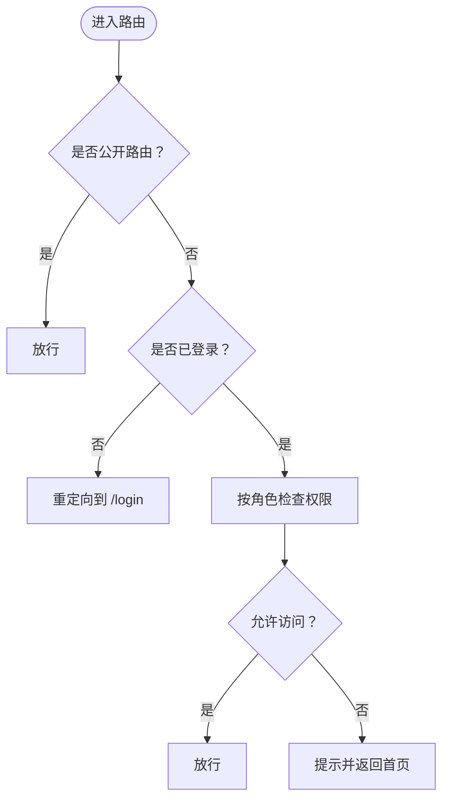
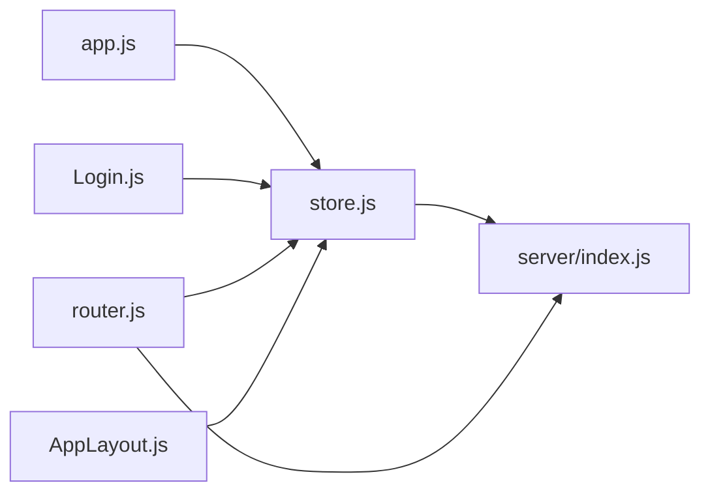

# 用户认证

<cite>
**本文引用的文件**
- [Login.js](file://js/views/Login.js)
- [store.js](file://js/store.js)
- [router.js](file://js/router.js)
- [AppLayout.js](file://js/components/AppLayout.js)
- [index.js](file://server/index.js)
- [app.js](file://js/app.js)
- [data-scope.js](file://js/data-scope.js)
- [field-config.js](file://js/field-config.js)
- [package.json](file://package.json)
</cite>

## 目录
1. [简介](#简介)
2. [项目结构](#项目结构)
3. [核心组件](#核心组件)
4. [架构总览](#架构总览)
5. [详细组件分析](#详细组件分析)
6. [依赖关系分析](#依赖关系分析)
7. [性能考量](#性能考量)
8. [故障排除指南](#故障排除指南)
9. [结论](#结论)
10. [附录](#附录)

## 简介
本文件面向“用户认证系统”的前端与后端实现，聚焦以下目标：
- 登录组件（Login.js）的身份验证流程、用户凭据处理与会话管理
- 前端状态管理（store.js）中的用户信息存储机制、localStorage 使用策略与用户状态持久化
- 认证流程：角色选择、用户选择、登录成功后的路由跳转与权限控制
- 失败处理、错误提示机制与安全防护措施
- 认证配置选项、自定义认证方式与第三方集成指南
- 最佳实践、安全建议与故障排除方法

## 项目结构
本项目采用前后端分离的单页应用（SPA）架构：
- 前端基于 Vue 生态（Vue + Vue Router + Element UI），通过 fetch 与后端 API 交互
- 后端基于 Node.js + Express，使用 better-sqlite3 作为数据存储，提供 RESTful API
- 认证与会话：前端以 localStorage 存储当前用户信息，后端不强制要求 JWT 或会话服务器，而是通过前端 Store 维护全局状态并在需要时与后端同步

图表来源
- [Login.js:52-129](file://js/views/Login.js#L52-L129)
- [store.js:97-128](file://js/store.js#L97-L128)
- [router.js:84-132](file://js/router.js#L84-L132)
- [AppLayout.js:91-98](file://js/components/AppLayout.js#L91-L98)
- [index.js:91-100](file://server/index.js#L91-L100)

章节来源
- [Login.js:1-215](file://js/views/Login.js#L1-L215)
- [store.js:1-602](file://js/store.js#L1-L602)
- [router.js:1-137](file://js/router.js#L1-L137)
- [AppLayout.js:1-240](file://js/components/AppLayout.js#L1-L240)
- [index.js:1-775](file://server/index.js#L1-L775)
- [app.js:1-47](file://js/app.js#L1-L47)

## 核心组件
- 登录组件（Login.js）
  - 提供角色选择与用户选择两步式登录流程
  - 依据用户选择构造用户对象并调用 Store.login 完成登录
  - 根据角色决定首页路由（editor 或 approval）

- 全局状态与本地存储（store.js）
  - 使用 Vue.observable 维护全局状态（currentUser、users、字段字典等）
  - 使用 localStorage 持久化当前用户与侧边栏折叠状态
  - 提供 login/logout 方法，以及与后端 API 的交互封装

- 路由守卫（router.js）
  - 控制页面访问权限：公开页面（如 /login）无需认证，其余页面需认证
  - 基于角色限制访问特定路由（如 /admin、/fields、/audit）
  - 未登录访问受保护路由时重定向到 /login

- 主布局与登出（AppLayout.js）
  - 显示当前用户角色与名称
  - 提供“切换角色”“退出登录”等入口
  - 调用 Store.logout 清除用户状态并跳转到登录页

- 应用启动（app.js）
  - 初始化 Vue 应用前先调用 Store.init 拉取后端引导数据
  - 若初始化失败，显示错误提示并引导用户正确启动服务

章节来源
- [Login.js:52-129](file://js/views/Login.js#L52-L129)
- [store.js:97-128](file://js/store.js#L97-L128)
- [router.js:84-132](file://js/router.js#L84-L132)
- [AppLayout.js:91-98](file://js/components/AppLayout.js#L91-L98)
- [app.js:30-44](file://js/app.js#L30-L44)

## 架构总览
认证与会话的整体流程如下：
- 用户访问 /login，选择角色与用户
- 点击“进入系统”，Login.js 调用 Store.login(user)
- Store.login 将用户写入全局状态并持久化到 localStorage
- 路由守卫根据 Store.currentUser 决定是否放行
- 用户访问受保护路由时，若未登录则被重定向到 /login
- 用户点击“退出登录”，AppLayout 调用 Store.logout 清除状态并跳转

图表来源
- [Login.js:111-123](file://js/views/Login.js#L111-L123)
- [store.js:290-308](file://js/store.js#L290-L308)
- [router.js:84-132](file://js/router.js#L84-L132)
- [AppLayout.js:91-98](file://js/components/AppLayout.js#L91-L98)
- [index.js:91-100](file://server/index.js#L91-L100)

## 详细组件分析

### 登录组件（Login.js）分析
- 角色与用户数据来源
  - 角色列表在组件内部定义，支持系统管理员、经营管理（只读）、板块管理员、项目经理、板块总监、项目群群主
  - 用户列表优先从 Store.users 获取，若为空则回退到组件内置的演示用户集合
- 用户选择逻辑
  - 选择角色后进入第二步，展示该角色下的可用用户
  - 用户选项标签会根据角色类型（如经营管理只读）显示数据范围标签
- 登录流程
  - 构造用户对象（包含 name、role、sector 等），项目经理角色额外设置 pmName
  - 调用 Store.login 完成登录
  - 根据角色计算首页路由（sector_director/group_leader 跳转 /approval，其他跳转 /editor）

图表来源
- [Login.js:62-123](file://js/views/Login.js#L62-L123)

章节来源
- [Login.js:52-129](file://js/views/Login.js#L52-L129)

### 前端状态管理（store.js）分析
- 用户信息存储机制
  - 通过 localStorage 键“ptrack_user”持久化当前用户
  - 页面加载时尝试从 localStorage 恢复用户状态
- 用户状态持久化
  - Store.login 将用户写入 Store.currentUser 并持久化到 localStorage
  - Store.logout 清空 Store.currentUser 并移除 localStorage 中的用户键
- 与后端 API 的交互
  - apiFetch 封装了 /api 前缀与错误处理，统一处理 404、HTML 错误与 JSON 错误
  - Store.init 拉取后端引导数据（bootstrap），并确保字段字典加载
- 会话管理
  - 本项目采用“前端状态 + localStorage”的会话模型：用户信息存储在 localStorage，路由守卫基于 Store.currentUser 判断是否放行
  - 未发现后端会话或令牌（如 JWT）的使用

图表来源
- [store.js:97-128](file://js/store.js#L97-L128)
- [store.js:66-93](file://js/store.js#L66-L93)

章节来源
- [store.js:1-602](file://js/store.js#L1-L602)

### 路由守卫与权限控制（router.js）分析
- 公开路由
  - /login 不需要认证，直接放行
- 受保护路由
  - 除公开路由外均需认证：若未登录则重定向到 /login
- 角色权限
  - /admin、/fields 仅系统管理员可访问
  - /audit 仅系统管理员可访问
  - 项目经理禁止访问 /approval、/audit、/admin、/fields
  - 经营管理（只读）禁止访问 /approval、/audit、/admin、/fields
  - 板块总监/项目群群主仅允许访问 /approval

图表来源
- [router.js:84-132](file://js/router.js#L84-L132)

章节来源
- [router.js:1-137](file://js/router.js#L1-L137)

### 主布局与登出（AppLayout.js）分析
- 用户信息展示
  - 显示当前用户名称与角色，若为经营管理（只读）角色，还会显示数据范围标签
- 导航菜单
  - 根据角色动态过滤可访问的菜单项
- 登出流程
  - 弹窗确认后调用 Store.logout 清空用户状态并跳转到 /login

章节来源
- [AppLayout.js:1-240](file://js/components/AppLayout.js#L1-L240)

### 应用启动与错误处理（app.js）
- 应用启动
  - Store.init 拉取后端引导数据后再挂载 Vue
- 错误处理
  - 若初始化失败，渲染错误提示，指导用户正确安装与启动服务

章节来源
- [app.js:30-44](file://js/app.js#L30-L44)

### 后端 API 与数据范围（server/index.js、data-scope.js）
- 后端 API
  - 提供 /api/bootstrap、/api/fields 等只读接口，以及 /api/admin/* 管理接口
  - 本项目前端未使用后端登录/令牌接口，认证主要由前端完成
- 数据范围控制
  - data-scope.js 定义了不同角色的数据范围过滤逻辑（公司/板块/项目群）
  - field-config.js 定义了字段级别的编辑权限矩阵，结合 reportMonth 与 lockStatus 控制可编辑性

章节来源
- [index.js:91-100](file://server/index.js#L91-L100)
- [data-scope.js:1-41](file://js/data-scope.js#L1-L41)
- [field-config.js:1-262](file://js/field-config.js#L1-L262)

## 依赖关系分析
- 前端依赖
  - Vue + Vue Router + Element UI（用于界面与路由）
  - better-sqlite3、express（后端依赖，前端通过 /api 调用）
- 关键依赖链
  - app.js -> Store.init -> apiFetch -> server/index.js
  - router.js -> Store.currentUser -> 登录状态判断
  - Login.js -> Store.login -> localStorage
  - AppLayout.js -> Store.logout -> localStorage

图表来源
- [app.js:30-31](file://js/app.js#L30-L31)
- [store.js:268-275](file://js/store.js#L268-L275)
- [router.js:84-93](file://js/router.js#L84-L93)
- [Login.js:120-122](file://js/views/Login.js#L120-L122)
- [AppLayout.js:95-97](file://js/components/AppLayout.js#L95-L97)
- [index.js:91-100](file://server/index.js#L91-L100)

章节来源
- [package.json:13-17](file://package.json#L13-L17)
- [app.js:30-31](file://js/app.js#L30-L31)
- [store.js:66-93](file://js/store.js#L66-L93)
- [router.js:84-132](file://js/router.js#L84-L132)
- [Login.js:111-123](file://js/views/Login.js#L111-L123)
- [AppLayout.js:91-98](file://js/components/AppLayout.js#L91-L98)
- [index.js:91-100](file://server/index.js#L91-L100)

## 性能考量
- 前端状态与本地存储
  - Store 使用 Vue.observable，避免不必要的响应式开销
  - localStorage 仅存储用户信息与侧边栏状态，体积小，读写开销低
- API 调用
  - apiFetch 统一封装请求与错误处理，减少重复代码
  - Store.init 一次性拉取引导数据，后续通过增量 API 更新
- 路由守卫
  - 基于内存状态判断，无需网络请求，延迟极低

[本节为通用性能讨论，不直接分析具体文件]

## 故障排除指南
- 初始化失败
  - 现象：应用启动时报错，提示无法加载数据
  - 排查：确认已执行 npm install 与 npm start，服务端端口 3000 正常运行
  - 参考：app.js 中的错误渲染逻辑
- 404 或接口不存在
  - 现象：后端返回 404，提示接口不存在
  - 排查：确认服务已重启，某些 /admin/* 接口需服务端支持
  - 参考：store.js 中 apiFetch 的错误处理
- 登录后仍被重定向到 /login
  - 现象：登录成功后访问受保护路由被重定向
  - 排查：检查 Store.currentUser 是否存在；确认路由守卫逻辑
  - 参考：router.js 的导航守卫
- 退出登录无效
  - 现象：点击退出后仍显示已登录
  - 排查：确认 AppLayout.js 的登出流程与 Store.logout 是否执行
  - 参考：AppLayout.js 与 store.js 的 logout 实现

章节来源
- [app.js:32-44](file://js/app.js#L32-L44)
- [store.js:66-93](file://js/store.js#L66-L93)
- [router.js:84-93](file://js/router.js#L84-L93)
- [AppLayout.js:91-98](file://js/components/AppLayout.js#L91-L98)

## 结论
本项目采用“前端状态 + localStorage”的轻量认证方案：
- 登录组件负责角色与用户选择，Store.login 完成状态持久化
- 路由守卫基于 Store.currentUser 控制访问权限
- 后端提供只读 API 与管理接口，前端通过 /api 与之交互
- 未使用后端会话或令牌，简化了部署与集成复杂度，适合原型演示与内网场景

[本节为总结性内容，不直接分析具体文件]

## 附录

### 认证流程要点清单
- 登录组件
  - 角色选择与用户选择
  - 构造用户对象并调用 Store.login
  - 根据角色计算首页路由
- 前端状态与本地存储
  - Store.login 持久化用户信息
  - Store.logout 清空用户信息
- 路由守卫
  - 公开路由无需认证
  - 受保护路由需认证
  - 角色权限严格限制
- 后端 API
  - 提供 /api/bootstrap、/api/fields 等只读接口
  - 管理接口（/api/admin/*）用于开发测试与配置

章节来源
- [Login.js:111-123](file://js/views/Login.js#L111-L123)
- [store.js:290-308](file://js/store.js#L290-L308)
- [router.js:84-132](file://js/router.js#L84-L132)
- [index.js:91-100](file://server/index.js#L91-L100)