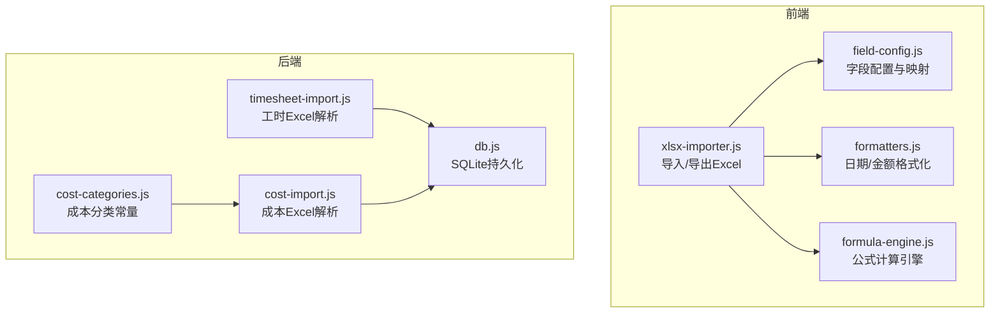
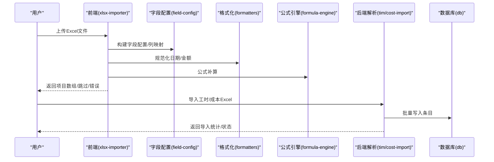
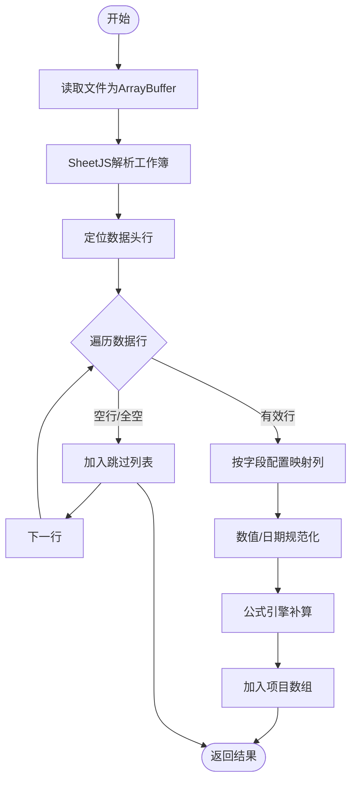
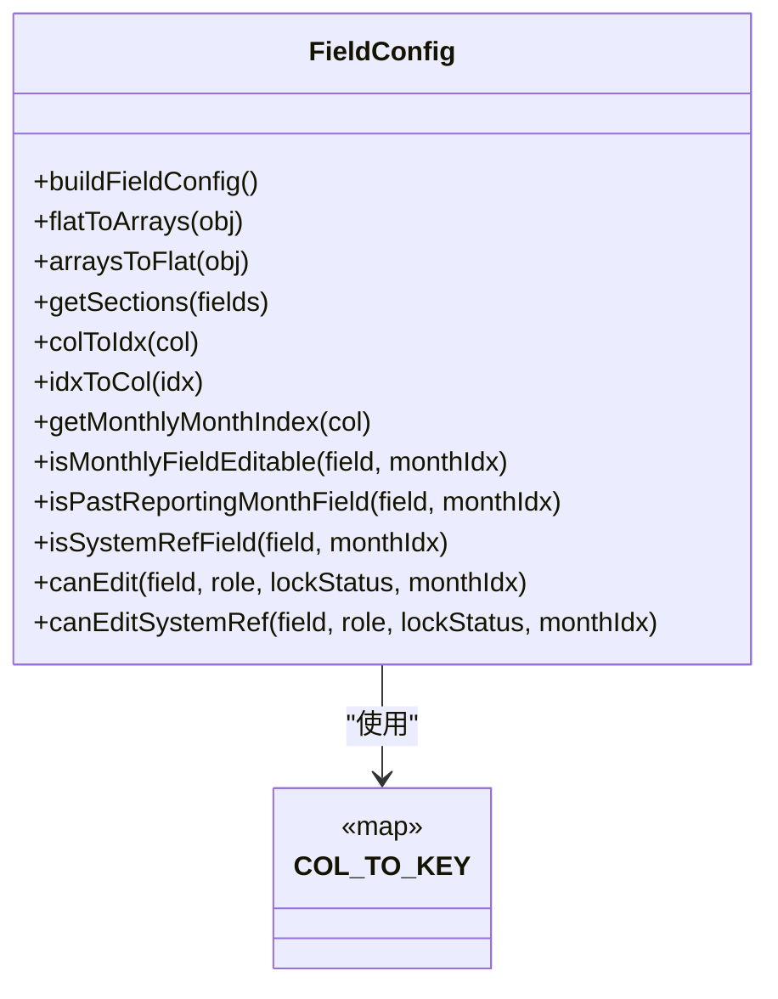
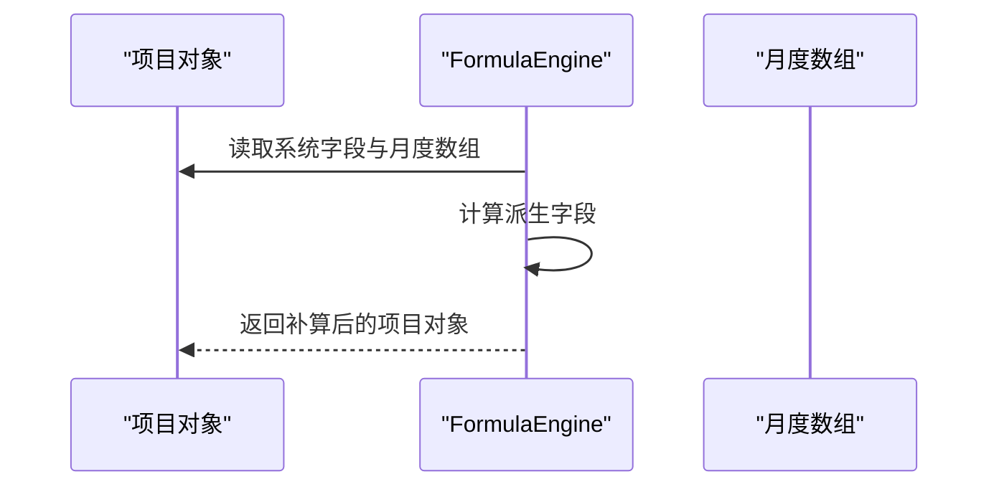
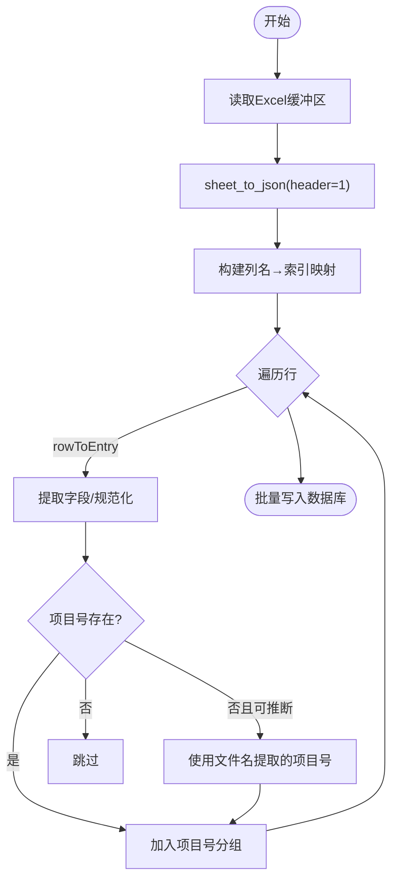
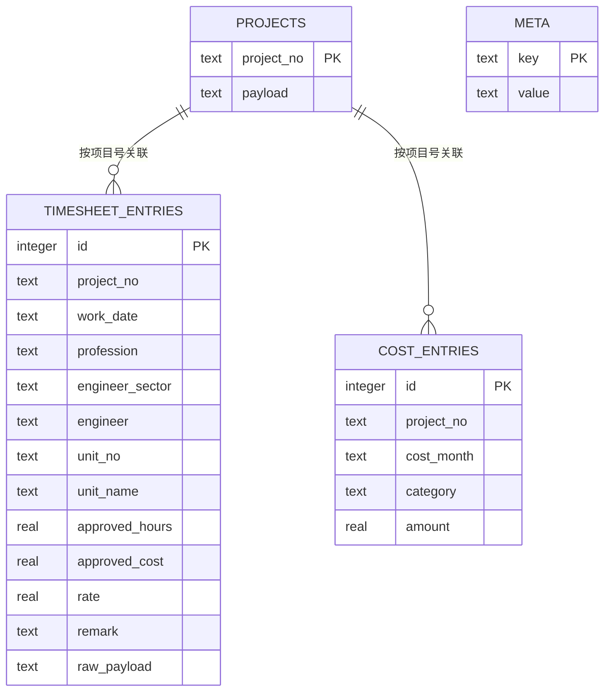
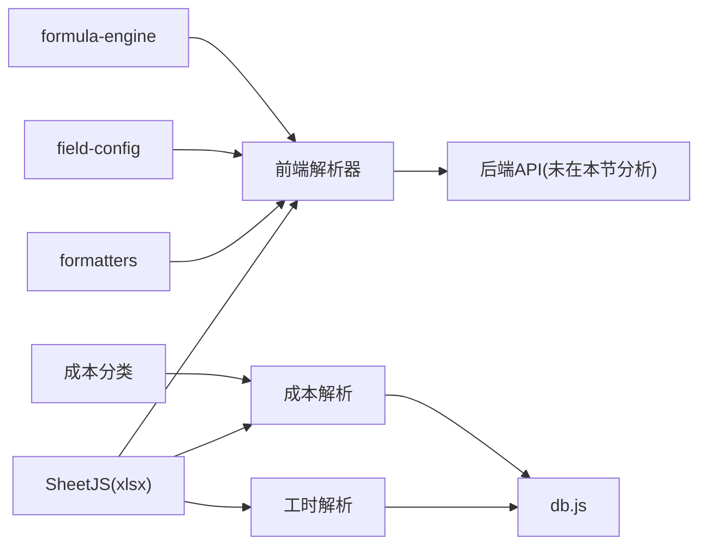

# Excel数据处理

<cite>
**本文引用的文件**
- [xlsx-importer.js](file://js/xlsx-importer.js)
- [formatters.js](file://js/formatters.js)
- [field-config.js](file://js/field-config.js)
- [formula-engine.js](file://js/formatters.js)
- [timesheet-import.js](file://server/timesheet-import.js)
- [cost-import.js](file://server/cost-import.js)
- [cost-categories.js](file://server/cost-categories.js)
- [db.js](file://server/db.js)
- [fields.json](file://config/fields/fields.json)
- [fields-data.js](file://config/fields/fields-data.js)
- [package.json](file://package.json)
</cite>

## 目录
1. [简介](#简介)
2. [项目结构](#项目结构)
3. [核心组件](#核心组件)
4. [架构总览](#架构总览)
5. [详细组件分析](#详细组件分析)
6. [依赖关系分析](#依赖关系分析)
7. [性能考量](#性能考量)
8. [故障排查指南](#故障排查指南)
9. [结论](#结论)
10. [附录](#附录)

## 简介
本文件面向“Excel数据处理”模块，系统性阐述从Excel文件导入到后端存储的全流程：文件格式识别、数据结构映射、字段验证与清洗、格式转换与公式计算、错误处理与完整性检查、以及与后端API的数据传输协议与一致性保障。同时给出支持的Excel版本范围、字段映射配置与导入模板规范、性能优化建议、常见问题与解决方案。

## 项目结构
该模块横跨前端与后端：
- 前端负责Excel导入解析、字段映射、格式标准化与公式补算，并支持导出为Excel。
- 后端负责解析工时与成本两类Excel，写入SQLite数据库，并提供元数据与导入状态管理。



图表来源
- [xlsx-importer.js:1-186](file://js/xlsx-importer.js#L1-L186)
- [field-config.js:1-262](file://js/field-config.js#L1-L262)
- [formatters.js:1-167](file://js/formatters.js#L1-L167)
- [formula-engine.js:1-105](file://js/formula-engine.js#L1-L105)
- [timesheet-import.js:1-178](file://server/timesheet-import.js#L1-L178)
- [cost-import.js:1-157](file://server/cost-import.js#L1-L157)
- [db.js:1-525](file://server/db.js#L1-L525)
- [cost-categories.js:1-16](file://server/cost-categories.js#L1-L16)

章节来源
- [xlsx-importer.js:1-186](file://js/xlsx-importer.js#L1-L186)
- [field-config.js:1-262](file://js/field-config.js#L1-L262)
- [formatters.js:1-167](file://js/formatters.js#L1-L167)
- [formula-engine.js:1-105](file://js/formula-engine.js#L1-L105)
- [timesheet-import.js:1-178](file://server/timesheet-import.js#L1-L178)
- [cost-import.js:1-157](file://server/cost-import.js#L1-L157)
- [db.js:1-525](file://server/db.js#L1-L525)
- [cost-categories.js:1-16](file://server/cost-categories.js#L1-L16)

## 核心组件
- 前端Excel导入器：读取File对象，解析工作簿，定位数据头行，按字段配置映射为项目数组，执行公式补算，输出结果与错误集合。
- 字段配置与映射：定义列字母到字段键的映射、分组、权限与渲染信息，并提供数组/扁平化转换。
- 格式化工具：统一日期序列号、Date对象与字符串的规范化，金额/百分比/布尔格式化与解析。
- 公式引擎：基于报告月份索引，计算派生字段（合同额、YTD、WIP、应收账款等）。
- 后端解析器（工时/成本）：解析Excel为结构化条目，按项目号聚合，写入SQLite。
- 数据库层：SQLite表结构、索引、事务批量写入与元数据管理。

章节来源
- [xlsx-importer.js:12-186](file://js/xlsx-importer.js#L12-L186)
- [field-config.js:195-260](file://js/field-config.js#L195-L260)
- [formatters.js:65-165](file://js/formatters.js#L65-L165)
- [formula-engine.js:19-83](file://js/formula-engine.js#L19-L83)
- [timesheet-import.js:80-178](file://server/timesheet-import.js#L80-L178)
- [cost-import.js:46-157](file://server/cost-import.js#L46-L157)
- [db.js:16-57](file://server/db.js#L16-L57)

## 架构总览
前端与后端通过“Excel文件”作为数据载体，前端负责“项目执行追踪”主表的导入与导出，后端负责“工时明细”和“成本中心”两类辅助数据的导入与存储。



图表来源
- [xlsx-importer.js:12-186](file://js/xlsx-importer.js#L12-L186)
- [field-config.js:134-155](file://js/field-config.js#L134-L155)
- [formatters.js:65-76](file://js/formatters.js#L65-L76)
- [formula-engine.js:19-83](file://js/formula-engine.js#L19-L83)
- [timesheet-import.js:118-160](file://server/timesheet-import.js#L118-L160)
- [cost-import.js:104-139](file://server/cost-import.js#L104-L139)
- [db.js:385-460](file://server/db.js#L385-L460)

## 详细组件分析

### 组件A：前端Excel导入器（xlsx-importer）
职责与流程
- 文件读取与格式识别：使用FileReader读取ArrayBuffer，借助SheetJS解析为工作簿，读取首个工作表。
- 表头识别：在前若干行中查找包含“项目号/Project No”的行，确定字段名行与数据起始行。
- 行解析与映射：逐行读取，按字段配置COL_TO_KEY映射到项目对象；金额/比率统一数值化；日期通过Formatters规范化；空行/无效行跳过。
- 公式补算：调用FormulaEngine按报告月份索引补算派生字段。
- 输出：返回项目数组、跳过的行号列表、错误列表。



图表来源
- [xlsx-importer.js:12-186](file://js/xlsx-importer.js#L12-L186)
- [field-config.js:195-218](file://js/field-config.js#L195-L218)
- [formatters.js:65-76](file://js/formatters.js#L65-L76)
- [formula-engine.js:19-83](file://js/formula-engine.js#L19-L83)

章节来源
- [xlsx-importer.js:12-186](file://js/xlsx-importer.js#L12-L186)
- [field-config.js:195-218](file://js/field-config.js#L195-L218)
- [formatters.js:65-76](file://js/formatters.js#L65-L76)
- [formula-engine.js:19-83](file://js/formula-engine.js#L19-L83)

### 组件B：字段配置与映射（field-config）
职责与能力
- 列字母到字段键映射（COL_TO_KEY）：覆盖项目基础信息、合同额、完成额、开票回款、财务指标、WIP分析、月度完成/开票/回款等。
- 扁平与数组互转：将mc_0..mc_11、mi_0..mp_11等扁平键合并为monthly_*数组，或反向展开。
- 权限与渲染：生成字段清单，附加可编辑性、Luckysheet渲染参数、列宽等。
- 月度列时间窗：区分“完成额”“开票/回款”不同编辑窗口，结合报告月份索引与锁定状态决定可写性。



图表来源
- [field-config.js:195-260](file://js/field-config.js#L195-L260)

章节来源
- [field-config.js:1-262](file://js/field-config.js#L1-L262)

### 组件C：格式化工具（formatters）
职责与能力
- 日期：Excel序列日（1900基准）↔ ISO日期；支持字符串/数字/Date输入；提供序列日与ISO互转。
- 金额/百分比/布尔：格式化与解析；金额支持“万元”单位与简写。
- 类型化格式化：根据字段数据类型统一输出格式。

```mermaid
flowchart TD
In(["输入值"]) --> CheckNull{"为空/无效?"}
CheckNull --> |是| OutEmpty["输出占位符"]
CheckNull --> |否| Branch{"类型判断"}
Branch --> |Date| ToISO["转ISO日期"]
Branch --> |Number(序列日)| SerialToDate["序列日→日期"]
Branch --> |String| Trim["去空白/截取日期前缀"]
Branch --> |Number/金额| ParseNum["解析为数字"]
ToISO --> Out
SerialToDate --> Out
Trim --> Out
ParseNum --> Out
Out["输出规范化值"]
```

图表来源
- [formatters.js:65-113](file://js/formatters.js#L65-L113)

章节来源
- [formatters.js:1-167](file://js/formatters.js#L1-L167)

### 组件D：公式引擎（formula-engine）
职责与能力
- 输入：原始项目对象（含手工与系统字段）+ 报告月份索引。
- 计算：合同额、不含税金额、YTD完成、始累完成、开票/回款累计、合同差值、WIP/应收账款、催收/催开票、WIP分析等。
- 批量：对项目数组统一补算。



图表来源
- [formula-engine.js:19-83](file://js/formula-engine.js#L19-L83)

章节来源
- [formula-engine.js:1-105](file://js/formula-engine.js#L1-L105)

### 组件E：后端Excel解析（工时/成本）
职责与能力
- 工时明细：从文件名提取项目号，解析表头，逐行提取字段，缺失项目号则尝试从文件名推断；最终按项目号聚合批量写入。
- 成本中心：识别成本分类列，按“月份/总计”行定位表头，逐行抽取各类别金额，生成成本条目并按项目号聚合写入。
- 完整性检查：若已有数据且未强制导入，则拒绝重复导入；记录导入统计与时间戳。



图表来源
- [timesheet-import.js:80-103](file://server/timesheet-import.js#L80-L103)
- [cost-import.js:46-94](file://server/cost-import.js#L46-L94)
- [db.js:385-460](file://server/db.js#L385-L460)

章节来源
- [timesheet-import.js:1-178](file://server/timesheet-import.js#L1-L178)
- [cost-import.js:1-157](file://server/cost-import.js#L1-L157)
- [cost-categories.js:1-16](file://server/cost-categories.js#L1-L16)
- [db.js:385-460](file://server/db.js#L385-L460)

### 组件F：数据库层（db.js）
职责与能力
- 表结构：projects、audit_log、snapshots、meta、timesheet_entries、cost_entries；含必要索引。
- 事务批量写入：替换项目、批量插入工时/成本条目，保证一致性。
- 元数据：周期配置、报告月、锁定状态、审批状态、快照版本等。
- 查询接口：按年份查询工时/成本条目，统计条目数量。



图表来源
- [db.js:16-57](file://server/db.js#L16-L57)

章节来源
- [db.js:1-525](file://server/db.js#L1-L525)

## 依赖关系分析
- 前端依赖：SheetJS（xlsx）用于解析Excel；依赖formatters与field-config进行格式化与字段映射；依赖formula-engine进行公式补算。
- 后端依赖：SheetJS解析Excel；better-sqlite3持久化；成本分类常量；db.js提供统一的数据库访问与事务封装。
- 字段配置：前端与后端共享字段定义（前端以JSON/JS字典形式存在，后端解析Excel时也依赖成本分类等常量）。



图表来源
- [package.json:13-17](file://package.json#L13-L17)
- [xlsx-importer.js:12-186](file://js/xlsx-importer.js#L12-L186)
- [field-config.js:1-262](file://js/field-config.js#L1-L262)
- [formatters.js:1-167](file://js/formatters.js#L1-L167)
- [formula-engine.js:1-105](file://js/formula-engine.js#L1-L105)
- [timesheet-import.js:1-178](file://server/timesheet-import.js#L1-L178)
- [cost-import.js:1-157](file://server/cost-import.js#L1-L157)
- [cost-categories.js:1-16](file://server/cost-categories.js#L1-L16)
- [db.js:1-525](file://server/db.js#L1-L525)

章节来源
- [package.json:1-19](file://package.json#L1-L19)

## 性能考量
- 前端解析
  - 大表读取：使用ArrayBuffer与SheetJS一次性解析，避免多次DOM操作。
  - 逐行映射：按字段配置COL_TO_KEY映射，减少对象拼装开销。
  - 公式补算：批量计算（computeAll）可减少重复初始化。
- 后端解析
  - 批量写入：使用事务（transaction）包裹批量删除/插入，显著降低磁盘IO与锁竞争。
  - 索引优化：对timesheet_entries与cost_entries建立复合索引，加速按项目号与月份查询。
  - 增量导入：检测已有条目数量，避免重复导入；支持强制模式（谨慎使用）。
- 内存管理
  - 前端：解析完成后释放中间行数组；对大文件建议分片或分批处理。
  - 后端：按项目号聚合后再写入，减少内存峰值；对超大文件建议流式处理或分页写入。

[本节为通用性能建议，无需特定文件来源]

## 故障排查指南
- SheetJS未加载
  - 现象：前端提示“SheetJS未加载”，无法解析Excel。
  - 处理：确保引入xlsx库并在全局可用。
  - 参考：[xlsx-importer.js:14-14](file://js/xlsx-importer.js#L14-L14)
- 日期格式异常
  - 现象：日期显示为序列日或格式不正确。
  - 处理：使用Formatters.normalizeDateValue统一规范化；确认Excel日期系统与1900基准一致。
  - 参考：[formatters.js:65-76](file://js/formatters.js#L65-L76)
- 金额解析失败
  - 现象：金额包含千分位逗号导致解析为NaN。
  - 处理：使用统一的toNum/parseAmount清理逗号并解析为数字。
  - 参考：[timesheet-import.js:32-37](file://server/timesheet-import.js#L32-L37)，[formatters.js:131-135](file://js/formatters.js#L131-L135)
- 缺少项目号
  - 现象：行被跳过或错误记录。
  - 处理：确保首行包含“项目号/Project No”或Excel列顺序符合预期；后端可从文件名提取项目号。
  - 参考：[xlsx-importer.js:156-160](file://js/xlsx-importer.js#L156-L160)，[timesheet-import.js:44-50](file://server/timesheet-import.js#L44-L50)
- 重复导入
  - 现象：后端提示已存在数据且未强制导入。
  - 处理：设置force选项或清空历史数据后重试。
  - 参考：[timesheet-import.js:125-128](file://server/timesheet-import.js#L125-L128)，[cost-import.js:111-114](file://server/cost-import.js#L111-L114)
- 公式计算不一致
  - 现象：派生字段与预期不符。
  - 处理：核对报告月份索引、月度数组长度与tax_rate；检查公式引擎逻辑。
  - 参考：[formula-engine.js:19-83](file://js/formula-engine.js#L19-L83)

章节来源
- [xlsx-importer.js:14-14](file://js/xlsx-importer.js#L14-L14)
- [formatters.js:65-76](file://js/formatters.js#L65-L76)
- [timesheet-import.js:32-37](file://server/timesheet-import.js#L32-L37)
- [timesheet-import.js:44-50](file://server/timesheet-import.js#L44-L50)
- [timesheet-import.js:125-128](file://server/timesheet-import.js#L125-L128)
- [cost-import.js:111-114](file://server/cost-import.js#L111-L114)
- [formula-engine.js:19-83](file://js/formula-engine.js#L19-L83)

## 结论
该Excel数据处理模块以SheetJS为核心，结合前端字段配置与公式引擎、后端解析与SQLite持久化，实现了从Excel导入到数据落库的完整链路。通过严格的字段映射、格式化与公式补算，确保了数据一致性与可追溯性；通过事务批量写入与索引优化，提升了导入性能与查询效率。建议在生产环境启用强制模式前做好备份与校验，确保数据安全。

[本节为总结性内容，无需特定文件来源]

## 附录

### 支持的Excel版本与格式
- 前端：基于SheetJS解析.xlsx，支持日期序列日（1900基准）、数值与文本混合表头。
- 后端：同样基于SheetJS解析.xlsx，支持cellDates=true读取日期。
- 参考：[package.json:16-16](file://package.json#L16-L16)，[xlsx-importer.js:18-18](file://js/xlsx-importer.js#L18-L18)，[timesheet-import.js:81-81](file://server/timesheet-import.js#L81-L81)

### 字段映射配置与模板规范
- 字段定义：见字段配置文件，涵盖项目基本信息、合同额、完成额、开票回款、财务指标、WIP分析、月度完成/开票/回款等。
- 列映射：COL_TO_KEY将列字母映射为字段键，如A→new_existing、F→project_no、AV→mc_0等。
- 模板规范要点
  - 表头行：包含“项目号/Project No”或可识别的项目号列；若缺失，将按固定规则推断。
  - 金额/比率：统一数值格式，去除千分位逗号；日期采用标准日期格式或Excel序列日。
  - 月度列：完成额（AV–BG）、开票（BH–CE）、回款（BI–CD）按月排序，与公式引擎的月索引一致。
- 参考：[fields.json:1-1101](file://config/fields/fields.json#L1-L1101)，[fields-data.js:1-1101](file://config/fields/fields-data.js#L1-L1101)，[field-config.js:195-218](file://js/field-config.js#L195-L218)

### 数据导入示例与常见错误
- 示例流程
  - 前端：选择Excel文件→SheetJS解析→定位表头→字段映射→日期/金额规范化→公式补算→导出/提交。
  - 后端：扫描目录→解析工时/成本Excel→按项目号聚合→事务批量写入→记录导入统计。
- 常见错误与解决
  - “SheetJS未加载”：确保脚本加载顺序与全局可用。
  - 日期/金额异常：使用Formatters统一规范化。
  - 项目号缺失：确保表头包含项目号或文件名可提取项目号。
  - 重复导入：检查现有条目数量或设置force选项。
- 参考：[xlsx-importer.js:12-186](file://js/xlsx-importer.js#L12-L186)，[timesheet-import.js:118-160](file://server/timesheet-import.js#L118-L160)，[cost-import.js:104-139](file://server/cost-import.js#L104-L139)