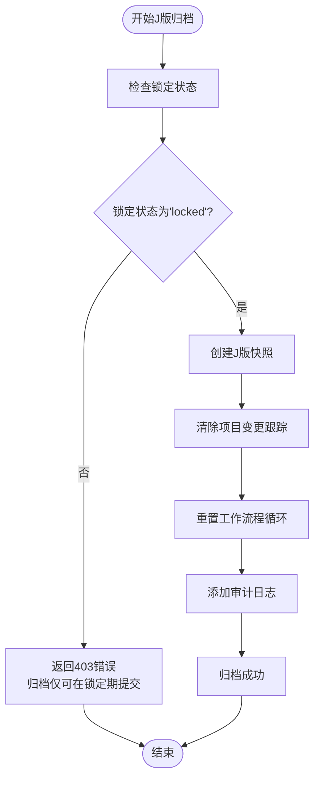
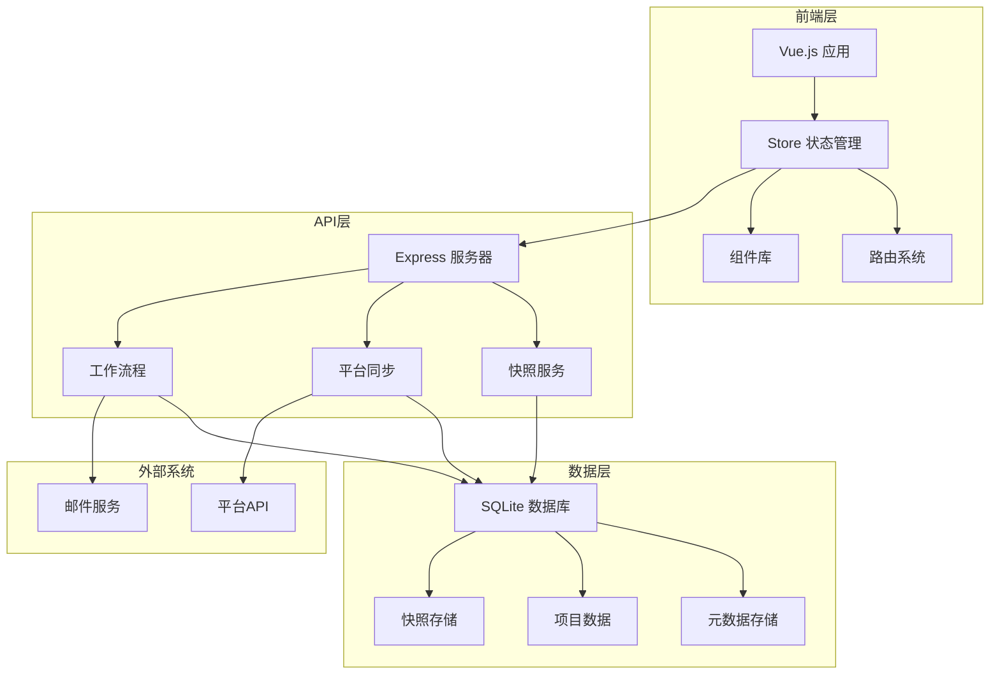
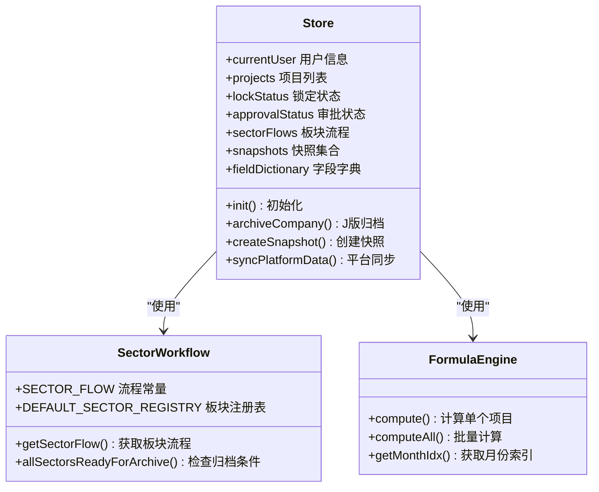
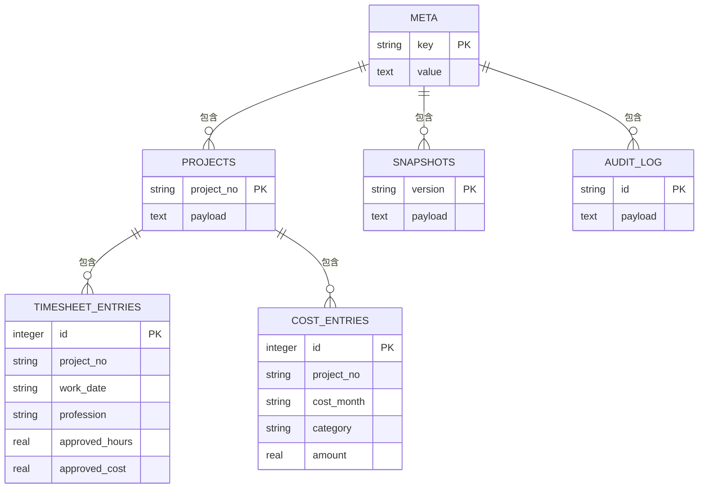
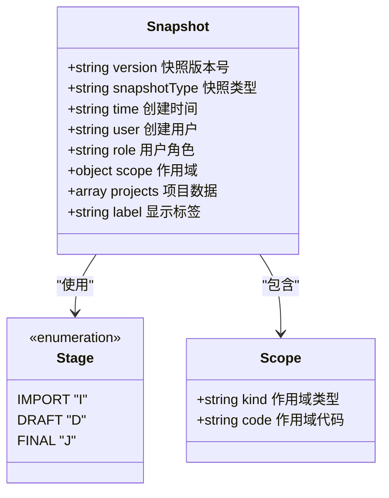
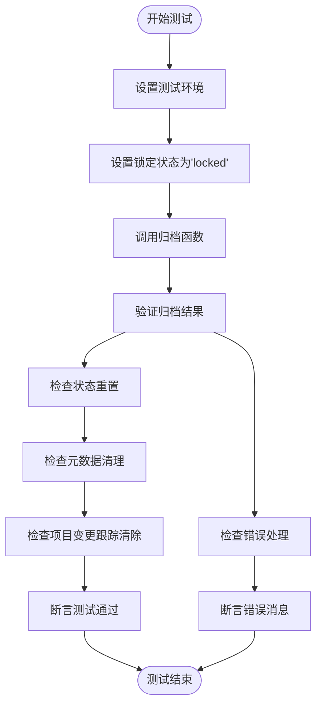

# J版本归档限制

<cite>
**本文档引用的文件**
- [index.html](file://index.html)
- [package.json](file://package.json)
- [js/app.js](file://js/app.js)
- [js/store.js](file://js/store.js)
- [js/sector-workflow.js](file://js/sector-workflow.js)
- [js/formula-engine.js](file://js/formula-engine.js)
- [server/index.js](file://server/index.js)
- [server/db.js](file://server/db.js)
- [server/snapshot-service.js](file://server/snapshot-service.js)
- [server/platform-sync.js](file://server/platform-sync.js)
- [test/archive-workflow-reset.test.js](file://test/archive-workflow-reset.test.js)
- [AGENTS.md](file://AGENTS.md)
</cite>

## 目录
1. [项目概述](#项目概述)
2. [J版本归档限制机制](#j版本归档限制机制)
3. [系统架构](#系统架构)
4. [核心组件分析](#核心组件分析)
5. [J版本归档工作流程](#j版本归档工作流程)
6. [锁定状态管理](#锁定状态管理)
7. [快照管理系统](#快照管理系统)
8. [测试与验证](#测试与验证)
9. [故障排除指南](#故障排除指南)
10. [总结](#总结)

## 项目概述

J版本归档限制是项目执行追踪平台中的一个关键功能，确保只有在特定条件下才能进行J版（最终版）归档。该系统基于Express + SQLite构建，提供完整的项目追踪、审批流程管理和数据归档功能。

### 项目特性

- **实时数据追踪**：支持83个字段的项目数据追踪
- **多角色权限管理**：系统管理员、板块管理员、板块总监、项目经理等角色
- **自动化公式计算**：基于83个字段的复杂业务公式
- **完整的审批流程**：从PM提交到板块审批再到公司归档
- **数据快照管理**：支持I版（初始化）、D版（草稿）、J版（最终）三种快照

## J版本归档限制机制

J版本归档限制是整个系统中最严格的安全控制机制，确保数据完整性在关键节点得到保护。

### 核心限制规则



**图表来源**
- [server/index.js:437-469](file://server/index.js#L437-L469)
- [server/db.js:376-396](file://server/db.js#L376-L396)

### 锁定状态检查

J版归档的核心限制在于必须在锁定状态下才能执行：

1. **锁定状态验证**：系统会检查当前的有效锁定状态
2. **状态转换**：只有当`lockStatus`为'locked'时才允许归档
3. **错误处理**：如果状态不是锁定，直接返回403错误

**章节来源**
- [server/index.js:437-443](file://server/index.js#L437-L443)

## 系统架构

系统采用前后端分离架构，前端使用Vue.js + Luckysheet，后端使用Express + better-sqlite3。



**图表来源**
- [index.html:70-108](file://index.html#L70-L108)
- [server/index.js:1-100](file://server/index.js#L1-L100)

**章节来源**
- [index.html:1-111](file://index.html#L1-L111)
- [package.json:1-19](file://package.json#L1-L19)

## 核心组件分析

### Store状态管理

Store组件是整个系统的状态管理中心，负责协调各个模块之间的数据流转。



**图表来源**
- [js/store.js:97-128](file://js/store.js#L97-L128)
- [js/sector-workflow.js:7-19](file://js/sector-workflow.js#L7-L19)
- [js/formula-engine.js:19-83](file://js/formula-engine.js#L19-L83)

### 数据库管理

数据库层提供了完整的数据持久化和查询功能，支持复杂的业务逻辑。



**图表来源**
- [server/db.js:16-83](file://server/db.js#L16-L83)

**章节来源**
- [js/store.js:1-588](file://js/store.js#L1-L588)
- [server/db.js:1-667](file://server/db.js#L1-L667)

## J版本归档工作流程

J版本归档是整个系统中最关键的数据归档流程，确保项目数据在特定时间点被永久锁定和保存。

### 归档流程详解

```mermaid
sequenceDiagram
participant Client as 客户端
participant Store as Store组件
participant API as API服务器
participant DB as 数据库
participant Snapshot as 快照服务
Client->>Store : 调用archiveCompany()
Store->>API : POST /api/company/archive
API->>DB : 检查锁定状态
DB-->>API : 返回lockStatus
API->>API : 验证lockStatus === 'locked'
alt 锁定状态正确
API->>DB : 获取所有项目数据
API->>Snapshot : createFinalSnapshot()
Snapshot->>DB : 写入J版快照
API->>DB : clearProjectChangeTracking()
API->>DB : resetWorkflowCycleAfterArchive()
API->>DB : 添加审计日志
API-->>Store : 返回归档结果
Store->>Store : 更新本地状态
else 锁定状态错误
API-->>Store : 返回403错误
end
Store-->>Client : 显示归档结果
```



**图表来源**
- [js/store.js:404-423](file://js/store.js#L404-L423)
- [server/index.js:437-469](file://server/index.js#L437-L469)
- [server/db.js:376-396](file://server/db.js#L376-L396)

### 关键实现细节

1. **锁定状态验证**：通过`getEffectiveLockStatus()`方法获取当前有效锁定状态
2. **快照创建**：使用`createFinalSnapshot()`创建J版快照
3. **数据清理**：调用`clearProjectChangeTracking()`清除项目变更跟踪
4. **流程重置**：执行`resetWorkflowCycleAfterArchive()`重置工作流程
5. **审计记录**：添加详细的审计日志记录归档操作

**章节来源**
- [server/index.js:437-469](file://server/index.js#L437-L469)
- [server/db.js:376-396](file://server/db.js#L376-L396)
- [server/snapshot-service.js:139-158](file://server/snapshot-service.js#L139-L158)

## 锁定状态管理

锁定状态管理是J版本归档限制的核心基础，确保数据在特定时间段内得到保护。

### 锁定状态计算逻辑

```mermaid
flowchart TD
Start([计算锁定状态]) --> GetConfig["获取配置参数"]
GetConfig --> GetCurrentDate["获取当前日期"]
GetCurrentDate --> CalcMonthIndex["计算月份索引"]
CalcMonthIndex --> CompareMonth{"比较当前月份与报告月份"}
CompareMonth --> |相同月份| CheckLockDay["检查锁定日期"]
CompareMonth --> |下一个月| CheckAutoUnlock["检查自动解锁"]
CompareMonth --> |其他| Open["返回'open'"]
CheckLockDay --> Day >= LockDay{"日期 >= 锁定日?"}
Day >= LockDay --> |是| Locked["返回'locked'"]
Day >= LockDay --> |否| Open
CheckAutoUnlock --> AutoUnlockEnabled{"自动解锁已启用?"}
AutoUnlockEnabled --> |是| Day >= UnlockDay{"日期 >= 解锁日?"}
AutoUnlockEnabled --> |否| Locked
Day >= UnlockDay --> |是| Open
Day >= UnlockDay --> |否| Locked
Locked --> End([结束])
Open --> End
Error --> End
```

**图表来源**
- [js/store.js:43-58](file://js/store.js#L43-L58)
- [server/db.js:147-168](file://server/db.js#L147-L168)

### 配置参数说明

| 参数 | 默认值 | 说明 |
|------|--------|------|
| reminderDay | 19 | 财务审查提醒日 |
| lockDay | 25 | 月度锁定日 |
| unlockDay | 9 | 月度解锁日 |
| autoUnlockEnabled | false | 自动解锁开关 |
| reportingMonth | 2026-05 | 报告月份 |
| systemYear | 2026 | 系统年份 |

**章节来源**
- [js/store.js:21-28](file://js/store.js#L21-L28)
- [server/db.js:88-96](file://server/db.js#L88-L96)

## 快照管理系统

快照管理系统是J版本归档的核心技术实现，支持I版（初始化）、D版（草稿）、J版（最终）三种不同类型的快照。

### 快照版本命名规则

快照版本采用统一的命名格式：`[阶段]:[日期]:[作用域]:[序列号]`



**图表来源**
- [server/snapshot-service.js:5-6](file://server/snapshot-service.js#L5-L6)
- [server/snapshot-service.js:54-68](file://server/snapshot-service.js#L54-L68)

### 快照类型对比

| 快照类型 | 前缀 | 作用域 | 用途 | 特殊说明 |
|----------|------|--------|------|----------|
| I版（初始化） | I | ALL | 初始数据导入 | 作为基准快照 |
| D版（草稿） | D | 板块代码 | 板块审批草稿 | 按板块生成 |
| J版（最终） | J | ALL | 公司最终归档 | 全公司范围 |

**章节来源**
- [server/snapshot-service.js:88-158](file://server/snapshot-service.js#L88-L158)

## 测试与验证

系统提供了完善的测试套件，确保J版本归档限制机制的正确性和可靠性。

### 归档工作流测试



**图表来源**
- [test/archive-workflow-reset.test.js:16-43](file://test/archive-workflow-reset.test.js#L16-L43)

### 测试覆盖范围

测试用例覆盖了以下关键场景：

1. **锁定状态保持**：J版归档后锁定状态保持不变
2. **工作流程重置**：审批状态、提交状态、板块流程等重置
3. **元数据清理**：PM提交记录、板块最新D版版本等清理
4. **项目变更跟踪**：项目变更日志、字段变更标记清除

**章节来源**
- [test/archive-workflow-reset.test.js:1-65](file://test/archive-workflow-reset.test.js#L1-L65)

## 故障排除指南

### 常见问题及解决方案

#### 问题1：J版归档返回403错误

**症状**：调用归档接口时返回"归档仅可在锁定期提交"

**可能原因**：
1. 当前锁定状态不是'locked'
2. 系统配置错误
3. 时间计算错误

**解决步骤**：
1. 检查当前锁定状态：`db.getEffectiveLockStatus()`
2. 验证配置参数：`lockDay`、`unlockDay`、`autoUnlockEnabled`
3. 确认当前日期是否在正确的月份范围内

#### 问题2：归档后状态未正确重置

**症状**：J版归档成功但系统状态未重置

**可能原因**：
1. `resetWorkflowCycleAfterArchive()`执行失败
2. 数据库事务未正确提交
3. 元数据清理不完整

**解决步骤**：
1. 检查数据库事务日志
2. 验证`resetWorkflowCycleAfterArchive()`执行结果
3. 确认所有相关元数据都已清理

#### 问题3：快照创建失败

**症状**：J版快照创建过程中出现错误

**可能原因**：
1. 项目数据格式不正确
2. 数据库连接问题
3. 快照版本冲突

**解决步骤**：
1. 验证项目数据结构
2. 检查数据库连接状态
3. 确认快照版本唯一性

**章节来源**
- [server/index.js:437-469](file://server/index.js#L437-L469)
- [server/db.js:376-396](file://server/db.js#L376-L396)

## 总结

J版本归档限制机制是项目执行追踪平台中的关键安全控制功能，通过严格的锁定状态检查和完整的工作流程重置，确保项目数据在特定时间点得到正确归档和保护。

### 核心价值

1. **数据完整性**：通过锁定状态确保数据在归档时的完整性
2. **流程规范化**：标准化的归档流程避免人为错误
3. **审计可追溯**：完整的审计日志记录所有归档操作
4. **系统稳定性**：自动化的状态重置保证系统正常运行

### 技术优势

1. **前后端分离**：清晰的职责划分便于维护和扩展
2. **模块化设计**：独立的功能模块便于测试和调试
3. **完善的测试**：全面的测试覆盖确保代码质量
4. **文档齐全**：详细的文档说明便于理解和使用

该系统为项目管理提供了可靠的技术支撑，确保项目数据的准确性、完整性和可追溯性。