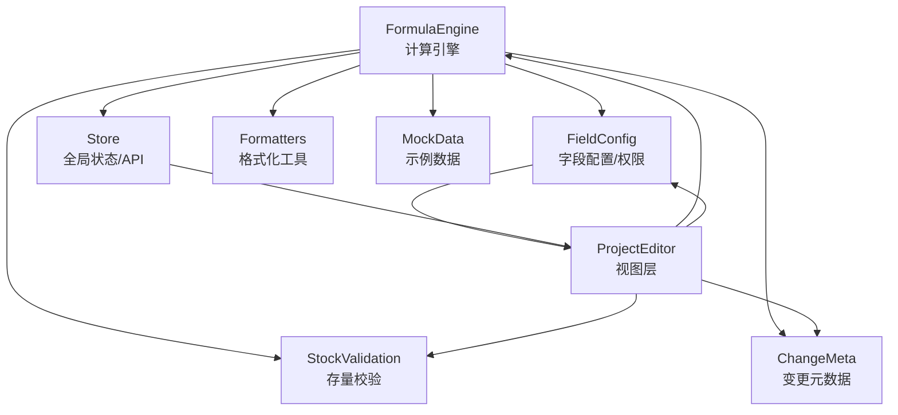
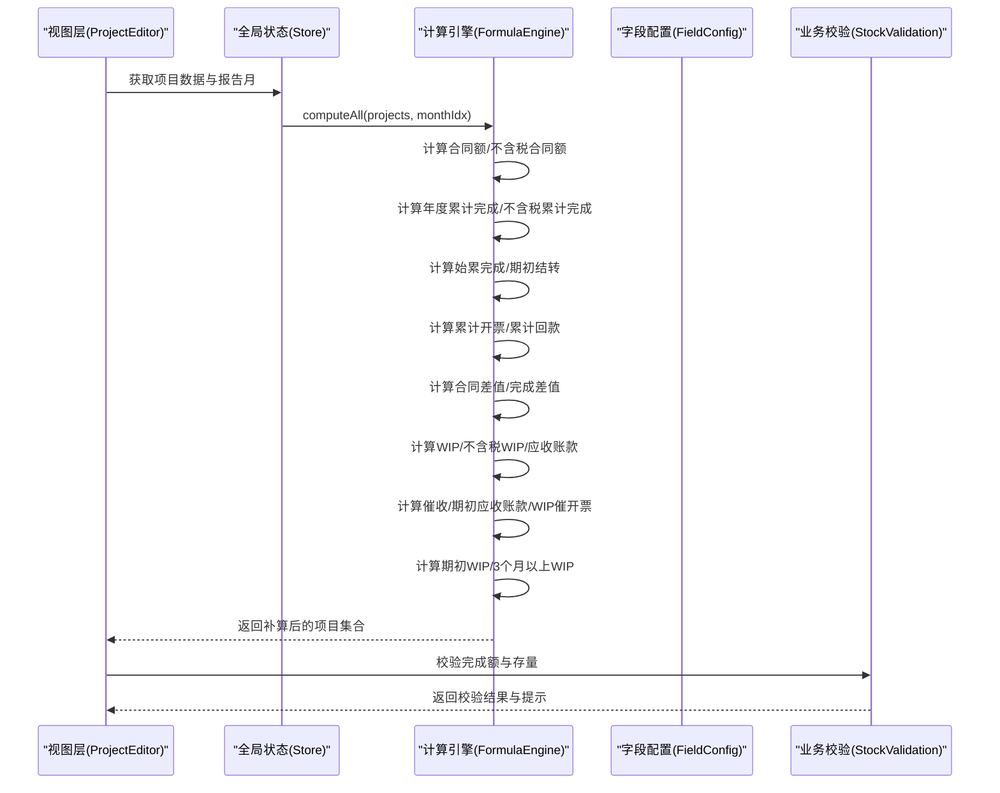
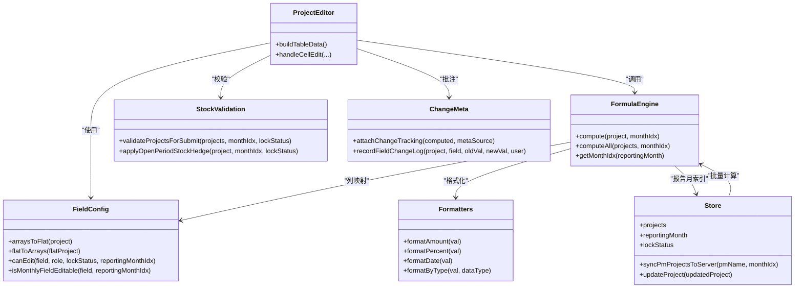

# 公式计算引擎

<cite>
**本文引用的文件**
- [formula-engine.js](file://js/formula-engine.js)
- [store.js](file://js/store.js)
- [formatters.js](file://js/formatters.js)
- [field-config.js](file://js/field-config.js)
- [stock-validation.js](file://js/stock-validation.js)
- [change-meta.js](file://js/change-meta.js)
- [mock-data.js](file://js/mock-data.js)
- [fields.json](file://config/fields/fields.json)
- [ProjectEditor.js](file://js/views/ProjectEditor.js)
- [AppLayout.js](file://js/components/AppLayout.js)
</cite>

## 目录
1. [简介](#简介)
2. [项目结构](#项目结构)
3. [核心组件](#核心组件)
4. [架构总览](#架构总览)
5. [详细组件分析](#详细组件分析)
6. [依赖关系分析](#依赖关系分析)
7. [性能考量](#性能考量)
8. [故障排查指南](#故障排查指南)
9. [结论](#结论)
10. [附录](#附录)

## 简介
本技术文档围绕“公式计算引擎”展开，系统性阐述财务指标计算的核心算法与实现细节，涵盖合同额计算（P = N + O）、不含税合同额（Q = P/(1+Y)）、年度累计完成（X = SUM(1月..报告当月)）、WIP分析（AG = U - AC）等关键公式，并深入解析月度数据处理机制、税率计算、累计值计算与3个月以上WIP的简化算法。同时，文档详细说明compute函数与computeAll函数的参数传递、数据结构与返回值格式，给出业务规则验证、异常处理与性能优化策略，并提供具体计算示例与边界条件处理方法。

## 项目结构
该项目采用前后端分离的前端单页应用架构，核心计算逻辑集中在js/formula-engine.js中，配合字段字典、权限控制、格式化工具与视图层协同工作。整体结构如下：
- 计算引擎：js/formula-engine.js
- 全局状态与API交互：js/store.js
- 字段字典与权限控制：js/field-config.js
- 格式化工具：js/formatters.js
- 业务规则校验（存量预警与完成额校验）：js/stock-validation.js
- 变更元数据（批注/审计联动）：js/change-meta.js
- 示例数据与计算：js/mock-data.js
- 字段定义与公式说明：config/fields/fields.json
- 视图层（编辑器）：js/views/ProjectEditor.js
- 主布局组件：js/components/AppLayout.js

图表来源
- [formula-engine.js:1-105](file://js/formula-engine.js#L1-L105)
- [field-config.js:1-262](file://js/field-config.js#L1-L262)
- [store.js:1-602](file://js/store.js#L1-L602)
- [formatters.js:1-167](file://js/formatters.js#L1-L167)
- [stock-validation.js:1-181](file://js/stock-validation.js#L1-L181)
- [change-meta.js:1-260](file://js/change-meta.js#L1-L260)
- [mock-data.js:1-748](file://js/mock-data.js#L1-L748)
- [ProjectEditor.js:1-800](file://js/views/ProjectEditor.js#L1-L800)

章节来源
- [formula-engine.js:1-105](file://js/formula-engine.js#L1-L105)
- [field-config.js:1-262](file://js/field-config.js#L1-L262)
- [store.js:1-602](file://js/store.js#L1-L602)

## 核心组件
- 计算引擎（FormulaEngine）
  - compute(project, monthIdx)：对单个项目进行派生字段计算，返回补算后的完整项目对象
  - computeAll(projects, monthIdx)：批量计算所有项目
  - getMonthIdx(reportingMonth)：将'YYYY-MM'转换为0-11的月份索引
- 字段配置（FieldConfig）
  - 提供字段字典、列字母与数组索引映射、权限控制、月度列时间窗判断
- 全局状态（Store）
  - 提供项目数据、报表周期、锁定期、API交互与公式引擎集成点
- 格式化工具（Formatters）
  - 金额、百分比、日期、布尔等格式化与解析
- 业务规则校验（StockValidation）
  - 存量预警与完成额校验，开放期自动对冲与提交期阻断
- 变更元数据（ChangeMeta）
  - 字段变更批注、审计联动与样式标记
- 示例数据（MockData）
  - 20条示例项目数据，包含不同场景与月度完成/开票/回款数据

章节来源
- [formula-engine.js:13-105](file://js/formula-engine.js#L13-L105)
- [field-config.js:124-260](file://js/field-config.js#L124-L260)
- [store.js:498-581](file://js/store.js#L498-L581)
- [formatters.js:1-167](file://js/formatters.js#L1-L167)
- [stock-validation.js:1-181](file://js/stock-validation.js#L1-L181)
- [change-meta.js:1-260](file://js/change-meta.js#L1-L260)
- [mock-data.js:1-748](file://js/mock-data.js#L1-L748)

## 架构总览
公式计算引擎位于前端视图层与全局状态之间，承担以下职责：
- 输入：原始项目数据（含手工填报与系统同步字段）+ 报告月份索引
- 处理：基于字段字典与业务规则，计算派生字段
- 输出：补算后的完整项目对象（含合同额、不含税合同额、累计完成、WIP、应收账款等）

图表来源
- [ProjectEditor.js:208-247](file://js/views/ProjectEditor.js#L208-L247)
- [store.js:498-508](file://js/store.js#L498-L508)
- [formula-engine.js:19-82](file://js/formula-engine.js#L19-L82)
- [stock-validation.js:131-149](file://js/stock-validation.js#L131-L149)

## 详细组件分析

### 计算引擎（FormulaEngine）
- 参数与返回值
  - compute(project, monthIdx)
    - 参数：project（原始项目对象）、monthIdx（0-11，0=1月）
    - 返回：补算后的项目对象（包含所有派生字段）
  - computeAll(projects, monthIdx)
    - 参数：projects（项目数组）、monthIdx（0-11）
    - 返回：计算后的项目数组
  - getMonthIdx(reportingMonth)
    - 参数：reportingMonth（'YYYY-MM'）
    - 返回：monthIdx（0-11）
- 关键公式与实现要点
  - 合同额与不含税合同额
    - P = N + O
    - Q = P / (1 + Y)
  - 年度完成与不含税累计
    - X = SUM(1月..报告当月)
    - Z = X / (1 + Y)
  - 始累完成与期初结转
    - U = T + X
    - V = N - T
  - 累计开票/回款
    - AB = SUM(本年1月..报告当月开票)
    - AC = AA + AB
    - AE = SUM(本年1月..报告当月回款)
    - AF = AD + AE
  - 合同差值
    - R = P - AC
    - S = P - U
  - 财务WIP与应收账款
    - AG = U - AC
    - AH = AG / (1 + Y)
    - AI = AC - AF
  - 催收/期初应收账款/WIP催开票
    - AJ = MAX(AI, 0)
    - AK = MAX(AA - AD, 0)
    - AL = MAX(AG, 0)
  - WIP分析
    - AP = MAX(T - AA, 0)
    - AQ（3个月以上WIP）：AG - 近3个月（含当月）产值之和，取正数
- 月度数据处理机制
  - 月度完成/开票/回款以数组形式存储（monthly_completion/monthly_invoice/monthly_payment），长度固定为12，索引对应1-12月
  - 计算时通过slice与reduce实现累计与区间求和
- 税率计算
  - 税率Y来自项目对象的tax_rate字段，若为空则默认0.09
- 3个月以上WIP简化算法
  - 逻辑：WIP余额 - 近3个月（含当月）产值之和，取正数
  - 通过slice(Math.max(0, monthIdx - 2), monthIdx + 1)截取最近3个月，再求和
- 异常处理与边界条件
  - 数组越界保护：当monthIdx为负或大于11时，slice会安全处理
  - 空值与NaN处理：通过|| 0与Number转换保证计算稳定
  - 负值取正：MAX函数确保催收/应收账款等字段非负
- 性能优化
  - 单次计算使用原对象浅拷贝，减少深拷贝成本
  - reduce与slice为纯函数式操作，时间复杂度O(n)，n为12
  - 批量计算computeAll通过map遍历，避免重复初始化

章节来源
- [formula-engine.js:19-82](file://js/formula-engine.js#L19-L82)
- [field-config.js:223-240](file://js/field-config.js#L223-L240)

### 字段配置与权限控制（FieldConfig）
- 字段字典与列映射
  - COL_TO_KEY：列字母到JS字段名的映射，支持mc_0..mc_11、mi_0..mi_11、mp_0..mp_11
  - arraysToFlat与flatToArrays：在数组与扁平键之间双向转换
- 月度列时间窗
  - MC_COLS/MI_COLS/MP_COLS分别定义月度完成/开票/回款列
  - isMonthlyFieldEditable：判断字段在当前报告月是否可编辑
  - isPastReportingMonthField：判断是否为报告月之前（只读）
- 权限矩阵
  - system_sync/auto_calc：只读
  - manual_input：按角色与锁定期决定编辑权限
  - system_admin：在locked期仍可覆盖系统引用列

章节来源
- [field-config.js:196-260](file://js/field-config.js#L196-L260)

### 全局状态与集成（Store）
- 与计算引擎的集成点
  - Store.getMonthIdx：委托FormulaEngine.getMonthIdx
  - Store.syncPmProjectsToServer：批量计算并写回服务器
  - Store.updateProject：更新单个项目
- API交互与错误处理
  - apiFetch封装fetch，统一处理404、HTML错误与JSON解析
  - 错误消息友好化，便于前端展示

章节来源
- [store.js:579-581](file://js/store.js#L579-L581)
- [store.js:498-508](file://js/store.js#L498-L508)
- [store.js:66-93](file://js/store.js#L66-L93)

### 业务规则校验（StockValidation）
- 存量预警与违规
  - R = P - AC（存量开票额）< 0为预警
  - S = P - U（存量合同额）< 0为违规
- 开放期自动对冲
  - 若S为负，将报告月完成额调减S，使S归零
- 提交期阻断
  - 提交前再次校验，若有S<0的项目，阻止提交并提示

章节来源
- [stock-validation.js:47-106](file://js/stock-validation.js#L47-L106)
- [stock-validation.js:131-149](file://js/stock-validation.js#L131-L149)

### 视图层与计算联动（ProjectEditor）
- 表格构建
  - buildTableData：调用FormulaEngine.computeAll(source, this.monthIdx)
  - 与ChangeMeta、BaselineDiff等模块联动，附加变更元数据
- 单元格编辑
  - handleCellEdit：应用字段变更到项目，重新计算并写回
  - applyLuckysheetChangedStyle：变更字段高亮样式
- 导入/导出与快照
  - 支持Excel导入合并与快照版本查看

章节来源
- [ProjectEditor.js:208-247](file://js/views/ProjectEditor.js#L208-L247)
- [ProjectEditor.js:711-770](file://js/views/ProjectEditor.js#L711-L770)

### 示例数据与计算（MockData）
- 示例项目覆盖多种场景：新旧项目、多板块、高WIP、高风险、已完成、未签署
- 月度完成/开票/回款数据以12元素数组形式提供
- 通过FormulaEngine.compute对每条示例数据进行补算，验证公式正确性

章节来源
- [mock-data.js:16-748](file://js/mock-data.js#L16-L748)

## 依赖关系分析
- 计算引擎依赖
  - 字段配置：列映射、月度列索引、权限判断
  - 全局状态：报告月索引、API交互
  - 格式化工具：输出格式化
  - 业务校验：完成额与存量校验
  - 变更元数据：变更批注与样式
- 视图层依赖
  - 计算引擎：批量计算与单项目计算
  - 字段配置：列权限与时间窗
  - 业务校验：编辑期与提交期校验
  - 变更元数据：变更批注与样式

图表来源
- [formula-engine.js:19-105](file://js/formula-engine.js#L19-L105)
- [field-config.js:124-260](file://js/field-config.js#L124-L260)
- [store.js:498-581](file://js/store.js#L498-L581)
- [formatters.js:1-167](file://js/formatters.js#L1-L167)
- [stock-validation.js:131-179](file://js/stock-validation.js#L131-L179)
- [change-meta.js:205-258](file://js/change-meta.js#L205-L258)
- [ProjectEditor.js:208-247](file://js/views/ProjectEditor.js#L208-L247)

## 性能考量
- 时间复杂度
  - 单项目计算：O(1)（固定12个月数组操作）
  - 批量计算：O(n)（n为项目数量）
- 内存占用
  - computeAll通过map创建新对象，避免重复深拷贝
  - arraysToFlat/flatToArrays在列转换时创建临时数组，但生命周期短
- I/O与网络
  - Store.apiFetch统一处理HTTP请求与错误，减少重复逻辑
- 优化建议
  - 对高频计算的项目集合，可考虑缓存上一次计算结果，仅对变更字段重新计算
  - 在视图层对FormulaEngine.computeAll的结果进行节流/防抖，避免频繁重算
  - 对超大项目集，可在前端分页或虚拟滚动展示，减少一次性渲染压力

## 故障排查指南
- 常见问题与定位
  - 计算结果异常
    - 检查tax_rate是否为空或NaN
    - 检查monthly_completion/monthly_invoice/monthly_payment数组长度与索引
    - 使用Formatters.formatAmount确认显示是否正确
  - 3个月以上WIP为负
    - 检查monthIdx是否正确，slice区间是否合理
    - 确认近3个月产值之和是否过大
  - 提交被阻断
    - 查看StockValidation.validateProjectsForSubmit返回的违规项目列表
    - 在开放期检查是否已自动对冲
- 异常处理
  - Store.apiFetch对404、HTML错误与JSON解析失败进行统一处理
  - FormulaEngine内部通过|| 0与Number转换避免NaN传播
- 调试技巧
  - 在ProjectEditor中启用变更批注，查看字段变更历史
  - 使用MockData中的示例项目快速验证公式
  - 在浏览器控制台直接调用FormulaEngine.compute(project, monthIdx)进行单步调试

章节来源
- [stock-validation.js:131-149](file://js/stock-validation.js#L131-L149)
- [store.js:66-93](file://js/store.js#L66-L93)
- [formatters.js:13-21](file://js/formatters.js#L13-L21)
- [change-meta.js:142-151](file://js/change-meta.js#L142-L151)

## 结论
公式计算引擎以简洁稳定的算法实现了财务指标的自动化计算，结合字段字典、权限控制、业务校验与变更元数据，形成了完整的前端计算闭环。通过明确的参数传递、清晰的数据结构与完善的异常处理，系统在保证准确性的同时兼顾了可维护性与可扩展性。建议在生产环境中进一步引入缓存与节流策略，以提升大规模数据场景下的用户体验。

## 附录

### 计算示例与边界条件
- 合同额与不含税合同额
  - P = N + O；Q = P / (1 + Y)
  - 边界：N/O为空时按0计算；Y为空时按0.09计算
- 年度累计完成
  - X = SUM(1月..报告当月)；Z = X / (1 + Y)
  - 边界：当monthIdx为负时，slice返回空数组，SUM为0
- WIP与应收账款
  - AG = U - AC；AH = AG / (1 + Y)；AI = AC - AF
  - 边界：MAX确保AJ/AK/AL非负
- 3个月以上WIP
  - AQ = MAX(AG - SUM(近3个月产值), 0)
  - 边界：当monthIdx为0或1时，slice会自动修正起始索引

章节来源
- [formula-engine.js:36-81](file://js/formula-engine.js#L36-L81)
- [field-config.js:223-240](file://js/field-config.js#L223-L240)

### 字段字典与公式对照
- 字段定义与公式说明详见config/fields/fields.json，涵盖合同额、累计完成、开票回款、WIP与应收账款等分区的字段与计算逻辑

章节来源
- [fields.json:1-800](file://config/fields/fields.json#L1-L800)