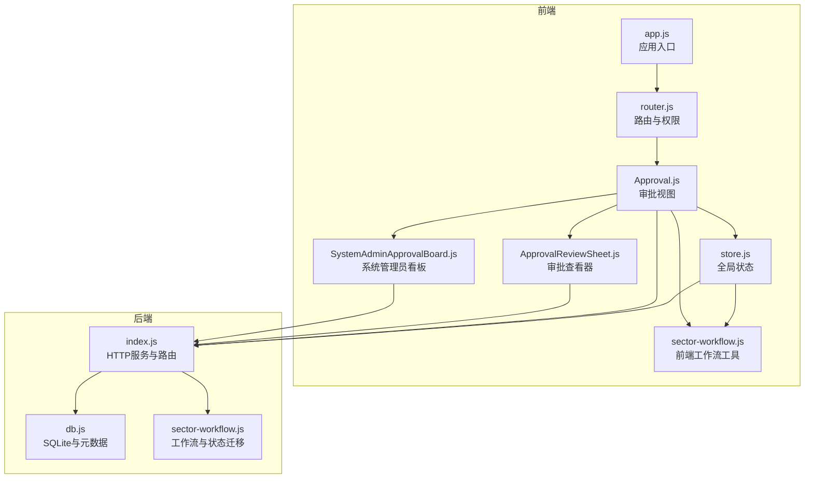
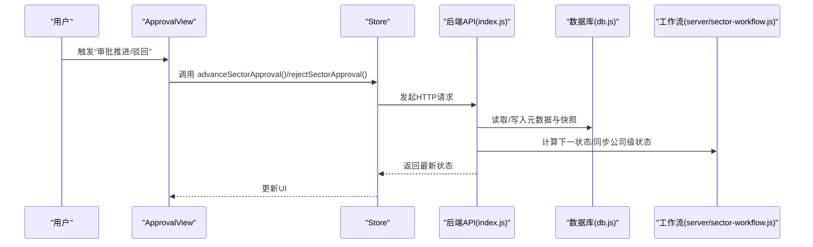
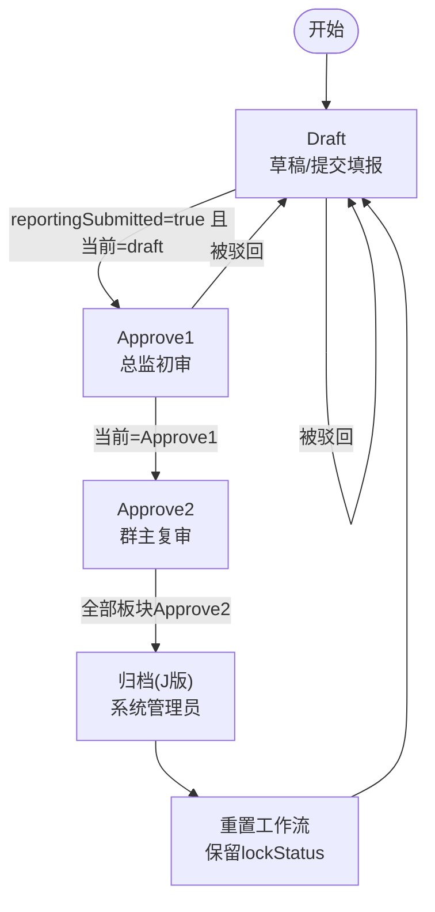
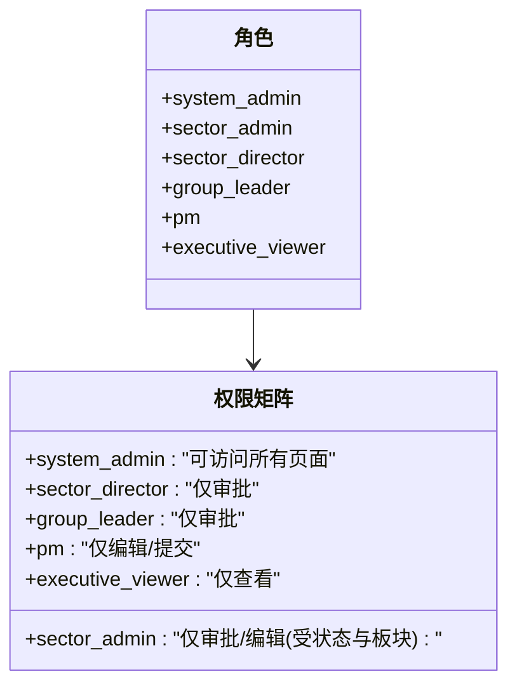
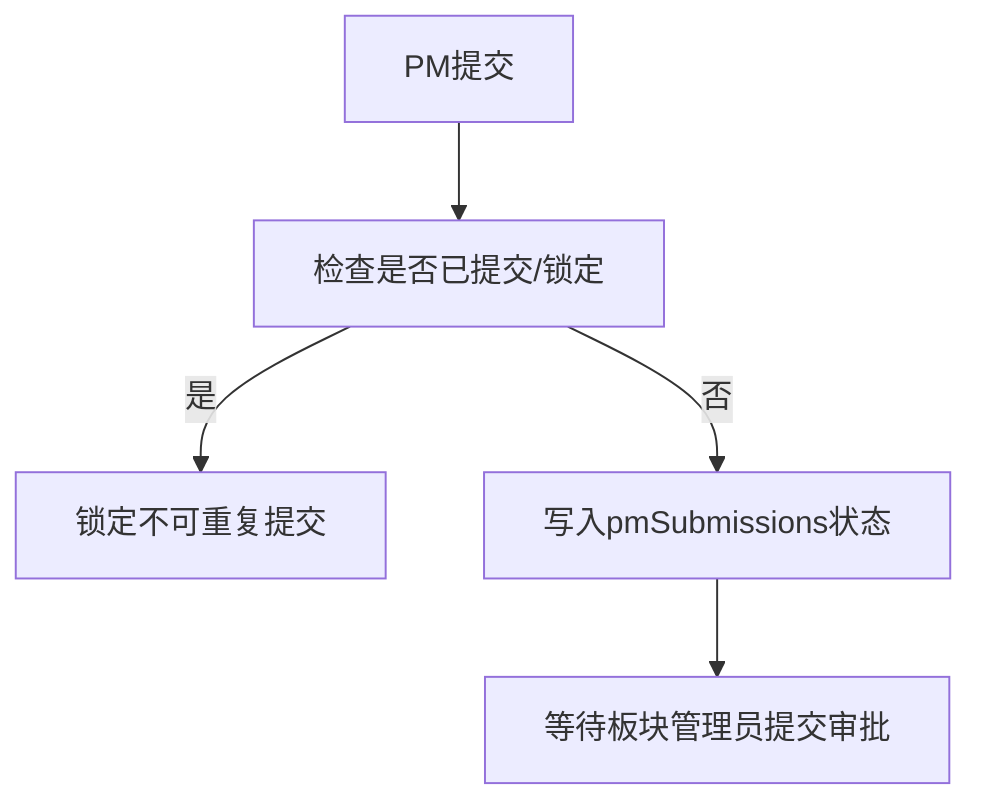
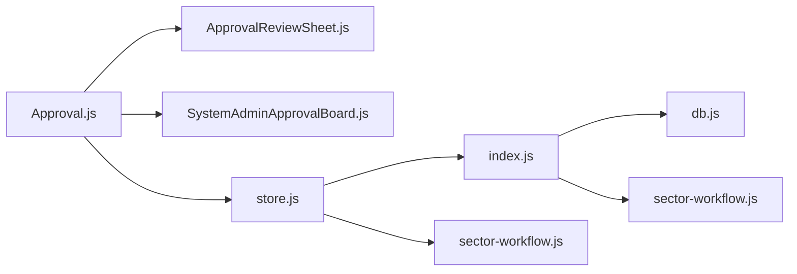

# 审批工作流系统

<cite>
**本文引用的文件**
- [server/index.js](file://server/index.js)
- [server/sector-workflow.js](file://server/sector-workflow.js)
- [server/db.js](file://server/db.js)
- [js/views/Approval.js](file://js/views/Approval.js)
- [js/components/ApprovalReviewSheet.js](file://js/components/ApprovalReviewSheet.js)
- [js/components/SystemAdminApprovalBoard.js](file://js/components/SystemAdminApprovalBoard.js)
- [js/store.js](file://js/store.js)
- [js/sector-workflow.js](file://js/sector-workflow.js)
- [js/router.js](file://js/router.js)
- [js/app.js](file://js/app.js)
- [test/archive-workflow-reset.test.js](file://test/archive-workflow-reset.test.js)
</cite>

## 目录
1. [简介](#简介)
2. [项目结构](#项目结构)
3. [核心组件](#核心组件)
4. [架构总览](#架构总览)
5. [详细组件分析](#详细组件分析)
6. [依赖关系分析](#依赖关系分析)
7. [性能考量](#性能考量)
8. [故障排查指南](#故障排查指南)
9. [结论](#结论)
10. [附录](#附录)

## 简介
本系统围绕“多层级审批流程”构建，采用“草案→初审→复审”的三阶段流程，结合“板块管理员”和“系统管理员”的角色分工，实现项目数据在不同角色间的流转与校验。系统通过快照（Snapshot）记录每个阶段的数据状态，支持版本对比、审计与归档。同时，系统内置锁定期机制与PM提交约束，确保流程推进的可控性与一致性。

## 项目结构
系统前后端分离，前端基于Vue生态，后端基于Node/Express，数据存储采用SQLite（better-sqlite3）。审批流程的核心逻辑分布在后端API与前端视图组件中，状态通过全局Store与后端元数据（meta）保持同步。

图表来源
- [js/app.js:1-47](file://js/app.js#L1-L47)
- [js/router.js:1-137](file://js/router.js#L1-L137)
- [js/store.js:1-602](file://js/store.js#L1-L602)
- [js/views/Approval.js:1-475](file://js/views/Approval.js#L1-L475)
- [js/components/ApprovalReviewSheet.js:1-171](file://js/components/ApprovalReviewSheet.js#L1-L171)
- [js/components/SystemAdminApprovalBoard.js:1-86](file://js/components/SystemAdminApprovalBoard.js#L1-L86)
- [js/sector-workflow.js:1-180](file://js/sector-workflow.js#L1-L180)
- [server/index.js:1-775](file://server/index.js#L1-L775)
- [server/db.js:1-525](file://server/db.js#L1-L525)
- [server/sector-workflow.js:1-273](file://server/sector-workflow.js#L1-L273)

章节来源
- [js/app.js:1-47](file://js/app.js#L1-L47)
- [js/router.js:1-137](file://js/router.js#L1-L137)
- [js/store.js:1-602](file://js/store.js#L1-L602)
- [server/index.js:1-775](file://server/index.js#L1-L775)

## 核心组件
- 审批视图（ApprovalView）：根据角色展示不同的流程界面与操作按钮，支持审批推进与驳回，以及版本对比。
- 审批查看器（ApprovalReviewSheet）：面向板块总监/群主，展示本板块项目清单与只读视图，必要时提示“需修改请驳回”。
- 系统管理员看板（SystemAdminApprovalBoard）：并行展示十二板块的审批进度卡片。
- 全局状态（Store）：封装HTTP请求、状态同步、快照获取与审批动作调用。
- 工作流工具（sector-workflow）：前后端通用的工作流常量、状态计算与板块映射。
- 后端API（index.js）：提供提交、推进、驳回、归档、PM提交等REST接口。
- 数据层（db.js）：SQLite访问、元数据（meta）管理、锁定期计算与工作流迁移。

章节来源
- [js/views/Approval.js:1-475](file://js/views/Approval.js#L1-L475)
- [js/components/ApprovalReviewSheet.js:1-171](file://js/components/ApprovalReviewSheet.js#L1-L171)
- [js/components/SystemAdminApprovalBoard.js:1-86](file://js/components/SystemAdminApprovalBoard.js#L1-L86)
- [js/store.js:1-602](file://js/store.js#L1-L602)
- [js/sector-workflow.js:1-180](file://js/sector-workflow.js#L1-L180)
- [server/index.js:1-775](file://server/index.js#L1-L775)
- [server/db.js:1-525](file://server/db.js#L1-L525)

## 架构总览
系统采用“前端状态驱动 + 后端持久化”的模式：
- 前端通过Store发起HTTP请求，后端在SQLite中持久化状态与快照。
- 审批状态（approvalStatus）、上报状态（reportingSubmitted）、公司归档状态（companyFlow）等通过元数据（meta）集中管理。
- 工作流迁移与同步在后端完成，确保历史数据与新格式兼容。

图表来源
- [js/views/Approval.js:183-227](file://js/views/Approval.js#L183-L227)
- [js/store.js:395-416](file://js/store.js#L395-L416)
- [server/index.js:348-385](file://server/index.js#L348-L385)
- [server/sector-workflow.js:198-221](file://server/sector-workflow.js#L198-L221)
- [server/db.js:194-266](file://server/db.js#L194-L266)

## 详细组件分析

### 多层级审批流程设计与状态转换
- 流程阶段
  - Draft：板块管理员提交，生成草稿快照（Draft:板块），等待初审。
  - Approve1：板块总监初审，若板块管理员同时为总监则可跳过。
  - Approve2：项目群群主复审，完成后本板块审批结束。
  - Final/J版：系统管理员归档，生成全局J版快照，触发新一轮流程。
- 状态转换条件
  - 从Draft→Approve1：要求reportingSubmitted为true且当前状态为draft。
  - 从Approve1→Approve2：当前状态必须为Approve1。
  - 驳回：将状态回退至Draft并清除reportingSubmitted。
- 关键接口
  - 提交审批：/api/sectors/:code/submit-approval
  - 推进审批：/api/sectors/:code/advance-approval
  - 驳回审批：/api/sectors/:code/reject-approval
  - 公司归档：/api/company/archive

图表来源
- [server/index.js:302-417](file://server/index.js#L302-L417)
- [server/sector-workflow.js:50-82](file://server/sector-workflow.js#L50-L82)
- [server/db.js:350-370](file://server/db.js#L350-L370)

章节来源
- [server/index.js:302-417](file://server/index.js#L302-L417)
- [server/sector-workflow.js:50-82](file://server/sector-workflow.js#L50-L82)
- [server/db.js:350-370](file://server/db.js#L350-L370)

### 板块管理员与系统管理员的权限控制
- 板块管理员
  - 角色：sector_admin
  - 能力：提交本板块审批（生成草稿快照），推进/驳回（受状态约束），查看本板块项目。
  - 特殊配置：若板块管理员同时为总监，可跳过初审。
- 系统管理员
  - 角色：system_admin
  - 能力：推进公司归档（生成J版），查看所有板块进度，无版本差异对比与各板块进度卡片。
- 路由与页面访问控制
  - 不同角色仅能访问授权页面，PM、经营管理只读等角色受限。
- 用户配置
  - /api/admin/users 支持批量更新users与sectorAdmins配置，审计日志记录变更。

图表来源
- [js/router.js:77-132](file://js/router.js#L77-L132)
- [server/index.js:661-702](file://server/index.js#L661-L702)

章节来源
- [js/router.js:77-132](file://js/router.js#L77-L132)
- [server/index.js:661-702](file://server/index.js#L661-L702)

### 工作流状态管理、流程推进条件与审批决策机制
- 状态管理
  - approvalStatus：全局审批状态（draft/approve1/approve2/pending_archive/final）。
  - reportingSubmitted：板块是否已提交审批。
  - companyFlow：公司归档状态（pending/final）。
- 推进条件
  - 初审推进：当前=draft 且 reportingSubmitted=true。
  - 复审推进：当前=approve1。
  - 归档条件：所有板块reportingSubmitted=true且approvalStatus=approve2。
- 决策机制
  - 板块管理员提交时可选择是否跳过总监初审（配置项skipDirectorApproval）。
  - 系统管理员归档后，工作流进入新一轮，保留lockStatus不变。

章节来源
- [server/sector-workflow.js:198-230](file://server/sector-workflow.js#L198-L230)
- [server/index.js:302-346](file://server/index.js#L302-L346)
- [server/db.js:350-370](file://server/db.js#L350-L370)

### 与项目数据状态的关联关系、锁定机制与并发控制
- 项目数据状态
  - 项目对象包含变更标记（如_added_this_month、_changed_fields、_field_change_log），用于统计与筛选。
- 锁定机制
  - 锁定周期由periodConfig决定（lockDay/unlockDay/autoUnlockEnabled），计算当前lockStatus。
  - PM提交后锁定（同一月份不可重复提交），防止并发修改。
- 并发控制
  - PM提交接口检查是否已提交/接收，避免重复提交。
  - 审批推进接口检查当前状态，防止非法推进。
  - 审计日志记录关键操作（提交、推进、驳回、归档）。

图表来源
- [server/index.js:230-285](file://server/index.js#L230-L285)
- [js/store.js:472-495](file://js/store.js#L472-L495)

章节来源
- [server/index.js:230-285](file://server/index.js#L230-L285)
- [js/store.js:472-495](file://js/store.js#L472-L495)
- [server/db.js:121-142](file://server/db.js#L121-L142)

### 流程配置、自定义规则与异常处理策略
- 流程配置
  - 板块管理员配置：skipDirectorApproval（跳过总监初审）、adminName/adminUserId。
  - 通过/Admin设置页面维护，保存至meta中的sectorAdmins。
- 自定义规则
  - 板块注册表（sectorRegistry）动态扩展，支持新增板块。
  - 快照键命名规范：阶段标签:板块，如Draft:SAS520。
- 异常处理
  - HTTP错误统一捕获并返回友好消息。
  - 审计日志记录关键操作与参数，便于追溯。
  - 归档后重置工作流状态，保留lockStatus，避免影响后续周期。

章节来源
- [js/views/AdminSettings.js:35-391](file://js/views/AdminSettings.js#L35-L391)
- [server/index.js:661-702](file://server/index.js#L661-L702)
- [server/sector-workflow.js:66-74](file://server/sector-workflow.js#L66-L74)
- [server/db.js:350-370](file://server/db.js#L350-L370)

### 审批流程示例与状态转换图
- 示例场景
  - 板块管理员提交：生成Draft快照，approvalStatus=draft，reportingSubmitted=true。
  - 板块总监初审：approvalStatus从draft→approve1。
  - 项目群主复审：approvalStatus从approve1→approve2。
  - 系统管理员归档：生成J版，companyFlow=final，随后工作流重置。
- 状态转换图
  - 参考“架构总览”中的流程图。

章节来源
- [server/index.js:302-417](file://server/index.js#L302-L417)
- [server/sector-workflow.js:198-230](file://server/sector-workflow.js#L198-L230)

## 依赖关系分析
- 前端依赖
  - Store依赖后端API与字段字典，负责状态同步与UI交互。
  - ApprovalView依赖ApprovalReviewSheet与SystemAdminApprovalBoard，按角色渲染不同界面。
  - sector-workflow.js提供前端工作流工具（状态标签、板块名称、统计等）。
- 后端依赖
  - index.js依赖db.js与sector-workflow.js，提供REST接口与状态迁移。
  - db.js提供SQLite访问、元数据管理与锁期计算。
- 耦合与内聚
  - 前后端通过HTTP接口耦合，状态通过meta与快照解耦。
  - 工作流逻辑在前后端共享，减少重复实现。

图表来源
- [js/views/Approval.js:52-57](file://js/views/Approval.js#L52-L57)
- [js/store.js:395-416](file://js/store.js#L395-L416)
- [server/index.js:302-417](file://server/index.js#L302-L417)
- [server/db.js:194-266](file://server/db.js#L194-L266)
- [server/sector-workflow.js:198-230](file://server/sector-workflow.js#L198-L230)
- [js/sector-workflow.js:159-178](file://js/sector-workflow.js#L159-L178)

章节来源
- [js/views/Approval.js:52-57](file://js/views/Approval.js#L52-L57)
- [js/store.js:395-416](file://js/store.js#L395-L416)
- [server/index.js:302-417](file://server/index.js#L302-L417)
- [server/db.js:194-266](file://server/db.js#L194-L266)
- [server/sector-workflow.js:198-230](file://server/sector-workflow.js#L198-L230)
- [js/sector-workflow.js:159-178](file://js/sector-workflow.js#L159-L178)

## 性能考量
- 数据库
  - 使用WAL模式提升并发读写性能。
  - 对timesheet_entries与cost_entries建立索引，优化查询。
- 前端
  - Store通过局部更新与响应式机制减少不必要的渲染。
  - 快照列表按时间排序，避免全量遍历。
- 后端
  - 元数据与快照分离存储，降低单次请求负载。
  - 审计日志限制数量，避免膨胀。

## 故障排查指南
- 常见问题
  - 提交失败：检查PM是否已锁定、reportingSubmitted状态是否冲突。
  - 推进失败：确认当前状态与reportingSubmitted标志。
  - 驳回后无法继续：确认状态已回退至draft且reportingSubmitted为false。
  - 归档后无法继续：确认所有板块均已完成Approve2，或检查归档后重置逻辑。
- 审计与日志
  - 通过/Audit接口查看关键操作记录。
  - 检查后端日志输出，定位异常堆栈。
- 自动化验证
  - 使用测试用例验证归档后工作流重置行为。

章节来源
- [server/index.js:170-182](file://server/index.js#L170-L182)
- [test/archive-workflow-reset.test.js:16-33](file://test/archive-workflow-reset.test.js#L16-L33)

## 结论
本系统以“快照+元数据”的方式实现了清晰的多层级审批流程，通过角色权限与状态约束保障流程的正确推进。前后端协作明确，工作流工具前后端共享，既保证了灵活性又降低了维护成本。建议在生产环境中持续完善异常监控与审计日志，确保流程可追溯与可恢复。

## 附录
- 快照键命名规范
  - 草稿：Draft:板块
  - 初审：Approve1:板块
  - 复审：Approve2:板块
  - 公司归档：J版
- 关键接口一览
  - 提交审批：POST /api/sectors/:code/submit-approval
  - 推进审批：POST /api/sectors/:code/advance-approval
  - 驳回审批：POST /api/sectors/:code/reject-approval
  - 公司归档：POST /api/company/archive
  - PM提交：POST /api/pm-submissions/submit
  - 用户配置：PATCH /api/admin/users