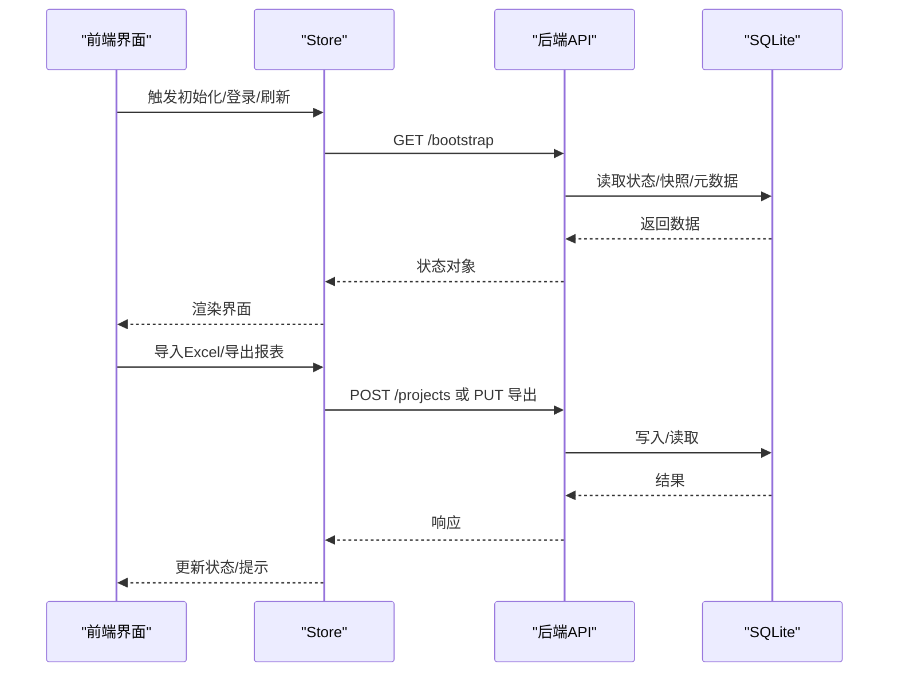
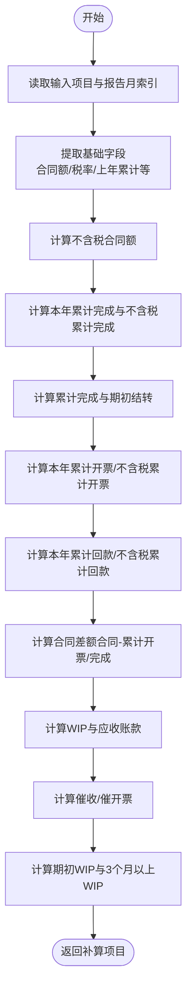
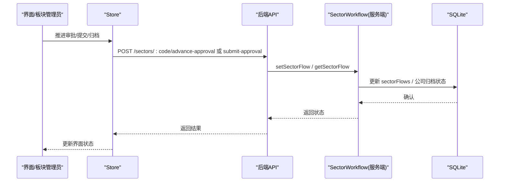
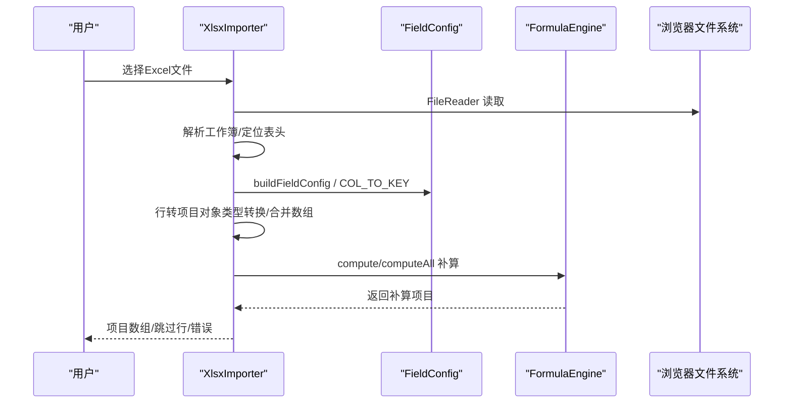
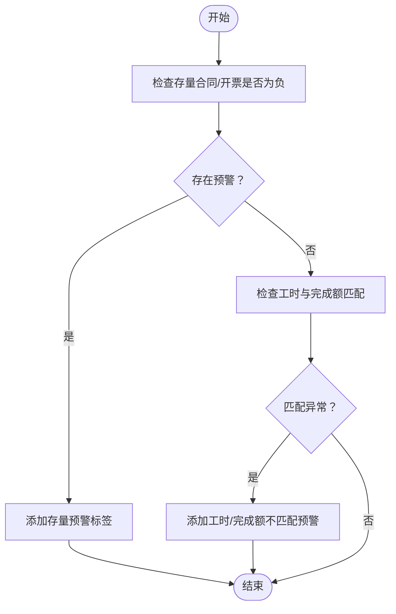
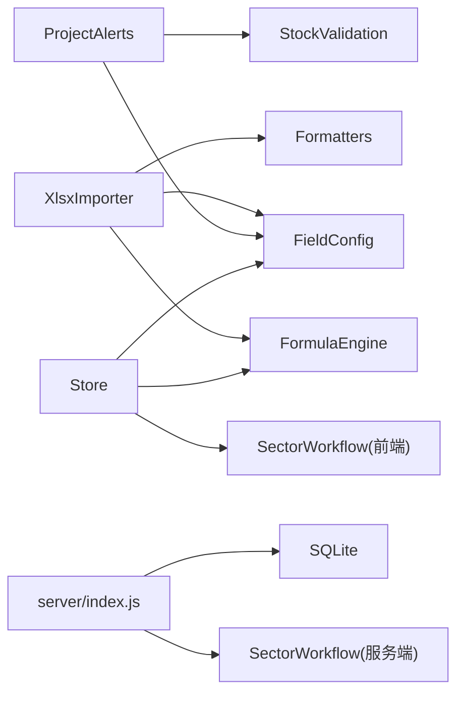

# 核心业务模块

<cite>
**本文引用的文件**
- [js/formula-engine.js](file://js/formula-engine.js)
- [js/sector-workflow.js](file://js/sector-workflow.js)
- [js/xlsx-importer.js](file://js/xlsx-importer.js)
- [js/project-alerts.js](file://js/project-alerts.js)
- [js/store.js](file://js/store.js)
- [js/field-config.js](file://js/field-config.js)
- [js/formatters.js](file://js/formatters.js)
- [js/stock-validation.js](file://js/stock-validation.js)
- [server/index.js](file://server/index.js)
- [server/sector-workflow.js](file://server/sector-workflow.js)
- [js/components/ProjectDetailDrawer.js](file://js/components/ProjectDetailDrawer.js)
- [js/components/ApprovalReviewSheet.js](file://js/components/ApprovalReviewSheet.js)
- [database-schema-design.md](file://database-schema-design.md)
</cite>

## 目录
1. [简介](#简介)
2. [项目结构](#项目结构)
3. [核心组件](#核心组件)
4. [架构总览](#架构总览)
5. [详细组件分析](#详细组件分析)
6. [依赖分析](#依赖分析)
7. [性能考量](#性能考量)
8. [故障排查指南](#故障排查指南)
9. [结论](#结论)
10. [附录](#附录)

## 简介
本文件面向项目“核心业务模块”的综合技术文档，围绕四大关键能力进行系统化解析：
- 公式计算引擎：负责项目字段的派生计算、税务与财务指标推导、批量计算与报告月索引管理。
- 审批工作流：前端纯函数驱动的板块级审批流状态机、权限与流程推进、统计与归档判定。
- Excel 导入导出：基于 SheetJS 的数据解析、字段映射、格式转换与错误处理，以及导出报表生成。
- 预警系统：结合存量合同/开票与工时/完成额的多维风险识别、预警标签与辅助填报参考。

文档还涵盖业务规则、数据验证与异常处理策略，以及模块间协作与集成模式，帮助读者快速理解并高效维护系统。

## 项目结构
项目采用前后端分离的单页应用架构，前端通过 Store 与后端 API 交互，核心业务逻辑分布在 js 与 server 目录中：
- 前端核心模块：公式引擎、工作流、Excel 导入导出、预警、字段配置、格式化、库存校验、全局状态与组件。
- 后端核心模块：REST API、审批工作流持久化、平台数据同步、快照与审计、定时任务调度。

```mermaid
graph TB
subgraph "前端"
FE_Store["Store<br/>全局状态"]
FE_Formula["FormulaEngine<br/>公式计算"]
FE_Workflow["SectorWorkflow<br/>前端工作流"]
FE_Xlsx["XlsxImporter<br/>Excel导入导出"]
FE_Alerts["ProjectAlerts<br/>预警系统"]
FE_Field["FieldConfig<br/>字段配置/权限"]
FE_Fmt["Formatters<br/>格式化"]
FE_Stock["StockValidation<br/>库存校验"]
FE_Drawer["ProjectDetailDrawer<br/>项目详情抽屉"]
FE_Approval["ApprovalReviewSheet<br/>审批评审表"]
end
subgraph "后端"
BE_Index["Express 服务器"]
BE_SecWF["SectorWorkflow(服务端)<br/>持久化与迁移"]
BE_DB["SQLite 数据库"]
end
FE_Store <- --> BE_Index
FE_Xlsx --> FE_Formula
FE_Xlsx --> FE_Field
FE_Xlsx --> FE_Fmt
FE_Alerts --> FE_Stock
FE_Drawer --> FE_Alerts
FE_Drawer --> FE_Stock
FE_Approval --> FE_Workflow
BE_Index --> BE_SecWF
BE_Index --> BE_DB
```

**图表来源**
- [js/store.js:97-128](file://js/store.js#L97-L128)
- [js/formula-engine.js:19-83](file://js/formula-engine.js#L19-L83)
- [js/sector-workflow.js:159-178](file://js/sector-workflow.js#L159-L178)
- [js/xlsx-importer.js:12-67](file://js/xlsx-importer.js#L12-L67)
- [js/project-alerts.js:65-89](file://js/project-alerts.js#L65-L89)
- [js/field-config.js:242-260](file://js/field-config.js#L242-L260)
- [js/formatters.js:152-166](file://js/formatters.js#L152-L166)
- [js/stock-validation.js:161-179](file://js/stock-validation.js#L161-L179)
- [server/index.js:88-100](file://server/index.js#L88-L100)
- [server/sector-workflow.js:250-272](file://server/sector-workflow.js#L250-L272)

**章节来源**
- [js/store.js:97-128](file://js/store.js#L97-L128)
- [server/index.js:88-100](file://server/index.js#L88-L100)

## 核心组件
本节概述四大核心模块的职责与边界：
- 公式计算引擎：接收项目对象与报告月索引，返回补算后的完整项目对象，覆盖合同、完成额、开票回款、WIP/应收、催收与3个月以上WIP等指标。
- 审批工作流：前端纯函数定义板块级审批流状态机、板块代码标准化、状态文本与统计、归档判定；服务端负责持久化、迁移与同步。
- Excel 导入导出：从文件解析为项目数组，字段映射与类型转换，错误收集与跳过行处理；导出时构建表头与数据行，调用公式引擎生成计算字段。
- 预警系统：基于存量合同/开票与工时/完成额的多维校验，输出预警标签与辅助填报参考，支持工时准备状态判断。

**章节来源**
- [js/formula-engine.js:19-83](file://js/formula-engine.js#L19-L83)
- [js/sector-workflow.js:159-178](file://js/sector-workflow.js#L159-L178)
- [js/xlsx-importer.js:12-67](file://js/xlsx-importer.js#L12-L67)
- [js/project-alerts.js:65-89](file://js/project-alerts.js#L65-L89)

## 架构总览
前端通过 Store 与后端 API 交互，Store 负责状态管理、字段字典加载、快照与审批流程推进、锁定状态与周期配置等；后端提供 REST API，包括引导数据、项目 CRUD、快照、审批推进、归档、平台数据同步、管理员重置与导入等。



**图表来源**
- [js/store.js:268-275](file://js/store.js#L268-L275)
- [server/index.js:91-100](file://server/index.js#L91-L100)
- [server/index.js:112-138](file://server/index.js#L112-L138)

**章节来源**
- [js/store.js:268-275](file://js/store.js#L268-L275)
- [server/index.js:91-100](file://server/index.js#L91-L100)

## 详细组件分析

### 公式计算引擎（FormulaEngine）
- 设计目标：根据项目原始数据与报告月索引，一次性补算所有派生字段，确保财务口径一致与数据完整性。
- 关键输入：项目对象（含手工与系统同步字段）、报告月索引（0=1月，11=12月）。
- 核心计算链路：
  - 合同与税务：合同总额、不含税合同额、税率。
  - 年度与累计：年初累计完成、本年累计完成、不含税累计完成。
  - 月度完成：当月完成额、累计完成（含上年）。
  - 开票与回款：本年累计开票、累计回款、不含税累计开票与回款。
  - 合同差额：合同额-累计开票、合同额-累计完成。
  - 财务WIP与应收：累计完成-累计开票、累计开票-累计回款。
  - 催收与催开票：应收账款、期初应收账款、WIP待开票。
  - WIP分析：期初WIP、3个月以上WIP（WIP余额-近3个月产值）。
- 输出：补算后的项目对象，包含所有派生字段。
- 批量计算：computeAll 对项目数组统一补算。
- 报告月索引：getMonthIdx 支持 'YYYY-MM' 字符串解析，默认取当前月。



**图表来源**
- [js/formula-engine.js:19-83](file://js/formula-engine.js#L19-L83)

**章节来源**
- [js/formula-engine.js:19-101](file://js/formula-engine.js#L19-L101)

### 审批工作流（SectorWorkflow）
- 前端纯函数定义：
  - 状态机：draft → approve1 → approve2。
  - 板块注册与名称映射：支持默认板块与动态扩展。
  - 板块代码标准化：normalizeSectorCode 统一格式。
  - 状态文本与统计：sectorFlowStatusText、countSectorStats。
  - 归档判定：allSectorsReadyForArchive。
  - 项目筛选与活动流程索引：filterProjectsBySector、sectorActiveFlowIdx。
- 服务端持久化与迁移：
  - 默认板块注册、名称合并与持久化。
  - 迁移旧版元数据为新结构，补齐缺失板块与默认状态。
  - 同步公司级归档状态与旧版元数据一致性。
  - 提供 setSectorFlow/getSectorFlow/migrateSectorFlows 等接口。



**图表来源**
- [js/sector-workflow.js:159-178](file://js/sector-workflow.js#L159-L178)
- [server/index.js:302-346](file://server/index.js#L302-L346)
- [server/sector-workflow.js:240-248](file://server/sector-workflow.js#L240-L248)

**章节来源**
- [js/sector-workflow.js:159-178](file://js/sector-workflow.js#L159-L178)
- [server/sector-workflow.js:250-272](file://server/sector-workflow.js#L250-L272)

### Excel 导入导出（XlsxImporter）
- 导入流程：
  - 读取文件 → 解析工作簿 → 解析首表 → 定位表头行 → 行转项目对象。
  - 字段映射：COL_TO_KEY 将列字母映射到项目字段键。
  - 类型转换：金额/比率/日期/文本，日期通过 Formatters.normalizeDateValue 规范化。
  - 合并数组：flatToArrays 将 mc_/mi_/mp_ 展开为 monthly_* 数组。
  - 必填校验：项目号为空则跳过行；错误收集。
  - 公式补算：调用 FormulaEngine.compute 补算派生字段。
- 导出流程：
  - 构建两行表头（分节与字段名）。
  - 调用 FormulaEngine.computeAll 生成计算字段。
  - 逐行写入，使用 FieldConfig.arraysToFlat 展开。
  - 写入工作簿并下载。



**图表来源**
- [js/xlsx-importer.js:12-67](file://js/xlsx-importer.js#L12-L67)
- [js/field-config.js:242-260](file://js/field-config.js#L242-L260)
- [js/formula-engine.js:88-90](file://js/formula-engine.js#L88-L90)

**章节来源**
- [js/xlsx-importer.js:12-186](file://js/xlsx-importer.js#L12-L186)

### 预警系统（ProjectAlerts）
- 风险识别：
  - 存量合同/开票：通过 StockValidation.hasInvoiceStockNegative、hasContractStockViolation 判定。
  - 完成额与工时：当月完成额>0 且工时<阈值，或工时>阈值且完成额<阈值，触发预警。
- 输出：返回预警标签数组，支持 hasAnyAlert 快速判断。
- 辅助参考：getCompletionFillAux 提供总合同额、累计完成、当月工时与成本等，辅助填报。



**图表来源**
- [js/project-alerts.js:65-89](file://js/project-alerts.js#L65-L89)
- [js/stock-validation.js:47-61](file://js/stock-validation.js#L47-L61)

**章节来源**
- [js/project-alerts.js:65-141](file://js/project-alerts.js#L65-L141)
- [js/stock-validation.js:161-179](file://js/stock-validation.js#L161-L179)

### 字段配置与权限（FieldConfig）
- 字段字典：COL_TO_KEY 映射列字母到项目字段键，arraysToFlat/flatToArrays 在数组与扁平键之间转换。
- 权限矩阵：
  - auto_calc/system_sync 只读；manual_input 按角色与锁定状态决定可编辑。
  - 月度完成（AV–BG）：报告月当月及之后可写。
  - 月度开票/回款（BH–CE）：仅报告月之后可写。
  - 角色限制：executive_viewer/sector_director/group_leader 始终只读；system_admin 在锁定期也可写。
- 月度编辑窗口：isMonthlyFieldEditable/isPastReportingMonthField 用于样式与交互控制。

**章节来源**
- [js/field-config.js:196-260](file://js/field-config.js#L196-L260)

### 格式化与数值处理（Formatters）
- 金额：千分位、两位小数、等宽数字。
- 百分比：乘以100，保留指定小数位。
- 日期：Excel序列日↔ISO日期互转，统一规范化。
- 解析：parseAmount 支持千分位去除与解析。

**章节来源**
- [js/formatters.js:152-166](file://js/formatters.js#L152-L166)

### 库存校验与提交约束（StockValidation）
- 存量预警：R（合同）/S（开票）为负时高亮与提示。
- 填报期对冲：锁定开放期自动调减当月完成额使S归零。
- 提交期校验：锁定期间禁止S为负，否则列出违规项目并提示。

**章节来源**
- [js/stock-validation.js:75-149](file://js/stock-validation.js#L75-L149)

### 前端组件与工作流集成
- 项目详情抽屉（ProjectDetailDrawer）：
  - 基于 FieldConfig 构建布局，按可编辑/只读分区块。
  - 读取 Timesheet/Cost 数据，生成预警标签与完成额填报辅助。
  - 支持系统引用字段覆盖提示与样式高亮。
- 审批评审表（ApprovalReviewSheet）：
  - 仅展示板块项目，支持新增/变更筛选。
  - 根据审批流状态决定是否可编辑，不可编辑时提示“需驳回”。

**章节来源**
- [js/components/ProjectDetailDrawer.js:152-172](file://js/components/ProjectDetailDrawer.js#L152-L172)
- [js/components/ApprovalReviewSheet.js:20-86](file://js/components/ApprovalReviewSheet.js#L20-L86)

## 依赖分析
- 前端模块耦合：
  - XlsxImporter 依赖 FieldConfig、FormulaEngine、Formatters。
  - ProjectAlerts 依赖 StockValidation、FieldConfig。
  - Store 依赖 SectorWorkflow、FormulaEngine、FieldConfig。
- 后端模块耦合：
  - server/index.js 聚合 SectorWorkflow(服务端)、快照服务、平台同步、导入/导出等。
- 数据库支撑：
  - database-schema-design.md 描述 projects、monthly_records、snapshots、audit_log 等表结构与关键业务逻辑（月度初始化、跨年翻转、预收款核销、快照版本键）。



**图表来源**
- [js/xlsx-importer.js:35-67](file://js/xlsx-importer.js#L35-L67)
- [js/project-alerts.js:70-77](file://js/project-alerts.js#L70-L77)
- [js/store.js:243-249](file://js/store.js#L243-L249)
- [server/index.js:88-100](file://server/index.js#L88-L100)

**章节来源**
- [database-schema-design.md:97-136](file://database-schema-design.md#L97-L136)

## 性能考量
- 公式计算：
  - computeAll 对项目数组批量补算，减少重复计算；合理利用 slice 与 reduce 的时间复杂度。
- Excel 导入：
  - SheetJS 解析为行数组，逐行处理；对空行与无效行进行跳过，避免无效计算。
  - 类型转换与日期规范化在导入阶段集中处理，减少渲染层负担。
- 前端渲染：
  - ProjectDetailDrawer 按需加载 Timesheet/Cost 数据，避免阻塞。
  - 字段布局与权限控制在前端完成，减少后端压力。
- 后端 API：
  - Store 通过 /bootstrap 一次性拉取状态，减少多次请求；/api/projects 批量写入降低网络开销。

[本节为通用指导，无需特定文件引用]

## 故障排查指南
- Excel 导入失败：
  - 检查 SheetJS 是否加载成功；确认首表与表头行解析逻辑；查看跳过行与错误列表。
  - 核对字段映射 COL_TO_KEY 与列顺序；日期格式是否符合 Formatters.normalizeDateValue。
- 公式计算异常：
  - 确认报告月索引 getMonthIdx 正确；检查数组字段（monthly_*）是否正确展开/合并。
- 预警不显示：
  - 确认 Timesheet/Cost 数据已加载；检查 EPS 阈值与 hasAnyAlert 判断逻辑。
- 审批推进失败：
  - 检查板块状态与 reportingSubmitted；确认服务端 setSectorFlow 返回状态。
- 提交期校验失败：
  - 检查 StockValidation.validateProjectsForSubmit 返回的违规列表与提示信息。

**章节来源**
- [js/xlsx-importer.js:12-28](file://js/xlsx-importer.js#L12-L28)
- [js/formula-engine.js:97-101](file://js/formula-engine.js#L97-L101)
- [js/project-alerts.js:91-93](file://js/project-alerts.js#L91-L93)
- [server/index.js:302-346](file://server/index.js#L302-L346)
- [js/stock-validation.js:131-149](file://js/stock-validation.js#L131-L149)

## 结论
本项目通过“公式计算引擎 + 审批工作流 + Excel 导入导出 + 预警系统”的协同，实现了从数据采集、计算校验到审批归档的闭环。前端模块职责清晰、耦合度适中，后端通过 REST API 与 SQLite 提供稳定的数据与状态支撑。建议持续完善字段字典与权限矩阵、加强异常与边界条件处理，并在生产环境启用定时平台同步与快照维护，保障数据一致性与可追溯性。

[本节为总结，无需特定文件引用]

## 附录
- 数据库表结构与关键业务逻辑参考 database-schema-design.md，涵盖月度数据初始化、跨年翻转、预收款核销与快照版本键等。
- 设计文档与看板规范可参考 docs/设计文档 相关文件，统一视觉与交互规范。

**章节来源**
- [database-schema-design.md:97-136](file://database-schema-design.md#L97-L136)