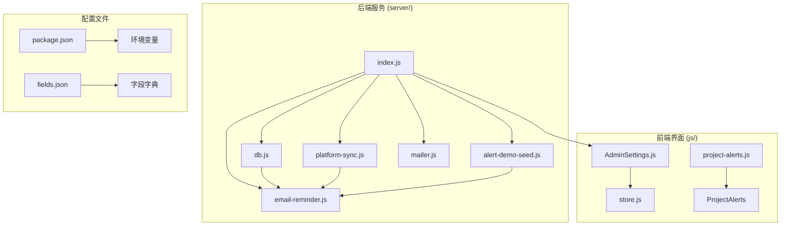
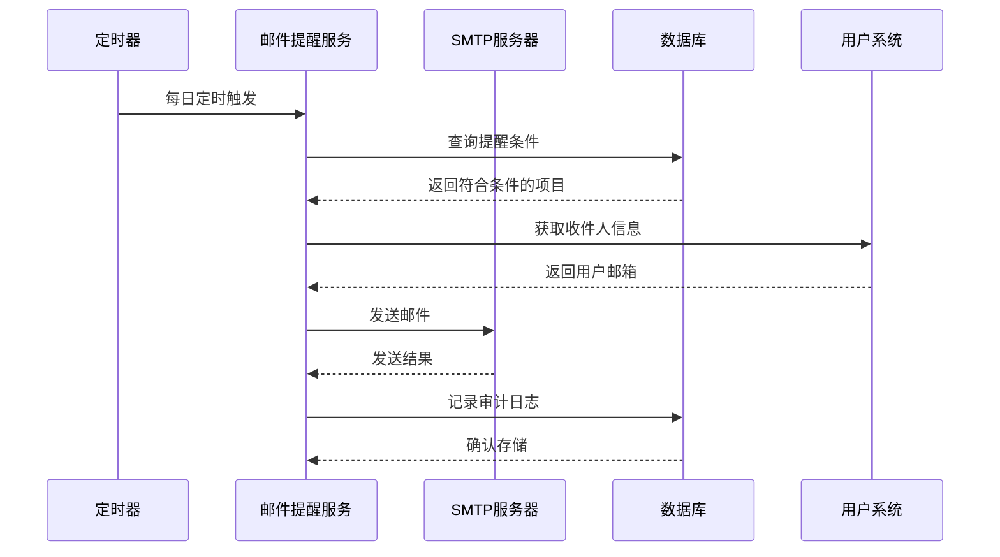
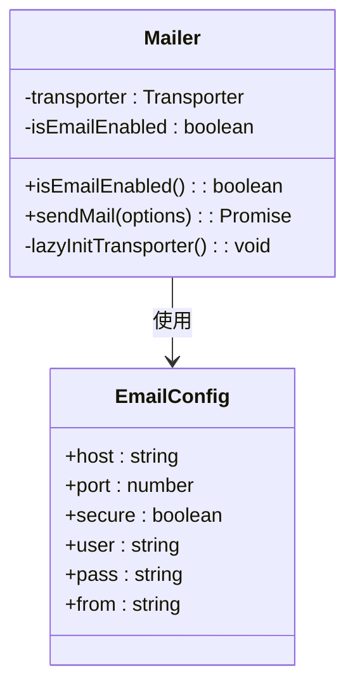
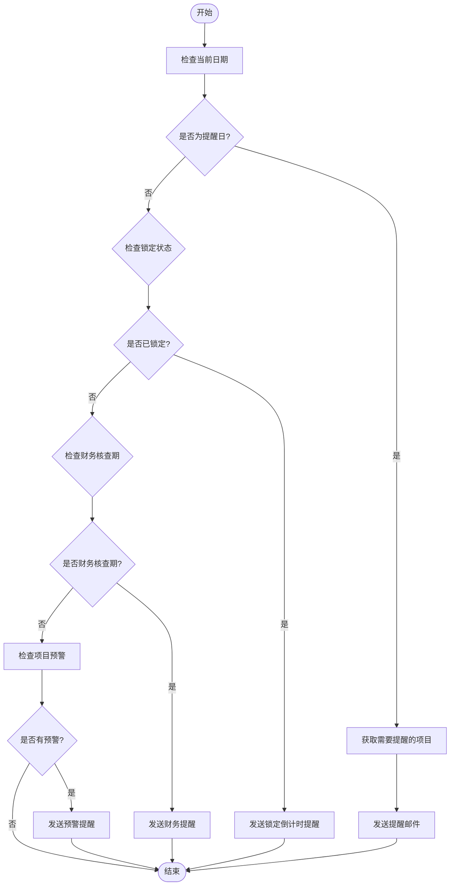
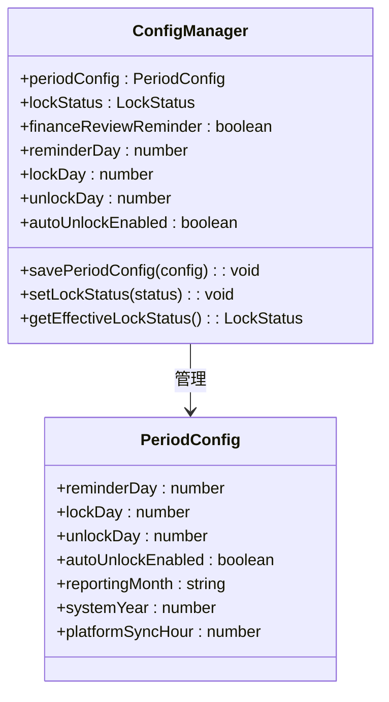
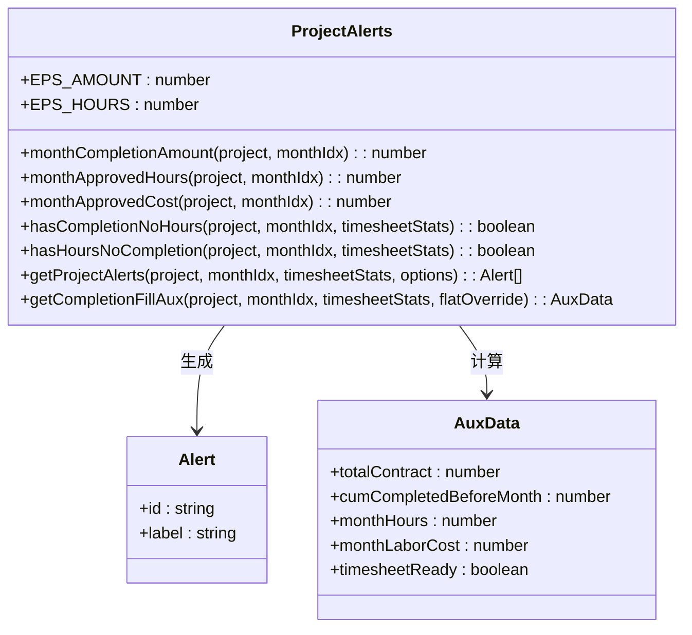
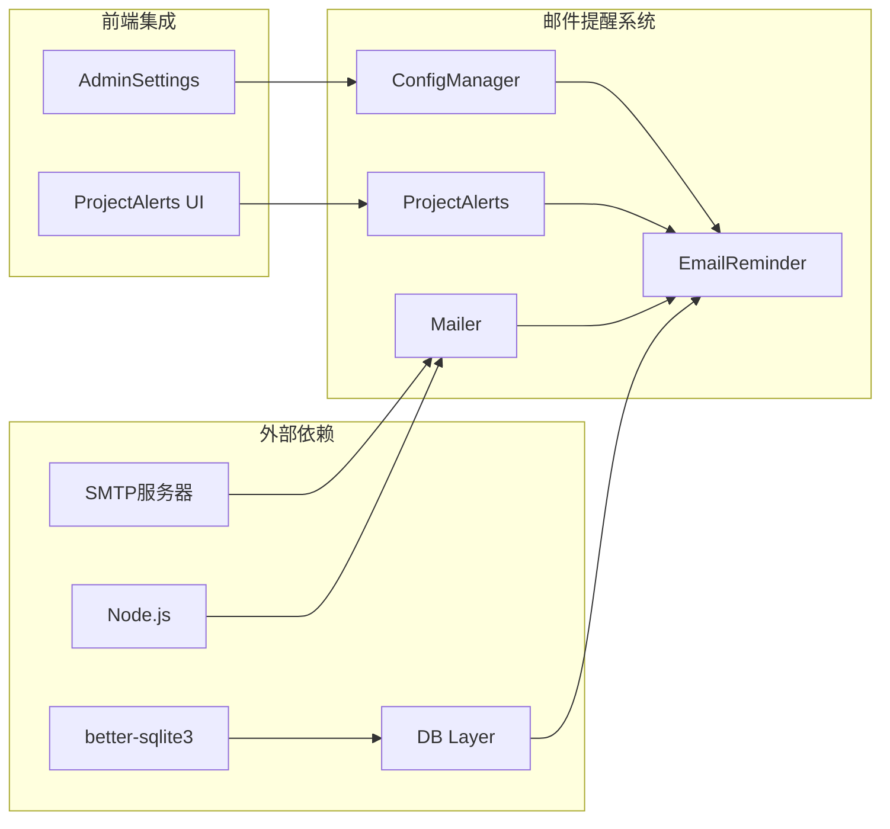

# 邮件提醒系统

<cite>
**本文档引用的文件**
- [server/index.js](file://server/index.js)
- [server/db.js](file://server/db.js)
- [server/platform-sync.js](file://server/platform-sync.js)
- [js/project-alerts.js](file://js/project-alerts.js)
- [js/views/AdminSettings.js](file://js/views/AdminSettings.js)
- [AGENTS.md](file://AGENTS.md)
- [package.json](file://package.json)
</cite>

## 目录
1. [简介](#简介)
2. [项目结构](#项目结构)
3. [核心组件](#核心组件)
4. [架构概览](#架构概览)
5. [详细组件分析](#详细组件分析)
6. [依赖关系分析](#依赖关系分析)
7. [性能考虑](#性能考虑)
8. [故障排除指南](#故障排除指南)
9. [结论](#结论)

## 简介

邮件提醒系统是项目追踪表线上化平台的重要组成部分，负责在特定时间点向相关人员发送邮件提醒。该系统集成了多种提醒场景，包括填报提醒日通知、锁定倒计时提醒、财务核查提醒以及项目预警提醒。

系统基于Node.js + Express + SQLite的技术栈构建，采用模块化设计，支持SMTP邮件传输、定时任务调度和灵活的配置管理。邮件提醒功能通过环境变量配置启用，支持多种提醒场景的智能判断和模板化处理。

## 项目结构

项目采用前后端分离的架构设计，邮件提醒系统主要分布在以下模块中：

**图表来源**
- [server/index.js:1-784](file://server/index.js#L1-L784)
- [server/db.js:1-525](file://server/db.js#L1-L525)

**章节来源**
- [server/index.js:1-784](file://server/index.js#L1-L784)
- [AGENTS.md:122-138](file://AGENTS.md#L122-L138)

## 核心组件

### 邮件提醒服务架构

邮件提醒系统的核心组件包括：

1. **SMTP传输层** - 基于nodemailer封装的邮件传输服务
2. **定时任务调度** - 基于Node.js定时器的邮件发送机制
3. **提醒场景处理器** - 针对不同业务场景的提醒逻辑
4. **配置管理系统** - 支持动态配置和环境变量管理
5. **审计日志系统** - 记录邮件发送状态和结果

### 关键配置参数

系统通过环境变量进行配置管理：

| 环境变量 | 默认值 | 说明 |
|---------|--------|------|
| PTRACK_SMTP_HOST | 无 | SMTP服务器地址 |
| PTRACK_SMTP_PORT | 587 | SMTP端口 |
| PTRACK_SMTP_SECURE | false | 是否使用TLS加密 |
| PTRACK_SMTP_USER | 无 | SMTP发件账号 |
| PTRACK_SMTP_PASS | 无 | SMTP发件密码 |
| PTRACK_SMTP_FROM | PTRACK_SMTP_USER | 发件人显示名 |

**章节来源**
- [AGENTS.md:66-71](file://AGENTS.md#L66-L71)
- [server/db.js:62-70](file://server/db.js#L62-L70)

## 架构概览

邮件提醒系统采用事件驱动的异步架构，通过定时任务和业务事件触发邮件发送：

**图表来源**
- [server/index.js:754-783](file://server/index.js#L754-L783)
- [server/db.js:108-119](file://server/db.js#L108-L119)

## 详细组件分析

### SMTP传输层

SMTP传输层基于nodemailer库实现，提供懒初始化的传输器管理和邮件发送功能：

**图表来源**
- [server/index.js:13-19](file://server/index.js#L13-L19)

### 邮件提醒处理器

邮件提醒处理器负责根据不同的业务场景生成相应的提醒内容：

**图表来源**
- [server/db.js:108-119](file://server/db.js#L108-L119)
- [server/db.js:121-136](file://server/db.js#L121-L136)

### 配置管理系统

配置管理系统提供灵活的邮件提醒配置选项：

**图表来源**
- [js/views/AdminSettings.js:116-135](file://js/views/AdminSettings.js#L116-L135)
- [server/db.js:62-70](file://server/db.js#L62-L70)

**章节来源**
- [js/views/AdminSettings.js:116-171](file://js/views/AdminSettings.js#L116-L171)
- [server/db.js:194-266](file://server/db.js#L194-L266)

### 项目预警系统

项目预警系统为邮件提醒提供数据支持，识别潜在问题项目：

**图表来源**
- [js/project-alerts.js:10-89](file://js/project-alerts.js#L10-L89)

**章节来源**
- [js/project-alerts.js:1-143](file://js/project-alerts.js#L1-L143)

## 依赖关系分析

邮件提醒系统与其他模块存在紧密的依赖关系：

**图表来源**
- [server/index.js:13-19](file://server/index.js#L13-L19)
- [package.json:13-17](file://package.json#L13-L17)

**章节来源**
- [server/index.js:1-784](file://server/index.js#L1-784)
- [package.json:1-19](file://package.json#L1-19)

## 性能考虑

邮件提醒系统在设计时充分考虑了性能优化：

1. **懒加载机制** - SMTP传输器按需初始化，减少启动时的资源消耗
2. **异步处理** - 邮件发送采用异步方式，避免阻塞主线程
3. **缓存策略** - 用户配置和项目数据进行适当的缓存
4. **批量处理** - 支持批量邮件发送，提高效率
5. **错误重试** - 实现邮件发送失败的重试机制

## 故障排除指南

### 常见问题及解决方案

1. **SMTP连接失败**
   - 检查网络连接和防火墙设置
   - 验证SMTP服务器地址和端口配置
   - 确认用户名和密码正确性

2. **邮件发送超时**
   - 检查SMTP服务器响应时间
   - 调整超时参数设置
   - 考虑增加重试次数

3. **定时任务未执行**
   - 检查系统时间和时区设置
   - 验证定时器配置
   - 查看系统日志确认执行情况

4. **邮件内容异常**
   - 检查模板配置
   - 验证数据格式
   - 确认字段映射正确

**章节来源**
- [AGENTS.md:66-71](file://AGENTS.md#L66-L71)
- [server/db.js:108-136](file://server/db.js#L108-L136)

## 结论

邮件提醒系统作为项目追踪表线上化平台的重要组成部分，通过模块化的架构设计和灵活的配置管理，实现了多样化的提醒场景支持。系统采用事件驱动的异步处理模式，结合定时任务调度和业务事件触发，确保了邮件提醒的及时性和准确性。

通过合理的性能优化和故障排除机制，系统能够在保证稳定性的同时提供高效的邮件提醒服务。未来可以进一步增强邮件模板的自定义能力、扩展更多的提醒场景，并优化邮件发送的性能表现。