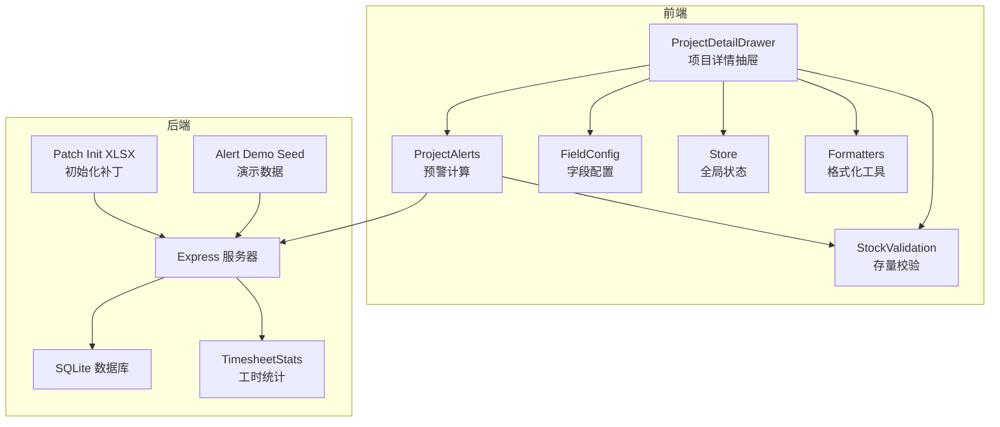
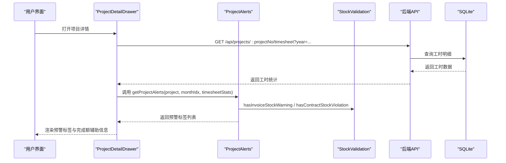
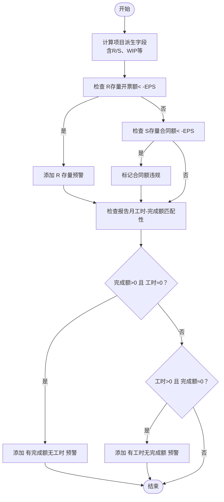
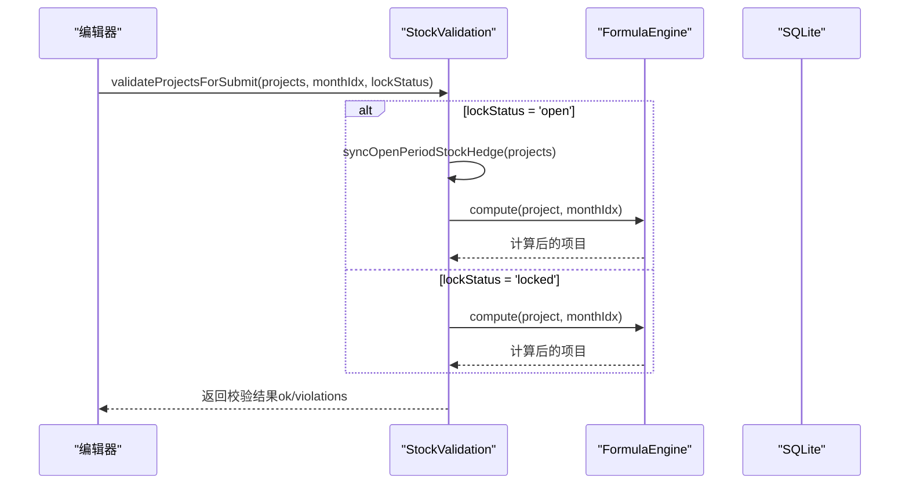
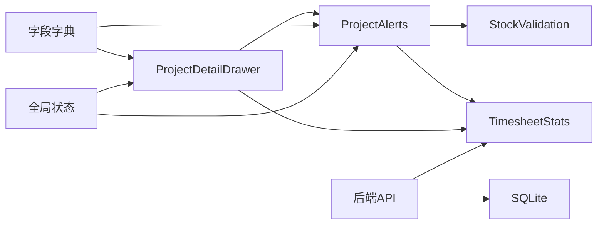

# 项目预警系统

<cite>
**本文档引用的文件**
- [project-alerts.js](file://js/project-alerts.js)
- [stock-validation.js](file://js/stock-validation.js)
- [ProjectDetailDrawer.js](file://js/components/ProjectDetailDrawer.js)
- [alert-demo-seed.js](file://server/alert-demo-seed.js)
- [patch-init-xlsx-alerts.js](file://server/patch-init-xlsx-alerts.js)
- [timesheet-stats.js](file://server/timesheet-stats.js)
- [db.js](file://server/db.js)
- [index.js](file://server/index.js)
- [field-config.js](file://js/field-config.js)
- [fields.json](file://config/fields/fields.json)
- [store.js](file://js/store.js)
- [formula-engine.js](file://js/formula-engine.js)
</cite>

## 目录
1. [简介](#简介)
2. [项目结构](#项目结构)
3. [核心组件](#核心组件)
4. [架构概览](#架构概览)
5. [详细组件分析](#详细组件分析)
6. [依赖关系分析](#依赖关系分析)
7. [性能考量](#性能考量)
8. [故障排除指南](#故障排除指南)
9. [结论](#结论)
10. [附录](#附录)

## 简介
本项目预警系统围绕项目数据的多维度风险识别与实时监控构建，重点覆盖以下预警规则：
- WIP超期预警：基于3个月以上WIP余额与近3个月产值的对比，识别长期挂账风险。
- 应收账款催收提醒：基于应收账款（含预收）与期初应收账款的计算结果，识别催收压力。
- 合同额偏差监控：基于存量合同额（总合同额与累计完成额之差）的负值预警，结合完成额与工时的匹配性检查，识别数据异常。

系统通过前端Drawer界面实时展示预警标签，后端提供工时统计与项目数据计算支持，并提供演示数据与初始化脚本以验证规则有效性。

## 项目结构
预警系统主要分布在前端与后端两个层面：
- 前端层：项目预警标签渲染、工时统计请求、字段权限控制与报表布局。
- 后端层：SQLite数据存储、工时明细聚合、项目数据计算与API接口。

**图表来源**
- [ProjectDetailDrawer.js:152-176](file://js/components/ProjectDetailDrawer.js#L152-L176)
- [project-alerts.js:65-89](file://js/project-alerts.js#L65-L89)
- [stock-validation.js:47-61](file://js/stock-validation.js#L47-L61)
- [index.js:140-153](file://server/index.js#L140-L153)
- [timesheet-stats.js:60-80](file://server/timesheet-stats.js#L60-L80)
- [alert-demo-seed.js:40-78](file://server/alert-demo-seed.js#L40-L78)
- [patch-init-xlsx-alerts.js:35-125](file://server/patch-init-xlsx-alerts.js#L35-L125)

**章节来源**
- [ProjectDetailDrawer.js:152-176](file://js/components/ProjectDetailDrawer.js#L152-L176)
- [project-alerts.js:65-89](file://js/project-alerts.js#L65-L89)
- [stock-validation.js:47-61](file://js/stock-validation.js#L47-L61)
- [index.js:140-153](file://server/index.js#L140-L153)
- [timesheet-stats.js:60-80](file://server/timesheet-stats.js#L60-L80)
- [alert-demo-seed.js:40-78](file://server/alert-demo-seed.js#L40-L78)
- [patch-init-xlsx-alerts.js:35-125](file://server/patch-init-xlsx-alerts.js#L35-L125)

## 核心组件
- 项目预警计算模块（ProjectAlerts）：提供预警规则的计算入口，包括R/S存量指标预警与工时-完成额匹配性检查。
- 存量校验模块（StockValidation）：负责合同额与开票额的存量计算与预警，提供提交期校验与开放期自动对冲能力。
- 工时统计服务（TimesheetStats）：聚合工时明细，按专业与板块统计，支持Drawer中的“完成额填报辅助”功能。
- 项目详情抽屉（ProjectDetailDrawer）：集成预警标签展示、工时统计加载与完成额填报辅助提示。
- 演示数据与初始化（Alert Demo Seed / Patch Init XLSX）：提供预设项目与工时数据，确保规则可验证。

**章节来源**
- [project-alerts.js:65-89](file://js/project-alerts.js#L65-L89)
- [stock-validation.js:47-61](file://js/stock-validation.js#L47-L61)
- [timesheet-stats.js:60-80](file://server/timesheet-stats.js#L60-L80)
- [ProjectDetailDrawer.js:152-176](file://js/components/ProjectDetailDrawer.js#L152-L176)
- [alert-demo-seed.js:40-78](file://server/alert-demo-seed.js#L40-L78)
- [patch-init-xlsx-alerts.js:35-125](file://server/patch-init-xlsx-alerts.js#L35-L125)

## 架构概览
预警系统采用前后端分离架构：
- 前端通过Store与后端API交互，获取项目数据与工时统计，并在Drawer中展示预警标签。
- 后端提供REST接口，负责数据持久化、工时统计聚合与演示数据初始化。
- 字段配置与权限控制确保不同角色在不同阶段的可编辑范围，保障数据一致性。

**图表来源**
- [ProjectDetailDrawer.js:427-452](file://js/components/ProjectDetailDrawer.js#L427-L452)
- [project-alerts.js:65-89](file://js/project-alerts.js#L65-L89)
- [stock-validation.js:47-61](file://js/stock-validation.js#L47-L61)
- [index.js:140-153](file://server/index.js#L140-L153)
- [db.js:415-437](file://server/db.js#L415-L437)

**章节来源**
- [ProjectDetailDrawer.js:427-452](file://js/components/ProjectDetailDrawer.js#L427-L452)
- [project-alerts.js:65-89](file://js/project-alerts.js#L65-L89)
- [stock-validation.js:47-61](file://js/stock-validation.js#L47-L61)
- [index.js:140-153](file://server/index.js#L140-L153)
- [db.js:415-437](file://server/db.js#L415-L437)

## 详细组件分析

### 预警规则设计与实现
- R/S 存量预警（开票/合同额）
  - R（存量开票额）：总合同额与累计开票额之差，小于阈值（EPS）时预警。
  - S（存量合同额）：总合同额与累计完成额之差，小于阈值（EPS）时违规，提交期阻断。
- 工时-完成额匹配性检查
  - 报告月存在完成额但无工时，或存在工时但无完成额，分别触发“有完成额无工时”“有工时无完成额”预警。
- EPS阈值
  - 完成额与工时的极小阈值（EPS_AMOUNT/EPS_HOURS）用于区分“几乎为零”与“真实为零”。

**图表来源**
- [project-alerts.js:46-56](file://js/project-alerts.js#L46-L56)
- [stock-validation.js:47-55](file://js/stock-validation.js#L47-L55)
- [formula-engine.js:19-83](file://js/formula-engine.js#L19-L83)

**章节来源**
- [project-alerts.js:46-56](file://js/project-alerts.js#L46-L56)
- [stock-validation.js:47-55](file://js/stock-validation.js#L47-L55)
- [formula-engine.js:19-83](file://js/formula-engine.js#L19-L83)

### 预警阈值设置与触发条件
- EPS阈值
  - 完成额极小阈值（EPS_AMOUNT）与工时极小阈值（EPS_HOURS）用于避免浮点误差导致的误判。
- 存量指标阈值
  - R/S均采用同一EPS阈值（负值即触发），确保预警的一致性。
- 工时-完成额匹配性
  - 完成额与工时分别与各自EPS比较，避免极端小值被误判为“有数据”。

**章节来源**
- [project-alerts.js:7-8](file://js/project-alerts.js#L7-L8)
- [stock-validation.js](file://js/stock-validation.js#L17)

### 预警级别与通知机制
- 预警级别
  - 系统未定义独立的“级别”字段，当前通过“标签集合”表达风险类型（R/S存量、有完成额无工时、有工时无完成额）。
- 通知渠道
  - 前端Drawer中直接展示预警标签，无内置消息推送或邮件发送逻辑。
- 与项目数据关联
  - 预警依赖项目派生字段（R/S、WIP、累计完成等）与工时统计（按专业/板块汇总）。

**章节来源**
- [ProjectDetailDrawer.js:531-543](file://js/components/ProjectDetailDrawer.js#L531-L543)
- [project-alerts.js:65-89](file://js/project-alerts.js#L65-L89)

### 实时监控与历史数据分析
- 实时监控
  - Drawer打开时按需请求工时统计，结合当前项目数据与报告月索引计算预警。
- 历史数据分析
  - 工时统计支持按年查询，便于查看历史趋势与对比。
  - 字段字典定义了月度列（AV–BG、BH–CE等）与计算公式，支撑历史数据的可追溯性。

**章节来源**
- [ProjectDetailDrawer.js:427-452](file://js/components/ProjectDetailDrawer.js#L427-L452)
- [timesheet-stats.js:60-80](file://server/timesheet-stats.js#L60-L80)
- [fields.json:634-787](file://config/fields/fields.json#L634-L787)

### 预警规则配置与自定义阈值
- 配置位置
  - EPS阈值与预警规则在前端模块中集中定义，便于统一管理与修改。
- 自定义建议
  - 可在项目预警计算函数中引入外部配置项，以支持不同项目或板块的差异化阈值。
  - 建议将EPS阈值参数化，以便通过后端配置或前端设置界面动态调整。

**章节来源**
- [project-alerts.js:7-8](file://js/project-alerts.js#L7-L8)
- [stock-validation.js](file://js/stock-validation.js#L17)

### 报警处理流程
- 开放期处理
  - 若S（存量合同额）为负，开放期可自动对冲（减少报告月完成额），使S归零，避免提交阻断。
- 提交期校验
  - 提交时对S进行严格校验，若仍为负则阻断并提示调减完成额或完成合同变更。

**图表来源**
- [stock-validation.js:131-149](file://js/stock-validation.js#L131-L149)
- [stock-validation.js:94-106](file://js/stock-validation.js#L94-L106)
- [formula-engine.js:19-90](file://js/formula-engine.js#L19-L90)

**章节来源**
- [stock-validation.js:131-149](file://js/stock-validation.js#L131-L149)
- [stock-validation.js:94-106](file://js/stock-validation.js#L94-L106)
- [formula-engine.js:19-90](file://js/formula-engine.js#L19-L90)

### 预警示例与规则配置
- 预警示例
  - R 存量开票额为负：通过演示种子脚本为特定项目设置“存量开票额为负”的场景。
  - S 存量合同额为负：通过演示种子脚本为特定项目设置“存量合同额为负”的场景。
  - 有完成额无工时/有工时无完成额：通过演示种子脚本注入工时明细，触发相应预警。
- 规则配置
  - EPS阈值与预警标签在前端模块中定义，可通过修改对应常量与标签文案进行配置。

**章节来源**
- [alert-demo-seed.js:40-78](file://server/alert-demo-seed.js#L40-L78)
- [alert-demo-seed.js:80-169](file://server/alert-demo-seed.js#L80-L169)
- [project-alerts.js:65-89](file://js/project-alerts.js#L65-L89)

## 依赖关系分析
- 组件耦合
  - ProjectAlerts依赖StockValidation与TimesheetStats，用于R/S预警与工时-完成额匹配性检查。
  - ProjectDetailDrawer依赖ProjectAlerts与TimesheetStats，负责渲染与交互。
  - 后端API依赖SQLite与TimesheetStats，提供工时统计与项目数据访问。
- 外部依赖
  - 字段字典（fields.json）定义了月度列与计算公式，是预警规则的基础数据结构。
  - 全局状态（store.js）提供报告月与锁定状态，影响预警触发与编辑权限。

**图表来源**
- [project-alerts.js:70-86](file://js/project-alerts.js#L70-L86)
- [stock-validation.js:47-61](file://js/stock-validation.js#L47-L61)
- [ProjectDetailDrawer.js:152-176](file://js/components/ProjectDetailDrawer.js#L152-L176)
- [index.js:140-153](file://server/index.js#L140-L153)
- [fields.json:634-787](file://config/fields/fields.json#L634-L787)
- [store.js:97-128](file://js/store.js#L97-L128)

**章节来源**
- [project-alerts.js:70-86](file://js/project-alerts.js#L70-L86)
- [stock-validation.js:47-61](file://js/stock-validation.js#L47-L61)
- [ProjectDetailDrawer.js:152-176](file://js/components/ProjectDetailDrawer.js#L152-L176)
- [index.js:140-153](file://server/index.js#L140-L153)
- [fields.json:634-787](file://config/fields/fields.json#L634-L787)
- [store.js:97-128](file://js/store.js#L97-L128)

## 性能考量
- 前端渲染
  - Drawer按需加载工时统计，避免一次性渲染大量数据。
  - 预警计算在前端完成，依赖项目派生字段与工时统计，复杂度与项目数量线性相关。
- 后端查询
  - 工时统计按年过滤，避免全表扫描；索引建立在项目号与工作日期上，提升查询效率。
- 数据规模
  - SQLite适合中小规模项目数据；若项目数量增长，建议评估分页与缓存策略。

[本节为通用指导，无需具体文件分析]

## 故障排除指南
- 预警标签未显示
  - 检查Drawer是否正确请求工时统计接口，确认返回数据非空。
  - 确认项目派生字段（R/S、WIP等）已计算完成。
- 工时统计为空
  - 确认查询年份与项目号正确，检查数据库中是否存在对应工时明细。
- 预警规则未生效
  - 检查EPS阈值设置是否合理，避免过小导致误判。
  - 确认报告月索引与当前月份一致，避免匹配性检查失效。
- 演示数据未加载
  - 运行演示数据初始化脚本，确保特定项目与工时明细已注入。

**章节来源**
- [ProjectDetailDrawer.js:427-452](file://js/components/ProjectDetailDrawer.js#L427-L452)
- [index.js:140-153](file://server/index.js#L140-L153)
- [db.js:415-437](file://server/db.js#L415-L437)
- [alert-demo-seed.js:141-169](file://server/alert-demo-seed.js#L141-L169)

## 结论
本预警系统通过明确的阈值与规则设计，实现了对WIP超期、应收账款催收与合同额偏差的多维监控。前端Drawer直观展示预警标签，后端提供工时统计与项目数据计算支持。建议后续引入可配置阈值与分级预警机制，并扩展通知渠道以提升预警的实用性与覆盖面。

[本节为总结性内容，无需具体文件分析]

## 附录
- 关键API
  - GET /api/projects/:projectNo/timesheet?year=YYYY：获取指定项目的工时统计。
- 初始化与演示
  - 运行演示数据脚本与初始化补丁脚本，确保规则可验证。
- 字段与公式
  - 字段字典定义了月度列与计算公式，是预警规则的数据基础。

**章节来源**
- [index.js:140-153](file://server/index.js#L140-L153)
- [alert-demo-seed.js:141-169](file://server/alert-demo-seed.js#L141-L169)
- [patch-init-xlsx-alerts.js:35-125](file://server/patch-init-xlsx-alerts.js#L35-L125)
- [fields.json:634-787](file://config/fields/fields.json#L634-L787)