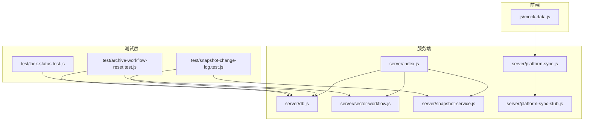
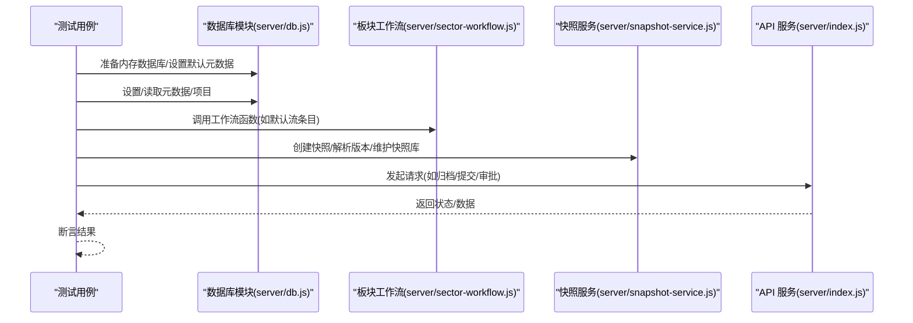
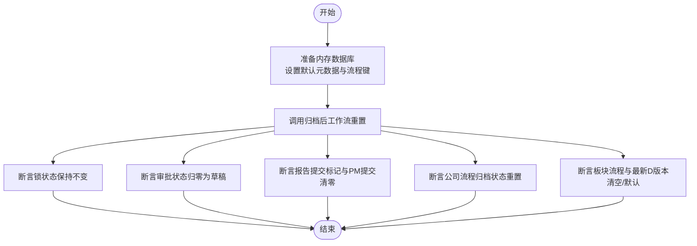
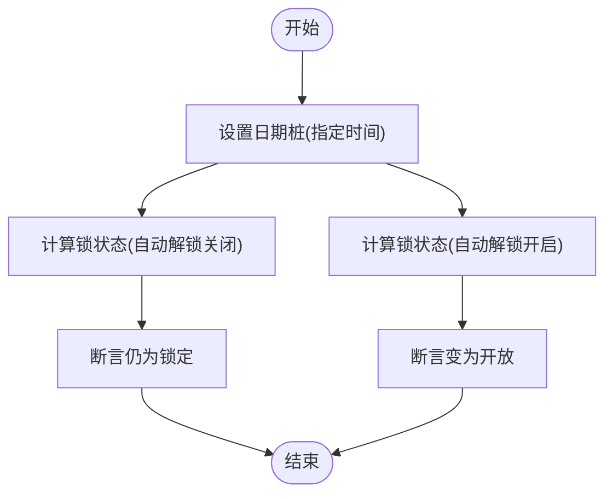
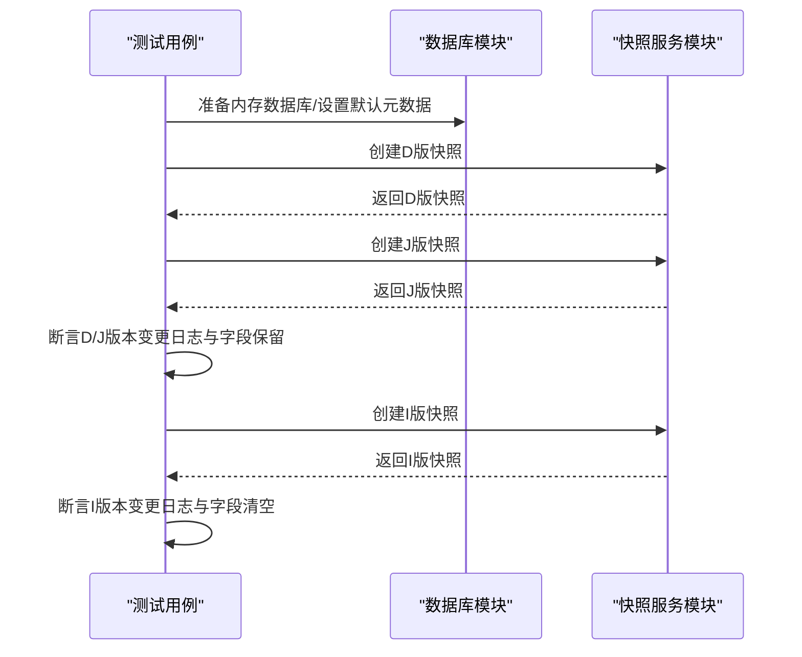
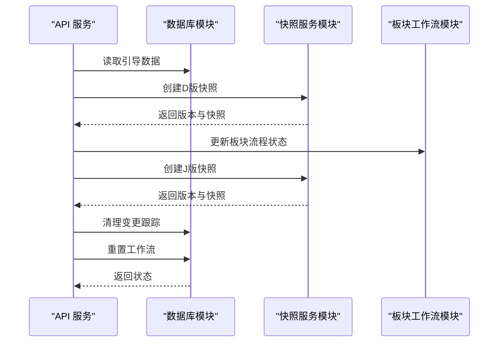
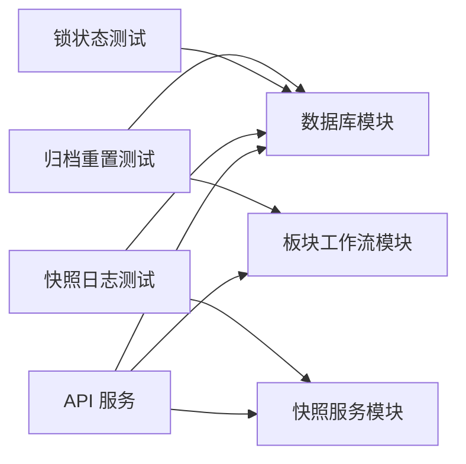

# 测试策略

<cite>
**本文引用的文件**
- [package.json](file://package.json)
- [test/archive-workflow-reset.test.js](file://test/archive-workflow-reset.test.js)
- [test/lock-status.test.js](file://test/lock-status.test.js)
- [test/snapshot-change-log.test.js](file://test/snapshot-change-log.test.js)
- [server/db.js](file://server/db.js)
- [server/snapshot-service.js](file://server/snapshot-service.js)
- [server/sector-workflow.js](file://server/sector-workflow.js)
- [server/index.js](file://server/index.js)
- [server/platform-sync.js](file://server/platform-sync.js)
- [server/platform-sync-stub.js](file://server/platform-sync-stub.js)
- [js/mock-data.js](file://js/mock-data.js)
</cite>

## 目录
1. [引言](#引言)
2. [项目结构](#项目结构)
3. [核心组件](#核心组件)
4. [架构总览](#架构总览)
5. [详细组件分析](#详细组件分析)
6. [依赖分析](#依赖分析)
7. [性能考虑](#性能考虑)
8. [故障排查指南](#故障排查指南)
9. [结论](#结论)
10. [附录](#附录)

## 引言
本测试策略文档面向“项目执行追踪平台”项目，系统化阐述测试方法论与质量保证体系。重点覆盖以下方面：
- 单元测试设计原则、测试用例编写与覆盖率要求
- 集成测试场景、数据准备与环境配置
- 现有测试文件的目标与验证逻辑解析
- 测试数据管理、模拟对象使用与断言策略
- 持续集成配置、自动化测试流程与性能测试方法
- 测试最佳实践、调试技巧与测试维护指南
- 测试环境搭建与测试数据管理

## 项目结构
项目采用前后端分离的单页应用与后端 API 架构，测试集中在 test 目录，核心业务逻辑分布在 server 与 js 目录。测试脚本通过 Node 内置测试框架运行，数据库使用 SQLite。

图表来源
- [test/archive-workflow-reset.test.js:1-65](file://test/archive-workflow-reset.test.js#L1-L65)
- [test/lock-status.test.js:1-47](file://test/lock-status.test.js#L1-L47)
- [test/snapshot-change-log.test.js:1-59](file://test/snapshot-change-log.test.js#L1-L59)
- [server/db.js:1-525](file://server/db.js#L1-L525)
- [server/snapshot-service.js:1-292](file://server/snapshot-service.js#L1-L292)
- [server/sector-workflow.js:1-273](file://server/sector-workflow.js#L1-L273)
- [server/index.js:1-775](file://server/index.js#L1-L775)
- [server/platform-sync.js:1-272](file://server/platform-sync.js#L1-L272)
- [server/platform-sync-stub.js:1-62](file://server/platform-sync-stub.js#L1-L62)
- [js/mock-data.js:1-748](file://js/mock-data.js#L1-L748)

章节来源
- [package.json:1-19](file://package.json#L1-L19)
- [test/archive-workflow-reset.test.js:1-65](file://test/archive-workflow-reset.test.js#L1-L65)
- [test/lock-status.test.js:1-47](file://test/lock-status.test.js#L1-L47)
- [test/snapshot-change-log.test.js:1-59](file://test/snapshot-change-log.test.js#L1-L59)

## 核心组件
- 数据库与元数据管理：负责项目、快照、审计日志、元数据的持久化与查询，提供工作流状态重置、锁状态计算等能力。
- 快照服务：负责 I/D/J 三类快照的生成、版本号构建、基线修复与清理。
- 板块工作流：负责板块级审批流、状态同步与归档条件判断。
- 平台同步：负责从外部平台（开发期使用本地 XLSX 或桩函数）拉取数据，合并到项目数据中，并记录审计。
- API 服务：提供引导数据、项目、快照、审批、归档等接口，贯穿测试验证路径。

章节来源
- [server/db.js:1-525](file://server/db.js#L1-L525)
- [server/snapshot-service.js:1-292](file://server/snapshot-service.js#L1-L292)
- [server/sector-workflow.js:1-273](file://server/sector-workflow.js#L1-L273)
- [server/platform-sync.js:1-272](file://server/platform-sync.js#L1-L272)
- [server/platform-sync-stub.js:1-62](file://server/platform-sync-stub.js#L1-L62)
- [server/index.js:1-775](file://server/index.js#L1-L775)

## 架构总览
测试围绕“内存数据库 + 业务模块 + API 接口”的闭环展开。测试通过内存 SQLite 快速构造隔离的测试环境，直接调用业务模块函数或发起 API 请求，验证状态变更与数据一致性。

图表来源
- [server/db.js:1-525](file://server/db.js#L1-L525)
- [server/sector-workflow.js:1-273](file://server/sector-workflow.js#L1-L273)
- [server/snapshot-service.js:1-292](file://server/snapshot-service.js#L1-L292)
- [server/index.js:1-775](file://server/index.js#L1-L775)

## 详细组件分析

### 单元测试设计原则
- 隔离性：使用内存数据库与最小依赖注入，避免外部副作用。
- 可重复性：通过固定输入与确定性逻辑（如版本号序列、日期桩）确保结果稳定。
- 可观测性：对关键状态（元数据、快照、项目）进行断言，覆盖边界与异常分支。
- 可维护性：测试命名清晰表达意图，断言粒度适中，便于定位问题。

章节来源
- [test/archive-workflow-reset.test.js:1-65](file://test/archive-workflow-reset.test.js#L1-L65)
- [test/lock-status.test.js:1-47](file://test/lock-status.test.js#L1-L47)
- [test/snapshot-change-log.test.js:1-59](file://test/snapshot-change-log.test.js#L1-L59)

### 测试用例与验证逻辑

#### 归档后工作流重置测试
- 目标：验证归档后工作流状态重置逻辑，保留锁状态，清除 PM 提交与变更跟踪，重置公司与板块流程。
- 关键断言：
  - 锁状态保持不变
  - 审批状态归零为草稿
  - 报告提交标记清零
  - PM 提交记录清空
  - 公司流程归档状态重置
  - 板块最新 D 版本清空
  - 板块流程条目恢复默认
- 数据准备：内存数据库 + 默认元数据 + 多个流程与锁状态键
- 依赖模块：数据库模块、板块工作流模块

图表来源
- [test/archive-workflow-reset.test.js:16-43](file://test/archive-workflow-reset.test.js#L16-L43)
- [server/db.js:350-370](file://server/db.js#L350-L370)
- [server/sector-workflow.js:76-82](file://server/sector-workflow.js#L76-L82)

章节来源
- [test/archive-workflow-reset.test.js:16-43](file://test/archive-workflow-reset.test.js#L16-L43)
- [server/db.js:350-370](file://server/db.js#L350-L370)
- [server/sector-workflow.js:76-82](file://server/sector-workflow.js#L76-L82)

#### 锁状态计算测试
- 目标：验证月度锁在跨月自动解锁与手动解锁之间的行为差异。
- 关键断言：
  - 自动解锁关闭时，解锁日之后仍为锁定
  - 自动解锁开启时，解锁日之后变为开放
- 数据准备：通过日期桩替换 Date.now，确保断言时间点可控
- 依赖模块：数据库模块内部锁状态计算函数

图表来源
- [test/lock-status.test.js:5-24](file://test/lock-status.test.js#L5-L24)
- [test/lock-status.test.js:26-46](file://test/lock-status.test.js#L26-L46)
- [server/db.js:121-136](file://server/db.js#L121-L136)

章节来源
- [test/lock-status.test.js:5-24](file://test/lock-status.test.js#L5-L24)
- [test/lock-status.test.js:26-46](file://test/lock-status.test.js#L26-L46)
- [server/db.js:121-136](file://server/db.js#L121-L136)

#### 快照变更日志测试
- 目标：验证 D/J 版本保留累计变更日志，I 版本清理临时变更日志。
- 关键断言：
  - D/J 版本：变更字段与变更日志完整保留
  - I 版本：变更字段清空，变更日志删除
- 数据准备：内存数据库 + 默认元数据 + 变更项目
- 依赖模块：快照服务模块、数据库模块

图表来源
- [test/snapshot-change-log.test.js:7-16](file://test/snapshot-change-log.test.js#L7-L16)
- [test/snapshot-change-log.test.js:33-44](file://test/snapshot-change-log.test.js#L33-L44)
- [test/snapshot-change-log.test.js:46-58](file://test/snapshot-change-log.test.js#L46-L58)
- [server/snapshot-service.js:88-158](file://server/snapshot-service.js#L88-L158)

章节来源
- [test/snapshot-change-log.test.js:7-16](file://test/snapshot-change-log.test.js#L7-L16)
- [test/snapshot-change-log.test.js:33-44](file://test/snapshot-change-log.test.js#L33-L44)
- [test/snapshot-change-log.test.js:46-58](file://test/snapshot-change-log.test.js#L46-L58)
- [server/snapshot-service.js:88-158](file://server/snapshot-service.js#L88-L158)

### 集成测试场景与数据准备
- 场景一：归档流程集成
  - 步骤：创建项目 -> 板块提交 -> 审批推进 -> 公司归档 -> 清理变更跟踪 -> 重置工作流
  - 断言：状态迁移正确、数据清理生效、流程回到草稿
  - 依赖：API 服务、数据库模块、快照服务、板块工作流
- 场景二：平台同步集成
  - 步骤：准备平台快照（桩或 XLSX）-> 合并项目 -> 更新系统引用 -> 记录审计
  - 断言：新增/缺失统计、系统引用更新、审计记录存在
  - 依赖：平台同步模块、平台同步桩、数据库模块

图表来源
- [server/index.js:230-446](file://server/index.js#L230-L446)
- [server/db.js:285-370](file://server/db.js#L285-L370)
- [server/snapshot-service.js:114-158](file://server/snapshot-service.js#L114-L158)
- [server/sector-workflow.js:188-221](file://server/sector-workflow.js#L188-L221)

章节来源
- [server/index.js:230-446](file://server/index.js#L230-L446)
- [server/db.js:285-370](file://server/db.js#L285-L370)
- [server/snapshot-service.js:114-158](file://server/snapshot-service.js#L114-L158)
- [server/sector-workflow.js:188-221](file://server/sector-workflow.js#L188-L221)

### 测试数据管理与模拟对象
- 内存数据库：每个测试独立创建内存 SQLite，避免共享状态，快速初始化与销毁。
- 日期桩：通过替换 Date 构造器与静态 now 方法，固定断言时间点。
- 平台快照桩：在无外部平台 API 时，优先读取本地 XLSX，否则基于现有项目微调生成。
- 示例数据：前端 mock-data 提供 20 条示例项目，覆盖新旧项目、多板块、高风险等场景，可用于集成测试的数据源。

章节来源
- [test/archive-workflow-reset.test.js:7-14](file://test/archive-workflow-reset.test.js#L7-L14)
- [test/lock-status.test.js:5-24](file://test/lock-status.test.js#L5-L24)
- [server/platform-sync-stub.js:9-26](file://server/platform-sync-stub.js#L9-L26)
- [js/mock-data.js:1-748](file://js/mock-data.js#L1-L748)

### 断言策略
- 状态断言：对元数据键（如审批状态、锁状态、流程状态）进行精确断言。
- 结构断言：对项目对象的临时字段（变更日志、新增标记）进行存在性与清空断言。
- 版本断言：对快照版本号格式、序列号递增、标签构建进行断言。
- 行为断言：对 API 返回体、审计记录、错误码进行断言。

章节来源
- [test/archive-workflow-reset.test.js:33-43](file://test/archive-workflow-reset.test.js#L33-L43)
- [test/lock-status.test.js:27-45](file://test/lock-status.test.js#L27-L45)
- [test/snapshot-change-log.test.js:40-44](file://test/snapshot-change-log.test.js#L40-L44)
- [test/snapshot-change-log.test.js:56-58](file://test/snapshot-change-log.test.js#L56-L58)

## 依赖分析
- 测试对业务模块的耦合度低，主要通过公共接口访问，便于替换与扩展。
- 数据库模块承担核心状态存储职责，测试对其 CRUD 与事务操作进行重点覆盖。
- 快照服务模块与板块工作流模块紧密协作，测试需关注版本号规则与状态同步。
- API 服务作为集成测试入口，串联多个模块，测试应覆盖关键端点与错误路径。

图表来源
- [test/archive-workflow-reset.test.js:1-65](file://test/archive-workflow-reset.test.js#L1-L65)
- [test/lock-status.test.js:1-47](file://test/lock-status.test.js#L1-L47)
- [test/snapshot-change-log.test.js:1-59](file://test/snapshot-change-log.test.js#L1-L59)
- [server/db.js:1-525](file://server/db.js#L1-L525)
- [server/snapshot-service.js:1-292](file://server/snapshot-service.js#L1-L292)
- [server/sector-workflow.js:1-273](file://server/sector-workflow.js#L1-L273)
- [server/index.js:1-775](file://server/index.js#L1-L775)

章节来源
- [server/db.js:1-525](file://server/db.js#L1-L525)
- [server/snapshot-service.js:1-292](file://server/snapshot-service.js#L1-L292)
- [server/sector-workflow.js:1-273](file://server/sector-workflow.js#L1-L273)
- [server/index.js:1-775](file://server/index.js#L1-L775)

## 性能考虑
- 内存数据库：测试使用内存 SQLite，避免磁盘 IO，提升执行速度。
- 事务封装：批量更新使用事务，减少多次提交开销。
- 版本号生成：快照版本号按日期与序列号生成，避免冲突与重复扫描。
- 平台同步：在无外部 API 时使用桩函数，避免网络与外部依赖带来的不确定性。

章节来源
- [server/db.js:271-277](file://server/db.js#L271-L277)
- [server/snapshot-service.js:54-68](file://server/snapshot-service.js#L54-L68)
- [server/platform-sync-stub.js:34-59](file://server/platform-sync-stub.js#L34-L59)

## 故障排查指南
- 锁状态断言失败：检查日期桩是否正确设置，确认断言时间点与锁/解锁日配置。
- 归档重置异常：核对默认元数据是否初始化，确认流程键是否存在，检查事务是否回滚。
- 快照版本冲突：检查版本号生成逻辑，确保同一日期序列唯一性。
- 平台同步失败：确认环境变量与 XLSX 文件路径，核对合并逻辑中的缺失项处理。
- API 端点错误：检查请求体格式、鉴权与角色限制，查看审计记录定位问题。

章节来源
- [test/lock-status.test.js:5-24](file://test/lock-status.test.js#L5-L24)
- [test/archive-workflow-reset.test.js:16-43](file://test/archive-workflow-reset.test.js#L16-L43)
- [test/snapshot-change-log.test.js:33-58](file://test/snapshot-change-log.test.js#L33-L58)
- [server/platform-sync.js:200-262](file://server/platform-sync.js#L200-L262)
- [server/index.js:198-218](file://server/index.js#L198-L218)

## 结论
本项目测试策略以“内存数据库 + 业务模块直连 + API 端点集成”的方式构建了高内聚、低耦合的测试体系。通过明确的断言策略与数据准备流程，能够稳定验证关键业务逻辑。建议后续补充：
- 覆盖率工具接入与阈值设定
- 持续集成流水线配置（如 GitHub Actions）
- 性能回归测试与基准对比
- 测试数据版本化与可追溯性增强

## 附录

### 自动化测试与持续集成
- 运行命令：通过包脚本统一执行所有测试文件。
- 建议 CI 配置要点：
  - 触发条件：push 到主分支或 Pull Request
  - 步骤：安装依赖、启动服务（可选）、执行测试、生成覆盖率报告（可选）
  - 缓存：缓存 node_modules 与 SQLite 数据目录
  - 产物：测试报告、覆盖率报告、日志归档

章节来源
- [package.json:6-12](file://package.json#L6-L12)

### 测试环境搭建与数据管理
- 环境准备：确保 Node.js 版本满足依赖要求，安装依赖后即可运行测试。
- 数据准备：
  - 内存数据库：测试内新建，无需额外准备
  - 平台快照：可通过环境变量指向本地 XLSX，或使用桩函数生成
  - 示例数据：前端 mock-data 可用于集成测试的数据源
- 数据清理：测试结束后自动销毁内存数据库；生产环境需谨慎清理。

章节来源
- [test/archive-workflow-reset.test.js:7-14](file://test/archive-workflow-reset.test.js#L7-L14)
- [server/platform-sync-stub.js:9-26](file://server/platform-sync-stub.js#L9-L26)
- [js/mock-data.js:1-748](file://js/mock-data.js#L1-L748)