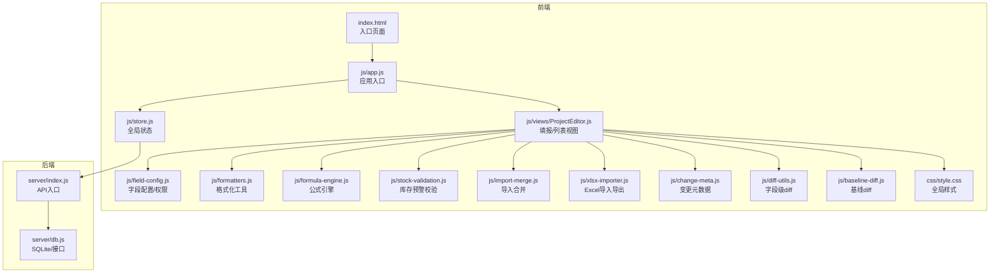
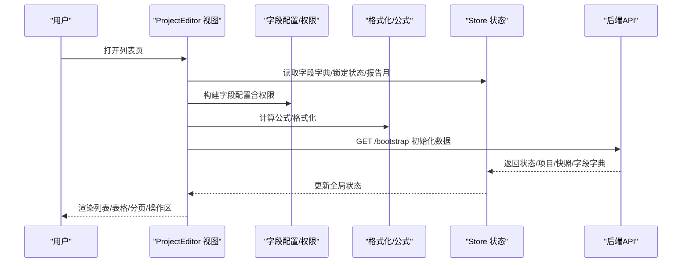
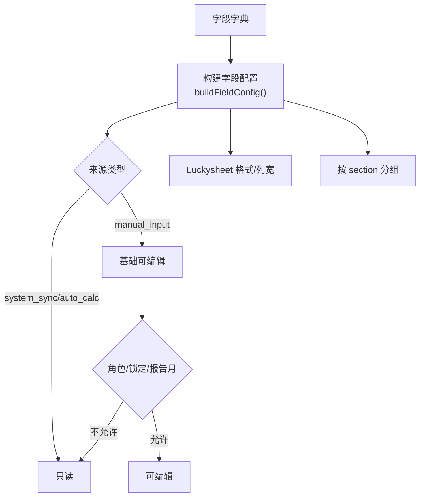
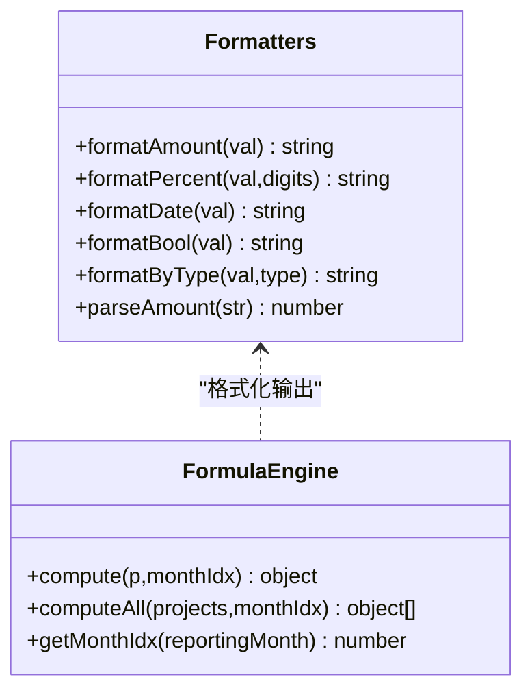
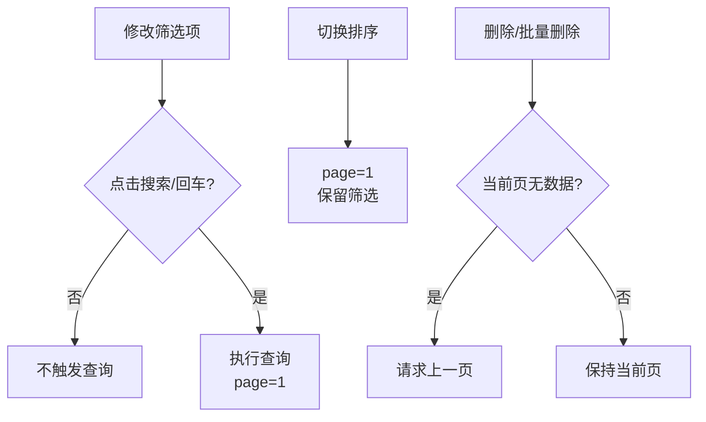
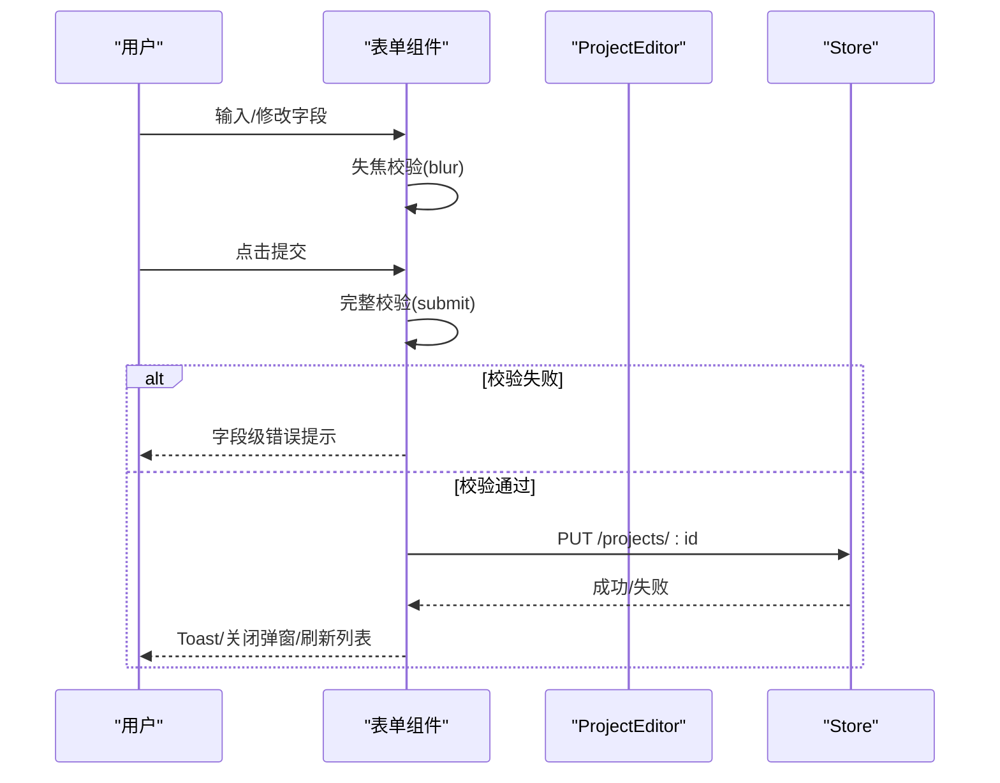
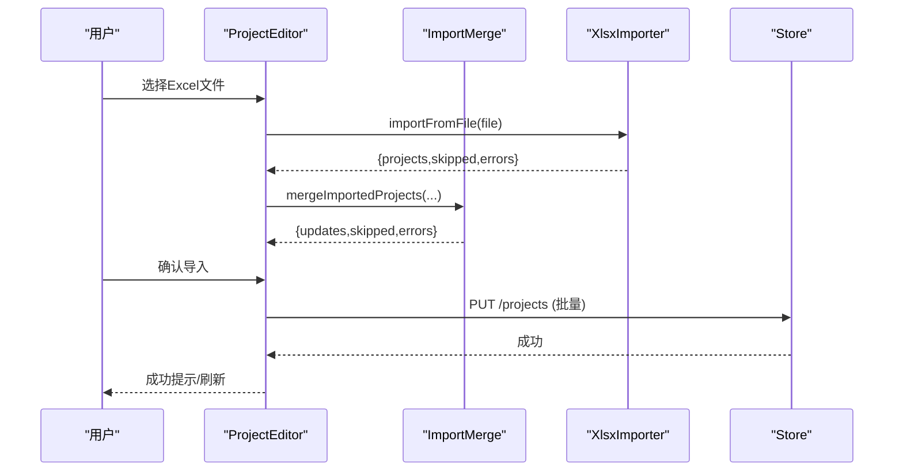
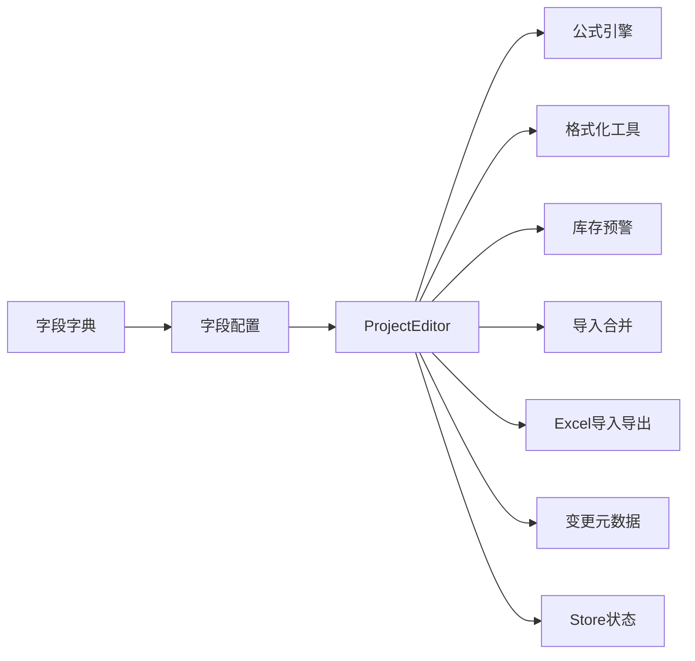

# 列表表单设计

<cite>
**本文档引用的文件**
- [LIST_FORM.md](file://docs/设计文档/LIST_FORM.md)
- [fields.json](file://config/fields/fields.json)
- [fields-data.js](file://config/fields/fields-data.js)
- [field-config.js](file://js/field-config.js)
- [formatters.js](file://js/formatters.js)
- [ProjectEditor.js](file://js/views/ProjectEditor.js)
- [store.js](file://js/store.js)
- [import-merge.js](file://js/import-merge.js)
- [xlsx-importer.js](file://js/xlsx-importer.js)
- [style.css](file://css/style.css)
- [formula-engine.js](file://js/formula-engine.js)
- [stock-validation.js](file://js/stock-validation.js)
- [change-meta.js](file://js/change-meta.js)
- [diff-utils.js](file://js/diff-utils.js)
- [baseline-diff.js](file://js/baseline-diff.js)
</cite>

## 目录
1. [简介](#简介)
2. [项目结构](#项目结构)
3. [核心组件](#核心组件)
4. [架构总览](#架构总览)
5. [详细组件分析](#详细组件分析)
6. [依赖关系分析](#依赖关系分析)
7. [性能考量](#性能考量)
8. [故障排查指南](#故障排查指南)
9. [结论](#结论)
10. [附录](#附录)

## 简介
本文件面向“列表/搜索/分页/表单”交互与数据设计，统一需求、设计、开发、测试在“项目追踪表”类页面上的标准，减少返工与口径不一致。文档以尼尔森十大交互原则为基础，结合项目现有实现，系统阐述：
- 列表布局与字段排列规则
- 搜索/筛选/排序/分页策略
- 表单字段配置、验证与输入体验
- 列表视图设计（固定列、汇总、状态展示）
- 表单显示逻辑、编辑模式与状态管理
- 数据导入导出、批量操作与一致性保障
- 响应式与无障碍、跨浏览器兼容
- 表单验证策略、错误处理与用户反馈
- 实现规范与开发指导原则

## 项目结构
项目采用前端单页应用（Vue + 自研状态管理 + Luckysheet 填报）与 Node/SQLite 后端协同的架构。前端核心模块围绕“字段字典、格式化、公式引擎、权限控制、导入导出、状态管理”展开，后端提供 Bootstrap、字段字典、快照、审计日志等接口。

图表来源
- [store.js:97-128](file://js/store.js#L97-L128)
- [ProjectEditor.js:64-111](file://js/views/ProjectEditor.js#L64-L111)
- [field-config.js:127-155](file://js/field-config.js#L127-L155)
- [formatters.js:5-166](file://js/formatters.js#L5-L166)
- [formula-engine.js:19-103](file://js/formula-engine.js#L19-L103)
- [stock-validation.js:25-106](file://js/stock-validation.js#L25-L106)
- [import-merge.js:17-99](file://js/import-merge.js#L17-L99)
- [xlsx-importer.js:12-185](file://js/xlsx-importer.js#L12-L185)
- [change-meta.js:96-120](file://js/change-meta.js#L96-L120)
- [diff-utils.js:7-12](file://js/diff-utils.js#L7-L12)
- [baseline-diff.js:17-32](file://js/baseline-diff.js#L17-L32)
- [style.css:1-80](file://css/style.css#L1-L80)

章节来源
- [store.js:97-128](file://js/store.js#L97-L128)
- [ProjectEditor.js:64-111](file://js/views/ProjectEditor.js#L64-L111)

## 核心组件
- 字段字典与配置：统一字段元数据、权限矩阵、列宽/格式化策略、列索引与分组。
- 格式化工具：金额/百分比/日期/布尔等统一格式化与解析。
- 公式引擎：基于报告月索引计算派生字段，支撑列表与填报。
- 权限控制：基于角色、锁定状态、报告月的字段可编辑性判定。
- 导入导出：Excel 解析/导出、按角色合并更新、批量写入。
- 状态管理：全局状态（用户、项目、快照、锁定状态、字段字典）。
- 变更元数据：字段变更日志、批注、对比视图。
- 库存预警：R/S 存量列预警与提交期校验。

章节来源
- [field-config.js:127-155](file://js/field-config.js#L127-L155)
- [formatters.js:13-166](file://js/formatters.js#L13-L166)
- [formula-engine.js:19-103](file://js/formula-engine.js#L19-L103)
- [stock-validation.js:75-149](file://js/stock-validation.js#L75-L149)
- [import-merge.js:17-99](file://js/import-merge.js#L17-L99)
- [xlsx-importer.js:12-185](file://js/xlsx-importer.js#L12-L185)
- [store.js:97-128](file://js/store.js#L97-L128)
- [change-meta.js:96-120](file://js/change-meta.js#L96-L120)
- [baseline-diff.js:17-32](file://js/baseline-diff.js#L17-L32)

## 架构总览
列表/表单交互遵循“统一规范 + 前后端契约”的设计思路：
- 列表页：筛选区 + 表格 + 分页 + 操作区
- 表单页：弹窗表单 + 校验 + 提交防重 + 离开保护
- 数据契约：查询接口（page/pageSize/sortBy/sortOrder/filters）与响应（items/total/page/pageSize）

图表来源
- [ProjectEditor.js:112-147](file://js/views/ProjectEditor.js#L112-L147)
- [store.js:268-275](file://js/store.js#L268-L275)
- [field-config.js:127-155](file://js/field-config.js#L127-L155)
- [formula-engine.js:88-103](file://js/formula-engine.js#L88-L103)
- [formatters.js:118-166](file://js/formatters.js#L118-L166)

章节来源
- [LIST_FORM.md:256-291](file://docs/设计文档/LIST_FORM.md#L256-L291)
- [store.js:268-275](file://js/store.js#L268-L275)

## 详细组件分析

### 字段字典与权限矩阵
- 字段来源：系统同步（只读）、自动计算（只读）、手工输入（可编辑）。
- 权限规则：角色（system_admin/executive_viewer/sector_admin/pm/sector_director/group_leader）+ 锁定状态 + 报告月时间窗。
- 字段配置增强：列索引、可编辑标记、Luckysheet 数字格式、列宽、分组。

图表来源
- [field-config.js:127-155](file://js/field-config.js#L127-L155)
- [field-config.js:104-122](file://js/field-config.js#L104-L122)
- [field-config.js:182-193](file://js/field-config.js#L182-L193)

章节来源
- [field-config.js:7-15](file://js/field-config.js#L7-L15)
- [field-config.js:104-122](file://js/field-config.js#L104-L122)
- [field-config.js:127-155](file://js/field-config.js#L127-L155)

### 列表展示与格式化
- 列定义：标题、字段名、数据类型、格式、对齐、排序、宽度、空值展示。
- 数字/百分比/日期/布尔格式化统一；金额启用千分位与等宽数字。
- 状态列使用徽章，颜色与文案语义一致。
- 操作列固定宽度，按钮按风险与频率排序，高风险操作二次确认。

图表来源
- [formatters.js:13-166](file://js/formatters.js#L13-L166)
- [formula-engine.js:19-103](file://js/formula-engine.js#L19-L103)

章节来源
- [LIST_FORM.md:57-114](file://docs/设计文档/LIST_FORM.md#L57-L114)
- [formatters.js:13-166](file://js/formatters.js#L13-L166)
- [formula-engine.js:19-103](file://js/formula-engine.js#L19-L103)

### 搜索/筛选/排序/分页
- 非实时筛选：修改筛选项不自动查询，需点击“搜索”或回车；重置后回到第1页并自动查询。
- 高级筛选：折叠/展开状态持久化；已生效条件以徽章提示。
- 排序：单列排序，激活列展示箭头；默认排序字段与方向需在需求中明确；排序变更保留筛选条件。
- 分页：强制分页，支持 URL 化；空页兜底自动请求上一页。

图表来源
- [LIST_FORM.md:28-126](file://docs/设计文档/LIST_FORM.md#L28-L126)

章节来源
- [LIST_FORM.md:28-126](file://docs/设计文档/LIST_FORM.md#L28-L126)

### 表单规范与交互
- 新建/编辑/详情三态：标题、默认值、提交按钮、只读/禁用策略。
- 布局：标签顶部对齐，控件宽度一致；字段>6个按业务语义分组；两列布局（≥600px）。
- 校验：失焦轻校验，提交完整校验；字段级错误信息；常见规则（字符长度、数值范围、日期范围、唯一性）。
- 提交防重：按钮 loading 与禁用；提交过程弹窗不可关闭。
- 离开保护：表单内容被修改时二次确认。

图表来源
- [LIST_FORM.md:139-196](file://docs/设计文档/LIST_FORM.md#L139-L196)
- [store.js:325-336](file://js/store.js#L325-L336)

章节来源
- [LIST_FORM.md:139-196](file://docs/设计文档/LIST_FORM.md#L139-L196)
- [store.js:325-336](file://js/store.js#L325-L336)

### 导入导出与批量操作
- 导入：Excel 解析（SheetJS），按项目号合并，仅覆盖当前角色可编辑字段；支持批量更新并记录审计日志。
- 导出：按当前筛选/当前页/已选中范围导出；列标题与格式与列表一致。
- 批量操作：跨分页批量需明确策略；高风险操作二次确认。

图表来源
- [xlsx-importer.js:12-185](file://js/xlsx-importer.js#L12-L185)
- [import-merge.js:17-99](file://js/import-merge.js#L17-L99)
- [store.js:325-336](file://js/store.js#L325-L336)

章节来源
- [LIST_FORM.md:244-253](file://docs/设计文档/LIST_FORM.md#L244-L253)
- [xlsx-importer.js:12-185](file://js/xlsx-importer.js#L12-L185)
- [import-merge.js:17-99](file://js/import-merge.js#L17-L99)

### 状态与反馈
- 加载态：首次骨架屏/统一 loading；分页/排序/筛选刷新叠加遮罩。
- 空态：筛选为空/无数据/无权限区分展示。
- 成功/失败：Toast 提示；字段级错误优先于全局提示；网络错误提供重试。
- 差异与变更：新增行高亮、字段变更批注、系统引用覆盖提示。

章节来源
- [LIST_FORM.md:211-242](file://docs/设计文档/LIST_FORM.md#L211-L242)
- [style.css:442-548](file://css/style.css#L442-L548)
- [change-meta.js:96-120](file://js/change-meta.js#L96-L120)

### 响应式与无障碍
- 响应式：Flex 布局、容器自适应、列冻结、紧凑视图。
- 无障碍：颜色不唯一识别，需文字标签；键盘可聚焦；禁用/只读视觉区分。
- 跨浏览器：依赖现代浏览器特性（Fetch、Promise、ResizeObserver），注意降级策略。

章节来源
- [style.css:64-78](file://css/style.css#L64-L78)
- [ProjectEditor.js:674-709](file://js/views/ProjectEditor.js#L674-L709)
- [LIST_FORM.md:90-94](file://docs/设计文档/LIST_FORM.md#L90-L94)

## 依赖关系分析
- 字段字典与权限：字段配置依赖字段字典与角色/锁定状态/报告月。
- 列表渲染：字段配置 + 公式引擎 + 格式化工具。
- 填报交互：Luckysheet 工作表保护、单元格样式、保存链路、提交前同步。
- 数据一致性：导入合并仅覆盖可编辑字段；库存预警在填报期自动对冲，提交期严格校验。

图表来源
- [field-config.js:127-155](file://js/field-config.js#L127-L155)
- [ProjectEditor.js:192-247](file://js/views/ProjectEditor.js#L192-L247)
- [formula-engine.js:88-103](file://js/formula-engine.js#L88-L103)
- [formatters.js:118-166](file://js/formatters.js#L118-L166)
- [stock-validation.js:75-149](file://js/stock-validation.js#L75-L149)
- [import-merge.js:17-99](file://js/import-merge.js#L17-L99)
- [xlsx-importer.js:12-185](file://js/xlsx-importer.js#L12-L185)
- [change-meta.js:96-120](file://js/change-meta.js#L96-L120)
- [store.js:97-128](file://js/store.js#L97-L128)

章节来源
- [field-config.js:127-155](file://js/field-config.js#L127-L155)
- [ProjectEditor.js:192-247](file://js/views/ProjectEditor.js#L192-L247)

## 性能考量
- 列表渲染：批量计算公式（computeAll）与格式化（formatByType）在构建数据时一次性完成，避免重复计算。
- 填报性能：Luckysheet 通过冻结列、紧凑列视图、斑马纹与 hover 背景色优化可读性；ResizeObserver 降低频繁刷新成本。
- 导入性能：Excel 解析与合并按项目号映射，仅对可编辑字段覆盖，减少写入次数。
- 网络与缓存：Bootstrap 与字段字典优先从 API 获取，失败回退静态资源；分页/排序/筛选参数 URL 化利于缓存与分享。

## 故障排查指南
- 字段字典未加载：检查 /api/fields 与静态字段文件加载路径；确保 applyFieldDictionary 生效。
- 提交失败：查看接口返回错误消息；确认字段级错误已在表单显示；网络错误提供重试。
- 导入无更新：确认导入文件列映射与字段字典一致；仅覆盖可编辑字段；检查合并结果与跳过原因。
- 库存预警：填报期自动对冲（applyOpenPeriodStockHedge）；提交期严格校验（validateProjectsForSubmit）。
- 差异与对比：利用变更元数据（_field_change_log/_changed_fields）与基线 diff（baseline-diff）定位差异来源。

章节来源
- [store.js:186-235](file://js/store.js#L186-L235)
- [xlsx-importer.js:108-175](file://js/xlsx-importer.js#L108-L175)
- [import-merge.js:17-99](file://js/import-merge.js#L17-L99)
- [stock-validation.js:131-149](file://js/stock-validation.js#L131-L149)
- [change-meta.js:96-120](file://js/change-meta.js#L96-L120)
- [baseline-diff.js:60-73](file://js/baseline-diff.js#L60-L73)

## 结论
本设计以统一规范为纲，结合字段字典、权限矩阵、公式引擎与状态管理，实现了“可配置、可扩展、可审计”的列表与表单体系。通过严格的导入合并策略、库存预警与提交期校验，保障了数据一致性与合规性。建议在后续迭代中持续完善字段字典的可维护性、报表导出的异步能力与跨浏览器兼容性。

## 附录
- 字段字典来源与结构参考：fields.json 与 fields-data.js
- 前后端接口契约：查询参数与响应结构
- 开发与部署：确保字段字典加载路径正确，服务端提供 /bootstrap 与 /fields 接口

章节来源
- [fields.json:1-120](file://config/fields/fields.json#L1-L120)
- [fields-data.js:1-120](file://config/fields/fields-data.js#L1-L120)
- [LIST_FORM.md:256-291](file://docs/设计文档/LIST_FORM.md#L256-L291)