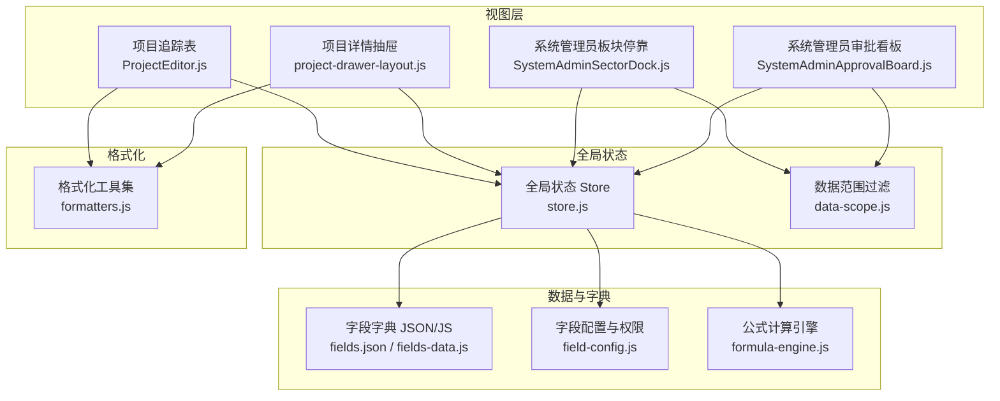
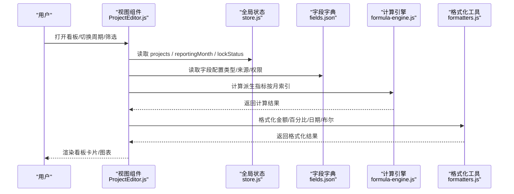
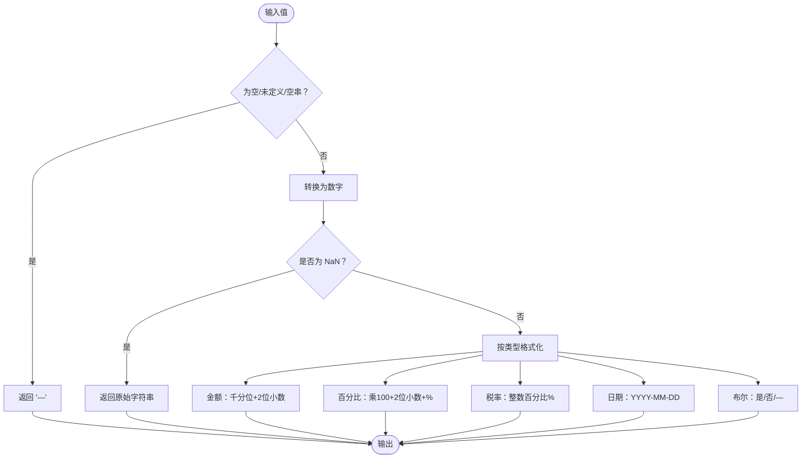
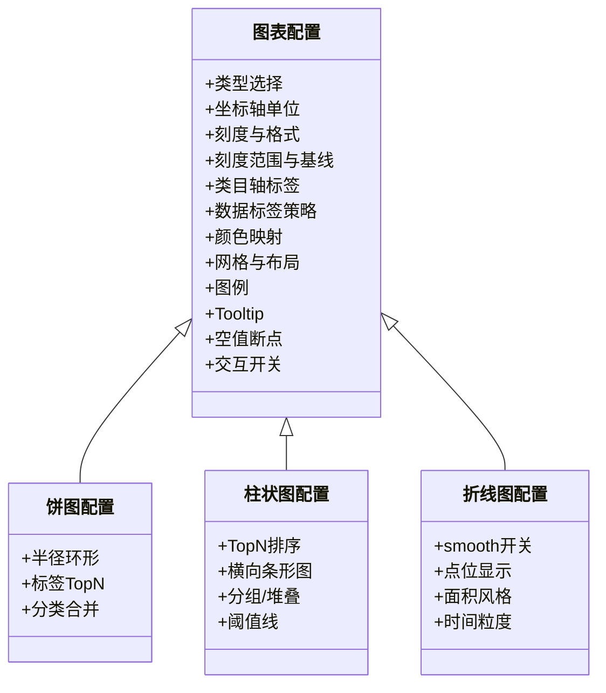
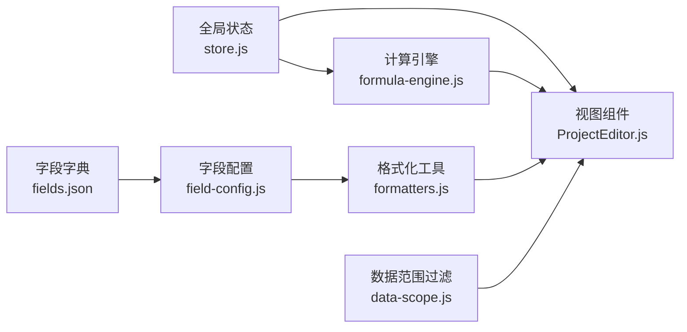

# 数据看板设计

<cite>
**本文引用的文件**   
- [DASHBOARD.md](file://docs/设计文档/DASHBOARD.md)
- [formatters.js](file://js/formatters.js)
- [data-scope.js](file://js/data-scope.js)
- [store.js](file://js/store.js)
- [field-config.js](file://js/field-config.js)
- [formula-engine.js](file://js/formula-engine.js)
- [fields.json](file://config/fields/fields.json)
- [fields-data.js](file://config/fields/fields-data.js)
- [ProjectEditor.js](file://js/views/ProjectEditor.js)
- [project-drawer-layout.js](file://js/project-drawer-layout.js)
- [SystemAdminSectorDock.js](file://js/components/SystemAdminSectorDock.js)
- [SystemAdminApprovalBoard.js](file://js/components/SystemAdminApprovalBoard.js)
</cite>

## 目录
1. [简介](#简介)
2. [项目结构](#项目结构)
3. [核心组件](#核心组件)
4. [架构总览](#架构总览)
5. [详细组件分析](#详细组件分析)
6. [依赖关系分析](#依赖关系分析)
7. [性能考量](#性能考量)
8. [故障排查指南](#故障排查指南)
9. [结论](#结论)
10. [附录](#附录)

## 简介
本文件面向数据看板（Dashboard）的产品与研发团队，系统化梳理看板的整体布局架构、信息层级设计与视觉呈现规范；明确数字格式化规则、数据口径与更新策略；阐述交互设计原则（下探、筛选器、默认值）；给出图表设计规范（饼图/柱状图/折线图）与颜色语义、趋势对比、异常处理机制；并提供性能优化策略、刷新频率设置与用户体验优化方案，以及实现指导与交付清单。

## 项目结构
围绕数据看板的关键实现，项目采用“前端视图 + 全局状态 + 字段字典 + 格式化工具”的分层组织方式：
- 视图层：项目追踪表（含看板入口）与审批看板等页面组件
- 全局状态：统一的 Store 管理用户、项目、报表周期、锁定期、快照等
- 字段字典：定义字段类型、来源、计算逻辑与权限，驱动格式化与渲染
- 格式化工具：统一金额、百分比、日期、布尔等格式化与解析
- 计算引擎：基于报告月索引，批量计算派生指标，支撑看板指标

**图表来源**
- [ProjectEditor.js:64-127](file://js/views/ProjectEditor.js#L64-L127)
- [project-drawer-layout.js:68-126](file://js/project-drawer-layout.js#L68-L126)
- [SystemAdminSectorDock.js:7-46](file://js/components/SystemAdminSectorDock.js#L7-L46)
- [SystemAdminApprovalBoard.js:7-30](file://js/components/SystemAdminApprovalBoard.js#L7-L30)
- [store.js:97-128](file://js/store.js#L97-L128)
- [data-scope.js:13-42](file://js/data-scope.js#L13-L42)
- [fields.json:1-120](file://config/fields/fields.json#L1-L120)
- [fields-data.js:1-120](file://config/fields/fields-data.js#L1-L120)
- [field-config.js:127-155](file://js/field-config.js#L127-L155)
- [formula-engine.js:19-90](file://js/formula-engine.js#L19-L90)
- [formatters.js:13-45](file://js/formatters.js#L13-L45)

**章节来源**
- [store.js:97-128](file://js/store.js#L97-L128)
- [fields.json:1-120](file://config/fields/fields.json#L1-L120)
- [fields-data.js:1-120](file://config/fields/fields-data.js#L1-L120)
- [field-config.js:127-155](file://js/field-config.js#L127-L155)
- [formula-engine.js:19-90](file://js/formula-engine.js#L19-L90)
- [formatters.js:13-45](file://js/formatters.js#L13-L45)
- [ProjectEditor.js:64-127](file://js/views/ProjectEditor.js#L64-L127)
- [project-drawer-layout.js:68-126](file://js/project-drawer-layout.js#L68-L126)
- [SystemAdminSectorDock.js:7-46](file://js/components/SystemAdminSectorDock.js#L7-L46)
- [SystemAdminApprovalBoard.js:7-30](file://js/components/SystemAdminApprovalBoard.js#L7-L30)

## 核心组件
- 全局状态与生命周期
  - 用户、项目、周期配置、锁定期、快照、字段字典、审计日志等集中管理
  - 提供初始化、重置、登录登出、侧边栏折叠、字段字典加载等能力
- 字段字典与权限
  - 字段类型（金额/比率/日期/布尔/文本/分类）、来源类型（system_sync/auto_calc/manual_input）
  - 基于角色与锁定期的可编辑性判断，支持月度列时间窗校验
- 计算引擎
  - 基于报告月索引批量计算派生指标（如 YTD、WIP、AR 等）
- 格式化工具
  - 金额（千分位、2 位小数）、百分比（2 位小数）、税率（整数百分比）、日期、布尔
  - 支持解析含千分位的金额字符串
- 数据范围过滤
  - 面向“经营管理（只读）”角色，按公司/板块/项目群维度过滤项目列表

**章节来源**
- [store.js:97-128](file://js/store.js#L97-L128)
- [field-config.js:104-122](file://js/field-config.js#L104-L122)
- [formula-engine.js:19-90](file://js/formula-engine.js#L19-L90)
- [formatters.js:13-45](file://js/formatters.js#L13-L45)
- [data-scope.js:13-42](file://js/data-scope.js#L13-L42)

## 架构总览
数据看板的实现遵循“状态驱动视图”的前端架构。视图组件通过全局 Store 获取数据与状态，结合字段字典与格式化工具渲染指标与图表；计算引擎在需要时批量产出派生指标，确保看板指标的一致性与时效性。

**图表来源**
- [ProjectEditor.js:208-247](file://js/views/ProjectEditor.js#L208-L247)
- [store.js:97-128](file://js/store.js#L97-L128)
- [fields.json:1-120](file://config/fields/fields.json#L1-L120)
- [formula-engine.js:88-101](file://js/formula-engine.js#L88-L101)
- [formatters.js:13-45](file://js/formatters.js#L13-L45)

## 详细组件分析

### 1) 展示层规范与数字格式化
- 千分位与小数位
  - 金额：千分位、2 位小数
  - 百分比：2 位小数
  - 税率：整数百分比
  - 日期：YYYY-MM-DD
  - 布尔：是/否/—
- 负数与符号：明确是否允许负数，负数以负号显示
- 单位显式：指标标题旁标注单位；同一行/区域单位一致
- 缩写规则：建议财务看板使用“万/亿”，并统一标注
- 空值：显示“—”，0 与 null 区分

**图表来源**
- [formatters.js:13-45](file://js/formatters.js#L13-L45)
- [formatters.js:89-94](file://js/formatters.js#L89-L94)
- [formatters.js:108-113](file://js/formatters.js#L108-L113)
- [formatters.js:152-165](file://js/formatters.js#L152-L165)

**章节来源**
- [DASHBOARD.md:10-28](file://docs/设计文档/DASHBOARD.md#L10-L28)
- [formatters.js:13-45](file://js/formatters.js#L13-L45)
- [formatters.js:89-94](file://js/formatters.js#L89-L94)
- [formatters.js:108-113](file://js/formatters.js#L108-L113)
- [formatters.js:152-165](file://js/formatters.js#L152-L165)

### 2) 口径与数据来源
- 每个指标必须写明业务定义、计算逻辑（排除项/过滤条件/时间范围）、数据来源、更新时间
- 时间口径：明确起止（自然月/财年/是否包含当日）、滚动窗口（如“截至今日”）
- 重复口径复用：建立口径编号/名称，避免分散

**章节来源**
- [DASHBOARD.md:29-44](file://docs/设计文档/DASHBOARD.md#L29-L44)

### 3) 交互与下探（Drill Down）
- 是否下探：卡片仅数值/下探到列表/下探到维度分析
- 下探继承：组织/时间/项目/币种/单位是否继承；指标口径继承
- 点击区域：整卡可点或仅图标可点，提供 hover 提示

**章节来源**
- [DASHBOARD.md:45-55](file://docs/设计文档/DASHBOARD.md#L45-L55)

### 4) 布局与信息层级
- 顶部：核心 KPI 卡片（4–6 个）
- 其余：分析模块（构成/趋势/对比/达成率/明细表/交叉表），一般不超过 3 列
- 同一卡片中可比：单位、小数位、颜色语义一致
- 空间不足优先级：数值 > 单位 > 辅助信息（同比/环比/说明）
- 每个卡片设置 Tooltip 提示

**章节来源**
- [DASHBOARD.md:56-64](file://docs/设计文档/DASHBOARD.md#L56-L64)

### 5) 趋势、对比与颜色语义
- 上升/下降的好坏方向：按指标类型配置（正向/负向），避免仅用颜色
- 颜色与符号：建议“箭头 + 颜色”双编码，写清阈值

**章节来源**
- [DASHBOARD.md:65-75](file://docs/设计文档/DASHBOARD.md#L65-L75)

### 6) 筛选器与默认值
- 全局筛选器：时间（年/月/日期范围，明确口径）、组织（公司/板块/项目群）、项目
- 默认值：明确默认选中（如默认当年、默认全公司）
- 筛选生效范围：明确哪些组件受全局筛选影响

**章节来源**
- [DASHBOARD.md:76-87](file://docs/设计文档/DASHBOARD.md#L76-L87)

### 7) 图表设计规范（饼图/柱状图/折线图）
- 统一约束
  - 图表类型选择：饼图（构成占比，分类≤6；超限用条形图或“Top N + 其他”）、柱状图（分类对比/TopN）、折线图（时间序列趋势）
  - 数值格式：千分符、金额 2 位小数、百分比 2 位小数、空值“—”
  - 坐标轴：Y 轴单位优先写在 yAxis.name；不建议双轴；刻度范围与基线需明确；类目轴标签可截断但 tooltip 显示全称
  - 数据标签：默认关闭；TopN/关键点/饼图 TopN 可开启；与 tooltip 使用相同格式
  - 颜色规范：同一业务维度颜色映射一致；颜色承载“好/坏”语义需与正负向配置一致
  - 网格与布局：grid.containLabel 避免裁切；图表与卡片边缘留白一致
  - 图例：顶部/底部默认显示；过多可滚动
  - Tooltip：必须包含指标名/数值/单位；可选维度/时间；折线/柱状建议 axis 触发；饼图 item 触发
  - 空值/断点：折线图空值是否断开需明确；0 与 null 区分
  - 交互：hover 高亮默认开启；点击下探通过 series click 实现；时间序列长时启用 dataZoom
- 饼图：半径建议环形；标签默认仅 TopN；分类过多合并“其他”
- 柱状图：TopN 排序；类别名长优先横向条形图；多序列对比用分组柱或堆叠（明确口径）
- 折线图：smooth 默认关闭；点位少显示、多隐藏；面积图仅强调区间量级；时间粒度明确

**图表来源**
- [DASHBOARD.md:88-169](file://docs/设计文档/DASHBOARD.md#L88-L169)

**章节来源**
- [DASHBOARD.md:88-169](file://docs/设计文档/DASHBOARD.md#L88-L169)

### 8) 表格（交叉表/明细表）
- 排序：明确哪些列可排序
- 固定列：是否固定首列
- 分页：默认页大小
- 汇总：是否展示合计/小计及口径
- 导出：是否支持导出 Excel

**章节来源**
- [DASHBOARD.md:171-178](file://docs/设计文档/DASHBOARD.md#L171-L178)

### 9) 异常与空值处理
- 无数据：显示“—”，不显示 0（除非业务明确 0 含义）
- 除零/无定义：显示“—”，并在 tooltip 提示原因
- 加载态：骨架屏或占位符
- 权限/范围不足：提示“无权限/无数据范围”

**章节来源**
- [DASHBOARD.md:179-185](file://docs/设计文档/DASHBOARD.md#L179-L185)

### 10) 性能与刷新策略
- 指标刷新频率：实时/分钟级/小时级/日级
- 大表/交叉表：明确按需加载、限制最大行数
- 缓存策略：是否允许缓存（例如 5 分钟）

**章节来源**
- [DASHBOARD.md:186-191](file://docs/设计文档/DASHBOARD.md#L186-L191)

### 11) 开发交付清单（最小集合）
- 页面结构：模块清单 + 组件位置
- 每个模块：
  - 指标列表（标题、单位、格式、小数位、颜色语义）
  - 口径说明（过滤条件、数据来源、刷新频率）
  - 交互说明（下探、跳转、hover、点击区域）
  - 异常处理（空值、无权限、加载态）

**章节来源**
- [DASHBOARD.md:192-199](file://docs/设计文档/DASHBOARD.md#L192-L199)

## 依赖关系分析
- 字段字典驱动格式化与渲染：字段类型决定格式化函数，来源类型决定可编辑性
- 计算引擎依赖报告月索引：派生指标按月动态计算
- 视图层依赖全局状态与格式化工具：渲染 KPI 卡片与图表
- 数据范围过滤服务于只读角色：限定可见项目集合

**图表来源**
- [fields.json:1-120](file://config/fields/fields.json#L1-L120)
- [field-config.js:127-155](file://js/field-config.js#L127-L155)
- [formatters.js:152-165](file://js/formatters.js#L152-L165)
- [store.js:97-128](file://js/store.js#L97-L128)
- [formula-engine.js:88-101](file://js/formula-engine.js#L88-L101)
- [ProjectEditor.js:208-247](file://js/views/ProjectEditor.js#L208-L247)
- [data-scope.js:13-42](file://js/data-scope.js#L13-L42)

**章节来源**
- [field-config.js:127-155](file://js/field-config.js#L127-L155)
- [formula-engine.js:88-101](file://js/formula-engine.js#L88-L101)
- [ProjectEditor.js:208-247](file://js/views/ProjectEditor.js#L208-L247)
- [data-scope.js:13-42](file://js/data-scope.js#L13-L42)

## 性能考量
- 指标刷新频率：根据数据敏感度与计算成本设定（实时/分钟/小时/日）
- 大表/交叉表：启用分页、限制最大行数、延迟加载
- 缓存策略：对静态/低频指标设置合理缓存（如 5 分钟）
- 图表渲染：折线图点位过多时隐藏 symbol；柱状图 TopN 排序减少遮挡
- 计算优化：批量计算派生指标，避免逐项重复计算

[本节为通用指导，无需特定文件引用]

## 故障排查指南
- 字段字典加载失败：检查字段字典 API 与静态资源加载路径
- 金额格式异常：确认输入值包含千分位，使用解析函数去除千分位后再渲染
- 无数据/空值：统一显示“—”，避免误用 0
- 权限/范围不足：提示“无权限/无数据范围”，避免系统错误误导
- 锁定期状态：确认 lockStatus 与 periodConfig 的一致性

**章节来源**
- [store.js:186-235](file://js/store.js#L186-L235)
- [formatters.js:131-135](file://js/formatters.js#L131-L135)
- [DASHBOARD.md:179-185](file://docs/设计文档/DASHBOARD.md#L179-L185)

## 结论
本设计文档将数据看板的布局、格式化、口径、交互、图表规范、颜色语义、异常处理与性能策略进行了系统化梳理，并结合现有前端实现明确了关键依赖关系与落地路径。建议在 PRD 中固化上述规范，开发阶段严格遵循，以确保看板的一致性、可维护性与用户体验。

## 附录
- 字段字典字段类型与来源：用于驱动格式化与可编辑性判断
- 月度列与时间窗：用于判断字段可编辑性与历史锁定
- 计算引擎：按月索引批量计算派生指标
- 视图层：项目追踪表与审批看板的渲染与交互

**章节来源**
- [fields.json:1-120](file://config/fields/fields.json#L1-L120)
- [fields-data.js:1-120](file://config/fields/fields-data.js#L1-L120)
- [field-config.js:55-77](file://js/field-config.js#L55-L77)
- [formula-engine.js:88-101](file://js/formula-engine.js#L88-L101)
- [ProjectEditor.js:208-247](file://js/views/ProjectEditor.js#L208-L247)
- [SystemAdminSectorDock.js:30-46](file://js/components/SystemAdminSectorDock.js#L30-L46)
- [SystemAdminApprovalBoard.js:14-30](file://js/components/SystemAdminApprovalBoard.js#L14-L30)