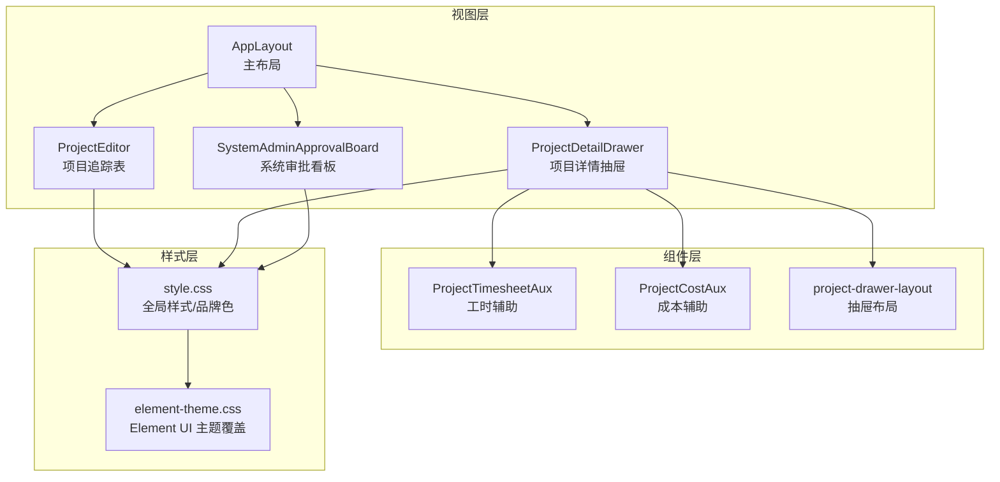
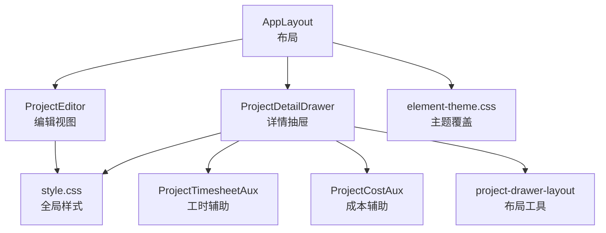
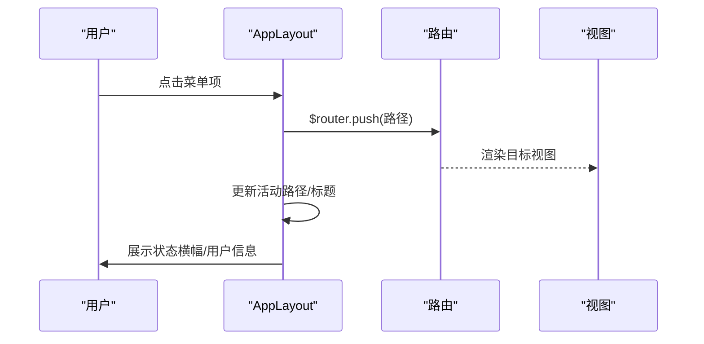
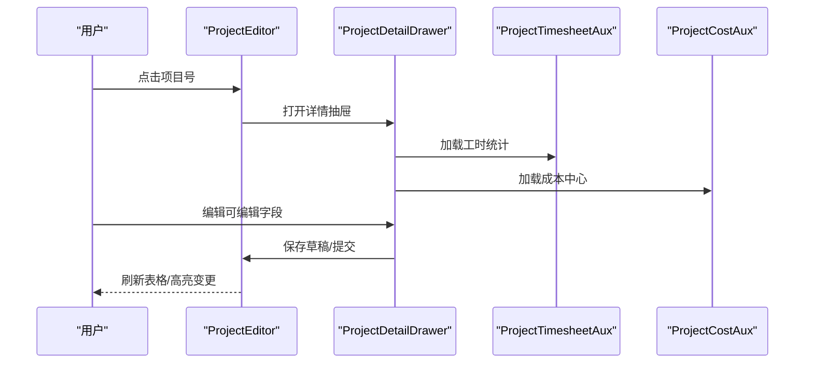
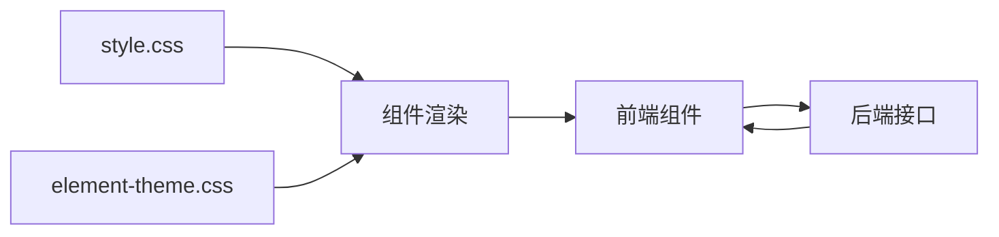

# 设计文档

<cite>
**本文档引用的文件**
- [DASHBOARD.md](file://docs/设计文档/DASHBOARD.md)
- [LIST_FORM.md](file://docs/设计文档/LIST_FORM.md)
- [DESIGN.md](file://docs/设计文档/DESIGN.md)
- [style.css](file://css/style.css)
- [element-theme.css](file://css/element-theme.css)
- [AppLayout.js](file://js/components/AppLayout.js)
- [ProjectEditor.js](file://js/views/ProjectEditor.js)
- [ProjectDetailDrawer.js](file://js/components/ProjectDetailDrawer.js)
- [SystemAdminApprovalBoard.js](file://js/components/SystemAdminApprovalBoard.js)
- [ProjectTimesheetAux.js](file://js/components/ProjectTimesheetAux.js)
- [ProjectCostAux.js](file://js/components/ProjectCostAux.js)
- [project-drawer-layout.js](file://js/project-drawer-layout.js)
- [formatters.js](file://js/formatters.js)
</cite>

## 目录
1. [简介](#简介)
2. [项目结构](#项目结构)
3. [核心组件](#核心组件)
4. [架构总览](#架构总览)
5. [详细组件分析](#详细组件分析)
6. [依赖关系分析](#依赖关系分析)
7. [性能考虑](#性能考虑)
8. [故障排查指南](#故障排查指南)
9. [结论](#结论)
10. [附录](#附录)

## 简介
本设计文档面向“项目追踪表线上化”平台，系统化梳理用户界面与用户体验设计，重点覆盖两大领域：
- 数据看板（Dashboard）：布局结构、信息架构、交互模式与图表规范
- 列表/搜索/分页/表单（List Form）：字段排列、验证规则与用户体验优化

文档同时结合视觉体系（色彩、字体、组件规范）与前端实现（布局、样式、组件），提供设计评审、用户测试与迭代优化的实践路径。

## 项目结构
项目采用前端单页应用（SPA）架构，核心由三部分组成：
- 视图层：列表页、编辑页、审批页、管理页等
- 组件层：布局、抽屉、辅助面板等
- 样式层：全局样式、主题覆盖、品牌色与语义色

**图表来源**
- [AppLayout.js:31-238](file://js/components/AppLayout.js#L31-L238)
- [ProjectEditor.js:64-167](file://js/views/ProjectEditor.js#L64-L167)
- [ProjectDetailDrawer.js:23-56](file://js/components/ProjectDetailDrawer.js#L23-L56)
- [SystemAdminApprovalBoard.js:7-80](file://js/components/SystemAdminApprovalBoard.js#L7-L80)
- [ProjectTimesheetAux.js:21-37](file://js/components/ProjectTimesheetAux.js#L21-L37)
- [ProjectCostAux.js:24-38](file://js/components/ProjectCostAux.js#L24-L38)
- [project-drawer-layout.js:68-126](file://js/project-drawer-layout.js#L68-L126)
- [style.css:6-49](file://css/style.css#L6-L49)
- [element-theme.css:1-6](file://css/element-theme.css#L1-L6)

**章节来源**
- [AppLayout.js:31-238](file://js/components/AppLayout.js#L31-L238)
- [ProjectEditor.js:64-167](file://js/views/ProjectEditor.js#L64-L167)
- [ProjectDetailDrawer.js:23-56](file://js/components/ProjectDetailDrawer.js#L23-L56)
- [SystemAdminApprovalBoard.js:7-80](file://js/components/SystemAdminApprovalBoard.js#L7-L80)
- [ProjectTimesheetAux.js:21-37](file://js/components/ProjectTimesheetAux.js#L21-L37)
- [ProjectCostAux.js:24-38](file://js/components/ProjectCostAux.js#L24-L38)
- [project-drawer-layout.js:68-126](file://js/project-drawer-layout.js#L68-L126)
- [style.css:6-49](file://css/style.css#L6-L49)
- [element-theme.css:1-6](file://css/element-theme.css#L1-L6)

## 核心组件
- 主布局（AppLayout）：侧边栏、顶栏、内容区、用户下拉、菜单折叠与状态横幅
- 项目追踪表（ProjectEditor）：Luckysheet 表格、视图模式、筛选、冻结列、列宽、差量高亮
- 项目详情抽屉（ProjectDetailDrawer）：可编辑/只读分区、月度字段、辅助面板、导航
- 系统审批看板（SystemAdminApprovalBoard）：十二板块并行流程、步骤状态
- 辅助面板：工时统计（ProjectTimesheetAux）、成本中心（ProjectCostAux）
- 抽屉布局工具（project-drawer-layout）：字段分区、控件类型、月度字段分组
- 格式化工具（formatters）：金额/百分比/日期/布尔等统一格式化
- 视觉体系（style.css、element-theme.css）：品牌色、语义色、字体、组件样式覆盖

**章节来源**
- [AppLayout.js:31-238](file://js/components/AppLayout.js#L31-L238)
- [ProjectEditor.js:64-167](file://js/views/ProjectEditor.js#L64-L167)
- [ProjectDetailDrawer.js:23-56](file://js/components/ProjectDetailDrawer.js#L23-L56)
- [SystemAdminApprovalBoard.js:7-80](file://js/components/SystemAdminApprovalBoard.js#L7-L80)
- [ProjectTimesheetAux.js:21-37](file://js/components/ProjectTimesheetAux.js#L21-L37)
- [ProjectCostAux.js:24-38](file://js/components/ProjectCostAux.js#L24-L38)
- [project-drawer-layout.js:68-126](file://js/project-drawer-layout.js#L68-L126)
- [formatters.js:152-166](file://js/formatters.js#L152-L166)
- [style.css:6-49](file://css/style.css#L6-L49)
- [element-theme.css:1-6](file://css/element-theme.css#L1-L6)

## 架构总览
平台采用“布局-视图-组件-样式”的分层架构：
- 布局层：AppLayout 提供统一导航、侧边栏、状态横幅
- 视图层：ProjectEditor 作为核心数据入口，ProjectDetailDrawer 作为详情与编辑入口
- 组件层：辅助面板与布局工具提升可维护性与一致性
- 样式层：style.css 定义品牌色与基础样式，element-theme.css 覆盖 Element UI 组件

**图表来源**
- [AppLayout.js:31-238](file://js/components/AppLayout.js#L31-L238)
- [ProjectEditor.js:64-167](file://js/views/ProjectEditor.js#L64-L167)
- [ProjectDetailDrawer.js:23-56](file://js/components/ProjectDetailDrawer.js#L23-L56)
- [ProjectTimesheetAux.js:21-37](file://js/components/ProjectTimesheetAux.js#L21-L37)
- [ProjectCostAux.js:24-38](file://js/components/ProjectCostAux.js#L24-L38)
- [project-drawer-layout.js:68-126](file://js/project-drawer-layout.js#L68-L126)
- [style.css:6-49](file://css/style.css#L6-L49)
- [element-theme.css:1-6](file://css/element-theme.css#L1-L6)

## 详细组件分析

### 数据看板（Dashboard）设计要点
- 展示层规范：千分位、小数位、负数、单位、缩写规则
- 口径与数据来源：业务定义、计算逻辑、数据来源、更新时间、时间口径
- 交互与下探：是否下探、下探继承规则、点击区域
- 布局与信息层级：KPI 卡片优先、模块不超过 3 列、卡片可比性
- 趋势/对比与颜色语义：正负向指标配置化、阈值与箭头双编码
- 筛选器与默认值：时间/组织/项目筛选、默认值、筛选生效范围
- 图表规范：饼/柱/线图类型选择、坐标轴、数据标签、颜色规范、网格布局、图例、Tooltip、空值/断点、交互开关
- 表格能力：排序/固定列/分页/汇总/导出
- 异常与空值：无数据/除零/加载态/权限提示
- 性能与刷新：指标刷新频率、大表按需加载、缓存策略
- 文档交付：页面结构、模块指标、口径说明、交互说明、异常处理

**章节来源**
- [DASHBOARD.md:10-199](file://docs/设计文档/DASHBOARD.md#L10-L199)

### 列表/搜索/分页/表单（List Form）设计要点
- 适用范围：列表页/台账页/管理页/审批页/主数据维护页
- 页面布局：标题+面包屑、筛选区、操作区、数据表格、分页区；筛选区与操作区分离、筛选区折叠
- 搜索与筛选：非实时筛选、回车等效、重置行为、默认值、控件类型、筛选标签、组织筛选
- 高级筛选：折叠状态持久化、已生效条件徽章
- 列表展示：列定义、数字与格式规范、状态列、操作列、批量操作、斑马纹与悬停
- 分页：强制分页、默认每页 10 条、URL 化、空页兜底
- 排序：单列排序、可视化状态、默认排序、持久化
- 表单规范：新建/编辑/详情场景、布局与控件、必填与校验、默认值策略、禁用/只读、提交防重与 loading、离开保护
- 弹窗表单：尺寸固定、结构固定、页面滚动控制、按钮顺序
- 状态与反馈：加载态、空态、成功/失败反馈
- 导出：导出范围、异步任务、文件命名、格式一致
- 数据与接口契约：查询参数/响应结构、枚举映射、时间字段、导出接口、软删除
- 交付清单：筛选字段、列表列、分页/排序、表单字段、状态流转、异常流程、导出

**章节来源**
- [LIST_FORM.md:14-302](file://docs/设计文档/LIST_FORM.md#L14-L302)

### 视觉体系与设计原则
- 视觉基调：简洁商务、高可读性、清晰导航
- 色彩系统：主色 #007069、背景与表面、文字、语义色（成功/警告/危险）、图表轴色
- 字体规范：系统字体栈、字号与权重层级
- 组件规范：按钮、卡片、表格、表单与筛选、进度条/环、导航、标签页、详情跳转链接、增量徽章、浮动操作按钮组
- 布局原则：页面结构、栅格与间距、圆角与阴影
- 图表规范：统一品牌色系、坐标轴、网格线、Tooltip 容器、饼图/环形图
- 交互规范：Hover 态、过渡动画、焦点态、弹窗与模态
- 分页与列表规范：Ant Design 主题配置、列表分页、筛选策略
- 快速参考：颜色速查、常用组件片段、开发检查清单

**章节来源**
- [DESIGN.md:1-464](file://docs/设计文档/DESIGN.md#L1-L464)

### 主布局（AppLayout）与导航
- 侧边栏：Logo、菜单项、折叠/展开、状态横幅（填报中/已锁定/财务核查）
- 顶栏：页面标题、用户下拉（角色、切换角色、重置为初始状态、退出登录）
- 内容区：根据路由切换视图，编辑页/审批页特殊处理
- 导航项按角色动态过滤，支持审计日志与表头配置入口

**图表来源**
- [AppLayout.js:88-133](file://js/components/AppLayout.js#L88-L133)

**章节来源**
- [AppLayout.js:31-238](file://js/components/AppLayout.js#L31-L238)

### 项目追踪表（ProjectEditor）与抽屉（ProjectDetailDrawer）
- 项目追踪表：Luckysheet 表格、冻结列、紧凑列视图、可编辑列高亮、变更高亮、Diff 提示、版本查看、导入/导出、提交归档
- 项目详情抽屉：可编辑/只读分区、月度字段条带、辅助面板（工时/成本）、导航、保存/关闭、系统引用覆盖提示
- 抽屉布局工具：字段分区、控件类型判断、月度字段分组、变更收集

**图表来源**
- [ProjectEditor.js:497-540](file://js/views/ProjectEditor.js#L497-L540)
- [ProjectDetailDrawer.js:335-337](file://js/components/ProjectDetailDrawer.js#L335-L337)
- [ProjectTimesheetAux.js:121-144](file://js/components/ProjectTimesheetAux.js#L121-L144)
- [ProjectCostAux.js:96-119](file://js/components/ProjectCostAux.js#L96-L119)

**章节来源**
- [ProjectEditor.js:64-167](file://js/views/ProjectEditor.js#L64-L167)
- [ProjectDetailDrawer.js:23-56](file://js/components/ProjectDetailDrawer.js#L23-L56)
- [ProjectTimesheetAux.js:21-37](file://js/components/ProjectTimesheetAux.js#L21-L37)
- [ProjectCostAux.js:24-38](file://js/components/ProjectCostAux.js#L24-L38)
- [project-drawer-layout.js:68-126](file://js/project-drawer-layout.js#L68-L126)

### 系统审批看板（SystemAdminApprovalBoard）
- 十二板块并行流程：步骤状态（已完成/进行中/未完成）、板块显示标签、公司归档状态
- 流程状态：根据审批状态与归档状态动态判定标签类型

**章节来源**
- [SystemAdminApprovalBoard.js:7-80](file://js/components/SystemAdminApprovalBoard.js#L7-L80)

### 样式与主题（style.css、element-theme.css）
- 品牌色与语义色：主色 #007069、成功/警告/危险、图表轴色
- 基础样式：全局字体栈、等宽数字、应用布局、侧边栏/顶栏/内容区、卡片/KPI 卡片、图表区域、Diff 高亮、工具栏
- Element UI 主题覆盖：主按钮、文字链接、表单控件 focus、Checkbox/Radio/Switch、Select/Dropdown/Cascader、Tabs、Pagination、Table、Date/Time Picker、Steps/Timeline、Progress/Slider、Tag/Badge/Alert、Tree/Menu、Upload/Transfer、Loading/Message/Notification、Collapse/Drawer/Dialog、Rate/ColorPicker

**章节来源**
- [style.css:6-49](file://css/style.css#L6-L49)
- [style.css:312-800](file://css/style.css#L312-L800)
- [element-theme.css:1-6](file://css/element-theme.css#L1-L6)
- [element-theme.css:7-406](file://css/element-theme.css#L7-L406)

### 格式化与数据展示（formatters.js）
- 金额：千分位、两位小数、等宽数字
- 金额（万/亿）：缩写展示
- 百分比：乘 100 后两位小数
- 税率：整数百分比
- 日期：ISO 8601（YYYY-MM-DD），兼容 Excel 序列日
- 布尔：枚举映射
- 统一格式化函数：按字段类型格式化

**章节来源**
- [formatters.js:152-166](file://js/formatters.js#L152-L166)

## 依赖关系分析
- 组件耦合：AppLayout 为顶层容器，ProjectEditor 与 ProjectDetailDrawer 依赖字段字典与权限；抽屉辅助面板依赖 API 获取明细
- 样式依赖：全局样式与 Element 主题覆盖共同作用于组件渲染
- 数据流：视图层通过 Store/接口获取数据，格式化工具统一输出展示格式

**图表来源**
- [style.css:6-49](file://css/style.css#L6-L49)
- [element-theme.css:1-6](file://css/element-theme.css#L1-L6)
- [ProjectEditor.js:64-167](file://js/views/ProjectEditor.js#L64-L167)
- [ProjectDetailDrawer.js:23-56](file://js/components/ProjectDetailDrawer.js#L23-L56)

**章节来源**
- [style.css:6-49](file://css/style.css#L6-L49)
- [element-theme.css:1-6](file://css/element-theme.css#L1-L6)
- [ProjectEditor.js:64-167](file://js/views/ProjectEditor.js#L64-L167)
- [ProjectDetailDrawer.js:23-56](file://js/components/ProjectDetailDrawer.js#L23-L56)

## 性能考虑
- 列表分页与排序：后端执行，避免前端跨页不一致
- 大表按需加载：分页/滚动加载，限制最大行数
- 缓存策略：可配置缓存（如 5 分钟）
- 加载态：骨架屏/遮罩，避免内容闪烁
- 表单提交防重：按钮 loading 与弹窗不可关闭
- 图表渲染：dataZoom/平滑/标签位置优化，避免过度绘制

[本节为通用指导，不直接分析具体文件]

## 故障排查指南
- 无数据/空值：显示“—”，避免 0 与 null 混淆
- 除零/无定义：显示“—”，并提示原因
- 权限不足：明确提示“无权限/无数据范围”
- 网络错误：统一错误提示与“重试”按钮
- 表单错误：字段级错误展示，不使用全局 Toast 代替
- 加载态：首次加载骨架屏，刷新叠加遮罩

**章节来源**
- [LIST_FORM.md:213-241](file://docs/设计文档/LIST_FORM.md#L213-L241)
- [DASHBOARD.md:179-184](file://docs/设计文档/DASHBOARD.md#L179-L184)

## 结论
本设计文档将数据看板与列表表单的设计原则、交互流程与视觉体系有机结合，配合主布局、抽屉与辅助面板的实现，形成一致、高效、可维护的用户体验。通过统一的格式化与样式体系，确保数据展示的一致性与可读性；通过严格的交互与反馈规范，降低认知负担并提升操作效率。

## 附录
- 设计评审流程：PRD 与设计稿对齐、交互与数据口径评审、视觉一致性检查
- 用户测试方法：可用性测试、A/B 对比、用户反馈收集与迭代
- 迭代优化策略：基于数据指标（转化率、错误率、留存）与用户反馈持续优化

[本节为通用指导，不直接分析具体文件]