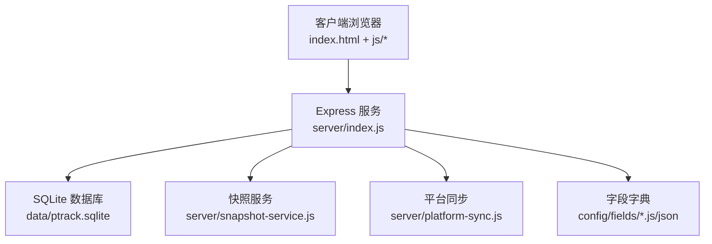
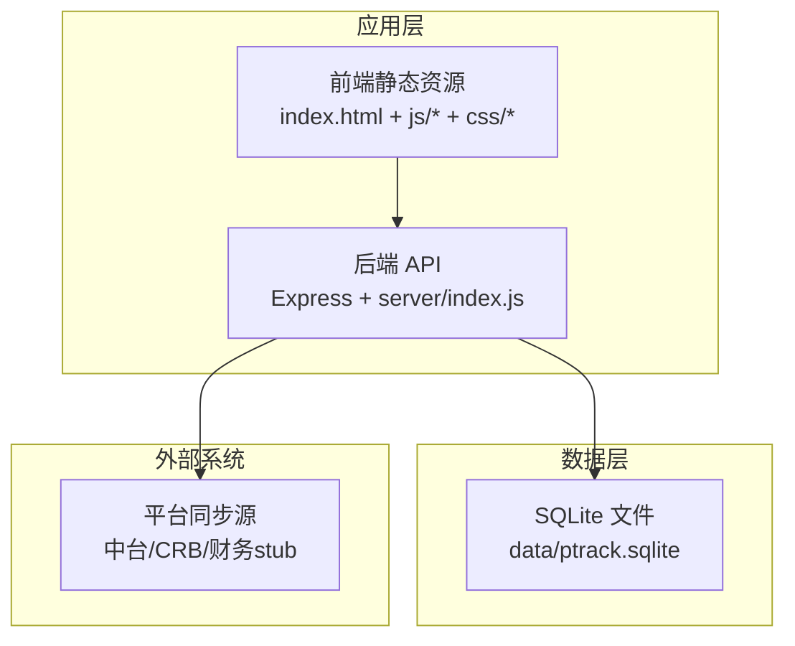
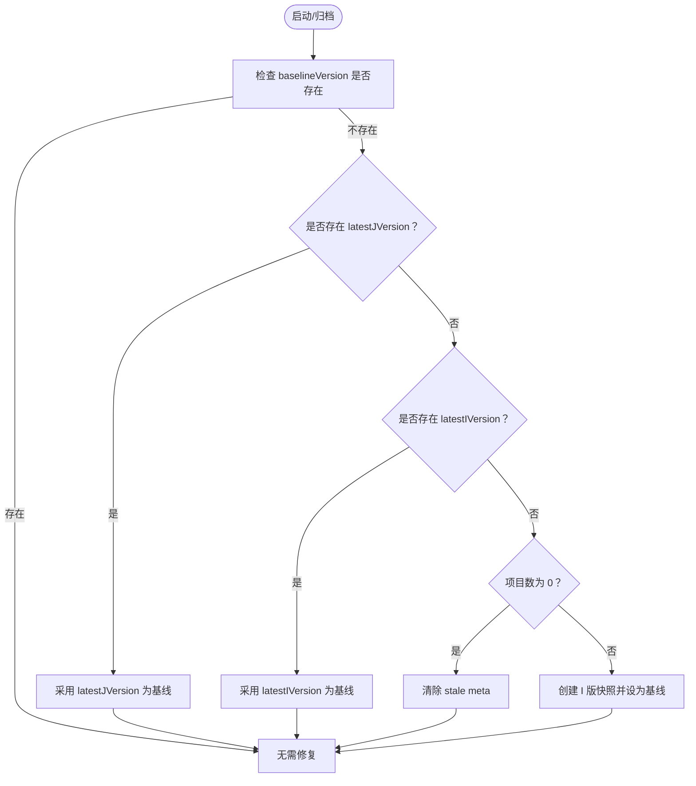
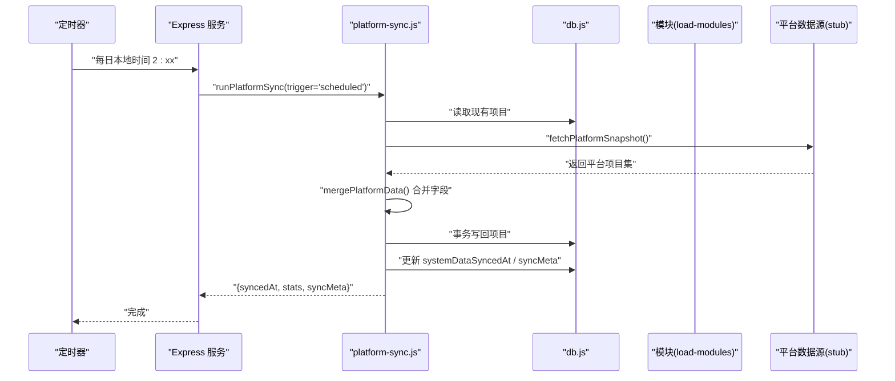
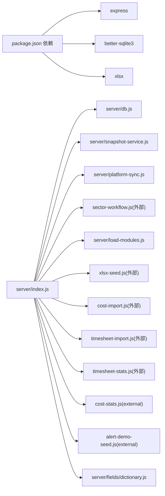

# 部署与运维

<cite>
**本文引用的文件**
- [package.json](file://package.json)
- [server/index.js](file://server/index.js)
- [server/db.js](file://server/db.js)
- [server/snapshot-service.js](file://server/snapshot-service.js)
- [server/platform-sync.js](file://server/platform-sync.js)
- [database-schema.sql](file://database-schema.sql)
- [AGENTS.md](file://AGENTS.md)
- [docs/需求文档/技术栈与开发规范.md](file://docs/需求文档/技术栈与开发规范.md)
</cite>

## 目录
1. [简介](#简介)
2. [项目结构](#项目结构)
3. [核心组件](#核心组件)
4. [架构总览](#架构总览)
5. [详细组件分析](#详细组件分析)
6. [依赖关系分析](#依赖关系分析)
7. [性能考量](#性能考量)
8. [故障排查指南](#故障排查指南)
9. [结论](#结论)
10. [附录](#附录)

## 简介
本文件面向生产环境部署与日常运维，围绕“项目执行追踪平台”的后端服务（Node.js + Express + better-sqlite3 + SQLite）给出完整的部署配置、环境变量、依赖管理、服务器环境要求、性能调优、资源监控、数据库备份与恢复、日志与错误监控、CI/CD 与自动化运维、安全加固与合规检查、以及常见问题与应急响应流程。

## 项目结构
- 后端服务入口：server/index.js，提供 /api/* REST 接口与静态资源托管
- 数据层：server/db.js 封装 SQLite（better-sqlite3），元数据与项目数据均存储于 data/ptrack.sqlite
- 快照与归档：server/snapshot-service.js 管理 I/D/J 版本快照与基线
- 平台同步：server/platform-sync.js 与外部系统（中台/CRB/财务）字段合并与定时同步
- 前端：index.html + js/* + css/*，通过 npm start 同时提供静态站点与 API 服务
- 文档与规范：AGENTS.md 提供环境、变量、命令与文件清单；技术栈与开发规范文档说明 CDN 与依赖

**图示来源**
- [server/index.js:1-775](file://server/index.js#L1-L775)
- [server/db.js:1-525](file://server/db.js#L1-L525)
- [server/snapshot-service.js:1-292](file://server/snapshot-service.js#L1-L292)
- [server/platform-sync.js:1-272](file://server/platform-sync.js#L1-L272)

**章节来源**
- [AGENTS.md:8-92](file://AGENTS.md#L8-L92)
- [docs/需求文档/技术栈与开发规范.md:10-144](file://docs/需求文档/技术栈与开发规范.md#L10-L144)

## 核心组件
- 服务进程与端口
  - 端口：PTRACK_PORT（默认 3000）
  - 启动：npm start（node server/index.js）
- 数据库与模式
  - SQLite 文件：data/ptrack.sqlite
  - Schema：database-schema.sql
- 快照与基线
  - I 版导入快照、D 版草稿快照、J 版归档快照
  - baselineVersion、latestIVersion、latestJVersion 元数据
- 平台同步
  - 定时同步（默认每日 2 点）与手动触发
  - system_sync 字段合并与新/旧项目年度翻转
- 字段字典
  - config/fields/fields.json 为权威源，运行时镜像 fields-data.js
  - 通过 /api/fields 与 /api/admin/fields 管理

**章节来源**
- [server/index.js:22-28](file://server/index.js#L22-L28)
- [server/db.js:8-10](file://server/db.js#L8-L10)
- [server/snapshot-service.js:6-86](file://server/snapshot-service.js#L6-L86)
- [server/platform-sync.js:214-262](file://server/platform-sync.js#L214-L262)
- [AGENTS.md:57-66](file://AGENTS.md#L57-L66)

## 架构总览
后端采用“单进程 + 单实例 + 本地 SQLite”的轻量架构，前端静态资源与后端 API 共享同一进程，适合中小规模内部工具与演示环境。生产部署建议通过反向代理（如 Nginx）暴露服务，并结合 systemd 或容器编排实现健康检查与自动重启。

**图示来源**
- [server/index.js:88-775](file://server/index.js#L88-L775)
- [server/db.js:11-60](file://server/db.js#L11-L60)
- [server/platform-sync.js:200-206](file://server/platform-sync.js#L200-L206)

## 详细组件分析

### 服务进程与端口
- 端口来源：process.env.PTRACK_PORT，默认 3000
- 静态资源：express.static 根目录
- 日志：启动日志输出端口与数据库路径；定时同步异常记录警告

**章节来源**
- [server/index.js:22-28](file://server/index.js#L22-L28)
- [server/index.js:771-773](file://server/index.js#L771-L773)

### 数据库与模式
- 数据库存放：data/ptrack.sqlite（自动创建）
- WAL 模式：提升并发读写性能
- Schema：涵盖项目主表、月度记录、年度基线、预收款核销、审计日志、快照、工时/成本等
- 元数据：periodConfig、reportingMonth、lockStatus、approvalStatus、pmSubmissions、sectorFlows、users、groupRegistry、sectorAdmins 等

**章节来源**
- [server/db.js:8-10](file://server/db.js#L8-L10)
- [server/db.js:14](file://server/db.js#L14)
- [database-schema.sql:1-286](file://database-schema.sql#L1-L286)

### 快照与归档
- 版本键规则：I/D/J + YYYYMMDD + 作用域 + 序号
- I 版：导入初始化快照，建立 baselineVersion
- D 版：板块草稿快照，记录草稿版本
- J 版：公司归档快照，更新 baselineVersion
- 启动时维护：清理旧版键、修复基线、必要时重建 I 版

**图示来源**
- [server/snapshot-service.js:229-274](file://server/snapshot-service.js#L229-L274)

**章节来源**
- [server/snapshot-service.js:88-158](file://server/snapshot-service.js#L88-L158)
- [server/snapshot-service.js:229-274](file://server/snapshot-service.js#L229-L274)

### 平台同步与定时任务
- 同步触发：定时（每日 2 点，可配置）与手动
- 合并策略：以 project_no 为键合并 system_sync 字段，保留现有显示字段，仅更新 _system_ref
- 年度翻转：报告年度切换时对 A 列引用进行“新/旧项目”翻转
- 审计：记录同步触发器、统计与操作者

**图示来源**
- [server/index.js:745-775](file://server/index.js#L745-L775)
- [server/platform-sync.js:214-262](file://server/platform-sync.js#L214-L262)
- [server/platform-sync.js:200-206](file://server/platform-sync.js#L200-L206)

**章节来源**
- [server/index.js:745-775](file://server/index.js#L745-L775)
- [server/platform-sync.js:214-262](file://server/platform-sync.js#L214-L262)

### 字段字典与前端集成
- 权威源：config/fields/fields.json
- 运行时镜像：config/fields/fields-data.js（由 npm run sync:fields 同步）
- 服务端：/api/fields 读取；PUT /api/admin/fields 写入并同步
- 前端：bootstrap 时加载字段字典，表头配置页仅 system_admin 可编辑

**章节来源**
- [AGENTS.md:47-56](file://AGENTS.md#L47-L56)
- [AGENTS.md:206-254](file://AGENTS.md#L206-L254)
- [server/index.js:103-110](file://server/index.js#L103-L110)
- [server/index.js:714-741](file://server/index.js#L714-L741)

## 依赖关系分析

**图示来源**
- [package.json:13-17](file://package.json#L13-L17)
- [server/index.js:1-20](file://server/index.js#L1-L20)

**章节来源**
- [package.json:13-17](file://package.json#L13-L17)
- [server/index.js:1-20](file://server/index.js#L1-L20)

## 性能考量
- 数据库
  - WAL 模式：提升并发读写吞吐
  - 索引：针对项目主表与审计日志的关键列建立索引
  - 事务：批量写入使用事务（如 replaceAllProjects、事务写回项目）
- API
  - JSON 体限制：express.json({ limit: '80mb' })，满足大 Excel 导入场景
  - 定时同步：每日固定时间执行，避免高峰时段
- 前端
  - CDN 依赖：Tailwind CSS 生产环境建议替换为预编译版本，降低运行时编译开销
  - 图表与表格：ECharts/Luckysheet 按需使用，避免全量引入带来的体积负担

**章节来源**
- [server/db.js:14](file://server/db.js#L14)
- [server/index.js:89](file://server/index.js#L89)
- [docs/需求文档/技术栈与开发规范.md:138-143](file://docs/需求文档/技术栈与开发规范.md#L138-L143)

## 故障排查指南
- 启动失败
  - 检查 PTRACK_PORT 是否被占用；默认 3000
  - 确认 data/ptrack.sqlite 可写；首次启动会自动创建
- 无项目数据
  - 设置 PTRACK_INIT_XLSX 或放置“初始数据.xlsx”于根目录
  - 服务启动时会自动导入；若失败，查看控制台警告
- 字段字典未生效
  - 修改 fields.json 后执行 npm run sync:fields
  - 服务端公式/权限需重启 npm start 生效
- 平台同步异常
  - 定时任务会记录警告；检查 systemDataSyncedAt 与 systemDataSyncMeta
  - PTRACK_PLATFORM_API_URL 未实现时勿配置，使用 stub
- 快照维护
  - 启动时会清理旧版快照并修复基线；若仍异常，检查 baselineVersion、latestIVersion、latestJVersion

**章节来源**
- [AGENTS.md:57-76](file://AGENTS.md#L57-L76)
- [server/index.js:30-65](file://server/index.js#L30-L65)
- [server/platform-sync.js:200-206](file://server/platform-sync.js#L200-L206)
- [server/snapshot-service.js:229-274](file://server/snapshot-service.js#L229-L274)

## 结论
本项目采用轻量级架构，适合中小规模内部工具部署。生产环境建议通过反向代理、进程守护与健康检查增强稳定性；结合定期备份、监控与演练完善运维体系。字段字典与平台同步机制确保业务规则与外部系统的一致性；快照体系为归档与审计提供可靠支撑。

## 附录

### A. 生产环境部署清单
- 服务器环境
  - 操作系统：Linux（推荐 Ubuntu/CentOS）
  - 运行时：Node.js 18+（LTS）
  - Python 3（可选，仅字段同步）
- 依赖安装
  - npm install（生产依赖）
- 环境变量
  - PTRACK_PORT：服务端口（默认 3000）
  - PTRACK_INIT_XLSX：初始化 Excel 路径
  - PTRACK_PLATFORM_API_URL：平台同步真实 API（未实现时勿配置）
  - PTRACK_TIMESHEET_DIR、PTRACK_COST_DIR：工时/成本导入目录
- 启动与守护
  - 使用 systemd 或 Docker 管理进程
  - 配置健康检查（/api/bootstrap）
- 反向代理
  - Nginx 暴露 80/443，转发至 PTRACK_PORT
  - 静态资源与 API 同源，避免跨域问题

**章节来源**
- [AGENTS.md:10-17](file://AGENTS.md#L10-L17)
- [AGENTS.md:57-66](file://AGENTS.md#L57-L66)
- [docs/需求文档/技术栈与开发规范.md:10-144](file://docs/需求文档/技术栈与开发规范.md#L10-L144)

### B. 数据库备份与灾难恢复
- 备份策略
  - 增量：基于 SQLite 的 WAL 模式，可复制 data/ptrack.sqlite 与其 WAL/SHM
  - 全量：定期导出 schema 与数据（可使用 sqlite3 命令行工具）
- 恢复步骤
  - 停止服务
  - 备份当前 data/ptrack.sqlite（如有）
  - 恢复目标文件（含 wal/shm）
  - 启动服务，检查 /api/bootstrap 与快照维护日志
- 验证
  - 校验项目数量、审计日志、快照版本与基线

**章节来源**
- [server/db.js:8-10](file://server/db.js#L8-L10)
- [database-schema.sql:1-286](file://database-schema.sql#L1-286)

### C. 日志与监控
- 日志
  - 启动日志：输出端口与数据库路径
  - 定时同步：成功/失败警告
  - 审计：所有写操作记录 audit_log
- 监控指标
  - 进程存活与响应时间
  - SQLite 文件大小与 WAL/SHM 状态
  - /api/bootstrap 响应时间与错误码
- 告警
  - 定时同步失败、快照维护异常、审计日志增长异常

**章节来源**
- [server/index.js:771-773](file://server/index.js#L771-L773)
- [server/index.js:752-754](file://server/index.js#L752-L754)
- [server/db.js:306-321](file://server/db.js#L306-L321)

### D. CI/CD 与自动化运维
- 构建与发布
  - 代码变更后自动运行 npm test
  - 镜像构建（见容器化章节）
- 自动化运维
  - 字段字典同步：npm run sync:fields
  - 初始化 Excel 导出：npm run export:init-xlsx
  - 开发重置：POST /api/admin/reset-dev
  - 重导项目：POST /api/admin/reseed
  - 手动同步：POST /api/admin/sync-platform-data 或 /api/editor/refresh-data

**章节来源**
- [AGENTS.md:83-92](file://AGENTS.md#L83-L92)
- [server/index.js:628-645](file://server/index.js#L628-L645)
- [server/index.js:492-516](file://server/index.js#L492-L516)
- [server/index.js:607-625](file://server/index.js#L607-L625)

### E. 容器化部署（建议）
- 基础镜像：node:18-alpine
- 工作目录：/app
- 步骤
  - 复制 package*.json，npm ci --only=production
  - 复制源码，npm run export:init-xlsx（可选）
  - 暴露 PTRACK_PORT，CMD ["npm", "start"]
- 卷挂载
  - /app/data：持久化 SQLite 数据
  - /app/初始数据.xlsx：初始化 Excel（可选）

**章节来源**
- [package.json:6-12](file://package.json#L6-L12)
- [AGENTS.md:57-66](file://AGENTS.md#L57-L66)

### F. 安全加固与合规
- 访问控制
  - 反向代理层限制来源 IP 与速率
  - 仅开放必要端口（80/443）
- 传输安全
  - HTTPS 终止于反向代理，TLS 证书由运维统一管理
- 数据保护
  - 限制对 data/ptrack.sqlite 的文件系统访问
  - 备份加密与最小权限存储
- 合规
  - 审计日志保留策略与访问审计
  - 字段字典与快照版本可追溯

**章节来源**
- [server/db.js:306-321](file://server/db.js#L306-L321)
- [server/snapshot-service.js:160-170](file://server/snapshot-service.js#L160-L170)