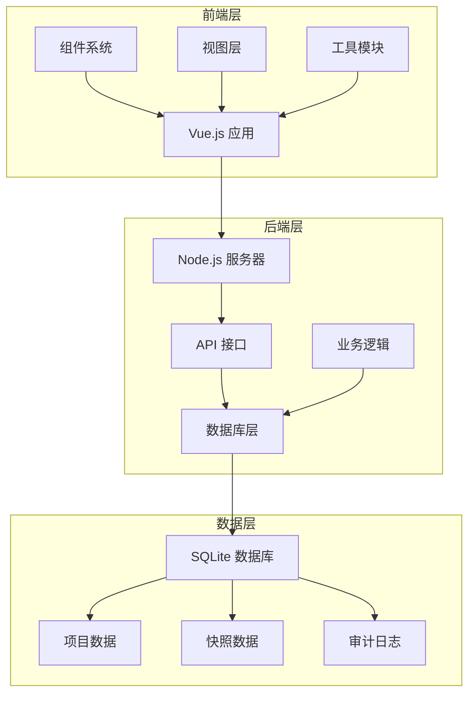
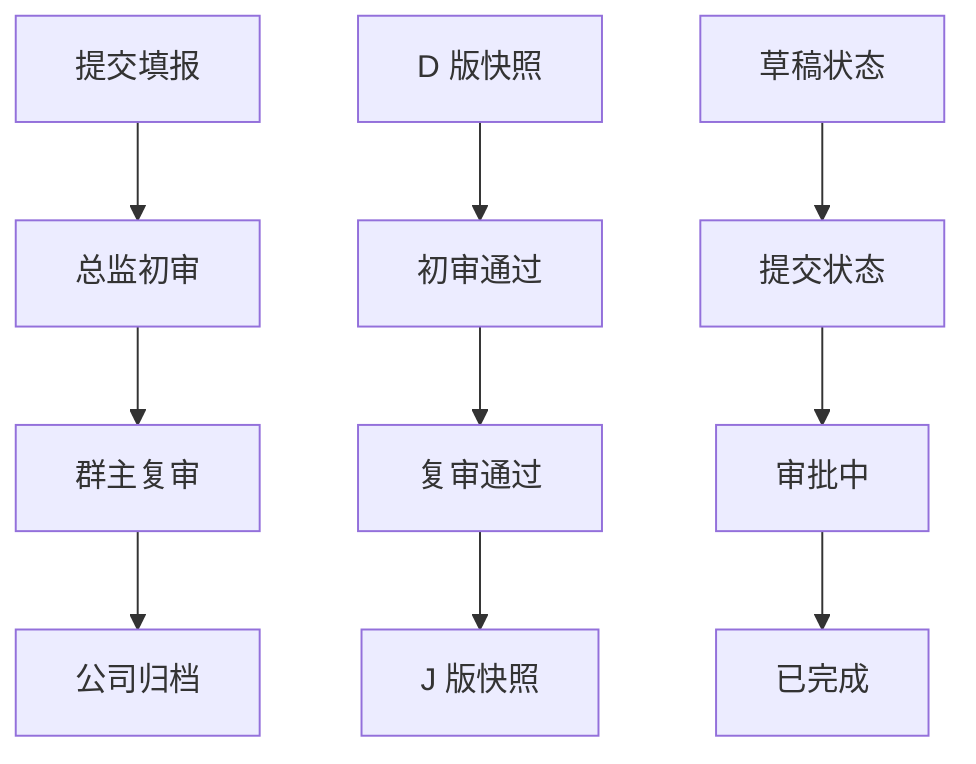
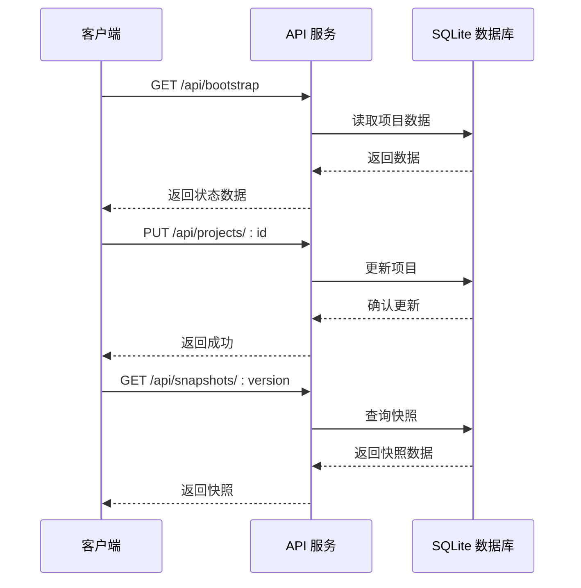
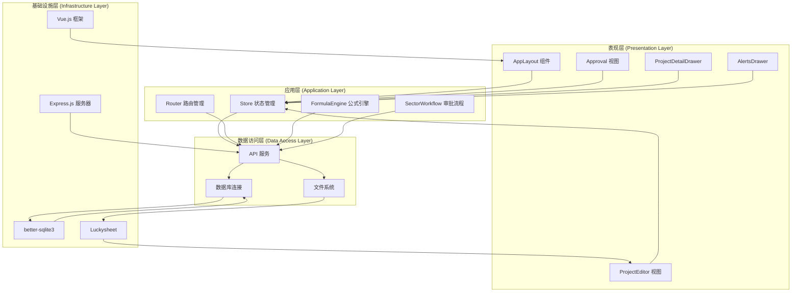
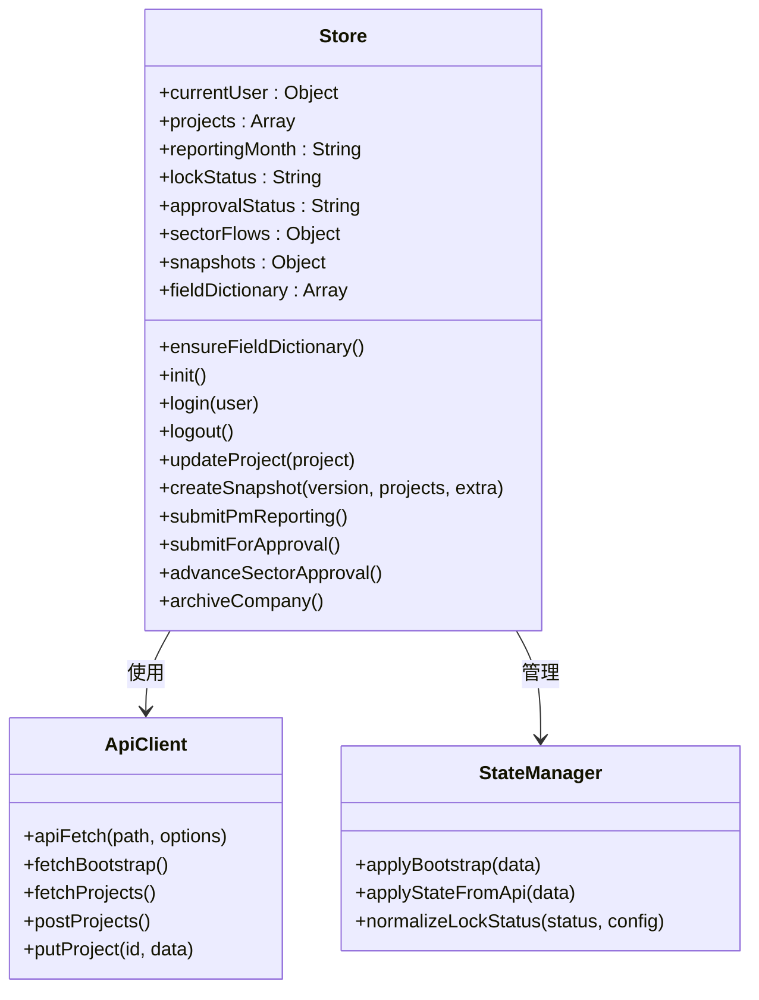
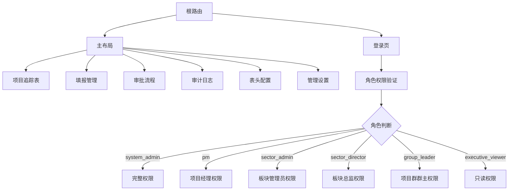
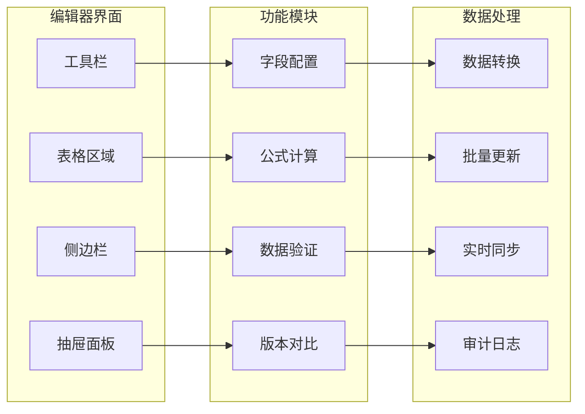
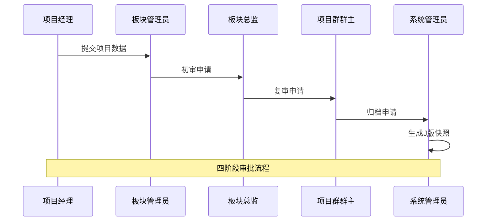
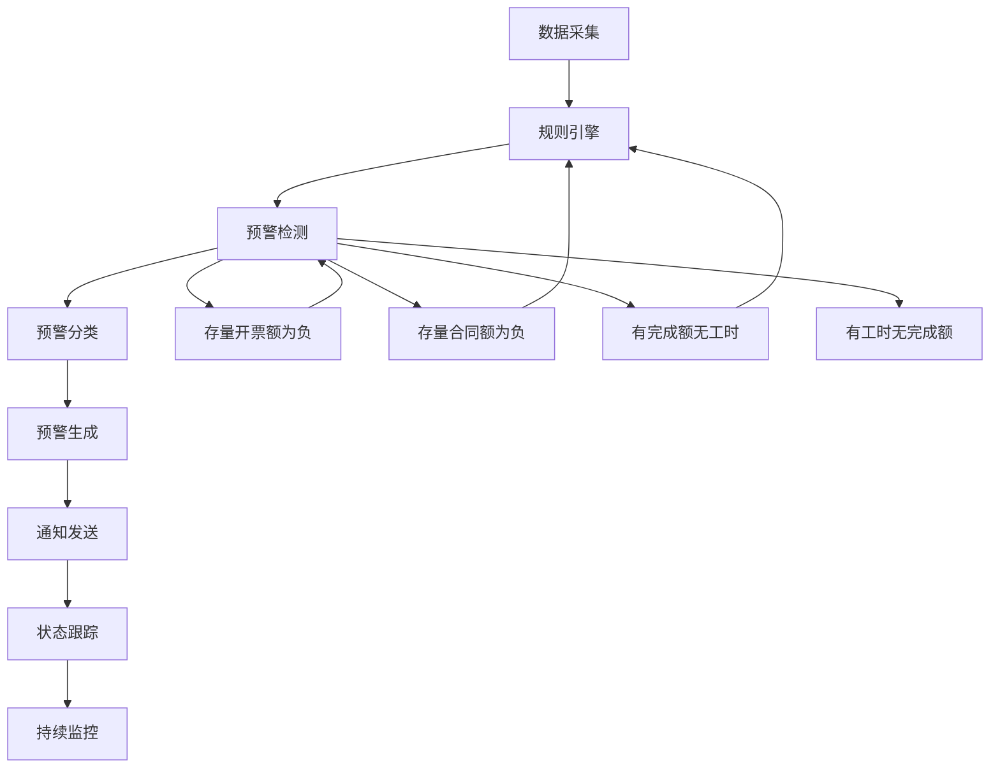
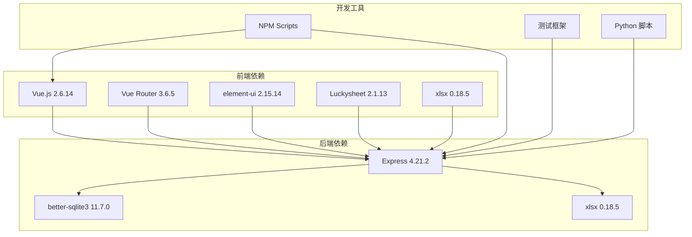

# 多角色协作框架

<cite>
**本文档引用的文件**
- [package.json](file://package.json)
- [index.html](file://index.html)
- [js/app.js](file://js/app.js)
- [js/store.js](file://js/store.js)
- [js/router.js](file://js/router.js)
- [js/components/AppLayout.js](file://js/components/AppLayout.js)
- [js/views/ProjectEditor.js](file://js/views/ProjectEditor.js)
- [js/views/Approval.js](file://js/views/Approval.js)
- [js/components/ProjectDetailDrawer.js](file://js/components/ProjectDetailDrawer.js)
- [js/components/AlertsDrawer.js](file://js/components/AlertsDrawer.js)
- [js/sector-workflow.js](file://js/sector-workflow.js)
- [js/formula-engine.js](file://js/formula-engine.js)
- [server/index.js](file://server/index.js)
- [server/db.js](file://server/db.js)
- [server/sector-workflow.js](file://server/sector-workflow.js)
</cite>

## 目录
1. [项目概述](#项目概述)
2. [项目结构](#项目结构)
3. [核心组件](#核心组件)
4. [架构概览](#架构概览)
5. [详细组件分析](#详细组件分析)
6. [依赖关系分析](#依赖关系分析)
7. [性能考虑](#性能考虑)
8. [故障排除指南](#故障排除指南)
9. [结论](#结论)

## 项目概述

这是一个基于 Vue.js 和 Node.js 的多角色协作框架，专门用于项目执行追踪和管理。系统支持多种角色的协同工作，包括项目经理、板块管理员、板块总监、项目群群主和系统管理员，每个角色都有特定的权限和职责。

### 主要特性

- **多角色权限管理**：支持6种不同角色，每种角色具有不同的操作权限
- **实时协作**：基于SQLite的实时数据同步和版本控制
- **审批流程**：完整的四阶段审批流程（提交填报→总监初审→群主复审→公司归档）
- **数据可视化**：集成Luckysheet电子表格，提供丰富的数据展示和编辑功能
- **预警机制**：自动化的项目预警系统，支持多种预警类型的检测和管理
- **报表管理**：支持多种报表格式的数据导入和导出

## 项目结构

项目采用前后端分离的架构设计，主要分为以下几个层次：

**图表来源**
- [index.html:1-111](file://index.html#L1-L111)
- [js/app.js:1-47](file://js/app.js#L1-L47)
- [server/index.js:1-994](file://server/index.js#L1-L994)

**章节来源**
- [package.json:1-19](file://package.json#L1-L19)
- [index.html:1-111](file://index.html#L1-L111)

## 核心组件

### 角色管理系统

系统定义了6种核心角色，每种角色都有明确的职责和权限边界：

| 角色 | 权限范围 | 主要职责 |
|------|----------|----------|
| 系统管理员 | 全部功能 | 系统配置、用户管理、数据导入导出 |
| 经营管理（只读） | 仅查看 | 查看所有项目数据，无编辑权限 |
| 板块管理员 | 板块内管理 | 管理本板块项目，提交审批 |
| 项目经理 | 个人项目 | 填报个人负责的项目数据 |
| 板块总监 | 板块审批 | 审核板块内项目，初审通过 |
| 项目群群主 | 全局审批 | 最终审批，公司归档 |

### 审批流程引擎

系统实现了标准化的四阶段审批流程：

**图表来源**
- [js/views/Approval.js:9-46](file://js/views/Approval.js#L9-L46)
- [server/sector-workflow.js:50-82](file://server/sector-workflow.js#L50-L82)

### 数据同步机制

系统采用双向数据同步机制，确保前端和后端数据的一致性：

**图表来源**
- [js/store.js:274-281](file://js/store.js#L274-L281)
- [server/index.js:109-118](file://server/index.js#L109-L118)

**章节来源**
- [js/store.js:97-134](file://js/store.js#L97-L134)
- [js/views/Approval.js:52-82](file://js/views/Approval.js#L52-L82)

## 架构概览

系统采用MVC架构模式，结合现代前端框架的优势：

**图表来源**
- [js/components/AppLayout.js:29-80](file://js/components/AppLayout.js#L29-L80)
- [js/views/ProjectEditor.js:64-115](file://js/views/ProjectEditor.js#L64-L115)
- [js/views/Approval.js:52-82](file://js/views/Approval.js#L52-L82)

**章节来源**
- [js/app.js:1-47](file://js/app.js#L1-L47)
- [server/index.js:1-994](file://server/index.js#L1-L994)

## 详细组件分析

### 状态管理系统 (Store)

Store是整个应用的核心状态管理中心，负责协调各个组件之间的数据流转：

**图表来源**
- [js/store.js:97-134](file://js/store.js#L97-L134)
- [js/store.js:243-247](file://js/store.js#L243-L247)

#### 关键功能特性

1. **响应式状态管理**：使用Vue.observable实现响应式数据绑定
2. **权限控制**：根据用户角色动态控制界面元素显示
3. **数据持久化**：自动同步数据到SQLite数据库
4. **版本控制**：支持项目快照和版本比较

**章节来源**
- [js/store.js:274-281](file://js/store.js#L274-L281)
- [js/store.js:326-342](file://js/store.js#L326-L342)

### 路由系统

系统采用Vue Router实现多角色导航：

**图表来源**
- [js/router.js:11-78](file://js/router.js#L11-L78)
- [js/router.js:94-140](file://js/router.js#L94-L140)

**章节来源**
- [js/router.js:7-144](file://js/router.js#L7-L144)

### 项目编辑器

项目编辑器是系统的核心功能模块，基于Luckysheet实现强大的数据编辑能力：

**图表来源**
- [js/views/ProjectEditor.js:64-115](file://js/views/ProjectEditor.js#L64-L115)
- [js/components/ProjectDetailDrawer.js:23-56](file://js/components/ProjectDetailDrawer.js#L23-L56)

#### 核心功能

1. **多角色编辑权限**：根据角色动态控制字段编辑权限
2. **实时数据同步**：支持多人同时编辑，自动冲突解决
3. **数据验证**：内置数据完整性检查和格式验证
4. **版本管理**：完整的版本历史和差异对比功能

**章节来源**
- [js/views/ProjectEditor.js:201-251](file://js/views/ProjectEditor.js#L201-L251)
- [js/components/ProjectDetailDrawer.js:204-220](file://js/components/ProjectDetailDrawer.js#L204-L220)

### 审批流程管理

审批流程是多角色协作的核心机制：

**图表来源**
- [js/views/Approval.js:9-46](file://js/views/Approval.js#L9-L46)
- [server/index.js:320-365](file://server/index.js#L320-L365)

**章节来源**
- [js/views/Approval.js:156-227](file://js/views/Approval.js#L156-L227)
- [server/sector-workflow.js:264-272](file://server/sector-workflow.js#L264-L272)

### 预警管理系统

系统内置智能预警机制，自动检测项目异常情况：

**图表来源**
- [js/components/AlertsDrawer.js:25-36](file://js/components/AlertsDrawer.js#L25-L36)

**章节来源**
- [js/components/AlertsDrawer.js:94-111](file://js/components/AlertsDrawer.js#L94-L111)

## 依赖关系分析

系统依赖关系清晰，层次分明：

**图表来源**
- [package.json:13-17](file://package.json#L13-L17)

**章节来源**
- [package.json:1-19](file://package.json#L1-L19)

## 性能考虑

系统在设计时充分考虑了性能优化：

### 数据库优化
- 使用SQLite作为轻量级数据库，减少部署复杂度
- 采用WAL模式提高并发性能
- 合理的索引策略优化查询性能

### 前端性能
- 懒加载组件减少初始加载时间
- 虚拟滚动处理大量数据
- 响应式设计适配不同设备

### 缓存策略
- 浏览器本地存储用户偏好
- API响应缓存减少重复请求
- 版本化静态资源利用浏览器缓存

## 故障排除指南

### 常见问题及解决方案

**启动失败**
- 检查Node.js版本是否满足要求
- 确认端口3000未被占用
- 验证数据库文件权限

**数据同步问题**
- 检查网络连接稳定性
- 确认API接口可用性
- 验证SQLite数据库完整性

**权限相关错误**
- 检查用户角色配置
- 验证会话状态
- 确认权限规则正确性

**性能问题**
- 监控数据库查询性能
- 优化前端组件渲染
- 检查内存使用情况

**章节来源**
- [js/app.js:32-44](file://js/app.js#L32-L44)
- [server/db.js:11-15](file://server/db.js#L11-L15)

## 结论

这个多角色协作框架是一个功能完整、架构清晰的企业级应用系统。它成功地将复杂的多角色权限管理、实时数据同步、审批流程控制和智能预警机制整合在一个统一的平台上。

### 主要优势

1. **角色权限明确**：清晰的角色定义和权限控制机制
2. **协作效率高**：实时数据同步和冲突解决机制
3. **扩展性强**：模块化设计便于功能扩展
4. **用户体验好**：直观的界面设计和丰富的交互功能
5. **维护成本低**：简洁的架构设计降低维护难度

### 技术亮点

- 基于Vue.js的现代化前端架构
- Node.js + Express的高效后端服务
- SQLite轻量级数据库方案
- Luckysheet强大的表格编辑功能
- 完整的审批流程自动化

该系统为企业项目管理提供了全面的数字化解决方案，能够有效提升团队协作效率和项目管理水平。