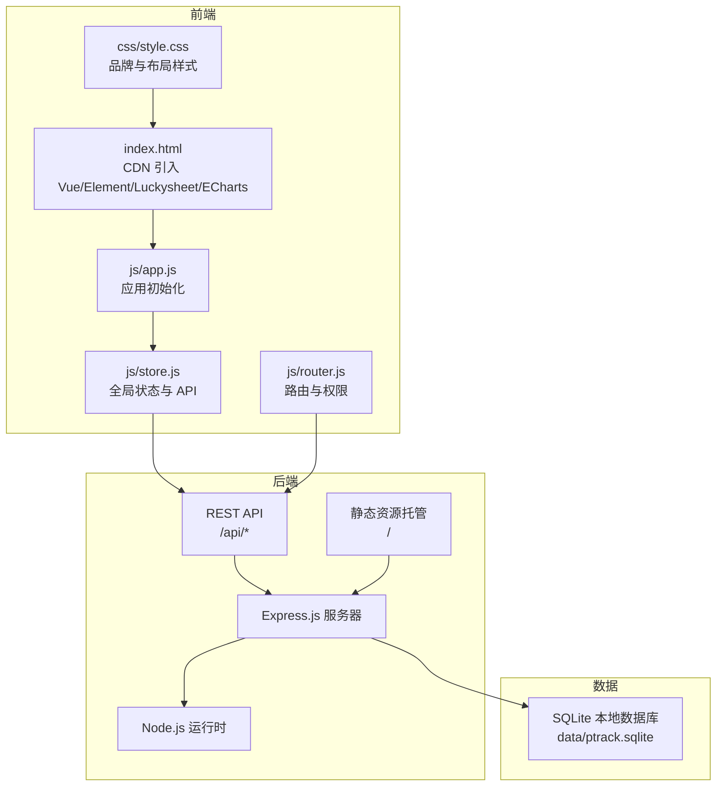
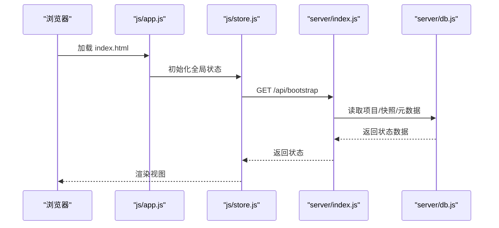
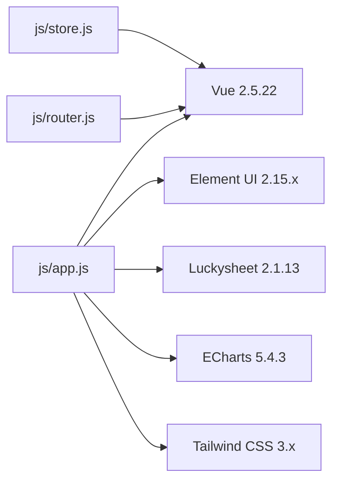
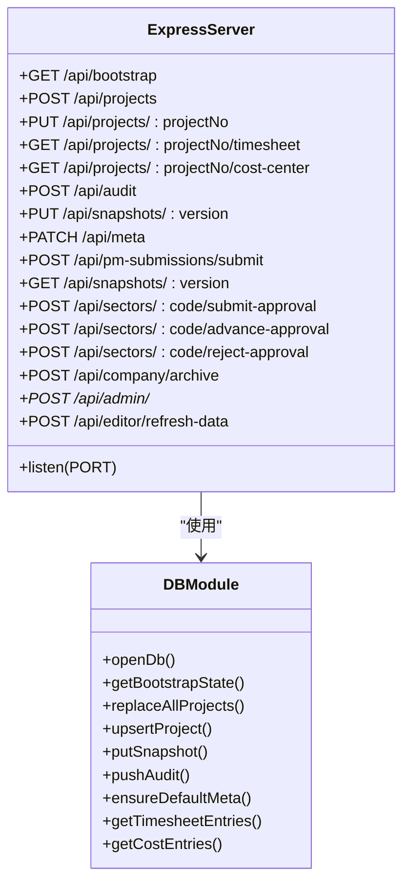
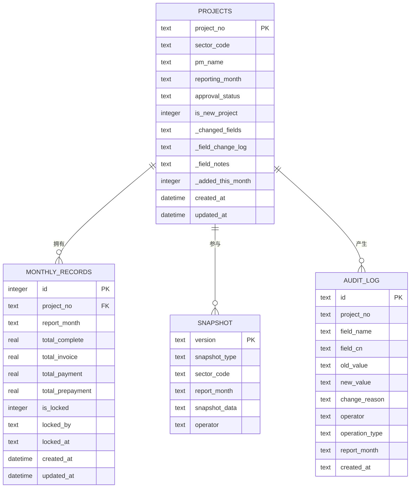
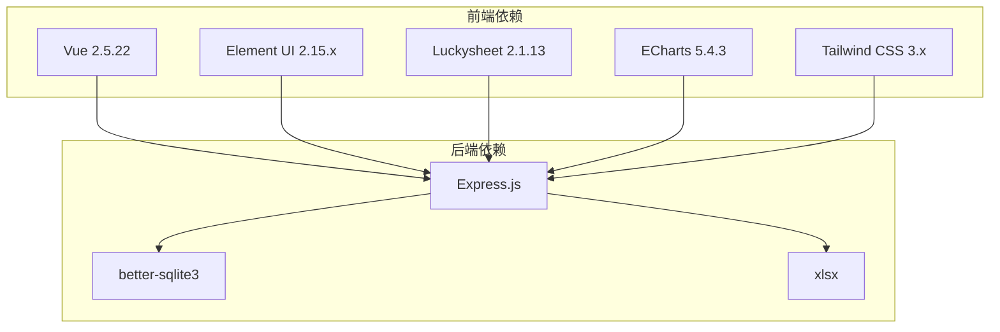

# 技术栈与开发规范

<cite>
**本文引用的文件**
- [package.json](file://package.json)
- [index.html](file://index.html)
- [server/index.js](file://server/index.js)
- [server/db.js](file://server/db.js)
- [js/app.js](file://js/app.js)
- [js/store.js](file://js/store.js)
- [js/router.js](file://js/router.js)
- [js/formatters.js](file://js/formatters.js)
- [js/formula-engine.js](file://js/formula-engine.js)
- [css/style.css](file://css/style.css)
- [database-schema.sql](file://database-schema.sql)
- [docs/需求文档/技术栈与开发规范.md](file://docs/需求文档/技术栈与开发规范.md)
- [config/fields/fields.json](file://config/fields/fields.json)
- [config/fields/fields-data.js](file://config/fields/fields-data.js)
- [test/lock-status.test.js](file://test/lock-status.test.js)
</cite>

## 目录
1. [简介](#简介)
2. [项目结构](#项目结构)
3. [核心组件](#核心组件)
4. [架构总览](#架构总览)
5. [详细组件分析](#详细组件分析)
6. [依赖关系分析](#依赖关系分析)
7. [性能考虑](#性能考虑)
8. [故障排查指南](#故障排查指南)
9. [结论](#结论)
10. [附录](#附录)

## 简介
本文件系统化阐述项目的技术选型与开发规范，覆盖前端技术栈（Vue.js 2、Element UI、Luckysheet、ECharts）、后端技术栈（Express.js、better-sqlite3、Node.js）、数据库设计（SQLite 本地数据库）、代码与流程规范（ES6、模块化、组件化、Git 工作流、测试与 CI）、性能优化与监控、以及部署与安全加固要求。目标是在保证功能完备的前提下，确保系统可维护、可扩展、可审计。

## 项目结构
项目采用“轻量级前端 + Node/Express 后端 + SQLite 本地数据库”的混合架构，前端以 HTML/CSS/JS 为主，通过 CDN 引入第三方库，后端提供 REST API 与静态资源托管，数据库以 SQLite 文件形式存储在本地 data 目录。

**图表来源**
- [index.html:1-110](file://index.html#L1-L110)
- [js/app.js:1-47](file://js/app.js#L1-L47)
- [js/store.js:1-602](file://js/store.js#L1-L602)
- [js/router.js:1-137](file://js/router.js#L1-L137)
- [server/index.js:1-775](file://server/index.js#L1-L775)
- [server/db.js:1-525](file://server/db.js#L1-L525)

**章节来源**
- [index.html:1-110](file://index.html#L1-L110)
- [server/index.js:1-775](file://server/index.js#L1-L775)
- [server/db.js:1-525](file://server/db.js#L1-L525)

## 核心组件
- 前端应用入口与初始化：负责加载 Bootstrap、Element UI、Luckysheet、ECharts、业务脚本，并初始化 Vue 应用与路由。
- 全局状态与 API：封装 fetch 请求、字段字典加载、权限过滤、项目与快照管理、审批流程状态同步。
- 路由与权限：基于 hash 模式的 SPA 路由，按角色限制访问路径。
- 后端 API：提供 /api/bootstrap、/api/projects、/api/snapshots、/api/meta、/api/audit、/api/admin/* 等端点，支撑前端状态与业务流程。
- 数据库：以 better-sqlite3 访问 SQLite，存储项目、快照、审计日志、元数据等。

**章节来源**
- [js/app.js:1-47](file://js/app.js#L1-L47)
- [js/store.js:1-602](file://js/store.js#L1-L602)
- [js/router.js:1-137](file://js/router.js#L1-L137)
- [server/index.js:1-775](file://server/index.js#L1-L775)
- [server/db.js:1-525](file://server/db.js#L1-L525)

## 架构总览
前端通过 Vue + Element UI 构建视图层，Luckysheet 提供在线表格能力，ECharts 展示可视化图表；后端以 Express 提供 REST API，使用 better-sqlite3 访问 SQLite，实现项目数据、快照、审计日志与系统配置的持久化。

**图表来源**
- [js/app.js:1-47](file://js/app.js#L1-L47)
- [js/store.js:268-275](file://js/store.js#L268-L275)
- [server/index.js:91-100](file://server/index.js#L91-L100)
- [server/db.js:194-266](file://server/db.js#L194-L266)

## 详细组件分析

### 前端技术栈与集成
- Vue.js 2.5.22：全局构建，通过 CDN 引入，提供响应式数据与组件化能力。
- Element UI 2.15.x：提供表格、表单、对话框、分页等企业级组件。
- Luckysheet 2.1.13：实现高保真 Excel 还原、在线表格编辑与单元格权限控制。
- ECharts 5.4.3：用于产值趋势、WIP 账龄、回款等图表展示。
- Tailwind CSS 3.x（Play CDN）：原子化 CSS，快速布局与样式覆盖。
- 业务脚本：formatters、formula-engine、store、router 等模块化组织。

**图表来源**
- [index.html:54-107](file://index.html#L54-L107)
- [js/app.js:1-47](file://js/app.js#L1-L47)
- [js/store.js:1-602](file://js/store.js#L1-L602)
- [js/router.js:1-137](file://js/router.js#L1-L137)

**章节来源**
- [index.html:1-110](file://index.html#L1-L110)
- [docs/需求文档/技术栈与开发规范.md:36-46](file://docs/需求文档/技术栈与开发规范.md#L36-L46)

### 后端技术栈与设计
- Express.js：提供 REST API 与静态资源托管，支持 JSON 请求体（最大 80MB）。
- better-sqlite3：高性能本地 SQLite 驱动，使用 WAL 模式提升并发写入稳定性。
- Node.js：运行时环境，配合 package.json 脚本启动服务与测试。

**图表来源**
- [server/index.js:88-775](file://server/index.js#L88-L775)
- [server/db.js:11-60](file://server/db.js#L11-L60)

**章节来源**
- [server/index.js:1-775](file://server/index.js#L1-L775)
- [server/db.js:1-525](file://server/db.js#L1-L525)
- [package.json:1-19](file://package.json#L1-L19)

### 数据库设计与索引
- 表结构覆盖项目主表、月度记录、年度基线、预收款核销、审计日志、快照、工时与成本等。
- 重要索引：项目表（执行单位、PM、报告月、审批状态）、月度记录（项目号、报告月）、基线（项目号、年份）、审计（项目号、报告月、操作人、时间）、工时/成本（项目号+月份）。
- 设计原则：以 SQLite 本地文件存储为核心，通过字段字典与快照机制保障数据一致性与可追溯性。

**图表来源**
- [database-schema.sql:12-87](file://database-schema.sql#L12-L87)
- [database-schema.sql:99-196](file://database-schema.sql#L99-L196)
- [database-schema.sql:205-223](file://database-schema.sql#L205-L223)
- [database-schema.sql:232-245](file://database-schema.sql#L232-L245)
- [database-schema.sql:254-268](file://database-schema.sql#L254-L268)
- [database-schema.sql:279-286](file://database-schema.sql#L279-L286)

**章节来源**
- [database-schema.sql:1-286](file://database-schema.sql#L1-L286)

### 代码规范与模块化
- ES6 语法与模块化：前端脚本以 IIFE 模块组织，使用 fetch API 与全局对象暴露接口；后端模块化拆分 db、sector-workflow、snapshot-service 等。
- 命名约定：变量与函数采用驼峰命名，常量与配置采用大写加下划线；文件按职责划分（store、router、formatters、formula-engine）。
- 文件组织：js/ 下按功能拆分，css/ 覆盖全局样式，config/fields/ 维护字段字典 JSON 与 JS 导出。

**章节来源**
- [js/store.js:1-602](file://js/store.js#L1-L602)
- [js/router.js:1-137](file://js/router.js#L1-L137)
- [js/formatters.js:1-167](file://js/formatters.js#L1-L167)
- [js/formula-engine.js:1-105](file://js/formula-engine.js#L1-L105)
- [docs/需求文档/技术栈与开发规范.md:10-27](file://docs/需求文档/技术栈与开发规范.md#L10-L27)

### 开发流程与测试策略
- Git 工作流：采用分支管理与合并策略，建议使用 feature/*、develop、release/*、hotfix/* 等分支模型；提交信息清晰描述变更范围与影响。
- 代码审查：PR 合并前进行同行评审，关注安全性、性能与可维护性。
- 测试策略：使用 Node.js 内置测试（node:test），示例包括锁定期计算测试；建议补充 API 端到端测试与数据库一致性校验。
- 持续集成：建议在 CI 中执行测试、静态检查与打包验证（如存在构建阶段）。

**章节来源**
- [test/lock-status.test.js:1-47](file://test/lock-status.test.js#L1-L47)
- [docs/需求文档/技术栈与开发规范.md:10-27](file://docs/需求文档/技术栈与开发规范.md#L10-L27)

### 性能优化与监控
- 前端资源：CDN 引入第三方库，减少本地体积；Tailwind CDN 生产环境建议替换为预编译版本或使用 PurgeCSS。
- 后端缓存：当前未见显式缓存层，可通过数据库 WAL 模式与索引优化提升写入与查询性能。
- 数据库优化：合理使用索引（项目号、报告月、状态等）；避免全表扫描；定期维护快照与审计日志容量。
- 监控指标：建议增加请求耗时、错误率、数据库连接数、磁盘空间与快照数量等指标；结合审计日志进行变更追踪。

**章节来源**
- [server/index.js:88-90](file://server/index.js#L88-L90)
- [server/db.js:14-14](file://server/db.js#L14-L14)
- [database-schema.sql:89-94](file://database-schema.sql#L89-L94)

### 部署规范与安全加固
- 环境配置：通过环境变量 PTACK_PORT 控制监听端口；静态资源托管于项目根目录。
- 依赖管理：package.json 定义依赖与脚本；生产环境建议固定版本并启用安全扫描。
- 版本控制：字段字典通过 fields.json 与 fields-data.js 同步，支持系统管理员在线编辑。
- 安全加固：限制请求体大小（当前 80MB）；对敏感端点（/api/admin/*）进行鉴权与审计；定期备份 SQLite 文件；最小权限原则管理文件系统。

**章节来源**
- [server/index.js:22-22](file://server/index.js#L22-L22)
- [server/index.js:88-90](file://server/index.js#L88-L90)
- [config/fields/fields.json:1-10](file://config/fields/fields.json#L1-L10)
- [config/fields/fields-data.js:1-10](file://config/fields/fields-data.js#L1-L10)

## 依赖关系分析
前端依赖通过 CDN 注入，后端依赖通过 npm 管理，数据库通过 better-sqlite3 访问本地 SQLite 文件。API 层负责协调前端状态与数据库持久化。

**图表来源**
- [index.html:54-107](file://index.html#L54-L107)
- [package.json:13-17](file://package.json#L13-L17)
- [server/index.js:5-19](file://server/index.js#L5-L19)

**章节来源**
- [package.json:1-19](file://package.json#L1-L19)
- [server/index.js:1-24](file://server/index.js#L1-L24)

## 性能考虑
- 前端：Luckysheet 在大数据集下的渲染与交互性能需关注；建议分页/虚拟滚动与按需加载。
- 后端：数据库事务批量写入（如 replaceAllProjects）与索引命中率直接影响吞吐；API 响应体大小控制（当前 80MB）避免内存压力。
- 数据库：WAL 模式提升写入并发；定期清理审计日志与快照，避免无限增长。

**章节来源**
- [server/db.js:268-278](file://server/db.js#L268-L278)
- [server/index.js:88-90](file://server/index.js#L88-L90)

## 故障排查指南
- 启动失败：检查端口占用与环境变量 PTACK_PORT；确认 data/ 目录可写。
- 字段字典加载失败：确认 /api/fields 与 /config/fields/fields.json/fields-data.js 可用；重启服务后重试。
- 锁定期异常：使用测试用例模拟日期，验证 _calcLockStatus 逻辑；检查 periodConfig 与 lockDay/unlockDay。
- 审计日志过多：清理历史审计记录或限制前端展示数量；关注数据库容量。

**章节来源**
- [server/index.js:22-22](file://server/index.js#L22-L22)
- [js/store.js:186-235](file://js/store.js#L186-L235)
- [test/lock-status.test.js:1-47](file://test/lock-status.test.js#L1-L47)

## 结论
本项目以“轻量级前端 + Node/Express + SQLite”为核心，通过 CDN 与模块化组织实现快速迭代与低运维成本。技术选型兼顾易用性与可扩展性，开发规范强调可维护与可审计。建议在生产环境中完善缓存与监控、强化安全与备份策略，并持续优化前端渲染与数据库索引以提升整体性能。

## 附录
- 字段字典：fields.json 与 fields-data.js 提供字段元数据与前端可用的 FIELD_DICTIONARY。
- 样式覆盖：style.css 提供品牌色、布局与组件样式覆盖，便于统一视觉规范。

**章节来源**
- [config/fields/fields.json:1-10](file://config/fields/fields.json#L1-L10)
- [config/fields/fields-data.js:1-10](file://config/fields/fields-data.js#L1-L10)
- [css/style.css:1-50](file://css/style.css#L1-L50)