# 需求文档

<cite>
**本文引用的文件**
- [需求文档_产品版.md](file://docs/需求文档/需求文档_产品版.md)
- [需求文档_开发版.md](file://docs/需求文档/需求文档_开发版.md)
- [新结构大纲.md](file://docs/需求文档/新结构大纲.md)
- [技术栈与开发规范.md](file://docs/需求文档/技术栈与开发规范.md)
- [多角色与报告线列表需求文档.md](file://docs/需求文档/多角色与报告线列表需求文档.md)
- [多角色与报告线列表设计方案.html](file://docs/需求文档/多角色与报告线列表设计方案.html)
- [DASHBOARD.md](file://docs/设计文档/DASHBOARD.md)
- [LIST_FORM.md](file://docs/设计文档/LIST_FORM.md)
- [EMAIL_REMINDER.md](file://docs/设计文档/EMAIL_REMINDER.md)
- [database-schema.sql](file://database-schema.sql)
- [package.json](file://package.json)
- [fields.json](file://config/fields/fields.json)
- [fields-data.js](file://config/fields/fields-data.js)
- [server/index.js](file://server/index.js)
- [js/store.js](file://js/store.js)
- [js/views/AdminSettings.js](file://js/views/AdminSettings.js)
- [server/db.js](file://server/db.js)
- [js/stock-validation.js](file://js/stock-validation.js)
- [js/components/AlertsDrawer.js](file://js/components/AlertsDrawer.js)
- [server/alert-service.js](file://server/alert-service.js)
- [js/views/ProjectEditor.js](file://js/views/ProjectEditor.js)
- [js/views/Approval.js](file://js/views/Approval.js)
- [js/router.js](file://js/router.js)
- [js/components/AppLayout.js](file://js/components/AppLayout.js)
- [js/formatters.js](file://js/formatters.js)
- [js/xlsx-importer.js](file://js/xlsx-importer.js)
- [server/timesheet-import.js](file://server/timesheet-import.js)
- [AGENTS.md](file://AGENTS.md)
</cite>

## 更新摘要
**已进行的更改**
- 新增多角色协作框架：建立完整的报告线管理体系，替代传统审批流程
- 更新审批流程设计：从独立审批页整合到报告线详情内，支持Git-like数据流
- 新增报告线列表设计：以板块×月度周期为单位的工作项管理
- 更新路由系统：新增`/#/report-lines`和`/#/report-lines/:id`路由
- 新增权限合并规则：多角色用户权限取并集，支持审批流自动跳过
- 新增Git-like数据流模型：将数据流转类比为Git版本管理

## 目录
1. [简介](#简介)
2. [项目结构](#项目结构)
3. [核心组件](#核心组件)
4. [架构总览](#架构总览)
5. [详细组件分析](#详细组件分析)
6. [依赖关系分析](#依赖关系分析)
7. [性能考量](#性能考量)
8. [故障排查指南](#故障排查指南)
9. [结论](#结论)
10. [附录](#附录)

## 简介
本需求文档集合围绕"项目追踪表线上化"系统，系统性梳理了需求规格、功能分析、技术栈与开发规范、变更管理与验收、用户故事与用例、需求验证与原型、需求文档模板与版本管理、沟通机制与风险控制等内容。文档以"新结构大纲"为组织框架，结合"产品版/开发版"需求文档、设计规范与数据库模型，形成从高层到落地的完整需求说明。

**更新** 新增多角色协作框架和报告线管理系统的业务设计基础，建立Git-like数据流模型，替代传统审批流程。

## 项目结构
项目采用"文档驱动 + 轻量化前端 + SQLite 后端"的组织方式：
- 文档层：需求文档（产品版/开发版/新结构大纲/多角色协作）、设计文档（看板/列表/EMAIL_REMINDER）、字段字典（JSON/JS）
- 前端层：Vue 2 + Element UI + Luckysheet（在线类 Excel 表格）
- 后端层：Node.js + Express + SQLite，提供 REST API、平台同步、快照与公式引擎
- 数据层：SQLite 数据库，包含项目主表、月度记录、基线、预收款、审计日志、快照、权限与配置等

```mermaid
graph TB
subgraph 文档层
REQ_P["产品版需求<br/>需求文档_产品版.md"]
REQ_D["开发版需求<br/>需求文档_开发版.md"]
OUTLINE["新结构大纲<br/>新结构大纲.md"]
MULTI["多角色协作<br/>多角色与报告线列表需求文档.md"]
DESIGN["设计方案<br/>多角色与报告线列表设计方案.html"]
REQ_P --> MULTI
REQ_D --> MULTI
OUTLINE --> REQ_P
DESIGN --> MULTI
DASH["看板规范<br/>DASHBOARD.md"]
LISTF["列表/表单规范<br/>LIST_FORM.md"]
EMAIL["邮件提醒设计<br/>EMAIL_REMINDER.md"]
FIELDS["字段字典<br/>fields.json / fields-data.js"]
END
subgraph 前端
VUE["Vue 2"]
ELEM["Element UI"]
LUCKY["Luckysheet"]
END
subgraph 后端
NODE["Node.js + Express"]
SQLITE["SQLite"]
SYNC["平台同步"]
SNAP["快照服务"]
FORM["公式引擎"]
WF["板块工作流"]
MAIL["邮件提醒服务"]
END
REQ_P --> VUE
REQ_D --> VUE
OUTLINE --> REQ_P
MULTI --> VUE
DESIGN --> VUE
DASH --> VUE
LISTF --> VUE
EMAIL --> VUE
FIELDS --> VUE
VUE --> NODE
LUCKY --> NODE
ELEM --> NODE
NODE --> SQLITE
SYNC --> SQLITE
SNAP --> SQLITE
FORM --> SQLITE
WF --> SQLITE
MAIL --> SQLITE
```

**图表来源**
- [需求文档_产品版.md:72-131](file://docs/需求文档/需求文档_产品版.md#L72-L131)
- [需求文档_开发版.md:72-131](file://docs/需求文档/需求文档_开发版.md#L72-L131)
- [技术栈与开发规范.md:36-46](file://docs/需求文档/技术栈与开发规范.md#L36-L46)
- [多角色与报告线列表需求文档.md:1-10](file://docs/需求文档/多角色与报告线列表需求文档.md#L1-L10)
- [多角色与报告线列表设计方案.html:350-360](file://docs/需求文档/多角色与报告线列表设计方案.html#L350-L360)

**章节来源**
- [新结构大纲.md:7-16](file://docs/需求文档/新结构大纲.md#L7-L16)
- [需求文档_产品版.md:93-131](file://docs/需求文档/需求文档_产品版.md#L93-L131)
- [需求文档_开发版.md:72-131](file://docs/需求文档/需求文档_开发版.md#L72-L131)

## 核心组件
- 角色与权限：6 角色（系统管理员、经营管理、板块管理员、项目经理、板块总监、项目群群主），页面与字段级权限矩阵，路由与默认首页
- 数据同步与工程平台对接：平台同步（手动/自动）、引用列覆盖、A 列新/旧项目、合同额区 N/O/P
- 填报交互：Luckysheet 表格布局、工具栏、保存/导出/导入、Drawer 详情、历史版本查看、侧边栏折叠
- 填报周期与锁定机制：月度时间窗、锁定状态计算、列级只读、提交审批后的填报锁定
- 变更追踪与高亮：审计日志、项目级变更元数据、变更高亮与批注、视图过滤、存量预警 R/S、保留期限
- 审批流程与版本快照：版本快照体系（I/D/J）、PM 提交与板块汇总、审批决策界面、系统管理员审批页与底栏
- **新增** 报告线管理：以板块×月度周期为单位的工作项管理，支持Git-like数据流
- **新增** 多角色协作：权限向上合并，审批流自动跳过，统一入口设计
- 系统管理：表头配置、开发测试重置、时间窗配置（动态可配置）
- 业务规则：数据源定义、项目准入与提前申报产值、产值申报规则、财务与 WIP 规则、动态年份与历史归档
- 邮件提醒功能：自动邮件提醒（填报提醒日、锁定倒计时邮件）、管理员配置、审计记录
- 库存验证流程：手工完成额实时拦截 S<0、系统同步自动对冲、提交阻断校验
- 手动永久忽略预警：系统管理员可永久忽略确认无需处理的预警

**更新** 新增多角色协作框架和报告线管理系统的业务设计基础，建立Git-like数据流模型。

**章节来源**
- [需求文档_产品版.md:133-222](file://docs/需求文档/需求文档_产品版.md#L133-L222)
- [需求文档_开发版.md:150-272](file://docs/需求文档/需求文档_开发版.md#L150-L272)
- [新结构大纲.md:17-106](file://docs/需求文档/新结构大纲.md#L17-L106)
- [多角色与报告线列表需求文档.md:30-97](file://docs/需求文档/多角色与报告线列表需求文档.md#L30-L97)
- [多角色与报告线列表设计方案.html:407-501](file://docs/需求文档/多角色与报告线列表设计方案.html#L407-L501)

## 架构总览
系统采用"前端（Vue + Luckysheet）+ 后端（Node.js + Express）+ SQLite 数据库"的三层架构，外部系统包括 CRB/财务/工时/成本中心平台，通过平台同步服务接入。

```mermaid
graph TB
subgraph 外部系统
CRB["CRB 合同系统"]
FIN["财务系统"]
TS["工时系统"]
COST["成本中心"]
END
subgraph 前端
LUCKY["Luckysheet 表格"]
DRAWER["项目详情 Drawer"]
APPROVAL["审批流程页"]
ADMIN_UI["管理设置/表头配置"]
EMAIL_UI["邮件提醒配置"]
ALERTS["预警管理"]
REPORT_LINES["报告线管理"]
END
subgraph 后端
API["REST API"]
SYNC["平台同步服务"]
SNAP["快照服务"]
FORM["公式引擎"]
SECTOR["板块工作流"]
MAIL["邮件提醒服务"]
STOCK["库存验证引擎"]
DISMISS["预警忽略服务"]
END
DB[("SQLite 数据库")]
CRB --> SYNC
FIN --> SYNC
TS --> API
COST --> API
LUCKY --> API
DRAWER --> API
APPROVAL --> API
ADMIN_UI --> API
EMAIL_UI --> MAIL
ALERTS --> DISMISS
REPORT_LINES --> API
API --> DB
SYNC --> DB
SNAP --> DB
FORM --> DB
SECTOR --> DB
MAIL --> DB
STOCK --> DB
DISMISS --> DB
```

**图表来源**
- [需求文档_产品版.md:93-131](file://docs/需求文档/需求文档_产品版.md#L93-L131)
- [需求文档_开发版.md:72-131](file://docs/需求文档/需求文档_开发版.md#L72-L131)
- [多角色与报告线列表需求文档.md:291-323](file://docs/需求文档/多角色与报告线列表需求文档.md#L291-L323)

## 详细组件分析

### 角色与权限
- 角色定义与页面权限：系统管理员（唯一可访问审计日志、表头配置、管理设置）、经营管理（只读）、板块管理员（可编辑、可刷新数据）、项目经理（仅可编辑本人项目）、板块总监/群主（只读审批）
- 字段级权限矩阵：工程平台引用列默认只读、系统管理员可覆盖显示值；初始化导入基准列仅系统管理员可编辑；月度完成额、未来月开票/回款预测受报告月时间窗约束；非月度字段（如实施进展、WIP 分析）不受时间窗限制
- 页面权限与默认路由：不同角色可见页面与默认首页不同，路由守卫与侧栏可见性控制严格

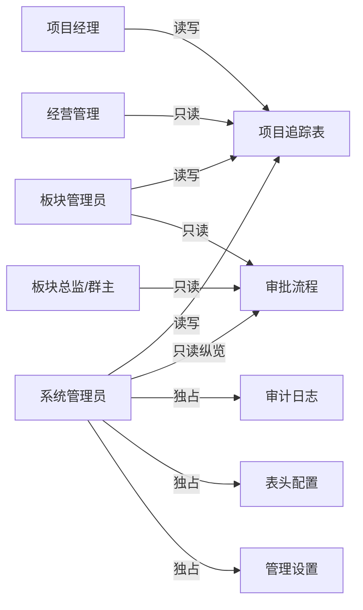

**图表来源**
- [需求文档_产品版.md:183-222](file://docs/需求文档/需求文档_产品版.md#L183-L222)
- [需求文档_开发版.md:202-272](file://docs/需求文档/需求文档_开发版.md#L202-L272)

**章节来源**
- [需求文档_产品版.md:133-182](file://docs/需求文档/需求文档_产品版.md#L133-L182)
- [需求文档_开发版.md:150-201](file://docs/需求文档/需求文档_开发版.md#L150-L201)

### 多角色协作框架
- **权限向上合并**：一个用户拥有多个角色时，取权限并集，高权限覆盖低权限
- **审批流自动跳过**：当提交人本身是审批链上的某个节点时，该节点自动跳过
- **统一入口设计**：所有角色登录后统一跳转到报告线管理，列表根据权限自动过滤显示
- **数据范围取并集**：多角色用户看到的报告线是所有角色可见范围的并集

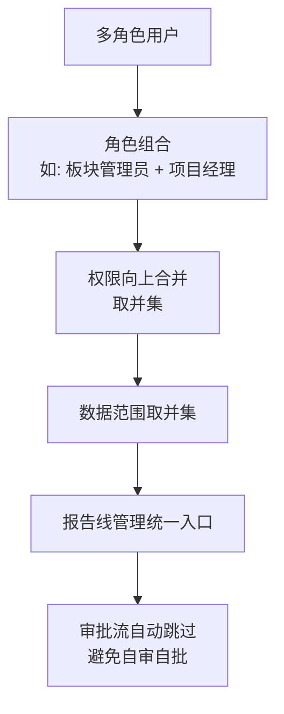

**图表来源**
- [多角色与报告线列表需求文档.md:32-44](file://docs/需求文档/多角色与报告线列表需求文档.md#L32-L44)
- [多角色与报告线列表需求文档.md:345-376](file://docs/需求文档/多角色与报告线列表需求文档.md#L345-L376)

**章节来源**
- [多角色与报告线列表需求文档.md:30-77](file://docs/需求文档/多角色与报告线列表需求文档.md#L30-L77)
- [多角色与报告线列表需求文档.md:345-376](file://docs/需求文档/多角色与报告线列表需求文档.md#L345-L376)

### 报告线管理设计
- **概念定义**：报告线（Report Line）是以「板块 × 月度周期」为单位的工作项，是填报、审批、归档的最小管理粒度
- **列表视图**：所有角色进入系统后，首先看到的是报告线列表，根据角色不同，可见范围不同
- **详情页结构**：包含操作区、项目数据表、审批记录，根据用户角色和报告线状态动态展示
- **Git-like数据流**：将数据流转类比为Git版本管理，每层只关心"收到了哪些变更，是否接受"

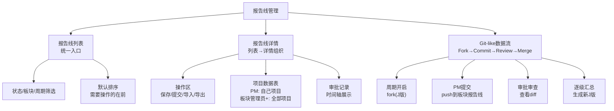

**图表来源**
- [多角色与报告线列表需求文档.md:100-162](file://docs/需求文档/多角色与报告线列表需求文档.md#L100-L162)
- [多角色与报告线列表需求文档.md:165-214](file://docs/需求文档/多角色与报告线列表需求文档.md#L165-L214)
- [多角色与报告线列表需求文档.md:217-277](file://docs/需求文档/多角色与报告线列表需求文档.md#L217-L277)

**章节来源**
- [多角色与报告线列表需求文档.md:100-214](file://docs/需求文档/多角色与报告线列表需求文档.md#L100-L214)
- [多角色与报告线列表需求文档.md:217-288](file://docs/需求文档/多角色与报告线列表需求文档.md#L217-L288)

### Git-like数据流模型
- **main分支**：J版（归档版），上一周期最终确认的权威数据
- **fork/branch**：开启新填报周期，各板块从J版中fork出本板块的数据副本
- **working copy**：PM工作区，PM在自己的项目范围内编辑
- **commit + push**：PM提交，PM将变更提交到板块报告线
- **code review**：板块管理员审批，审查变更，可退回（reject）或通过（approve）
- **merge upstream**：逐级汇总，板块→群组→全公司，层层合并
- **tag/release**：新J版归档，最终确认后生成新的J版快照

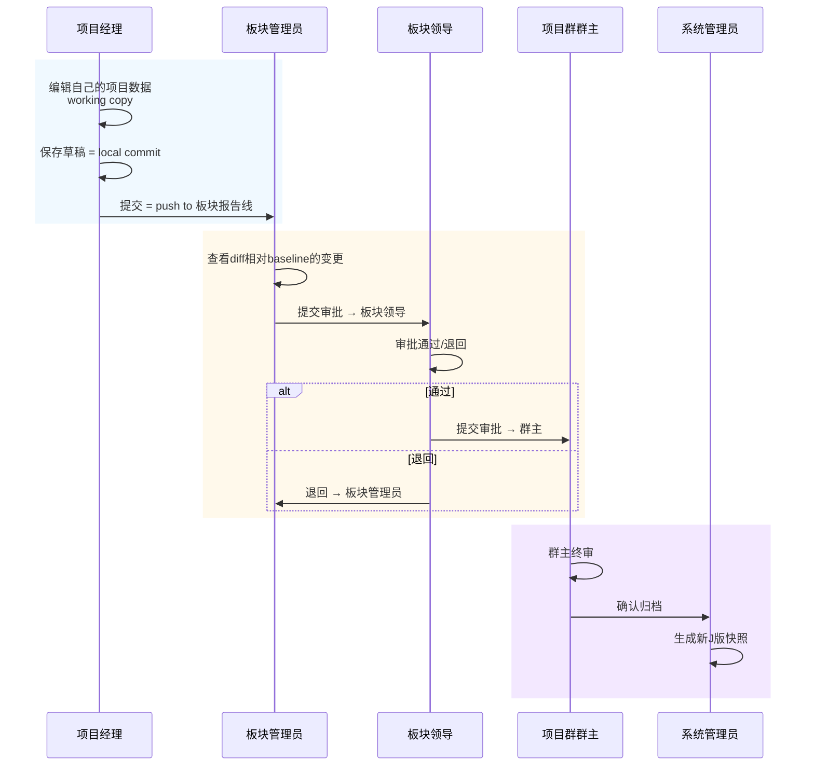

**图表来源**
- [多角色与报告线列表需求文档.md:217-277](file://docs/需求文档/多角色与报告线列表需求文档.md#L217-L277)
- [多角色与报告线列表需求文档.md:279-288](file://docs/需求文档/多角色与报告线列表需求文档.md#L279-L288)

**章节来源**
- [多角色与报告线列表需求文档.md:78-97](file://docs/需求文档/多角色与报告线列表需求文档.md#L78-L97)
- [多角色与报告线列表需求文档.md:217-288](file://docs/需求文档/多角色与报告线列表需求文档.md#L217-L288)

### 路由系统与导航设计
- **新增路由**：`/#/report-lines`（报告线列表）、`/#/report-lines/:id`（报告线详情）
- **路由调整**：`/#/editor`改为只读查看；`/#/approval`被报告线管理替代
- **登录跳转**：所有角色统一跳转到报告线管理，不再按角色跳不同首页
- **侧栏导航**：「审批流程」替换为「报告线管理」；「项目追踪表」标注为只读查看

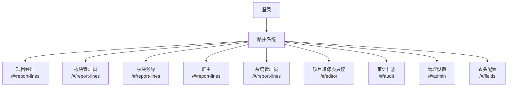

**图表来源**
- [js/router.js:7-10](file://js/router.js#L7-L10)
- [js/router.js:12-69](file://js/router.js#L12-L69)
- [多角色与报告线列表需求文档.md:291-323](file://docs/需求文档/多角色与报告线列表需求文档.md#L291-L323)

**章节来源**
- [js/router.js:7-69](file://js/router.js#L7-L69)
- [js/components/AppLayout.js:18-24](file://js/components/AppLayout.js#L18-L24)
- [多角色与报告线列表需求文档.md:291-323](file://docs/需求文档/多角色与报告线列表需求文档.md#L291-L323)

### 项目数据范围判定规则
- **按板块查看/管理**：板块管理员、板块总监、板块范围经营管理等视角，按数据源中的板块号/项目执行单位编码决定项目归属。即使项目号暂未在工程平台注册，只要数据源中标明对应板块，也应归入该板块统一管理。
- **按项目经理查看/管理**：项目经理视角按平台中"项目号对应的项目经理用户"判断，不直接取追踪表中的项目经理姓名列。系统应先用项目号查询平台绑定的项目经理，再与当前登录用户匹配，避免同名、改名或姓名文本不一致造成错配。
- **平台未登记项目**：平台上没有的项目不由项目经理个人管理；这类项目按数据源板块号归入对应板块，由板块管理员统一维护、汇总和提交审批。

**更新** 明确项目数据范围判定规则：按板块/项目经理查看的数据范围判定。

**章节来源**
- [需求文档_产品版.md:174-178](file://docs/需求文档/需求文档_产品版.md#L174-L178)

### J 版归档程序
- **归档时机**：系统管理员仅在锁定期可提交归档，开放期按钮禁用
- **版本切换**：版本切换下拉框仅系统管理员可见且仅列出 J 版
- **历史下载**：新增历史 J 版 Excel 下载功能
- **流程状态**：提交归档生成 J 版并重置流程态，锁定状态不变

**更新** J 版归档仅在锁定期可用；版本切换下拉框仅系统管理员可见且仅列出 J 版；新增历史 J 版 Excel 下载。

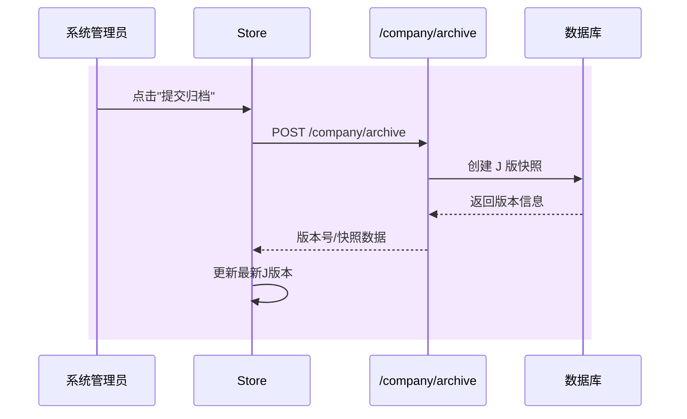

**图表来源**
- [server/index.js:437-469](file://server/index.js#L437-L469)
- [js/store.js:404-423](file://js/store.js#L404-L423)

**章节来源**
- [需求文档_产品版.md:859-871](file://docs/需求文档/需求文档_产品版.md#L859-L871)
- [server/index.js:437-469](file://server/index.js#L437-L469)
- [js/store.js:404-423](file://js/store.js#L404-L423)

### 库存验证流程
- **手工完成额实时拦截**：项目经理、板块管理员、系统管理员编辑月度完成额时，若保存后会导致存量合同额（S）< 0，系统立即拒绝该输入并提示调减完成额或先完成 CRB 合同变更
- **系统同步自动对冲**：仅当系统同步/系统管理员覆盖合同额相关引用值导致 S < 0 时，系统自动调减报告月月度完成额，并追加"系统自动对冲"变更批注；页面刷新/构表时不静默改写用户已填值
- **提交阻断校验**：项目经理"提交"、板块管理员"提交审批"前校验范围内全部项目 S ≥ 0；不满足则弹出汇总错误
- **错误提示**："有 N 个项目存量合同额为负…请调减完成额或完成 CRB 合同变更后再提交。"

**更新** 调整存量合同额校验：手工完成额实时拦截 S<0；自动对冲仅用于系统同步合同额变更。

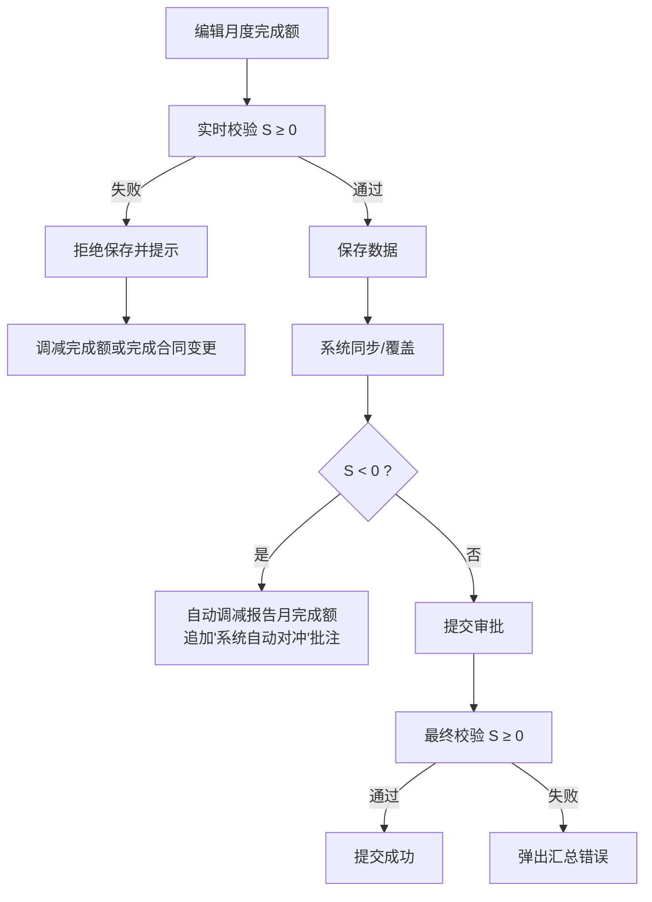

**图表来源**
- [js/stock-validation.js:108-154](file://js/stock-validation.js#L108-L154)
- [需求文档_产品版.md:1007-1012](file://docs/需求文档/需求文档_产品版.md#L1007-L1012)

**章节来源**
- [js/stock-validation.js:1-186](file://js/stock-validation.js#L1-L186)
- [需求文档_产品版.md:1007-1012](file://docs/需求文档/需求文档_产品版.md#L1007-L1012)

### 手动永久忽略预警
- **操作入口**：每张活跃预警卡片右下角的"忽略"按钮
- **确认机制**：点击后弹出确认对话框，提示操作不可撤销
- **效果**：该项目的该类型预警永久不再出现，跨月生效；即使条件在未来月份仍满足，也不会重新激活
- **状态管理**：被忽略的预警以 `dismissed` 状态存储，卡片显示为半透明 + 删除线样式，footer 标注"已忽略（永久）"
- **与自动消除区别**：自动消除（`resolved`）是系统检测到条件不满足后标记，条件重新出现会自动激活；手动忽略（`dismissed`）是管理员主观决定，永不复现

**更新** 新增手动永久忽略预警功能：系统管理员可对确认无需处理的预警执行永久忽略操作。

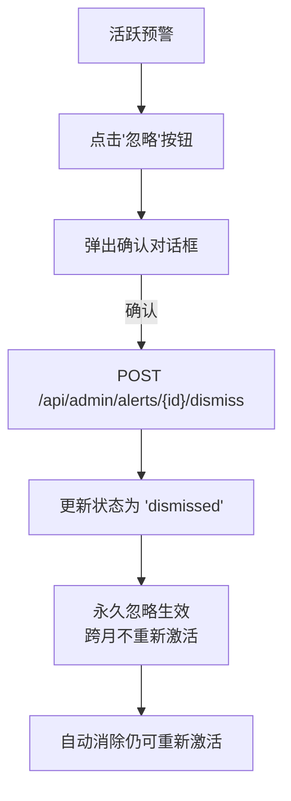

**图表来源**
- [js/components/AlertsDrawer.js:125-147](file://js/components/AlertsDrawer.js#L125-L147)
- [server/alert-service.js:309-333](file://server/alert-service.js#L309-L333)

**章节来源**
- [需求文档_产品版.md:1293-1301](file://docs/需求文档/需求文档_产品版.md#L1293-L1301)
- [js/components/AlertsDrawer.js:125-147](file://js/components/AlertsDrawer.js#L125-L147)
- [server/alert-service.js:309-333](file://server/alert-service.js#L309-L333)

### 数据同步与工程平台对接
- 数据同步总览：滞后可接受；手动/自动刷新；合并规则：仅更新引用快照，不覆盖管理员已覆盖的显示值；平台新增项目号 INSERT
- 引用列机制：显示值/引用值/_system_ref/_system_override；A 列新/旧项目系统取值与年末 rollover；合同额区 N/O/P 合成
- 锁定期管理：锁定期间暂停自动同步，手动同步仍仅系统管理员可用

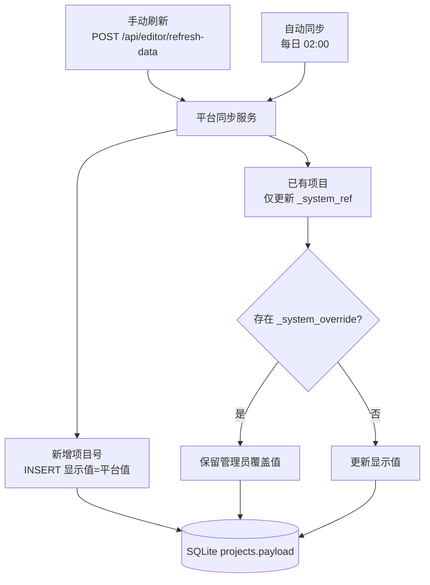

**图表来源**
- [需求文档_开发版.md:275-321](file://docs/需求文档/需求文档_开发版.md#L275-L321)

**章节来源**
- [需求文档_开发版.md:275-386](file://docs/需求文档/需求文档_开发版.md#L275-L386)

### 填报交互
- Luckysheet 表格布局：列号与字段字典对齐、行布局（小计/合计/标题/数据行）、冻结与表头、列宽与自定义宽度、金额列格式、公式链与布局自适应、日期字段与序列号处理
- 工具栏与视图：业务工具栏（版本下拉、刷新数据、导出、清零、上传导入、保存、提交/归档/审批）、表格工具栏（视图筛选、紧凑列勾选）、图例说明条
- 保存与导出：自动保存与手动保存；导出 Excel 保留格式与公式结果
- 上传导入：按项目号合并，仅覆盖当前角色可编辑字段；PM 仅导入本人项目；锁定期内仅系统管理员可导入
- Drawer 详情：项目预警区、跟踪信息填报、参考信息、工时与成本辅助区、完成额填报参考、WIP 折叠规则
- 历史版本查看：版本下拉选择 I/D/J 快照只读预览
- 侧边栏折叠：状态记忆于 localStorage

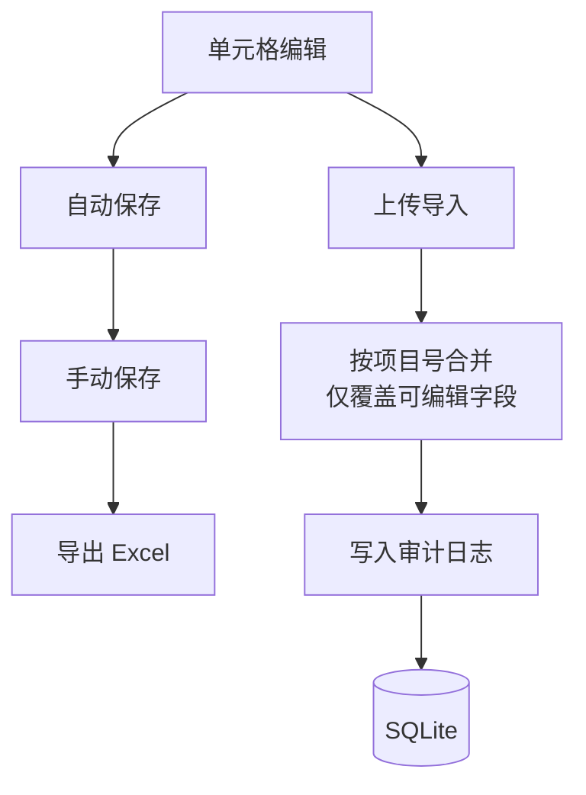

**图表来源**
- [需求文档_开发版.md:388-790](file://docs/需求文档/需求文档_开发版.md#L388-L790)

**章节来源**
- [需求文档_开发版.md:388-790](file://docs/需求文档/需求文档_开发版.md#L388-L790)

### 填报周期与锁定机制
- 月度时间窗：财务核查提醒期（1-3 日）、填报提醒日（默认 19 日）、月度锁定日（默认 25 日）、次月解禁日（默认 9 日）
- 锁定状态计算：系统自动动作（当日 ≥ 锁定日自动锁定；自动解锁默认关闭）与管理员手动动作（立即锁定/解除锁定）
- 列级只读动态时间窗：月度完成额、月度开票/回款按报告月动态判断可编辑性
- 提交审批后的填报锁定：板块管理员提交审批后板块锁定，PM 锁定不可再次提交
- 时间窗配置：动态可配置的时间节点（提醒日/锁定日/解禁日）和自动解锁开关

**更新** 更新了时间窗配置的管理设置说明，明确了动态调整的配置方式。

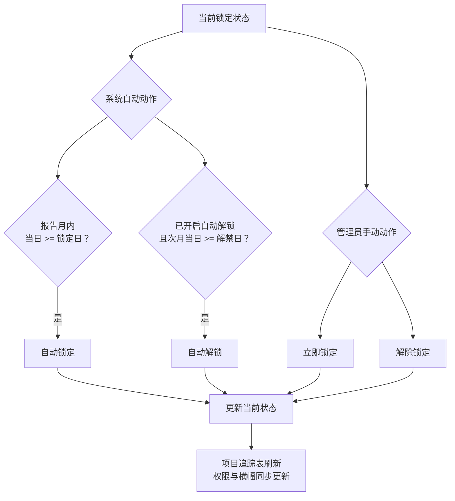

**图表来源**
- [需求文档_开发版.md:792-889](file://docs/需求文档/需求文档_开发版.md#L792-L889)

**章节来源**
- [需求文档_开发版.md:792-889](file://docs/需求文档/需求文档_开发版.md#L792-L889)

### 变更追踪与高亮
- 审计日志：全量记录数据增删改，满足财务与运营审计要求
- 项目级变更元数据：_changed_fields、_field_change_log
- 变更高亮机制：新增项目整行高亮、可编辑列底色、单元格底色叠色优先级、变更单元格高亮、联动计算高亮
- 变更批注：变更单元格批注与变更元数据
- 视图过滤控制：👁️ 按"全部/新增/有变更/预警"筛选
- 存量指标预警 R/S：R/S < 0 预警；保留期限：变更记录保留策略

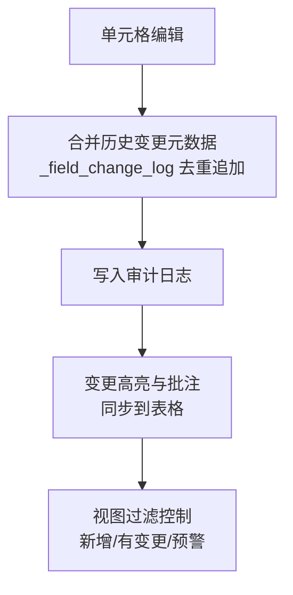

**图表来源**
- [需求文档_开发版.md:890-1000](file://docs/需求文档/需求文档_开发版.md#L890-L1000)

**章节来源**
- [需求文档_开发版.md:890-1000](file://docs/需求文档/需求文档_开发版.md#L890-L1000)

### 审批流程与版本快照
- 版本快照体系：I 版（导入初始化）、D 版（板块提交审批）、J 版（公司归档）
- PM 提交与板块汇总：PM 提交（每月一次，PM 锁定）、板块管理员汇总（生成 D 版，板块锁定）
- 审批决策界面：板块总监/群主只读审批，通过/驳回
- 系统管理员审批页与底栏：查看十二板块卡片，无板块级按钮
- J 版归档：提交归档生成 J 版并重置流程态，锁定状态不变

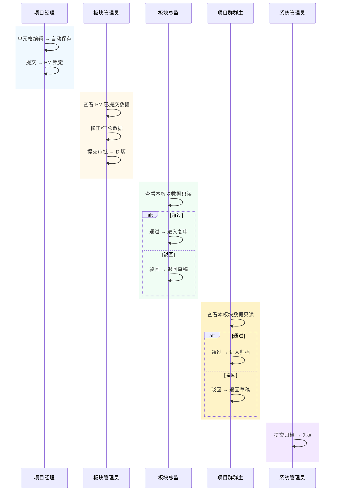

**图表来源**
- [需求文档_产品版.md:620-674](file://docs/需求文档/需求文档_产品版.md#L620-L674)

**章节来源**
- [需求文档_产品版.md:588-710](file://docs/需求文档/需求文档_产品版.md#L588-L710)

### 系统管理
- 表头配置：系统管理员维护表头中文名
- 开发测试：环境重置（管理设置）
- 时间窗配置：动态可配置的时间节点（提醒日/锁定日/解禁日）和自动解锁开关
- 系统管理员可编辑列范围：系统同步列与手工填报列

**更新** 明确系统管理员可编辑列范围：系统同步列与手工填报列。

**章节来源**
- [需求文档_产品版.md:94-100](file://docs/需求文档/需求文档_产品版.md#L94-L100)
- [需求文档_开发版.md:100-149](file://docs/需求文档/需求文档_开发版.md#L100-L149)

### 业务规则
- 数据源定义：CRB/财务/工时/成本中心
- 项目准入与提前申报产值：未签署项目需通过提前申报产值审批流程
- 产值申报规则：月度完成额、未来月预测、报告当期完成、本年度完成
- 财务与 WIP 规则：WIP（含税/不含税）、应收账款（含预收）、期初应收账款、WIP（催开票）、WIP 分析与措施
- 动态年份与历史归档：跨年翻转、历史快照保留

**更新** 新增初始化导入与平台数据合并规则。

**章节来源**
- [需求文档_产品版.md:98-105](file://docs/需求文档/需求文档_产品版.md#L98-L105)
- [需求文档_开发版.md:100-149](file://docs/需求文档/需求文档_开发版.md#L100-L149)

### 邮件提醒功能
- 填报提醒日：默认 19 日，系统自动发送提醒邮件给各板块管理员
- 锁定倒计时提醒：默认锁定日前 3 天，系统自动发送倒计时邮件给未完成审批的板块对应角色
- 邮件内容：包含板块维度统计（项目数、PM 提交率、未提交 PM 名单）和预警摘要
- 管理员配置：通过管理设置界面配置提醒日、锁定日、解禁日等时间参数
- 审计记录：邮件发送操作写入审计日志

**更新** 更新了邮件提醒功能描述，明确了管理员配置方式和邮件内容。

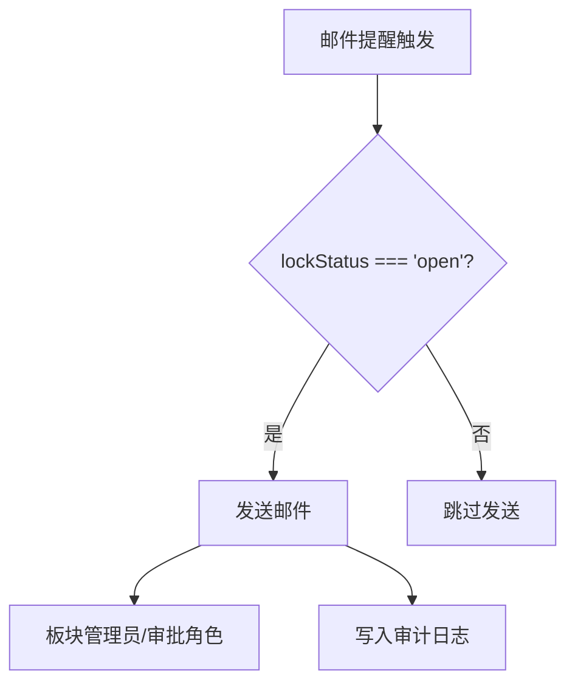

**图表来源**
- [需求文档_开发版.md:831-837](file://docs/需求文档/需求文档_开发版.md#L831-L837)

**章节来源**
- [需求文档_开发版.md:831-837](file://docs/需求文档/需求文档_开发版.md#L831-L837)

### 概念总览
- 术语速查：快照（I/D/J）、baseline、报告月、引用列、Luckysheet
- 系统架构总览：外部系统对接、前端组件、后端服务与数据库

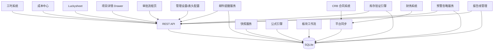

**图表来源**
- [需求文档_产品版.md:93-131](file://docs/需求文档/需求文档_产品版.md#L93-L131)

## 依赖关系分析
- 技术栈依赖：Vue 2 + Element UI + Luckysheet（前端）、Node.js + Express（后端）、SQLite（数据存储）
- 外部系统依赖：CRB/财务/工时/成本中心平台，通过平台同步服务接入
- 数据库依赖：项目主表、月度记录、基线、预收款、审计日志、快照、权限与配置等

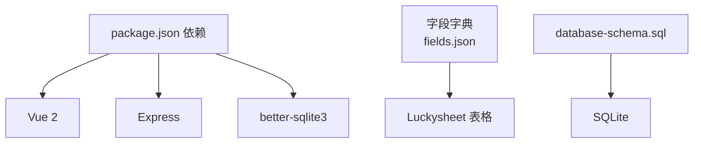

**图表来源**
- [package.json:13-18](file://package.json#L13-L18)
- [fields.json:1-20](file://config/fields/fields.json#L1-L20)
- [database-schema.sql:1-20](file://database-schema.sql#L1-L20)

**章节来源**
- [package.json:1-19](file://package.json#L1-L19)
- [database-schema.sql:1-286](file://database-schema.sql#L1-L286)

## 性能考量
- 前端性能：Luckysheet 画布自适应、侧栏折叠/展开时重算宽度、金额列格式与校验避免无效渲染
- 后端性能：分页（默认每页 10 条）、排序持久化、接口幂等（刷新数据、导入合并）、审计日志写入
- 数据库性能：索引（项目号、报告月、审批状态等）、快照只增不减、公式引擎按需重算

## 故障排查指南
- 填报期状态异常：检查"数据锁定控制"与"填报周期配置"，确认锁定日/解禁日/自动解锁开关
- 平台同步失败：检查"刷新数据"接口与审计日志，确认 operation_type: platform_sync
- 导入合并异常：检查项目号匹配、字段可编辑性、金额/日期规范化
- Drawer 预警不显示：检查工时 API 加载状态与阈值（R/S 预警、完成额 vs 工时）
- 审批流程卡住：检查审批状态机与"提交审批"/"通过/驳回"接口
- 邮件提醒问题：检查邮件服务配置、管理员配置的时间参数、审计日志中的邮件发送记录
- J 版归档失败：确认当前处于锁定期，检查 /company/archive 接口返回状态
- 库存验证错误：检查手工完成额输入是否导致 S<0，确认系统同步自动对冲逻辑
- 预警忽略失效：检查 /api/admin/alerts/{id}/dismiss 接口状态，确认 dismissed 状态持久化
- **新增** 报告线管理异常：检查路由配置、权限合并逻辑、Git-like数据流状态
- **新增** 多角色协作问题：检查用户角色组合、审批流自动跳过逻辑、数据范围合并

**更新** 新增了报告线管理、多角色协作等故障排查指导。

**章节来源**
- [需求文档_开发版.md:792-1000](file://docs/需求文档/需求文档_开发版.md#L792-L1000)
- [多角色与报告线列表需求文档.md:406-423](file://docs/需求文档/多角色与报告线列表需求文档.md#L406-L423)

## 结论
本需求文档集合以"新结构大纲"为纲，结合"产品版/开发版"需求、设计规范与数据库模型，形成了覆盖角色权限、数据同步、填报交互、周期与锁定、变更追踪、审批与快照、系统管理、业务规则、邮件提醒与补充确认的完整需求谱系。新增的多角色协作框架和报告线管理系统的业务设计基础，建立了Git-like数据流模型，替代传统审批流程，为项目实施提供了清晰的路线图。

**更新** 新增多角色协作框架和报告线管理系统的业务设计基础，建立Git-like数据流模型。

## 附录

### 需求文档模板与版本管理
- 模板结构：按功能模块组织，每章聚焦一个独立关注点；消除重复但不删内容；技术实现细节以内联引用方式保留
- 版本管理：需求文档版本号与最后更新时间，字段字典以 JSON/JS 为准，运行时以 config/fields/fields.json 为准
- 发布计划：J 版归档后进入新一轮周期，锁定状态不变，可多次提交

**章节来源**
- [新结构大纲.md:1-16](file://docs/需求文档/新结构大纲.md#L1-L16)
- [需求文档_产品版.md:1-10](file://docs/需求文档/需求文档_产品版.md#L1-L10)
- [需求文档_开发版.md:1-10](file://docs/需求文档/需求文档_开发版.md#L1-L10)

### 需求变更管理、优先级排序与验收标准
- 变更管理：通过"补充需求确认"17项确认表进行澄清与确认；平台同步与字段字典变更需写入审计日志
- 优先级排序：以业务影响（财务/运营审计、审批流程、数据准确性）与技术复杂度为依据
- 验收标准：功能通过用例评审、UI 一致性检查、数据一致性校验、性能与安全基线达标

**章节来源**
- [需求文档_产品版.md:105-106](file://docs/需求文档/需求文档_产品版.md#L105-L106)
- [需求文档_开发版.md:275-386](file://docs/需求文档/需求文档_开发版.md#L275-L386)

### 用户故事、用例图与需求跟踪矩阵
- 用户故事：项目经理（填报产值/进度/WIP）、板块管理员（汇总核查/提交审批）、板块总监/群主（审批）、系统管理员（归档/配置/审计）、经营管理（只读查阅）
- 用例图：外部系统（CRB/财务/工时/成本中心）与系统内角色与页面的交互
- 需求跟踪矩阵：字段字典（fields.json/fields-data.js）与前端组件、后端接口、数据库表之间的映射

```mermaid
erDiagram
PROJECTS {
integer id PK
text project_no UK
text reporting_month
text approval_status
real prev_year_end_amt
real prev_year_end_invoice
real prev_year_end_payment
real contract_amt_ex_tax
real contract_amt_inc_tax
real cumulative_complete_inc_tax
real cumulative_complete_ex_tax
real cumulative_invoice
real wip_inc_tax
real wip_ex_tax
text _changed_fields
text _field_change_log
text _field_notes
integer _added_this_month
text approval_status
text reporting_submitted
}
MONTHLY_RECORDS {
integer id PK
text project_no
text report_month
real total_complete
real total_invoice
real total_payment
real total_prepayment
integer is_locked
text locked_by
text locked_at
}
PROJECT_YEARLY_BASELINE {
integer id PK
text project_no
integer baseline_year
real year_end_complete_amt
real year_end_invoice_amt
real year_end_payment_amt
real year_end_contract_amt
real year_adjustment
}
PREPAYMENT_WRITEOFFS {
integer id PK
text project_no
real writeoff_amt
text writeoff_date
text invoice_no
text writeoff_note
text operator
text report_month
}
AUDIT_LOG {
integer id PK
text project_no
text field_name
text field_cn
text old_value
text new_value
text change_reason
text operator
text operation_type
text report_month
}
SNAPSHOTS {
integer id PK
text version UK
text snapshot_type
text sector_code
text report_month
text snapshot_data
text operator
}
PROJECT_ALERTS {
integer id PK
text project_no
text alert_type
text alert_label
text detail
integer year
integer month_idx
text status
text first_detected_at
text resolved_at
text last_seen_at
}
PROJECT_ALERT_DISMISSALS {
text project_no
text alert_type
text dismissed_at
text dismissed_by
PK (project_no, alert_type)
}
PROJECTS ||--o{ MONTHLY_RECORDS : "月度记录"
PROJECTS ||--o{ PROJECT_YEARLY_BASELINE : "基线"
PROJECTS ||--o{ PREPAYMENT_WRITEOFFS : "预收款核销"
PROJECTS ||--o{ AUDIT_LOG : "审计日志"
PROJECTS ||--o{ SNAPSHOTS : "快照"
PROJECT_ALERTS ||--o{ PROJECT_ALERT_DISMISSALS : "永久忽略记录"
```

**图表来源**
- [database-schema.sql:12-87](file://database-schema.sql#L12-L87)
- [database-schema.sql:99-196](file://database-schema.sql#L99-L196)
- [database-schema.sql:205-223](file://database-schema.sql#L205-L223)
- [database-schema.sql:232-245](file://database-schema.sql#L232-L245)
- [database-schema.sql:254-268](file://database-schema.sql#L254-L268)
- [database-schema.sql:279-286](file://database-schema.sql#L279-L286)
- [database-schema.sql:307-331](file://database-schema.sql#L307-L331)

### 需求验证方法、原型设计与用户确认流程
- 需求验证：用例评审、UI 一致性检查、数据一致性校验、性能与安全基线
- 原型设计：参考 DASHBOARD.md 与 LIST_FORM.md 的展示层规范、交互与下钻、图表与表格设计规范
- 用户确认：通过"补充需求确认"17项确认表进行闭环确认

**章节来源**
- [DASHBOARD.md:1-199](file://docs/设计文档/DASHBOARD.md#L1-L199)
- [LIST_FORM.md:1-302](file://docs/设计文档/LIST_FORM.md#L1-L302)
- [需求文档_产品版.md:105-106](file://docs/需求文档/需求文档_产品版.md#L105-L106)

### 需求沟通机制、风险评估与变更控制策略
- 沟通机制：会议记录与需求文档共同演进，字段字典与数据库模型作为事实来源
- 风险评估：平台同步失败、导入合并冲突、审批流程阻塞、数据一致性风险、邮件提醒服务异常、J版归档失败、库存验证错误、预警忽略失效、报告线管理异常、多角色协作问题
- 变更控制策略：变更写入审计日志、字段字典版本锁定、平台同步与导入合并规则、J 版归档后重置流程态、动态时间窗配置、手动永久忽略预警、Git-like数据流模型

**更新** 新增了报告线管理异常、多角色协作问题等风险评估。

**章节来源**
- [需求文档_开发版.md:275-386](file://docs/需求文档/需求文档_开发版.md#L275-L386)
- [fields.json:1-20](file://config/fields/fields.json#L1-L20)
- [database-schema.sql:1-20](file://database-schema.sql#L1-L20)

### 管理设置与配置
- 时间窗配置：通过管理设置界面配置提醒日（默认 19 日）、锁定日（默认 25 日）、解禁日（默认 9 日）和自动解锁开关
- 邮件提醒配置：管理员可配置邮件提醒功能的各项参数，包括提醒日、倒计时天数、邮件模板等
- 权限配置：系统管理员可维护板块管理员、用户权限等配置信息
- 系统管理员可编辑范围：系统同步列与手工填报列

**更新** 新增了管理设置与配置的具体说明，明确了系统管理员可编辑列范围。

**章节来源**
- [需求文档_开发版.md:831-837](file://docs/需求文档/需求文档_开发版.md#L831-L837)
- [js/store.js:21](file://js/store.js#L21)
- [js/views/AdminSettings.js:255](file://js/views/AdminSettings.js#L255)
- [server/db.js:62](file://server/db.js#L62)
- [server/index.js:694-711](file://server/index.js#L694-L711)

### 库存验证与预警管理
- 库存验证引擎：实时校验 R/S 存量指标，拦截违规输入，支持自动对冲与手动调整
- 预警管理系统：支持活跃/已消除/已忽略状态管理，提供永久忽略功能
- 数据持久化：所有预警均持久化存储至数据库，支持跨月状态跟踪

**更新** 新增库存验证与预警管理的详细说明。

**章节来源**
- [js/stock-validation.js:1-186](file://js/stock-validation.js#L1-L186)
- [js/components/AlertsDrawer.js:125-242](file://js/components/AlertsDrawer.js#L125-L242)
- [server/alert-service.js:309-336](file://server/alert-service.js#L309-L336)
- [database-schema.sql:307-331](file://database-schema.sql#L307-L331)

### 报告线管理与多角色协作
- **报告线概念**：以「板块 × 月度周期」为单位的工作项，是填报、审批、归档的最小管理粒度
- **权限合并**：多角色用户权限取并集，数据范围同样取并集
- **审批跳过**：当用户同时是提交者和审批者时，对应审批节点自动跳过
- **Git-like数据流**：每层只关心"收到了哪些变更，是否接受"，退回=reject，重新填报=修改后再次提交
- **路由调整**：新增`/#/report-lines`和`/#/report-lines/:id`路由，`/#/editor`改为只读

**新增** 报告线管理与多角色协作的详细说明。

**章节来源**
- [多角色与报告线列表需求文档.md:100-162](file://docs/需求文档/多角色与报告线列表需求文档.md#L100-L162)
- [多角色与报告线列表需求文档.md:331-403](file://docs/需求文档/多角色与报告线列表需求文档.md#L331-L403)
- [多角色与报告线列表需求文档.md:217-288](file://docs/需求文档/多角色与报告线列表需求文档.md#L217-L288)
- [js/router.js:12-69](file://js/router.js#L12-L69)