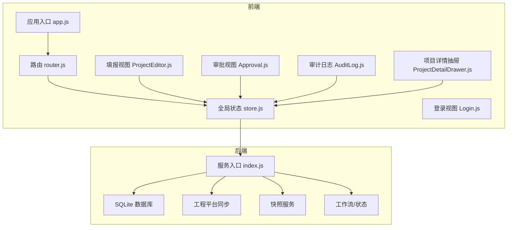
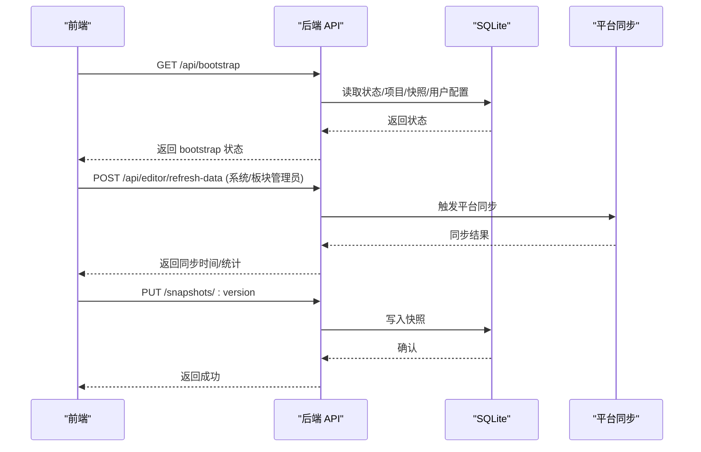
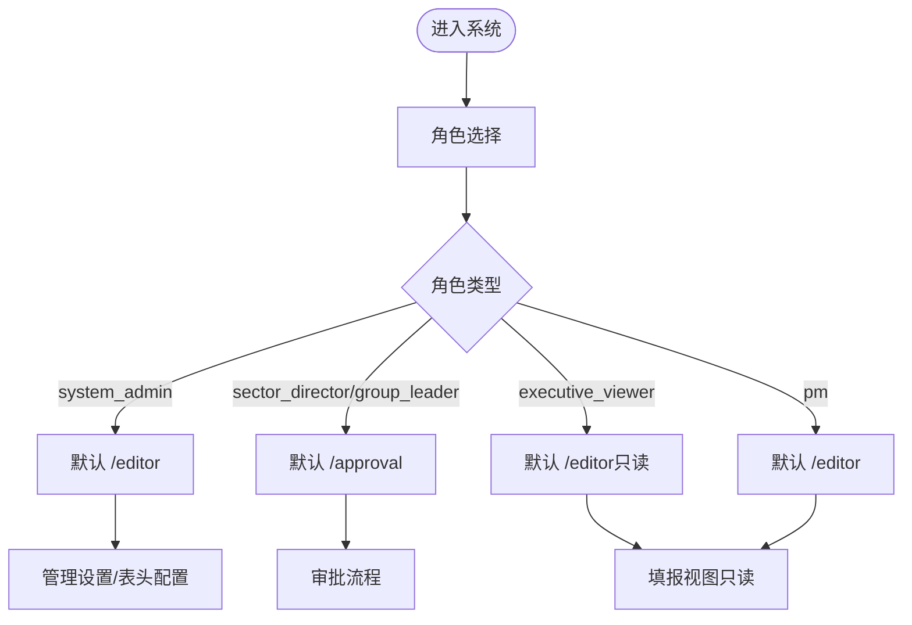
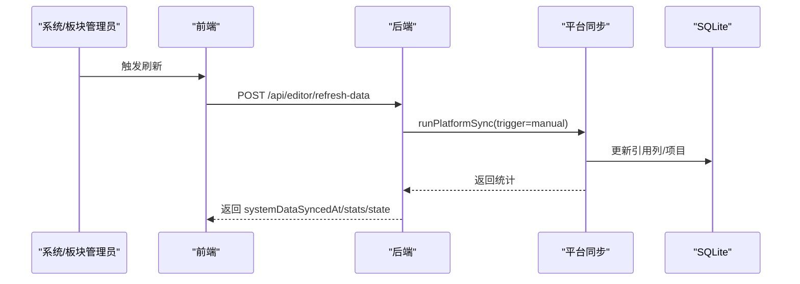
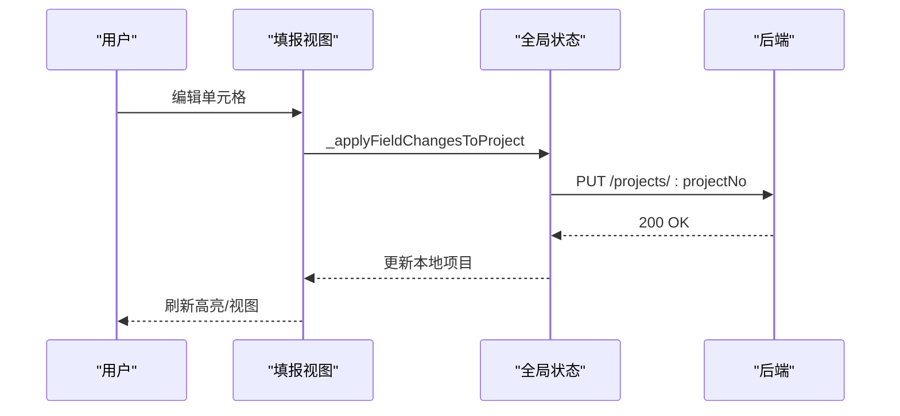
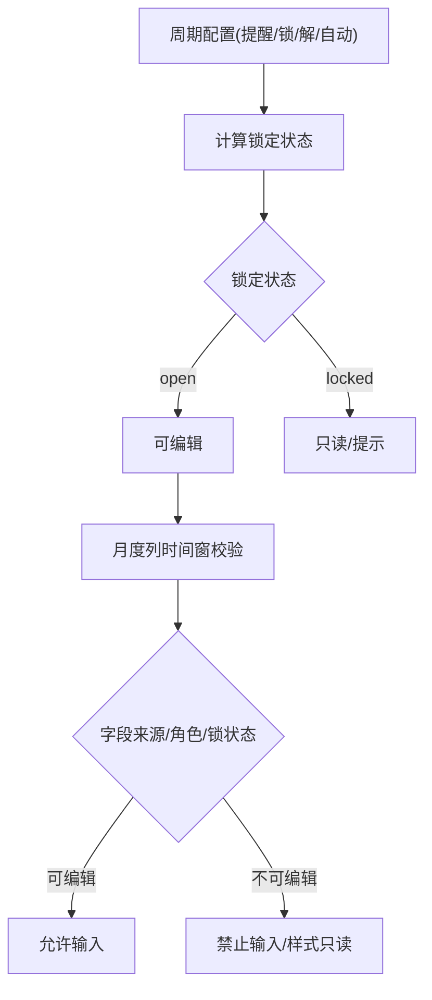
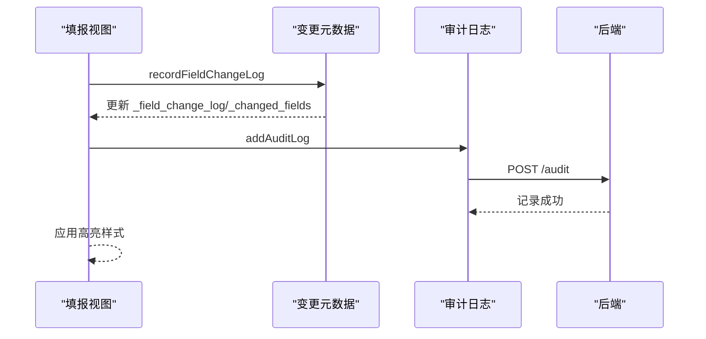
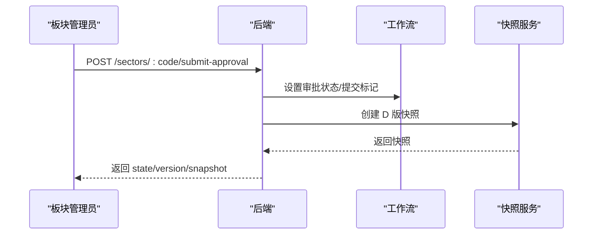
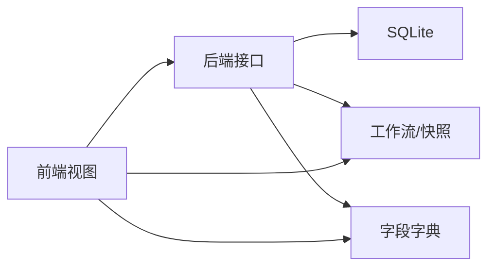

# 需求规格说明书

<cite>
**本文引用的文件**
- [新结构大纲.md](file://docs/需求文档/新结构大纲.md)
- [app.js](file://js/app.js)
- [index.js](file://server/index.js)
- [router.js](file://js/router.js)
- [store.js](file://js/store.js)
- [Login.js](file://js/views/Login.js)
- [ProjectEditor.js](file://js/views/ProjectEditor.js)
- [Approval.js](file://js/views/Approval.js)
- [AuditLog.js](file://js/views/AuditLog.js)
- [ProjectDetailDrawer.js](file://js/components/ProjectDetailDrawer.js)
- [data-scope.js](file://js/data-scope.js)
- [field-config.js](file://js/field-config.js)
- [formatters.js](file://js/formatters.js)
- [change-meta.js](file://js/change-meta.js)
- [baseline-diff.js](file://js/baseline-diff.js)
</cite>

## 目录
1. [引言](#引言)
2. [项目结构](#项目结构)
3. [核心组件](#核心组件)
4. [架构总览](#架构总览)
5. [详细组件分析](#详细组件分析)
6. [依赖关系分析](#依赖关系分析)
7. [性能考量](#性能考量)
8. [故障排查指南](#故障排查指南)
9. [结论](#结论)
10. [附录](#附录)

## 引言
本需求规格说明书依据“新结构大纲”对系统进行分章梳理，围绕系统总览、角色与权限、数据同步与工程平台对接、填报交互、填报周期与锁定机制、变更追踪与高亮、审批流程与版本快照、系统管理、业务规则以及补充需求确认等十个方面，结合前端 Vue 应用与后端 Node/SQLite 的实现，给出面向开发与产品团队的可执行说明。文档强调以仓库现有实现为依据，避免臆测，确保可追溯性。

## 项目结构
系统采用前后端分离架构：
- 前端：Vue 2 + Vue Router + Element UI，使用 Luckysheet 作为主要表格引擎，通过 /api 与后端交互，状态集中于 Store（基于 Vue.observable）。
- 后端：Node.js + Express + better-sqlite3，提供 REST 接口，负责项目数据、工作流、快照、审计日志、工程平台同步等。
- 配置与字典：字段字典（fields.json/fields-data.js）与表头配置，支持运行时读取与系统管理员在线维护。

图表来源
- [app.js:1-47](file://js/app.js#L1-L47)
- [router.js:1-137](file://js/router.js#L1-L137)
- [store.js:1-602](file://js/store.js#L1-L602)
- [index.js:1-775](file://server/index.js#L1-L775)

章节来源
- [新结构大纲.md:1-123](file://docs/需求文档/新结构大纲.md#L1-L123)
- [app.js:1-47](file://js/app.js#L1-L47)
- [index.js:1-775](file://server/index.js#L1-L775)

## 核心组件
- 应用入口与初始化：应用启动时初始化 Vue、注册组件、安装过滤器，并在获取 Bootstrap 状态后再挂载。
- 全局状态 Store：集中管理项目数据、工作流状态、快照、字段字典、审计日志、侧边栏状态、编辑器视图模式等，并提供与后端 API 的桥接方法。
- 路由与导航守卫：根据角色限制访问路径，系统管理员与只读角色拥有不同默认路由与可见区域。
- 登录视图：提供角色与用户的快速选择，支持演示态下的用户模拟。
- 填报视图：Luckysheet 表格布局、工具栏、导入导出、版本查看、抽屉式项目详情等。
- 审批视图：流程时间轴、版本对比、推进/驳回操作。
- 审计日志：按时间、用户、项目、字段筛选的日志表格与导出。
- 项目详情抽屉：项目头部信息、预警、填报区、只读参考区、辅助区（工时/成本）。

章节来源
- [app.js:1-47](file://js/app.js#L1-L47)
- [store.js:1-602](file://js/store.js#L1-L602)
- [router.js:1-137](file://js/router.js#L1-L137)
- [Login.js:1-215](file://js/views/Login.js#L1-L215)
- [ProjectEditor.js:1-800](file://js/views/ProjectEditor.js#L1-L800)
- [Approval.js:1-475](file://js/views/Approval.js#L1-L475)
- [AuditLog.js:1-239](file://js/views/AuditLog.js#L1-L239)
- [ProjectDetailDrawer.js:1-846](file://js/components/ProjectDetailDrawer.js#L1-L846)

## 架构总览
系统采用“前端单页应用 + 后端 REST API + SQLite 存储”的轻量架构。前端通过 Store 与后端通信，后端提供以下关键能力：
- 项目数据管理：替换、更新、查询。
- 工作流与状态：周期配置、锁定状态、审批状态、PM 提交状态、公司归档状态。
- 快照体系：导入/I、板块/D、公司/J 三类快照，支持草稿、版本对比。
- 审计日志：统一记录字段变更与系统事件。
- 工程平台同步：定时/手动刷新，支持系统管理员/板块管理员。
- 字段字典：运行时读取与系统管理员维护。

图表来源
- [index.js:88-218](file://server/index.js#L88-L218)
- [index.js:580-625](file://server/index.js#L580-L625)
- [index.js:184-196](file://server/index.js#L184-L196)
- [store.js:382-393](file://js/store.js#L382-L393)
- [store.js:558-577](file://js/store.js#L558-L577)

章节来源
- [index.js:1-775](file://server/index.js#L1-L775)
- [store.js:1-602](file://js/store.js#L1-L602)

## 详细组件分析

### 0. 系统总览
- 系统定位与目标：将月度产值报告从线下 Excel 流程迁移至线上，实现填报、审核、审批、归档的数字化闭环。
- 业务场景：项目执行追踪，涵盖合同额、完成额、开票回款、WIP、财务等关键指标。
- 核心流程：填报 → 审核 → 审批 → 归档。
- 关键角色：系统管理员、经营管理（只读）、板块管理员、项目经理、板块总监、项目群群主。
- 关键术语：CRB（工程平台）、WIP（在制品）、存量、快照（I/D/J）。
- 技术栈：Node.js + SQLite + Vue + Luckysheet。

章节来源
- [新结构大纲.md:9-15](file://docs/需求文档/新结构大纲.md#L9-L15)

### 1. 角色与权限
- 角色定义与权限总表：系统管理员（全字段编辑、锁定/解锁、系统配置）、经营管理（只读）、板块管理员（板块数据汇总）、项目经理（本项目填报）、板块总监（初审）、项目群群主（终审）。
- 数据范围配置：经营管理（只读）支持公司/板块/项目群三种范围，通过 groupRegistry/sectorNames 显示标签。
- 字段级权限矩阵：基于字段来源类型与月度时间窗的动态判定，详见字段配置模块。
- 页面权限与默认路由：路由守卫按角色限制访问，系统管理员默认 /editor，板块总监/群主默认 /approval。
- 用户与权限配置：系统管理员可维护用户列表、群组与板块管理员配置，变更会写入审计日志。

图表来源
- [router.js:7-136](file://js/router.js#L7-L136)
- [Login.js:7-50](file://js/views/Login.js#L7-L50)
- [data-scope.js:13-71](file://js/data-scope.js#L13-L71)

章节来源
- [router.js:1-137](file://js/router.js#L1-L137)
- [Login.js:1-215](file://js/views/Login.js#L1-L215)
- [data-scope.js:1-73](file://js/data-scope.js#L1-L73)
- [index.js:647-702](file://server/index.js#L647-L702)

### 2. 数据同步与工程平台对接
- 同步机制：后端提供定时与手动两种触发方式，系统管理员/板块管理员可刷新工程平台引用列与库内项目。
- 引用列机制：system_sync 字段与报告月当月的 MI/MP 列为工程平台引用列，仅系统管理员可在锁定期内覆盖。
- 批量刷新规则：支持按角色调用 /api/editor/refresh-data 与 /api/admin/sync-platform-data，返回同步时间与统计。

图表来源
- [index.js:580-625](file://server/index.js#L580-L625)
- [store.js:558-577](file://js/store.js#L558-L577)

章节来源
- [index.js:580-625](file://server/index.js#L580-L625)
- [store.js:558-577](file://js/store.js#L558-L577)

### 3. 填报交互
- Luckysheet 表格布局：冻结表头、固定左侧列、分区背景色、列宽与金额格式、公式链与布局自适应。
- 工具栏配置：业务工具栏、表格工具栏、图例说明条、右键菜单禁用大部分编辑能力，保留筛选。
- 保存与导出：保存将未提交的单元格变更写入数据库；导出为 Excel。
- 上传导入：支持 Excel 导入并按项目号合并更新，PM 仅能导入自身项目。
- 项目详情 Drawer：包含预警区、工时统计辅助区、成本中心辅助区、月度条带、只读参考等。

图表来源
- [ProjectEditor.js:716-799](file://js/views/ProjectEditor.js#L716-L799)
- [store.js:320-336](file://js/store.js#L320-L336)
- [index.js:126-138](file://server/index.js#L126-L138)

章节来源
- [ProjectEditor.js:1-800](file://js/views/ProjectEditor.js#L1-L800)
- [ProjectDetailDrawer.js:1-846](file://js/components/ProjectDetailDrawer.js#L1-L846)
- [store.js:320-336](file://js/store.js#L320-L336)

### 4. 填报周期与锁定机制
- 月度时间窗：配置包含提醒日、锁定期、解锁日与自动解锁开关；锁定状态随报告月与系统日期动态计算。
- 锁定状态计算：当月锁定、次月解锁（可配置自动解锁）；历史 finance_only 归一为 open。
- 月度列属性动态判断：完成额（当月及以后可写）、开票/回款（仅当月之后可写）。
- 列级只读动态时间窗：基于字段列与报告月索引的可编辑性判断。
- 提交审批后的填报锁定：PM 提交后锁定，板块未正式提交前可撤销。

图表来源
- [store.js:21-64](file://js/store.js#L21-L64)
- [field-config.js:60-122](file://js/field-config.js#L60-L122)

章节来源
- [store.js:1-602](file://js/store.js#L1-L602)
- [field-config.js:1-262](file://js/field-config.js#L1-L262)

### 5. 变更追踪与高亮
- 审计日志：统一记录字段变更、系统事件，支持按时间/用户/项目/字段筛选与导出。
- 变更元数据：_field_change_log 记录同一字段的多次变更，_changed_fields 标记变更列集合。
- 高亮机制：变更单元格底色与边框、可编辑列底色、新增项目整行高亮、联动计算高亮叠加优先级。

图表来源
- [ProjectEditor.js:716-799](file://js/views/ProjectEditor.js#L716-L799)
- [change-meta.js:96-151](file://js/change-meta.js#L96-L151)
- [AuditLog.js:1-239](file://js/views/AuditLog.js#L1-L239)
- [index.js:170-182](file://server/index.js#L170-L182)

章节来源
- [change-meta.js:1-260](file://js/change-meta.js#L1-L260)
- [baseline-diff.js:1-117](file://js/baseline-diff.js#L1-L117)
- [AuditLog.js:1-239](file://js/views/AuditLog.js#L1-L239)

### 6. 审批流程与版本快照
- 版本快照体系：I（导入）、D（板块）、J（公司）三类快照，支持草稿、版本对比与可见性控制。
- 状态机：板块管理员提交 → 板块总监初审 → 项目群群主复审 → 系统管理员归档（生成 J 版）。
- 审批界面：流程时间轴、版本对比、推进/驳回按钮与操作审计。
- 快照体系：支持按角色可见性（D 版仅板块管理员可见），支持按基准快照标记新增项目与字段差异。

图表来源
- [index.js:302-346](file://server/index.js#L302-L346)
- [store.js:361-380](file://js/store.js#L361-L380)

章节来源
- [Approval.js:1-475](file://js/views/Approval.js#L1-L475)
- [index.js:302-346](file://server/index.js#L302-L346)
- [baseline-diff.js:75-112](file://js/baseline-diff.js#L75-L112)

### 7. 系统管理
- 表头配置：运行时读取字段字典（fields.json/fields-data.js），系统管理员可在线维护并写回。
- 开发测试：环境重置（reset-dev）将流程、配置与项目数据恢复默认，便于演示与回归。

章节来源
- [store.js:170-235](file://js/store.js#L170-L235)
- [index.js:704-741](file://server/index.js#L704-L741)
- [index.js:627-645](file://server/index.js#L627-L645)

### 8. 业务规则
- 数据源定义：字段字典定义字段来源类型（system_sync/auto_calc/manual_input）与数据类型。
- 产值申报：月度完成（MC）列在报告月当月及之后可写；开票/回款（MI/MP）列仅当月之后可写。
- 财务与 WIP 规则：财务关注列（开票/回款）默认只读；WIP 相关字段在特定条件下启用/折叠。
- 动态年份与历史归档：支持按系统年份查询工时/成本统计数据，归档后生成 J 版快照。

章节来源
- [field-config.js:1-262](file://js/field-config.js#L1-L262)
- [formatters.js:1-167](file://js/formatters.js#L1-L167)
- [index.js:140-168](file://server/index.js#L140-L168)

### 9. 补充需求确认
- 本节对应“新结构大纲”中的第 105 章，包含若干确认事项与待办清单。由于仓库未提供具体清单内容，此处不展开具体条目。

章节来源
- [新结构大纲.md:105-123](file://docs/需求文档/新结构大纲.md#L105-L123)

## 依赖关系分析
- 前端依赖后端接口：/api/*（项目、快照、元数据、审计、同步、用户配置等）。
- 字段字典依赖：前端与后端共享字段字典，后端提供 /api/fields 与 /api/admin/fields。
- 工作流与快照：后端维护 sectorFlows、companyFlow、pmSubmissions、snapshots 等状态。
- 权限耦合：路由守卫与字段权限共同决定页面可见性与可编辑性。

图表来源
- [index.js:88-218](file://server/index.js#L88-L218)
- [store.js:170-235](file://js/store.js#L170-L235)

章节来源
- [index.js:1-775](file://server/index.js#L1-775)
- [store.js:1-602](file://js/store.js#L1-L602)

## 性能考量
- 前端渲染：Luckysheet 大表渲染与 ResizeObserver 优化，避免频繁重绘。
- 数据传输：批量导入/导出采用流式处理，后端限制请求体大小。
- 查询优化：按角色与数据范围过滤项目列表，减少前端渲染压力。
- 审计日志：限制日志数量与分页展示，避免 DOM 过大。

## 故障排查指南
- 无法加载数据：检查 /api/bootstrap 是否可用，确认 SQLite 初始化与字段字典加载。
- 权限不足：检查路由守卫与角色配置，确认用户角色与页面权限映射。
- 同步失败：检查 /api/editor/refresh-data 返回的错误信息与触发条件。
- 审计日志为空：确认系统管理员身份与审计写入逻辑。
- 锁定状态异常：核对周期配置与当前日期，确认锁定状态计算逻辑。

章节来源
- [app.js:30-44](file://js/app.js#L30-L44)
- [router.js:77-132](file://js/router.js#L77-L132)
- [index.js:580-625](file://server/index.js#L580-L625)
- [store.js:338-342](file://js/store.js#L338-L342)

## 结论
本需求规格说明书基于仓库现有实现，对系统总览、角色与权限、数据同步、填报交互、周期与锁定、变更追踪、审批与快照、系统管理、业务规则与补充确认进行了逐章梳理。通过前端 Store 与后端 API 的清晰边界，系统实现了从数据采集、工作流推进到审计归档的完整闭环。建议后续在产品层面补充“补充需求确认”清单的具体条目，以便形成完整的验收标准。

## 附录
- 术语对照：CRB（工程平台）、WIP（在制品）、存量（历史遗留指标）、快照（I/D/J）。
- 字段字典来源：前端运行时加载 fields.json/fields-data.js，系统管理员可通过 /api/admin/fields 维护。

章节来源
- [新结构大纲.md:9-15](file://docs/需求文档/新结构大纲.md#L9-L15)
- [store.js:170-235](file://js/store.js#L170-L235)