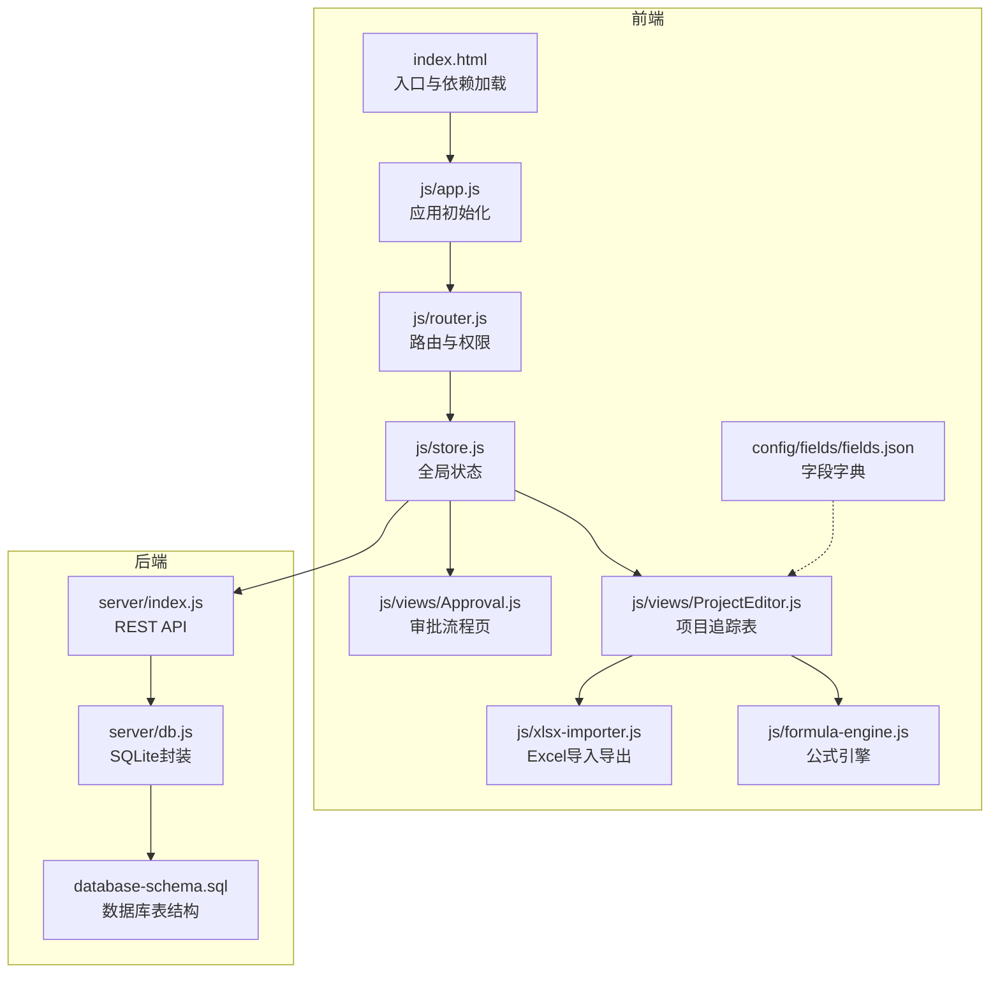
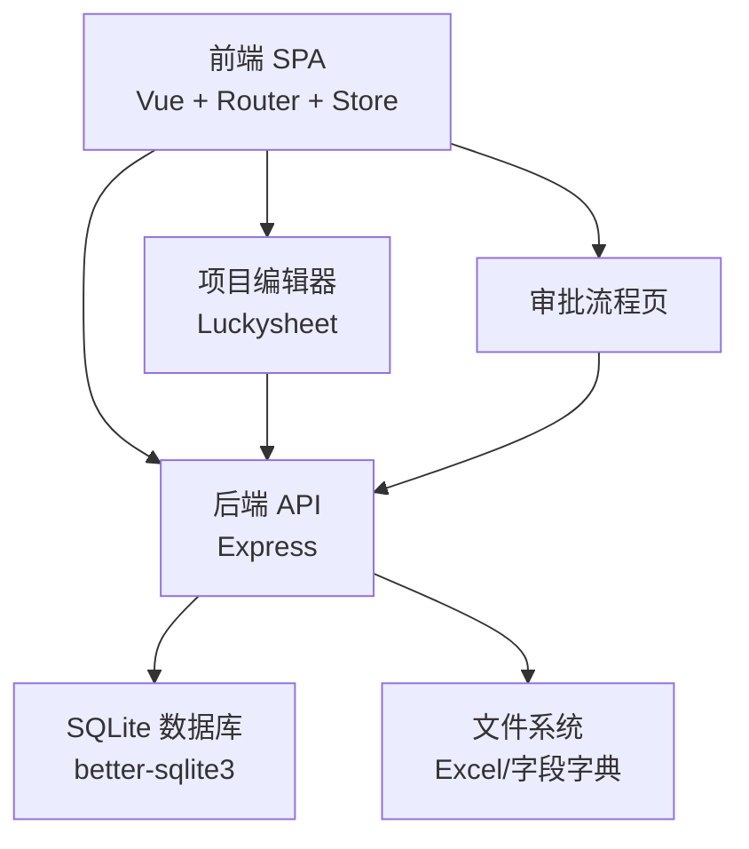
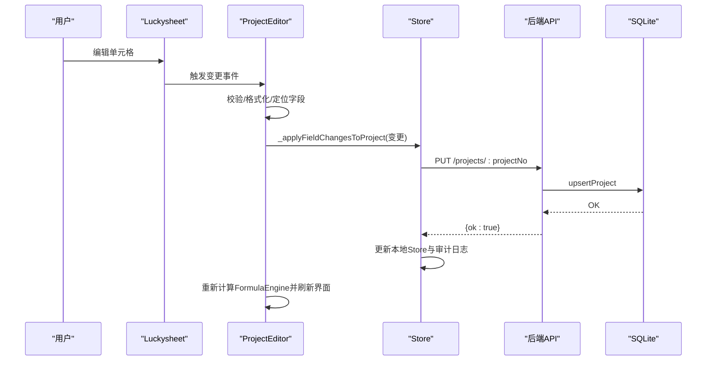
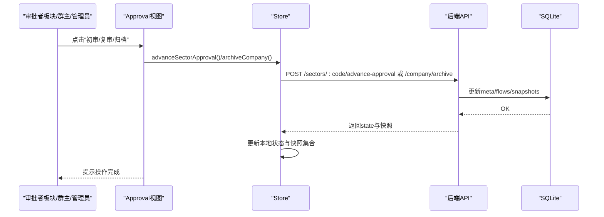
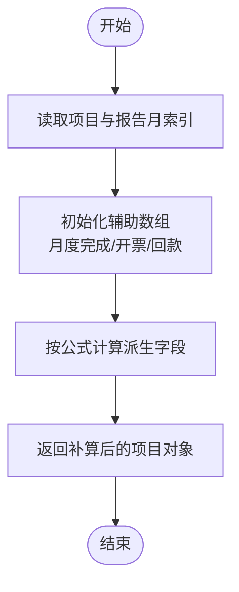
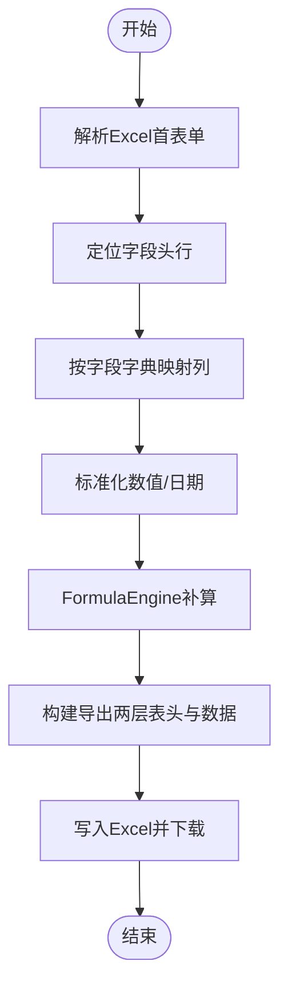
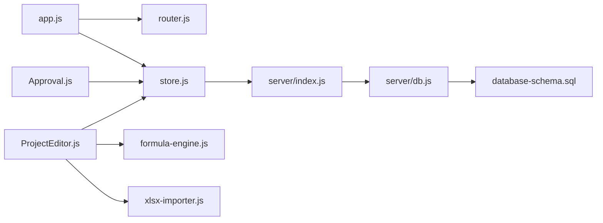

# 项目概述

<cite>
**本文档引用的文件**
- [package.json](file://package.json)
- [index.html](file://index.html)
- [server/index.js](file://server/index.js)
- [js/app.js](file://js/app.js)
- [js/store.js](file://js/store.js)
- [js/router.js](file://js/router.js)
- [js/views/ProjectEditor.js](file://js/views/ProjectEditor.js)
- [js/views/Approval.js](file://js/views/Approval.js)
- [js/formula-engine.js](file://js/formula-engine.js)
- [js/sector-workflow.js](file://js/sector-workflow.js)
- [js/xlsx-importer.js](file://js/xlsx-importer.js)
- [server/db.js](file://server/db.js)
- [database-schema.sql](file://database-schema.sql)
- [config/fields/fields.json](file://config/fields/fields.json)
- [docs/需求文档/技术栈与开发规范.md](file://docs/需求文档/技术栈与开发规范.md)
</cite>

## 目录
1. [简介](#简介)
2. [项目结构](#项目结构)
3. [核心组件](#核心组件)
4. [架构总览](#架构总览)
5. [详细组件分析](#详细组件分析)
6. [依赖关系分析](#依赖关系分析)
7. [性能考量](#性能考量)
8. [故障排查指南](#故障排查指南)
9. [结论](#结论)
10. [附录](#附录)

## 简介
本项目旨在将传统的线下“项目执行追踪表”全面线上化，围绕项目数据管理、实时计算、审批流程与Excel导入导出四大核心能力，构建一套轻量、可部署、可扩展的企业内部工具平台。系统以“不依赖构建工具”的轻量架构为基础，通过前端Luckysheet实现高保真电子表格体验，结合后端Express + SQLite提供稳定的数据持久化与API服务，辅以字段字典与公式引擎实现强大的实时计算与一致性保障。

项目解决的关键业务问题：
- 项目数据管理：统一存储项目基础信息、CRB同步字段、手工填报字段与计算字段，支持跨年基线与变更审计。
- 实时计算：基于公式引擎对月度完成额、累计开票/回款、WIP/应收账款等关键指标进行动态计算与联动。
- 审批流程：支持板块管理员提交、板块总监初审、项目群主复审与公司归档的四级流程，确保数据质量与合规。
- Excel导入导出：支持Excel文件导入生成项目数据，支持导出当前计算结果为Excel，便于线下审阅与归档。

系统设计理念与价值主张：
- 轻量与易部署：无构建工具链，CDN直引，双击即可运行，降低运维门槛。
- 业务闭环：从数据采集（Excel导入）、实时计算（FormulaEngine）、填报与权限控制（Luckysheet）、审批（多级流程）到归档（快照）形成完整闭环。
- 可演进：字段字典与快照机制为后续扩展与审计留足空间。

## 项目结构
项目采用前后端分离的静态站点架构：
- 前端：Vue 2 + Element UI + Luckysheet + Tailwind CSS，通过index.html统一加载，所有业务逻辑以模块化JS文件组织。
- 后端：Express + better-sqlite3，提供REST API、快照管理、审批流程控制与定时同步。
- 数据：SQLite文件持久化，配合字段字典与数据库表结构定义。



**图表来源**
- [index.html:1-110](file://index.html#L1-L110)
- [js/app.js:1-47](file://js/app.js#L1-L47)
- [js/router.js:1-137](file://js/router.js#L1-L137)
- [js/store.js:1-602](file://js/store.js#L1-L602)
- [js/views/ProjectEditor.js:1-800](file://js/views/ProjectEditor.js#L1-L800)
- [js/views/Approval.js:1-475](file://js/views/Approval.js#L1-L475)
- [js/formula-engine.js:1-105](file://js/formula-engine.js#L1-L105)
- [js/xlsx-importer.js:1-186](file://js/xlsx-importer.js#L1-L186)
- [server/index.js:1-775](file://server/index.js#L1-L775)
- [server/db.js:1-525](file://server/db.js#L1-L525)
- [database-schema.sql:1-286](file://database-schema.sql#L1-L286)
- [config/fields/fields.json:1-800](file://config/fields/fields.json#L1-L800)

**章节来源**
- [package.json:1-19](file://package.json#L1-L19)
- [index.html:1-110](file://index.html#L1-L110)
- [docs/需求文档/技术栈与开发规范.md:1-144](file://docs/需求文档/技术栈与开发规范.md#L1-L144)

## 核心组件
- 应用入口与初始化
  - index.html：集中引入CDN依赖与业务脚本，统一加载顺序保证模块化依赖正确。
  - js/app.js：初始化Vue实例，先拉取后端引导状态，再挂载路由视图。
- 全局状态与路由
  - js/store.js：封装Fetch请求、全局状态（项目、快照、审批、用户、字段字典等），提供统一API调用。
  - js/router.js：基于角色的导航守卫，限定访问范围（如PM仅能访问填报页）。
- 视图层
  - js/views/ProjectEditor.js：Luckysheet驱动的项目追踪表，支持权限控制、筛选、差异高亮、版本查看与导入导出。
  - js/views/Approval.js：审批流程页，支持流程进度展示、版本对比、推进/驳回操作。
- 计算与数据
  - js/formula-engine.js：按报告月索引对项目进行批量计算，产出派生字段。
  - js/xlsx-importer.js：Excel导入/导出，解析Sheet为项目数组，导出时按字段字典与计算结果生成标准报表。
- 后端服务
  - server/index.js：提供REST API（项目、快照、审批、元数据、审计、平台同步等），内置引导与种子数据逻辑。
  - server/db.js：SQLite封装，提供元数据、项目、快照、审计、工时/成本导入等能力。
- 字段字典
  - config/fields/fields.json：83列字段定义，涵盖来源类型（系统同步/自动计算/手工录入）、数据类型、计算逻辑与说明。

**章节来源**
- [js/app.js:1-47](file://js/app.js#L1-L47)
- [js/store.js:1-602](file://js/store.js#L1-L602)
- [js/router.js:1-137](file://js/router.js#L1-L137)
- [js/views/ProjectEditor.js:1-800](file://js/views/ProjectEditor.js#L1-L800)
- [js/views/Approval.js:1-475](file://js/views/Approval.js#L1-L475)
- [js/formula-engine.js:1-105](file://js/formula-engine.js#L1-L105)
- [js/xlsx-importer.js:1-186](file://js/xlsx-importer.js#L1-L186)
- [server/index.js:1-775](file://server/index.js#L1-L775)
- [server/db.js:1-525](file://server/db.js#L1-L525)
- [config/fields/fields.json:1-800](file://config/fields/fields.json#L1-L800)

## 架构总览
系统采用“前端SPA + 后端REST API + SQLite存储”的轻量架构。前端通过store.js与后端交互，后端负责数据持久化与业务流程控制，数据库表结构覆盖项目主表、月度记录、年度基线、预收款核销、审计日志、快照与元数据。



**图表来源**
- [js/store.js:1-602](file://js/store.js#L1-L602)
- [js/views/ProjectEditor.js:1-800](file://js/views/ProjectEditor.js#L1-L800)
- [js/views/Approval.js:1-475](file://js/views/Approval.js#L1-L475)
- [server/index.js:1-775](file://server/index.js#L1-L775)
- [server/db.js:1-525](file://server/db.js#L1-L525)

## 详细组件分析

### 项目追踪表（前端）
- 功能要点
  - Luckysheet表格：冻结列、分区背景、紧凑列视图、权限控制（只读/可编辑）、差异高亮、版本对比。
  - 实时计算：FormulaEngine按报告月索引批量计算派生字段，支持“当前/基线”对比。
  - Excel导入导出：支持从Excel解析项目数据并合并更新，支持导出当前计算结果。
  - 权限与视图：按角色显示不同视图（PM仅填报、板块管理员可查看差异、系统管理员可刷新平台数据）。
- 关键流程（单元格编辑到持久化）
  - 用户编辑Luckysheet单元格 → 触发校验与格式化 → 合并变更到Store → 调用Store.updateProject → 写入后端API → 触发FormulaEngine重算与审计日志。



**图表来源**
- [js/views/ProjectEditor.js:1-800](file://js/views/ProjectEditor.js#L1-L800)
- [js/store.js:1-602](file://js/store.js#L1-L602)
- [server/index.js:1-775](file://server/index.js#L1-L775)
- [server/db.js:1-525](file://server/db.js#L1-L525)

**章节来源**
- [js/views/ProjectEditor.js:1-800](file://js/views/ProjectEditor.js#L1-L800)
- [js/formula-engine.js:1-105](file://js/formula-engine.js#L1-L105)
- [js/xlsx-importer.js:1-186](file://js/xlsx-importer.js#L1-L186)

### 审批流程（前端）
- 流程节点
  - 草稿/提交 → 总监初审 → 群主复审 → 公司归档（J版）。
- 权限与操作
  - 板块管理员：提交审批、生成D版快照；板块总监/群主：推进/驳回；系统管理员：最终归档。
  - 支持版本对比（Diff），查看流程进度与状态标签。
- 关键流程（推进审批）
  - 用户点击“初审/复审/归档” → Store调用相应API → 后端更新流程状态与快照 → Store刷新状态并提示。



**图表来源**
- [js/views/Approval.js:1-475](file://js/views/Approval.js#L1-L475)
- [js/store.js:1-602](file://js/store.js#L1-L602)
- [server/index.js:1-775](file://server/index.js#L1-L775)
- [server/db.js:1-525](file://server/db.js#L1-L525)

**章节来源**
- [js/views/Approval.js:1-475](file://js/views/Approval.js#L1-L475)
- [js/sector-workflow.js:1-180](file://js/sector-workflow.js#L1-L180)

### 公式引擎（实时计算）
- 输入：项目对象 + 报告月索引（0=1月，4=5月）。
- 输出：补算后的完整项目对象，包含派生字段（如累计完成、WIP、应收账款、3个月以上WIP等）。
- 批量计算：支持对项目列表进行批量计算，用于表格渲染与导出。



**图表来源**
- [js/formula-engine.js:1-105](file://js/formula-engine.js#L1-L105)

**章节来源**
- [js/formula-engine.js:1-105](file://js/formula-engine.js#L1-L105)

### Excel导入导出
- 导入：解析Excel首表单，定位字段头行，按字段字典映射列，转换数值/日期，补算公式，返回项目数组。
- 导出：按字段字典与计算结果生成两层表头，输出Excel文件，便于线下审阅与归档。



**图表来源**
- [js/xlsx-importer.js:1-186](file://js/xlsx-importer.js#L1-L186)
- [config/fields/fields.json:1-800](file://config/fields/fields.json#L1-L800)

**章节来源**
- [js/xlsx-importer.js:1-186](file://js/xlsx-importer.js#L1-L186)
- [config/fields/fields.json:1-800](file://config/fields/fields.json#L1-L800)

### 后端API与数据模型
- API概览
  - 项目：POST /api/projects（批量替换）、PUT /api/projects/:projectNo（单项目更新）
  - 快照：PUT /api/snapshots/:version（创建/更新）、GET /api/snapshots/:version（查询）
  - 审批：POST /api/sectors/:code/submit-approval（提交）、/advance-approval（推进）、/reject-approval（驳回）、/company/archive（归档）
  - 元数据：PATCH /api/meta（周期配置、锁定期、审批状态等）
  - 平台同步：POST /api/editor/refresh-data（刷新工程平台引用）、/admin/sync-platform-data（兼容旧接口）
  - 导入：POST /api/admin/timesheet-import、/api/admin/cost-import
  - 字段字典：GET /api/fields、/api/admin/fields（系统管理员）
- 数据模型
  - 项目主表（projects）：CRB同步字段 + 手工字段 + 计算字段 + 审批状态 + 元数据
  - 月度记录（monthly_records）：逐月完成/开票/回款/预收款汇总与锁定
  - 年度基线（project_yearly_baseline）：跨年冻结与翻转
  - 预收款核销（prepayment_writeoffs）：财务审核期专属
  - 审计日志（audit_log）：全量变更审计
  - 快照（snapshots）：不可变的审批节点数据快照
  - 元数据（meta）：周期配置、锁定期、审批状态、用户与权限等

```mermaid
erDiagram
PROJECTS {
text project_no PK
text payload
}
MONTHLY_RECORDS {
int id PK
text project_no
text report_month
real complete_amt_m1..m12
real invoice_amt_m1..m12
real payment_amt_m1..m12
real prepayment_amt_m1..m12
real total_complete
real total_invoice
real total_payment
real total_prepayment
int is_locked
text locked_by
text locked_at
}
PROJECT_YEARLY_BASELINE {
int id PK
text project_no
int baseline_year
real year_end_complete_amt
real year_end_invoice_amt
real year_end_payment_amt
real year_end_contract_amt
real year_adjustment
text created_at
}
PREPAYMENT_WRITEOFFS {
int id PK
text project_no
real writeoff_amt
text writeoff_date
text invoice_no
text writeoff_note
text operator
text report_month
text created_at
}
AUDIT_LOG {
int id PK
text project_no
text field_name
text field_cn
text old_value
text new_value
text change_reason
text operator
text operation_type
text report_month
text created_at
}
SNAPSHOTS {
text version PK
text snapshot_type
text sector_code
text report_month
text snapshot_data
text operator
text time
}
META {
text key PK
text value
}
PROJECTS ||--o{ MONTHLY_RECORDS : "关联"
PROJECTS ||--o{ PROJECT_YEARLY_BASELINE : "关联"
PROJECTS ||--o{ PREPAYMENT_WRITEOFFS : "关联"
PROJECTS ||--o{ AUDIT_LOG : "关联"
SNAPSHOTS }o--|| PROJECTS : "包含项目快照"
```

**图表来源**
- [database-schema.sql:1-286](file://database-schema.sql#L1-L286)
- [server/db.js:1-525](file://server/db.js#L1-L525)

**章节来源**
- [server/index.js:1-775](file://server/index.js#L1-L775)
- [server/db.js:1-525](file://server/db.js#L1-L525)
- [database-schema.sql:1-286](file://database-schema.sql#L1-L286)

## 依赖关系分析
- 前端模块耦合
  - app.js依赖store.js与router.js；router.js控制页面访问；store.js统一管理API与状态。
  - ProjectEditor与Approval均依赖store.js与字段字典；FormulaEngine被Editor调用；xlsx-importer被Editor与管理端使用。
- 后端模块耦合
  - server/index.js聚合db.js、sector-workflow、snapshot-service、platform-sync、timesheet/cost导入统计等模块。
  - db.js封装SQLite操作与元数据管理，为所有API提供数据支撑。
- 外部依赖
  - Express提供HTTP服务；better-sqlite3提供高性能SQLite访问；Luckysheet提供在线表格能力；SheetJS提供Excel解析/导出；Element UI提供企业级组件；Tailwind CSS提供原子化样式。



**图表来源**
- [js/app.js:1-47](file://js/app.js#L1-L47)
- [js/router.js:1-137](file://js/router.js#L1-L137)
- [js/store.js:1-602](file://js/store.js#L1-L602)
- [js/views/ProjectEditor.js:1-800](file://js/views/ProjectEditor.js#L1-L800)
- [js/views/Approval.js:1-475](file://js/views/Approval.js#L1-L475)
- [js/formula-engine.js:1-105](file://js/formula-engine.js#L1-L105)
- [js/xlsx-importer.js:1-186](file://js/xlsx-importer.js#L1-L186)
- [server/index.js:1-775](file://server/index.js#L1-L775)
- [server/db.js:1-525](file://server/db.js#L1-L525)
- [database-schema.sql:1-286](file://database-schema.sql#L1-L286)

**章节来源**
- [js/app.js:1-47](file://js/app.js#L1-L47)
- [js/store.js:1-602](file://js/store.js#L1-L602)
- [server/index.js:1-775](file://server/index.js#L1-L775)

## 性能考量
- 前端性能
  - Luckysheet大数据集渲染：建议启用冻结列、紧凑列视图与按需刷新；避免频繁全表重绘。
  - 批量计算：FormulaEngine对项目列表进行批量计算，渲染前一次性计算，减少多次重算。
  - 导入导出：Excel解析与生成采用一次性遍历，注意大文件内存占用，必要时分批处理。
- 后端性能
  - SQLite WAL模式提升并发写入性能；合理索引（项目号、报告月、锁定状态等）提升查询效率。
  - 审批快照与审计日志采用JSON存储，注意控制单次快照大小与审计条目数量。
  - 定时平台同步按配置小时执行，避免高峰时段压力。
- 部署建议
  - 生产环境建议使用预编译Tailwind CSS替代Play CDN，减少浏览器CSS编译开销。
  - CDN版本锁定，避免自动升级导致的不兼容。

[本节为通用指导，无需特定文件引用]

## 故障排查指南
- 启动与引导
  - 若首次启动未加载数据：确认项目根目录存在“初始数据.xlsx”，重启服务后会自动导入并生成演示数据与快照。
  - 若字段字典加载失败：检查config/fields/fields.json是否存在，或确保服务端/客户端可访问。
- 权限与访问
  - PM无法访问审批/审计/管理页面：导航守卫会自动重定向至首页，确认登录角色。
  - 系统管理员/板块管理员刷新平台数据：使用“/editor/refresh-data”或“/admin/sync-platform-data”。
- 审批流程
  - 板块已提交后PM无法再次提交：服务端会拒绝重复提交，需等待板块管理员修正。
  - 驳回后流程退回：可修改后重新提交审批。
- 数据一致性
  - 审计日志：所有增删改均有记录，便于追溯；注意审计条目上限（约500条）。
  - 快照版本：审批节点生成不可变快照，支持版本对比与归档。

**章节来源**
- [server/index.js:1-775](file://server/index.js#L1-L775)
- [js/store.js:1-602](file://js/store.js#L1-L602)
- [js/router.js:1-137](file://js/router.js#L1-L137)

## 结论
本项目通过“轻量前端 + 轻量后端 + SQLite存储”的组合，实现了项目执行追踪的线上化闭环：从Excel导入、Luckysheet填报、FormulaEngine实时计算，到多级审批与快照归档，满足企业内部对项目数据管理、流程控制与审计追溯的需求。其无构建工具链的设计降低了部署与维护成本，适合在企业内部快速推广与迭代。

[本节为总结性内容，无需特定文件引用]

## 附录
- 系统边界
  - 前端：项目追踪表、审批流程、审计日志、字段配置与管理设置。
  - 后端：REST API、SQLite数据持久化、快照与元数据管理、平台同步与导入统计。
  - 外部：Excel文件、字段字典JSON、CDN依赖。
- 部署与运行
  - 本地运行：安装依赖后执行npm start，浏览器访问http://127.0.0.1:3000。
  - 部署建议：静态文件托管，SQLite文件随应用一起部署；生产环境建议替换Tailwind CDN为预编译版本。

**章节来源**
- [package.json:1-19](file://package.json#L1-L19)
- [docs/需求文档/技术栈与开发规范.md:1-144](file://docs/需求文档/技术栈与开发规范.md#L1-L144)