# 项目追踪表线上化 — 需求文档（产品版）

> **文档性质：** 面向产品经理的业务需求文档，聚焦业务流程、规则和交互设计
> **配套文档：** [完整开发需求文档](./需求文档_开发版.md)（含技术实现细节）
> **最后更新：** 2026-08-05（Luckysheet 筛选后小计重算与方向键跳过隐藏行）
> **项目地址：** https://github.com/marcelxu0272/202605_project-tracking-table

更新记录

| 日期 | 更新内容 | 涉及章节 |
|---|---|---|
| 2026-08-05 | 列头筛选后：小计随可见行实时重算（合计仍为全表）；方向键/Enter 跳过已筛掉的隐藏行 | 3.3、3.4 |
| 2026-08-03 | 项目详情抽屉「项目基准」增加项目号、项目名称；去掉企业属性、行业类别标签；业务类型改为与其他字段相同的键值行样式 | 3.7 |
| 2026-08-03 | 报告线在「已完成」前新增「核对归档中」：截止日/强制结束/群主通过后进入该态并全部只读；主表保存即时同步到核对中报告线；提交归档前自动保存，归档时一并封账为已完成并停止同步 | 0.2、4.1、7.5 |
| 2026-07-31 | 项目详情抽屉左侧不再展示 A 列「新项目/旧项目」标签，仅保留 I/J/K 等业务标签 | 3.7 |
| 2026-07-31 | 经营预测 KPI：「开票/回款」改为「完成开票额/完成回款额」；三项 KPI 在「当年累计」之上新增「截止上年」行（取 T/AA/AD）；月度矩阵表头同步 | 3.7 |
| 2026-07-31 | 项目详情抽屉：左侧「合同与存量指标」改名为「WIP与应收账款」；「项目实施进展」下沉到左侧该区下方；去掉「项目状态」「延伸数据」Tab | 3.7 |
| 2026-07-31 | 项目详情抽屉「合同与存量指标」去掉存量合同额、存量开票额，仅保留 WIP、应收账款；存量指标可在延伸数据中查看 | 3.7 |
| 2026-07-29 | 完成额负值备注规则细化：主表/抽屉单元格可暂存当前月负值；仅「当前月本次改成负值」自动弹抽屉并聚焦备注；抽屉保存与流程提交要求备注非空；Excel 导入允许负值无备注、提交时再拦；改回非负时备注保留 | 2.3、2.4、3.7、5.6、7.5 |
| 2026-07-28 | 新增末尾「备注」列；当前月完成合同额为负时保存/提交必须填写备注；未来月份完成合同额（预测）不允许负值；当前月负值失焦自动打开项目详情并聚焦备注输入 | 2.3、2.4、3.7、5.6、7.5 |
| 2026-08-06 | 新增三类开票/回款预警：累计开票超总合同额、累计回款超总合同额、累计回款超累计开票；Drawer/总览标签「存量开票额为负」改为「累计开票超总合同额」 | 3.7.2、7.3、7.4 |
| 2026-07-28 | 预警状态筛选改为全部（默认）/活跃/已忽略；去掉已消除，条件消失时直接删除记录 | 7.4 |
| 2026-07-28 | 预警忽略支持撤回：已忽略卡片增加「撤回」；`POST /api/admin/alerts/:id/undismiss` | 7.4 |
| 2026-07-28 | 说明同项目多预警为多卡片、按类型单独忽略；补充金山中心宋建生（B24264-0039）多预警演示 | 7.3、7.4 |
| 2026-07-28 | 项目预警总览抽屉卡片不再展示「首次检测时间」 | 7.4 |
| 2026-07-28 | 系统与功能名称调整：系统名「项目执行追踪」→「项目执行跟踪」；侧栏「填报管理」→「填报与审批」；侧栏「项目追踪表」→「查看数据」；导出文件名与提示文案同步 | 1.5、3、7.5 |
| 2026-07-28 | 项目详情抽屉「合同与存量指标」去掉始累开票、始累回款（已在上方开票/回款进度卡展示），仅保留存量合同额、存量开票额、WIP、应收账款 | 3.7 |
| 2026-07-27 | 项目详情抽屉左侧进度卡扩展为三张同款样式：合同完成率、开票进度、回款进度；「项目始累完成合同额」文案改为「始累完成合同额」 | 3.7 |
| 2026-07-27 | 填报管理列表原「状态」改为「报告线状态」，新增「我的状态」列：按角色差异化展示（PM 待提交/已提交/已关闭；板块管理员待提交审批等；总监/群主等待中/待我审批/已审批/已关闭；系统管理员 —） | 7.5 |
| 2026-07-27 | 正式环境字段统一划分为公式字段、人工维护字段、系统直取字段、系统调整字段；取消所有角色的手动「刷新数据」入口，系统字段改由合同额变更、开票、回款等业务事件触发更新；明确系统调整字段“显示值 = 系统值 + 调整值”，人工修正不覆盖系统值 | 1.1、1.3、3.5、6.1–6.6、8.1 |
| 2026-07-16 | 项目详情抽屉左侧「合同与存量指标」精简：AC/AF 展示为「始累开票/始累回款」；移除期初 WIP；AL 展示为「WIP」；新增「应收账款」（取 AJ 应收账款催收） | 3.7 |
| 2026-07-16 | 项目详情抽屉经营预测 KPI「剩余」口径修正：完成合同额/开票/回款三项均按“总合同额 − 截止上一年底累计值 − 当年累计 − 预测”计算 | 3.7 |
| 2026-07-13 | 项目详情 Drawer 改为左侧项目基准、右侧业务 Tab 的双栏布局；经营预测集中展示合同完成率、产值/开票/回款指标与 12 个月矩阵，项目状态、WIP 分析、延伸数据分别归入独立 Tab | 3.7 |
| 2026-06-11 | 项目追踪表大数据渲染优化：保留 Luckysheet 全量连续展示，不做按条目分页；确认内存溢出根因是默认隐藏的经典 HTML 表格仍创建大量 DOM，改为默认不渲染隐藏表格 | 3.4 |
| 2026-06-10 | 完成额预测总额校验：已完成额加各未来月份预测完成额不得超过 P 列总合同额；编辑完成额时实时拦截，提交前兜底校验，合同额核减导致超额时不自动调整完成额而提示用户调减预测或完成合同额变更 | 5.6、7.5、8.3 |
| 2026-06-10 | WIP 催开票规则：当 AL「WIP（催开票）」非零时，提交前必须填写 AM「WIP形成原因」和 AO「高风险WIP」；当 AL 变为 0 时，系统自动清空 AM「WIP形成原因」、AN「原因说明」和 AO「高风险WIP」 | 5.6、7.5、8.4 |
| 2026-07-14 | 项目详情抽屉「项目工时与成本」从延伸数据拆出为独立 Tab「工时与成本」，工时/成本折叠项默认展开 | 3.7 |
| 2026-07-14 | 经营预测 Tab 精简：移除顶部「合同剩余 / 当年预测 / 当期历时」摘要与「年度口径明细」；保留 KPI 与月度填报矩阵 | 3.7 |
| 2026-07-14 | 左侧合同完成率卡按参考样式：大字完成率 +「项目始累完成合同额」「总合同额」；合同与存量指标不再重复展示这两项；项目基准明确展示项目周期（起始/结束时间） | 3.7 |
| 2026-07-14 | 项目详情抽屉各分区一律默认展开：工时/成本改为常显区块；WIP=0 不再自动折叠；`expandAllCollapseSections` 打开时展开全部折叠项 | 3.7 |
| 2026-07-14 | 项目详情抽屉右下角固定「关闭 / 保存」；只读时保存按钮禁用并提示，不再隐藏 | 3.7 |
| 2026-07-14 | 项目详情抽屉经营预测：KPI/矩阵列「产值」统一改为「完成合同额」；标题改为「月度填报」；报告月完成合同额角标「当月」、未来月「预测」；开票/回款当月只读展示实际值；矩阵行高与间距加大以占满右侧 | 3.7 |
| 2026-07-14 | 填报管理列表顶部增加当月填报截止提醒：展示当前报告月与每月几日截止；截止日取自管理设置「截止填报日期」 | 7.5 |
| 2026-07-13 | 项目追踪表导出改为与在线 Luckysheet 一致：保留表结构、格式、公式、样式；导出项目范围受视图筛选影响，**列始终为全部 83 列**（忽略紧凑列） | 3.5 |
| 2026-06-10 | 填报页刷新入口规则调整：项目经理和板块管理员不提供「刷新数据」按钮；进入填报/报告线表单时自动加载最新数据，手动「刷新数据」入口仅系统管理员保留 | 3.5、6.2、7.5 |
| 2026-06-10 | 报告线项目详情 Drawer 保存修复：PM/板块管理员在 Drawer 中编辑可填项并保存后，外部项目追踪表立即显示更新后的值，提交时也按 Drawer 保存后的数据校验与流转 | 7.5 |
| 2026-06-09 | 补充平台新增项目取数规则：EPC 项目只插入 CRB3 执行拆分后的项目号；拆分项目的项目经理、合同额、税率分别取 CRB3 执行拆分与含税报价；提前申报产值的前期项目默认税率 6%；非 EPC 项目税率取含税报价中首个已填写不含税报价项的增值税率 | 6.1、附录 A |
| 2026-06-08 | 审计日志功能检查与修复：报告线填报保存同步写入全局审计日志；审计日志页筛选兼容空操作人/字段名，字段筛选同时匹配字段中文名与字段编码，日期范围包含结束日全天，0 值展示和导出不再被当作空值 | 5.1、7.5 |
| 2026-06-08 | 报告线变更批注去重：PM 提交后板块管理员打开同一报告线时，仅展示 PM 的变更批注，不出现操作者为板块管理员的重复条目 | 7.5 |
| 2026-06-08 | 报告线变更批注：PM/板块管理员在报告线填报页编辑并提交后，已修改单元格自动显示 Luckysheet 批注（如「【PM】0 → 111」）及更新内容高亮，与主项目追踪表一致 | 7.5 |
| 2026-06-08 | 报告线月度字段保存修正：PM/板块管理员编辑月度完成、开票、回款字段时，系统同时维护扁平字段和月度数组，避免保存后数据库已有更新但页面重载/公式计算仍按旧数组显示 | 7.5 |
| 2026-06-08 | 报告线 PM 提交前刷盘修正：点击「提交填报」时先退出 Luckysheet 当前编辑态、等待单元格异步保存完成，再扫描当前表格补写未失焦字段，避免直接提交导致最后修改内容未入库 | 7.5 |
| 2026-06-08 | 报告线项目经理提交情况修正：报告线保存按项目合并已有数据与本次编辑，避免 PM 修改后项目基础字段丢失；板块管理员入口文案改为「查看更新内容」，弹窗只展示更新后的值，不再展示更新前值 | 7.5 |
| 2026-06-08 | 填报周期配置恢复「截止填报日期」；到期后当前报告月所有未完成报告线自动置为「已完成」，流转轨迹记录「逾期自动完结」节点；管理设置新增「自动结束当前所有报告线」测试按钮 | 7.2、7.5 |
| 2026-06-08 | 报告线 PM 提交后，「提交填报」按钮显示为「已提交」并禁用；该 PM 在当前报告线中进入只读状态，不可继续保存或导入，避免重复提交 | 7.5 |
| 2026-06-08 | 报告线填报页提交前补齐 S 列存量合同额校验：PM 提交、板块管理员提交审批均需先保存当前表格并校验当前范围内项目，若存量合同额小于 0 则阻止提交 | 7.5、8.3 |
| 2026-06-08 | 初始化、从初始 Excel 恢复、开发重置后同步生成一份与当前项目追踪表一致的 J 版快照；填报管理报告线从该 J 版 fork，避免无 J/baseline 为空导致未提交前误报新增差异 | 4、7.5 |
| 2026-06-08 | 报告线填报页开放「上传导入」：PM、板块管理员在可编辑状态下可按项目号合并导入当前报告线数据；导入范围受角色项目范围、字段权限和分发列配置共同限制，不写入主项目追踪表 | 7.5 |
| 2026-06-08 | 填报管理「流转轨迹」调整：轨迹只展示板块管理员提交审批、审批通过/退回、自动跳过等审批流节点，不展示项目经理和系统管理员节点；每个板块管理员「提交」节点可导出该次提交快照 | 7.5 |
| 2026-06-08 | 发起填报弹窗新增分发列配置：默认全部列，可切为「自定义」按 section 勾选；项目经理（E）、项目号（F）、项目名称（G）强制显示；未选列在报告线填报界面隐藏，后台保留全量数据、导出也按分发列过滤 | 7.5 |
| 2026-06-08 | 恢复报告线详情页中板块管理员的项目经理提交情况：显示全部 PM 的提交状态、项目数、提交时间，并可查看该 PM 相对报告线基准的更新内容 | 7.5 |
| 2026-06-08 | 明确报告线详情页按角色过滤项目范围：PM 仅查看/填报本人项目；历史月份报告线不再填报/审批，仅提供查看和导出；PM 导出仅包含本人项目 | 7.5 |
| 2026-06-08 | 填报管理列表按 LIST_FORM 重设计；填报详情页与系统管理员「项目追踪表」界面完全一致，按钮与报告线信息同处业务工具栏，数据范围按角色权限展示，保存/提交/审批走独立报告线流程 | 7.5 |
| 2026-06-05 | 新增填报管理发起填报功能，含审批人员核对弹窗（§7.5） | 7.5 |
| 2026-06-05 | 管理设置审批人员配置扩展为单表四列：板块、板块管理员、板块审批、项目群审批 | 1.4、7.2 |
| 2026-05-29 | 明确按板块/项目经理查看的数据范围判定：板块按数据源板块号，项目经理按平台项目号绑定关系 | 1.2 |
| 2026-05-29 | J 版归档仅在锁定期可用；版本切换下拉框仅系统管理员可见且仅列出 J 版；新增历史 J 版 Excel 下载 | 0.2、3.4、3.8、4.1、6 |
| 2026-05-29 | 调整存量合同额校验：手工完成额实时拦截 S<0；自动对冲仅用于系统同步合同额变更 | 5.6 |
| 2026-05-29 | 明确系统管理员可编辑列范围：系统同步列与手工填报列 | 1.3 |
| 2026-05-29 | 新增初始化导入与平台数据合并规则 | 6.6 |
| 2026-05-29 | 新增手动永久忽略预警 | 7.4.8 |

---

## 0. 总览

### 0.1 系统是什么

**项目追踪表线上化系统**是 Wood China 公司内部的**月度项目产值报告平台**，用于替代原先通过 Excel 邮件在各执行中心间流转填报的传统方式。系统让项目经理、板块管理员、审批决策者在一个统一的 Web 界面上完成数据填报、汇总审核和审批归档的全流程。

系统覆盖公司 **所有项目执行中心（板块）**的全部已签署合同项目，以及经批准提前申报产值的项目。

每个月的核心任务是：各项目经理填报本月产值进展 → 板块管理员汇总核查 → 总监 / 群主审批 → 系统管理员公司归档，形成该报告月的最终数据存档。

### 0.2 一个月发生了什么（月度流程叙事）

以 **2026 年 5 月（报告月）** 为例，一个完整的月度周期这样运转：

**填报期（9 日 ～ 24 日）**

月初，项目经理登录系统，打开在线项目追踪表，填写本项目本月的完成额、WIP 分析等数据。表格共 83 列，其中部分列由工程平台（CRB / 财务系统）自动同步，只读展示；项目经理只需维护自己负责的手工输入列。

**1 日 ～ 3 日**是财务核查提醒期，系统向全员展示横幅提醒，督促各方核对开票、回款、预收款数据（不切换锁定状态，不赋予财务编辑权限）。**19 日** 系统自动发送填报提醒邮件给各板块管理员。**22 日**（锁定日前 3 天）系统自动发送锁定倒计时邮件，仅针对未完成审批流程的板块，根据审批流当前位置通知对应角色（板块管理员/板块总监/项目群群主）。

**提交与板块汇总（25 日前）**

项目经理确认无误后，点击「提交」，将数据交给板块管理员——这是面向本板块的内部汇报动作，每个报告月只能提交一次，提交后锁定，不可再自行修改。

板块管理员在全板块视图里查看所有项目经理已提交的数据，核查、补录或修正，然后点击「提交审批」。

系统随即生成该板块的 **D 版（草稿）快照**，板块进入审批锁定状态——本板块项目经理不可再提交。

> **💡 什么是"快照"？**
> 快照是系统在关键节点对全量（或板块）数据的存档，分三类：
>
> - **I 版**：空库导入或重导入时自动生成，覆盖全量数据
> - **D 版**：板块管理员「提交审批」时生成，仅含本板块数据
> - **J 版**：系统管理员「提交归档」时生成，覆盖全量数据
>
> 快照只增不减，任意历史快照可随时在填报页只读预览。

**审批（分板块并行，顺序：总监 → 群主）**

板块总监在审批页以只读方式查看本板块当月全量数据。

数据无误则点「通过」，推进流程；有疑问则点「驳回」，退回给板块管理员修改并重新提交（生成新的 D 版）。

总监通过后，进入项目群群主复审，逻辑相同。各个板块的审批流程相互独立、并行进行，不互相等待。

**公司归档**

系统管理员在确认各板块情况后，**在锁定期内**点击「提交归档」，生成覆盖全公司的 **J 版快照**。归档按钮仅在系统处于锁定状态时可用，开放期不可提交。

归档前若「查看数据」有未保存编辑，系统**自动先保存**再归档。若当前报告月存在处于「核对归档中」的报告线，二次确认将提醒：归档时一并把这些报告线变为「已完成」，之后不再与主表同步（无「是否结束周期」开关，有核对中报告线则默认一并封账）。

J 版同时成为下一个月度周期的**对比基准（baseline）**——下月再有数据变动时，系统将以此为参照高亮标记变动字段、新增项目行等。

> **💡 什么是 baseline？**
> Baseline 是系统判断"本月相对上月有无变化"的基准点。首次导入数据时以 I 版作为 baseline；此后每次公司归档（J 版）成功后，baseline 自动更新为最新 J 版。所有"变更高亮"和"新增项目行"都是相对 baseline 计算的。

**25 日锁定 / 管理员手动解锁**

报告月当日 ≥ 锁定日（默认 25 日，可配置）时，系统进入锁定状态，除系统管理员外所有人不可再编辑。

次月解禁日仍可配置，但默认不自动解锁。系统管理员完成开放填报前的准备工作后，在管理设置中手动「解除锁定」，开启新一轮填报；如后续业务确认可自动开放，可在管理设置中开启自动解锁。

### 0.3 我是谁？我做什么？（按角色快速索引）

| 我的角色 | 本月核心动作 | 操作页面 | 详细说明 |
|---|---|---|---|
| **项目经理** | 填报数据 → 提交给板块管理员 | 项目追踪表 | →§1 角色权限、§3 填报操作 |
| **板块管理员** | 汇总核查 → 提交审批 → 一键催办 | 项目追踪表、审批流程 | →§1、§3、§4 |
| **板块总监** | 审批页审阅数据 → 通过或驳回 | 审批流程 | →§1、§4.3 |
| **项目群群主** | 复审总监已通过的数据 → 通过或驳回 | 审批流程 | →§1、§4.3 |
| **系统管理员** | 系统配置、归档、锁定 / 解锁、重置 | 全部页面 | →§1、§2.5、§7 |
| **经营管理（只读）** | 在项目追踪表页查阅数据（按权限范围过滤） | 项目追踪表 | →§1.2 |

### 0.4 核心术语速查

| 术语 | 一句话含义 | 详细说明 |
|---|---|---|
| **快照（I / D / J 版）** | 关键节点的数据存档（初始化 / 草稿 / 归档） | →§4.1 |
| **baseline** | 变更对比基准（最近一次 I 版或 J 版） | →§5.3.1 |
| **报告月** | 当前正在填报的业务月份（如 2026-05），由系统管理员在管理设置中配置 | →§2.1 |
| **系统直取字段** | 业务系统为唯一权威来源，业务事件发生后更新，任何人不可编辑 | →§6.2 |
| **系统调整字段** | 显示值 = 系统值 + 调整值；人工修正只改变调整值 | →§6.2 |
| **存量指标（R / S）** | 存量开票额 R = 总合同额 − 累计开票；存量合同额 S = 总合同额 − 累计完成 | →§5.6 |

### 0.5 系统架构总览

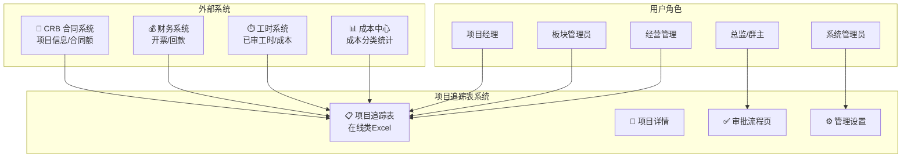

---

## 1. 角色与权限

### 1.1 角色定义

系统共设 **6 个角色**，权限分工如下：

| 角色 | 定位 | 编辑权限 | 审批权限 | 说明 |
|---|---|---|---|---|
| **系统管理员** | 系统运维 | ✅ | △ | 负责系统配置、审批人员配置、数据锁定/解锁、报表生成配置等；可按字段权限维护人工维护字段及系统调整字段的调整值，但不可修改公式字段和系统值；唯一可访问审计日志页；工具栏提供「提交归档」生成 J版（仅锁定期可用）；版本下拉仅系统管理员可见，可切换查看并下载历史 J 版 |
| **经营管理（只读）** | 汇总查阅 | ❌ | ❌ | 原「财务审核」扩展为经营管理只读用户（财务、板块/群非审批领导、公司管理层）。按数据范围（全公司/板块/项目群）过滤项目追踪表，始终只读；无审批流程、无审计日志、无管理设置。次月 1–3 日核查提醒横幅仍可见 |
| **板块管理员** | 数据管理 | ✅ | ❌ | 负责板块内数据汇总校验、异常数据处理；可见填报、审批流程；进入填报/报告线表单时加载最新数据；不可访问审计日志 |
| **项目经理** | 数据填报 | ✅ | ❌ | 负责本人管辖项目的产值、进度、WIP 分析填报，Excel 导入/导出 |
| **板块总监** | 审批决策 | ❌ | ✅ | 审批流程页查看本板块全部项目；只读查看；改数须驳回 |
| **项目群群主** | 审批决策 | ❌ | ✅ | 同板块总监；驳回后退回板块管理员修改 |

### 1.2 经营管理数据范围与平台配置来源

| 数据范围 | 可见项目 | 典型人员 |
|---|---|---|
| **全公司** | 全库（与系统管理员同视野，仅只读） | 公司管理层、财务汇总岗 |
| **板块** | 指定板块的所有项目 | 板块非审批领导 |
| **项目群** | 项目群所含板块下的全部项目 | 项目群非审批领导 |

**配置来源：** 上线后，经营管理、项目经理、板块总监、项目群群主等角色权限均来自平台全局权限；项目群与板块归属沿用平台原有配置，不在本系统内维护。原型阶段保留角色选择登录页，仅用于演示不同权限视角。

**双重角色处理：** 同一人兼「审批决策」与「经营管理查阅」时，上线后由平台全局权限决定其可用入口；原型演示中仍用不同账号/身份模拟。

#### 项目数据范围判定规则

- **按板块查看 / 管理：** 板块管理员、板块总监、板块范围经营管理等视角，按数据源中的**板块号 / 项目执行单位编码**决定项目归属。即使项目号暂未在工程平台注册，只要数据源中标明对应板块，也应归入该板块统一管理。
- **按项目经理查看 / 管理：** 项目经理视角按平台中“项目号对应的项目经理用户”判断，不直接取追踪表中的项目经理姓名列。系统应先用项目号查询平台绑定的项目经理，再与当前登录用户匹配，避免同名、改名或姓名文本不一致造成错配。
- **平台未登记项目：** 平台上没有的项目不由项目经理个人管理；这类项目按数据源板块号归入对应板块，由板块管理员统一维护、汇总和提交审批。

### 1.3 角色字段级权限矩阵

正式环境按字段的取值责任拆分为四类。字段类别决定值从哪里来，角色权限只决定谁能维护其中的人工部分；任何角色均不得修改公式结果和业务系统原始值。

| 字段类别 | 可编辑角色 | 额外约束 / 说明 |
|---|---|---|
| **项目号** | 全部只读 | 线上表格中不可编辑 |
| **公式字段** | 全部只读 | 由固定公式计算；任何人不得编辑公式或计算结果 |
| **人工维护字段** | 按字段配置授权系统管理员、板块管理员或项目经理 | 外部平台历史数据缺失或变更频率低，例如行业性质、客户性质；初始化后主要靠人工维护 |
| **系统直取字段** | 全部只读 | 业务系统为唯一权威来源，例如项目经理、项目开始/结束日期；业务事件发生时直接更新 |
| **系统调整字段—系统值** | 全部只读 | 合同额、开票、回款等由业务事件更新的原始值，人工不得覆盖 |
| **系统调整字段—调整值** | 按字段配置授权 | 用户编辑显示金额时，系统只保存“目标显示值 − 当前系统值”的差额 |
| **系统调整字段—显示值** | 不直接存为人工值 | 显示值 = 系统值 + 调整值；公式和报表统一使用显示值，后续系统值变化时调整值保持不变 |
| **月度预测与分析字段** | 按现有角色和月份窗口维护 | 仍属于人工维护字段；历史月份只读，报告月及未来月份按具体业务规则开放 |

### 1.4 用户与权限配置

系统管理员在管理设置中维护：
- **审批人员配置：** 系统自动获取平台中的项目执行板块列表；按板块在一张表格中维护三类审批链路负责人——板块管理员、板块审批、项目群审批
- **板块审批 / 项目群审批：** 列名不使用「板块总监」「群主」等称谓，避免与组织职务混淆；未单独配置时默认取自平台组织关系，也可指定其他管理人员承接审批职责
- **项目群审批列：** 按板块行展示，同一项目群下辖多个板块时共享同一项目群审批配置
- **总监审批跳过自动判断：** 若所选板块管理员在平台权限中同时具备该板块审批权限，则该板块提交审批后系统自动跳过板块审批节点，直接进入项目群审批；该判断不由系统管理员手工开关
- **不在本系统维护：** 项目经理、经营管理等填报与查看权限来自平台全局权限；项目群组织关系沿用平台原有配置
- **原型登录页：** 原型阶段保留角色/用户选择以演示不同权限；上线后由平台统一登录与权限识别，不提供角色切换界面

### 1.5 角色页面权限与默认路由

> **区分两类权限：** 本节先说明**哪些页面能进**；**审批相关操作**（提交审批、通过/驳回、归档）见下表「审批操作权限」，详细流程见 **§4.3**。

#### 1.5.1 页面可见性与路由

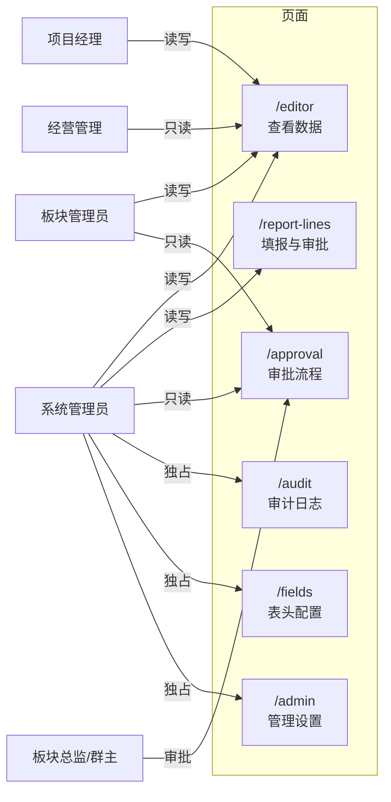

| 角色 | 可见页面 |
|---|---|
| **项目经理** | 填报与审批、查看数据 |
| **板块管理员** | 填报与审批、查看数据、审批流程 |
| **板块总监 / 项目群群主** | 填报与审批、审批流程 |
| **经营管理（只读）** | 查看数据（按配置权限的数据范围过滤，只读） |
| **系统管理员** | 全部页面（含唯一审计日志、表头配置、管理设置） |

- **审计日志、表头配置、管理设置**仅系统管理员可访问

- 登录后默认进入：多数角色 → 填报与审批；亦可从侧栏进入查看数据

  

## 2. 月度时间窗与锁定机制

### 2.1 月度时间窗（动态可配置）

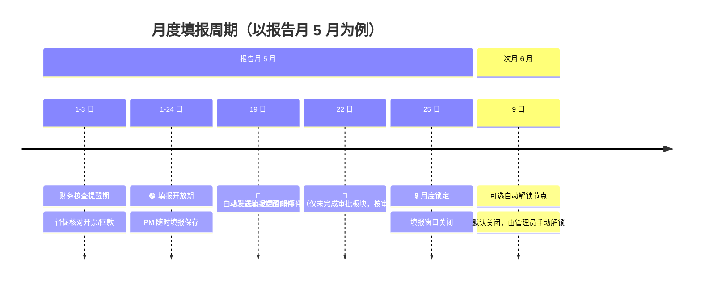

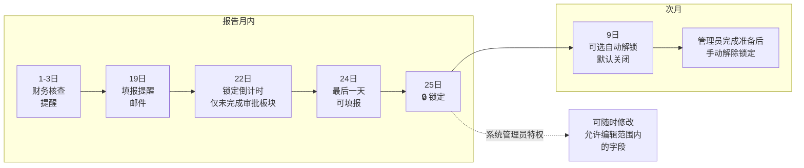

- **1 日～3 日：财务核查提醒期**（报告月次月 1–3 日，可配置）：系统向全员展示提醒（侧栏/填报页横幅），督促财务核对开票、回款、预收款等数据；不单独切换锁定状态，不赋予财务编辑权限。填报窗口仍按「月度锁定日/次月解禁日」及管理员手动锁定规则执行
- **填报提醒日（默认 19 日）：** 系统自动发送**提醒邮件**给各板块管理员，邮件内容包括：所负责板块的项目填报进度（已提交/未提交 PM 名单）、当前预警项目统计（存量开票/合同为负、完成额与工时不匹配）、全公司概要信息。仅在填报开放期（未锁定）发送
- **锁定倒计时提醒（默认锁定日前 3 天，如 22 日）：** 系统自动发送**倒计时邮件**，仅针对**未完成审批流程的板块**，根据审批流当前位置通知对应角色：未提交（draft）→ 板块管理员；总监审批中（approve1）→ 板块总监；群主审批中（approve2）→ 项目群群主。已完成审批的板块不发送。邮件内容包括距锁定日剩余天数、当前审批状态、操作提醒。无论当前是否锁定都发送
- **月度锁定日（默认 25 日）：** 报告月内当日 ≥ 锁定日时填报窗口关闭、数据冻结。除系统管理员外，任何人不可编辑（系统管理员仍受列级只读时间窗约束）
  - *管理员特权：* 系统管理员在锁定期可临时修改允许编辑范围内的字段（如 WIP 分析、未来月预测等），操作全程留痕；不可在线改写报告月当月及之前的开票/回款实际值列
- **次月解禁日（默认 9 日）：** 作为可选自动解锁节点保存；默认关闭自动解锁，需系统管理员手动「解除锁定」
- **动态调整：** 上述三个时间节点（提醒日/锁定日/解禁日）与「是否自动解锁」在管理设置中动态配置，以应对节假日或临时调整

### 2.2 锁定状态计算与刷新

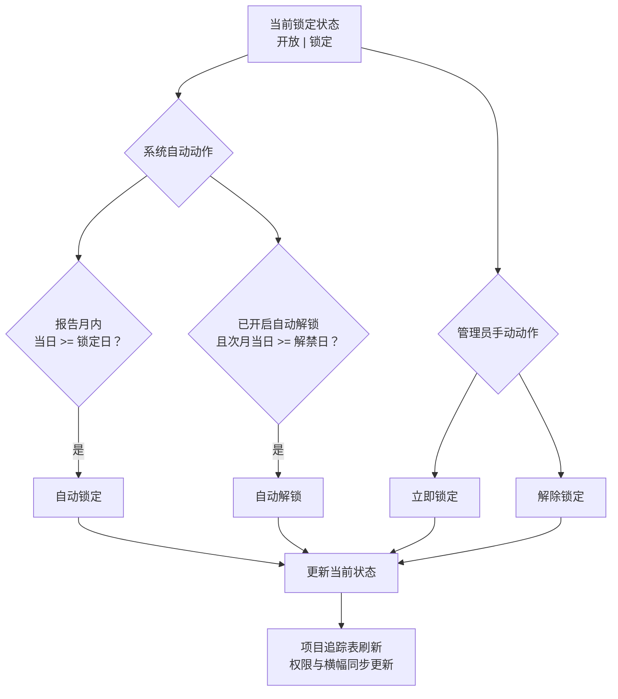

| 机制 | 行为 |
|---|---|
| **状态** | 系统只展示两种锁定状态：**开放** / **锁定** |
| **系统自动动作** | 报告月内当日 ≥ 锁定日 → 自动锁定；自动解锁默认关闭，只有开启后才会在报告月次月当日 ≥ 解禁日时自动开放 |
| **管理员手动动作** | 管理设置「立即锁定 / 解除锁定」与系统自动动作效果相同，都是把当前状态更新为锁定或开放，并写入审计日志 |
| **保存周期配置** | 保存报告月、锁定日、解禁日、自动解锁开关后立即按新配置刷新当前锁定状态，避免仍显示修改前的状态（如将锁定日 25 改为 27 后，25 日应立刻变为填报中） |
| **填报页横幅** | 锁定期文案读取锁定日配置（如「数据已锁定（每月27日）…」），不写死 25 日 |

### 2.3 列级只读动态时间窗（填报期内）

以原型中**报告月**（如 2026-05，即 5 月）为例，对**所有角色（含系统管理员）** 统一适用：

| 列组 | 可编辑月份（示例：报告月 5 月） | 数据性质 |
|---|---|---|
| **月度完成额**（1–12 月） | **5 月及之后** | 当月为项目经理手工填报的实际/计划完成额；之前月份为历史只读 |
| **月度开票** | **6 月及之后** | **当月**由工程平台的开票回款数据同步**实际开票**，只读；之后月份为**预测值**，可编辑 |
| **月度回款** | **6 月及之后** | **当月**由工程平台的开票回款数据同步**实际回款**，只读；之后月份为**预测值**，可编辑 |

- 非月度手工列（实施进展、WIP 分析等）不受上表月份窗限制；系统管理员在锁定期仍可编辑此类列
- Excel 导入合并同样跳过不可编辑月份格，避免覆盖当月开票/回款实际值
- 当前月完成合同额允许录入负值；主表格子可先写入负值，并在「本次由非负改为负」时自动打开项目详情抽屉、聚焦「备注」输入框并高亮提示
- 抽屉内将当前月完成额改为负时，失焦后同样聚焦并强调备注框
- 抽屉保存、以及 PM/板块提交时：若当前月完成额为负，备注不能为空
- Excel 导入允许当前月负值且无备注；提交时再拦截
- 当前月完成额从负改回非负时，备注保留、不清空
- 未来月份完成合同额（预测）不允许录入负值
- 历史月份完成额允许为负，不强制备注
- 「查看数据」与报告线详情保持同一套交互与校验

### 2.4 月度列属性动态判断

系统不会在每月开启填报时自动初始化或批量改写完成额、开票、回款数据。页面只根据当前**报告月份**动态判断每个月份列的业务属性与可编辑性：

| 列组 | 报告月当月 | 报告月之前 | 报告月之后 |
|---|---|---|---|
| **月度完成额** | 可编辑，作为本月填报值 | 历史只读 | 可编辑，作为未来计划/预测 |
| **月度开票** | 系统取值，只读 | 历史只读 | 可编辑，作为未来预测 |
| **月度回款** | 系统取值，只读 | 历史只读 | 可编辑，作为未来预测 |

- **系统取值**：指工程平台 / 财务业务事件写入的当月实际值；项目经理不可编辑。若字段被定义为系统调整字段，获授权用户只能维护独立调整值
- **完成额负值备注规则**：历史月份完成额允许为负且不强制备注；仅当“当前月份完成额 < 0”时，**抽屉保存与流程提交**要求备注非空。主表格子允许暂存负值以便引导填写备注；仅「本次由非负改为负」时自动弹引导，已是负值时不重复强弹。导入不拦备注，提交时兜底。
- **手动清零**：如需开启新一轮填报前清理报告月完成额，项目经理、板块管理员、系统管理员可在项目追踪表工具栏点击「清零当月完成额」，按当前用户可编辑项目范围清零（二次确认；审计合并为一条批量动作）
- **不自动执行**：切换报告月份、解除锁定、保存周期配置都不会自动清零或自动迁移月度列数据

### 2.5 填报周期配置（管理设置）

系统管理员在「填报周期配置」修改报告月、提醒日、锁定日、解禁日及「是否自动解锁」并保存；自动解锁默认关闭。 「数据锁定控制」提供**立即锁定 / 解除锁定**，动作结果与系统自动锁定 / 解锁一致，并全程审计。

### 2.6 提交审批后的填报锁定

- **触发（板块级）**：板块管理员对**本板块**点击「提交审批」并成功生成 Draft 快照后，系统设置该板块为已提交状态；各板块互不影响
- **填报页**：本板块「提交审批」按钮禁用并显示「已提交审批」；非系统管理员角色下，当本板块已提交时进入只读，与锁定期规则叠加
- **解除**：该板块审批驳回、管理员在管理页「从初始 Excel 恢复」时清除该板块标记；系统管理员在已提交状态下仍可编辑

---

## 3. 填报操作

### 3.1 填报模式总览

- **在线填报：** 支持在网页端直接修改单元格数据（基于在线类 Excel 表格）
- **填报视图：** 填报页仅展示在线表格，为默认且唯一可见的填报界面
- **工具栏视图筛选：** 「全部 / 有变化」位于表格上方工具栏
- **Excel 导入/导出：**
  - 支持下载模板（包含已锁定的基础数据列）
  - 支持用户上传填好的 Excel，系统自动解析更新
  - **权限控制：** 无论是线上还是 Excel，均需实现细粒度的单元格权限控制（只读 vs 可编辑）
  - **填报页 vs 管理页导入：** 管理设置页为全量覆盖项目库；填报页「上传导入」为按项目号合并，仅覆盖当前角色可编辑字段
- **信息折叠与排序：**
  - 基本信息等辅助信息可折叠，减少视觉干扰
  - **排序优化：** 当月有数据变动（工时/产值/开票/回款）的项目自动置顶，无变动项目置后

### 3.2 填报页面布局结构

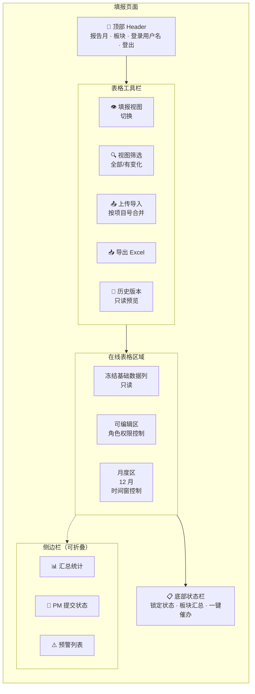

### 3.3 表格布局

与源 Excel（83 列字段字典）保持一致。

#### 3.3.1 列号对齐原则

| 约定 | 说明 |
|---|---|
| **无额外序号列** | 不在数据区左侧增加「# / 序号」列；行号由组件自带行头展示即可 |
| **列字母 = 字段字典** | 字段字典中的列号（A、B、E、F…）与表头列字母、公式引用列字母一一对应 |
| **公式引用** | 公式均按字段字典列字母书写（如 E5 表示字段 E、第 5 行） |

#### 3.3.2 行布局

| 行号 | 用途 |
|---|---|
| 0 | **小计**：金额列使用公式汇总可见行（列头筛选后随可见项目实时重算） |
| 1 | **合计**：金额列使用公式汇总全表（筛选后不变）；标签文案显示在项目名列 |
| 2 | 大类 / 分区标题行 |
| 3 | 字段中文标题行 |
| 4+ | 项目数据行（顺序与筛选结果一致） |

小计/合计置于大分类之上，默认筛选仅覆盖「字段标题行 + 数据行」，避免汇总行被筛掉。列头筛选确认或清除后，小计按当前可见行重算；合计保持全量合计口径。键盘 ↑↓←→ / Enter 在表内移动时跳过已筛掉的隐藏行。

#### 3.3.3 冻结与表头

- **冻结窗格：** 冻结至字段标题行（含小计、合计、大分类行）及项目号列左侧，横向滚动时保留项目识别关键列
- **表头展示：** 仅显示字段中文名（系统管理员可在表头配置维护）
- **可编辑列（表头 + 数据格）：** 当前角色、锁定状态下可编辑的列：
  - **表头：** 浅黄底 + 深黄字
  - **数据格：** 整列浅黄底，与变更浅橙、新增行浅绿按叠色优先级处理

#### 3.3.4 列宽与自定义宽度

- **列宽配置：** 支持按字段字典列字母配置窄列（如项目号、状态等）
- **防止被自动撑开：** 对已配置列宽的列，须同步设置自定义宽度标记，避免网格刷新后按单元格内容重算列宽导致配置失效
- **默认列宽：** 未单独配置的列按字段预设或合理默认宽度处理

#### 3.3.5 金额列格式

- **单元格类型：** 数值型，千分位格式（如 1,234.56）
- **水平对齐：** 右对齐，含数据行、公式格、小计/合计行及列标题行
- **可编辑格校验：** 静默拦截非数字输入；入库时去千分位后转数值
- **Excel 导入：** 自动识别千分位格式并规范化

#### 3.3.6 公式链与布局自适应

- **公式链：** 创建表格时预构建公式矩阵并配置公式链（先数据行公式，再小计/合计行），避免初始化时访问空行报错；加载后触发公式重算，保证汇总与公式计算正确显示
- **筛选与小计：** 列头筛选后小计仅合计当前可见行；合计仍为全表口径
- **布局自适应：** 侧栏折叠/展开时重算表格画布宽度，使表格区域随主内容区变宽/变窄

#### 3.3.7 日期字段与 Excel 序列号

部分日期列（如预测开票时间）在 Excel 内部常以序列号（如 45748）存储。若直接入库，提交刷新后会显示为数字而非日期格式。

**统一规则：**

| 环节 | 行为 |
|---|---|
| **保存 / 导入** | 将序列号、日期对象、文本统一为 YYYY-MM-DD 字符串再写入库 |
| **表格展示** | 日期格式显示，内部值为对应 Excel 序列日 |
| **Excel 导入** | 对日期类型列做同样规范化 |

**只读日期列**（如 CRB 同步的约定开始/结束时间）展示时同样走上述格式化，避免历史数据中的序列号裸显。

### 3.4 填报页工具栏

项目追踪表页自上而下：**业务工具栏** → **图例条**（可关闭）→ **表格工具栏** → **在线表格**画布。

#### 3.4.1 业务工具栏（紧凑）

| 区域 | 内容 |
|---|---|
| **左侧** | 「版本」下拉（仅系统管理员可见） → 填报期状态或快照提示条（二选一） |
| **右侧** | 导出 Excel · 清零当月完成额 · 上传导入（一组）｜ 保存 · 提交归档（仅锁定期可用） · 提交/提交审批（一组，竖线分隔）；不提供人工刷新或同步入口 |

**版本下拉逻辑（仅系统管理员可见）：**
- 项目经理、板块管理员、审批角色等**不显示**版本下拉框，始终查看当前填报数据
- **系统管理员**可在「当前填报」与历史 **J 版快照**之间切换；选择 J 版后表格进入只读模式，并可点击「下载此版本」导出该快照的 Excel 文件
- **快照提示条：** 当系统管理员切换到历史快照时，显示「当前正在查看快照 · {版本标签}」+ 下载按钮

**清零当月完成额：**
- 项目经理、板块管理员、系统管理员均可见；快照查看时隐藏
- 按当前用户可编辑项目范围执行：项目经理仅本人项目，板块管理员仅本板块，系统管理员为全公司
- 仅在当前角色对报告月完成额可编辑时可点；点击后需二次确认
- 确认后将范围内非 0 的报告月完成额清零；审计日志只记录一条批量动作（含项目数量与清零前合计金额），不逐项目生成审计记录

#### 3.4.2 表格工具栏（在线表格正上方）

| 控件 | 说明 |
|---|---|
| **项目筛选** | 单选：全部 / 新增 / 有变更 / 预警；与图例条联动 |
| **紧凑列勾选** | 仅显示核心字段列（隐藏低频列），减少横向滚动 |
| **图例说明条** | 可关闭；展示各底色含义（见 §5.3.3） |

#### 3.4.3 图例说明条

| 图例 | 含义 |
|---|---|
| 🟢 浅绿 | 新增项目行（相对 baseline） |
| 🟡 浅黄 | 当前可编辑列 |
| 🔵 浅蓝 | 系统引用值被覆盖 |
| 🟠 浅橙 + 左边框 | 有变更字段 |
| 🔴 浅红 + 红字 | 存量预警（R/S < 0） |
| ⬜ 灰白斑马纹 | 只读 / 公式 / 默认 |

图例条默认展开，可点击关闭按钮收起；关闭状态持久化于本地存储。

#### 3.4.4 在线表格配置与右键

- **内置顶栏：** 关闭（避免与业务工具栏重复）
- **公式/编辑栏：** 保留，还原单元格内容编辑栏
- **右键菜单：** 仅保留「复制」；禁用粘贴、插入/删除行列、冻结、排序、筛选选区等（列头筛选仍由默认筛选区提供）
- **键盘导航：** 列头筛选后，方向键与 Enter 跳过已隐藏行，不会落到看不见的行上

### 3.5 保存与导出

#### 3.5.1 保存

- **自动保存：** 单元格编辑失焦后自动保存（无需手动点击）
- **手动保存：** 工具栏「保存」按钮触发全表同步（含变更批注与高亮）
- **保存范围：** 仅保存当前角色可编辑的字段；只读字段跳过
  - 对于系统管理员，系统引用值列也属于可编辑的字段

- **保存反馈：** 保存成功后显示「已保存」提示；失败时显示错误详情

#### 3.5.2 导出 Excel

- **导出范围：** 当前 Luckysheet 视图项目（受角色权限、视图筛选「全部/有变化」影响）；**列始终为全部 83 列**（不受紧凑列勾选影响，便于 Excel 回导）
- **导出格式：** .xlsx，与在线表格一致：含小计/合计/分区/表头/数据行结构，保留千分位与日期格式、**Excel 公式**（含 `auto_calc` 与小计 `SUBTOTAL`/合计 `SUM`）、单元格背景色与对齐
- **权限控制：** 所有角色均可导出；导出内容与当前屏幕所见一致
- **文件名：** `查看数据_{报告月}_{YYYYMMDD_HHMMSS}.xlsx`；J 版快照为 `项目执行跟踪_{版本标签}.xlsx`

### 3.6 上传导入（填报页）

- **导入模式：** 按项目号合并，仅覆盖当前角色可编辑字段
- **导入校验：**
  - 项目号必须存在于库中（不新增项目）
  - 仅导入可编辑字段；只读字段跳过
  - 金额字段去千分位后转数值
  - 日期字段规范化为 YYYY-MM-DD
- **导入反馈：** 成功后显示「导入 N 条记录」；失败时显示错误行号与原因
- **权限控制：** 项目经理仅可导入本人项目；板块管理员可导入本板块项目；系统管理员可导入全公司项目
- **锁定限制：** 锁定期内仅系统管理员可导入；已提交的项目经理不可导入

### 3.7 项目详情 Drawer

点击项目号列（F 列）打开项目详情抽屉，展示该项目的完整信息与辅助数据。

#### 3.7.1 Drawer 入口与布局

- **入口：** 项目号列点击「查看」按钮或单元格本身
- **布局：** 右侧滑出宽抽屉（最大 1280px，窄屏不超过视口宽度）；顶部 Header 仅保留项目号、项目名称、关闭按钮与项目切换（上/下箭头）。
- **双栏主体：**
  1. **左侧项目基准：** 固定展示**项目号、项目名称**、客户、项目经理、执行单位、业务类型、**项目周期（单行：起始 ~ 结束）**（均为键值行；**不展示**企业属性、行业类别，也**不展示** A 列新/旧项目）；下方为三张同款进度卡——**合同完成率**（始累完成合同额 / 总合同额）、**开票进度**（始累开票 / 总合同额）、**回款进度**（始累回款 / 总合同额），均左侧大字百分比、右侧两项金额；再下列「WIP与应收账款」（WIP、应收账款），其下为「项目实施进展」（可按权限编辑）。
  2. **右侧业务 Tab：** 分为「经营预测」「WIP 分析」「工时与成本」，右侧内容独立滚动，切换 Tab 不改变未保存的填报内容。
- **经营预测：** 默认打开；上方保留完成合同额、完成开票额、完成回款额三组 KPI：「截止上年 / 当年累计 / 预测 / 剩余」（截止上年分别取 T/AA/AD；剩余分别按三项口径计算：**总合同额 − 截止上一年底累计值 − 当年累计 − 预测**；金额完整原值+千分位；「剩余」行高亮）；下方为「月度填报」12 行 × 3 列矩阵（列名：完成合同额、完成开票额、完成回款额）。历史月份灰色锁定；报告月**完成合同额**可填并显示角标「当月」（浅绿当前月样式）；报告月**开票/回款**取自系统实际值，视觉与历史月一致（无特殊底色、无角标），抽屉内不可填写；未来月份黄色预测态，可填格显示角标「预测」。矩阵下方提供「备注」多行输入框（对应表末 CF 列）；当前月完成额本次改为负值时自动聚焦并高亮该框。矩阵行高与间距加大，占满右侧剩余高度。不展示顶部「合同剩余 / 当年预测 / 当期历时」摘要条，以及「年度口径明细」折叠区。
- **WIP 分析：** 展示 WIP 成因、风险、账龄、因素分析、行动计划和预测开票时间；未产生 WIP 时显示提示，但仍允许按权限录入特殊情况。
- **工时与成本：** 独立 Tab；「工时数据」「成本数据」两个区块**始终完整展示（默认展开，无折叠收起）**；数据为平台辅助参考。
- **项目预警：** 有预警时在双栏主体上方以紧凑横条展示；无预警时不占位。
- **底栏操作：** 抽屉右下角固定「关闭」与「保存」。有编辑权限时可保存本抽屉修改；只读（历史版本预览、无关编辑权限等）时「保存」仍展示但禁用，并提示无法保存。
- **折叠默认：** 抽屉内各分区（含 WIP 分析）打开时一律默认展开；未产生 WIP 时仅提示、不自动收起。

#### 3.7.2 Drawer 项目预警区

- **显示条件：** 仅当存在至少一条预警时显示整块区域，否则不占位
- **预警类型：**
  - 累计开票超总合同额（AC > P）
  - 累计回款超总合同额（AF > P）
  - 累计回款超累计开票（AF > AC）
  - 存量合同额为负（S < 0）
  - 有完成额无工时
  - 有工时无完成额
- **视觉：** 以 pill 标签展示当前项目的预警项；开票/回款/存量类为红色背景 + 白色文字，工时不匹配类同为红色 pill

#### 3.7.3 Drawer 辅助区：工时统计

- **数据源：** 工时系统已审工时（仅已审，不含待审）
- **展示维度：**
  - 专业×月矩阵：各专业每月已审工时
  - 板块×月汇总：本板块每月已审工时
  - 工时/成本切换：可切换查看工时数或对应成本
- **明细与下钻：** 点击某月可查看该月明细（按专业展开）
- **无数据状态：** 仅显示「暂无已审工时记录」
- **完成额填报参考 Popover：** 聚焦报告月「月度完成」格时 Popover 展示总合同额、截止上月始累完成、当月已审工时与工时成本

#### 3.7.4 Drawer 辅助区：成本中心

- **数据源：** 平台成本中心数据
- **展示维度：** 成本项×月矩阵、明细与下钻
- **定位：** 作为产值/成本分析的辅助参考；不等同于成本法产值计算，不得作为填报或审批依据
- **无数据状态：** 仅显示「暂无成本记录」

### 3.8 历史版本查看

- **权限：** 仅系统管理员可使用版本切换；其他角色（项目经理、板块管理员、审批角色、经营管理）始终查看当前填报数据
- **入口：** 业务工具栏「版本」下拉（仅系统管理员可见）
- **可选范围：** 仅列出历史 **J 版快照**（公司归档版本），不含 I 版和 D 版
- **展示：** 只读模式展示选定 J 版快照的全量数据（在线表格），所有编辑操作禁用
- **下载：** 查看 J 版快照时，快照标签旁出现「下载此版本」按钮，点击导出该快照为 Excel 文件（文件名含版本标签信息）

### 3.9 侧边栏折叠

- **默认状态：** 展开
- **折叠/展开：** 点击侧边栏右边缘的折叠按钮
- **状态记忆：** 折叠状态写入浏览器本地存储，刷新后保持

---

## 4. 审批流程与版本快照

### 4.1 版本快照体系

快照仅三类：

| 类型 | 含义 | 范围 | 示例 |
|---|---|---|---|
| **I 版** | 导入初始化 | 全量 | I:20260501:ALL:01 |
| **D 版** | 板块提交审批（Draft） | 本板块 | D:20260520:SAS550:01 |
| **J 版** | 系统管理员公司归档 | 全量 | J:20260525:ALL:02 |

**流程**：

1. **空库/重新导入/重置导入** → 写入 I 版，并同步写入一份与当前项目追踪表一致的初始化 J 版；报告线 baseline = 最新 J
2. **板块管理员「提交审批」** → 追加 D 版（本板块子集）；板块锁定；驳回后可再次提交生成新版 D
3. **总监/群主审批通过** → 仅更新审批状态，不写快照
4. **系统管理员「提交归档」** → **仅在锁定期可提交**（开放期按钮禁用）；归档前自动保存未落库编辑；追加 J 版（全量）；更新 baseline；将当前报告月「核对归档中」报告线封账为「已完成」；**流程态归零**进入新一轮（PM 提交记录、各板块审批进度、公司归档进度均重置）；**锁定状态不变**；可多次提交

**J 版归档后重置范围（进入新一轮填报/审批）：**

| 重置 | 保留 |
|---|---|
| PM 提交记录（`pmSubmissions`） | J 版快照与 baseline |
| 各板块审批/提交状态 | 项目数据、历史 I/D/J 快照 |
| 公司归档进度（不再停留在「已归档」） | 锁定状态（open/locked） |
| 板块最新 D 版指针 | 审计日志（含本次归档记录） |
| 当前报告月「核对归档中」报告线 →「已完成」 | 历史已「已完成」的报告线数据（不再与主表同步） |

- **版本对比**：审批页可对 D/J 快照做差异对比（总监/群主审批页不提供）
- **填报页历史版本预览**：仅系统管理员可在工具栏选择 J 版快照只读展示并可下载（见 §3.8）
- **驳回**：总监/群主驳回 → 退回草稿 + 解除板块锁定，板块管理员修改后重新提交生成新 D 版

#### 完整审批流程时序图

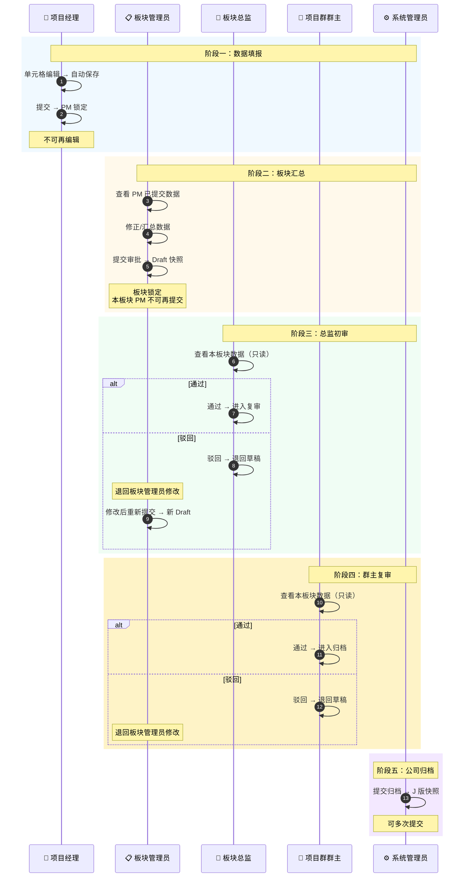

#### 快照生命周期

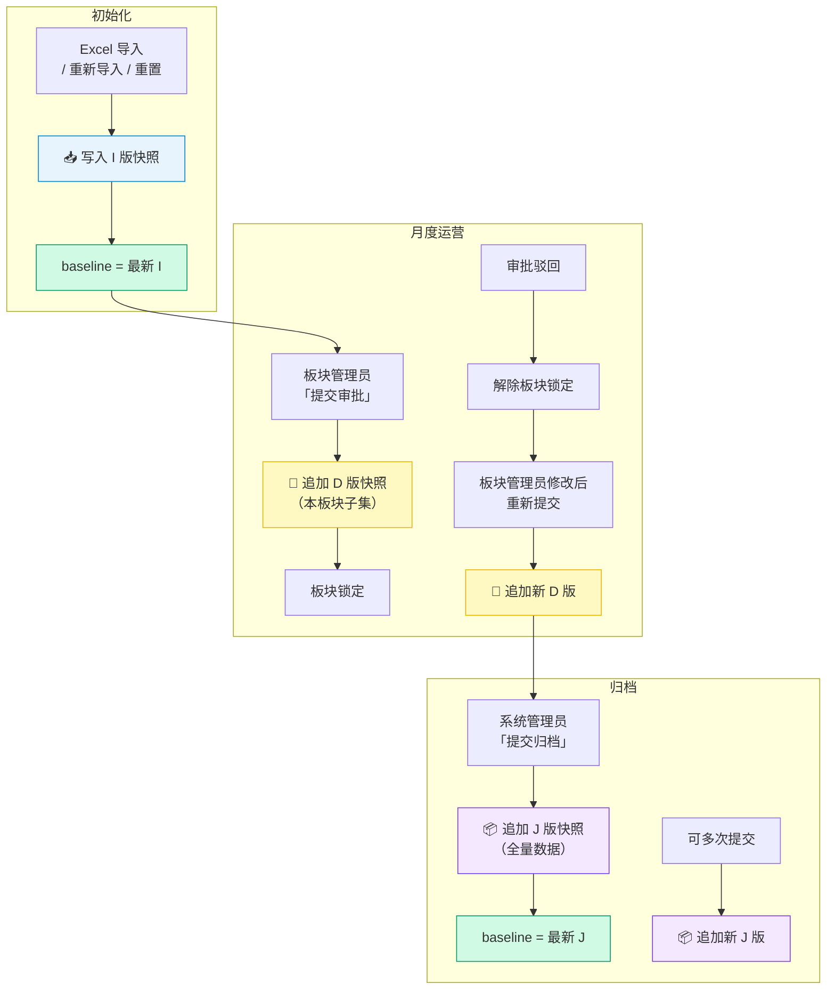

### 4.2 项目经理提交与板块汇总

项目经理的「提交」是面向板块管理员的内部汇报动作，不等同于板块「提交审批」（Draft）。默认每个项目经理每个报告月仅可提交一次；提交后锁定，不可再次编辑或重复提交；数据有问题由板块管理员在板块汇总表中直接修正。

#### 4.2.1 项目经理提交状态机

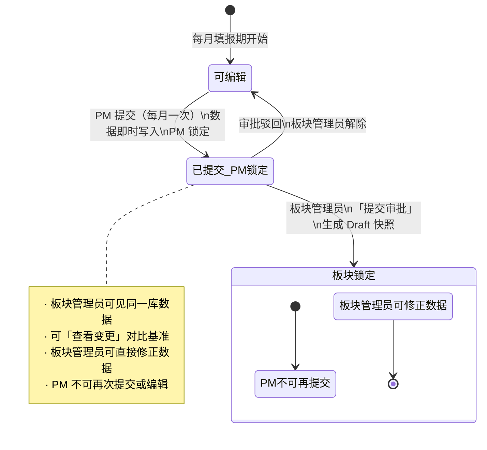

- **已取消「确认接收」**：项目经理提交后自动进入板块管理员视野；板块底栏列出「本月已提交 PM」，仅保留「查看更新内容」，无接收按钮
- **每月一次**：同一报告月内项目经理再次点击「提交」→ 提示已提交；前端按钮显示「已提交」并禁用
- **修正路径**：项目经理提交后发现错误 → 联系板块管理员在全板块表格中改数（板块管理员始终可编辑本板块项目，直至本板块提交审批）

#### 4.2.2 数据存储与填报基准

- 按报告月分桶，记录每个项目经理的提交状态、提交时间、项目号列表、项目数。不写项目经理快照
- 项目经理提交后视图始终读实时库数据（与板块管理员同步）
- 变更对比统一用 baseline（I/J 版）

#### 4.2.3 项目经理编辑保存与提交

- **单元格保存**：可编辑格变更失焦后自动写入，并合并更新变更字段列表、变更明细记录及审计日志
- **手动保存**：工具栏「保存」与提交前兜底均触发全表同步；保存结束后全表同步变更批注与高亮
- **Excel 导入**：项目经理可在填报页「上传导入」，仅合并本人项目可编辑列；已提交后锁定，不可导入
- **提交前兜底**：
  1. 结束未失焦的 Luckysheet 编辑态
  2. 等待正在进行的单元格异步保存完成
  3. 扫描所有可编辑的手工列，将未触发保存的值补写入库
  4. 存量合同额校验：范围内项目 S ≥ 0，否则中止提交并提示
  5. 将该项目经理名下项目全量同步至服务端
  6. 更新提交状态（仅更新状态，不写快照）
- **提交后**：项目经理锁定；再次进入表单时自动加载最新库数据，可看到板块管理员后续改数

#### 4.2.4 板块管理员操作

- 填报页底部显示「本月已提交 PM」面板（本板块项目经理，已提交状态），含「查看更新内容」；标题栏可**收起 / 展开** PM 卡片列表（默认展开）
- **「查看更新内容」**：baseline 快照 vs 当前报告线中该项目经理子集（手工输入列差异），弹窗只展示更新后的值，不展示更新前值
- **数据加载**：进入填报/报告线表单时自动加载最新库数据，视图仍仅见本板块；所有角色均不提供手动「刷新数据」按钮
- 汇总确认后点击「提交审批」→ 生成该板块 Draft，板块锁定，本板块项目经理不可再提交

#### 与「管理员全表」的差异说明

- 项目经理提交快照仅含本人名下的项目；板块管理员填报页为全板块项目
- 「查看更新内容」对比的是项目经理本轮改动，不是「提交版 vs 管理员整张表」

### 4.3 审批决策角色界面（板块总监 / 项目群群主）

#### 导航与顶栏

| 项 | 说明 |
|---|---|
| **侧栏** | 仅审批流程 |
| **顶栏** | 仅页面标题 + 用户菜单；不展示审批状态标签 |
| **内容区** | 审批页无内边距，右侧表格区纵向占满 |

#### 流程进度时间轴（三态）

| 状态 | 圆点样式 | 含义 |
|---|---|---|
| **已完成** | 品牌绿 + 勾 | 该步骤已结束 |
| **进行中** | 橙色 + 「···」 | 当前待处理步骤 |
| **未完成** | 灰色 + 步骤序号 | 尚未到达 |

**进行中节点计算**：审批状态表示上一节点已完成后的状态，而非「正在进行的节点」。示例：
- 草稿且未提交填报 → 节点 0（提交填报）进行中
- 草稿且已提交 → 节点 0 已完成、节点 1（板块总监初审）进行中
- 若该板块配置为“板块管理员同时为板块总监” → 板块管理员提交审批后，节点 1 自动完成，节点 2（群主复审）进行中
- 总监已通过 → 节点 0–1 已完成、节点 2（群主复审）进行中
- 群主已通过 → 节点 0–2 已完成、节点 3（归档）进行中
- 已归档 → 全部为已完成

#### 右侧在线表格（本板块当月全量 + 筛选）

- **数据范围**：本板块当月全部项目（与板块管理员填报范围一致），默认展示全部；表格工具栏单选：全部/新增/有变更；筛选结果为空时显示空状态文案
- **交互**：
  - 非待办节点或全局锁定：只读
  - 只读查看：板块总监、项目群群主在待办节点内仅可查看本板块数据；不可修改单元格或产生变更批注。若数据有误，使用「驳回」退回草稿，由板块管理员在填报页编辑后重新「提交审批」
- **视觉**：保留新增行底色、可编辑列浅黄（本角色无可用可编辑列时均为只读态）、变更格高亮与批注图例（可关闭）

#### 通过 / 驳回

| 操作 | 行为 |
|---|---|
| **通过** | 推进审批状态；仅当前待办角色可见按钮 |
| **驳回** | 与通过同一待办权限；回退草稿 + 解除板块锁定；提示「退回板块管理员」；可选填写驳回原因写入审计日志 |

**总监审批跳过：** 当系统管理员在管理设置中标记某板块“板块管理员同时为板块总监”时，该板块管理员点击「提交审批」后，系统仍生成 D 版 Draft 快照，但审批状态直接推进到“总监已通过 / 群主复审中”。群主仍需按正常流程复审；若群主驳回，流程退回板块管理员重新修改并提交。

#### 其他角色的审批页（对照）

- **板块管理员/财务等**：左侧流程进度时间轴（三态 + 图例）；右侧版本快照记录 + 版本差异对比，不嵌入在线表格
- **系统管理员**：使用独立审批页（十二板块并行流程卡片），无左侧四节点时间轴、无公司归档区、无版本快照列表；J版归档仅在项目追踪表工具栏「提交归档」

### 4.4 系统管理员：板块、审批页与填报管理进度

**需求背景**：公司各个执行单位（板块/中心）的审批流程并行、互不影响；系统管理员需在审批页纵览各板块审批状态，并通过「填报与审批」查看各板块填报进度。系统管理员仍可在「查看数据」工具栏提交 J版全公司归档。

#### 板块注册表

- **展示**：卡片/底栏使用板块编码 + 名称，如「SAS520 · 金山中心」
- **归一**：项目执行单位编码为短码时（如 S520），读写流程统一归一为完整编码（如 SAS520）
- **默认列表**：上线后来自平台项目执行板块；原型/本地环境保留固定所有的执行单位作为默认列表。系统启动时为每板块初始化审批流程状态

#### 分板块审批与公司 J 版归档

| 层级 | 说明 |
|---|---|
| **分板块流程** | 每板块独立维护审批状态（草稿/总监通过/群主通过）、是否已提交；各板块互不影响；若平台权限判断板块管理员兼任总监，则提交审批后自动跳过总监初审 |
| **分板块快照** | Draft:板块编码、Approve1:板块编码、Approve2:板块编码 等，仅含该板块项目 |
| **公司 J 版** | 全局 J版，含整库全部项目；系统管理员仅在**锁定期**可提交归档（开放期按钮禁用），不以「全部板块通过」为前置条件 |

#### 审批流程页

- **布局**：全宽卡片网格，每卡对应一板块，展示三步：提交填报 → 总监初审 → 群主复审（圆点三态：已完成/进行中/未完成）及流程状态标签
- **明确不做**：无「公司归档」汇总区；无「提交归档」按钮；无右侧「版本快照记录」；无版本差异对比
- **与总监/群主页**：后者为左侧时间轴 + 右侧在线表格；系统管理员为另一套 UI，互不混用

#### 查看数据底部进度入口

- **已移除**：系统管理员「查看数据」表格区下方不再展示「各板块进度」底栏。
- **查看位置**：各板块填报进度、提交状态、审批流转与快照导出统一在「填报与审批」列表/详情中查看。
- **保留能力**：「查看数据」继续作为全公司数据编辑、导出、系统引用刷新与 J版归档入口，不承担板块进度看板职责。

#### 与审批页、板块提交的关系

- **板块管理员**：提交本板块审批 → Draft:板块编码
- **板块总监/群主**：通过/驳回 → 推进/回退该板块审批状态
- **系统管理员**：审批页见上节；J版仅在填报页工具栏「提交归档」；归档状态通过版本记录与填报管理/审批页查看，不再通过项目追踪表底栏提示

---

## 5. 变更追踪与高亮

### 5.1 审计日志

- **全量记录**：任何数据的增、删、改（含在线编辑、Excel 导入、管理员解锁修改）均自动记录变更日志
- **日志维度**：操作人、操作时间、所属项目、修改字段、原值、新值、修改原因（可选）
- **审计支持**：支持按项目、人员、时间范围查询导出，满足财务与运营审计要求
- **审计日志页**：仅系统管理员可访问，提供查询、筛选与导出功能；人员/项目/字段筛选需兼容空字段，日期范围包含结束日全天，`0`、`0.00` 等有效值不得显示或导出为空

### 5.2 项目级变更元数据

除全局审计日志外，每个项目还携带：

- **变更字段列表**：本月有变更的字段列表（用于高亮与「仅看变更」筛选）
- **变更明细记录**：按字段索引的变更记录数组（操作角色、修改前值、修改后值、操作人、时间）；同一流程内不同角色对同一单元格的多次修改按序追加不覆盖；同一角色、同一旧值→新值的重复记录会去重

**批注与审计的关系**：单元格批注优先读变更明细记录；若无记录则回退至审计日志中该项目、该字段最近一条。

### 5.3 变更高亮机制

为提升填报与审批效率，系统自动识别并视觉强化本月变动数据：

#### 5.3.1 新增项目整行高亮

对比 baseline 指向的快照（首期无 J 时为 I 版），当前库中项目号不在 baseline 内的行标记为「新增项目行」。
- **I 版生成**：空库导入、重新导入、开发重置时写入
- **新增行底色**：浅绿

#### 5.3.2 可编辑列整列底色

在当前角色、锁定规则下可填报的字段，其数据格使用浅黄底，与「本月有变更」的浅橙底区分。
- **范围**：按字段 + 报告月时间窗判断（完成额当月及之后、开票/回款仅之后月份）；公式字段、系统直取字段、系统调整字段的系统值及窗外观列不适用

#### 5.3.3 单元格底色叠色优先级

同一格仅展示一种主底色，优先级从高到低：

| 优先级 | 场景 | 底色 / 样式 |
|---|---|---|
| 1 | **预警** | 浅红底 + 红字 |
| 2 | 本月有变更 | 浅橙 + 深橙字 + 左边框 |
| 3 | **存在人工调整值** | 浅蓝 + 批注展示系统值、调整值和显示值 |
| 4 | 当前可编辑列 | 浅黄 |
| 5 | 新增项目行（仅该行只读格） | 浅绿 |
| 6 | 只读 / 公式 / 斑马纹 | 灰白交替 |

即：**预警 > 变更 > 人工调整 > 可编辑列 > 新增项目行**。

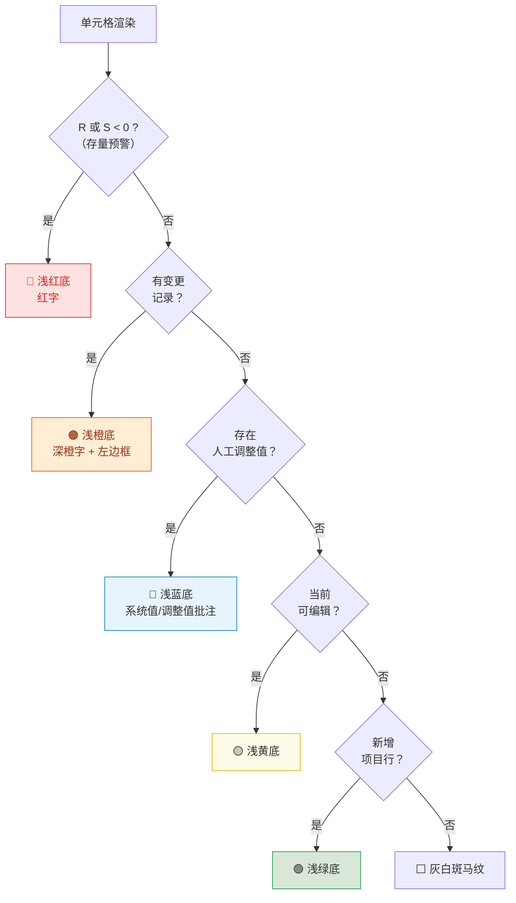

#### 5.3.4 变更单元格高亮

- **当月变更**：当月值与上月快照不一致的字段（含新填报、修正、系统同步更新）
- **未来预测变更**：修改了未来月份的预测数据（Forecast），同样视为变更并高亮显示

#### 5.3.5 联动计算高亮

因手工修改导致自动计算的字段（如 WIP、累计回款、差值等）发生数值变化时，该计算字段单元格同步触发高亮，确保用户感知数据变动。

### 5.4 变更批注

对有变更的格子自动附加批注，悬停/点击角标可查看；每条记录一行，格式为「【操作角色】修改前值 → 修改后值」（示例：【PM】0 → 100），不展示字段名与修改时间；不同角色对同一格的多次变更按时间顺序多行堆叠（如【PM】0 → 100 下一行【板块管理员】100 → 120）。

**去重规则**：以「角色 + 旧值 + 新值」为键去重，保留首次出现顺序。

- 在线编辑、保存、填报页 Excel 合并导入均会写入变更批注
- 板块总监/群主审批页为只读，不产生变更批注
- 公式重算后按行重新同步批注与高亮

### 5.5 视图过滤控制

填报页表格工具栏与总监/群主审批页均提供「全部 / 新增 / 有变更 / 预警」筛选，方便聚焦本月工作内容。

### 5.6 存量指标预警（R / S 列）

| 列 | 字段名 | 公式 | 业务含义 |
|---|---|---|---|
| **R** | **存量开票额** | = P − AC | 总合同额减始累开票。正数表示尚未开票的合同部分；小于 0 表示累计开票已超过总合同额 → 预警（允许存在，不阻断提交） |
| **S** | **存量合同额** | = P − U | 总合同额减始累完成。表示尚未完成的合同部分；不得为负；约束报告月及之前各月月度完成额的累计结果 |

- **预警样式**：R 或 S < 0 时，该格使用红字、红底
- **预警入口**：表格工具栏「项目预警」总览（全角色）；视图筛选仅保留「全部 / 有变化」，不再提供「预警」「新增」筛选
- **Drawer 项目预警**：项目详情 Drawer 在「跟踪信息填报」上方集中展示预警标签；无预警时不显示该区块

**完成额编辑校验**：
1. **手工完成额实时拦截**：项目经理、板块管理员、系统管理员编辑月度完成额时，若保存后会导致存量合同额（S）< 0，系统立即拒绝该输入并提示调减完成额或先完成 CRB 合同变更
2. **合同额事件或人工调整自动对冲**：仅当合同额业务事件更新系统值，或获授权用户修改合同额调整值后导致 S < 0 时，系统自动调减报告月月度完成额，并追加「系统自动对冲」变更批注；页面构表时不静默改写用户已填值
3. **未来月份预测总额实时拦截**：编辑任一月度完成额（含未来月份预测）时，系统校验「上一年底始累完成 + 1-12月完成额合计」不得超过 P 列总合同额；若超过，拒绝本次输入
4. **合同额核减场景**：若合同额事件或调整值变化导致 P 列总合同额核减，使已完成额加未来月份预测完成额超过 P，系统不自动调减完成额；用户需手动调整未来月份预测或完成 CRB 合同额变更
5. **提交阻断（兜底校验）**：项目经理「提交」、板块管理员「提交审批」前校验范围内全部项目 S ≥ 0，且已完成额加未来月份预测完成额 ≤ P；不满足则弹出汇总错误
   - **提示文案（提交失败）**：「有 N 个项目存量合同额为负…请调减完成额或完成 CRB 合同变更后再提交。」
   - **提示文案（预测超额）**：「有 N 个项目已完成额加未来月份预测完成额超过总合同额，请调整完成额预测或完成 CRB 合同额变更后再提交。」

**WIP 催开票校验**：
1. **必填规则**：当 AL「WIP（催开票）」非零时，AM「WIP形成原因」和 AO「高风险WIP」不能为空；项目经理提交、板块管理员提交审批前均需校验当前提交范围内全部项目。
2. **提交阻断**：若存在 AL 非零但 AM 或 AO 为空的项目，系统阻止提交并提示补充 WIP 形成原因和高风险 WIP 标记。
3. **归零清空**：当 AL「WIP（催开票）」因公式重算变为 0 时，系统自动清空 AM「WIP形成原因」、AN「原因说明」和 AO「高风险WIP」，避免无 WIP 项目保留过期分析内容。

**与业务事件的关系**：CRB 合同事件或财务开票事件更新后，R/S 会随公式重算变化；系统值更新不作为人工填报高亮，但预警色与筛选即时反映。

### 5.7 保留期限

在本轮填报 / 审批流程内，同一项目、同一单元格的历次编辑产生的变更批注均应保留（合并写入，不随后续保存覆盖）。

- **多角色连续修改**：项目经理修改某单元格并提交后，板块管理员应能看到该条变更；若板块管理员继续修改同一单元格并提交审批，则该单元格保留两条变更记录（如「PM：0 → 100」「板块管理员：100 → 120」），不覆盖前一条。
- **审批链路可见**：板块总监、项目群群主、系统管理员在后续审批 / 归档查看中，均应能看到本轮流程内该单元格累积的全部变更记录。
- **归档后沉淀**：系统管理员提交 J 版后，当前界面进入新一轮流程，变更高亮与本轮变更记录随新基准重置；旧流程的全部变更记录保留在已生成的 J 版快照中，用于历史回溯与审计。

---

## 6. 数据对接机制

> **说明：** 本章为"引擎室"——记录系统如何与外部工程平台交换数据、如何处理引用列与覆盖逻辑。

### 6.1 数据更新总览

- **初始化后由事件驱动：** 项目追踪表完成一次性初始化后，不再依赖用户刷新，也不以每日定时轮询作为正式更新方式。合同额变更、开票、回款、项目经理或项目周期变更等业务动作在源系统完成时，由对应业务功能主动触发追踪表更新。
- **无业务变化则不更新：** 若源业务系统没有产生相关变更事件，追踪表中的系统值保持不变，不因打开页面、重新登录或后台定时任务自行变化。
- **无人工同步入口：** 系统管理员、板块管理员及其他角色均不提供「刷新数据」「同步平台数据」等人工入口。进入页面仅加载追踪表当前已入库数据，不触发对源系统取数。
- **项目准入事件化：** CRB3 项目、EPC 执行拆分项目以及提前申报产值的前期项目，在源业务流程达到准入条件后触发新增或更新；以项目号和业务事件标识保证同一事件重复到达时不会重复建项。
- **字段级更新：** 每个事件只更新事件涉及的字段及其下游公式，不以整表覆盖方式处理。
- **审计：** 每次事件更新记录来源系统、业务类型、业务单据号或事件号、发生时间、接收时间、更新字段及更新前后值。
- **状态展示：** 页面可展示最近一次业务事件更新时间；该时间仅表示已接收事件的最新时间，不代表系统执行过主动刷新。

#### 6.1.1 平台新增项目取数规则

平台同步新增项目时，系统按项目业务类型决定实际入表的项目号与关键字段：

- **EPC 项目：** 后续上平台后的新增 EPC 项目必须在 CRB3 中完成执行拆分，系统只将拆分后的项目号加入项目追踪表，不再加入原始总项目号。例如 `D26999` 拆分为 `D26999_E`、`D26999_P`、`D26999_C`、`D26999_M` 后，只插入这些拆分项目号，`D26999` 本身不入表。
  - **EPC 拆分项目项目经理：** 取 CRB3「执行拆分」中对应拆分项的「执行经理」。
  - **EPC 拆分项目合同额：** 取 CRB3「执行拆分」中对应拆分项的「金额」。
  - **EPC 拆分项目税率：** 取 CRB3「含税报价」对应行的「增值税率」：`_E` 取 G.1，`_P` 取 G.2，`_C` 取 G.3，`_M` 取 G.1。
- **提前申报产值的前期项目：** 税率默认按 6%。
- **非 EPC 且非前期项目：** 税率取 CRB3「含税报价」中「不含税报价（元）」有填写的第一项对应的「增值税率」。若含税报价存在多个费率组合，先按第一项取值；该场景较少，后续如业务发现问题再调整规则。

#### 数据更新流程图

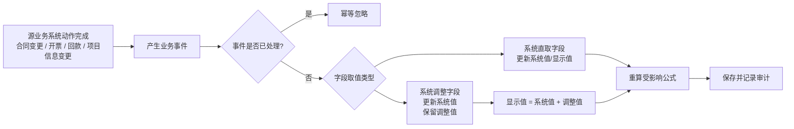

### 6.2 四类字段取值模型

| 字段类型 | 数据责任 | 用户编辑方式 | 业务事件到达后的处理 |
|---|---|---|---|
| **公式字段** | 系统公式 | 任何人不可编辑 | 重算受影响公式并更新结果 |
| **人工维护字段** | 获授权业务人员 | 直接维护字段值 | 不接收源系统事件，不被系统数据覆盖 |
| **系统直取字段** | 源业务系统 | 任何人不可编辑 | 用事件中的最新系统值更新显示值 |
| **系统调整字段** | 源业务系统 + 获授权业务人员 | 仅维护调整值；界面可按目标显示值录入 | 更新系统值、保留调整值，并重新计算显示值 |

#### 6.2.1 系统调整字段

- **值结构：** 每个系统调整字段至少保留系统值、调整值和显示值三个口径。
- **计算关系：** `显示值 = 系统值 + 调整值`。
- **人工修改：** 当用户将显示值由 100 修改为 110，而当前系统值为 100 时，保存的调整值为 10；用户不能把系统值改成 110。
- **后续系统更新：** 若系统值随后由 100 更新为 120，调整值仍为 10，显示值自动变为 130。
- **清除调整：** 用户执行“恢复系统值”时，将调整值归零，显示值随即等于系统值。
- **公式口径：** 所有下游公式、预警、汇总和导出均使用显示值；审计和问题排查可分别查看系统值与调整值。
- **权限与留痕：** 只有字段配置授权的角色可调整；每次调整记录调整前后值、操作人、原因和时间。

### 6.3 A 列「新/旧项目」（系统直取字段）

| 维度 | 规则 |
|---|---|
| **来源** | 系统直取字段；不再由公式按合同签署年计算，任何人不可编辑 |
| **系统判定** | 是否为报告年度新增项目：项目准入事件首次建项时默认「新项目」 |
| **已有项目** | 按项目首次准入年度与报告年度判断「新项目/旧项目」，不接受人工覆盖 |
| **年末 rollover** | 新报告年度开启事件触发全部项目重新分类；原有项目变为「旧项目」 |
| **初始化** | 初始化文件中的值用于建立首次分类；若为「新项目」，同时记录其首次准入年度 |

**与「新增项目行」高亮区分：** 「新增项目行」表示相对 baseline 新出现的项目号；A 列「新/旧项目」表示当年业务分类，二者独立。

### 6.4 合同额区（N / O / P）

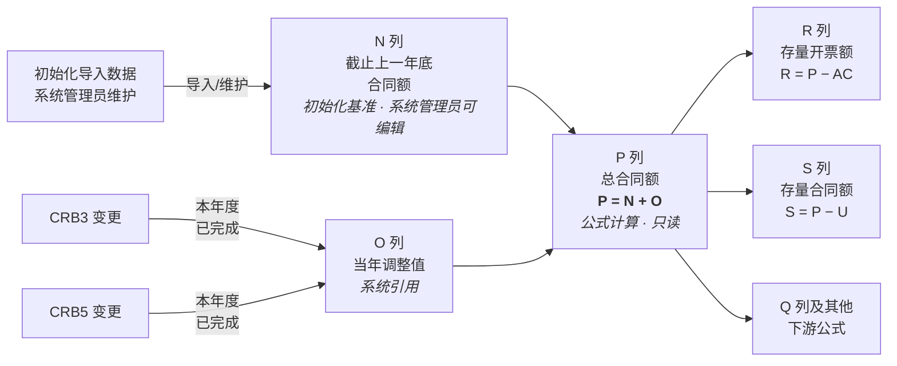

| 列 | 字段 | 来源 | 规则 |
|---|---|---|---|
| **N** | 截止上一年底合同额 | 初始化导入基准 | 取初始化导入文件中的值；平台新增项目均为本年度新增项目，无历史年度数据，默认 0；仅系统管理员可编辑 |
| **O** | 当年调整值 | 系统调整字段 | 业务含义为本报告年度已完成的 CRB3 与 CRB5 合同变更额；系统值由合同变更完成事件更新，人工修正只写独立调整值，O 显示值 = 系统值 + 调整值 |
| **P** | 总合同额 | 公式计算 | P = N + O；公式每次重算；前端不可编辑；下游 R/S/Q 等公式均以 P 为输入 |

**取值说明（O 列）：** CRB3、CRB5 为合同变更流程类型；流程完成时按项目号重新形成报告年度内两类变更合同金额的系统值。无当年变更时系统值为 0。为避免与本章“人工调整值”混淆，业务讨论中宜将 O 称为“当年合同变更额”，其人工修正差额另称“调整值”。

**与旧逻辑差异：** 不再由 O = P − N 反推；P 不再直接从 CRB 取 CRB1/CRB3 单值，而由基准 N 与当年增量 O 合成。

**初始化导入：** 将导入值作为上线时点的 O 显示值建立初始口径；正式事件接入时应拆分并确认系统值与调整值，导入后公式重算 P。

### 6.5 锁定期数据同步规则

- “填报锁定”控制人工编辑权限；“数据冻结窗口”控制业务事件是否写入，两者相互独立。
- 次月 1 日 00:00 起进入上月数据冻结窗口，暂停已有项目系统值更新、新项目准入以及公式业务月份切换；不存在人工绕过冻结的同步入口。
- 冻结期间，人工维护字段与系统调整字段的调整值仍按角色权限开放；公式继续使用待归档月份口径，并随人工调整重算。
- 次月自动归档恢复日（默认 8 日，后续可配置）先形成待归档月份的唯一月结 J 版，再切换公式月份并恢复业务事件处理。
- 归档失败时继续冻结；冻结期间到达的业务事件应可靠暂存，归档成功后按事件顺序补处理，不能丢失或重复应用。

### 6.6 初始化与正式事件接入

- 初始化是一次性迁移，不是日常同步入口；上线后不得通过重复导入或人工刷新覆盖正式数据。
- 初始化前需为每个字段确认四类取值类型，并为系统调整字段确认初始系统值、初始调整值和显示值。
- 对历史缺失较多的行业性质、客户性质等字段，初始化值直接作为人工维护字段值；后续由获授权业务人员维护。
- 系统直取字段以正式切换时点的源系统值为准；初始化文件仅用于迁移核对，切换后任何人不可编辑。
- 系统调整字段若只能取得初始显示值而无法还原历史差额，应由业务确认初始拆分口径；确认前不得默认将差异写入系统值。
- 正式事件接口上线前应完成项目号匹配、字段映射、重复事件、乱序事件及冻结期积压事件的联调验收。

---

## 7. 系统管理

### 7.1 表头配置

**入口**：系统管理员 → 侧栏「表头配置」
**权限**：仅系统管理员；其他角色访问将被重定向至首页

#### 7.1.1 定位与数据流

- **定位**：83 列字段字典的线上维护入口；与项目追踪表共用同一份运行时字典
- **加载**：用户打开系统时由服务端下发字段字典；填报页与表头配置页始终一致
- **保存后同步**：更新表头名称 → 填报页表头自动刷新；**无需**手动刷新浏览器

#### 7.1.2  UI 设计

| 区域 | 行为 |
|---|---|
| **顶栏冻结** | 页标题、操作按钮与（若有）未保存提示条作为一组，向下滚动时始终贴在视口顶部 |
| **未保存提示** | 修改表头名称后出现**整行**黄色提示条，含说明与「立即保存」；同时工具栏「保存表头」变为可点 |
| **统计与筛选** | 字段总数、来源类型统计；按来源类型筛选；搜索列号/表头名/说明 |
| **分区表格** | 按分区折叠展示；列：列号、表头名称（可编辑）、英文名、来源类型、数据类型、计算逻辑、说明 |
| **详情抽屉** | 「查看」只读展示枚举值、完整说明等（不可在此编辑） |

**当前仅开放编辑**：在线表格字段标题行的表头中文名，表格内联输入框修改。

**暂未开放（界面底部「待定」）**：列宽与隐藏、冻结窗格、数据验证、公式编辑、新增/删除列、分区调整、导入/导出 JSON 等。

#### 7.1.3 操作流程

1. 系统管理员进入表头配置，在竖向列表中修改目标列的表头名称
2. 顶部出现未保存提示条 → 点击「保存表头」或「立即保存」
3. 确认后写盘；项目追踪表表头即时更新（若当前在项目追踪表页）
4. 若仅改表头名，一般无需重启服务

**审计**：保存写入审计日志

### 7.2 审批人员配置

**入口**：系统管理员 → 侧栏「管理设置」→ 审批人员配置

**上线原则：**

- 本系统不新增/停用业务用户，也不维护项目经理、经营管理等填报角色权限；这些均由平台全局权限定义
- 系统自动获取平台中的项目执行板块列表；系统管理员按板块在**一张表格**中维护审批链路负责人
- 项目群组织关系沿用平台原有配置；本系统仅维护各项目群的审批负责人，不单独维护项目群结构

**表格列：**

| 列 | 说明 |
|---|---|
| 板块 | 来自平台项目执行板块；原型环境使用默认板块 |
| 板块管理员 | 下拉筛选平台用户；负责板块汇总与提交审批 |
| 板块审批 | 下拉筛选平台用户；负责板块级审批；未配置时默认取自平台组织关系 |
| 项目群审批 | 下拉筛选平台用户；负责项目群级终审；未配置时默认取自平台组织关系；同一项目群下辖多板块时各行列显示相同配置 |

**自动判断：** 「跳过板块审批节点」不在页面中手工配置。提交审批时，系统根据平台用户权限判断所选板块管理员是否同时具备该板块审批权限；若具备，则直接进入项目群审批。

**原型差异：** 原型仍保留登录页角色/用户选择，以便演示不同权限视角；上线后用户从平台统一登录，本系统不展示角色切换入口。

### 7.3 开发测试：环境重置

> 面向本地/联调环境，便于反复验证填报与审批流程；上线前建议隐藏或仅开放给系统管理员。

- **入口**：顶栏右上角用户下拉菜单 → 「重置为初始状态（开发）」（二次确认）
- **重置范围**：

| 项 | 行为 |
|---|---|
| 项目数据 | 从初始数据 Excel 重新导入，覆盖当前库 |
| 审批流程 | 回退草稿，解除板块锁定 |
| 快照与审计 | 清空后自动写入上一报告月对比快照，并剔除 5 条固定演示项目作为「本月新增」 |
| 填报周期 | 恢复默认值 |
| 锁定状态 | 清除当前锁定状态，按当前日期与周期配置重新计算 |
| 项目元数据 | 重导时清除变更明细记录、变更字段列表等，避免脏数据影响 |

- **演示新增项目**：初始数据约 20 条时固定为 5 条项目号；大库则均匀抽样 5 条
- **预警演示项目**：重导/重置后自动改写演示项目并注入演示工时，对应 Drawer 六类预警；另含「同项目多预警」样例：

| 预警标签 | 演示项目号 | 说明 |
|---|---|---|
| 累计开票超总合同额 | B25001-0042 | 单类型 |
| 累计回款超总合同额 | B25126-0003 | 单类型 |
| 累计回款超累计开票 | B25340 | 单类型（可与「有工时无完成额」同项目） |
| 存量合同额为负 | B24264-0038 | 单类型 |
| 有完成额无工时 | B25126-0003 | 单类型 |
| 有工时无完成额 | B25340 | 单类型 |
| 同项目多预警 | B24264-0039（金山中心 · 宋建生） | 同时命中累计开票超总合同额、存量合同额为负、有完成额无工时 |

- **与管理页差异**：管理设置中的「从初始 Excel 恢复」保留当前报告月份等配置，仅重导项目并清空快照/审计，但会同样自动重建上月对比快照；开发重置会连同周期配置一并恢复默认

### 7.4 系统管理员全局预警抽屉（已实现）

> 系统管理员专属的全公司维度预警汇总面板，聚合所有项目的活跃预警，便于快速定位风险项目并督促消除。

**入口**：查看数据 / 填报与审批报告线详情 / 审批页表格工具栏「项目预警」按钮（铃铛图标）；**所有角色**可见（查看快照时隐藏）。忽略与撤回仅系统管理员可用。

**触发与刷新**：打开抽屉时自动调用后端计算并返回当前报告月全部预警；每次打开均重新计算。

#### 7.4.1 预警卡片信息

每条预警以卡片形式展示（**同一项目命中多类预警时展示多张卡片**，按「项目 + 预警类型」各一条；忽略也按类型单独操作），包含：

| 信息项 | 说明 |
|---|---|
| 项目编号 | 项目唯一编号，点击可跳转打开该项目详情 Drawer |
| 项目名称 | 项目中文名称 |
| 预警类型 | 四类之一（见 §3.7.2 预警定义），以彩色标签区分 |
| 预警详情 | 具体数值描述（如「存量开票额 -12.34 万」） |
| 状态 | **活跃** 或 **已忽略**（筛选默认「全部」） |

#### 7.4.2 预警类型

与项目详情 Drawer（§3.7.2）一致，共六类：

| 预警类型 | 标签颜色 | 触发条件 |
|---|---|---|
| 累计开票超总合同额 | 红色 | 累计开票 AC > 总合同额 P |
| 累计回款超总合同额 | 红色 | 累计回款 AF > 总合同额 P |
| 累计回款超累计开票 | 红色 | 累计回款 AF > 累计开票 AC |
| 存量合同额为负 | 红色 | 项目合同存量（合同额 − 完成额）< 0 |
| 有完成额无工时 | 橙色 | 当月有完成额但无工时记录 |
| 有工时无完成额 | 橙色 | 当月有工时但无完成额记录 |

#### 7.4.3 筛选与搜索

| 功能 | 说明 |
|---|---|
| 关键词搜索 | 支持按项目编号、项目名称、预警类型关键词模糊匹配 |
| 预警类型筛选 | 下拉单选，按六类预警过滤 |
| 所属板块筛选 | 下拉单选，自动从当前数据中提取板块列表 |
| 状态筛选 | 全部（默认）/ 活跃 / 已忽略 |

#### 7.4.4 分页

- 默认每页 20 条，可切换 10 / 20 / 50 / 100
- 显示当前页码与筛选后总数

#### 7.4.5 预警持久化与状态管理

- 所有预警均持久化存储至数据库；仅保留 **活跃** 与 **已忽略**。条件不再满足时直接删除记录，不保留「已消除」历史
- 卡片底部仅展示操作区（忽略 / 已忽略+撤回），不展示首次检测时间
- 每次打开抽屉时，系统重新计算当前月预警：新出现的标记为活跃，已不存在的删除

#### 7.4.6 顶部统计栏

抽屉顶部显示当前活跃预警按类型统计的计数芯片，便于快速了解整体风险分布。

#### 7.4.7 交互

- 点击**活跃**预警卡片 → 关闭预警抽屉，自动打开对应项目详情 Drawer
- 点击**已忽略**预警卡片 → 无响应（可点「撤回」）
- 点击「重置筛选」按钮 → 清空所有筛选条件，恢复默认状态（状态=全部）

#### 7.4.8 手动忽略与撤回

> 系统管理员可对确认无需处理的预警执行忽略；忽略后可在「已忽略」列表中撤回。

- **入口**：每张活跃预警卡片右下角的「忽略」按钮
- **确认**：点击后弹出确认对话框，说明跨月生效，并可在「已忽略」中撤回
- **效果**：该项目的该类型预警不再出现在活跃列表，跨月生效；即使条件在未来月份仍满足，也不会自动重新激活
- **状态**：被忽略的预警以 `dismissed` 状态存储，卡片半透明 + 删除线（操作区除外），footer 标注「已忽略」并提供「撤回」
- **撤回**：在「已忽略」筛选下点击「撤回」→ 删除永久忽略记录并按当前条件重算（条件仍满足则回到活跃，否则直接删除该记录）
- **与自动消失的区别**：条件不满足时系统直接删除活跃记录；手动忽略（`dismissed`）是管理员主观决定，需主动撤回才会再进入活跃计算

### 7.5 填报与审批（报告线）

**入口**：侧栏「填报与审批」

「填报与审批」以「报告线」为核心数据单元，每条报告线对应一个板块在一个月度内的产值填报实例。

#### 7.5.0 列表页顶部：当月填报截止提醒

进入「填报与审批」列表页后，表格上方固定展示一条**当月填报截止提醒**：

- **展示内容：** 当前报告月，以及填报截止日为每月几日（例：「当前报告月 2026年6月，填报截止日为每月 25 日。」）
- **不展示：** 剩余天数、是否逾期、警示级别切换等倒计时信息
- **可见范围：** 所有可进入「填报与审批」的角色均可见；与列表筛选条件无关
- **配置来源：** 报告月与截止日均以管理设置中的填报周期配置为准；修改配置并保存后刷新页面即可看到更新

#### 7.5.0a 列表双状态列：报告线状态与我的状态

填报与审批列表表格列顺序为：**我的状态** → **报告线状态** → 周期 → 板块 → 操作。

- **报告线状态：** 整条报告线（板块×周期）的工作流状态，文案见下节「报告线状态」表；筛选区「报告线状态」下拉仍只按此列筛选。
- **我的状态：** 相对当前登录用户的个人进度，按角色差异化：

| 角色 | 我的状态文案 |
|---|---|
| 项目经理 | **待提交** / **已提交** / **已关闭**（退回后恢复为待提交，不单独展示「已退回」） |
| 板块管理员 | **待提交审批** / **已提交审批** / **核对归档中** / **已完成** / **已关闭** |
| 板块总监 | **等待中** / **待我审批** / **已审批** / **已关闭** |
| 项目群群主 | **等待中** / **待我审批** / **已审批** / **已关闭** |
| 系统管理员等 | **—** |

映射规则简述：PM 取本人在该报告线的提交记录；板块管理员与审批角色由报告线工作流状态推导（例如总监在「板块领导审批中」为待我审批，进入群主审批、核对归档中或已完成为已审批；板块管理员在「核对归档中」显示核对归档中）。

#### 7.5.1 发起填报

每月填报周期的开启由系统管理员**手动发起**，不自动分发。

**操作步骤：**

1. 系统管理员进入「填报与审批」页，点击右上角**「发起填报」**按钮（其他角色不可见）
2. 弹窗自动加载预览信息，包含四块内容：
   - **周期信息（只读）**：当前报告月（来自管理设置）和 J 版 baseline 版本号（来自最新归档版本）
   - **分发列配置**：默认「全部列」；切换为「自定义」后可按字段区域（section）勾选本次分发给各板块/PM 的字段列，本次发起对所有板块使用同一套列配置
   - **审批人员核对表**：以表格形式列出所有板块的审批链路人员（板块管理员、板块审批、项目群审批），及各板块的项目数和报告线是否已存在
   - **发起摘要**：将创建的条数、已存在（将跳过）的条数、人员未配置的板块数
3. 管理员核对后点击**「确认发起」**
4. 系统为所有尚未创建报告线的板块批量创建「开放填报」状态的报告线，并初始化项目数据（含分发列配置）
5. 成功后关闭弹窗，刷新列表

**分发列规则：**

- 选择「全部列」时，填报界面与项目追踪表完全一致，全部 83 列均可见（受角色权限控制可编辑范围）
- 选择「自定义」时，管理员可按字段区域勾选本次需要分发的列；项目经理（E）、项目号（F）、项目名称（G）三列**强制显示**，不可取消
- 未选中的列在各角色填报界面（Luckysheet）**隐藏**，但后台 `field_data` 仍保留从 J 版 fork 的全量数据，公式计算、diff 对比、后续审批和导出（导出也按分发列过滤）均不受影响
- 分发列配置与报告线绑定，每次手动发起均独立设置；历史报告线无配置时默认显示全部列

**约束：**

- 报告月和 baseline J 版均为**只读**，不可在弹窗中更改
- 初始化/重置流程会自动生成初始化 J 版；若因异常导致当前无 J 版快照，发起按钮**禁用**，并提示先完成归档或重新初始化
- 若当月所有板块的报告线均已存在，发起按钮也**禁用**，并提示无需重复发起
- 已存在同月同板块报告线的将**跳过**，不会覆盖现有数据

**审批人员来源说明：**

| 来源标签 | 说明 |
|---|---|
| 已配置 | 管理员在「审批人员配置」中手工指定 |
| 平台默认 | 未手工指定，系统从平台用户关系中自动取同板块/群的审批人 |
| 未配置 | 既无手工配置，也无法从平台关系中匹配到，需在「审批人员配置」补充 |

#### 7.5.2 报告线状态

| 状态 | 含义 | 触发条件 |
|---|---|---|
| 开放填报 | 板块管理员和 PM 可编辑 | 发起填报时创建 |
| 审批中（板块领导） | 板块领导审批阶段 | 板块管理员提交审批 |
| 审批中（群主） | 群主终审阶段 | 板块领导审批通过 |
| 已退回 | 被退回，需重新编辑 | 板块领导或群主退回 |
| 核对归档中 | 填报/审批已结束，等待系统管理员在主表核对；报告线全部只读，随主表保存同步 | 群主审批通过，或截止填报日/强制结束 |
| 已完成 | 已随公司归档封账，不再与主表同步 | 系统管理员「提交归档」 |
| 已关闭 | 周期结束关闭（预留） | 管理员操作 |

当系统日期达到填报周期配置中的**截止填报日期**后，当前报告月所有未进入「核对归档中 / 已完成」的报告线自动转为「核对归档中」；流转轨迹追加「逾期自动完结」节点。管理设置「自动结束当前所有报告线」触发同一逻辑。

**核对归档中期间：**

- 报告线对所有角色（含系统管理员）只读；改数只在「查看数据」进行。
- 系统管理员在「查看数据」保存成功后，按项目号把变更同步到当前报告月处于「核对归档中」的报告线（仅覆盖报告线中已有项目，不新增、不删除）。
- 「已完成」报告线不被主表保存覆盖。

#### 7.5.3 报告线填报页

从「填报与审批」进入某条报告线后，填报页应与系统管理员使用的「查看数据」保持**完全一致**的类 Excel 填报体验：

- 页面主体使用同一套 Luckysheet 表格，表头、冻结列、字段分区色、可编辑列浅色标识、公式计算、小计/合计行、视图筛选和「仅显示项目信息与可编辑列」交互均与「查看数据」一致。
- 页面顶部业务工具栏保持一行展示：左侧显示「返回填报与审批」、板块、报告月、报告线状态；右侧显示「导出 Excel」「保存」以及按角色/状态出现的「提交填报」「提交审批」「审批通过」「退回」等按钮。
- 所有角色均不展示「刷新数据」或「同步平台数据」按钮；每次进入报告线表单时只加载当前报告线已入库的最新数据。
- 填报数据范围按当前角色权限展示：PM 只处理自己权限内项目，板块管理员处理本板块报告线项目，审批角色以只读方式查看对应审批范围；界面本身不再使用全局锁定/解锁概念控制报告线可编辑性。
- 报告线为「开放填报 / 已退回」且用户具备填报权限时可编辑；进入查看或审批模式、报告线处于「核对归档中 / 已完成 / 已关闭」时为只读。
- PM 在某条报告线中提交后，本人视角下「提交填报」按钮显示为「已提交」并禁用，同时该报告线进入本人只读状态；若后续被退回并恢复为可填报状态，按钮恢复为「提交填报」。
- 编辑保存后再次进入同一报告线，应保留已保存的项目基础信息和填报值；不得出现仅项目编号有值、其他列空白的情况。
- 在项目详情 Drawer 中编辑可填项并点击「保存」后，当前报告线外部表格应立即显示更新后的值，并保留对应变更高亮/批注；该保存只作用于当前报告线数据。
- 报告线页面的保存、提交、审批、导出均作用于当前报告线，不直接修改主「项目追踪表」的全局数据。
- 报告线 PM 提交、板块管理员提交审批前，系统需先保存当前 Luckysheet 数据并执行与「项目追踪表」一致的存量合同额校验、未来月份完成额预测总额校验和 WIP 催开票必填校验；若当前提交范围内存在 S 列（合同额 − 累计完成额）< 0、已完成额加未来月份预测完成额超过 P 列总合同额，或 AL「WIP（催开票）」非零但 AM/AO 未填写的项目，提交被阻止并提示补充/修正。
- 报告线页面在 PM / 板块管理员具备可编辑权限时提供「上传导入」：按项目号合并当前报告线内可见项目，仅覆盖当前角色可编辑字段；若该报告线配置了分发列，未分发/隐藏字段在导入时也跳过，导入结果只写入当前报告线，不直接修改主「项目追踪表」。
- PM 进入报告线详情页时只能看到 `pm_name` 匹配本人的项目；即使底层报告线是板块级数据容器，也不得展示同板块其他 PM 的项目。
- 板块管理员在报告线详情页应保留「项目经理提交情况」功能：能看到该报告线下全部 PM 的状态（未提交/已提交/已接收/已退回/已关闭）、每位 PM 的项目数量和提交时间，并可进入「查看更新内容」查看该 PM 相对报告线基准的可编辑字段更新后值。
- 非当前报告月的历史报告线仅提供「查看」和「导出」，不再提供填报、提交或审批操作。
- PM 导出历史报告线时，导出文件仅包含本人项目，不包含同板块其他 PM 的项目。

#### 7.5.4 查看流转轨迹

填报管理列表的每条报告线均提供**「流转轨迹」**操作入口，所有可见该报告线的角色（系统管理员、板块管理员、板块总监、项目群群主、PM）均可点击查看，不受报告线状态限制。

点击后弹窗顶部展示报告线摘要（板块、周期、当前状态、项目数），主体为纵向时间线，节点按时间升序排列，包含以下内容：

| 节点类型 | 触发时机 | 显示信息 |
|---|---|---|
| **提交** | 板块管理员提交审批 | 操作人、备注，并提供「导出提交快照」 |
| **审批通过** | 板块总监 / 群主通过审批 | 操作人、备注 |
| **退回** | 板块总监 / 群主退回 | 操作人、角色、备注（退回原因） |
| **自动跳过节点** | 审批节点因配置或权限被自动跳过 | 操作人、备注 |
| **逾期自动完结** | 截止填报日期到期或管理员测试按钮触发 | 系统/管理员、自动提交并审批通过说明 |

轨迹弹窗不展示系统管理员发起节点，也不展示项目经理提交节点；若过滤后无可展示的审批流记录，弹窗显示「暂无流转记录，报告线尚未发生提交或审批动作」空状态提示。

---

## 8. 业务规则

### 8.1 数据源定义

| 数据类型 | 数据源 | 说明 |
|---|---|---|
| **项目基本信息** | 按字段分类 | 项目经理、开始/结束日期等为系统直取字段；行业性质、客户性质等因平台历史数据缺失且变更频率低，作为人工维护字段；详见 §6.2 与附录A.2 |
| **合同签署状态** | CRB | 系统自动判定，详细见**附录A.2** |
| **截止上一年底合同额（N）** | 初始化导入数据 | 取初始化导入文件中的历史基准值；平台新增项目为本年度新增，无历史年度数据，默认 0；仅系统管理员可编辑 |
| **截止上一年底始累完成（T）** | 初始化导入数据 | 取初始化导入文件中的历史基准值；平台新增项目默认 0；仅系统管理员可编辑 |
| **当年调整值（O）** | CRB + 人工调整 | 本项目报告年度内已完成的 CRB3 + CRB5 合同变更额作为系统值；显示值 = 系统值 + 调整值，见 §6.4 |
| **总合同额（P）** | 系统计算 | P = N + O；公式重算，非 CRB 直取 |
| **开票金额** | 工程平台开票回款模块 + 人工调整 | 报告月当月实际开票由开票事件更新系统值，显示值 = 系统值 + 调整值；之后月份为项目经理填报的预测值 |
| **回款金额** | 工程平台开票回款模块 + 人工调整 | 报告月当月实际回款由回款事件更新系统值，显示值 = 系统值 + 调整值；之后月份为预测值 |
| **存量开票额（R）** | 系统计算 | P − AC；小于 0 为预警（累计开票超合同），见 §5.7 |
| **存量合同额（S）** | 系统计算 | P − U；不得为负；约束月度完成额累计，见 §5.7 |

### 8.2 项目准入与"提前申报产值"规则

- **正常准入**：所有已签署合同的项目自动进入追踪表
- **提前申报产值（未签署项目）**：
  1. **发起**：针对尚未签署合同但已开展工作需申报产值的项目，由项目经理发起"提前申报产值"流程
  2. **审批**：审批通过后，该项目允许进入当期追踪表，此时"合同是否签署"字段显示为"未签署"
  3. **状态联动**：若后续该项目在 CRB 中完成签署（状态变更为"已确认"），系统自动将追踪表中该项目的状态更新为"已签署"
- **前期项目号规范化**：平台上的"前期项目"可能使用带板块编码后缀的临时编号，例如 `B26001_SAS20`；追踪表 F 列不展示该后缀，统一使用正式项目号（如 `B26001`）。这类项目均为未签署状态，因此可通过"合同是否签署=未签署" + "去除板块后缀后的正式项目号"关联追踪表项目与平台前期项目信息。
- **数据隔离**：未签署且未通过提前申报审批的项目，不可见于追踪表中

### 8.3 产值申报规则

- **填报依据**：目前公司允许多种方式并行（形象进度、人工时比例、设计进度交付物等），由项目经理自行判断填报
- **闭环要求**：过程允许偏差，但最终累计完成合同额必须 = 合同总额
- **存量合同额约束**：手工编辑月度完成额时实时拦截会导致 S < 0 的输入；合同额业务事件或获授权用户维护调整值导致 S < 0 时，系统自动调减报告月完成额并留「系统自动对冲」批注；提交时兜底校验全部 S ≥ 0（§5.7）
- **全年完成预测约束**：已完成额加未来月份预测完成额不得超过 P 列总合同额；合同额核减导致超额时不自动调减完成额，由用户调整预测或完成合同额变更
- **存量开票额提示**：存量开票额（R = P − AC）为负时仅作预警展示（红底红字），不阻断提交，便于发现累计开票超合同情况
- **新/旧项目自动判定**：根据合同签署年份自动标记（见 §6.3）：
  - 新项目：当年新签
  - 旧项目：往年签约延续

### 8.4 财务与 WIP 规则

- **预收款定义**：未开票但已收到的款项（与合同是否签署无关）
  - 已开票 + 回款 = 正常回款
  - 未开票 + 回款 = 预收款
- **WIP 账龄分段**：<1个月、1~3个月、3~6个月、6~12个月、1~2年、2~3年、>3年
- **WIP 成因分类**：A(到节点未付)、B(单价合同未到节点)、C(总价合同未到节点)、D(其它)
- **WIP 催开票闭环**：AL「WIP（催开票）」非零表示该项目存在需解释和跟进的 WIP，提交前必须填写 AM「WIP形成原因」和 AO「高风险WIP」；当 AL 归零时，AM、AN「原因说明」、AO 自动清空。
- **自动化报表**：
  - **WIP 分析报告**：每月自动生成 PDF 格式的 WIP 分析报告（账龄分析、风险预警、改进建议）
  - **分层输出**：报告按板块级、项目群级、公司级分别生成
  - **预警通知**：当 WIP > 合同额 50% 时，系统自动向对应中心和板块发送预警

### 8.5 动态年份与历史归档机制

针对跨年场景，系统需保留相对年份字段命名，并通过初始化导入 / 系统管理员维护形成新年度历史基准：

1. **字段名动态化**：
   - 界面显示不再包含具体年份（如"25 年底"），改为相对年份描述：
     - 截止上一年底 (Cut-off Previous Year End)
     - 当年调整值 (Current Year Adjustment)
     - 当年期初存量 (Current Year Backlog)
   - 字段标题保持相对口径，不随具体年份改名

2. **新年度基准维护逻辑**：
   - **基准来源**：N「截止上一年底合同额」与 T「截止上一年底始累完成」不从平台自动取值，也不由系统跨年自动抓取；它们使用初始化导入文件中的值作为历史基准
   - **新增项目默认值**：平台后续新增项目均为本年度新增项目，没有上一年度历史数据，N 与 T 默认 0
   - **维护权限**：如历史基准需调整，仅系统管理员可编辑
   - **调整值归零**：新年 O（当年调整值）由 CRB 重新累计（当年 CRB3/CRB5 完成额之和）；无变更时为 0，不由项目经理手工填报

3. **历史数据保留**：
   - 前端追踪表只展示"截止上一年底"的当前切片
   - 历史版本通过 I/J 快照与初始化导入数据留痕，用于审计和历史对比

#### 新年度初始化基准维护流程图

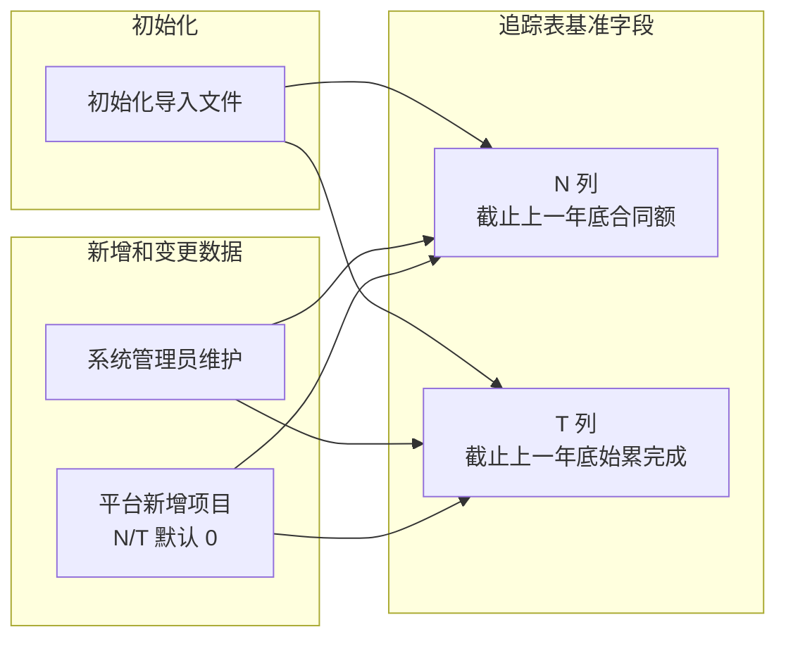

#### 新旧项目跨年 Rollover

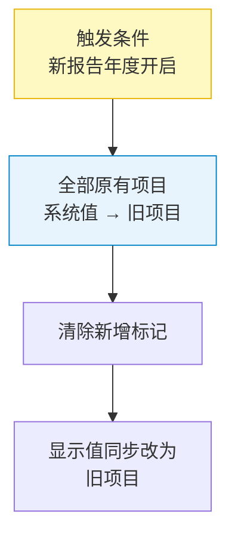

---

## 附录

### A. 数据范围与背景

#### A.1 项目范围
- **覆盖范围**：公司所有已签署合同的项目 + 提前申报产值的项目
  - 已签署项目由合同准入事件触发进入
  - 提前申报产值项目由前期项目审批通过事件触发进入

- **涉及中心**：线上化系统需覆盖所有项目执行中心，各中心分别填报，最终汇总

#### A.2 业务事件字段清单

以下字段由工程平台 / 财务业务事件或系统规则形成系统值。系统直取字段任何人不可编辑；系统调整字段只允许获授权用户维护调整值。“平台数据来源”列预留给业务侧补充具体来源。

| 列 | 字段 | 数据范围 / 取值口径 | 平台数据来源说明 |
|---|---|---|---|
| A | 新、旧项目 | 按报告年度判断项目是否为当年新增；平台新增项目默认为新项目，跨年 rollover 为旧项目 |  |
| B | 约定开始时间 | 合同约定项目开始日期 | CRB1 / CRB3 |
| C | 约定结束时间 | 合同约定项目结束日期 | CRB1 / CRB3 |
| D | 执行单位编码 | 项目负责执行单位 / 中心编码 | CRB1 / CRB3 / CRB5 |
| E | 项目经理 | 项目当前负责人；EPC 拆分项目取 CRB3「执行拆分」对应拆分项的「执行经理」 | CRB1 / CRB3 / CRB5；EPC 拆分项目取 CRB3 执行拆分 |
| F | 项目号 | 项目唯一编号，作为主键；平台前期项目如带板块后缀（例：`B26001_SAS20`），追踪表展示去后缀后的正式项目号（例：`B26001`）；新增 EPC 项目只插入 CRB3 执行拆分后的项目号，不插入原始总项目号 | CRB1 / CRB3；前期项目按去后缀项目号关联；EPC 项目按 CRB3 执行拆分项目号入表 |
| G | 项目名称 | 项目全称 | CRB1 / CRB3 |
| H | 客户名称 | 甲方客户全称 | CRB1 / CRB3 |
| K | 业务类型 | 项目所属业务类型分类 | CRB1 / CRB3 |
| L | 合同是否签署 | 根据合同状态判定：CRB 状态为「已确认」显示「已签署」，否则显示「未签署」 | CRB3确认完成的项目都是“已签署”，“提前申报产值”的前期项目都是“未签署” |
| O | 当年调整值 | 报告年度内已完成的 CRB3 与 CRB5 合同额之和；新增 EPC 拆分项目合同额取 CRB3「执行拆分」对应拆分项的「金额」 | 本年度确认完成的 CRB3 & CRB5；EPC 拆分项目取 CRB3 执行拆分金额 |
| Y | 税率 | 合同适用税率；EPC 拆分项目按 CRB3「含税报价」G.1/G.2/G.3/G.1 分别匹配 `_E`/`_P`/`_C`/`_M`；提前申报产值的前期项目默认 6%；非 EPC 且非前期项目取 CRB3「含税报价」中首个已填写「不含税报价（元）」项的增值税率 | CRB1 / CRB3；CRB3 含税报价 |
| 报告月动态列 | 历史月份和当月开票 | 报告月对应的月度开票列（如 5 月为 5月开票）作为当月实际开票值 | 工程平台开票数据 |
| 报告月动态列 | 历史月份和当月回款 | 报告月对应的月度回款列（如 5 月为 5月回款）作为当月实际回款值 | 工程平台回款数据 |

#### A.3 人工维护字段

以下字段因平台历史数据大量缺失且变更频率较低，正式环境不接收平台事件覆盖；初始化后由获授权业务人员维护。最终字段清单须在正式接口设计前逐列确认。

| 列 | 字段 | 维护说明 |
|---|---|---|
| I | 企业属性（客户性质） | 初始化承接历史值；后续人工维护 |
| J | 行业类别（行业性质） | 初始化承接历史值；后续人工维护 |

#### A.4 初始化导入基准字段

以下字段不是平台系统取值，不由后续平台同步覆盖。它们用于承接初始化导入时已有项目的历史年度基准；平台后续新增项目均视为本年度新增项目，没有上一年度历史数据，因此默认填 0。编辑权限仅开放给系统管理员。

| 列 | 字段 | 数据范围 / 取值口径 | 编辑权限 |
|---|---|---|---|
| N | 截止上一年底合同额 | 初始化导入的上一年度期末合同额基准；平台新增项目默认 0 | 仅系统管理员 |
| T | 截止上一年底始累完成 | 初始化导入的上一年度期末累计完成基准；平台新增项目默认 0 | 仅系统管理员 |

### B. 待开发项

- [x] 系统管理员的预警看板（已实现，见 §7.4）

  - [x] 汇总所有项目预警信息
  - [ ] 提醒对应责任人及时操作消除预警

- [ ] 批量邮件提醒功能

  - [ ] 开始填报的提醒
  - [ ] 临近截止日期的提醒
  - [ ] J 版归档后的提醒

  

### C. 需求文档维护（协作约定）

- **产品版（本文）** 与 **开发版** 为并列主文档；功能新增或优化且涉及代码变更时，两文档应在同一迭代内同步更新。
- 产品侧变更：业务流程、规则、交互、验收标准 → 更新产品版对应章节。
- 开发侧变更：实现状态、接口、文件路径 → 更新开发版；产品版不写技术细节。
- 仓库根目录 `AGENTS.md` 含完整 checklist 与 Cursor Hook 自动提醒说明。
