# 项目追踪表线上化 — 需求文档（产品版）

> **文档性质：** 面向产品经理的业务需求文档，聚焦业务流程、规则和交互设计
> **配套文档：** [完整开发需求文档](./需求文档_开发版.md)（含技术实现细节）
> **最后更新：** 2026-05-29（明确系统管理员可编辑列范围 §1.3）
> **项目地址：** https://github.com/marcelxu0272/202605_project-tracking-table

更新记录

| 日期 | 更新内容 | 涉及章节 |
|---|---|---|
| 2026-05-29 | 明确系统管理员可编辑列范围：系统同步列与手工填报列 | 1.3 |
| 2026-05-29 | 新增初始化导入与平台数据合并规则 | 6.6 |
| 2026-05-29 | 新增手动永久忽略预警 | 7.4.8 |

---

## 0. 总览

### 0.1 系统是什么

**项目追踪表线上化系统**是 Wood China 公司内部的**月度项目产值报告平台**，用于替代原先通过 Excel 邮件在各执行中心间流转填报的传统方式。系统让项目经理、板块管理员、审批决策者在一个统一的 Web 界面上完成数据填报、汇总审核和审批归档的全流程。

系统覆盖公司 **所有项目执行中心（板块）**的全部已签署合同项目，以及经批准提前申报产值的项目。

每个月的核心任务是：各项目经理填报本月产值进展 → 板块管理员汇总核查 → 总监 / 群主审批 → 系统管理员公司归档，形成该报告月的最终数据存档。

### 0.2 一个月发生了什么（月度流程叙事）

以 **2026 年 5 月（报告月）** 为例，一个完整的月度周期这样运转：

**填报期（9 日 ～ 24 日）**

月初，项目经理登录系统，打开在线项目追踪表，填写本项目本月的完成额、WIP 分析等数据。表格共 83 列，其中部分列由工程平台（CRB / 财务系统）自动同步，只读展示；项目经理只需维护自己负责的手工输入列。

**1 日 ～ 3 日**是财务核查提醒期，系统向全员展示横幅提醒，督促各方核对开票、回款、预收款数据（不切换锁定状态，不赋予财务编辑权限）。**19 日** 系统自动发送填报提醒邮件给各板块管理员。**22 日**（锁定日前 3 天）系统自动发送锁定倒计时邮件，仅针对未完成审批流程的板块，根据审批流当前位置通知对应角色（板块管理员/板块总监/项目群群主）。

**提交与板块汇总（25 日前）**

项目经理确认无误后，点击「提交」，将数据交给板块管理员——这是面向本板块的内部汇报动作，每个报告月只能提交一次，提交后锁定，不可再自行修改。

板块管理员在全板块视图里查看所有项目经理已提交的数据，核查、补录或修正，然后点击「提交审批」。

系统随即生成该板块的 **D 版（草稿）快照**，板块进入审批锁定状态——本板块项目经理不可再提交。

> **💡 什么是"快照"？**
> 快照是系统在关键节点对全量（或板块）数据的存档，分三类：
>
> - **I 版**：空库导入或重导入时自动生成，覆盖全量数据
> - **D 版**：板块管理员「提交审批」时生成，仅含本板块数据
> - **J 版**：系统管理员「提交归档」时生成，覆盖全量数据
>
> 快照只增不减，任意历史快照可随时在填报页只读预览。

**审批（分板块并行，顺序：总监 → 群主）**

板块总监在审批页以只读方式查看本板块当月全量数据。

数据无误则点「通过」，推进流程；有疑问则点「驳回」，退回给板块管理员修改并重新提交（生成新的 D 版）。

总监通过后，进入项目群群主复审，逻辑相同。各个板块的审批流程相互独立、并行进行，不互相等待。

**公司归档**

系统管理员在确认各板块情况后，点击「提交归档」，生成覆盖全公司的 **J 版快照**。

J 版同时成为下一个月度周期的**对比基准（baseline）**——下月再有数据变动时，系统将以此为参照高亮标记变动字段、新增项目行等。

> **💡 什么是 baseline？**
> Baseline 是系统判断"本月相对上月有无变化"的基准点。首次导入数据时以 I 版作为 baseline；此后每次公司归档（J 版）成功后，baseline 自动更新为最新 J 版。所有"变更高亮"和"新增项目行"都是相对 baseline 计算的。

**25 日锁定 / 管理员手动解锁**

报告月当日 ≥ 锁定日（默认 25 日，可配置）时，系统进入锁定状态，除系统管理员外所有人不可再编辑。

次月解禁日仍可配置，但默认不自动解锁。系统管理员完成开放填报前的准备工作后，在管理设置中手动「解除锁定」，开启新一轮填报；如后续业务确认可自动开放，可在管理设置中开启自动解锁。

### 0.3 我是谁？我做什么？（按角色快速索引）

| 我的角色 | 本月核心动作 | 操作页面 | 详细说明 |
|---|---|---|---|
| **项目经理** | 填报数据 → 提交给板块管理员 | 项目追踪表 | →§1 角色权限、§3 填报操作 |
| **板块管理员** | 汇总核查 → 提交审批 → 一键催办 | 项目追踪表、审批流程 | →§1、§3、§4 |
| **板块总监** | 审批页审阅数据 → 通过或驳回 | 审批流程 | →§1、§4.3 |
| **项目群群主** | 复审总监已通过的数据 → 通过或驳回 | 审批流程 | →§1、§4.3 |
| **系统管理员** | 系统配置、归档、锁定 / 解锁、重置 | 全部页面 | →§1、§2.5、§7 |
| **经营管理（只读）** | 在项目追踪表页查阅数据（按权限范围过滤） | 项目追踪表（只读） | →§1.2 |

### 0.4 核心术语速查

| 术语 | 一句话含义 | 详细说明 |
|---|---|---|
| **快照（I / D / J 版）** | 关键节点的数据存档（初始化 / 草稿 / 归档） | →§4.1 |
| **baseline** | 变更对比基准（最近一次 I 版或 J 版） | →§5.3.1 |
| **报告月** | 当前正在填报的业务月份（如 2026-05），由系统管理员在管理设置中配置 | →§2.1 |
| **引用列** | 从工程平台（CRB / 财务）自动同步的字段，只读，管理员可覆盖显示值 | →§6.2 |
| **存量指标（R / S）** | 存量开票额 R = 总合同额 − 累计开票；存量合同额 S = 总合同额 − 累计完成 | →§5.6 |

### 0.5 系统架构总览

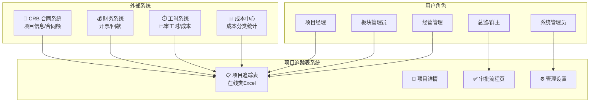

---

## 1. 角色与权限

### 1.1 角色定义

系统共设 **6 个角色**，权限分工如下：

| 角色 | 定位 | 编辑权限 | 审批权限 | 说明 |
|---|---|---|---|---|
| **系统管理员** | 系统运维 | ✅ | △ | 负责系统配置、板块管理员配置、数据锁定/解锁、报表生成配置等；项目追踪表页可编辑全公司项目中属于**系统同步**和**手工填报**的列（系统同步列为覆盖显示值）；唯一可访问审计日志页；工具栏提供「刷新数据」、「提交归档」生成 J版 |
| **经营管理（只读）** | 汇总查阅 | ❌ | ❌ | 原「财务审核」扩展为经营管理只读用户（财务、板块/群非审批领导、公司管理层）。按数据范围（全公司/板块/项目群）过滤项目追踪表，始终只读；无审批流程、无审计日志、无管理设置。次月 1–3 日核查提醒横幅仍可见 |
| **板块管理员** | 数据管理 | ✅ | ❌ | 负责板块内数据汇总校验、异常数据处理；可见填报、审批流程；工具栏提供「刷新数据」；不可访问审计日志 |
| **项目经理** | 数据填报 | ✅ | ❌ | 负责本人管辖项目的产值、进度、WIP 分析填报，Excel 导入/导出 |
| **板块总监** | 审批决策 | ❌ | ✅ | 审批流程页查看本板块全部项目；只读查看；改数须驳回 |
| **项目群群主** | 审批决策 | ❌ | ✅ | 同板块总监；驳回后退回板块管理员修改 |

### 1.2 经营管理数据范围与平台配置来源

| 数据范围 | 可见项目 | 典型人员 |
|---|---|---|
| **全公司** | 全库（与系统管理员同视野，仅只读） | 公司管理层、财务汇总岗 |
| **板块** | 指定板块的所有项目 | 板块非审批领导 |
| **项目群** | 项目群所含板块下的全部项目 | 项目群非审批领导 |

**配置来源：** 上线后，经营管理、项目经理、板块总监、项目群群主等角色权限均来自平台全局权限；项目群与板块归属沿用平台原有配置，不在本系统内维护。原型阶段保留角色选择登录页，仅用于演示不同权限视角。

**双重角色处理：** 同一人兼「审批决策」与「经营管理查阅」时，上线后由平台全局权限决定其可用入口；原型演示中仍用不同账号/身份模拟。

### 1.3 角色字段级权限矩阵

下表按**字段业务约束**拆分，而不是按角色重复拆分：手工输入列的可编辑角色基本一致，差异主要来自报告月时间窗、平台实际值同步和锁定状态。**系统管理员在项目追踪表中的可编辑范围为所有来源类型为“系统同步”和“手工填报”的列；公式计算列、项目号等运行期只读列不开放编辑。**

| 字段类别 | 可编辑角色 | 额外约束 / 说明 |
|---|---|---|
| **项目号** | 全部只读 | 线上表格中不可编辑 |
| **公式计算列** | 全部只读 | 线上表格中不可编辑 |
| **工程平台引用列** | 默认全部只读；系统管理员可覆盖显示值 | 同步写引用快照；若系统管理员编辑后或导入时和系统取值不一致，则覆盖并写覆盖标记 |
| **初始化导入基准列（N/T）** | 仅系统管理员 | 不属于平台系统取值；初始化导入后作为历史基准保留，平台新增项目默认 0 |
| **手工输入列（月度完成额）** | 系统管理员、板块管理员、项目经理 | 仅报告月当月及之后月份可编辑；报告月之前为历史只读 |
| **手工输入列（未来月开票/回款预测）** | 同上 | 报告月当月开票/回款为平台实际值，归入引用列；仅报告月之后月份可编辑 |
| **手工输入列（实施进展等非月度字段）** | 同上 | 不受月份窗限制；锁定期除系统管理员外只读 |
| **手工输入列（WIP 分析）** | 同上 | 不受月份窗限制；WIP 为 0 或空时 Drawer 默认折叠，但仍可手动展开填写 |

### 1.4 用户与权限配置

系统管理员在管理设置中维护：
- **板块管理员配置：** 系统自动获取平台中的项目执行板块列表；系统管理员只需为每个板块从平台用户中指定板块管理员
- **总监审批跳过自动判断：** 若所选板块管理员在平台权限中同时具备该板块总监权限，则该板块提交审批后系统自动跳过板块总监初审，直接进入项目群群主复审；该判断不由系统管理员手工开关
- **不在本系统维护：** 项目经理、经营管理、板块总监、项目群群主等审批权限来自平台全局权限；查看、编辑权限，统一由工程平台进行统一权限配置；项目群配置沿用平台原有配置
- **原型登录页：** 原型阶段保留角色/用户选择以演示不同权限；上线后由平台统一登录与权限识别，不提供角色切换界面

### 1.5 角色页面权限与默认路由

> **区分两类权限：** 本节先说明**哪些页面能进**；**审批相关操作**（提交审批、通过/驳回、归档）见下表「审批操作权限」，详细流程见 **§4.3**。

#### 1.5.1 页面可见性与路由

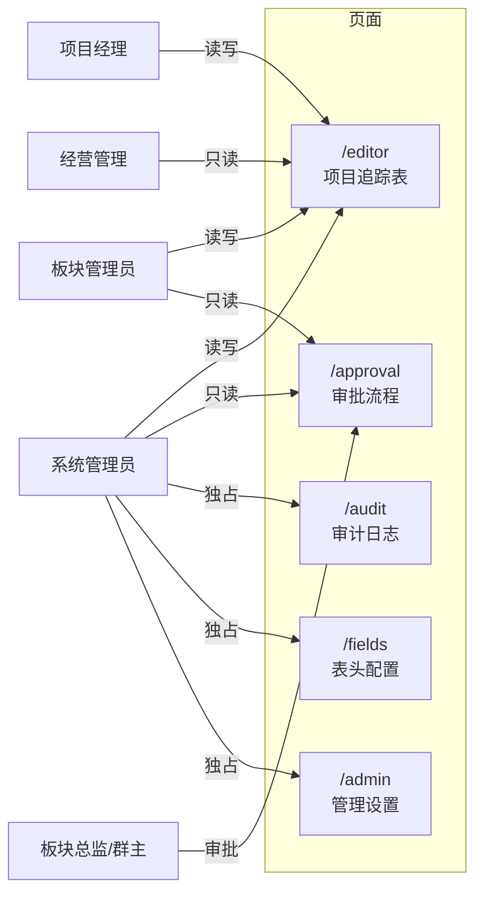

| 角色 | 可见页面 |
|---|---|
| **项目经理** | 项目追踪表 |
| **板块管理员** | 项目追踪表、审批流程 |
| **板块总监 / 项目群群主** | 审批流程 |
| **经营管理（只读）** | 项目追踪表（按配置权限的数据范围过滤，只读） |
| **系统管理员** | 全部页面（含唯一审计日志、表头配置、管理设置） |

- **审计日志、表头配置、管理设置**仅系统管理员可访问

- 登录后默认进入：填报角色（含板块管理员）→ 项目追踪表；板块总监 / 项目群群主 → 审批流程

  

## 2. 月度时间窗与锁定机制

### 2.1 月度时间窗（动态可配置）

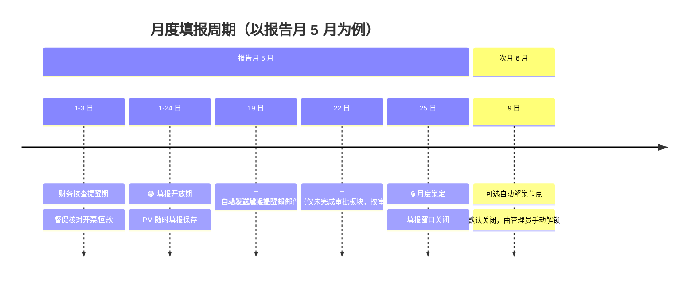

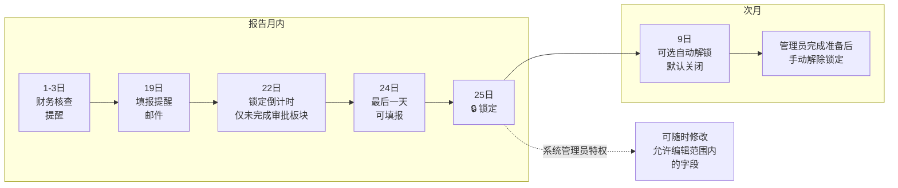

- **1 日～3 日：财务核查提醒期**（报告月次月 1–3 日，可配置）：系统向全员展示提醒（侧栏/填报页横幅），督促财务核对开票、回款、预收款等数据；不单独切换锁定状态，不赋予财务编辑权限。填报窗口仍按「月度锁定日/次月解禁日」及管理员手动锁定规则执行
- **填报提醒日（默认 19 日）：** 系统自动发送**提醒邮件**给各板块管理员，邮件内容包括：所负责板块的项目填报进度（已提交/未提交 PM 名单）、当前预警项目统计（存量开票/合同为负、完成额与工时不匹配）、全公司概要信息。仅在填报开放期（未锁定）发送
- **锁定倒计时提醒（默认锁定日前 3 天，如 22 日）：** 系统自动发送**倒计时邮件**，仅针对**未完成审批流程的板块**，根据审批流当前位置通知对应角色：未提交（draft）→ 板块管理员；总监审批中（approve1）→ 板块总监；群主审批中（approve2）→ 项目群群主。已完成审批的板块不发送。邮件内容包括距锁定日剩余天数、当前审批状态、操作提醒。无论当前是否锁定都发送
- **月度锁定日（默认 25 日）：** 报告月内当日 ≥ 锁定日时填报窗口关闭、数据冻结。除系统管理员外，任何人不可编辑（系统管理员仍受列级只读时间窗约束）
  - *管理员特权：* 系统管理员在锁定期可临时修改允许编辑范围内的字段（如 WIP 分析、未来月预测等），操作全程留痕；不可在线改写报告月当月及之前的开票/回款实际值列
- **次月解禁日（默认 9 日）：** 作为可选自动解锁节点保存；默认关闭自动解锁，需系统管理员手动「解除锁定」
- **动态调整：** 上述三个时间节点（提醒日/锁定日/解禁日）与「是否自动解锁」在管理设置中动态配置，以应对节假日或临时调整

### 2.2 锁定状态计算与刷新

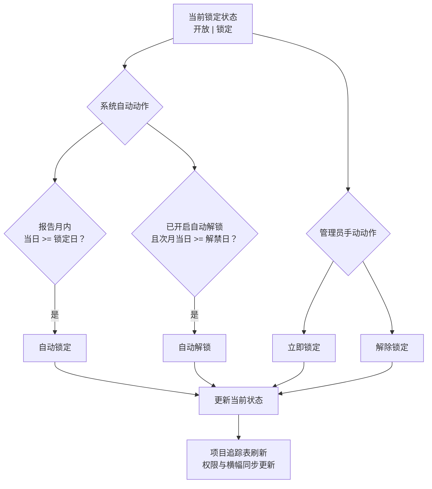

| 机制 | 行为 |
|---|---|
| **状态** | 系统只展示两种锁定状态：**开放** / **锁定** |
| **系统自动动作** | 报告月内当日 ≥ 锁定日 → 自动锁定；自动解锁默认关闭，只有开启后才会在报告月次月当日 ≥ 解禁日时自动开放 |
| **管理员手动动作** | 管理设置「立即锁定 / 解除锁定」与系统自动动作效果相同，都是把当前状态更新为锁定或开放，并写入审计日志 |
| **保存周期配置** | 保存报告月、锁定日、解禁日、自动解锁开关后立即按新配置刷新当前锁定状态，避免仍显示修改前的状态（如将锁定日 25 改为 27 后，25 日应立刻变为填报中） |
| **填报页横幅** | 锁定期文案读取锁定日配置（如「数据已锁定（每月27日）…」），不写死 25 日 |

### 2.3 列级只读动态时间窗（填报期内）

以原型中**报告月**（如 2026-05，即 5 月）为例，对**所有角色（含系统管理员）** 统一适用：

| 列组 | 可编辑月份（示例：报告月 5 月） | 数据性质 |
|---|---|---|
| **月度完成额**（1–12 月） | **5 月及之后** | 当月为项目经理手工填报的实际/计划完成额；之前月份为历史只读 |
| **月度开票** | **6 月及之后** | **当月**由工程平台的开票回款数据同步**实际开票**，只读；之后月份为**预测值**，可编辑 |
| **月度回款** | **6 月及之后** | **当月**由工程平台的开票回款数据同步**实际回款**，只读；之后月份为**预测值**，可编辑 |

- 非月度手工列（实施进展、WIP 分析等）不受上表月份窗限制；系统管理员在锁定期仍可编辑此类列
- Excel 导入合并同样跳过不可编辑月份格，避免覆盖当月开票/回款实际值

### 2.4 月度列属性动态判断

系统不会在每月开启填报时自动初始化或批量改写完成额、开票、回款数据。页面只根据当前**报告月份**动态判断每个月份列的业务属性与可编辑性：

| 列组 | 报告月当月 | 报告月之前 | 报告月之后 |
|---|---|---|---|
| **月度完成额** | 可编辑，作为本月填报值 | 历史只读 | 可编辑，作为未来计划/预测 |
| **月度开票** | 系统取值，只读 | 历史只读 | 可编辑，作为未来预测 |
| **月度回款** | 系统取值，只读 | 历史只读 | 可编辑，作为未来预测 |

- **系统取值**：指工程平台 / 财务数据同步到引用快照后，作为该月实际值来源；项目经理不可编辑，系统管理员可按引用列覆盖规则修正显示值
- **手动清零**：如需开启新一轮填报前清理报告月完成额，项目经理、板块管理员、系统管理员可在项目追踪表工具栏点击「清零当月完成额」，按当前用户可编辑项目范围清零（二次确认；审计合并为一条批量动作）
- **不自动执行**：切换报告月份、解除锁定、保存周期配置都不会自动清零或自动迁移月度列数据

### 2.5 填报周期配置（管理设置）

系统管理员在「填报周期配置」修改报告月、提醒日、锁定日、解禁日及「是否自动解锁」并保存；自动解锁默认关闭。 「数据锁定控制」提供**立即锁定 / 解除锁定**，动作结果与系统自动锁定 / 解锁一致，并全程审计。

### 2.6 提交审批后的填报锁定

- **触发（板块级）**：板块管理员对**本板块**点击「提交审批」并成功生成 Draft 快照后，系统设置该板块为已提交状态；各板块互不影响
- **填报页**：本板块「提交审批」按钮禁用并显示「已提交审批」；非系统管理员角色下，当本板块已提交时进入只读，与锁定期规则叠加
- **解除**：该板块审批驳回、管理员在管理页「从初始 Excel 恢复」时清除该板块标记；系统管理员在已提交状态下仍可编辑

---

## 3. 填报操作

### 3.1 填报模式总览

- **在线填报：** 支持在网页端直接修改单元格数据（基于在线类 Excel 表格）
- **填报视图：** 填报页仅展示在线表格，为默认且唯一可见的填报界面
- **工具栏视图筛选：** 「全部 / 新增 / 有变更 / 预警」位于表格上方工具栏
- **Excel 导入/导出：**
  - 支持下载模板（包含已锁定的基础数据列）
  - 支持用户上传填好的 Excel，系统自动解析更新
  - **权限控制：** 无论是线上还是 Excel，均需实现细粒度的单元格权限控制（只读 vs 可编辑）
  - **填报页 vs 管理页导入：** 管理设置页为全量覆盖项目库；填报页「上传导入」为按项目号合并，仅覆盖当前角色可编辑字段
- **信息折叠与排序：**
  - 基本信息等辅助信息可折叠，减少视觉干扰
  - **排序优化：** 当月有数据变动（工时/产值/开票/回款）的项目自动置顶，无变动项目置后

### 3.2 填报页面布局结构

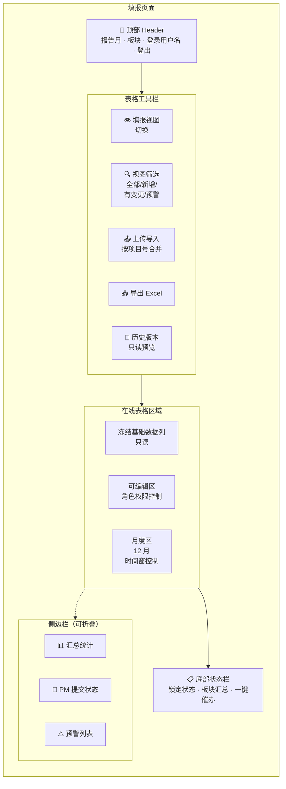

### 3.3 表格布局

与源 Excel（83 列字段字典）保持一致。

#### 3.3.1 列号对齐原则

| 约定 | 说明 |
|---|---|
| **无额外序号列** | 不在数据区左侧增加「# / 序号」列；行号由组件自带行头展示即可 |
| **列字母 = 字段字典** | 字段字典中的列号（A、B、E、F…）与表头列字母、公式引用列字母一一对应 |
| **公式引用** | 公式均按字段字典列字母书写（如 E5 表示字段 E、第 5 行） |

#### 3.3.2 行布局

| 行号 | 用途 |
|---|---|
| 0 | **小计**：金额列使用公式汇总 |
| 1 | **合计**：金额列使用公式汇总；标签文案显示在项目名列 |
| 2 | 大类 / 分区标题行 |
| 3 | 字段中文标题行 |
| 4+ | 项目数据行（顺序与筛选结果一致） |

小计/合计置于大分类之上，默认筛选仅覆盖「字段标题行 + 数据行」，避免汇总行被筛掉。

#### 3.3.3 冻结与表头

- **冻结窗格：** 冻结至字段标题行（含小计、合计、大分类行）及项目号列左侧，横向滚动时保留项目识别关键列
- **表头展示：** 仅显示字段中文名（系统管理员可在表头配置维护）
- **可编辑列（表头 + 数据格）：** 当前角色、锁定状态下可编辑的列：
  - **表头：** 浅黄底 + 深黄字
  - **数据格：** 整列浅黄底，与变更浅橙、新增行浅绿按叠色优先级处理

#### 3.3.4 列宽与自定义宽度

- **列宽配置：** 支持按字段字典列字母配置窄列（如项目号、状态等）
- **防止被自动撑开：** 对已配置列宽的列，须同步设置自定义宽度标记，避免网格刷新后按单元格内容重算列宽导致配置失效
- **默认列宽：** 未单独配置的列按字段预设或合理默认宽度处理

#### 3.3.5 金额列格式

- **单元格类型：** 数值型，千分位格式（如 1,234.56）
- **水平对齐：** 右对齐，含数据行、公式格、小计/合计行及列标题行
- **可编辑格校验：** 静默拦截非数字输入；入库时去千分位后转数值
- **Excel 导入：** 自动识别千分位格式并规范化

#### 3.3.6 公式链与布局自适应

- **公式链：** 创建表格时预构建公式矩阵并配置公式链（先数据行公式，再小计/合计行），避免初始化时访问空行报错；加载后触发公式重算，保证汇总与公式计算正确显示
- **布局自适应：** 侧栏折叠/展开时重算表格画布宽度，使表格区域随主内容区变宽/变窄

#### 3.3.7 日期字段与 Excel 序列号

部分日期列（如预测开票时间）在 Excel 内部常以序列号（如 45748）存储。若直接入库，提交刷新后会显示为数字而非日期格式。

**统一规则：**

| 环节 | 行为 |
|---|---|
| **保存 / 导入** | 将序列号、日期对象、文本统一为 YYYY-MM-DD 字符串再写入库 |
| **表格展示** | 日期格式显示，内部值为对应 Excel 序列日 |
| **Excel 导入** | 对日期类型列做同样规范化 |

**只读日期列**（如 CRB 同步的约定开始/结束时间）展示时同样走上述格式化，避免历史数据中的序列号裸显。

### 3.4 填报页工具栏

项目追踪表页自上而下：**业务工具栏** → **图例条**（可关闭）→ **表格工具栏** → **在线表格**画布。

#### 3.4.1 业务工具栏（紧凑）

| 区域 | 内容 |
|---|---|
| **左侧** | 「版本」下拉 → 填报期状态或快照提示条（二选一） |
| **右侧** | 刷新数据（系统管理员/板块管理员）· 导出 Excel · 清零当月完成额 · 上传导入（一组）｜ 保存 · 提交归档 · 提交/提交审批（一组，竖线分隔） |

**版本下拉逻辑：**
- **填报期（未提交审批）：** 显示「当前填报期」，不可选其他版本
- **已提交审批：** 显示「当前填报期 · 已提交」，下拉可选历史快照只读预览
- **快照提示条：** 当存在未提交的快照时，显示提示「存在未提交快照」+ 查看按钮

**清零当月完成额：**
- 项目经理、板块管理员、系统管理员均可见；快照查看时隐藏
- 按当前用户可编辑项目范围执行：项目经理仅本人项目，板块管理员仅本板块，系统管理员为全公司
- 仅在当前角色对报告月完成额可编辑时可点；点击后需二次确认
- 确认后将范围内非 0 的报告月完成额清零；审计日志只记录一条批量动作（含项目数量与清零前合计金额），不逐项目生成审计记录

#### 3.4.2 表格工具栏（在线表格正上方）

| 控件 | 说明 |
|---|---|
| **项目筛选** | 单选：全部 / 新增 / 有变更 / 预警；与图例条联动 |
| **紧凑列勾选** | 仅显示核心字段列（隐藏低频列），减少横向滚动 |
| **图例说明条** | 可关闭；展示各底色含义（见 §5.3.3） |

#### 3.4.3 图例说明条

| 图例 | 含义 |
|---|---|
| 🟢 浅绿 | 新增项目行（相对 baseline） |
| 🟡 浅黄 | 当前可编辑列 |
| 🔵 浅蓝 | 系统引用值被覆盖 |
| 🟠 浅橙 + 左边框 | 有变更字段 |
| 🔴 浅红 + 红字 | 存量预警（R/S < 0） |
| ⬜ 灰白斑马纹 | 只读 / 公式 / 默认 |

图例条默认展开，可点击关闭按钮收起；关闭状态持久化于本地存储。

#### 3.4.4 在线表格配置与右键

- **内置顶栏：** 关闭（避免与业务工具栏重复）
- **公式/编辑栏：** 保留，还原单元格内容编辑栏
- **右键菜单：** 仅保留「复制/粘贴/插入行/删除行」等基础操作，禁用「冻结/排序/筛选」等高级功能（由业务工具栏承载）

### 3.5 保存与导出

#### 3.5.1 保存

- **自动保存：** 单元格编辑失焦后自动保存（无需手动点击）
- **手动保存：** 工具栏「保存」按钮触发全表同步（含变更批注与高亮）
- **保存范围：** 仅保存当前角色可编辑的字段；只读字段跳过
  - 对于系统管理员，系统引用值列也属于可编辑的字段

- **保存反馈：** 保存成功后显示「已保存」提示；失败时显示错误详情

#### 3.5.2 导出 Excel

- **导出范围：** 当前可见项目（受筛选影响）+ 全部字段列
- **导出格式：** .xlsx，保留千分位格式、日期格式、公式计算结果（非公式本身）
- **权限控制：** 所有角色均可导出；导出数据与当前视图一致（受权限过滤）
- **文件名：** `项目追踪表_YYYYMMDD_HHMMSS.xlsx`

### 3.6 上传导入（填报页）

- **导入模式：** 按项目号合并，仅覆盖当前角色可编辑字段
- **导入校验：**
  - 项目号必须存在于库中（不新增项目）
  - 仅导入可编辑字段；只读字段跳过
  - 金额字段去千分位后转数值
  - 日期字段规范化为 YYYY-MM-DD
- **导入反馈：** 成功后显示「导入 N 条记录」；失败时显示错误行号与原因
- **权限控制：** 项目经理仅可导入本人项目；板块管理员可导入本板块项目；系统管理员可导入全公司项目
- **锁定限制：** 锁定期内仅系统管理员可导入；已提交的项目经理不可导入

### 3.7 项目详情 Drawer

点击项目号列（F 列）打开项目详情抽屉，展示该项目的完整信息与辅助数据。

#### 3.7.1 Drawer 入口与布局

- **入口：** 项目号列点击「查看」按钮或单元格本身
- **布局：** 右侧滑出抽屉，宽度 600px；顶部 Header（项目号 + 项目名称 + 关闭按钮）+ 项目切换（上/下箭头）
- **分区：**
  1. **项目预警区**（仅当存在预警时显示）
  2. **跟踪信息填报**（可编辑字段）
  3. **项目参考信息**（只读）
  4. **工时数据统计**（只读辅助）
  5. **成本中心统计**（只读辅助）

#### 3.7.2 Drawer 项目预警区

- **显示条件：** 仅当存在至少一条预警时显示整块区域，否则不占位
- **预警类型：**
  - 存量开票额为负（R < 0）
  - 存量合同额为负（S < 0）
  - 有完成额无工时
  - 有工时无完成额
- **视觉：** 以 pill 标签展示当前项目的预警项；红色背景 + 白色文字

#### 3.7.3 Drawer 辅助区：工时统计

- **数据源：** 工时系统已审工时（仅已审，不含待审）
- **展示维度：**
  - 专业×月矩阵：各专业每月已审工时
  - 板块×月汇总：本板块每月已审工时
  - 工时/成本切换：可切换查看工时数或对应成本
- **明细与下钻：** 点击某月可查看该月明细（按专业展开）
- **无数据状态：** 仅显示「暂无已审工时记录」
- **完成额填报参考 Popover：** 聚焦报告月「月度完成」格时 Popover 展示总合同额、截止上月始累完成、当月已审工时与工时成本

#### 3.7.4 Drawer 辅助区：成本中心

- **数据源：** 平台成本中心数据
- **展示维度：** 成本项×月矩阵、明细与下钻
- **定位：** 作为产值/成本分析的辅助参考；不等同于成本法产值计算，不得作为填报或审批依据
- **无数据状态：** 仅显示「暂无成本记录」

### 3.8 历史版本查看

- **入口：** 业务工具栏「版本」下拉选择历史快照
- **展示：** 只读模式展示选定快照的全量数据（在线表格）
- **对比：** 可与当前库做 Diff 对比（新增行 + 字段变更）
- **快照类型：** I 版（导入初始化）、D 版（板块提交审批）、J 版（公司归档）

### 3.9 侧边栏折叠

- **默认状态：** 展开
- **折叠/展开：** 点击侧边栏右边缘的折叠按钮
- **状态记忆：** 折叠状态写入浏览器本地存储，刷新后保持

---

## 4. 审批流程与版本快照

### 4.1 版本快照体系

快照仅三类：

| 类型 | 含义 | 范围 | 示例 |
|---|---|---|---|
| **I 版** | 导入初始化 | 全量 | I:20260501:ALL:01 |
| **D 版** | 板块提交审批（Draft） | 本板块 | D:20260520:SAS550:01 |
| **J 版** | 系统管理员公司归档 | 全量 | J:20260525:ALL:02 |

**流程**：

1. **空库/重新导入/重置导入** → 写入 I 版；baseline = 最新 I
2. **板块管理员「提交审批」** → 追加 D 版（本板块子集）；板块锁定；驳回后可再次提交生成新版 D
3. **总监/群主审批通过** → 仅更新审批状态，不写快照
4. **系统管理员「提交归档」** → 追加 J 版（全量）；更新 baseline；**流程态归零**进入新一轮（PM 提交记录、各板块审批进度、公司归档进度均重置）；**锁定状态不变**；可多次提交

**J 版归档后重置范围（进入新一轮填报/审批）：**

| 重置 | 保留 |
|---|---|
| PM 提交记录（`pmSubmissions`） | J 版快照与 baseline |
| 各板块审批/提交状态 | 项目数据、历史 I/D/J 快照 |
| 公司归档进度（不再停留在「已归档」） | 锁定状态（open/locked） |
| 板块最新 D 版指针 | 审计日志（含本次归档记录） |

- **版本对比**：审批页可对 D/J 快照做差异对比（总监/群主审批页不提供）
- **填报页历史版本预览**：工具栏选择 I/D/J 快照只读展示（见 §3.8）
- **驳回**：总监/群主驳回 → 退回草稿 + 解除板块锁定，板块管理员修改后重新提交生成新 D 版

#### 完整审批流程时序图

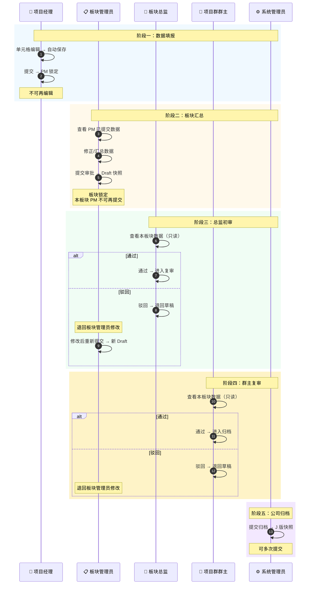

#### 快照生命周期

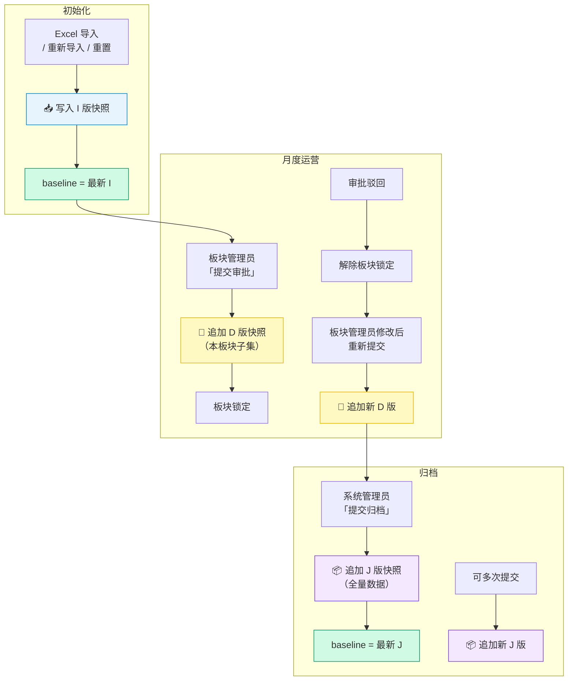

### 4.2 项目经理提交与板块汇总

项目经理的「提交」是面向板块管理员的内部汇报动作，不等同于板块「提交审批」（Draft）。默认每个项目经理每个报告月仅可提交一次；提交后锁定，不可再次编辑或重复提交；数据有问题由板块管理员在板块汇总表中直接修正。

#### 4.2.1 项目经理提交状态机

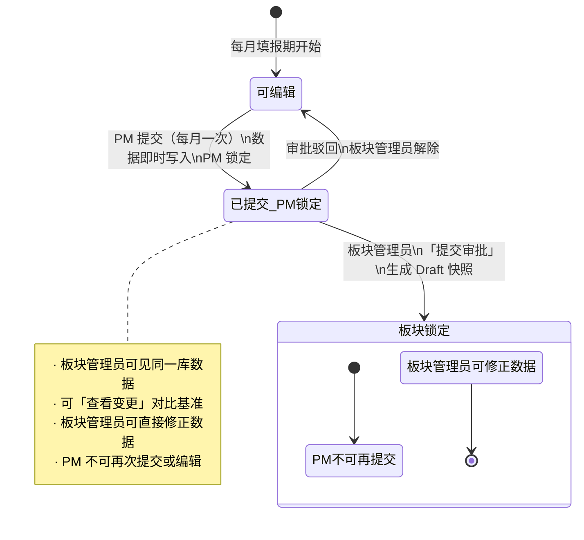

- **已取消「确认接收」**：项目经理提交后自动进入板块管理员视野；板块底栏列出「本月已提交 PM」，仅保留「查看变更」，无接收按钮
- **每月一次**：同一报告月内项目经理再次点击「提交」→ 提示已提交；前端按钮显示「已提交」并禁用
- **修正路径**：项目经理提交后发现错误 → 联系板块管理员在全板块表格中改数（板块管理员始终可编辑本板块项目，直至本板块提交审批）

#### 4.2.2 数据存储与填报基准

- 按报告月分桶，记录每个项目经理的提交状态、提交时间、项目号列表、项目数。不写项目经理快照
- 项目经理提交后视图始终读实时库数据（与板块管理员同步）
- 变更对比统一用 baseline（I/J 版）

#### 4.2.3 项目经理编辑保存与提交

- **单元格保存**：可编辑格变更失焦后自动写入，并合并更新变更字段列表、变更明细记录及审计日志
- **手动保存**：工具栏「保存」与提交前兜底均触发全表同步；保存结束后全表同步变更批注与高亮
- **Excel 导入**：项目经理可在填报页「上传导入」，仅合并本人项目可编辑列；已提交后锁定，不可导入
- **提交前兜底**：
  1. 结束未失焦的编辑态
  2. 扫描所有可编辑的手工列，将未触发保存的值补写入库
  3. 存量合同额校验：范围内项目 S ≥ 0，否则中止提交并提示
  4. 将该项目经理名下项目全量同步至服务端
  5. 更新提交状态（仅更新状态，不写快照）
- **提交后**：项目经理锁定；界面继续展示实时库数据（板块管理员改数后刷新可见）

#### 4.2.4 板块管理员操作

- 填报页底部显示「本月已提交 PM」面板（本板块项目经理，已提交状态），含「查看变更」
- **「查看变更」**：baseline 快照 vs 当前库中该项目经理子集（手工输入列差异）
- **刷新数据**：工具栏「刷新数据」→ 平台引用 + 全库刷新；板块管理员视图仍仅见本板块
- 汇总确认后点击「提交审批」→ 生成该板块 Draft，板块锁定，本板块项目经理不可再提交

#### 与「管理员全表」的差异说明

- 项目经理提交快照仅含本人名下的项目；板块管理员填报页为全板块项目
- 「查看变更」对比的是项目经理本轮改动，不是「提交版 vs 管理员整张表」

### 4.3 审批决策角色界面（板块总监 / 项目群群主）

#### 导航与顶栏

| 项 | 说明 |
|---|---|
| **侧栏** | 仅审批流程 |
| **顶栏** | 仅页面标题 + 用户菜单；不展示审批状态标签 |
| **内容区** | 审批页无内边距，右侧表格区纵向占满 |

#### 流程进度时间轴（三态）

| 状态 | 圆点样式 | 含义 |
|---|---|---|
| **已完成** | 品牌绿 + 勾 | 该步骤已结束 |
| **进行中** | 橙色 + 「···」 | 当前待处理步骤 |
| **未完成** | 灰色 + 步骤序号 | 尚未到达 |

**进行中节点计算**：审批状态表示上一节点已完成后的状态，而非「正在进行的节点」。示例：
- 草稿且未提交填报 → 节点 0（提交填报）进行中
- 草稿且已提交 → 节点 0 已完成、节点 1（板块总监初审）进行中
- 若该板块配置为“板块管理员同时为板块总监” → 板块管理员提交审批后，节点 1 自动完成，节点 2（群主复审）进行中
- 总监已通过 → 节点 0–1 已完成、节点 2（群主复审）进行中
- 群主已通过 → 节点 0–2 已完成、节点 3（归档）进行中
- 已归档 → 全部为已完成

#### 右侧在线表格（本板块当月全量 + 筛选）

- **数据范围**：本板块当月全部项目（与板块管理员填报范围一致），默认展示全部；表格工具栏单选：全部/新增/有变更；筛选结果为空时显示空状态文案
- **交互**：
  - 非待办节点或全局锁定：只读
  - 只读查看：板块总监、项目群群主在待办节点内仅可查看本板块数据；不可修改单元格或产生变更批注。若数据有误，使用「驳回」退回草稿，由板块管理员在填报页编辑后重新「提交审批」
- **视觉**：保留新增行底色、可编辑列浅黄（本角色无可用可编辑列时均为只读态）、变更格高亮与批注图例（可关闭）

#### 通过 / 驳回

| 操作 | 行为 |
|---|---|
| **通过** | 推进审批状态；仅当前待办角色可见按钮 |
| **驳回** | 与通过同一待办权限；回退草稿 + 解除板块锁定；提示「退回板块管理员」；可选填写驳回原因写入审计日志 |

**总监审批跳过：** 当系统管理员在管理设置中标记某板块“板块管理员同时为板块总监”时，该板块管理员点击「提交审批」后，系统仍生成 D 版 Draft 快照，但审批状态直接推进到“总监已通过 / 群主复审中”。群主仍需按正常流程复审；若群主驳回，流程退回板块管理员重新修改并提交。

#### 其他角色的审批页（对照）

- **板块管理员/财务等**：左侧流程进度时间轴（三态 + 图例）；右侧版本快照记录 + 版本差异对比，不嵌入在线表格
- **系统管理员**：使用独立审批页（十二板块并行流程卡片），无左侧四节点时间轴、无公司归档区、无版本快照列表；J版归档仅在项目追踪表工具栏「提交归档」

### 4.4 系统管理员：板块、审批页与填报底栏

**需求背景**：公司各个执行单位（板块/中心）的审批流程并行、互不影响；系统管理员需在审批页纵览各板块三步进度，在填报页纵览状态并按板块查看变更，随时可提交 J版全公司归档。

#### 板块注册表

- **展示**：卡片/底栏使用板块编码 + 名称，如「SAS520 · 金山中心」
- **归一**：项目执行单位编码为短码时（如 S520），读写流程统一归一为完整编码（如 SAS520）
- **默认列表**：上线后来自平台项目执行板块；原型/本地环境保留固定所有的执行单位作为默认列表。系统启动时为每板块初始化审批流程状态

#### 分板块审批与公司 J 版归档

| 层级 | 说明 |
|---|---|
| **分板块流程** | 每板块独立维护审批状态（草稿/总监通过/群主通过）、是否已提交；各板块互不影响；若平台权限判断板块管理员兼任总监，则提交审批后自动跳过总监初审 |
| **分板块快照** | Draft:板块编码、Approve1:板块编码、Approve2:板块编码 等，仅含该板块项目 |
| **公司 J 版** | 全局 J版，含整库全部项目；系统管理员随时可提交归档，不以「全部板块通过」为前置条件 |

#### 审批流程页

- **布局**：全宽卡片网格，每卡对应一板块，展示三步：提交填报 → 总监初审 → 群主复审（圆点三态：已完成/进行中/未完成）及流程状态标签
- **明确不做**：无「公司归档」汇总区；无「提交归档」按钮；无右侧「版本快照记录」；无版本差异对比
- **与总监/群主页**：后者为左侧时间轴 + 右侧在线表格；系统管理员为另一套 UI，互不混用

#### 填报页各板块进度底栏

##### 与板块管理员「本月已提交 PM」底栏对照

| 维度 | 板块管理员 | 系统管理员 |
|---|---|---|
| **展示维度** | 按项目经理卡片 | 按板块卡片 |
| **可见范围** | 本板块已提交 PM | 全部板块，无论流程是否结束 |
| **查看变更** | 有（基准 vs 提交快照） | 有（Draft vs 当前库，需群主通过完成） |
| **刷新数据** | 工具栏「刷新数据」 | 工具栏「刷新数据」 |
| **入口** | 项目追踪表 | 项目追踪表 |

#### 底栏 UI 与交互

- **挂载**：填报页表格区下方
- **显示**：系统管理员始终显示；主表为全公司全量项目（不按板块筛选主表）
- **填报期横幅**：系统管理员固定为「可编辑全部项目数据」开放态（不受板块锁定影响）
- **标题区**：「各板块进度」；标签：「公司已归档 J版」/「全部板块已完成审批」/「N 个板块审批中」；收起/展开折叠卡片列表
- **板块卡片**：板块编码 + 名称 + 流程状态标签；查看变更（弹窗差异对比，对齐板块管理员 PM 差异样式）
  - **查看变更**：仅当该板块已完成审批时可点；否则按钮禁用
  - **对比逻辑**：优先 Draft 快照 vs 当前库手工输入列；无快照则展示变更明细记录
- **明确不做**：无项目经理「确认接收」；无底栏「公司归档」/「版本比对」；主表不因点击板块而筛选

#### 与审批页、板块提交的关系

- **板块管理员**：提交本板块审批 → Draft:板块编码
- **板块总监/群主**：通过/驳回 → 推进/回退该板块审批状态
- **系统管理员**：审批页见上节；J版仅在填报页工具栏「提交归档」；成功后底栏标签「公司已归档 J版」

---

## 5. 变更追踪与高亮

### 5.1 审计日志

- **全量记录**：任何数据的增、删、改（含在线编辑、Excel 导入、管理员解锁修改）均自动记录变更日志
- **日志维度**：操作人、操作时间、所属项目、修改字段、原值、新值、修改原因（可选）
- **审计支持**：支持按项目、人员、时间范围查询导出，满足财务与运营审计要求
- **审计日志页**：仅系统管理员可访问，提供查询、筛选与导出功能

### 5.2 项目级变更元数据

除全局审计日志外，每个项目还携带：

- **变更字段列表**：本月有变更的字段列表（用于高亮与「仅看变更」筛选）
- **变更明细记录**：按字段索引的变更记录数组（操作角色、修改前值、修改后值、操作人、时间）；同一流程内不同角色对同一单元格的多次修改按序追加不覆盖；同一角色、同一旧值→新值的重复记录会去重

**批注与审计的关系**：单元格批注优先读变更明细记录；若无记录则回退至审计日志中该项目、该字段最近一条。

### 5.3 变更高亮机制

为提升填报与审批效率，系统自动识别并视觉强化本月变动数据：

#### 5.3.1 新增项目整行高亮

对比 baseline 指向的快照（首期无 J 时为 I 版），当前库中项目号不在 baseline 内的行标记为「新增项目行」。
- **I 版生成**：空库导入、重新导入、开发重置时写入
- **新增行底色**：浅绿

#### 5.3.2 可编辑列整列底色

在当前角色、锁定规则下可填报的字段，其数据格使用浅黄底，与「本月有变更」的浅橙底区分。
- **范围**：按字段 + 报告月时间窗判断（完成额当月及之后、开票/回款仅之后月份）；公式计算列、系统引用列及窗外观列不适用

#### 5.3.3 单元格底色叠色优先级

同一格仅展示一种主底色，优先级从高到低：

| 优先级 | 场景 | 底色 / 样式 |
|---|---|---|
| 1 | **预警** | 浅红底 + 红字 |
| 2 | 本月有变更 | 浅橙 + 深橙字 + 左边框 |
| 3 | **系统引用已覆盖** | 浅蓝 + 引用批注 |
| 4 | 当前可编辑列 | 浅黄 |
| 5 | 新增项目行（仅该行只读格） | 浅绿 |
| 6 | 只读 / 公式 / 斑马纹 | 灰白交替 |

即：**预警 > 变更 > 引用覆盖 > 可编辑列 > 新增项目行**。

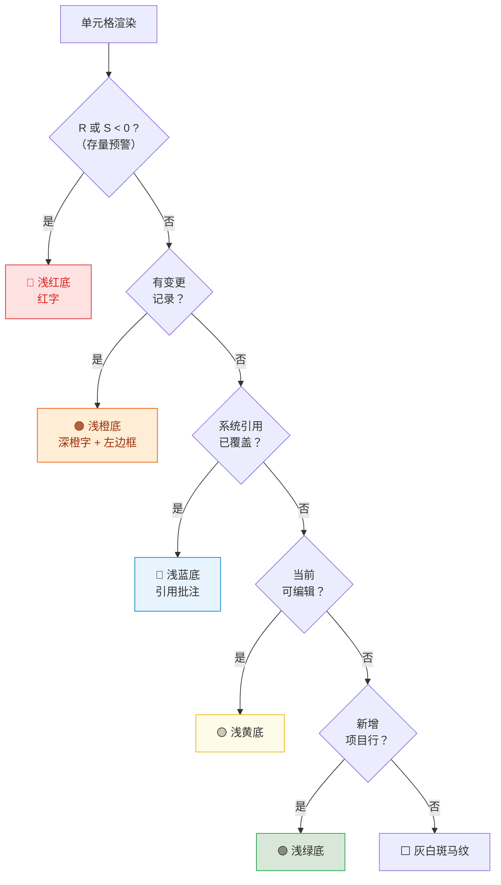

#### 5.3.4 变更单元格高亮

- **当月变更**：当月值与上月快照不一致的字段（含新填报、修正、系统同步更新）
- **未来预测变更**：修改了未来月份的预测数据（Forecast），同样视为变更并高亮显示

#### 5.3.5 联动计算高亮

因手工修改导致自动计算的字段（如 WIP、累计回款、差值等）发生数值变化时，该计算字段单元格同步触发高亮，确保用户感知数据变动。

### 5.4 变更批注

对有变更的格子自动附加批注，悬停/点击角标可查看；每条记录一行，格式为「【操作角色】修改前值 → 修改后值」（示例：【PM】0 → 100），不展示字段名与修改时间；不同角色对同一格的多次变更按时间顺序多行堆叠（如【PM】0 → 100 下一行【板块管理员】100 → 120）。

**去重规则**：以「角色 + 旧值 + 新值」为键去重，保留首次出现顺序。

- 在线编辑、保存、填报页 Excel 合并导入均会写入变更批注
- 板块总监/群主审批页为只读，不产生变更批注
- 公式重算后按行重新同步批注与高亮

### 5.5 视图过滤控制

填报页表格工具栏与总监/群主审批页均提供「全部 / 新增 / 有变更 / 预警」筛选，方便聚焦本月工作内容。

### 5.6 存量指标预警（R / S 列）

| 列 | 字段名 | 公式 | 业务含义 |
|---|---|---|---|
| **R** | **存量开票额** | = P − AC | 总合同额减始累开票。正数表示尚未开票的合同部分；小于 0 表示累计开票已超过总合同额 → 预警（允许存在，不阻断提交） |
| **S** | **存量合同额** | = P − U | 总合同额减始累完成。表示尚未完成的合同部分；不得为负；约束报告月及之前各月月度完成额的累计结果 |

- **预警样式**：R 或 S < 0 时，该格使用红字、红底
- **预警筛选**：表格工具栏「预警（N）」仅展示 R 或 S 为负的项目
- **Drawer 项目预警**：项目详情 Drawer 在「跟踪信息填报」上方集中展示预警标签；无预警时不显示该区块

**完成额编辑校验**：
1. **填报开放期自动对冲**：若存量合同额（S）< 0，系统自动将报告月月度完成额调减 S（允许该格为负值，用于对冲累计超额）
2. **编辑/保存**：月度完成额编辑时不实时阻断 S 为负（锁定期内数据可暂存 S < 0）；仅校验金额为有效数字
3. **提交阻断（唯一强校验）**：项目经理「提交」、板块管理员「提交审批」前校验范围内全部项目 S ≥ 0（提交前再次执行开放期对冲）；不满足则弹出汇总错误。不因 S < 0 提前禁用提交按钮
   - **提示文案（提交失败）**：「有 N 个项目存量合同额为负…请调减完成额或完成 CRB 合同变更后再提交。」

**与平台同步的关系**：CRB 更新 P 或财务更新开票后，R/S 会随公式重算变化；系统同步不写入变更高亮，但预警色与筛选即时反映。

### 5.7 保留期限

在本轮填报 / 审批流程内，同一项目、同一单元格的历次编辑产生的变更批注均应保留（合并写入，不随后续保存覆盖）。

- **多角色连续修改**：项目经理修改某单元格并提交后，板块管理员应能看到该条变更；若板块管理员继续修改同一单元格并提交审批，则该单元格保留两条变更记录（如「PM：0 → 100」「板块管理员：100 → 120」），不覆盖前一条。
- **审批链路可见**：板块总监、项目群群主、系统管理员在后续审批 / 归档查看中，均应能看到本轮流程内该单元格累积的全部变更记录。
- **归档后沉淀**：系统管理员提交 J 版后，当前界面进入新一轮流程，变更高亮与本轮变更记录随新基准重置；旧流程的全部变更记录保留在已生成的 J 版快照中，用于历史回溯与审计。

---

## 6. 数据对接机制

> **说明：** 本章为"引擎室"——记录系统如何与外部工程平台交换数据、如何处理引用列与覆盖逻辑。

### 6.1 数据同步总览

- **滞后可接受：** 跟踪表全量项目范围来自工程平台（CRB 合同/项目 + 产值/开票/回款等），但表格可以不实时跟随平台变化。以项目号为唯一索引，项目只增不删；显示值以 Excel 导入/管理员修正为准，平台同步写入引用快照
- **手动刷新：** 系统管理员与板块管理员在填报页点击「刷新数据」：① 工程平台引用同步（新增项目、全部引用列引用快照、报告月开票/回款）；② 重载最新项目数据（含各项目经理已提交/已保存数据、板块管理员改数、审批驳回后恢复的数据）。不覆盖未被管理员覆盖的系统引用显示值
- **自动同步：** 每日定时（默认本地 02:00）执行与手动刷新相同的平台引用同步；达到月度锁定日后暂停自动任务
- **合并规则：** 平台同步仅更新引用快照，不自动改写已有项目的显示字段；平台新增项目号 → 插入（显示值=平台值，不设覆盖标记）
- **审计：** 每次同步写入审计日志，文案为「更新系统引用快照」
- **最后更新时间：** 填报页底栏展示「系统数据更新于 yyyy-MM-dd HH:mm」；所有角色可见；未同步时显示「尚未同步」

#### 数据同步流程图

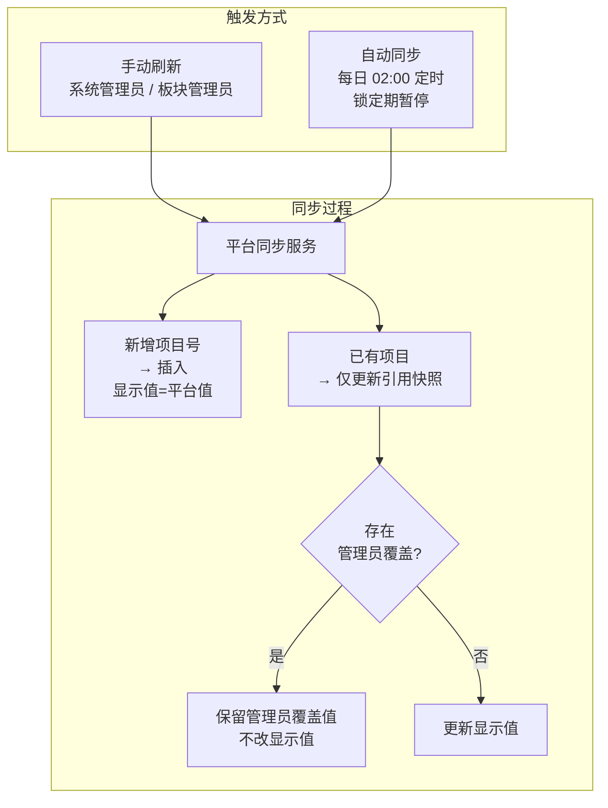

### 6.2 工程平台引用列（显示值 / 引用值 / 管理员覆盖）

> **💡 什么是"引用列"？**
> 引用列是指数据来源为工程平台（CRB / 财务系统）的字段。系统会定期从平台同步这些字段的值（写入"引用快照"），但在表格中展示的"显示值"是相对独立的：首次导入时显示值 = 平台值；此后若系统管理员在表格中手动修改了引用列，则该格打上"已覆盖"标记，后续自动同步不会再覆盖显示值，直到管理员主动清空覆盖。

| 维度 | 规则 |
|---|---|
| **引用列** | 工程平台引用列（不含 N/T 初始化导入基准列）+ 报告月当月开票/回款；数据源为工程平台 / 财务系统 |
| **显示值** | 表格、公式使用显示值；Excel 导入保留 |
| **引用快照** | 平台同步只写引用快照（值、状态、同步时间） |
| **管理员覆盖** | 系统管理员编辑引用列后标记；后续同步不改显示值 |
| **恢复** | 覆盖格清空失焦 → 弹窗「是否恢复系统引用」 |
| **视觉** | 已覆盖格浅蓝 + 批注展示引用值（图例「系统引用已覆盖」） |
| **项目号** | 运行期不可编辑 |

### 6.3 A 列「新/旧项目」（系统取值）

| 维度 | 规则 |
|---|---|
| **来源** | 系统引用列；不再由公式按合同签署年计算 |
| **系统判定** | 是否为报告年度新增项目：平台同步新入库的项目号 → 默认「新项目」 |
| **已有项目** | 同步仅更新引用快照：若标记为报告年新增 → 引用值「新项目」，否则「旧项目」；不改已有显示值（除非管理员未覆盖且触发年末 rollover） |
| **年末 rollover** | 当报告年大于当前分类年时（管理设置改报告月、平台定时同步时检测）：全部项目引用值改为「旧项目」，清除新增标记；未被管理员覆盖的显示值同步改为「旧项目」 |
| **管理员覆盖** | 与引用列一致：系统管理员可编辑 A 列显示值；审计记录；清空可恢复引用值 |
| **Excel 导入** | 保留 A 列显示值，并写入引用快照；若显示为「新项目」则标记为当前报告年 |

**与「新增项目行」高亮区分：** 「新增项目行」表示相对 baseline 新出现的项目号；A 列「新/旧项目」表示当年业务分类，二者独立。

### 6.4 合同额区（N / O / P）

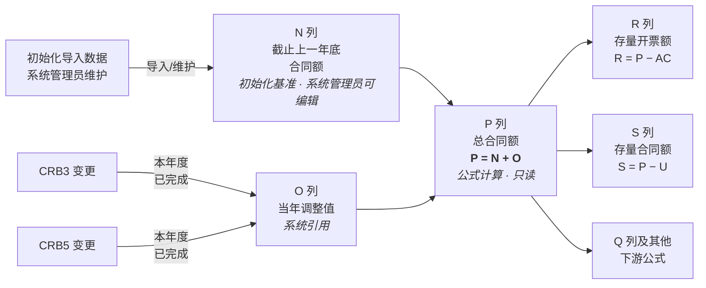

| 列 | 字段 | 来源 | 规则 |
|---|---|---|---|
| **N** | 截止上一年底合同额 | 初始化导入基准 | 取初始化导入文件中的值；平台新增项目均为本年度新增项目，无历史年度数据，默认 0；仅系统管理员可编辑 |
| **O** | 当年调整值 | 系统引用 | 工程平台（CRB）同步：本项目在报告年度内已完成的 CRB3 与 CRB5 合同额之和，表示当年合同变更增量；写入引用快照；系统管理员可覆盖显示值 |
| **P** | 总合同额 | 公式计算 | P = N + O；公式每次重算；前端不可编辑；下游 R/S/Q 等公式均以 P 为输入 |

**取值说明（O 列）：** CRB3、CRB5 为合同变更流程类型；平台按项目号汇总本年度已完成的两类变更合同金额，作为当年调整值推送至跟踪表。无当年变更时 O 为 0。

**与旧逻辑差异：** 不再由 O = P − N 反推；P 不再直接从 CRB 取 CRB1/CRB3 单值，而由基准 N 与当年增量 O 合成。

**Excel 导入：** 保留 O 列显示值并写入引用快照；导入后公式重算 P。

### 6.5 锁定期数据同步规则

- 填报期开启时，管理员可手动锁定数据快照
- 锁定期间（含每月 25 日起），暂停自动平台同步；手动同步仍仅系统管理员可用
- 填报结束审批后，解锁并可在次月开启新一轮填报前更新数据

### 6.6 初始化导入与平台数据合并

**触发场景：** 系统首次启动（空库导入）、管理设置「从初始 Excel 恢复」（reseed）、开发环境重置（reset-dev）——这三个入口在解析初始化 Excel 后，会自动与工程平台数据进行合并对账。

**核心规则：Excel 值始终优先。** 初始化导入以 Excel 表内容为权威数据源，根据平台是否能匹配到对应项目号，产生三种处理结果：

| 场景 | 显示值 | 系统引用快照 | 视觉标识 |
|---|---|---|---|
| **平台匹配且值一致** | Excel 值 | 写入平台引用值（`status: ok`） | 无特殊标记 |
| **平台匹配但值不一致** | Excel 值（优先） | 写入平台引用值（`status: ok`），标记为人工覆盖 | 浅蓝高亮（`#e8f4fd`）+ 批注标注平台系统值 |
| **平台无此项目号** | Excel 值 | 不关联平台（`status: not_on_platform`） | 项目号列浅琥珀色（`#fff3cd`）+ 批注「该项目号未在工程平台注册」 |

**适用范围：** 所有系统引用列（`system_sync` 类型字段），包括：D 执行单位编码、E 项目经理、G 项目名称、H 客户名称、N 截止上一年底合同额、O 当年调整值、T 截止上一年底始累完成，以及报告月的回款/开票列。

**平台独有项目不插入：** 初始化导入以 Excel 为准；仅存在于平台而不在 Excel 中的项目号不会被导入系统（区别于日常平台同步的新增项目插入逻辑）。

---

## 7. 系统管理

### 7.1 表头配置

**入口**：系统管理员 → 侧栏「表头配置」
**权限**：仅系统管理员；其他角色访问将被重定向至首页

#### 7.1.1 定位与数据流

- **定位**：83 列字段字典的线上维护入口；与项目追踪表共用同一份运行时字典
- **加载**：用户打开系统时由服务端下发字段字典；填报页与表头配置页始终一致
- **保存后同步**：更新表头名称 → 填报页表头自动刷新；**无需**手动刷新浏览器

#### 7.1.2  UI 设计

| 区域 | 行为 |
|---|---|
| **顶栏冻结** | 页标题、操作按钮与（若有）未保存提示条作为一组，向下滚动时始终贴在视口顶部 |
| **未保存提示** | 修改表头名称后出现**整行**黄色提示条，含说明与「立即保存」；同时工具栏「保存表头」变为可点 |
| **统计与筛选** | 字段总数、来源类型统计；按来源类型筛选；搜索列号/表头名/说明 |
| **分区表格** | 按分区折叠展示；列：列号、表头名称（可编辑）、英文名、来源类型、数据类型、计算逻辑、说明 |
| **详情抽屉** | 「查看」只读展示枚举值、完整说明等（不可在此编辑） |

**当前仅开放编辑**：在线表格字段标题行的表头中文名，表格内联输入框修改。

**暂未开放（界面底部「待定」）**：列宽与隐藏、冻结窗格、数据验证、公式编辑、新增/删除列、分区调整、导入/导出 JSON 等。

#### 7.1.3 操作流程

1. 系统管理员进入表头配置，在竖向列表中修改目标列的表头名称
2. 顶部出现未保存提示条 → 点击「保存表头」或「立即保存」
3. 确认后写盘；项目追踪表表头即时更新（若当前在项目追踪表页）
4. 若仅改表头名，一般无需重启服务

**审计**：保存写入审计日志

### 7.2 系统用户：板块管理员配置

**入口**：系统管理员 → 侧栏「管理设置」→ 系统用户

**上线原则：**

- 本系统不新增/停用业务用户，也不维护项目经理、经营管理、板块总监、项目群群主等角色权限；这些均由平台全局权限定义
- 系统自动获取平台中的项目执行板块列表；系统管理员只需要为每个板块从平台用户下拉中配置板块管理员
- 项目群配置沿用平台原有配置功能，本系统不单独维护项目群

**配置项：**

| 配置 | 说明 |
|---|---|
| 板块 | 来自平台项目执行板块；原型环境使用默认板块 |
| 板块管理员 | 下拉筛选平台用户；保存姓名与平台用户 ID |

**自动判断：** 「跳过总监初审」不在页面中手工配置。提交审批时，系统根据平台用户权限判断所选板块管理员是否同时具备该板块总监权限；若具备，则直接进入群主复审。

**原型差异：** 原型仍保留登录页角色/用户选择，以便演示不同权限视角；上线后用户从平台统一登录，本系统不展示角色切换入口。

### 7.3 开发测试：环境重置

> 面向本地/联调环境，便于反复验证填报与审批流程；上线前建议隐藏或仅开放给系统管理员。

- **入口**：顶栏右上角用户下拉菜单 → 「重置为初始状态（开发）」（二次确认）
- **重置范围**：

| 项 | 行为 |
|---|---|
| 项目数据 | 从初始数据 Excel 重新导入，覆盖当前库 |
| 审批流程 | 回退草稿，解除板块锁定 |
| 快照与审计 | 清空后自动写入上一报告月对比快照，并剔除 5 条固定演示项目作为「本月新增」 |
| 填报周期 | 恢复默认值 |
| 锁定状态 | 清除当前锁定状态，按当前日期与周期配置重新计算 |
| 项目元数据 | 重导时清除变更明细记录、变更字段列表等，避免脏数据影响 |

- **演示新增项目**：初始数据约 20 条时固定为 5 条项目号；大库则均匀抽样 5 条
- **预警演示项目**：重导/重置后自动改写 4 条项目并注入演示工时，对应 Drawer 四类预警：

| 预警标签 | 演示项目号 |
|---|---|
| 存量开票额为负 | B25001-0042 |
| 存量合同额为负 | B24264-0038 |
| 有完成额无工时 | B25126-0003 |
| 有工时无完成额 | B25340 |

- **与管理页差异**：管理设置中的「从初始 Excel 恢复」保留当前报告月份等配置，仅重导项目并清空快照/审计，但会同样自动重建上月对比快照；开发重置会连同周期配置一并恢复默认

### 7.4 系统管理员全局预警抽屉（已实现）

> 系统管理员专属的全公司维度预警汇总面板，聚合所有项目的活跃预警，便于快速定位风险项目并督促消除。

**入口**：系统管理员 → 项目追踪表页 → 工具栏「项目预警」按钮（铃铛图标）；非系统管理员角色不可见。

**触发与刷新**：打开抽屉时自动调用后端计算并返回当前报告月全部预警；每次打开均重新计算。

#### 7.4.1 预警卡片信息

每条预警以卡片形式展示，包含：

| 信息项 | 说明 |
|---|---|
| 项目编号 | 项目唯一编号，点击可跳转打开该项目详情 Drawer |
| 项目名称 | 项目中文名称 |
| 预警类型 | 四类之一（见 §3.7.2 预警定义），以彩色标签区分 |
| 预警详情 | 具体数值描述（如「存量开票额 -12.34 万」） |
| 首次检测时间 | 该预警首次被系统发现的时间 |
| 状态 | **活跃**（默认显示）或 **已消除**（历史记录，半透明样式） |

#### 7.4.2 预警类型

与项目详情 Drawer（§3.7.2）一致，共四类：

| 预警类型 | 标签颜色 | 触发条件 |
|---|---|---|
| 存量开票额为负 | 红色 | 项目开票存量（开票额 − 合同额）< 0 |
| 存量合同额为负 | 红色 | 项目合同存量（合同额 − 完成额）< 0 |
| 有完成额无工时 | 橙色 | 当月有完成额但无工时记录 |
| 有工时无完成额 | 橙色 | 当月有工时但无完成额记录 |

#### 7.4.3 筛选与搜索

| 功能 | 说明 |
|---|---|
| 关键词搜索 | 支持按项目编号、项目名称、预警类型关键词模糊匹配 |
| 预警类型筛选 | 下拉多选，按四类预警过滤 |
| 所属板块筛选 | 下拉单选，自动从当前数据中提取板块列表 |
| 状态筛选 | 活跃（默认）/ 已消除 / 已忽略 / 全部 |

#### 7.4.4 分页

- 默认每页 20 条，可切换 10 / 20 / 50 / 100
- 显示当前页码与筛选后总数

#### 7.4.5 预警持久化与状态管理

- 所有预警均持久化存储至数据库；预警消除后状态变为「已消除」，但记录保留
- 卡片显示该预警的**首次检测时间**（非消除时间），便于追溯预警持续时长
- 每次打开抽屉时，系统重新计算当前月预警：新出现的标记为活跃，已不存在的标记为已消除

#### 7.4.6 顶部统计栏

抽屉顶部显示当前活跃预警按类型统计的计数芯片，便于快速了解整体风险分布。

#### 7.4.7 交互

- 点击**活跃**预警卡片 → 关闭预警抽屉，自动打开对应项目详情 Drawer
- 点击**已消除**或**已忽略**预警卡片 → 无响应（仅历史查看）
- 点击「重置筛选」按钮 → 清空所有筛选条件，恢复默认状态

#### 7.4.8 手动永久忽略

> 系统管理员可对确认无需处理的预警执行永久忽略操作。

- **入口**：每张活跃预警卡片右下角的「忽略」按钮
- **确认**：点击后弹出确认对话框，提示操作不可撤销
- **效果**：该项目的该类型预警**永久不再出现**，跨月生效；即使条件在未来月份仍满足，也不会重新激活
- **状态**：被忽略的预警以 `dismissed` 状态存储，卡片显示为半透明 + 删除线样式，footer 标注「已忽略（永久）」
- **与自动消除的区别**：自动消除（`resolved`）是系统检测到条件不满足后标记，条件重新出现会自动激活；手动忽略（`dismissed`）是管理员主观决定，永不复现

---

## 8. 业务规则

### 8.1 数据源定义

| 数据类型 | 数据源 | 说明 |
|---|---|---|
| **项目基本信息** | CRB | 包括项目名称、经理、时间、客户等，作为基础只读数据，严禁非管理员外用户进行手动修改，以 CRB 为准，详细见**附录A.2** |
| **合同签署状态** | CRB | 系统自动判定，详细见**附录A.2** |
| **截止上一年底合同额（N）** | 初始化导入数据 | 取初始化导入文件中的历史基准值；平台新增项目为本年度新增，无历史年度数据，默认 0；仅系统管理员可编辑 |
| **截止上一年底始累完成（T）** | 初始化导入数据 | 取初始化导入文件中的历史基准值；平台新增项目默认 0；仅系统管理员可编辑 |
| **当年调整值（O）** | CRB | 本项目报告年度内已完成的 CRB3 + CRB5 合同额总和；系统同步至引用快照，见 §6.4 |
| **总合同额（P）** | 系统计算 | P = N + O；公式重算，非 CRB 直取 |
| **开票金额** | 工程平台开票回款模块 | 报告月当月开票由财务系统同步实际发生值（只读）；之后月份为项目经理填报的预测值，可在线编辑 |
| **回款金额** | 工程平台开票回款模块 | 同开票：当月实际值由财务系统同步（只读）；之后月份为预测值可编辑 |
| **存量开票额（R）** | 系统计算 | P − AC；小于 0 为预警（累计开票超合同），见 §5.7 |
| **存量合同额（S）** | 系统计算 | P − U；不得为负；约束月度完成额累计，见 §5.7 |

### 8.2 项目准入与"提前申报产值"规则

- **正常准入**：所有已签署合同的项目自动进入追踪表
- **提前申报产值（未签署项目）**：
  1. **发起**：针对尚未签署合同但已开展工作需申报产值的项目，由项目经理发起"提前申报产值"流程
  2. **审批**：审批通过后，该项目允许进入当期追踪表，此时"合同是否签署"字段显示为"未签署"
  3. **状态联动**：若后续该项目在 CRB 中完成签署（状态变更为"已确认"），系统自动将追踪表中该项目的状态更新为"已签署"
- **前期项目号规范化**：平台上的"前期项目"可能使用带板块编码后缀的临时编号，例如 `B26001_SAS20`；追踪表 F 列不展示该后缀，统一使用正式项目号（如 `B26001`）。这类项目均为未签署状态，因此可通过"合同是否签署=未签署" + "去除板块后缀后的正式项目号"关联追踪表项目与平台前期项目信息。
- **数据隔离**：未签署且未通过提前申报审批的项目，不可见于追踪表中

### 8.3 产值申报规则

- **填报依据**：目前公司允许多种方式并行（形象进度、人工时比例、设计进度交付物等），由项目经理自行判断填报
- **闭环要求**：过程允许偏差，但最终累计完成合同额必须 = 合同总额
- **存量合同额约束**：填报开放期若 S < 0 自动将报告月完成额调减（可为负）使 S 归零；提交时须全部 S ≥ 0（§5.7）。锁定期内允许数据中暂存 S < 0，不在保存时阻断
- **存量开票额提示**：存量开票额（R = P − AC）为负时仅作预警展示（红底红字），不阻断提交，便于发现累计开票超合同情况
- **新/旧项目自动判定**：根据合同签署年份自动标记（见 §6.3）：
  - 新项目：当年新签
  - 旧项目：往年签约延续

### 8.4 财务与 WIP 规则

- **预收款定义**：未开票但已收到的款项（与合同是否签署无关）
  - 已开票 + 回款 = 正常回款
  - 未开票 + 回款 = 预收款
- **WIP 账龄分段**：<1个月、1~3个月、3~6个月、6~12个月、1~2年、2~3年、>3年
- **WIP 成因分类**：A(到节点未付)、B(单价合同未到节点)、C(总价合同未到节点)、D(其它)
- **自动化报表**：
  - **WIP 分析报告**：每月自动生成 PDF 格式的 WIP 分析报告（账龄分析、风险预警、改进建议）
  - **分层输出**：报告按板块级、项目群级、公司级分别生成
  - **预警通知**：当 WIP > 合同额 50% 时，系统自动向对应中心和板块发送预警

### 8.5 动态年份与历史归档机制

针对跨年场景，系统需保留相对年份字段命名，并通过初始化导入 / 系统管理员维护形成新年度历史基准：

1. **字段名动态化**：
   - 界面显示不再包含具体年份（如"25 年底"），改为相对年份描述：
     - 截止上一年底 (Cut-off Previous Year End)
     - 当年调整值 (Current Year Adjustment)
     - 当年期初存量 (Current Year Backlog)
   - 字段标题保持相对口径，不随具体年份改名

2. **新年度基准维护逻辑**：
   - **基准来源**：N「截止上一年底合同额」与 T「截止上一年底始累完成」不从平台自动取值，也不由系统跨年自动抓取；它们使用初始化导入文件中的值作为历史基准
   - **新增项目默认值**：平台后续新增项目均为本年度新增项目，没有上一年度历史数据，N 与 T 默认 0
   - **维护权限**：如历史基准需调整，仅系统管理员可编辑
   - **调整值归零**：新年 O（当年调整值）由 CRB 重新累计（当年 CRB3/CRB5 完成额之和）；无变更时为 0，不由项目经理手工填报

3. **历史数据保留**：
   - 前端追踪表只展示"截止上一年底"的当前切片
   - 历史版本通过 I/J 快照与初始化导入数据留痕，用于审计和历史对比

#### 新年度初始化基准维护流程图

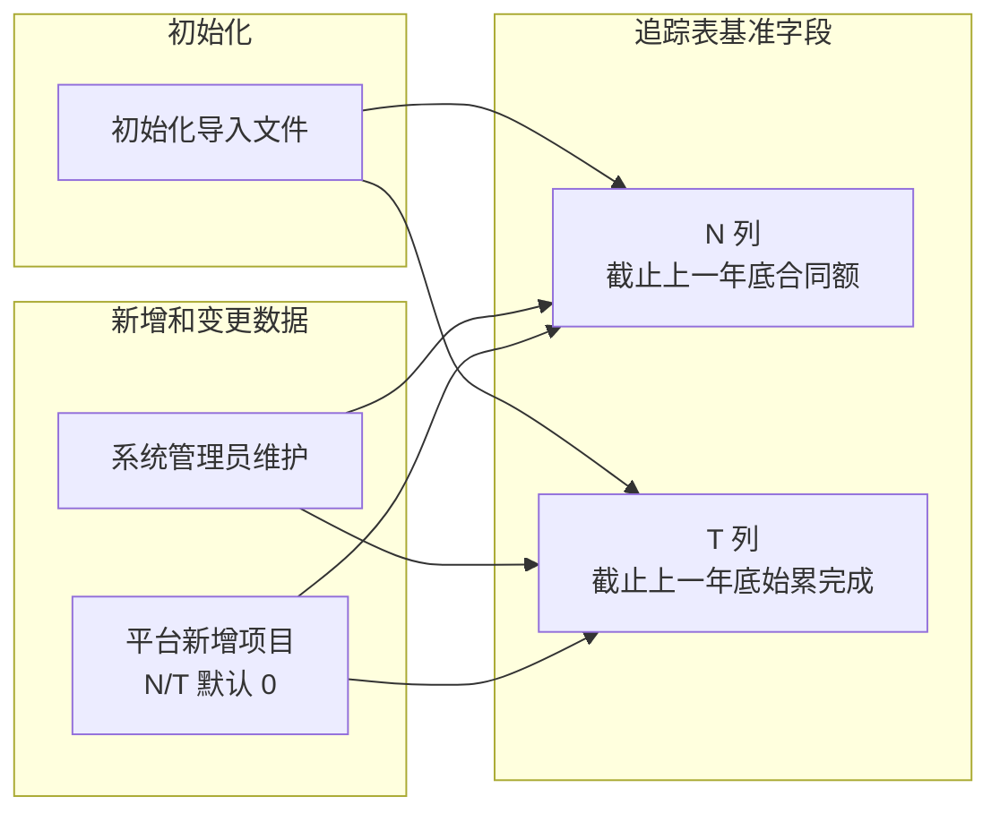

#### 新旧项目跨年 Rollover

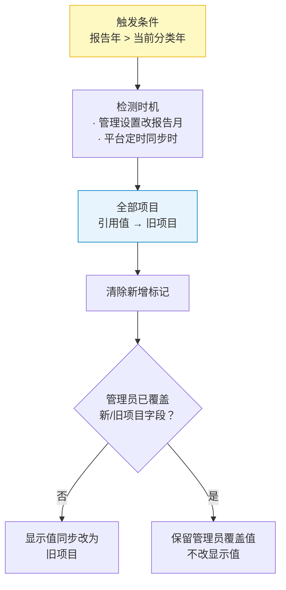

---

## 附录

### A. 数据范围与背景

#### A.1 项目范围
- **覆盖范围**：公司所有已签署合同的项目 + 提前申报产值的项目
  - “刷新”触发

- **涉及中心**：线上化系统需覆盖所有项目执行中心，各中心分别填报，最终汇总

#### A.2 系统取值字段清单

以下字段由工程平台 / 财务数据同步或系统规则判定形成系统取值。系统管理员可按 §2.2 的覆盖规则修正引用显示值；“平台数据来源”列预留给业务侧补充这些值在平台中的具体来源。

| 列 | 字段 | 数据范围 / 取值口径 | 平台数据来源说明 |
|---|---|---|---|
| A | 新、旧项目 | 按报告年度判断项目是否为当年新增；平台新增项目默认为新项目，跨年 rollover 为旧项目 |  |
| B | 约定开始时间 | 合同约定项目开始日期 | CRB1 / CRB3 |
| C | 约定结束时间 | 合同约定项目结束日期 | CRB1 / CRB3 |
| D | 执行单位编码 | 项目负责执行单位 / 中心编码 | CRB1 / CRB3 / CRB5 |
| E | 项目经理 | 项目当前负责人 | CRB1 / CRB3 / CRB5 |
| F | 项目号 | 项目唯一编号，作为主键；平台前期项目如带板块后缀（例：`B26001_SAS20`），追踪表展示去后缀后的正式项目号（例：`B26001`） | CRB1 / CRB3；前期项目按去后缀项目号关联 |
| G | 项目名称 | 项目全称 | CRB1 / CRB3 |
| H | 客户名称 | 甲方客户全称 | CRB1 / CRB3 |
| I | 企业属性 | 客户企业性质分类 | CRB1 / CRB3 |
| J | 行业类别 | 客户所属行业分类 | CRB1 / CRB3 |
| K | 业务类型 | 项目所属业务类型分类 | CRB1 / CRB3 |
| L | 合同是否签署 | 根据合同状态判定：CRB 状态为「已确认」显示「已签署」，否则显示「未签署」 | CRB3确认完成的项目都是“已签署”，“提前申报产值”的前期项目都是“未签署” |
| O | 当年调整值 | 报告年度内已完成的 CRB3 与 CRB5 合同额之和 | 本年度确认完成的 CRB3 & CRB5 |
| Y | 税率 | 合同适用税率 | CRB1 / CRB3 |
| 报告月动态列 | 历史月份和当月开票 | 报告月对应的月度开票列（如 5 月为 5月开票）作为当月实际开票值 | 工程平台开票数据 |
| 报告月动态列 | 历史月份和当月回款 | 报告月对应的月度回款列（如 5 月为 5月回款）作为当月实际回款值 | 工程平台回款数据 |

#### A.3 初始化导入基准字段

以下字段不是平台系统取值，不由后续平台同步覆盖。它们用于承接初始化导入时已有项目的历史年度基准；平台后续新增项目均视为本年度新增项目，没有上一年度历史数据，因此默认填 0。编辑权限仅开放给系统管理员。

| 列 | 字段 | 数据范围 / 取值口径 | 编辑权限 |
|---|---|---|---|
| N | 截止上一年底合同额 | 初始化导入的上一年度期末合同额基准；平台新增项目默认 0 | 仅系统管理员 |
| T | 截止上一年底始累完成 | 初始化导入的上一年度期末累计完成基准；平台新增项目默认 0 | 仅系统管理员 |

### B. 待开发项

- [x] 系统管理员的预警看板（已实现，见 §7.4）

  - [x] 汇总所有项目预警信息
  - [ ] 提醒对应责任人及时操作消除预警

- [ ] 批量邮件提醒功能

  - [ ] 开始填报的提醒
  - [ ] 临近截止日期的提醒
  - [ ] J 版归档后的提醒

  

### C. 需求文档维护（协作约定）

- **产品版（本文）** 与 **开发版** 为并列主文档；功能新增或优化且涉及代码变更时，两文档应在同一迭代内同步更新。
- 产品侧变更：业务流程、规则、交互、验收标准 → 更新产品版对应章节。
- 开发侧变更：实现状态、接口、文件路径 → 更新开发版；产品版不写技术细节。
- 仓库根目录 `AGENTS.md` 含完整 checklist 与 Cursor Hook 自动提醒说明。
