# 项目追踪表线上化 — 需求文档（开发版）

> **关联文档：** [需求文档（产品版）](./需求文档_产品版.md) | [字段字典_备份.md](./字段字典_备份.md)（归档）· 运行时以 `config/fields/fields.json` 为准 | [会议记录精修版](../会议记录/产值报告线上化讨论_精修版.md)  
> **最后更新：** 2026-06-11（项目追踪表隐藏 DOM 表格优化）

<details>
<summary>更新记录</summary>

| 日期 | 更新内容 | 涉及章节 |
|---|---|---|
| 2026-06-11 | 项目追踪表大数据渲染优化：取消 Luckysheet 按条目分页，恢复按当前筛选结果全量连续展示；保留经典 HTML 表容器 `v-show` → `v-if` 修复，避免默认隐藏状态仍渲染 83 列大表导致浏览器 OOM | 3.1、3.3、3.4 |
| 2026-06-10 | 完成额预测总额校验：`stock-validation.js` 新增全年完成预测口径（上一年底始累完成 + 1-12月完成额合计 ≤ P 总合同额），`validateCompletionEdit()` 实时拦截未来月份预测超额，`validateProjectsForSubmit()` 提交前兜底；新增 `test/completion-forecast-validation.test.js` 覆盖编辑与合同额核减提交场景 | 5.6、7.5、8.3 |
| 2026-06-10 | Drawer 保存后外部表格式保持：`ProjectEditor.syncLuckysheetProjectRowValues()` 就地刷新项目行时继承旧单元格 `ct/ht` 与显示小数位，避免 Drawer 保存后金额列被统一重建为默认小数格式 | 3.7、7.5 |
| 2026-06-10 | WIP 催开票校验：新增 `js/wip-validation.js` 与 `test/wip-validation.test.js`；`ProjectEditor.assertStockBeforeSubmit()` 追加 AL 非零时 AM/AO 必填校验；主表与报告线保存链路在 AL 变为 0 时自动清空 AM/AN/AO，并写入变更批注/审计或报告线 `field_data` | 5.6、7.5、8.4 |
| 2026-06-10 | 系统管理员「项目追踪表」底部各板块进度移除：`ProjectEditor.js` 不再注册/挂载 `SystemAdminSectorDock`；各板块填报进度改由「填报管理」列表/详情查看，项目追踪表保留数据编辑、导出与 J 版归档入口 | 6.4、7.5 |
| 2026-06-10 | 填报页刷新入口规则调整：`ProjectEditor` / `ReportLineDetail` 中 PM 与板块管理员不渲染「刷新数据」入口；进入编辑器/报告线表单时通过 bootstrap / `loadDetail()` 自动加载最新可见范围数据，手动 `POST /api/editor/refresh-data` 入口仅系统管理员保留 | 2.5、3.3、7.5 |
| 2026-06-10 | 报告线项目详情 Drawer 保存修复：`ReportLineDetail.handleProjectDrawerSave()` 覆盖父级主表保存逻辑，改为调用 `Store.saveReportLineData()` 写入当前报告线 `field_data`；保存后同步 `Store.currentReportLine.projects[].field_data`、重建 `tableProjects`，并在 Luckysheet 视图就地刷新对应项目行，避免 Drawer 保存后外部表仍显示旧值 | 7.5 |
| 2026-06-08 | 审计日志功能检查与修复：`report-line-service.saveData()` 根据本次真实变化字段调用 `dbm.pushAudit()` 写入 `operation_type: report_line_data`；`AuditLog.js` 修复空值 `.includes`、字段名 fallback、日期结束日全天、0 值展示/导出；已用事务回滚验证报告线保存会生成审计记录且不污染库 | 5.1、7.5 |
| 2026-06-08 | 报告线变更批注去重：`attachReportLineChangeMeta()` 对已存在 `_field_change_log` 的列不再从 `change_diff` 重复合成；`changeDiffToChangeMeta()` 回退还原时固定按 PM 角色展示，避免板块管理员打开时误标为本人操作导致双份批注 | 7.5 |
| 2026-06-08 | 报告线变更批注：`ReportLineDetail` 编辑时调用 `ChangeMeta.recordFieldChangeLog` 并随 `field_data` 持久化 `_field_change_log`；`attachReportLineChangeMeta()` 在加载时将 `change_diff` 还原为批注元数据；`Store.saveReportLineData` 透传 `userName` | 7.5 |
| 2026-06-08 | 报告线月度字段一致性修正：`report-line-service.js` 新增 `syncMonthlyFlatFields()`，在详情读取、保存、diff、导出和 D 版快照固化时同步 `mc/mi/mp_*` 与 `monthly_completion/monthly_invoice/monthly_payment`；`ReportLineDetail.syncMonthlyFieldValue()` 在前端乐观更新时同步数组，避免公式计算和 Luckysheet 重载显示旧值 | 7.5 |
| 2026-06-08 | 报告线 PM 提交前刷盘修正：`ReportLineDetail.handleCellEdit()` 改用父组件 `_trackCellSave()` 纳入异步保存队列；`_flushRlLuckysheet()` 对齐主表逻辑，先 `luckysheet.exitEditMode()`、等待 `_waitCellSaves()`，再扫描当前表格补写未失焦值，避免 PM 直接点击提交导致最后编辑内容未入库 | 7.5 |
| 2026-06-08 | 报告线 PM 更新内容展示修正：`reportLineService.saveData()` 先读取同项目既有 `field_data` 并与本次编辑合并后写回，避免局部保存覆盖项目基础字段；`getReportLineDetail()` 按 `baseline_version` 兼容合并历史局部数据；`ProjectEditor` PM 弹窗文案改为「更新内容」，表格只展示更新后值 | 7.5 |
| 2026-06-08 | 截止填报日期与报告线自动完结：`DEFAULT_PERIOD_CONFIG.deadlineDay` 恢复；`reportLineService.autoCompletePeriod(period)` 将当前报告月未完成报告线置为 `completed`，关闭未提交 PM，并写入 `auto_complete` 流转记录；`server/index.js` 新增截止日定时检查、启动即时检查和 `POST /api/report-lines/auto-complete-current` 测试接口；`AdminSettings.js` 增加「截止填报日期」与「自动结束当前所有报告线」按钮；`ReportLineList.js` 支持 `auto_complete` 轨迹节点 | 7.2、7.5 |
| 2026-06-08 | 报告线 PM 提交后按钮禁用：`ProjectEditor.js` 报告线提交按钮新增 `:disabled="rlSubmitDisabled"` 与 `rlSubmitLabel` 文案钩子；`ReportLineDetail.currentPmReportLineStatus` 从 `reportLine.pmStatuses` 找当前 PM 状态；PM 状态非 `open/rejected` 时 `rlSubmitDisabled=true`，按钮文案为「已提交/已关闭」，且 `canEdit=false` 锁定本人填报 | 7.5 |
| 2026-06-08 | 报告线提交前 S 列校验：`ReportLineDetail.handleRlSubmit` 在 PM 提交 / 板块管理员提交审批前，先 `_flushRlLuckysheet()` 保存当前编辑，再 `loadDetail()` 重载最新报告线数据，然后复用父类 `assertStockBeforeSubmit()`；校验不通过时抛出 `stock_validation` 并阻止调用 `Store.pmSubmitReportLine` / `Store.submitReportLineApproval` | 7.5、8.3 |
| 2026-06-08 | 初始化 J 版：新增 `server/index.js#ensureInitialFinalSnapshot(db, { force })`；启动时若缺少 `latestJVersion` 自动从当前 `projects` 生成 J 版；`reseed/reset-dev` 强制生成新的初始化 J；已有报告线 `baseline_version IS NULL` 时回填最新 J，避免报告线 PM 未提交前因 baseline 为空误报新增项目差异 | 6、7.5 |
| 2026-06-08 | 报告线填报页导入：`ProjectEditor.js` 上传导入按钮不再硬编码仅 `system_admin`；`ReportLineDetail.canImport` 在 `canEdit` 且角色为 `pm/sector_admin/system_admin` 时开放；`ReportLineDetail.onImportFileChange` 复用 `XlsxImporter` + `ImportMerge`，以当前报告线 `tableProjects` 为合并基准，按 `scopedProjects` 限制项目范围，按 `distributedColumnSet` 裁剪导入字段，最终逐项目调用 `Store.saveReportLineData` | 7.5 |
| 2026-06-08 | 流转轨迹调整：`ReportLineList.traceTimelineItems()` 过滤 `actor_role === pm/system_admin` 节点；板块管理员 `submit` 节点新增 `canExportSnapshot` 并显示「导出提交快照」；`exportApprovalSnapshot()` 请求 `/api/report-lines/:id/approvals/:approvalId/export`；`exportApprovalSnapshot(lineId, approvalId)` 对旧审批记录缺少 `snapshot_version` 的板块管理员提交节点兼容补写快照后导出 | 7.5 |
| 2026-06-08 | 报告线分发列：`report_lines` 新增 `distributed_columns TEXT`（JSON 列字母数组，null=全部）；`forkPeriod` 从 `options.distributedColumns` 接收并规范化（强制 E/F/G）；`getReportLineDetail`/`getReportLines` 返回 `distributed_columns`；`ReportLineDetail.distributedColumnSet` computed + `buildLuckysheetColhidden` 覆盖按分发列隐藏；`_flushRlLuckysheet` 跳过隐藏列防止数据覆盖；`exportReportLine` 按 `COL_TO_KEY` 映射过滤导出列；`forkReportPeriod(period, distributedColumns)` 更新签名；弹窗新增「全部列/自定义」切换 + 按 section 列选择器 | 7.5 |
| 2026-06-08 | 恢复报告线模式下板块管理员 PM 提交情况：`ReportLineDetail.submittedPmSubmissions` 改读 `reportLine.pmStatuses` 且展示全部 PM 状态；`ProjectEditor` 提供标题/提示/meta 格式化钩子；`showPmDiff/renderPmDiff` 改用报告线项目和 `baseline_version` 快照展示 PM 更新内容 | 7.5 |
| 2026-06-08 | 修复报告线详情页 PM 可见范围：`ReportLineDetail.scopedProjects` 重新走 `DataScope.filterProjects`；历史月份在 `Store.getVisibleOperations` 中统一返回 `view/export`；报告线导出增加用户参数，PM 导出时服务端按 `pm_name` 过滤 | 7.5 |
| 2026-06-08 | 填报管理详情页改为继承 `ProjectEditorView` 完整模板：与系统管理员「项目追踪表」界面一致；`ProjectEditor.js` 增加报告线钩子；`ReportLineDetail.js` 仅覆盖数据源、权限、保存/提交/审批、导出；修复 `field_data` 已为对象时重复 `JSON.parse` 导致仅项目编号显示的问题 | 7.5 |
| 2026-06-08 | 填报管理重构：AppLayout/AdminSettings 移除全局锁定控件 CSS；db.js 扩充 12 板块配置及 GRP_ZB；seed 补 2026-05；ReportLineList 按 LIST_FORM 重设计 | 1.4、7.2 |
| 2026-06-05 | 管理设置审批人员配置扩展：`sectorReviewers`/`groupReviewers`；单表四列 UI | 1.4、7.2 |
| 2026-05-29 | 明确按板块/项目经理查看的数据范围判定：板块按数据源板块号，项目经理按平台项目号绑定关系 | 1.2、1.5 |
| 2026-05-29 | J 版归档仅锁定期可用（前后端双重校验）；版本切换下拉框仅 `system_admin` 可见且仅列 J 版；新增历史 J 版 Excel 下载（`exportToXlsx` filename 参数） | 1.3、3.4、3.5、3.8、6.1、6.4 |
| 2026-05-29 | 调整存量合同额校验：手工完成额实时拦截 S<0；自动对冲仅用于系统同步合同额变更 | 5.6 |
| 2026-05-29 | 明确系统管理员可编辑列范围：`system_sync` 与 `manual_input` | 1.3 |
| 2026-05-29 | 新增初始化导入平台合并（mergeInitialImportWithPlatform） | 2.6 |
| 2026-05-29 | 新增永久忽略 dismiss API | 7.4.7 |

</details>

---

## 0. 总览

> 本章面向所有项目参与者（含非技术人员），帮助快速了解系统全貌。

### 0.1 系统定位

**项目追踪表线上化系统**是 Wood China 公司内部的**月度项目产值报告平台**，用于替代原先通过 Excel 邮件在各执行中心间流转填报的传统方式。系统让项目经理、板块管理员、审批决策者在一个统一的 Web 界面上完成数据填报、汇总审核和审批归档的全流程。

### 0.2 核心业务流程

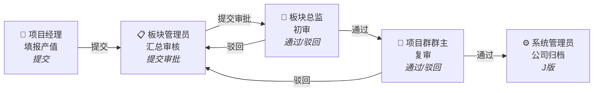

**月度节奏（可配置）：**

| 时间节点 | 事件 |
|---|---|
| 每月 1–3 日 | 财务核查提醒期，督促核对开票/回款数据 |
| 每月 19 日 | 系统自动发送填报提醒邮件给板块管理员 |
| 每月 22 日 | 系统自动发送锁定倒计时邮件，仅针对未完成审批的板块，按审批流位置通知对应角色（板块管理员/总监/群主）（锁定日前 3 天） |
| 每月 25 日 | 月度锁定，填报窗口关闭、数据冻结 |
| 次月 9 日 | 可选自动解锁节点；默认关闭，由系统管理员手动解除锁定 |

### 0.3 关键角色速查

| 角色 | 一句话定位 |
|---|---|
| **项目经理** | 填报自己管辖项目的产值、进度、WIP 数据 |
| **板块管理员** | 汇总本板块所有项目数据，校验后提交审批 |
| **板块总监** | 审批本板块的填报数据（只读，有错须驳回） |
| **项目群群主** | 复审通过总监初审的数据 |
| **经营管理（只读）** | 按权限范围查阅数据，不参与填报和审批 |
| **系统管理员** | 管理整个系统：用户、配置、锁定、归档 |

### 0.4 关键术语

| 术语 | 含义 |
|---|---|
| **存量合同额（S 列）** | 总合同额 − 始累完成额，表示尚未完成的部分，不得为负 |
| **存量开票额（R 列）** | 总合同额 − 始累开票额，为负表示累计开票已超合同额（预警） |
| **快照（Snapshot）** | 某一时刻的全量数据快照，用于变更对比和版本归档。I 版=导入初始化、D 版=板块提交审批、J 版=公司归档 |
| **baseline** | 变更对比基准，通常是最近一次 I 版或 J 版快照 |
| **报告月** | 当前正在填报的业务月份（如 2026-05），由系统管理员在管理设置中配置 |
| **引用列 / `_system_ref`** | 从工程平台（CRB/财务系统）同步的数据，显示在表格中但可被管理员覆盖 |
| **Luckysheet** | 系统使用的在线类 Excel 表格组件，支持公式计算、单元格锁定、批注等 |

### 0.5 技术栈简述

- **前端：** Vue 2 + Element UI + Luckysheet（类 Excel 在线表格）
- **后端：** Node.js + Express + SQLite
- **设计品牌色：** `#007069`（Wood 品牌绿），背景 `#f8faff`，简洁商务风格（详见 `docs/设计文档/DESIGN.md`）

### 0.6 系统架构总览

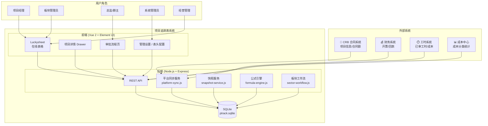

### 0.7 文档结构导引

| 章节 | 内容 | 适合谁看 |
|---|---|---|
| **1. 角色与权限** | 6 个角色的详细定义、页面权限、字段级权限矩阵 | 产品、开发、测试 |
| **2. 数据同步** | 工程平台数据如何对接、合同额取值逻辑 | 产品、开发 |
| **3. 填报交互** | 表格布局、工具栏、Drawer、导入导出、保存 | 产品、开发、UI |
| **4. 填报周期与锁定** | 月度时间窗、锁定机制、列级只读规则 | 产品、开发 |
| **5. 变更追踪与高亮** | 审计日志、变更高亮、批注、存量预警 | 产品、开发 |
| **6. 审批流程与版本** | PM 提交、板块审批、快照管理、系统管理员归档 | 产品、开发 |
| **7. 系统管理** | 表头配置、开发测试重置 | 开发 |
| **8. 业务规则** | 数据源、产值申报、WIP、预收款、跨年结转 | 产品、业务方 |
| **9. 补充需求确认** | 已确认的补充需求清单 | 产品、开发 |
| **附录** | 数据范围、字段纠正、待确认项 | 产品 |

---

## 1. 角色与权限

### 1.1 角色定义

系统共设 **6 个角色**，权限分工如下：

| 角色 | 定位 | 编辑权限 | 审批权限 | 说明 |
|---|---|---|---|---|
| **系统管理员** | 系统运维 | ✅ | △ | 负责系统配置、审批人员配置、数据锁定/解锁、报表生成配置等；**项目追踪表**页可编辑全公司项目中来源类型为 `system_sync`（系统同步/引用列覆盖）与 `manual_input`（手工填报）的列，见 **§1.3**、**§2.2**；**唯一**可访问**审计日志**页；工具栏「**刷新数据**」（§2.5）、「**提交归档**」生成 **J版**（**仅锁定期**可用，§3.5、§6.4）；**版本下拉仅系统管理员可见**，可切换查看并下载历史 J 版（§3.8）。 |
| **经营管理（只读）** | 汇总查阅 | ❌ | ❌ | 原「财务审核」扩展为经营管理只读用户（财务、板块/群非审批领导、公司管理层）。上线后由平台全局权限带入 dataScope（全公司 / 板块 / 项目群）；**始终只读**；**无**审批流程、**无**审计日志、**无**管理设置。次月 1–3 日核查提醒横幅仍可见。 |
| **板块管理员** | 数据管理 | ✅ | ❌ | 负责板块内数据汇总校验、异常数据处理；可见填报、审批流程；不渲染「刷新数据」按钮，进入填报/报告线表单时自动加载最新可见范围数据；**不可**访问审计日志。 |
| **项目经理** | 数据填报 | ✅ | ❌ | 负责本人管辖项目的产值、进度、WIP 分析填报，Excel 导入/导出。 |
| **板块总监** | 审批决策 | ❌ | ✅ | 审批流程页查看本板块全部项目（**§6.3**）；**只读** Luckysheet；改数须 **驳回**。 |
| **项目群群主** | 审批决策 | ❌ | ✅ | 同板块总监；驳回后退回板块管理员修改。 |

### 1.2 经营管理数据范围与平台配置来源

| dataScope | 可见项目 | 典型人员 |
|---|---|---|
| **company** | 全库（与系统管理员同视野，仅只读） | 公司管理层、财务汇总岗 |
| **sector** | `unit_code === sectorCode` | 板块非审批领导 |
| **group** | 平台项目群配置下全部板块 | 项目群非审批领导 |

- 上线后，经营管理、项目经理、板块总监、项目群群主等角色与数据范围均来自平台全局权限；本系统不新增/停用这些用户，也不维护项目群。
- 原型演示中仍保留 `meta.users` 与 `meta.groupRegistry` 作为本地模拟数据；上线集成时应由平台用户上下文替换。
- 同一人兼「审批决策」与「经营管理查阅」：上线后由平台全局权限决定入口；原型演示中使用不同账号/身份模拟。

#### 1.2.1 项目数据范围判定规则

- **按板块查看 / 管理：** 板块管理员、板块总监、板块范围经营管理等视角，均按项目数据源中的**板块号 / 项目执行单位编码**判定项目归属（当前字段为 `unit_code`，上线后对应平台项目执行板块编码）。即使某项目号暂未在工程平台注册，只要初始化表或数据源中带有对应板块号，也应归入该板块统一管理。
- **按项目经理查看 / 管理：** 项目经理视角不直接按追踪表中的项目经理姓名列（`pm_name`）过滤，必须先以 `project_no` 到平台查询该项目绑定的项目经理用户（用户 ID / 平台账号），再与当前登录用户匹配。这样避免同名项目经理、姓名变更、表内姓名文本不规范导致错配或漏配。
- **平台未登记项目：** 若项目号在平台无匹配记录，则不归属任何项目经理个人视图；该项目仍按数据源板块号进入对应板块，由板块管理员负责维护、汇总和提交审批。
- **实现要求：** 前端/后端数据范围过滤应优先使用平台项目归属关系；本地原型可保留 `pm_name` 作为演示 fallback，但上线集成不得以姓名列作为项目经理权限的唯一依据。

### 1.3 角色字段级权限矩阵（6 角色 × 83 字段）

#### 权限规则汇总

下表按**字段业务约束**拆分，而不是按角色重复拆分：`manual_input` 的可编辑角色基本一致，差异主要来自报告月时间窗、平台实际值同步和锁定状态。**系统管理员在项目追踪表中的可编辑范围为所有来源类型 `system_sync`（系统同步/引用列，可覆盖显示值）与 `manual_input`（手工填报）的列；`auto_calc` 公式列、项目号等运行期只读列不开放编辑。**

| 字段类别 | 可编辑角色 | 说明 |
|---|---|---|
| **工程平台引用列**（平台同步字段 + 报告月 MI/MP，**含 A 列新/旧项目，不含 N/T**） | 默认全部 R；**系统管理员 W**（覆盖显示值） | 同步写 `_system_ref`；覆盖写 `_system_override`（§2.2） |
| **初始化导入基准列（N/T）** | 仅 **系统管理员 W** | 不属于平台系统取值；初始化导入后作为历史基准保留，平台新增项目默认 `0` |
| **auto_calc**（公式计算） | 全部 R | 不可编辑 |
| **manual_input（月度完成额 MC，AV–BG）** | 系统管理员 W · 板块管理员 W · 项目经理 W | 仅报告月当月及之后月份可写；报告月之前为历史只读 |
| **manual_input（未来月开票/回款预测 MI/MP，BH–CE）** | 同上 | 报告月当月 MI/MP 归入引用列；仅报告月之后月份可写 |
| **manual_input（实施进展等非月度字段，如 M）** | 同上 | 不受月份窗限制；锁定期除系统管理员外只读 |
| **manual_input（WIP 分析 AM–AU）** | 同上 | 不受月份窗限制；WIP 为 0 或空时 Drawer 默认折叠，但仍可手动展开填写 |
| **项目号 F** | 全部 R | 运行期不可编辑 |

### 1.4 用户与权限配置（管理设置）

- **持久化：** `meta.sectorAdmins`、`meta.sectorReviewers`、`meta.groupReviewers`；API `GET/PATCH /api/admin/users` 兼容旧字段，管理 UI 一次保存三类配置。
- **审批人员配置：** 按 `sectorRegistry` 渲染单表四列——板块、板块管理员、板块审批、项目群审批；板块审批按板块编码存储，项目群审批按 `groupRegistry` 中的项目群编码存储。
- **板块审批 / 项目群审批：** UI 列名不使用「板块总监」「群主」；未配置时默认取自平台组织关系，也可指定其他管理人员。
- **项目群审批列：** 前端根据 `groupRegistry` 反查板块所属项目群；同一项目群多板块行共享 `groupReviewers[groupCode]`。
- **审批节点跳过：** 不在管理页手工配置；板块管理员提交审批时，后端根据 `sectorAdmins[sectorCode]` 匹配平台用户并判断是否具备同板块 `sector_director` 权限，若是则跳过板块审批节点。
- **不在本系统维护：** 经营管理、项目经理等填报权限来自平台全局权限；项目群组织关系沿用平台 `groupRegistry`。
- **登录页：** 原型演示保留角色/用户选择；上线后由平台统一登录与权限识别，不展示角色切换界面。

### 1.5 角色页面权限与默认路由

> **说明：** 首版**不提供**独立「数据看板」页（KPI 卡片 / 图表汇总）；各角色在**项目追踪表**或**审批流程**中查阅与操作数据。公司级运营看板若需对接，另立项目，不在本系统范围内。
>
> **区分两类权限：** 本节先说明**路由与侧栏可见性**；**审批操作**（提交/通过/驳回/归档）见 **§1.5.2**，流程状态机见 **§4.3**。

#### 1.5.1 页面可见性与路由

**实现：** `js/router.js`（`beforeEach` 守卫、`homePathForRole`）、`js/components/AppLayout.js`（`hideForRoles` / `adminOnly`）。

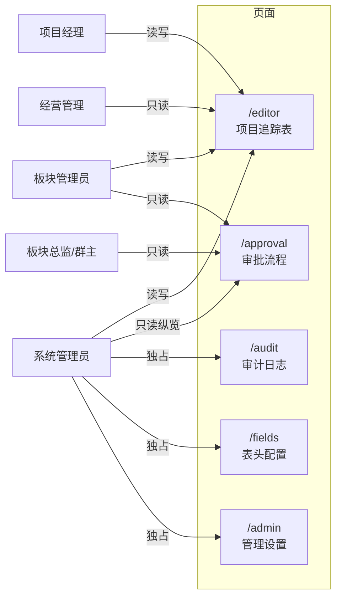

| 角色 | 可见页面 | 路由键 |
|---|---|---|
| **项目经理** | 项目追踪表 | `pm` |
| **板块总监 / 项目群群主** | 审批流程 | `sector_director` / `group_leader` |
| **经营管理（只读）** | 项目追踪表（按 dataScope 过滤，只读） | `executive_viewer` |
| **板块管理员** | 项目追踪表、审批流程 | `sector_admin` |
| **系统管理员** | 全部页面（**含唯一**审计日志、**表头配置** §7.1、**管理设置** §7.2） | `system_admin` |

- **路由守卫：**
  - `pm` / `executive_viewer` 访问 `/approval` → 重定向 `/editor`
  - `sector_director` / `group_leader` 访问 `/editor`、`/audit`、`/admin`、`/fields` → 重定向 `/approval`
  - 非 `system_admin` 访问 `/audit`、`/fields`、`/admin` → 重定向首页（填报或审批）
- **侧栏：** 「审批流程」对 `pm`、`executive_viewer` 隐藏（`hideForRoles`）；「审计日志 / 表头配置 / 管理设置」仅 `adminOnly`
- **默认首页：** `homePathForRole` — `sector_director` / `group_leader` → `/approval`；其余 → `/editor`
- 项目追踪表的数据范围按 **§1.2.1 项目数据范围判定规则** 过滤：板块视角按数据源板块号，项目经理视角按平台 `project_no → 项目经理用户` 绑定关系；`pm_name` 仅可作为原型演示 fallback，不作为上线权限依据。

#### 1.5.2 审批操作权限（与页面权限区分）

**实现：** 提交审批 `Store.submitForApproval()`（填报页 `js/views/ProjectEditor.js`）；通过/驳回 `js/views/Approval.js` 的 `canApprove` / `canReject`；系统管理员审批页 `SystemAdminApprovalBoard`（只读纵览，无板块级按钮）；J 版归档 `Store.submitArchive()`（填报页工具栏）。

| 操作 | 角色 | 页面 | API / 条件 |
|---|---|---|---|
| **提交审批**（D 版） | `sector_admin` | `/editor` | `POST /api/sectors/:code/submit-approval`；若系统自动判断板块管理员兼任同板块总监，则直接 `approvalStatus=approve1` |
| **初审通过 / 驳回** | `sector_director` | `/approval` | `canApprove`/`canReject`：`reportingSubmitted && approvalStatus==='draft'` |
| **复审通过 / 驳回** | `group_leader` | `/approval` | `canApprove`/`canReject`：`approvalStatus==='approve1'` |
| **提交归档**（J 版） | `system_admin` | `/editor` | 工具栏「提交归档」；**仅锁定期**（`canSubmitArchive` 要求 `lockStatus === 'locked'`，后端 403）；**不在** `/approval` |

各角色在 **`/approval` 页内**：

| 角色 | 模板分支 | 页内能力 |
|---|---|---|
| `sector_admin` | 时间轴 + 快照/版本对比 | 只读；`canApprove`/`canReject` 恒为 false |
| `sector_director` / `group_leader` | `ApprovalReviewSheet` + 操作区 | 只读表格；待办节点显示通过/驳回 |
| `system_admin` | `SystemAdminApprovalBoard` | 十二板块卡片；无板块级通过/驳回 |
| `pm` / `executive_viewer` | — | 路由不可达 |

- **跳过总监初审：** 后端基于 `meta.sectorAdmins[code].adminUserId/adminName` 与平台用户权限自动判断；为 true 时提交后状态为 `approve1`，总监的 `draft` 待办条件不成立，仅群主可见复审按钮（§1.4、§4.3）。

---

## 2. 数据同步与工程平台对接

### 2.1 数据同步总览

- **滞后可接受：** 跟踪表全量项目范围来自**工程平台**（CRB 合同/项目 + 产值/开票/回款等），但表格**不实时**跟随平台变化。以 **`project_no` 为唯一索引**，项目只增不删；**显示值**以 Excel 导入/管理员修正为准，平台同步写入 **`_system_ref` 引用快照**（见 **§2.2**）。
- **批量刷新（已实现框架，开发期 stub）：**
  - **手动刷新（已实现）：** 仅**系统管理员**在填报页点击「**刷新数据**」→ `POST /api/editor/refresh-data`：① 工程平台引用同步（新增项目、工程平台引用列 `_system_ref`、报告月 MI/MP；不覆盖 N/T 初始化导入基准）；② 重载 SQLite 中**最新项目 payload**（含各 PM 已提交/已保存数据、板块管理员改数、审批驳回后恢复的数据）。**不**覆盖未被管理员覆盖的系统引用显示值（§2.2）。
  - **进入表单自动刷新（已实现）：** PM 与板块管理员不渲染「刷新数据」按钮；进入项目追踪表/报告线表单时通过 bootstrap 或 `ReportLineDetail.loadDetail()` 拉取最新可见范围数据。
  - **自动同步：** 每日定时（默认本地 **02:00**）执行与手动刷新相同的平台引用同步；**达到月度锁定日**后暂停自动任务。
  - **合并规则（§2.2）：** 平台同步**仅**更新 `_system_ref`，**不**自动改写已有项目的显示字段；平台新增项目号 → INSERT（显示值=平台值，不设覆盖标记）。
  - **审计：** 每次同步写入 `audit_log`（`operation_type: platform_sync`），文案为「更新系统引用快照」。
  - **接口（已实现）：** `POST /api/admin/sync-platform-data`；`meta.systemDataSyncedAt` / `systemDataSyncMeta` 经 bootstrap 下发。

#### 数据同步流程图

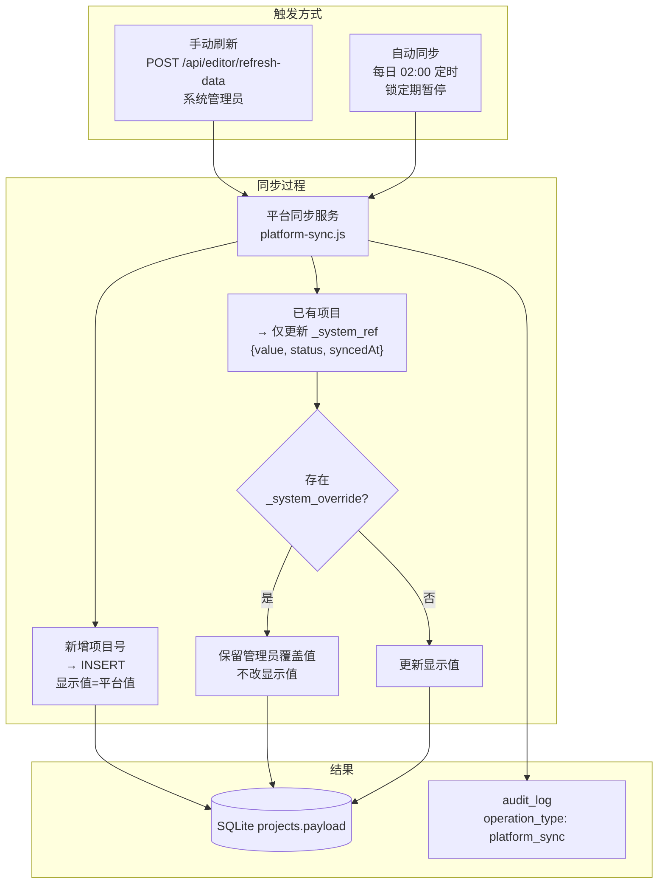

### 2.2 工程平台引用列（显示值 / 引用值 / 管理员覆盖）

| 维度 | 规则 |
|---|---|
| **引用列** | 工程平台引用列（不含 N/T 初始化导入基准列，含 **A 列新/旧项目**，见 **§2.3**）+ 报告月当月开票/回款（`mi_*` / `mp_*`）；数据源为**工程平台 / 财务系统** |
| **显示值** | 表格、公式、`FormulaEngine` 使用 payload 字段值；Excel 导入保留 |
| **`_system_ref`** | 平台同步只写引用快照 `{ value, status, syncedAt }` |
| **`_system_override`** | 系统管理员编辑引用列后标记；后续同步不改显示值 |
| **恢复** | 覆盖格清空失焦 → 弹窗「是否恢复系统引用」 |
| **视觉** | **已覆盖**格浅蓝 `#e8f4fd` + 批注展示引用值（图例「系统引用已覆盖」） |
| **项目号 F** | 运行期不可编辑 |

- 实现：`js/system-ref-meta.js`；管理员覆盖审计 `operation_type: system_ref_override`。
- **最后更新时间（已实现）：** 填报页底栏「共 xx 条记录」**行末**展示 `systemDataSyncedAt`（`系统数据更新于 yyyy-MM-dd HH:mm`）；**所有角色可见**；未同步时显示「尚未同步」。

### 2.3 A 列「新/旧项目」（系统取值，已实现）

| 维度 | 规则 |
|---|---|
| **来源** | `source_type: system_sync`；**不再**由 `FormulaEngine` 按合同签署年公式计算 |
| **系统判定** | 是否为**报告年度**新增项目：平台同步**新入库**的项目号 → 默认「新项目」，写入 `_new_existing_year = 报告年` |
| **已有项目** | 同步仅更新 `_system_ref.new_existing`：`_new_existing_year === 报告年` → 引用值「新项目」，否则「旧项目」；**不改**已有显示值（除非管理员未覆盖且触发年末 rollover） |
| **年末 rollover** | 当 `meta.reportingMonth` **报告年**大于 `meta.newExistingClassYear` 时（管理设置改报告月、平台定时同步时检测）：**全部**项目引用值改为「旧项目」，清除 `_new_existing_year`；**未**被管理员覆盖（`_system_override.new_existing`）的显示值同步改为「旧项目」 |
| **管理员覆盖** | 与 §2.2 一致：系统管理员可编辑 A 列显示值；审计 `system_ref_override`；清空可恢复引用值 |
| **Excel 导入** | 保留 A 列显示值，并写入 `_system_ref`；若显示为「新项目」则标记 `_new_existing_year` 为当前报告年 |

- 实现：`js/new-existing-ref.js`；`server/platform-sync.js`（`maybeRunNewExistingYearRollover`）；`server/xlsx-seed.js`（`seedImportRefs`）。
- **与「新增项目行」高亮（§5.3.1）区分：** `_added_this_month` 表示相对 **baseline** 新出现的项目号；A 列「新/旧项目」表示**当年**业务分类，二者独立。

### 2.4 合同额区（N / O / P，已实现）

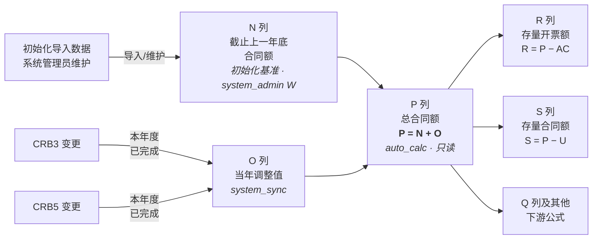

| 列 | 字段 | 来源 | 规则 |
|---|---|---|---|
| **N** | 截止上一年底合同额 | 初始化导入基准 | 取初始化导入文件中的值；平台新增项目均为本年度新增项目，无历史年度数据，默认 `0`；仅 `system_admin` 可编辑。 |
| **O** | 当年调整值 | `system_sync` | **工程平台（CRB）同步**：本项目在**报告年度**内已完成的 **CRB3** 与 **CRB5** 合同额**之和**，表示当年合同变更增量；写入 `_system_ref.adj_value`；系统管理员可覆盖显示值（§2.2）。 |
| **P** | 总合同额 | `auto_calc` | **`P = N + O`**；由 `FormulaEngine` 每次重算；前端不可编辑；下游 R/S/Q 等公式均以 P 为输入。 |

- **取值说明（O 列）：** CRB3、CRB5 为合同变更流程类型；平台按项目号汇总**本年度已完成**的两类变更合同金额，作为当年调整值推送至跟踪表。无当年变更时 O 为 `0`。
- **与旧逻辑差异：** 不再由 `O = P − N` 反推；**P 不再直接从 CRB 取 CRB1/CRB3 单值**，而由基准 N 与当年增量 O 合成。
- **Excel 导入：** 保留 O 列显示值并写入 `_system_ref`；导入后 `FormulaEngine` 重算 P。
- **实现：** `fields.json`（N=初始化导入/系统管理员维护、O=`system_sync`、P=`auto_calc`）；`js/formula-engine.js`；`server/platform-sync.js`（`adj_value` 纳入引用同步键，N 不由平台同步覆盖）。

### 2.5 锁定期管理

- 填报期开启时，管理员可**手动锁定数据快照**。
- 锁定期间（含每月 25 日起），**暂停自动**平台同步；手动同步仍仅系统管理员可用。
- 填报结束审批后，解锁并可在次月开启新一轮填报前更新数据。

### 2.6 初始化导入平台合并（mergeInitialImportWithPlatform，已实现）

**触发入口：** `seedFromXlsxIfEmpty()`（首次启动）、`importProjectsFromInitXlsx()`（reseed / reset-dev）——均在 `projectsFromXlsxBuffer` 之后、`replaceAllProjects` 之前调用 `mergeWithPlatformAfterImport()`。

**函数签名：**

```
mergeInitialImportWithPlatform(excelProjects, platformProjects, reportingMonth, modules)
  → { projects, stats: { total, matched, overrides, unmatched } }
```

**实现文件：** `server/platform-sync.js`

**三分支逻辑：**

| 分支 | 条件 | 处理 |
|---|---|---|
| **A — 未匹配** | `project_no` 不在 `platformMap` 中 | `_platform_unmatched = true`；所有 refKey 写入 `_system_ref[refKey] = { value: null, status: 'not_on_platform', syncedAt }`；不创建 `_system_override` |
| **B — 匹配有差异** | 平台存在该项目，至少一个 refKey 值不一致 | display 保持 Excel 值；`_system_ref[refKey]` 写入平台值（`status: ok`）；差异字段写 `_system_override[refKey] = { at, userId: 'system', userName: '初始化导入' }` |
| **C — 匹配一致** | 平台存在该项目，所有 refKey 值相同 | display 保持 Excel 值；`_system_ref[refKey]` 写入平台值（`status: ok`）；无 override |

**排除字段：**
- `new_existing`（A 列）——由 `NewExistingRef.seedImportRefs()` 在 `projectsFromXlsxBuffer` 中单独处理，合并函数不再覆盖
- `project_no`（F 列）——主键，仅用于匹配，不参与值比较

**值比较规则（`valuesEqual`）：**
- `null` / `undefined` / `''` 统一视为"空"，互相等价
- 数值字段：`Number()` 后严格 `===`
- 字符串字段：`String().trim()` 比较
- MI/MP 字段：通过 `resolvePlatformValue()` 优先从 `monthly_invoice`/`monthly_payment` 数组读取，保证两端解析一致

**平台独有项目不插入：** 与 `mergePlatformData()`（日常同步）不同，初始化合并以 Excel 为唯一权威，平台多出的项目号被忽略。

**前端渲染：**
- `SystemRefMeta.UNMATCHED_BG = '#fff3cd'`（浅琥珀色）
- `SystemRefMeta.isUnmatchedProject(project)` → `!!project._platform_unmatched`
- `formatRefComment()` 新增 `not_on_platform` 状态分支：`"该项目号未在工程平台注册\n数据来源：初始化导入表"`
- `ProjectEditor.js`：F 列在 `luckysheetCellBg()` 中优先检查 `_platform_unmatched`，返回 `UNMATCHED_BG`；`applyLuckysheetSystemRefDecor()` 为 F 列添加批注 + 背景色
- 覆盖字段（Branch B）复用现有浅蓝 `#e8f4fd` + 批注机制（`isOverriddenField` 自动触发）

**审计：** 合并统计写入 `systemDataSyncMeta.mergeStats`；`console.log` 输出 `[ptrack] 初始化平台合并: {...}`

**错误容忍：** `mergeWithPlatformAfterImport()` 包裹 `try/catch`，平台快照获取失败时降级为纯 Excel 导入（`stats: null`），不阻断初始化流程。

---

## 3. 填报交互

### 3.1 填报模式总览

- **在线填报：** 支持在网页端直接修改单元格数据（基于 **Luckysheet**，类 Excel）。
- **填报视图（当前实现）：** 填报页**仅展示 Luckysheet**，为默认且唯一可见的填报界面；**经典 HTML 表格**实现代码保留于 `ProjectEditor.js`，通过 `showLegacyHtmlTable` 开关控制（默认 `false`，UI 不提供切换入口），便于开发对照或临时启用。默认关闭时使用 `v-if` 不渲染经典表 DOM，避免大数据量场景下隐藏表格仍创建大量节点。
- **工具栏视图筛选：** 「全部 / 新增 / 有变更 / **预警**」位于 Luckysheet 上方**表格工具栏**（`.sheet-toolbar`，见 **§3.4.2**），与 **§5.5** 联动；与「填报视图」切换无关。
- **Excel 导入/导出：**
  - 支持下载模板（包含已锁定的基础数据列）。
  - 支持用户上传填好的 Excel，系统自动解析更新。
  - **权限控制：** 无论是线上还是 Excel，均需实现**细粒度的单元格权限控制**（只读 vs 可编辑）。
  - **填报页 vs 管理页导入（已实现）：** 管理设置页为**全量覆盖**项目库；填报页「上传导入」为**按项目号合并**，仅覆盖当前角色可编辑字段（见 **§3.6**）。
- **信息折叠与排序：**
  - 基本信息等辅助信息可折叠，减少视觉干扰。
  - **排序优化：** 当月有数据变动（工时/产值/开票/回款）的项目自动置顶，无变动项目置后。

### 3.2 填报页面布局结构

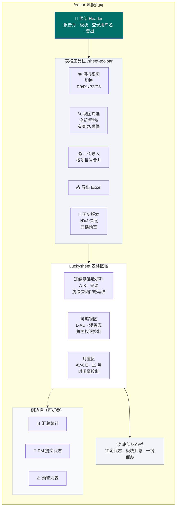

### 3.3 Luckysheet 表格布局

与源 Excel（S520，83 列字段字典）保持一致，避免「代码里的 E 列」与「界面上看到的 E 列」不一致。经典 HTML 表逻辑与 Luckysheet 对齐，但默认不向用户展示（见 **§3.1**）。

#### 3.3.1 列号对齐原则（已确认）

| 约定 | 说明 |
|---|---|
| **无额外序号列** | 不在数据区左侧增加「# / 序号」列；Luckysheet 行号由组件自带行头展示即可。 |
| **列字母 = 字段字典** | 字段字典中的列号（A、B、E、F…）与 Luckysheet 表头列字母、公式引用列字母**一一对应**（A→索引 0，E→索引 4）。 |
| **经典 HTML 表同步** | 经典表格视图同样不展示序号列，列顺序与字段字典一致。 |
| **公式引用** | Luckysheet 内 `auto_calc`、小计/合计行公式均按字段字典列字母书写（如 `E5` 表示字段 E、第 5 行），不再对全表做 +1 偏移。 |

#### 3.3.2 行布局（0-based，Luckysheet）

| 行号 | 用途 |
|---|---|
| 0 | **小计**（Subtotal）：金额列使用 `SUBTOTAL(9, 数据区)` |
| 1 | **合计**（Total）：金额列使用 `SUM(数据区)`；标签文案显示在 **G 列**（「小计 Subtotal」「合计 Total」） |
| 2 | 大类 / 分区标题行（按 `section` 合并单元格） |
| 3 | 字段中文标题行 |
| 4+ | 项目数据行（顺序与筛选结果一致） |

小计/合计置于大分类之上，**默认筛选**仅覆盖「字段标题行 + 数据行」，避免汇总行被筛掉。

**大数据渲染说明（已实现）：**
- Luckysheet 按当前筛选结果全量连续渲染，不做按条目分页，避免破坏项目追踪表类 Excel 的连续核对体验。
- 大数据内存溢出根因是默认隐藏的经典 HTML 表格仍由 `v-show` 创建全量 DOM；当前通过 `v-if="showLegacyHtmlTable && activeTab === 'table'"` 保证默认关闭时不渲染经典表节点。
- 若后续需要进一步降低默认渲染量，优先考虑按业务年份分组或默认折叠非执行项目，而不是机械按条目分页。

- **横向滚动与冻结列：** 筛选按钮挂在可滚动的 `#luckysheet-cell-main` 内。横向滚动时对 **A–F 冻结列** 的按钮按 `left = 基准left + scrollLeft` 补偿，使其与冻结表头对齐；对滚入冻结区下方的可滚动列按钮则 `display:none` 隐藏。

#### 3.3.3 冻结与表头

- **冻结窗格：** 冻结至字段标题行（含小计、合计、大分类行）及 **F 列（项目号）** 左侧，横向滚动时保留项目识别关键列（A–F）。
- **表头展示：** 仅显示字段**中文名**（`name_cn`，系统管理员可在 **§7.1 表头配置** 维护），不在表头第二行重复展示列字母（如 `(E)`）。
- **可编辑列（表头 + 数据格）：** 当前角色、锁定状态下**可编辑**的列：
  - **表头：** 浅黄底 `#fef9c3` + 深黄字（`--color-editable-header-*` / `.editor-th-editable`）；
  - **数据格：** 整列浅黄底 `#fefce8`（`--color-editable-cell-bg` / `.field-editable`），与变更浅橙、新增行浅绿按 **§5.3.3** 叠色优先级处理。

#### 3.3.4 列宽与自定义宽度

- **列宽配置：** 支持按**字段字典列字母**配置窄列（如 E/F/G）；写入 Luckysheet `config.columnlen` 时键为**列索引**（与列字母一致映射）。
- **防止被自动撑开：** 对已配置 `columnlen` 的列，须同步设置 `config.customWidth` 为**按列索引的对象**（如 `{ "4": 1 }`），避免网格刷新后按单元格内容重算列宽导致配置失效。
- **默认列宽：** 未单独配置的列按字段 `colWidth` 或合理默认宽度（约 72–220px）处理。

#### 3.3.5 金额列格式（`data_type = 金额`，已实现）

- **单元格类型：** `ct: { t: 'n', fa: '#,##0.00' }`；`v` 为数值型。
- **水平对齐：** `ht: '2'`（右对齐），含数据行、公式格、小计/合计行及列标题行。
- **可编辑格校验：** **不下发** Luckysheet `dataVerification`（避免左上角红色角标与「仅限数字」提示）；`cellUpdateBefore` 静默拦截非数字输入；入库经 `coerceFieldValue` 去千分位后转 `Number`。
- **实现：** `field-config.js`（`luckysheetCt` / `luckysheetHt`）、`ProjectEditor.js`（`applyLuckysheetAmountColumnStyle`、`isLuckysheetAmountInputValid`）；审批页 `ApprovalReviewSheet` 继承同一套逻辑。

#### 3.3.6 公式链与布局自适应

- **公式链：** 创建 sheet 时预构建二维 `data` 矩阵并配置 `calcChain`（sheet `index` 为数字 `0`；先数据行公式，再小计/合计行），避免初始化时 `mergeCalculation` 访问空行报错；加载后触发公式重算，保证 SUBTOTAL/SUM 与 `auto_calc` 正确显示。
- **布局自适应：** 侧栏折叠/展开时通过 `ResizeObserver` 与 `resize` 事件重算 Luckysheet 画布宽度，使表格区域随主内容区变宽/变窄。

#### 3.3.7 日期字段与 Excel 序列号（Luckysheet）

部分日期列（如 **AU 预测开票时间**、`data_type = 日期`）在 Luckysheet/Excel 内部常以 **序列号**（如 `45748`）存储。若直接入库，提交刷新后会显示为数字而非 `YYYY-MM-DD`。

**统一规则（已实现）：**

| 环节 | 行为 |
|---|---|
| **保存 / 导入** | `Formatters.normalizeDateValue` 将序列号、`Date`、文本统一为 **`YYYY-MM-DD`** 字符串再写入库 |
| **Luckysheet 展示** | `ct: { fa: 'yyyy-MM-dd', t: 'd' }`，`m` 为 ISO 日期，`v` 为对应 Excel 序列日 |
| **Excel 导入** | `xlsx-importer.js` / `server/xlsx-seed.js` 对 `data_type === '日期'` 列做同样规范化 |

**只读日期列**（如 CRB 同步的约定开始/结束时间 B、C）展示时同样走上述格式化，避免历史数据中的序列号裸显。

### 3.4 填报页工具栏

项目追踪表页（`ProjectEditor.js`）自上而下：**业务工具栏** → **图例条**（可关闭）→ **表格工具栏** → **Luckysheet** 画布。

#### 3.4.1 业务工具栏（`.editor-toolbar`，紧凑）

| 区域 | 内容 |
|---|---|
| **左侧** | 「版本」下拉（**仅 `system_admin` 可见**，`v-if="isSystemAdmin"`） → 填报期状态 **或** 快照提示条（二选一，见下） |
| **右侧** | **刷新数据**（仅系统管理员）· **导出 Excel · 清零当月完成额 · 上传导入**（一组）｜ **保存 · 提交归档**（仅锁定期可用） **· 提交/提交审批**（一组，竖线分隔） |

- **版本下拉**仅 `system_admin` 可见（`ProjectEditor.js` 模板 `v-if="isSystemAdmin"`）；其他角色（PM、板块管理员、审批角色、经营管理）始终查看当前填报数据，不渲染版本选择器。
- **可选范围：** 仅列出 **J 版快照**（`editorSnapshotOptions` 过滤 `parsed.stage === 'J'`，兼容旧键 `'J版'`）；不含 I 版、D 版。
- **查看 J 版快照时：** 隐藏 `period-banner`，改为 `editor-snapshot-badge`：**「当前正在查看快照 · {标签}」**；快照标签旁显示「**下载此版本**」按钮（`isViewingJSnapshot` 为 true 时可见），点击调用 `handleDownloadSnapshot()` → `XlsxImporter.exportToXlsx(snapshotProjects, reportingMonth, filename)` 导出 Excel。
- **版本选项文案：** 下拉列表与选中展示均使用**格式化时间**（含秒），不展示内部版本 ID；时间优先取快照 `time`，否则解析版本名末尾时间戳。
- **安全重置：** `activated()` 钩子中非 `system_admin` 强制 `viewingVersion = '__current__'`、`snapshotProjects = null`。
- **清零当月完成额（已实现）：** `ProjectEditor.js` `handleClearCurrentMonthCompletion()`；项目经理 / 板块管理员 / 系统管理员均可见，快照查看时隐藏。按钮按 `scopedProjects` 限定范围（PM 本人、板块管理员本板块、系统管理员全公司），并通过 `canClearCurrentMonthCompletion` 校验当前报告月完成额字段是否可编辑。点击后二次确认，将非 0 的 `mc_{monthIdx}` 写为 `0`，逐项目更新 payload、重算公式并保留变更高亮；审计日志只写一条 `clear_current_month_completion` 批量记录（含项目数量与清零前合计金额），不逐项目写审计，避免数据量过大。

##### 业务工具栏（`.editor-toolbar`，与表格工具栏分离，避免单行过挤）

#### 3.4.2 表格工具栏（`.sheet-toolbar`，Luckysheet 正上方）

| 区域 | 内容 |
|---|---|
| **左侧** | 项目筛选：**全部（N）** / **新增（N）** / **有变更（N）** / **预警（N）**（与 **§5.3**、**§5.6** 联动） |
| **右侧** | 勾选「**仅显示项目信息与可编辑列**」（`compactColumnsOnly` → `buildLuckysheetColhidden()`） |

- **实现：** `ProjectEditor.js`；审批页 `ApprovalReviewSheet.js` 继承同一套逻辑（筛选无「预警」项；右侧可保留板块提示文案 `reviewHintText`）。
- **样式：** `css/style.css` 中 `.sheet-toolbar`、`.view-toggle--compact`（筛选按钮高约 **26px**）；业务栏 `.editor-toolbar` 内边距约 **6×12px**。

#### 3.4.3 图例说明条

- **位置：** 业务工具栏下方、**表格工具栏上方**；可关闭（`showDiffHint`）。
- **条带样式：** 背景 `#f8fafc`（与 `.sheet-toolbar` 一致，`--color-sheet-toolbar-bg`）；次要灰色文字；底部分割线 `var(--color-border)`。
- **项与顺序（左 → 右）：**

| 图例文案 | 含义 | 示意 |
|---|---|---|
| **可编辑列** | 当前角色可填报列（数据格） | 14×14 浅黄纯色块 `#fefce8` |
| **新增项目** | `_added_this_month` 行（相对上月快照新出现，**非** A 列新/旧项目） | 14×14 浅绿纯色块 `#d9e7d8` |
| **有变更字段** | `_changed_fields` / `_field_change_log` | 14×14 浅橙纯色块 `#ffedd5` |
| **系统引用已覆盖** | 管理员覆盖工程平台引用列 | 14×14 浅蓝纯色块 `#e8f4fd` |
| **预警** | R/S 存量指标等为负等 | 14×14 浅红纯色块 `#fee2e2` |

- **样式类：** `editor-diff-hint`、`editor-legend-swatch--*`（见 `style.css`）；各项均为**统一尺寸纯色块**，无混用边框/文字样字/圆点。

#### 3.4.4 Luckysheet 配置与右键

- **Luckysheet 内置顶栏（已实现）：** `showtoolbar: false`，**不提供**撤销/还原、查找等 Luckysheet 原生工具按钮；`showinfobar: false`、`showsheetbar: false`；`showstatisticBar: true` + `showstatisticBarConfig: { count: false, view: false, zoom: true }`（**仅保留底部缩放**）；**`sheetFormulaBar: true`**（显示**公式/编辑栏**，便于查看与编辑单元格内容）；`lang: 'zh'`（列头筛选下拉等 Luckysheet 原生 UI 为简体中文）。
- **单元格右键：** 仅保留**列筛选**（`filter: true`）；行/列标右键关闭插删行列与改宽高。
- **下拉枚举：** 对含 `enum_values` 且当前可编辑的单元格，下发 Luckysheet 数据验证（dropdown）；选项文本内含英文逗号时跳过该校验格，避免解析错误。
- **默认筛选：** 表创建后对「字段标题行 + 数据行」范围开启筛选（`filter_select` + `setRangeFilter('open')`），小计/合计/大分类行在筛选区外。

### 3.5 保存与导出

#### 3.5.1 保存

- **入口：** 「保存」按钮（`canEdit` 时显示）。
- **行为：** 调用 `flushLuckysheetToStore()`：结束 Luckysheet 编辑态、等待进行中的单元格保存、扫描可编辑列补写未触发 `cellUpdated` 的格子；**不**生成审批快照、**不**触发 PM 提交流程；完成后 `buildTableData()` 并 `syncAllLuckysheetChangeDecor()`，恢复全部变更格的批注与高亮。
- **提交归档（系统管理员，已实现）：** 与「保存」同组，按钮文案「**提交归档**」；仅 `role === system_admin` 且非快照预览时显示（`canShowArchiveButton`）；**仅锁定期可用**（`canSubmitArchive` 额外要求 `lockStatus === 'locked'`，开放期按钮 disabled 并 tooltip 提示「仅在锁定期可提交归档」）；调用 `Store.archiveCompany()` → `POST /api/company/archive` 生成 **J版** 并重置流程态；**后端**同样校验 `dbm.getEffectiveLockStatus(db) === 'locked'`，否则返回 403；**不**要求全部板块 Approve2；**不**自动改 `lockStatus`。
- **说明：** 平时单元格修改已逐格 `PUT` 入库；「保存」用于刷盘未失焦的编辑。每次 `handleCellEdit` 从 Store 合并历史 `_field_change_log` 并去重后追加本条，避免「保存 → 再改 → 再保存」后先前批注丢失或与 `cellUpdated` 重复记同一变更。

#### 3.5.2 导出 Excel

- **导出 Excel：** 导出当前 `Store.projects`（全库），与版本下拉所选无关。
- **提交：** 逻辑不变（PM「提交」/ 板块「提交审批」）；见 **§6.2**。

### 3.6 上传导入（填报页）

- **入口：** 「上传导入」（`canImport`：系统管理员 / 板块管理员 / 项目经理；财务与审批角色不可导入；`canEdit` 且非 PM 锁定、板块未提交审批）。
- **解析：** `XlsxImporter.importFromFile`（与 Excel 列顺序、字段字典一致）。
- **合并规则（`js/import-merge.js`）：**
  - 以 **`project_no` 为唯一键**；
  - 仅当 `FieldConfig.canEdit` 为真时覆盖对应字段；`system_sync` / `auto_calc` 及不可编辑列**忽略**文件中的值；
  - 库中无匹配项目号的行**跳过**（不新增项目）；
  - 合并后 `FormulaEngine.compute` 再 `PUT` 逐条更新；
  - **PM：** 仅处理按 **§1.2.1** 平台 `project_no → 项目经理用户` 绑定关系归属当前登录用户的项目；本地原型可临时以 `pm_name` 作为 fallback；
  - 合并时通过 `ChangeMeta.mergeChangeTracking` 保留既有 `_field_change_log`，并为每个被覆盖字段追加批注元数据；
  - 写入审计日志（`fieldCN: 填报页导入`）。
- **与管理页区别：** 管理设置「导入」仍为 `replaceProjects` **全量覆盖**。

### 3.7 项目详情 Drawer

#### 3.7.1 Drawer 入口与布局（F 列入口，已实现 P0/P1）

- **入口：** 单击 Luckysheet **F 列（项目号）** 打开右侧 Drawer（1200px）；F 列禁止内联编辑，显示链接色与下划线。
- **Header（品牌色渐变顶栏；项目号/名称不在下方重复展示）：**
  - **标题行：** 左侧为项目号（小号）+ 项目名称（大号）；右侧为项目切换控件 **`←` · `当前序号/总数` · `→`**（如 `12 / 456`），按当前表格 **filteredProjects** 顺序切换（与筛选模式一致：全部 / 新增 / 有变更 / 预警）；首尾项对应箭头禁用；
  - **高亮卡片：** 客户名称；
  - **标签行：** 新/旧项目、企业属性、行业类别、业务类型；约定开始～结束日期（pill）；
  - **元信息行：** 项目经理；执行单位编码 + 板块名称（`SectorWorkflow.sectorDisplayLabel`，如 `SAS520 · 金山中心`）。
- **布局（Header 以下滚动区）：**
  1. **项目预警（已实现）：** 位于「跟踪信息填报」**上方**；**仅当存在至少一条预警时显示**整块区域，否则不占位。以 pill 标签展示当前项目的预警项，详见 **§3.7.2**；
  2. **跟踪信息填报：** 区块标题右侧 **`?` Tooltip** 说明：浅黄色底色 = 当前角色可编辑字段（与 Luckysheet **§5.3** 一致）；未产生 WIP 时分区自动折叠及无需填写 WIP 相关内容的规则；
  3. **填报区：** 当前角色可编辑字段，按业务 section 折叠（**默认全部展开**，见 WIP 例外）；各 section 标题**左侧带 Element 图标**；含可编辑字段的 section **整体**归入填报区（同 section 内只读公式列以内联 `el-descriptions` 展示，**不在参考区重复**）；月度完成/开票/回款以 12 月 compact 条带展示；
  4. **参考区（「其他跟踪数据」）：** 其余只读字段按 section 折叠（默认收起），`el-descriptions` 多列紧凑展示；section 标题同样带图标；
  5. **辅助区（「项目工时与成本」，P2 已实现）：** 与参考区相同 **`el-collapse` + `drawer-collapse-title`（图标 + 名称）** 结构；含 **工时数据**、**成本数据** 两个折叠项（默认收起）；均为**只读参考**，不参与填报与审批。详见 **§3.7.3**、**§3.7.4**。
- **可编辑视觉（与 Luckysheet 一致，`--color-editable-cell-bg` / `#fefce8`）：**
  - 填报区内**当前角色可编辑**的普通字段、月度条带可编辑格：浅黄底；
  - 聚焦时输入框变白底、品牌色边框；**不高亮**「当前报告月」月份格本身。
- **金额千分位（已实现）：** Drawer 内可编辑**金额**字段（含月度完成/开票/回款）失焦后按 `Formatters.formatAmount` 展示千分位；聚焦编辑时显示纯数字便于输入；保存时经 `coerceFieldValue` / `parseAmount` 入库。
- **报告月完成额填报参考（已实现）：** 聚焦**报告月**「月度完成」可编辑格时，输入框**上方 Popover** 展示（只读，不参与保存）：
  - 总合同额（P）；
  - 截止上月始累完成合同额（T + Σ1月～报告月前一月完成额）；
  - 当月上报工时（工时 API 总计行已审工时）；
  - 当月工时成本（工时 API 总计行已审工时成本）。
  - 工时项在 API 加载完成前显示「加载中…」。实现：`ProjectAlerts.getCompletionFillAux`。
- **WIP 折叠规则：** 当 **`WIP（不含税）`（列 AH / `wip_excl_tax`）为 0 或空** 时，「WIP分析与措施」section **默认折叠**，标题右侧显示灰色提示标签 **「本项目未产生WIP」**；用户仍可手动展开填写。
- **P1 控件：** 含 `enum_values` 的字段 → `el-select`（**I 列企业属性、Y 列税率**已改为自由文本，**无**下拉）；长文本（说明/备注/分析/措施/计划等）→ `textarea`（3 行）。
- **保存：** Drawer 内批量 diff → 单次 `PUT` + 公式重算 → `syncLuckysheetProjectRowValues` 就地更新该行单元格值与高亮（不整表 `refreshLuckysheet`）；完成额仅校验有效数字；**S 列约束仅在提交时校验**（§5.6）；切换项目不自动保存未提交编辑。
- **快照/只读：** 历史版本预览或 `canEdit === false` 时 Drawer 仍可查看，隐藏保存按钮。
- **全局 UI：** Element UI 组件主题色对齐 `docs/设计文档/DESIGN.md` 品牌色 `#007069`（`css/element-theme.css`）。
- **实现：** `js/project-drawer-layout.js`、`js/project-alerts.js`（**§3.7.2**、完成额填报参考）、`js/stock-validation.js`（完成额非负 + S 列）、`js/components/ProjectDetailDrawer.js`、`js/components/ProjectTimesheetAux.js`（**§3.7.3**）、`js/components/ProjectCostAux.js`（**§3.7.4**）、`css/style.css`（Drawer 样式与 `--color-editable-cell-bg`）、`css/element-theme.css`；`ProjectEditor.js` 提供 `navigateProjectDrawer`；`ApprovalReviewSheet` 继承 `ProjectEditorView`，审批待办节点同样可用 F 列入口。

#### 3.7.2 Drawer 项目预警区（已实现）

> **定位：** 在 Drawer 内集中展示当前项目的**预警标签**，便于 PM / 审批人在填报前快速识别异常；**只读提示**，不参与保存与审批流程。实现：`js/project-alerts.js`、`js/components/ProjectDetailDrawer.js`、`css/style.css`（`.project-drawer-alerts`、`.drawer-alerts-tag`）。

##### 显示规则

| 项 | 说明 |
|---|---|
| **位置** | Header 以下、**「跟踪信息填报」上方** |
| **显隐** | `ProjectAlerts.getProjectAlerts` 返回非空数组时显示整块；**无预警时不渲染**（不占空白区域） |
| **切换项目** | 随 `←` / `→` 或重新打开 Drawer 即时重算；打开/切换时异步拉取工时统计（见下） |
| **与表格工具栏「预警」筛选的关系** | 表格工具栏「预警（N）」仍仅按 **R/S 存量指标**筛选（**§5.6**）；Drawer 预警区额外包含**完成额 vs 工时**两类，**不**扩展表格行筛选口径 |

##### 预警类型（当前 4 种）

| 标签 | 判定条件 | 数据来源 | 阻断提交 |
|---|---|---|---|
| **存量开票额为负** | R 列（存量开票额 = P − AC）**< 0** | 公式重算后的项目数据 | 否（与 **§5.6** 一致） |
| **存量合同额为负** | S 列（存量合同额 = P − U）**< 0** | 公式重算后的项目数据 | 是（手工完成额编辑实时拦截 S<0；系统同步合同额变更触发自动对冲，见 **§5.6**） |
| **有完成额无工时** | **报告月**月度完成额 **> 0**，且同月**已审工时** ≈ 0 | 完成额：AV–BG 中 `monthIdx` 对应列；工时：`GET /api/projects/:projectNo/timesheet` 专业×月矩阵**总计行**同月列 | 否（辅助参考） |
| **有工时无完成额** | **报告月**已审工时 **> 0**，且同月月度完成额 ≈ 0 | 同上 | 否（辅助参考） |

- **阈值：** 金额与 R/S 预警一致，绝对值 **< 0.005** 视为 0；工时使用 **< 0.05 小时** 视为无工时。
- **工时相关预警加载策略：** Drawer 打开后请求当年工时统计；**请求完成前**不展示「有完成额无工时 / 有工时无完成额」（避免 API 失败或加载中误报）；存量 R/S 预警**同步计算**，不依赖工时接口。

##### Drawer UI

- **区块标题：** 「项目预警」；浅红底卡片（`#fff5f5`），与表格存量预警色（`#fee2e2` / `#dc2626`）一致。
- **标签：** 横向排列 pill，左侧 `el-icon-warning` + 预警文案；同一项目可同时展示多条（如 R 为负且完成额/工时不匹配）。
- **全部角色可见：** 与 Drawer 查看权限一致；不可点击跳转或编辑。

##### 实现要点

- **入口函数：** `ProjectAlerts.getProjectAlerts(project, monthIdx, timesheetStats, { timesheetReady })`。
- **存量预警：** 复用 `js/stock-validation.js` 的 `hasInvoiceStockWarning` / `hasContractStockViolation`。
- **完成额 vs 工时：** `monthCompletionAmount` 读 `mc_{monthIdx}`；`monthApprovedHours` 读工时 API 返回的 `byProfession.rows` 中 `isTotal === true` 行的 `months[monthIdx].hours`（与 **§3.7.3** 统计口径一致：仅**已审工时**）。

#### 3.7.3 Drawer 辅助区：工时统计（已实现）

> **定位：** 平台工时系统数据作为产值申报的**辅助参考**；数据可能不完整，**不得**作为填报或审批依据。实现：`server/timesheet-import.js`、`server/timesheet-stats.js`、`js/components/ProjectTimesheetAux.js`。

##### 数据来源与导入

| 项 | 说明 |
|---|---|
| **关联键** | 平台「项目编码」= 追踪表 `project_no`（F 列） |
| **开发期数据源** | `docs/参考数据/工时上报明细统计_{projectNo}.xlsx`（或环境变量 `PTRACK_TIMESHEET_DIR` 指定目录） |
| **启动导入** | 库表 `timesheet_entries` 为空且目录内有 xlsx 时自动导入 |
| **手动重导** | 系统管理员 `POST /api/admin/timesheet-import`（写入 `audit_log`） |
| **后续** | 真实中台工时 API 就绪后替换文件扫描；Drawer 与 `GET /api/projects/:projectNo/timesheet` 契约不变 |

**明细字段（Sheet1 表头）：** 序号、项目编码、板块归属、项目名称、单元号/名称、项目经理及管理归属、专业负责人及管理归属、工程师及**工程师管理归属**、主专业/专业、资格、日期、提交/待审/已审工时(H)、备注、费率、**已审工时成本**。

##### 统计规则

| 规则 | 说明 |
|---|---|
| **当年筛选** | `periodConfig.systemYear`（缺省取 `reportingMonth` 年份） |
| **统计口径** | 仅累加 **已审工时(H)**、**已审工时成本**；提交/待审列忽略 |
| **专业×月** | 行 = `专业` + 首行 **总计**（各月/合计汇总）；列 = 1–12 月 + 合计 |
| **板块×月** | 行 = `工程师管理归属` + 首行 **总计**；列 = 1–12 月 + 合计 |
| **排序** | 各透视表按合计已审工时降序（总计行固定首行） |

##### Drawer UI

- **入口：** Drawer「**项目工时与成本**」区内 **`el-collapse-item`「工时数据」**（标题样式与「其他跟踪数据」下各 section 一致：图标 + 名称）。
- **有数据时布局（自上而下）：**
  1. **维度 Tab：** 「专业×月」｜「板块×月」；
  2. **指标行：** 左侧「工时」｜「工时成本」单选；右侧 **查看明细**（`el-icon-tickets` + 文字，品牌色无边框链接）；
  3. **副标题：** `{year} 年 · {已审工时|已审工时成本} · 共 N 条明细 · {工时单位：小时 | 金额单位：元}`（随指标切换）；
  4. **矩阵表：** `el-table`，首行 **总计** 加粗浅灰底；金额列 `nowrap` + 横向滚动，避免换行。
- **矩阵表：** 工时为 1 位小数，成本为 `Formatters.formatAmount`；有值单元格可点击下钻。
- **查看明细：** 打开 Dialog，展示当年全部已审明细行。
- **单元格下钻：** 点击矩阵中有值的单元格（**总计行**不可下钻），按「当前维度行 + 月份」筛选明细；Tag 可清除恢复全量。
- **空态（已实现）：** 无当年已审数据时**仅**居中展示「**暂无已审工时记录**」；**不展示** Tab、指标切换、查看明细、副标题与矩阵表；不影响 Drawer 保存与项目切换。
- **加载 / 失败：** 加载中显示「加载工时数据…」；接口失败显示「工时数据加载失败」。
- **加载时机：** 打开 Drawer 或切换项目（`←`/`→`）时按 `project_no` 请求 API。

**明细 Dialog 列：** 日期、工程师、工程师管理归属、专业、单元、已审工时、已审工时成本、备注（支持排序）。

##### API

```
GET /api/projects/:projectNo/timesheet?year=2026
```

- `year` 缺省：`periodConfig.systemYear` 或 `reportingMonth` 年份。
- 响应含 `byProfession`、`bySector`（各 `{ rows: [{ key, isTotal?, months: [{ hours, cost }×12], totalHours, totalCost }] }`，首行 `key=总计`）、`details`、`empty`、`detailCount`。
- meta：`timesheetImportedAt`、`timesheetImportStats`（不经 bootstrap 下发；Drawer 按需拉取）。

##### 权限

- **全部角色只读：** 与 Drawer 查看权限一致；不可编辑、不参与变更批注（管理员导入写入 `audit_log`）。

#### 3.7.4 Drawer 辅助区：成本中心（已实现）

> **定位：** 平台成本中心数据作为产值/成本分析的**辅助参考**；**不等同于**成本法产值计算（见会议记录 §3.2），**不得**作为填报或审批依据。实现：`server/cost-categories.js`、`server/cost-import.js`、`server/cost-stats.js`、`js/components/ProjectCostAux.js`。

##### 数据来源与导入

| 项 | 说明 |
|---|---|
| **关联键** | 平台「项目编码」= 追踪表 `project_no`（F 列） |
| **开发期数据源** | `docs/参考数据/成本中心_{projectNo}.xlsx`（或 `PTRACK_COST_DIR` / 与工时共用 `PTRACK_TIMESHEET_DIR`） |
| **平台表格式** | 表头行为成本项（总计列忽略）；首列 `2026年MM月` 为月份行（`总计` 行忽略） |
| **启动导入** | 库表 `cost_entries` 为空且目录内有 xlsx 时自动导入 |
| **手动重导** | 系统管理员 `POST /api/admin/cost-import`（写入 `audit_log`） |
| **后续** | 真实中台成本 API 就绪后替换文件扫描；`GET /api/projects/:projectNo/cost-center` 契约不变 |

**固定成本项（行维度，顺序固定）：** 差旅及报销、人力成本、一般付款、涉外支付、设计服务分包、采购、施工分包、其他。

##### 统计规则

| 规则 | 说明 |
|---|---|
| **当年筛选** | `periodConfig.systemYear`（缺省取 `reportingMonth` 年份） |
| **矩阵** | **行** = 首行 **总计** + 上述 8 项成本；**列** = 1–12 月 + 合计 |
| **口径** | 各月各成本项金额累加；总计行 = 各成本项按列求和 |

##### Drawer UI

- **入口：** Drawer「**项目工时与成本**」区内 **`el-collapse-item`「成本数据」**（标题样式与参考区 section 一致）。
- **有数据时布局：**
  1. **工具栏：** 右对齐 **查看明细**（与工时同风格：图标 + 品牌色文字链）；
  2. **副标题：** `{year} 年 · 成本中心 · 共 N 条明细 · 金额单位：元`；
  3. **矩阵表：** 首行总计加粗浅灰底；金额 `nowrap` + 横向滚动。
- **查看明细：** Dialog 列 — 月份、成本项、金额（支持排序）。
- **单元格下钻：** 点击有值单元格；普通行按「成本项 + 月份」，**总计行**仅按月份筛全部成本项。
- **空态（已实现）：** 无当年成本数据时**仅**居中展示「**暂无成本记录**」；**不展示**查看明细、副标题与矩阵表；不影响 Drawer 其他操作。
- **加载 / 失败：** 加载中显示「加载成本数据…」；接口失败显示「成本数据加载失败」。

##### API

```
GET /api/projects/:projectNo/cost-center?year=2026
```

- 响应含 `rows`（含 `isTotal`）、`details`（`{ costMonth, category, amount }`）、`empty`、`detailCount`、`categories`。
- meta：`costImportedAt`、`costImportStats`。

##### 权限

- **全部角色只读：** 与 Drawer 查看权限一致；不可编辑、不参与变更批注（管理员导入写入 `audit_log`）。

### 3.8 历史版本查看（仅系统管理员）

- **权限：** 版本下拉框仅 `system_admin` 可见（`v-if="isSystemAdmin"`）；其他角色（PM、板块管理员、审批角色、经营管理）始终查看当前填报数据，`activated()` 钩子强制 `viewingVersion = '__current__'`。
- **入口：** 版本下拉：「当前填报」+ J 版快照列表。
- **列表范围（`editorSnapshotOptions`）：**
  - 仅列出 **J 版快照**：现代键 `J:YYYYMMDD:ALL:NN`（`BaselineDiff.parseSnapshotKey(k).stage === 'J'`）+ 兼容旧键 `'J版'`；
  - **不含** I 版、D 版、`Draft:*`、`PM:*`、`Month:*`。
- **切换行为：** 非「当前填报」时 `fetchSnapshot` → Luckysheet **只读**展示该 J 版快照的全量项目；`canEdit` 为 false。
- **下载此版本（`isViewingJSnapshot`）：** 查看 J 版快照时，快照标签旁显示「**下载此版本**」按钮（`el-icon-download`，size mini）；点击调用 `handleDownloadSnapshot()` → `XlsxImporter.exportToXlsx(snapshotProjects, reportingMonth, filename)`，文件名格式 `项目执行追踪_{快照label}.xlsx`。`exportToXlsx` 第三参数 `filename` 为可选覆盖。
- **提交按钮：** 查看快照时**隐藏**「提交」/「提交审批」（不仅禁用）；「保存」「上传导入」同步隐藏；右侧整组操作区收起。
- **与审批页：** 板块管理员等角色在审批页可查看版本快照与双版本 Diff；总监/群主在审批页使用独立 Luckysheet（**§6.3**，非版本快照 Diff）。填报页提供**就地预览**，不替代审批能力。

### 3.9 侧边栏折叠

- **折叠/展开入口（已实现）：** 折叠按钮位于**侧栏底部**（非 Logo 区、非顶栏）。
  - **展开态：** 底部展示「填报月份 + 填报期状态灯」，其下为「收起菜单」按钮（`el-icon-s-fold`）。
  - **折叠态：** 底部**仅显示「展开」按钮**（`el-icon-s-unfold`），**不再显示**填报期圆点状态灯；Logo 区缩为「金」字图标。
- **导航：** 折叠后菜单仅图标，悬停显示标题（Element UI `el-menu :collapse`）。
- **宽度：** 展开约 220px、折叠约 64px，带过渡动画；主内容区 `flex:1` 随侧栏变宽。
- **状态记忆：** `sidebarCollapsed` 写入浏览器 `localStorage`（`ptrack_sidebar_collapsed`），刷新后保持。

---

## 4. 填报周期与锁定机制

### 4.1 月度时间窗（动态可配置）

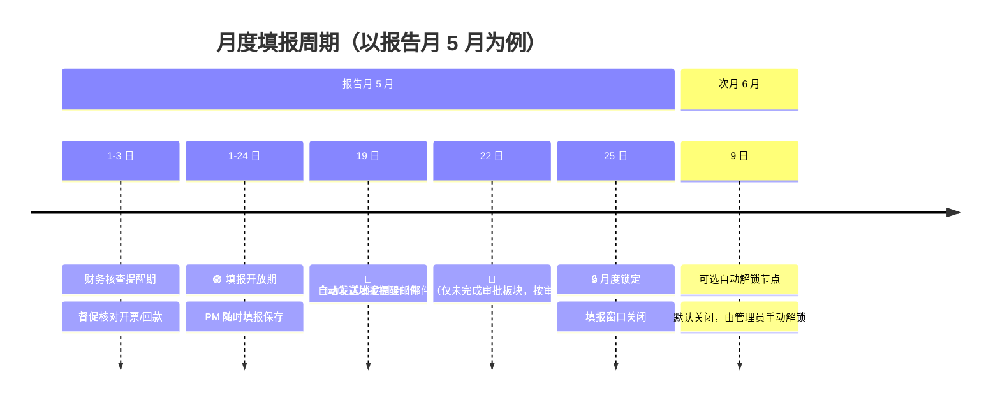

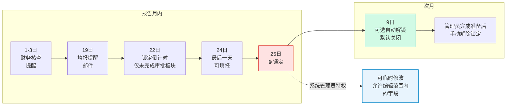

- **1 日～3 日：财务核查提醒期**（报告月次月 1–3 日，可配置）：系统向全员展示**提醒**（侧栏/填报页横幅），督促财务核对开票、回款、预收款等数据；**不**单独切换锁定状态，**不**赋予财务编辑权限。填报窗口仍按下方「月度锁定日 / 次月解禁日」及管理员手动锁定规则执行；`lockStatus` 仅 `open` | `locked`（历史 `finance_only` 在启动时归一为 `open`）。
- **填报提醒日（默认 19 日）：** `periodConfig.reminderDay` — 系统自动发送**提醒邮件**给各板块管理员。邮件内容包含板块维度统计（项目数、PM 提交率、未提交 PM 名单）和预警摘要（4 类预警数量）。仅在 `lockStatus === 'open'` 时发送。**实现文件：** `server/email-reminder.js`、`server/mailer.js`。**设计文档：** `docs/设计文档/EMAIL_REMINDER.md`。
- **锁定倒计时提醒（默认锁定日前 3 天）：** `periodConfig.lockDay - periodConfig.lockCountdownDaysBefore` — 系统自动发送**倒计时邮件**，仅针对**未完成审批流程的板块**（`meta.sectorFlows[sectorCode]`），根据 `approvalStatus` 通知当前审批位置对应角色：`draft` → 板块管理员（`sector_admin`）；`approve1` → 板块总监（`sector_director`，按 `sector` 字段匹配）；`approve2` → 项目群群主（`group_leader`）。已完成审批的板块跳过。无论锁定状态都发送。**实现文件：** `server/email-reminder.js`（`resolveLockCountdownRecipients` 函数）。**设计文档：** `docs/设计文档/EMAIL_REMINDER.md` §7。
- **月度锁定日（默认 25 日）：** `periodConfig.lockDay` — 报告月内当日 ≥ 锁定日时填报窗口关闭、数据冻结。除系统管理员外，任何人不可编辑（系统管理员仍受 **§4.3** 月度列时间窗约束）。
  - *管理员特权：* 系统管理员在锁定期可临时修改**允许编辑范围内**的字段（如 WIP 分析、未来月预测等），操作全程留痕；**不可**在线改写报告月当月及之前的开票/回款实际值列。
- **次月解禁日（默认 9 日）：** `periodConfig.unlockDay` — 可选自动解锁节点；`periodConfig.autoUnlockEnabled` 默认 `false`，关闭时次月到达解禁日仍保持 `locked`，需系统管理员手动「解除锁定」。
- **动态调整：** 上述三个时间节点（提醒日 / 锁定日 / 解禁日）与自动解锁开关在管理设置 **`periodConfig`** 中动态配置，以应对节假日或临时调整。

### 4.2 锁定状态计算与刷新（已实现）

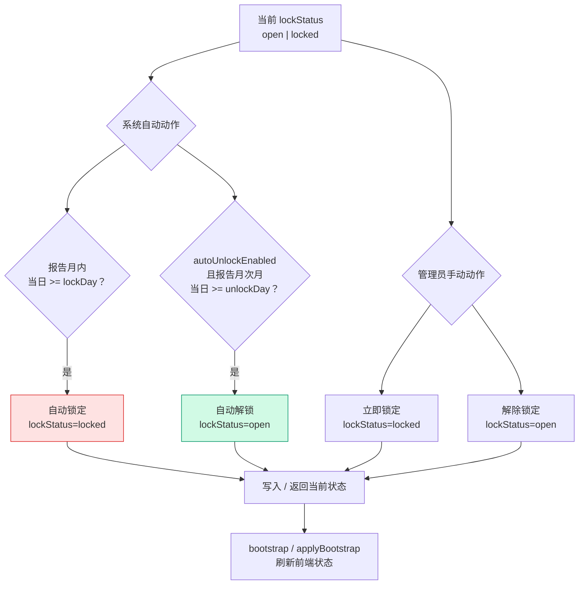

| 机制 | 行为 |
|---|---|
| **当前状态** | `lockStatus` 只有 `open` / `locked` 两种状态；历史 `finance_only` 在启动时归一为 `open`。 |
| **系统自动动作** | `_calcLockStatus`：报告月内当日 ≥ `lockDay` → `locked`；`autoUnlockEnabled === true` 且报告月次月当日 ≥ `unlockDay` → `open`；自动解锁默认关闭，其他时间默认 `open`。实现：`js/store.js` `calcLockStatus`、`server/db.js` `_calcLockStatus`。 |
| **管理员手动动作** | 管理设置「立即锁定 / 解除锁定」调用 `Store.setLockStatus` → `PATCH /api/meta`，与自动动作一样写入当前 `lockStatus`，并通过审计日志记录。 |
| **保存周期配置** | `Store.savePeriodConfig` → `PATCH /api/meta`；服务端在 `periodConfig` / `reportingMonth` 变更后按新配置重算状态并返回 bootstrap，前端 **`applyBootstrap` 立即刷新 `lockStatus`**，避免仍显示修改前的状态（如将锁定日 25 改为 27 后，25 日应立刻变为填报中）。 |
| **填报页横幅** | 锁定期文案读取 **`periodConfig.lockDay`**（如「数据已锁定（每月27日）…」），不写死 25 日。 |

### 4.3 列级只读动态时间窗（填报期内）

以系统**报告月**（如 `2026-05`，即 5 月）为基准，`FieldConfig.isMonthlyFieldEditable` / `canEdit` 对**所有角色（含系统管理员）**统一适用：

| 列组 | 列字母 | 可编辑月份（示例：报告月 5 月） | 数据性质 |
|---|---|---|---|
| **月度完成额** | AV–BG（1–12 月） | **5 月及之后**（`m >= 4`） | 当月为 PM 手工填报的实际/计划完成额；之前月份为历史只读 |
| **月度开票** | BH, BJ, … CD | **6 月及之后**（`m > 4`） | **当月**由财务系统同步**实际开票**，只读；之后月份为**预测值**可编辑 |
| **月度回款** | BI, BK, … CE | **6 月及之后**（`m > 4`） | **当月**由财务系统同步**实际回款**，只读；之后月份为**预测值**可编辑 |

- 非月度手工列（实施进展 M、WIP 分析 AM–AU 等）不受上表月份窗限制；系统管理员在锁定期仍可编辑此类列。
- Luckysheet 通过工作表保护 + 单元格 `lo` 标记 + `cellUpdateBefore` 二次校验，与 `canEditField` / `isPastReportingMonthField`（= 月度窗不可编辑）规则一致。
- 经典 HTML 表对同期列应用相同只读样式（`month-locked-cell`）。
- Excel 导入合并（§3.6）同样跳过不可编辑月份格，避免覆盖当月开票/回款实际值。

### 4.4 月度列属性动态判断（无自动初始化）

系统不会在每月开启填报、解除锁定或保存周期配置时自动初始化 / 批量改写完成额、开票、回款数据。前后端仅根据当前 `reportingMonth` 计算 `monthIdx`，再动态判断每个月份列的业务属性与可编辑性。

| 列组 | 报告月当月 | 报告月之前 | 报告月之后 | 实现 |
|---|---|---|---|---|
| **月度完成额** | 可编辑，作为本月填报值 | 历史只读 | 可编辑，作为未来计划/预测 | `FieldConfig.isMonthlyFieldEditable`：`MC_COLS` 中 `m >= monthIdx` 可写 |
| **月度开票** | 系统取值，只读 | 历史只读 | 可编辑，作为未来预测 | `MI_COLS` 中仅 `m > monthIdx` 可写；当月列按系统引用处理 |
| **月度回款** | 系统取值，只读 | 历史只读 | 可编辑，作为未来预测 | `MP_COLS` 中仅 `m > monthIdx` 可写；当月列按系统引用处理 |

- **系统取值：** 报告月当月开票 / 回款由平台同步写入 `_system_ref`；PM 只读，系统管理员可通过 `SystemRefMeta.applyOverride` 覆盖显示值。
- **手动清零：** 如需开启新一轮填报前清理报告月完成额，项目经理、板块管理员、系统管理员可在项目追踪表工具栏点击「清零当月完成额」；实现为 `ProjectEditor.js` `handleClearCurrentMonthCompletion()`，按当前用户可编辑项目范围将 `mc_{monthIdx}` 清零，审计合并为一条批量动作。
- **不自动执行：** `Store.savePeriodConfig` / `PATCH /api/meta` 只更新周期配置并刷新 `lockStatus`，不清零完成额、不迁移月度数组、不改写历史月度值。

### 4.5 填报周期配置（管理设置，已实现）

系统管理员在「填报周期配置」修改报告月、提醒日、锁定日、解禁日与 `autoUnlockEnabled` 并保存；自动解锁默认关闭。「数据锁定控制」提供 **立即锁定 / 解除锁定**，与系统自动锁定 / 解锁一样更新 `lockStatus`，全程审计。

### 4.6 提交审批后的填报锁定

- **触发（板块级）：** 板块管理员对**本板块**点击「提交审批」并成功生成 **`Draft:<板块编码>`** 快照后，系统设置该板块在 `meta.sectorFlows[code].reportingSubmitted = true`（持久化于 SQLite `meta`）；各板块互不影响。
- **填报页：** 本板块「提交审批」按钮禁用并显示「已提交审批」；Luckysheet 与经典 HTML 表（若启用）在**非系统管理员**角色下，当**本板块**已提交时进入只读，与锁定期规则叠加。
- **解除：** 该板块审批驳回、管理员在管理页「从初始 Excel 恢复」或开发环境「重置为初始状态」时清除该板块标记；系统管理员在已提交状态下仍可编辑。

---

## 5. 变更追踪与高亮

### 5.1 审计日志（Audit Log）

- **全量记录：** 任何数据的增、删、改（含在线编辑、Excel 导入、管理员解锁修改）均自动记录变更日志。
- **日志维度：** 操作人、操作时间、所属项目、修改字段、原值、新值、修改原因（可选）。
- **审计支持：** 支持按项目、人员、时间范围查询导出，满足财务与运营审计要求；`AuditLog.js` 对空操作人/项目/字段做字符串兜底，字段筛选匹配 `fieldCN || fieldName`，日期结束日扩展到 23:59:59.999，`0` 值通过 `hasValue()` 保留展示和导出。

### 5.2 项目级变更元数据（已实现）

除全局 `audit_log` 表外，每个项目对象可携带：

- `_changed_fields`：本月有变更的字段列号列表（用于高亮与「仅看变更」筛选）；
- `_field_change_log`：按列号索引的**变更记录数组** `[{ oldVal, newVal, roleLabel, userName, userId, at }, …]`；同一流程内**不同角色**对同一单元格的多次修改**按序追加**不覆盖；**同一角色、同一旧值→新值**的重复记录会去重（见 **§5.4**），并随 `PUT /api/projects/:projectNo` 持久化于 SQLite `projects.payload`。

- **批注与审计的关系：** 单元格批注优先读 `_field_change_log`（展示前经 `dedupeChangeLogList`）；若无记录则回退至 `audit_log` 中该项目、该字段最近一条。全局 `audit_log` 仍保留字段名、时间等完整维度，与批注文案分离。

### 5.3 变更高亮机制（Diff Highlighting）

为提升填报与审批效率，系统需自动识别并视觉强化本月变动数据：

#### 5.3.1 新增项目整行高亮（已实现）

对比 **`meta.baselineVersion`** 指向的快照（首期无 J 时为 **I 版**），当前库中**项目号不在 baseline 内**的行标记 `_added_this_month` / `_added_since_baseline`。
  - **I 版生成：** 空库导入、reseed、reset-dev 时由 `server/snapshot-service.js` 写入。
  - **开发演示：** reset-dev 的 I 版 baseline **排除** 5 条固定 `demoNewProjectNos`，库中仍保留这些项目 → 自然高亮为「新增」。
  - **新增行底色：** `#d9e7d8`（`--color-new-project-bg`）。
  - **变更高亮：** 当前值 ≠ baseline 同字段，或与 `_field_change_log` 合并（`js/baseline-diff.js` + `ProjectEditor.buildTableData`）。

#### 5.3.2 可编辑列整列底色（已实现）

在当前角色、锁定规则下**可填报**的字段（`FieldConfig.canEdit` 且 `canEdit`），其**数据格**使用浅黄底，与「本月有变更」的浅橙底区分；表头仍为浅黄底 + 深黄字（见 **§3.3.3**）。
  - **数据格底色：** `#fefce8`（`--color-editable-cell-bg` / `ChangeMeta.EDITABLE_FIELD_STYLE`）。
  - **范围：** 按**字段 + 报告月时间窗**判断（§4.3：完成额当月及之后、开票/回款仅之后月份）；`auto_calc` 及窗外观列不适用。`system_sync` 系统同步列仅系统管理员可覆盖显示值，覆盖后按 §2.2 的「系统引用已覆盖」浅蓝样式展示，不使用普通手工填报列的浅黄底。
  - **实现：** Luckysheet `luckysheetCellBg`；经典 HTML 表 `.field-editable`（`cellClass` / `cellTdStyle`）。

#### 5.3.3 单元格底色叠色优先级（已实现）

同一格仅展示一种主底色，优先级从高到低：

| 优先级 | 场景 | 底色 / 样式 |
|---|---|---|
| 1 | **预警** | 浅红底 `#fee2e2` + 红字 `#dc2626`（见 **§5.6**） |
| 2 | 本月有变更 | 浅橙 `#ffedd5` + 深橙字 `#9a3412` + 左边框 `#ea580c` |
| 3 | **系统引用已覆盖** | 浅蓝 `#e8f4fd` + 引用批注（§2.2） |
| 4 | 当前可编辑列 | 浅黄 `#fefce8` |
| 5 | 新增项目行（仅该行只读格） | 浅绿 `#d9e7d8` |
| 6 | 只读 / 公式 / 斑马纹 | 灰白交替或 `#f8fafc` |

即：**预警 > 变更 > 引用覆盖 > 可编辑列 > 新增项目行**。

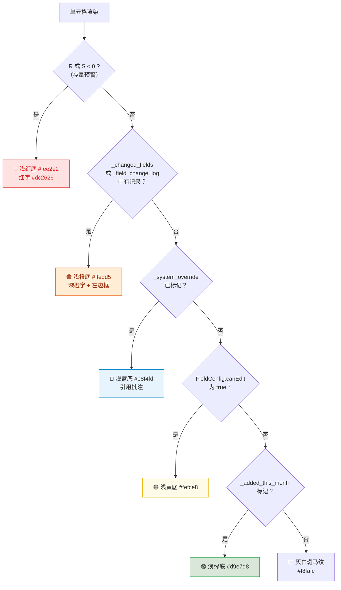

#### 5.3.4 变更单元格高亮

- **当月变更**：当月值与上月快照不一致的字段（含新填报、修正、系统同步更新）。
- **未来预测变更**：修改了未来月份的预测数据（Forecast），同样视为变更并高亮显示。
- **视觉标识（已实现，Luckysheet / 图例 / HTML 表统一）：**

  | 元素 | 色值 / 说明 |
  |---|---|
  | 单元格背景 | `#ffedd5`（浅橙，`--color-changed-field-bg`） |
  | 文字颜色 | `#9a3412`（深橙，`--color-changed-field-text`） |
  | 左边框 | `#ea580c`，宽约 3px（Luckysheet 用 `bd`；HTML 用 `::before`） |

  填报页图例「有变更字段」使用与上表一致的 **14×14px 纯色块**（仅背景色，无「Aa」样字、无边框）。
- **判定范围：** 高亮与批注以 `_changed_fields` **或** `_field_change_log` 中存在的列为准（`ChangeMeta.hasFieldChangeMarkup`），避免二次保存后仅保留最后一次编辑列导致历史变更丢失展示。

#### 5.3.5 联动计算高亮

因手工修改导致**自动计算的字段**（如 WIP、累计回款、差值等）发生数值变化时，该计算字段单元格同步触发高亮，确保用户感知数据变动。

### 5.4 变更批注（已实现）

对有变更的格子自动附加 Luckysheet 批注（`ps`），悬停/点击角标可查看；**每条记录一行**，格式为 `【操作角色】修改前值 → 修改后值`（示例：`【PM】0 → 100`），**不展示**字段名与修改时间；**不同角色**对同一格的多次变更按时间顺序**多行堆叠**（如 `【PM】0 → 100` 下一行 `【板块总监】100 → 120`）。

- **去重规则（已实现）：** 以 `角色 + 旧值 + 新值` 为键；`mergeChangeTracking` 合并时去重；`recordFieldChangeLog` 若与上一条完全相同则不再追加；`handleCellEdit` 仅以 Store 中项目为变更日志来源（避免表格行与库重复合并）；`flushLuckysheetToStore` 以 Store 当前值为 `oldVal` 基准，避免 `cellUpdated` 与「保存」重复记同一笔。
- 在线编辑、`flushLuckysheetToStore`、填报页 Excel 合并导入均会写入 `_field_change_log`（板块总监/群主审批页为只读，不产生变更批注）。
- 公式重算（`recalcLuckysheetFormulas`）后按行重新同步批注与高亮，避免仅当前格保留 `ps`。
- 经典 HTML 表（若启用）对变更格使用 `.field-changed` 类，并以 `title` 展示相同文案。

#### 变更批注模块（`js/change-meta.js`）

| 能力 | 说明 |
|---|---|
| `recordFieldChangeLog` | 向 `_field_change_log[col]` 追加一条；与上一条「角色+旧+新」相同则跳过 |
| `dedupeChangeLogList` / `changeLogEntryKey` | 按「角色+旧值+新值」去重，保留首次出现顺序 |
| `mergeChangeTracking` | 合并多来源 `_field_change_log` 与 `_changed_fields`（合并时去重） |
| `formatChangeComment` | 多行 `【角色】旧值 → 新值`（`getFieldChangeEntries` 返回去重后列表） |
| `attachChangeTracking` | 公式重算后的 `tableProjects` 从 `Store` 回挂元数据 |
| `resolveFieldChangeMeta` | 取该列最近一条变更（审计回退等） |
| `applyLuckysheetChangedStyle` | Luckysheet 变更格高亮（`CHANGED_FIELD_STYLE`） |
| `EDITABLE_FIELD_STYLE` | 可编辑列数据格底色常量（与 `--color-editable-cell-bg` 一致） |
| `syncLuckysheetProjectRowDecor` / `syncAllLuckysheetChangeDecor` | 公式重算或保存后按行/全表恢复 `ps` 与高亮 |

### 5.5 视图过滤控制

填报页 **表格工具栏**（`.sheet-toolbar`，**§3.4.2**）与**总监/群主审批页**（**§6.3**）均提供 `全部` / `新增` / `有变更` / **`预警`** 筛选，方便聚焦本月工作内容（预警见 **§5.6**）。

### 5.6 存量指标预警（R / S 列，已实现）

字段字典分区 **「存量指标」**（列 **R–S**）：

| 列 | 字段名 | 公式 | 业务含义 |
|---|---|---|---|
| **R** | **存量开票额** | `= P − AC` | 总合同额减始累开票。正数表示尚未开票的合同部分；**小于 0** 表示累计开票已超过总合同额 → **预警**（允许存在，不阻断提交）。 |
| **S** | **存量合同额** | `= P − U` | 总合同额减始累完成。表示尚未完成的合同部分；**不得为负**；约束报告月及之前各月**月度完成额**（AV–BG）的累计结果。 |

- **预警样式（已实现）：** R 或 S **< 0** 时，该格使用红字 `#dc2626`、红底 `#fee2e2`（`--color-stock-warning-*` / `.field-stock-warning`）；Luckysheet 与经典 HTML 表一致。
- **预警筛选（已实现）：** 表格工具栏「**预警（N）**」仅展示 R 或 S 为负的项目（`StockValidation.hasStockWarning`）。
- **Drawer 项目预警（已实现）：** 项目详情 Drawer 在「跟踪信息填报」上方集中展示预警标签（含 R/S 及完成额 vs 工时，见 **§3.7.2**）；无预警时不显示该区块。
- **完成额编辑校验（已实现）：**
  1. **手工完成额实时拦截：** PM / 板块管理员 / 系统管理员编辑月度完成额时，前端预演公式重算；若保存后 **S < 0**，立即拒绝该输入并提示调减完成额或先完成 CRB 合同变更，不写入变更批注。
  2. **系统同步合同额自动对冲：** 仅当系统同步/系统管理员覆盖合同额相关引用值（当前为 O 列当年调整值）导致 **S < 0** 时，系统自动调减报告月完成额并追加「系统自动对冲」变更批注；构表/刷新阶段不静默改写 Store 数据。
  3. **全年完成预测实时拦截：** `projectedCompletionTotal(project) = prev_year_completion + SUM(monthly_completion[0..11])`，即上一年底始累完成 + 1-12月完成额（含未来月份预测）合计。`validateCompletionEdit()` 对所有完成额列 AV–BG 生效，若该合计超过 P `total_contract`，拒绝本次输入。
  4. **合同额核减场景：** 若系统同步/系统管理员覆盖导致 P 降低，从而使全年完成预测超 P，系统**不**自动调减完成额，仅在提交前阻断并提示用户调整未来月份预测或完成 CRB 合同额变更。
  5. **提交阻断兜底：** PM「提交」、板块管理员「提交审批」前校验范围内全部项目 **S ≥ 0** 且全年完成预测合计 **≤ P**；不满足则弹出汇总错误。
  - **提示文案（提交失败）：** 「有 N 个项目存量合同额为负…请调减完成额或完成 CRB 合同变更后再提交。」
  - **提示文案（预测超额）：** 「有 N 个项目已完成额加未来月份预测完成额超过总合同额，请调整完成额预测或完成 CRB 合同额变更后再提交。」
- **WIP 催开票校验（已实现）：**
  1. **提交阻断：** `WipValidation.validateProjectsForSubmit()` 校验提交范围内项目；当 AL `wip_pending_invoice` 非零时，AM `wip_cause` 与 AO `high_risk_wip` 不能为空。
  2. **归零清空：** `WipValidation.clearWhenPendingInvoiceWipBecomesZero()` 检测 AL 由非零变为 0 时，自动清空 AM `wip_cause`、AN `cause_desc`、AO `high_risk_wip`。
  3. **主表保存链路：** `ProjectEditor._applyFieldChangesToProject()` 与 `_applySystemRefChangesToProject()` 在公式重算后调用 WIP 清空逻辑；自动清空列写入 `_field_change_log` / `_changed_fields` 并追加审计日志。
  4. **导入链路：** `ImportMerge.mergeImportedProjects()` 在导入合并并公式重算后调用 WIP 清空逻辑，主表导入与报告线导入共用。
  5. **提交链路：** `ProjectEditor.assertStockBeforeSubmit()` 在 S 列校验后追加 `validateWipBeforeSubmit()`；主表 PM 提交、板块管理员提交审批、报告线 PM 提交、报告线板块管理员提交审批共用该拦截。
- **与平台同步的关系（§2）：** CRB 更新 **P** 或财务更新开票后，R/S 会随公式重算变化；系统同步**不**写入 `_changed_fields` 高亮，但预警色与筛选即时反映。
- **实现：** `js/stock-validation.js`、`js/wip-validation.js`；字段字典列 R/S/AL/AM/AN/AO 中文名与说明（`Store.fieldDictionary`）；`ProjectEditor.js` 筛选 / 样式 / 提交校验；`test/completion-forecast-validation.test.js` 覆盖未来预测编辑和合同额核减后的提交阻断。

### 5.7 保留期限

在本轮填报 / 审批流程内，同一项目、同一单元格的历次编辑产生的变更批注与 `_field_change_log[col]` 均应保留（合并写入，不随后续保存覆盖）。

- **多角色连续修改：** PM 修改某单元格并提交后，板块管理员应能看到该条 `_field_change_log`；若板块管理员继续修改同一单元格并提交审批，则该列数组保留两条记录（如 `【PM】0 → 100`、`【板块管理员】100 → 120`），不覆盖前一条。
- **审批链路可见：** 板块总监、项目群群主、系统管理员在后续审批 / 归档查看中，均应能看到本轮流程内该单元格累积的全部变更记录；总监 / 群主审批页为只读，不新增变更记录。
- **归档后沉淀：** 系统管理员提交 J 版后，`POST /api/company/archive` 生成全量 J 快照并重置当前流程态；当前界面进入新一轮，变更高亮与本轮 `_field_change_log` 随新基准重置；旧流程的全部变更记录保留在 J 版快照 payload 中，用于历史回溯与审计。
- **实现要求：** I 版 baseline 可清理临时变更标记；D/J 业务快照必须保留 `_field_change_log` 与必要的变更元数据，避免归档后历史版本丢失审批链路中的多条变更记录。

- **技术实现：** 基于月度快照表进行行级与字段级 `Diff` 计算；前端样式见 `css/style.css` 与 `js/change-meta.js`（`CHANGED_FIELD_STYLE`、`EDITABLE_FIELD_STYLE` / `applyLuckysheetChangedStyle`）；存量预警见 `js/stock-validation.js`；填报页 `ProjectEditor.js` 中 `luckysheetCellBg`、`isEditableDataCell`。

---

## 6. 审批流程与版本快照

### 6.1 版本快照体系（Snapshot Management）

快照仅三类，键格式 `{Stage}:{YYYYMMDD}:{Scope}:{Seq}`：

| Stage | 含义 | Scope | 示例 |
|---|---|---|---|
| **I** | 导入初始化 | `ALL` | `I:20260501:ALL:01` |
| **D** | 板块提交审批（Draft） | 板块码 | `D:20260520:SAS550:01` |
| **J** | 系统管理员公司归档 | `ALL` | `J:20260525:ALL:02` |

**meta 指针：**

- `baselineVersion`：当前变更对比基准（I 或 J）
- `latestIVersion` / `latestJVersion`：最近导入 / 最近 J 版（历史列表用）

**流程：**

1. **空库 / reseed / reset-dev 导入** → 写入 **I 版**，随后写入一份与当前项目追踪表一致的初始化 **J 版**；`latestJVersion` / `baselineVersion` 指向最新 J，供报告线 fork 与变更对比使用。
2. **板块管理员「提交审批」** → append **D 版**（本板块子集）；`reportingSubmitted = true`；若后端自动判断该板块管理员兼任同板块总监，同步将 `approvalStatus` 置为 `approve1`，跳过总监初审；驳回后可再次提交生成新版 D。
3. **总监 / 群主审批通过** → 仅更新 `approvalStatus`，**不写** Approve1/Approve2 快照。
4. **系统管理员「提交归档」** → **仅锁定期可提交**（前端 `canSubmitArchive` 要求 `lockStatus === 'locked'`；后端 `dbm.getEffectiveLockStatus(db) !== 'locked'` 返回 403）；append **J 版**（全量）；更新 `baselineVersion`；调用 `db.resetWorkflowCycleAfterArchive(db)` **流程态归零**（`pmSubmissions`、`sectorFlows`、`approvalStatus`、`reportingSubmitted`、`companyFlow`、`sectorLatestDVersion`）；**不改** `lockStatus`；可多次提交（无 409 限制）。

**J 版归档 API（`POST /api/company/archive`）成功后 meta 变化：**

| 写入/重置 | 说明 |
|---|---|
| `latestJVersion` / `baselineVersion` | 由 `createFinalSnapshot` 更新 |
| `pmSubmissions` → `{}` | 板块管理员底部 PM 列表清空 |
| `sectorFlows[*]` → `defaultSectorFlowEntry()` | 各板块回到 draft、未提交 |
| `approvalStatus` → `draft`，`reportingSubmitted` → `false` | 审批页回到新一轮 |
| `companyFlow` → `{ archiveStatus: 'pending' }` | 不再以 `final` 标记「公司已归档」 |
| `sectorLatestDVersion` → `{}` | 板块 D 版指针清空 |
| `lockStatus` | **保留**，归档不自动解锁 |

- **版本对比：** 审批页可对 D/J 快照做 Diff（总监/群主审批页不提供，见 **§6.3**）。
- **填报页历史版本预览：** 仅系统管理员可在工具栏选择 J 版快照只读展示并可下载（见 **§3.8**）。
- **驳回：** 总监/群主驳回 → `draft` + `reportingSubmitted = false`，板块管理员修改后重新提交生成新 D 版。

#### 完整审批流程时序图

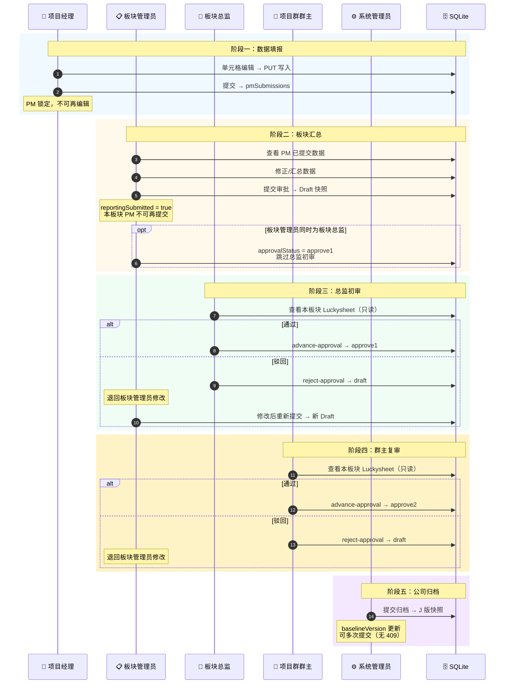

> 旧键 `Draft:*`、`J版`、`Month:*`、`PM:*` 若仍存在库中，仅作历史只读预览，不参与 baseline。

#### I/J baseline 快照与新增项目演示（已实现）

| 项 | 说明 |
|---|---|
| **I 版** | 导入/reseed/reset-dev 时写入；`latestIVersion` 指向最近一次导入快照 |
| **J 版** | 初始化/reseed/reset-dev 后自动写入一份与当前项目追踪表一致的初始化 J；系统管理员每次提交归档也 append J；均更新 `latestJVersion` 与 `baselineVersion` |
| **baseline** | `meta.baselineVersion`；报告线默认以最新 J 为基准，避免无 J 时 `baseline_version = null` |
| **前端** | `js/baseline-diff.js`：新增行 + 字段 diff |
| **开发 reset-dev** | 清空快照 → 新 I（排除 5 条 demo 项目号）→ 库中仍含 demo → 高亮新增 |
| **reseed** | **不清**历史快照；写新 I 并设 baseline |

#### 快照生命周期

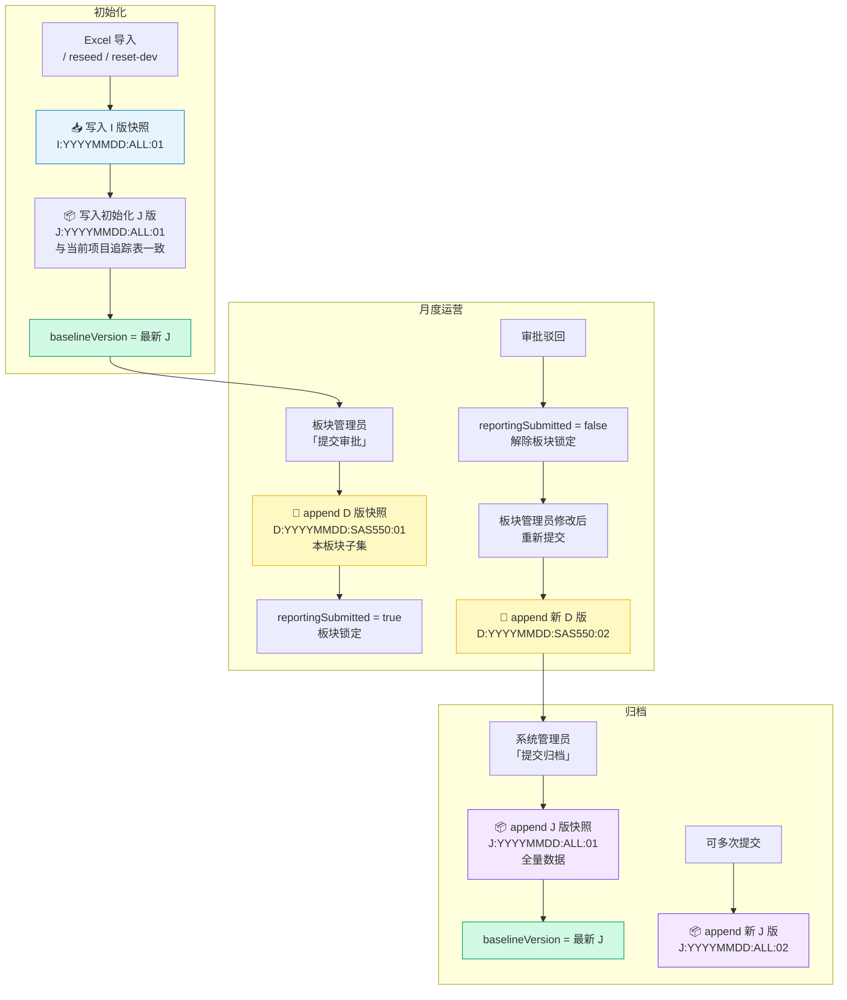

### 6.2 PM 提交与板块汇总（已实现）

项目经理的「**提交**」是面向板块管理员的内部汇报动作，**不等同于**板块「提交审批」（Draft）。**默认每个 PM 每个报告月仅可提交一次**；提交后 PM 锁定，**不可**再次编辑或重复提交；数据有问题由**板块管理员**在板块汇总表中直接修正。

#### 6.2.1 PM 提交状态机（当前实现）

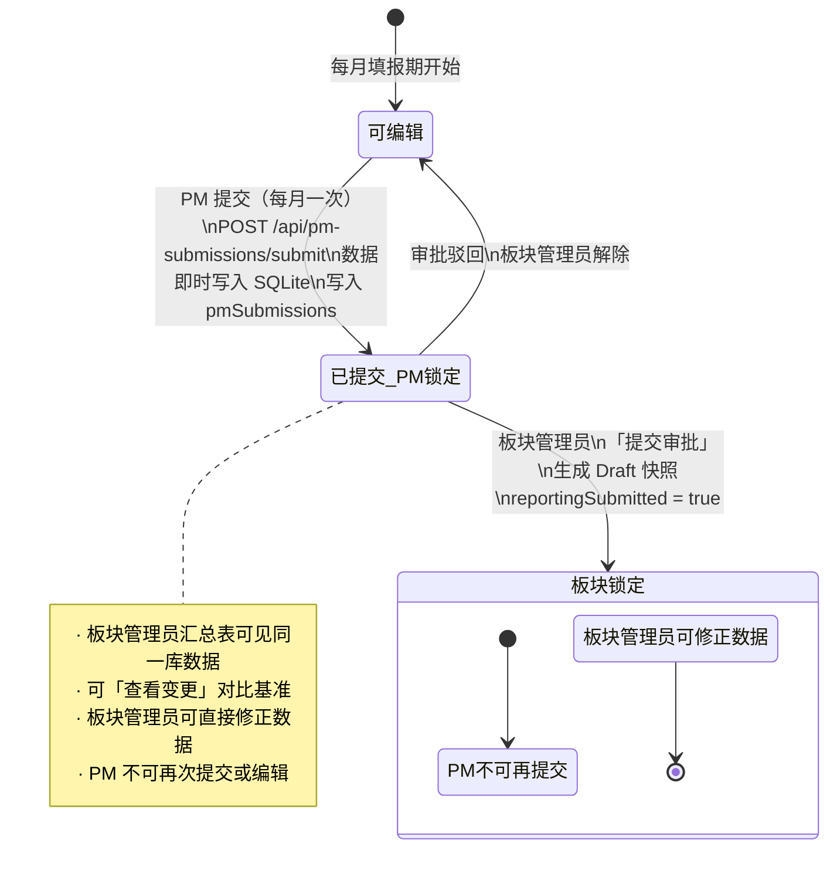

- **已取消「确认接收」：** PM 提交后**自动**进入板块管理员视野；板块底栏列出「**本月已提交 PM**」，仅保留「**查看更新内容**」，**无**接收按钮。
- **每月一次：** 同一报告月内 PM 再次点击「提交」→ 服务端 `409`；前端按钮显示「已提交」并禁用。
- **修正路径：** PM 提交后发现错误 → 联系板块管理员在**全板块** Luckysheet 中改数（板块管理员始终可编辑本板块项目，直至本板块 `reportingSubmitted`）。

#### 6.2.2 数据存储与填报基准

- `meta.pmSubmissions`：按报告月分桶，记录每个 PM 的 `status`（`submitted`）、`submittedAt`、`projectNos`、`projectCount`。**不写 PM 快照**。
- PM 提交后视图始终读 live `projects`（与板块管理员同步）。
- **已取消** PM baseline 快照与 `ensure-baseline` API；变更对比统一用 `baselineVersion`（I/J）。

#### 6.2.3 PM 编辑保存与提交（Luckysheet）

- **单元格保存：** 可编辑格变更经 `cellUpdated` → `PUT /api/projects/:projectNo` 写入 SQLite，并合并更新 `_changed_fields`、`_field_change_log`（见 **§5.1**、**§5.3**）及审计日志。
- **手动保存：** 工具栏「保存」与提交前兜底均调用 `flushLuckysheetToStore()`（见 **§3.5.1**）；保存结束后全表同步 Luckysheet 变更批注与高亮。
- **Excel 导入：** PM 可在填报页「上传导入」，仅合并本人项目可编辑列（见 **§3.6**）；**已提交后** PM 锁定，不可导入。
- **提交前兜底（已实现）：**
  1. 调用 Luckysheet `exitEditMode`，结束未失焦的编辑态；
  2. 扫描 sheet 中所有可编辑的手工列，将未触发 `cellUpdated` 的值补写入库；
  3. **存量合同额校验（§5.6）：** 范围内项目 **S ≥ 0**，否则中止提交并提示；
  4. `Store.syncPmProjectsToServer` 将该 PM 名下项目全量同步至服务端；
  5. 再调用 `POST /api/pm-submissions/submit`（仅更新 `pmSubmissions` 状态，**不写快照**）。
- **提交后：** PM 锁定；再次进入表单时自动加载 live 库数据（板块管理员改数后 PM 重新进入可见）。
- **注意：** 灰色/公式列（`auto_calc`、`system_sync`）不可由 PM 保存；可入库的手工列见 **§4.3**。

#### 6.2.4 板块管理员操作

- 填报页底部显示「**本月已提交 PM**」面板（本板块内按平台项目经理绑定关系归属的 PM，`status === 'submitted'` 或历史 `received`），含「**查看更新内容**」；标题栏提供**收起 / 展开**（默认展开，对齐系统管理员「各板块进度」底栏）。
- **「查看更新内容」：** `baselineVersion` 快照 vs 当前报告线中该 PM 平台绑定项目子集（`manual_input` 列 diff），弹窗仅展示更新后值。
- **刷新数据：** 板块管理员不渲染手动「刷新数据」按钮；进入表单时自动加载最新数据，板块管理员视图经 `scopedProjects` 仍仅见本板块。
- 汇总确认后点击「**提交审批**」→ 生成该板块 `Draft:<板块编码>`，`reportingSubmitted = true`，本板块 PM 不可再提交。

#### 与「管理员全表」的差异说明

- PM 提交状态仅记录该 PM 按平台项目绑定关系归属的项目号列表；板块管理员填报页为**按数据源板块号归属的全板块项目**。
- 「查看更新内容」对比的是 **PM 平台绑定项目子集的本轮改动**，不是「提交版 vs 管理员整张表」。

#### 相关 API（当前实现）

| 接口 | 说明 |
|---|---|
| `POST /api/pm-submissions/submit` | PM 提交（每月一次）；仅写 `pmSubmissions` |
| `POST /api/editor/refresh-data` | 系统管理员手动刷新（平台引用 + bootstrap）；PM/板块管理员不提供按钮 |
| `POST /api/admin/sync-platform-data` | 兼容旧路径，行为同 `refresh-data` |
| `POST /api/pm-submissions/receive` | **已废弃**（410） |
| `GET /api/snapshots/:version` | 按版本取 I/D/J 快照 |

### 6.3 审批决策角色界面（板块总监 / 项目群群主，已实现）

> 实现：`js/views/Approval.js`、`js/components/ApprovalReviewSheet.js`（`extends ProjectEditorView`，与 `js/views/ProjectEditor.js` 同源 Luckysheet 能力）、`js/components/AppLayout.js`、`js/router.js`、`js/field-config.js`（总监/群主**始终只读**）。

#### 导航与顶栏

| 项 | 说明 |
|---|---|
| **侧栏** | 仅 **审批流程**（路由 `/approval`） |
| **顶栏** | 仅页面标题 + 用户菜单；**不展示**「审批：草稿 / 初审中」等审批状态 Tag |
| **内容区** | 审批页 `no-padding`，右侧表格区纵向占满（`css/style.css` `.approval-reviewer-*`） |

#### 页面布局（左右分栏）

| 区域 | 宽度 | 内容 |
|---|---|---|
| **左侧** | 300px（与 `.approval-layout` 一致） | 卡片标题 **流程进度**（非「审批流程」）+ 三态图例 + 四节点时间轴 + 通过/驳回 |
| **右侧** | 剩余宽度 | Luckysheet（`#approval-luckysheet-mount`），**无** Luckysheet 内置顶栏、**无**填报页业务工具栏；Luckysheet 上方为 **表格工具栏**（项目筛选 + 紧凑列勾选，见 **§3.4.2**） |

#### 流程进度时间轴（三态）

| 状态 | 圆点样式 | 节点标签 | 含义 |
|---|---|---|---|
| **已完成** | 品牌绿 + 勾 | `el-tag` success | 该步骤已结束 |
| **进行中** | 橙色 + 「···」 | `el-tag` warning | 当前待处理步骤 |
| **未完成** | 灰色 + 步骤序号 | `el-tag` info | 尚未到达 |

- 卡片顶部图例与上表一致（已完成 / 进行中 / 未完成）。
- **进行中节点计算（`activeFlowIdx`）：** `meta.approvalStatus` 表示**上一节点已完成**后的状态，而非「正在进行的节点」。示例：
  - `draft` 且未 `reportingSubmitted` → 节点 0（提交填报）进行中；
  - `draft` 且已提交 → 节点 0 已完成、节点 1（板块总监初审）进行中；
  - `approve1` → 节点 0–1 已完成、节点 2（群主复审）进行中；当板块管理员兼总监时，提交审批后会直接进入该状态；
  - `approve2` → 节点 0–2 已完成、节点 3（归档）进行中；
  - `final` → 全部为已完成。

#### 右侧 Luckysheet（本板块当月全量 + 筛选）

- **数据范围：** 本板块（`unit_code`，默认 `S520`）**当月全部项目**（与板块管理员填报范围一致），默认展示 **全部**；**表格工具栏**单选：**全部** / **新增**（`_added_this_month`）/ **有变更**（`_changed_fields` 或 `_field_change_log` 非空）；筛选结果为空时显示空状态文案。
- **交互：**
  - **非待办节点**或全局锁定：只读（`canEdit = false`）。
  - **只读查看：** 板块总监、项目群群主在待办节点内**仅可查看**本板块 Luckysheet（`ApprovalReviewSheet.canEdit === false`）；**不可**修改单元格或产生变更批注。若数据有误，使用 **「驳回」** 退回 `draft`，由**板块管理员**在填报页编辑后重新「提交审批」。
- **视觉：** 保留 **§5.3** 新增行底色、可编辑列浅黄（本角色无可用可编辑列时均为只读态）、变更格高亮与批注图例（可关闭）。
- **实现要点：** `ApprovalReviewSheet` 继承 `ProjectEditorView`，覆盖 `scopedProjects` / `filteredProjects` / `canEdit`（恒 `false`）；`showtoolbar: false`、`sheetFormulaBar: true`、`lang: 'zh'`、独立 `lsGridKey`（`ptrack_approval_review`）、挂载点 `#approval-luckysheet-mount`；与填报页共用 `.sheet-toolbar` 与 `compactColumnsOnly` / `buildLuckysheetColhidden()`；脚本须在 `ProjectEditor.js` 之后加载（IIFE 传入 `window`）。
- **变更批注：** 审批页恒只读，不产生变更批注；历史变更批注按填报页生成结果展示。无填报页「保存/导入/提交」工具栏。

#### 通过 / 驳回

| 操作 | 行为 |
|---|---|
| **通过** | 与 **§6.1** 一致：推进 `approvalStatus`；总监/群主通过不生成快照，仅系统管理员归档生成 `J` 版；仅当前待办角色可见按钮（`canApprove`） |
| **驳回** | 与通过同一待办权限（`canReject === canApprove`）；回退 `draft` + `reportingSubmitted: false`；提示「退回板块管理员」；可选填写驳回原因写入 `audit_log` |

**总监审批跳过实现：** `server/index.js` 的 `POST /api/sectors/:code/submit-approval` 在创建 D 版快照后读取 `meta.sectorAdmins[normalizeSectorCode(code)]` 的 `adminUserId/adminName`，并调用 `server/sector-workflow.js` 的 `shouldSkipDirectorApproval(adminConfig, users, sectorCode)` 匹配平台用户权限。若该用户具备同板块 `sector_director` 权限，则 `sw.setSectorFlow(..., { approvalStatus: 'approve1', reportingSubmitted: true })`；否则保持 `draft + reportingSubmitted`。前端无需额外状态，`Approval.js.activeFlowIdx` 会把 `approve1` 渲染为“群主复审进行中”。

#### 其他角色的审批页（对照）

- **板块管理员 / 财务等：** 左侧 **流程进度** 时间轴（三态 + 图例）；右侧 **版本快照记录** + **版本差异对比**，**不**嵌入 `ApprovalReviewSheet`。
- **系统管理员：** 使用独立 **§6.4** 审批页（十二板块并行流程卡片），**无**左侧四节点时间轴、**无**公司归档区、**无**版本快照列表；**J版** 归档仅在 **项目追踪表** 工具栏「提交归档」（**仅锁定期**可用）。

### 6.4 系统管理员：十二板块、审批页与填报管理进度（已实现）

> **需求背景：** 公司各个执行单位（板块/中心）的审批流程**并行**、互不影响；系统管理员需在审批页纵览各板块三步审批状态，并通过「填报管理」查看各板块填报进度；在**锁定期**内仍通过「项目追踪表」工具栏提交 **J版** 全公司归档。

#### 十二板块注册表（`sectorRegistry` / `sectorNames`）
- **展示：** 卡片/底栏使用 `sectorDisplayLabel`，如 `SAS520 · 金山中心`。
- **归一：** 项目 `unit_code` 为 `S520` 等短码时，读写流程统一为 `SAS520`（`SectorWorkflow.normalizeSectorCode`）。
- **默认列表：** 上线后来自平台项目执行板块；原型/本地环境使用 `DEFAULT_SECTOR_REGISTRY` 固定 12 项；`bootstrap` 时 `migrateSectorFlows` 为每板块初始化 `meta.sectorFlows[code]`。

#### 分板块审批与公司 J 版归档

| 层级 | 说明 |
|---|---|
| **分板块流程** | `meta.sectorFlows[code]`：`approvalStatus`（`draft` / `approve1` / `approve2`）、`reportingSubmitted`；十二板块独立。 |
| **分板块快照** | `Draft:SAS520`、`Approve1:SAS520`、`Approve2:SAS520` 等，仅含该板块项目。 |
| **公司 J 版** | 全局 **`J版`**，含**整库全部项目**；系统管理员**仅在锁定期可提交归档**（前端 `canSubmitArchive` + 后端 `POST /api/company/archive` 校验 `lockStatus === 'locked'`，开放期返回 403），**不**以「全部板块 Approve2」为前置条件。 |
| **迁移** | 旧版全局 `Draft` 等在 bootstrap 时迁移为 `Draft:SAS520`（`server/sector-workflow.js`）。 |

#### 审批流程页（`SystemAdminApprovalBoard`）

- **路由：** `/approval`；组件 `js/components/SystemAdminApprovalBoard.js`。
- **布局：** 全宽 **卡片网格**，每卡对应一板块，展示三步：**提交填报 → 总监初审 → 群主复审**（圆点三态：已完成 / 进行中 / 未完成）及 `sectorFlowStatusText` Tag。
- **明确不做（已实现）：** 无「公司归档」汇总区；无「提交归档」按钮；无右侧「版本快照记录」；无版本差异对比。
- **与总监/群主页：** 后者为左侧时间轴 + 右侧 `ApprovalReviewSheet`（**§6.3**）；系统管理员为另一套 UI，互不混用。

#### 项目追踪表底部进度入口（已移除）

- **前端挂载：** `ProjectEditor.js` 不再注册或渲染 `SystemAdminSectorDock`；系统管理员打开 `/editor` 时表格区下方不显示「各板块进度」底栏。
- **查看位置：** 各板块填报进度、PM 提交状态、审批节点、流转轨迹和提交快照导出统一由「填报管理」列表/详情承担（见 **§7.5**）。
- **保留能力：** `/editor` 仍保留全公司项目编辑、导出、系统引用刷新、历史 J 版查看/下载和锁定期「提交归档」能力；不再承担板块进度看板职责。

#### 与审批页、板块提交的关系

- **板块管理员：** `POST /api/sectors/:code/submit-approval` → `Draft:<code>`（**§4.6**、**§6.2**）。
- **板块总监 / 群主：** **§6.3**；`advance-approval` / `reject-approval`。
- **系统管理员：** 审批页见上节；**J版** 仅在填报页工具栏「**提交归档**」（**仅锁定期**可用）；归档结果通过版本记录、审批页和填报管理查看，不再通过项目追踪表底栏提示。

#### 相关实现

| 文件 | 说明 |
|---|---|
| `server/sector-workflow.js`、`server/db.js`、`server/index.js` | 十二板块注册、`sectorFlows`、`companyFlow`、分板块与公司归档 API |
| `js/sector-workflow.js`、`js/diff-utils.js` | `listSectors`、`sectorDisplayLabel`、`sectorFlowStatusText`、板块过滤 |
| `js/store.js` | `getSectorFlow`、`archiveCompany` 等 |
| `js/components/SystemAdminApprovalBoard.js` | 审批页十二板块流程网格 |
| `js/components/SystemAdminSectorDock.js` | 历史底栏组件，当前不再由 `ProjectEditor.js` 挂载 |
| `js/views/ProjectEditor.js` | 工具栏「提交归档」、`canShowArchiveButton`、`canSubmitArchive`（锁定期校验）、版本下拉 `v-if="isSystemAdmin"`、`editorSnapshotOptions`（J 版过滤）、`isViewingJSnapshot`、`handleDownloadSnapshot`、`downloadSnapshotLoading`；不再注册/渲染 `SystemAdminSectorDock` |
| `js/xlsx-importer.js` | `exportToXlsx(projects, reportingMonth, filename)` — 可选第三参数 `filename` 覆盖默认文件名 |
| `css/style.css` | `.sysadmin-*`、`.system-admin-sector-dock*`（历史样式保留，当前主界面不使用） |

#### 相关 API

| 接口 | 说明 |
|---|---|
| `POST /api/sectors/:code/submit-approval` | 板块管理员提交本板块审批 → `Draft:<code>` |
| `POST /api/sectors/:code/advance-approval` | 总监/群主通过 → `Approve1:<code>` / `Approve2:<code>` |
| `POST /api/sectors/:code/reject-approval` | 驳回本板块，回退 `draft` 并清除该板块 `reportingSubmitted` |
| `POST /api/company/archive` | 系统管理员全公司归档 → 全局 `J版`（**仅锁定期**，`dbm.getEffectiveLockStatus(db) !== 'locked'` 返回 403；**不**校验全部板块 Approve2） |

---

## 7. 系统管理

### 7.1 Luckysheet 表头配置（已实现，部分能力待定）

> **入口：** 系统管理员 → 侧栏 **表头配置** → `/#/fields`  
> **权限：** 仅 `system_admin`；其他角色访问 `/fields` 将被重定向至首页。

#### 7.1.1 定位与数据流

- **定位：** 83 列字段字典的**线上维护入口**；与项目追踪表 Luckysheet **共用同一份运行时字典**，不是独立静态文件。
- **持久化：** 保存时写入 `config/fields/fields.json`，并同步生成 `config/fields/fields-data.js`（供 Node `load-modules` 与 CLI 使用）。
- **前端加载顺序（`Store.ensureFieldDictionary`）：**
  1. `GET /api/bootstrap` → `fieldDictionary`
  2. 兜底 `GET /api/fields` 或 `GET /api/admin/fields`
  3. 再兜底静态 `config/fields/fields.json` / `fields-data.js`
- **不再**在 `index.html` 静态 `<script>` 引入 `fields-data.js`；`Store.init()` 完成字典加载后才挂载 Vue。
- **保存后同步：** 更新 `Store.fieldDictionary` → 填报页 `ProjectEditor.syncEditorFromFieldDictionary`（含 `$watch`）自动重建表头 / 刷新 Luckysheet；字典未加载完成前**不**初始化空表。**无需**手动刷新浏览器。Node 进程内已缓存的公式模块需 **重启 `npm start`** 后完全生效。
- **启动失败：** 若上述链路均无法加载字典，`Store.init()` 抛错，页面展示引导（须 `npm start` 且 `config/fields/fields.json` 存在）。

#### 7.1.2 当前 UI 能力（竖向列表）

页面采用与早期「字段字典」一致的**竖向分区表格**（非 Luckysheet 横向预览），便于查看每列说明：

| 区域 | 行为 |
|---|---|
| **顶栏冻结** | `fm-sticky-shell`（`position: sticky`）含页标题与操作按钮；向下滚动时始终可见 |
| **未保存提示** | 修改表头名称后出现**整行**黄色提示条（`fm-dirty-banner`），含说明与「立即保存」；工具栏「保存表头」由 `isDirty`（deep watch + 输入 `@input`）控制可用 |
| **统计与筛选** | 字段总数、来源类型统计；按来源类型筛选；搜索列号 / 表头名 / 说明 |
| **分区表格** | 按 `section` 折叠展示；列：列号、**表头名称（可编辑）**、英文名、来源类型、数据类型、计算逻辑、说明 |
| **详情抽屉** | 「查看」只读展示枚举值、完整说明等（**不可**在此编辑） |

**当前仅开放编辑：** Luckysheet **第 4 行（字段标题行）** 的 **`name_cn`（表头中文名）**，表格内联 `el-input` 修改。

**暂未开放（界面底部「待定」）：** 列宽与隐藏、冻结窗格、数据验证、公式编辑、新增/删除列、分区调整、导入/导出 JSON 等。

#### 7.1.3 相关文件

| 层级 | 路径 | 说明 |
|---|---|---|
| **数据源** | `config/fields/fields.json` | 83 字段 JSON 定义（**保存目标**） |
| **运行时镜像** | `config/fields/fields-data.js` | 保存 API / CLI 自动生成 |
| **内存运行时** | `Store.fieldDictionary` | 项目追踪表与表头配置页共用 |
| **管理 UI** | `js/field-dictionary/FieldManager.js` | 竖向列表 + 表头名称编辑 |
| **样式** | `css/field-dictionary.css` | `.fm-*`、`.fm-sticky-shell`、`.fm-dirty-banner` |
| **路由/导航** | `js/router.js`、`js/components/AppLayout.js` | 路由 `/fields`、侧栏「表头配置」 |
| **前端状态** | `js/store.js` | `ensureFieldDictionary`、`applyFieldDictionary`、`saveFieldDictionary` |
| **字段权限/列映射** | `js/field-config.js` | 读 `Store.fieldDictionary` 构建列配置 |
| **填报同步** | `js/views/ProjectEditor.js` | `syncEditorFromFieldDictionary`、字典变更后刷新 Luckysheet |
| **后端 API** | `server/index.js` | bootstrap 含字典；`GET /api/fields`；`PUT /api/admin/fields` |
| **后端逻辑** | `server/fields/dictionary.js` | 校验、写盘、同步 `fields-data.js` |
| **Node 加载** | `server/load-modules.js` | vm 加载 `fields-data.js` + 公式引擎 |
| **CLI** | `config/fields/sync-fields.py`（`npm run sync:fields`） | 无 UI 时手动 json → js |
| **文档归档** | `docs/需求文档/字段字典_备份.md` | Markdown 备份，**非运行时** |
| **Schema 对照** | `database-schema-design.md` | payload 字段名与 Excel 列对照 |

#### 7.1.4 操作流程

1. 系统管理员进入 **表头配置**，在竖向列表中修改目标列的**表头名称**。
2. 顶部出现未保存提示条 → 点击 **保存表头** 或 **立即保存**。
3. 确认后 `PUT /api/admin/fields` 写盘；项目追踪表 Luckysheet 表头**即时**更新（若当前在项目追踪表页）。
4. 若仅改 `name_cn`，一般无需重启服务；若后续扩展修改 `calc_logic` / `source_type` 等，需重启 `npm start` 使服务端公式与权限生效。

**审计：** 保存写入 `audit_log`，`operation_type: field_dictionary`。

### 7.2 审批人员配置

> 产品规则见产品版 §7.2。当前实现保留 API 名称 `/api/admin/users` 以兼容原型，管理 UI 卡片标题为「审批人员配置」。

#### 数据结构

| 字段 | 位置 | 说明 |
|---|---|---|
| `sectorAdmins` | `meta.sectorAdmins` | 按板块编码存储板块管理员 |
| `sectorAdmins[code].adminName` | 同上 | 板块管理员显示姓名 |
| `sectorAdmins[code].adminUserId` | 同上 | 平台用户 ID（可选） |
| `sectorReviewers` | `meta.sectorReviewers` | 按板块编码存储板块审批负责人 |
| `sectorReviewers[code].reviewerName` | 同上 | 板块审批负责人显示姓名 |
| `sectorReviewers[code].reviewerUserId` | 同上 | 平台用户 ID（可选） |
| `groupReviewers` | `meta.groupReviewers` | 按项目群编码存储项目群审批负责人 |
| `groupReviewers[code].reviewerName` | 同上 | 项目群审批负责人显示姓名 |
| `groupReviewers[code].reviewerUserId` | 同上 | 平台用户 ID（可选） |

示例：

```json
{
  "sectorAdmins": {
    "SAS520": { "adminName": "运营总监 周明", "adminUserId": "u_sa" }
  },
  "sectorReviewers": {
    "SAS520": { "reviewerName": "板块总监 陈磊", "reviewerUserId": "u_sd" }
  },
  "groupReviewers": {
    "GRP_JS": { "reviewerName": "项目群主 王总", "reviewerUserId": "u_gl" }
  }
}
```

#### 相关文件与接口

| 层级 | 路径 / 接口 | 说明 |
|---|---|---|
| 前端 UI | `js/views/AdminSettings.js` | 按 `sectorRegistry` 渲染单表四列：板块、板块管理员、板块审批、项目群审批；`approvalStaffRows` 通过 `groupRegistry` 反查项目群 |
| 前端状态 | `js/store.js` | bootstrap 维护 `Store.sectorAdmins` / `Store.sectorReviewers` / `Store.groupReviewers`；`saveUsersConfig` 一次提交三类配置 |
| 后端默认值 | `server/db.js` | `DEFAULT_SECTOR_ADMINS`、`DEFAULT_SECTOR_REVIEWERS`、`DEFAULT_GROUP_REVIEWERS`；bootstrap 一并返回 |
| 读取接口 | `GET /api/admin/users` | 返回 `sectorAdmins`、`sectorReviewers`、`groupReviewers`、`groupRegistry` |
| 保存接口 | `PATCH /api/admin/users` | 接收并保存三类配置对象；旧 `users`/`groupRegistry` 字段保留兼容 |
| 审批跳过 | `server/index.js`、`server/sector-workflow.js` | `submit-approval` 调用 `shouldSkipDirectorApproval` 自动判断，必要时直接置 `approvalStatus = approve1` |

#### 上线权限边界

- `meta.users`、`meta.groupRegistry` 仅作为原型演示兼容数据；上线后项目经理、经营管理等权限从平台全局权限读取。
- 项目群组织关系不在本系统维护，沿用平台 `groupRegistry`；本系统仅维护 `groupReviewers` 审批负责人映射。
- 登录页 `js/views/Login.js` 仍保留角色选择用于原型演示；上线集成时应由平台登录上下文直接调用 `Store.login(platformUser)` 或等价初始化流程。

### 7.3 开发测试：环境重置

> 面向本地/联调环境，便于反复验证填报与审批流程；**上线前建议隐藏或仅开放给系统管理员**。

- **入口：** 顶栏右上角用户下拉菜单 → **「重置为初始状态（开发）」**（二次确认）。
- **接口：** `POST /api/admin/reset-dev`（需重启 `npm start` 后加载的最新服务端）。
- **重置范围：**

| 项 | 行为 |
|---|---|
| 项目数据 | 从项目根目录「初始数据.xlsx」（或 S520 源表 / `PTRACK_INIT_XLSX`）重新导入，覆盖当前库 |
| 审批流程 | `approvalStatus` → `draft`，`reportingSubmitted` → `false` |
| 快照与审计 | 清空后**自动**写入上一报告月对比快照 `Month:YYYY-MM`（如 `Month:2026-04`），并剔除 5 条固定演示项目作为「本月新增」 |
| 填报周期 | `periodConfig`、`reportingMonth` 恢复 `DEFAULT_PERIOD_CONFIG` 默认值 |
| 锁定状态 | 清除当前锁定状态，按当前日期与周期配置重新计算 `lockStatus` |
| 项目元数据 | 重导时清除 `_field_change_log`、`_changed_fields` 等，避免脏数据影响 Luckysheet 与变更高亮 |

- **演示新增项目：** 初始数据约 20 条时固定为 `B24194-0078`、`B24264-0039`、`B25001-0044`、`B25126-0002`、`B25126-0004`；大库则均匀抽样 5 条，写入 `meta.demoNewProjectNos`。
- **预警演示项目（已实现）：** 重导/重置后由 `server/alert-demo-seed.js` 自动改写 4 条项目并注入演示工时，对应 Drawer **§3.7.2** 四类预警：

| 预警标签 | 演示项目号 |
|---|---|
| 存量开票额为负 | `B25001-0042` |
| 存量合同额为负 | `B24264-0038` |
| 有完成额无工时 | `B25126-0003` |
| 有工时无完成额 | `B25340` |

  映射写入 `meta.alertDemoProjectNos`。若需同步写回根目录 `初始数据.xlsx`（本地文件，`.gitignore` 忽略），可执行 `npm run patch:init-alerts`。
- **实现：** `server/dev-reset-seed.js`（`seedDevEnvironment`）、`server/alert-demo-seed.js`，由 `reset-dev`、`reseed`、空库首次导入调用。
- **与管理页差异：** 管理设置中的「从初始 Excel 恢复」（`POST /api/admin/reseed`）**保留当前**报告月份等配置，仅重导项目并清空快照/审计，但会**同样**自动重建上月对比快照；开发重置会**连同周期配置一并恢复默认**。
- **前端：** 成功后 `Store.resetDevEnvironment()` 应用返回的 `state` 并 **整页刷新**，确保 Luckysheet 等视图与库一致。

### 7.4 系统管理员全局预警抽屉（已实现）

> 系统管理员专属全公司预警聚合面板。对应产品版 §7.4。

#### 7.4.1 功能定位与数据聚合

- **入口：** 项目追踪表页工具栏「项目预警」按钮（`el-icon-bell`），仅 `system_admin` 且非快照查看模式时可见
- **权限计算属性：** `canShowAlertsButton = isSystemAdmin && !isViewingSnapshot`
- **数据流：** 打开抽屉 → `GET /api/admin/alerts?year=&monthIdx=` → 后端一次遍历全部项目计算预警 → 返回 `{ alerts, summary }`

#### 7.4.2 后端实现

| 文件 | 职责 |
|---|---|
| `server/alert-service.js` | 核心聚合服务：`collectAllAlerts(db, modules, dbm, timesheetStatsMod, monthIdx, year)` |
| `server/index.js` | `GET /api/admin/alerts` 端点，解析 `year` / `monthIdx` query 参数 |
| `server/db.js` | `project_alerts` 表 DDL + `upsertAlert` / `getAlertsByScope` / `getAllTimesheetEntriesForYear` |
| `server/load-modules.js` | vm 加载 `stock-validation.js` + `project-alerts.js` 供服务端调用 |

**聚合算法（`collectAllAlerts`）：**

1. 从 DB 加载全部项目，通过 `FormulaEngine` 计算派生字段
2. 调用 `StockValidation.getAlerts()` 检查 R/S 列预警（`invoice_stock_negative`、`contract_stock_negative`）
3. 批量查询当年全部工时记录（`getAllTimesheetEntriesForYear`），按项目构建 `timesheetStats`
4. 调用 `ProjectAlerts.getAlerts()` 检查完成额 vs 工时预警（`completion_no_hours`、`hours_no_completion`）
5. 与 DB 同步：新预警 → `active`；已存在 → 更新 `lastSeenAt`；不再出现 → 标记 `resolved`
6. 返回全量列表与统计摘要

**板块名称解析：** `sectorCode` 取自 `project.unit_code`（如 `S520`），通过内置 `SECTOR_NAMES` 字典映射板块中文名（与 `sector-workflow.js` 一致）。

#### 7.4.3 数据表

```sql
-- database-schema.sql §7
CREATE TABLE IF NOT EXISTS project_alerts (
  id INTEGER PRIMARY KEY AUTOINCREMENT,
  project_no TEXT NOT NULL,
  project_name TEXT NOT NULL DEFAULT '',
  sector_code TEXT NOT NULL DEFAULT '',
  sector_name TEXT NOT NULL DEFAULT '',
  alert_type TEXT NOT NULL,
  alert_label TEXT NOT NULL DEFAULT '',
  detail TEXT NOT NULL DEFAULT '',
  year INTEGER NOT NULL,
  month_idx INTEGER NOT NULL,
  status TEXT NOT NULL DEFAULT 'active',
  first_detected_at TEXT NOT NULL DEFAULT '',
  resolved_at TEXT NOT NULL DEFAULT '',
  last_seen_at TEXT NOT NULL DEFAULT '',
  UNIQUE(project_no, alert_type, year, month_idx)
);
```

- **UNIQUE 约束**：`(project_no, alert_type, year, month_idx)` 确保同项目同类型同月不重复
- **upsert 策略**：`INSERT ... ON CONFLICT DO UPDATE` — 存在则更新 `lastSeenAt` / `status` / `detail`；不存在则插入
- **索引**：`idx_alerts_status`（状态筛选）、`idx_alerts_project`（项目查询）

#### 7.4.4 前端组件

| 文件 | 说明 |
|---|---|
| `js/components/AlertsDrawer.js` | Vue 2 组件，`window.AlertsDrawer` IIFE 模式 |
| `js/views/ProjectEditor.js` | 注册组件、工具栏按钮、`alertsDrawerVisible` 数据、`handleAlertOpenProject` 方法 |
| `index.html` | `<script src="./js/components/AlertsDrawer.js">` |
| `css/style.css` | `.alerts-drawer*` 系列样式（~170 行） |

**组件 Props：**

| Prop | 类型 | 说明 |
|---|---|---|
| `visible` | Boolean | 抽屉显示状态（v-model 双向绑定） |
| `monthIdx` | Number | 当前报告月索引（0-based） |

**筛选与分页：**

- 四维筛选：关键词搜索 + 预警类型（多选）+ 板块（单选，动态提取）+ 状态（`active` / `resolved` / `all`）
- 分页：`el-pagination`，默认 `pageSize=20`，可选 10/20/50/100
- 统计栏：按类型显示活跃预警计数芯片（`.alerts-stat-chip`）

**事件：**

| 事件 | 触发条件 |
|---|---|
| `close` | 抽屉关闭 |
| `open-project` | 点击活跃预警卡片，父组件定位项目并打开详情 Drawer |

#### 7.4.5 API 端点

```
GET /api/admin/alerts?year=2026&monthIdx=4
```

**响应：**

```json
{
  "alerts": [
    {
      "projectNo": "B24264-0038",
      "projectName": "...",
      "sectorCode": "S520",
      "sectorName": "金山中心",
      "alertType": "contract_stock_negative",
      "alertLabel": "存量合同额为负",
      "detail": "...",
      "status": "active",
      "firstDetectedAt": "2026-05-28T02:14:15.341Z",
      "lastSeenAt": "..."
    }
  ],
  "summary": {
    "total": 4,
    "activeCount": 4,
    "resolvedCount": 0,
    "byType": { "contract_stock_negative": 1, "invoice_stock_negative": 1, "hours_no_completion": 2 },
    "projectCount": 4
  }
}
```

#### 7.4.6 边界条件

- `year` / `monthIdx` 参数可选，缺省从 `dbm.resolveSystemYear` 与 `meta.reportingMonth` 取当前报告月
- 首次打开（空表）会自动计算并写入全部活跃预警
- 预警消除后 `status → 'resolved'`、`resolved_at` 记录时间戳，但 DB 行保留
- 重复打开不产生重复记录（UNIQUE + ON CONFLICT）

#### 7.4.7 永久忽略（dismiss）

系统管理员可手动永久忽略预警，被忽略的 `(project_no, alert_type)` 组合在任何月份都不再出现。

**数据表：**

```sql
CREATE TABLE project_alert_dismissals (
  project_no   TEXT NOT NULL,
  alert_type   TEXT NOT NULL,
  dismissed_at TEXT NOT NULL,
  dismissed_by TEXT NOT NULL DEFAULT '',
  PRIMARY KEY (project_no, alert_type)
);
```

**API 端点：**

```
POST /api/admin/alerts/:id/dismiss
Content-Type: application/json
{ "dismissedBy": "system_admin" }
```

**响应：** `{ "ok": true, "dismissal": { "projectNo", "alertType", "dismissedAt", "dismissedBy" } }`

**同步逻辑变更（`collectAllAlerts`）：**

1. 计算 `activeMap` 后，加载 `dismissedSet = getDismissals(db)`
2. 从 `activeMap` 中删除 `dismissedSet` 中的 key
3. 后续 sync 事务不感知 dismissed（已过滤的 key 不会进入 upsert）
4. `summary` 新增 `dismissedCount` 字段

**前端：**

- `statusOptions` 追加 `{ value: 'dismissed', label: '已忽略' }`
- 活跃卡片 footer 新增「忽略」`el-button`（`@click.stop` 阻止冒泡）
- `handleDismiss` 方法：`$confirm` 确认 → POST → `fetchAlerts()` 刷新
- 卡片 class 追加 `'is-dismissed': alert.status === 'dismissed'`（opacity 0.35 + 删除线）

**实现文件：**

| 文件 | 变更 |
|---|---|
| `server/db.js` | `getDismissals()` / `dismissAlert()` / `getAlertById()` |
| `server/alert-service.js` | `dismissAlertById()` + sync 过滤 + `dismissedCount` |
| `server/index.js` | `POST /api/admin/alerts/:id/dismiss` + audit log |
| `js/components/AlertsDrawer.js` | 按钮 + `handleDismiss` + dismissed 状态 |
| `css/style.css` | `.alerts-card.is-dismissed` 样式 |

### 7.5 填报管理（报告线）发起填报

> 产品规则见产品版 §7.5。

#### 7.5.1 功能概述

系统管理员通过「填报管理」页右上角的「发起填报」按钮，弹窗预览当前报告月的各板块审批链路人员，确认后为所有尚未存在的 `(sector_code, period)` 批量创建 `open` 状态报告线，数据来自最新 J 版快照。

#### 7.5.2 文件清单

| 文件 | 变更 |
|---|---|
| `server/db.js` | `report_lines` 新增 `distributed_columns TEXT`；启动时执行 `ALTER TABLE` 迁移兼容旧库 |
| `database-schema.sql` | 同步更新 `report_lines` DDL，添加 `distributed_columns` 字段注释 |
| `server/report-line-service.js` | 新增 `normalizeDistributedColumns`（强制 E/F/G，去重排序）与 `syncMonthlyFlatFields`（同步 `mc/mi/mp_*` 和月度数组）；`forkPeriod` 接收 `options.distributedColumns`，写入 DB；`getReportLineDetail`/`getReportLines` 返回 `distributed_columns`（JSON 解析）；`saveData` 合并同项目既有 `field_data` 后保存，`getReportLineDetail` 按 baseline 兼容历史局部数据；`exportReportLine` 按分发列过滤导出字段（内嵌 `COL_TO_KEY`）；新增 `resolveApprovalStaffForSector`、`getForkPreview`、`autoCompletePeriod` |
| `server/index.js` | fork-period 接口解构 `distributedColumns` 并透传；新增 `GET /api/report-lines/fork-preview`、`POST /api/report-lines/auto-complete-current`；报告线导出接口接收 `role/pmName/sectorCode` 查询参数；启动和定时任务中检查 `deadlineDay` 自动完结报告线 |
| `js/store.js` | `forkReportPeriod(period, distributedColumns)` 更新签名，支持透传列配置；新增 `fetchForkPreview()`、`autoCompleteCurrentReportLines()`；`getVisibleOperations()` 对历史月份统一返回 `view/export` |
| `js/views/ReportLineList.js` | 弹窗新增「分发列配置」区域：`forkDistMode`（all/custom）、`forkSelectedCols`；computed `forkColumnGroups`/`forkSelectedCount`；methods `isMandatoryForkCol`/`toggleForkCol`/`selectAllForkCols`/`clearForkCols`；`confirmFork` 传 `distributedCols`；导出时透传当前用户身份参数；流转轨迹支持 `auto_complete` 节点 |
| `js/views/AdminSettings.js` | 填报周期配置恢复 `deadlineDay`（截止填报日期），新增「自动结束当前所有报告线」测试按钮 |
| `js/views/ProjectEditor.js` | 模板增加报告线扩展钩子（`rlContextBar`、`canShowEditorSaveGroup` 等）；PM 提交情况弹窗文案改为「更新内容」并仅显示更新后值 |
| `js/views/ReportLineDetail.js` | 新增 `distributedColumnSet` computed（列字母→colIdx Set）；覆盖 `buildLuckysheetColhidden`（叠加未分发列隐藏）；`handleCellEdit` 纳入 `_trackCellSave` 保存队列并通过 `syncMonthlyFieldValue` 同步月度数组；`_flushRlLuckysheet` 退出编辑态、等待保存队列并跳过隐藏列（防数据覆盖）；`scopedProjects` 按角色过滤，PM 仅看本人项目 |
| `css/style.css` | 新增 `.fork-dialog *` 轻量样式 |

#### 7.5.3 API

| 方法 | 路径 | 权限 | 说明 |
|---|---|---|---|
| GET | `/api/report-lines/fork-preview` | `system_admin` | 返回预览数据（报告月、baseline、板块人员表、摘要） |
| POST | `/api/report-lines/fork-period` | `system_admin` | 执行 fork；响应增加 `skipped`、`baselineVersion`、`state` |
| POST | `/api/report-lines/auto-complete-current` | `system_admin` | 手动触发当前报告月未完成报告线自动完结；返回完结数量、明细与最新 `state` |

**GET fork-preview 响应结构：**

```json
{
  "period": "2026-06",
  "baselineVersion": "J:20260525:ALL:01",
  "baselineAvailable": true,
  "sectors": [
    {
      "sector_code": "SAS520",
      "sector_name": "金山中心",
      "project_count": 20,
      "pm_count": 7,
      "existing_report_line_id": null,
      "staff": {
        "sectorAdmin":    { "name": "运营总监 周明", "userId": "u_sa", "source": "configured" },
        "sectorReviewer": { "name": "板块总监 陈磊", "userId": "u_sd", "source": "configured" },
        "groupReviewer":  { "name": "项目群主 王总", "userId": "u_gl", "source": "configured", "groupCode": "GRP_JS" }
      }
    }
  ],
  "summary": { "will_create": 11, "already_exists": 1, "missing_staff": 0 }
}
```

#### 7.5.4 resolveApprovalStaffForSector 实现逻辑

| 字段 | 优先级 1 | 优先级 2 | 未找到 |
|---|---|---|---|
| 板块管理员 | `meta.sectorAdmins[code].adminName` | — | `source: 'missing'` |
| 板块审批 | `meta.sectorReviewers[code].reviewerName` | `users` 中同板块 `sector_director` | `source: 'missing'` |
| 项目群审批 | `meta.groupReviewers[groupCode].reviewerName` | `users` 中 `group_leader` | `source: 'missing'`（无所属群时 `groupCode: null`） |

`source` 取值：`'configured'`（手工配置）| `'platform_default'`（平台用户关系兜底）| `'missing'`（无配置也无法兜底）

#### 7.5.5 forkPeriod 改造要点

- 必须存在 `meta.latestJVersion`，否则返回 `400`
- 从 `snapshots` 表读取 `latestJVersion` 对应的 `payload`，取 `payload.projects` 作为报告线初始数据（确保与 J 版 diff 基线一致）
- 已存在 `(sector_code, period)` 的板块跳过，不覆盖
- 写审计日志：`operation_type: report_line_fork`，记录周期、baseline、新建/跳过数量
- 报告线填报保存写审计日志：`operation_type: report_line_data`，记录 `reportLineId`、`reportMonth`、`sectorCode`、项目号、字段列号/中文名、格式化前后值、操作人
- 响应：`{ ok, created, skipped, baselineVersion, period, state }`；`state` 为 `getBootstrapState` 结果，供前端 `applyBootstrap` 刷新

**分发列规范化（`normalizeDistributedColumns`）：**
- 输入为空/null → 返回 `null`（表示显示全部列）
- 强制补入 `['E', 'F', 'G']`（项目经理、项目号、项目名称）
- 去重后按列字母长度 + 字母序排序
- 结果以 `JSON.stringify` 写入 `report_lines.distributed_columns`
- 历史报告线无此字段时 `distributed_columns = null`，前端按全部列显示（兼容性）

#### 7.5.6 前端弹窗状态流

```
点击「发起填报」
  → forkPreviewLoading=true，forkDistMode='all'，forkSelectedCols 初始化为全部列字母
  → GET fork-preview
  → forkPreview 赋值
  → 展示：周期信息 + 分发列配置（all/custom）+ 审批人员核对表
  → 点击「确认发起」（forkConfirmDisabled 判断）
    → distributedCols = forkDistMode==='custom' ? forkSelectedCols : null
    → POST fork-period { period, distributedColumns }
    → 成功 toast + 关闭弹窗 + fetchReportLines
```

`forkConfirmDisabled = !baselineAvailable || will_create === 0 || (custom模式下selectedCols为空)`

**分发列前端实现（`ReportLineList.js`）：**

| 数据/方法 | 说明 |
|---|---|
| `forkDistMode` | `'all'`（全部列）/ `'custom'`（自定义选择） |
| `forkSelectedCols` | 自定义模式下当前选中的列字母数组 |
| `forkColumnGroups` | 按 section 分组的字段列表（来自 `FieldConfig.buildFieldConfig()`） |
| `forkSelectedCount` | all 模式=总字段数；custom 模式=选中数 |
| `isMandatoryForkCol(col)` | `['E','F','G'].includes(col)` 强制不可取消 |
| `toggleForkCol(col)` | 切换自定义列选中状态（强制列跳过） |
| `selectAllForkCols()` | 全选所有列 |
| `clearForkCols()` | 仅保留 E/F/G 识别列 |

**分发列 Luckysheet 隐藏（`ReportLineDetail.js`）：**

```js
// computed
distributedColumnSet: 将 reportLine.distributed_columns 列字母数组转为 colIdx Set；null→显示全部

// method override
buildLuckysheetColhidden: 调用父类结果，再叠加 dcSet 中不存在的列索引 → hidden

// _flushRlLuckysheet guard
if (dcSet && !dcSet.has(c)) continue; // 跳过隐藏列，防止空值覆盖原始 field_data
```

**导出按分发列过滤（`report-line-service.js#exportReportLine`）：**
- 读取 `line.distributed_columns`（JSON 解析）
- 内嵌 `COL_TO_KEY` 映射，将列字母转为 field key
- 构建 `allowedKeys Set`，过滤导出字段；始终包含 `project_no`
- `null` 分发列配置→不过滤，导出全部字段（历史兼容）

#### 7.5.7 报告线详情页统一为项目追踪表界面

目标：从「填报管理」进入报告线后，界面应与系统管理员打开「项目追踪表」保持一致，仅数据范围、可编辑权限、保存/提交/审批 API 不同。

**组件关系：**

```js
window.ReportLineDetailView = {
  extends: window.ProjectEditorView
}
```

`ReportLineDetail.js` 不定义 `template`，从而完整继承 `ProjectEditorView` 的业务工具栏、图例条、表格工具栏、Luckysheet 容器、冻结列、字段分区色、可编辑列样式、公式行、小计/合计行和 Drawer 交互。

**`ProjectEditor.js` 报告线钩子：**

| 钩子 | 默认值 | 报告线覆盖用途 |
|---|---|---|
| `rlContextBar` | `null` | 返回报告线板块、报告月、状态；模板在业务工具栏左侧同一行展示 |
| `canShowEditorSaveGroup` | `system_admin && (canEdit || canShowArchiveButton)` | 允许报告线页面按 `canEdit/rlCanSubmit/rlCanApprove/rlCanReject` 展示右侧按钮组 |
| `rlCanSubmit` / `rlCanApprove` / `rlCanReject` | `false` | 控制提交填报、提交审批、审批通过、退回按钮 |
| `rlSubmitting` | `false` | 控制提交按钮 loading |
| `handleRlSubmit` / `handleRlApprove` / `handleRlReject` | 空方法 | 子类覆盖为报告线 API 调用 |

**`ReportLineDetail.js` 覆盖点：**

| 覆盖点 | 实现要求 |
|---|---|
| `loadDetail()` | 调 `Store.fetchReportLineDetail(id)` 后执行 `syncEditorFromFieldDictionary(!luckysheetReady)` 重建表格 |
| `buildTableData()` | 从 `Store.currentReportLine.projects[].field_data` 还原项目对象并执行 `FormulaEngine.computeAll` |
| `rlProjects` | 兼容 `field_data` 已是对象或字符串；服务端当前返回对象，不能重复 `JSON.parse` |
| `getStoreProject(projectNo)` | 仅从当前报告线项目中查找，不访问 `Store.projects` |
| `submittedPmSubmissions` | 板块管理员底部 PM 提交情况从 `reportLine.pmStatuses` 生成，不只筛选已提交，而是展示全部 PM 状态；映射为父模板需要的 `{ pmName, status, submittedAt, projectCount }` |
| `canEdit` | `fill` 模式且报告线状态为 `open/returned/rejected` 时，PM/板块管理员/系统管理员按权限可编辑；`view/approve/completed/closed` 只读 |
| `canShowRefreshButton` | 报告线详情页固定隐藏；PM 与板块管理员不提供手动「刷新数据」按钮，进入表单时由 `loadDetail()` 自动拉取最新报告线数据 |
| `currentPmReportLineStatus` | 从 `reportLine.pmStatuses` 中按当前用户 `pmName/name` 取 PM 在该报告线内的个人状态 |
| `canImport` | 在 `canEdit` 且角色为 `pm/sector_admin/system_admin` 时显示「上传导入」；审批角色和只读状态不显示 |
| `lockStatus` | 固定返回 `open`，报告线详情页不使用全局锁定/解锁概念 |
| `monthIdx` | 从 `reportLine.period` 计算，不能使用全局 `Store.getMonthIdx()` 作为主逻辑 |
| `scopedProjects` | 对当前报告线 `tableProjects` 执行角色范围过滤；PM 使用 `DataScope.filterProjects` 按 `pm_name === user.pmName/user.name` 过滤，仅展示本人项目 |
| `onImportFileChange()` | 报告线专用导入：`XlsxImporter.importFromFile` 解析 Excel；导入项目先按 `distributedColumnSet` 裁剪字段，再以当前报告线 `tableProjects` 为基准调用 `ImportMerge.mergeImportedProjects`；`scopeFilter` 仅允许 `scopedProjects` 中项目号；确认后逐项目调用 `Store.saveReportLineData(reportLine.id, projectNo, mergedProject)`，不调用主表 `Store.updateProject` |
| `handleCellEdit()` | 写 `Store.saveReportLineData(reportLine.id, projectNo, changedFields)`，不得调用主表 `Store.updateProject` |
| `handleProjectDrawerSave()` | Drawer 保存同样写 `Store.saveReportLineData(reportLine.id, projectNo, payload)`，不得继承父级主表 `Store.updateProject`；保存成功后同步当前报告线 `field_data`、重建 `tableProjects`，Luckysheet 模式下刷新对应项目行 |
| `applyReportLineWipAutoClear()` | 报告线专用 WIP 联动：单元格保存、Drawer 保存、提交前 `_flushRlLuckysheet()` 若导致 AL `wip_pending_invoice` 由非零变为 0，则同步清空 AM/AN/AO 并随 `field_data` 持久化 |
| `handleSave()` | 批量 flush 当前 Luckysheet 可编辑列到报告线 data API 后重新加载详情 |
| `rlSubmitDisabled` / `rlSubmitLabel` | PM 状态非 `open/rejected` 时禁用提交按钮；`submitted` 显示「已提交」，`closed` 显示「已关闭」 |
| `handleRlSubmit()` | PM 调 `Store.pmSubmitReportLine`，板块管理员调 `Store.submitReportLineApproval`；若 `rlSubmitDisabled` 为 true 则直接返回；提交前若可编辑则先 `_flushRlLuckysheet()` 保存、`loadDetail()` 重载，然后复用父类 `assertStockBeforeSubmit()` 校验 S 列存量合同额，校验失败则不调用提交 API |
| `handleRlApprove()` / `handleRlReject()` | 调 `Store.reviewReportLine` |
| `handleExport()` | 使用 `/api/report-lines/:id/export` |
| `showPmDiff()` / `renderPmDiff()` | 板块管理员查看 PM 变更时，当前数据取当前报告线 `tableProjects`，基准取 `reportLine.baseline_version` 对应快照，避免误用主表 `Store.projects` |

**已修复的边界问题：**

- `server/report-line-service.js#getReportLineDetail()` 返回的 `projects[].field_data` 已经是对象；前端若再次 `JSON.parse(p.field_data)` 会解析失败并退化为空对象，表现为 Luckysheet 中只有 F 列项目编号有值、其他列为空。`ReportLineDetail.js#rlProjects` 与乐观更新逻辑必须先判断类型：对象直接浅拷贝，字符串才解析。
- 报告线的「返回填报管理 / 板块 / 报告月 / 状态」必须与「导出 Excel / 保存 / 提交审批」位于同一条 `.editor-toolbar`，避免上下两条工具栏占用高度且与主项目追踪表体验不一致。
- 报告线本身是板块级数据容器，但 PM 详情页必须在前端按 `pm_name` 过滤项目。不能因为底层 `report_line_data` 保存了全板块项目，就让 PM 看到同板块其他 PM 的项目。
- `Store.getVisibleOperations(reportLine)` 中若 `reportLine.period !== Store.reportingMonth`，应直接返回 `['view', 'export']`，历史月份不再提供填报、提交或审批。
- PM 导出报告线时前端必须传 `role=pm&pmName=...`；`server/report-line-service.js#exportReportLine(id, options)` 在 `options.role === 'pm'` 时按 `project.pm_name === options.pmName` 过滤，避免导出全板块数据。
- 报告线体系下 PM 状态不再读取旧的 `Store.pmSubmissions[reportingMonth]`，应读取 `getReportLineDetail()` 返回的 `pmStatuses`；否则板块管理员看不到“本月已提交 PM”底栏。
- PM 提交后 `field_data._field_change_log` 已持久化时，板块管理员打开详情页不得再从 `change_diff` 用当前查看者角色合成第二条批注；`change_diff` 仅作无 `_field_change_log` 列的回退数据源，且默认按 PM 角色展示。

#### 7.5.8 流转轨迹功能

**数据来源：**
- 服务端已有 `GET /api/report-lines/:id/approvals`，返回 `report_line_approvals` 表中该报告线的所有审批/提交记录。
- `report_line_approvals.snapshot_version` 记录板块管理员提交审批时固化的 D 版快照键；旧记录若为空，导出接口会在首次导出时兼容补写。

**前端实现（`js/views/ReportLineList.js`）：**

| 新增项目 | 说明 |
|---|---|
| `data.traceDialogVisible` | 控制轨迹弹窗显示 |
| `data.traceLoading` | 弹窗加载状态 |
| `data.traceLine` | 当前查看的报告线行数据（复用 `row`，无需额外请求） |
| `data.traceApprovals` | 从 `/approvals` 接口获取的审批记录数组 |
| `openTraceDialog(row)` | 赋值 `traceLine`、清空 `traceApprovals`、调 `Store.fetchReportLineApprovals(row.id)` |
| `traceTimelineItems()` | 过滤 `actor_role === 'pm'` 与 `actor_role === 'system_admin'` 节点；板块管理员 `submit` 节点增加 `canExportSnapshot` |
| `traceActionLabel(action)` | `fork/submit/approve/reject/auto_skip/close_pm` → 中文文案 |
| `traceRoleLabel(role)` | 角色 key → 中文标签 |
| `traceStatusLabel(status)` | 状态 key → 中文标签 |
| `formatTraceTime(ts)` | 将 ISO timestamp 格式化为 `yyyy-MM-dd HH:mm` |
| `exportApprovalSnapshot(approvalId)` | 打开 `/api/report-lines/:id/approvals/:approvalId/export` 下载提交快照 |
| `opLabel` | 补充 `trace: '流转轨迹'` |
| `handleAction` | 拦截 `trace`，调 `openTraceDialog` 而非路由跳转 |

**`Store.getVisibleOperations`：** 所有角色、所有状态均在操作数组末尾补充 `'trace'`；历史月份也补充。

**`Store.fetchReportLineApprovals(id)`：** `apiFetch('/report-lines/' + id + '/approvals')` 的简单封装。

**快照导出接口：** `GET /api/report-lines/:id/approvals/:approvalId/export` 调 `reportLineService.exportApprovalSnapshot(lineId, approvalId)`。若审批记录已有 `snapshot_version`，直接导出该快照；若旧记录缺失且为 `actor_role=sector_admin/action=submit`，服务端用当前报告线数据补写一条兼容快照并回填 `snapshot_version` 后导出。

**弹窗 UI：**
- 顶部摘要：板块、周期、当前状态 `el-tag`、项目数。
- 加载中：`el-icon-loading` + 文案。
- 空状态：过滤 PM / 系统管理员节点后无可展示记录时显示「暂无流转记录」。
- 时间线：`el-timeline`，节点颜色：提交=`#3b82f6`，通过=`#10b981`，退回=`#ef4444`，自动跳过=`#f59e0b`。
- 节点内容：标题行为「人名 + 动作」；备注显示在标题下方；板块管理员提交节点标题行右侧显示「导出提交快照」按钮。

---

## 8. 业务规则

### 8.1 数据源定义

| 数据类型 | 数据源 | 说明 |
|---|---|---|
| **项目基本信息** | **CRB (合同系统)** | 包括项目名称、经理、时间、客户等，作为基础只读数据。 |
| **截止上一年底合同额（N）** | **初始化导入数据** | 取初始化导入文件中的历史基准值；平台新增项目为本年度新增，无历史年度数据，默认 `0`；仅 `system_admin` 可编辑。 |
| **截止上一年底始累完成（T）** | **初始化导入数据** | 取初始化导入文件中的历史基准值；平台新增项目默认 `0`；仅 `system_admin` 可编辑。 |
| **当年调整值（O）** | **CRB (合同系统)** | 本项目**报告年度**内已完成的 **CRB3 + CRB5** 合同额总和；系统同步至 `_system_ref`，见 **§2.4**。 |
| **总合同额（P）** | **系统计算** | **`P = N + O`**；公式重算，非 CRB 直取。 |
| **项目时间** | **CRB** | **严禁手动修改**，以 CRB 为准，解决线下填报随意改时间的问题。 |
| **回款/现金流数据** | **财务系统** | **独立取数**，不依赖开票数据。解决"未开票但已回款"无法体现的问题。 |
| **开票金额** | **财务系统（当月实际）/ 手工预测（未来月）** | 报告月**当月**开票由财务系统同步实际发生值（只读）；**之后月份**为 PM 填报的预测值，可在线编辑。 |
| **回款金额** | **财务系统（当月实际）/ 手工预测（未来月）** | 同开票：当月实际值由财务系统同步（只读）；之后月份为预测值可编辑。 |
| **存量开票额（R）** | **系统计算** | `P − AC`；小于 0 为**预警**（累计开票超合同），见 **§5.6**。 |
| **存量合同额（S）** | **系统计算** | `P − U`；**不得为负**；约束月度完成额累计，见 **§5.6**。 |
| **合同签署状态** | **CRB** | 系统自动判定：若 CRB 状态为"已确认"则为"已签署"，否则为"未签署"。 |

### 8.2 项目准入与"提前申报产值"规则

- **正常准入**：所有**已签署合同**的项目自动进入追踪表。
- **提前申报产值（未签署项目）**：
  1.  **发起**：针对尚未签署合同但已开展工作需申报产值的项目，由项目经理发起"提前申报产值"流程。
  2.  **审批**：审批通过后，该项目**允许进入**当期追踪表，此时"合同是否签署"字段显示为"未签署"。
  3.  **状态联动**：若后续该项目在 CRB 中完成签署（状态变更为"已确认"），系统自动将追踪表中该项目的状态更新为"已签署"。
- **前期项目号规范化：** 平台上的"前期项目"可能使用带板块编码后缀的临时编号，例如 `B26001_SAS20`；追踪表 **F 列项目号** 不展示该后缀，统一使用正式项目号（如 `B26001`）。这类项目均为未签署状态，因此系统关联平台前期项目信息时，可使用 `signed = 未签署` + `normalizeProjectNo(platformPreProjectNo)` 匹配追踪表项目号。
- **数据隔离**：未签署且未通过提前申报审批的项目，**不可见**于追踪表中。

### 8.3 产值申报规则

- **填报依据：** 允许多种方式并行（形象进度、人工时比例、设计进度交付物等），由项目经理自行判断。
- **闭环要求：** 过程允许偏差，但**最终累计完成合同额必须 = 合同总额**。
- **存量合同额约束（已实现）：** 手工编辑月度完成额时实时拦截会导致 **S < 0** 的输入；仅系统同步/系统管理员覆盖合同额相关引用值导致 **S < 0** 时，系统自动调减报告月完成额并留「系统自动对冲」批注；提交时兜底校验全部 **S ≥ 0**（§5.6）。
- **存量开票额提示：** **存量开票额（R = P − AC）** 为负时仅作**预警**展示（红底红字），不阻断提交，便于发现累计开票超合同情况。
- **新/旧项目自动判定：** 根据合同签署年份自动标记（见 **§2.3**）：
  - `新项目`：当年新签。
  - `旧项目`：往年签约延续。

### 8.4 财务与 WIP 规则

- **预收款定义：** **未开票但已收到的款项**（与合同是否签署无关）。
  - 已开票 + 回款 = 正常回款
  - 未开票 + 回款 = 预收款
- **WIP 账龄分段：** <1个月、1~3个月、3~6个月、6~12个月、1~2年、2~3年、>3年。
- **WIP 成因分类：** A(到节点未付)、B(单价合同未到节点)、C(总价合同未到节点)、D(其它)。
- **自动化报表：**
  - **WIP 分析报告：** 每月自动生成 PDF 格式的 WIP 分析报告（账龄分析、风险预警、改进建议）。
  - **分层输出：** 报告按板块级、项目群级、公司级分别生成。
  - **预警通知：** 当 **WIP > 合同额 50%** 时，系统自动向对应中心和板块发送预警。

### 8.5 动态年份与历史归档机制

针对跨年场景，系统需保留相对年份字段命名，并通过初始化导入 / 系统管理员维护形成新年度历史基准：

1.  **字段名动态化**：
    *   界面显示不再包含具体年份（如"25 年底"），改为相对年份描述：
        *   `截止上一年底` (Cut-off Previous Year End)
        *   `当年调整值` (Current Year Adjustment)
        *   `当年期初存量` (Current Year Backlog)
    *   字段标题保持相对口径，不随具体年份改名。

2.  **新年度基准维护逻辑**：
    *   **基准来源**：**N**「截止上一年底合同额」与 **T**「截止上一年底始累完成」不从平台自动取值，也不由系统跨年自动抓取；它们使用初始化导入文件中的值作为历史基准。
    *   **新增项目默认值**：平台后续新增项目均为本年度新增项目，没有上一年度历史数据，N 与 T 默认 `0`。
    *   **维护权限**：如历史基准需调整，仅 `system_admin` 可编辑。
    *   **调整值归零**：新年 **O（当年调整值）** 由 CRB 重新累计（当年 CRB3/CRB5 完成额之和）；无变更时为 `0`，**不由项目经理手工填报**。

3.  **历史数据保留**：
    *   前端追踪表只展示"截止上一年底"的当前切片。
    *   历史版本通过 I/J 快照与初始化导入数据留痕，用于审计和历史对比。

#### 新年度初始化基准维护流程图

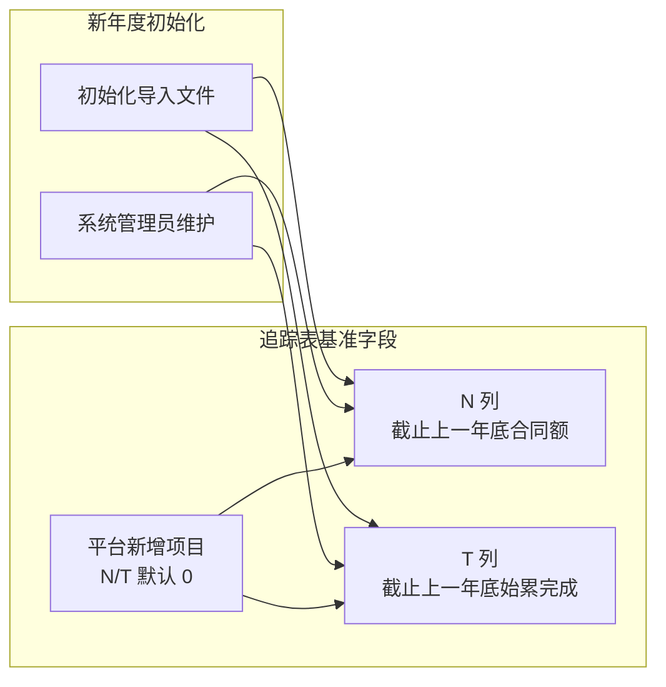

#### 新旧项目跨年 Rollover

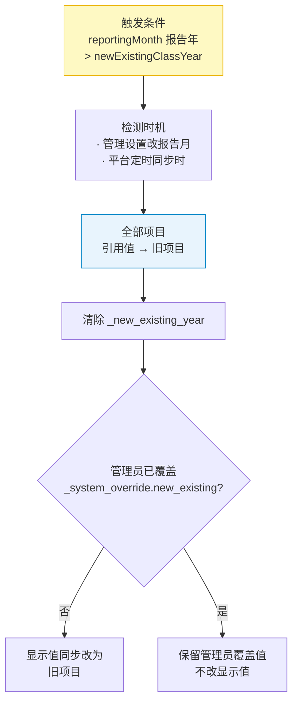

---

## 9. 补充需求确认（17 项，2026-05-20 定稿）

| # | 补充项 | 状态 | 说明 |
|---|---|---|---|
| 1 | **单元格底色区分（数据源可视化）** | ✅ 已实现 | 默认斑马纹/只读灰；**管理员覆盖**工程平台引用列后浅蓝 `#e8f4fd` + 引用批注（§2.2）。不再默认整列浅蓝。 |
| 2 | **项目详情 Drawer / 枚举·长文本编辑** | ✅ 已实现（P0/P1+） | F 列打开 Drawer（§3.7.1）：Header + 项目切换；浅黄可编辑态；报告月完成额 Popover 参考；金额千分位；WIP 为 0 自动折叠；保存回写 Sheet。 |
| 3 | **预收款核销模块** | ✅ 采纳 | …仅 **系统管理员 / 板块管理员** 在专属期操作（废弃 finance 专属编辑期 Wf）。 |
| 4 | **汇率差调整** | ✅ 采纳 | …仅 **板块管理员 / 系统管理员** 可编辑。 |
| 5 | **Save / Submit 分离** | ✅ 已实现 | §3.5.1 已描述「保存」（刷盘不触发流程）与「提交」（触发快照/审批流），无需新增开发。 |
| 6 | **批量提醒（一键催办）** | ✅ 采纳 | 每月 19 日自动提醒基础上，板块管理员可在填报页手动触发「一键催办」，向本板块 `status !== submitted` 且近 7 日无编辑记录的 PM 发送站内消息/邮件。系统管理员可全公司范围触发。 |
| 7 | **业务批注（非变更批注）** | ✅ 采纳 | 允许任意可编辑角色在任意可编辑单元格添加业务备注（如"客户变更需求，产值延后"），存储于 `_field_notes`，与 `_field_change_log` 独立。批注不触发高亮，仅以小角标提示。变更批注（橙色）与业务批注（蓝色）角标颜色区分。 |
| 8 | **存量指标 R/S 预警与校验** | ✅ 已实现 | R/S 预警筛选；手工完成额实时拦截 S<0；系统同步合同额变更导致 S<0 时自动对冲报告月完成额并留痕；提交前兜底校验 S≥0。详见 **§5.6**、`js/stock-validation.js`。 |
| 9 | **表格工具栏与紧凑列** | ✅ 已实现 | 关闭 Luckysheet 内置顶栏；保留 **公式/编辑栏**（`sheetFormulaBar`）；`.sheet-toolbar` 承载项目筛选 + 紧凑列。详见 **§3.4.4**、**§3.4.2**。 |
| 10 | **Drawer 工时辅助统计** | ✅ 已实现 | 折叠项「工时数据」；专业×月 / 板块×月、工时/成本切换、明细与下钻；**无数据时仅「暂无已审工时记录」**。详见 **§3.7.3**。 |
| 11 | **Drawer 成本中心辅助统计** | ✅ 已实现 | 折叠项「成本数据」；成本项×月矩阵、明细与下钻；**无数据时仅「暂无成本记录」**。详见 **§3.7.4**（辅助参考，非成本法产值）。 |
| 12 | **Drawer 项目预警区** | ✅ 已实现 | 「跟踪信息填报」上方；无预警不占位；4 类标签（存量开票/合同额为负、有完成额无工时、有工时无完成额）。详见 **§3.7.2**、`js/project-alerts.js`。 |
| 13 | **Drawer 完成额填报参考 Popover** | ✅ 已实现 | 聚焦报告月「月度完成」格时 Popover 展示总合同额、截止上月始累完成、当月已审工时与工时成本。`ProjectAlerts.getCompletionFillAux`。 |
| 14 | **Drawer 金额千分位** | ✅ 已实现 | 可编辑金额字段失焦后千分位展示，聚焦纯数字编辑；与 `Formatters.formatAmount` / `parseAmount` 一致。 |
| 15 | **总监/群主审批只读** | ✅ 已实现 | 审批页 Luckysheet 恒只读；需改数须驳回，由板块管理员编辑（§6.3、`field-config.js`）。 |
| 16 | **Luckysheet 公式栏** | ✅ 已实现 | `sheetFormulaBar: true`，还原单元格内容编辑栏；原生工具栏仍关闭（§3.4.4）。 |
| 17 | **保存周期配置刷新锁定态** | ✅ 已实现 | 保存 `periodConfig` 后 `applyBootstrap` 同步 `lockStatus`；横幅锁定日读配置；自动/手动锁定与解锁动作见 **§4.2**。 |

---

## 附录

### A. 数据范围与背景

#### A.1 项目范围
- **覆盖范围：** 公司 **所有已签署合同的项目** + **提前申报产值的项目**
- **涉及中心：** 线上化系统需覆盖 **所有项目执行中心**（参考 PM 知识库），各中心分别填报，最终汇总。

#### A.2 系统取值字段清单

以下字段由工程平台 / 财务数据同步或系统规则判定形成系统取值。固定引用列主要对应 `config/fields/fields.json` 中 `source_type = system_sync` 的字段；L 列为取自 CRB 合同状态的 `auto_calc` 系统判定字段；报告月开票 / 回款为按 `reportingMonth` 动态映射的月度列。系统管理员可按 §2.2 的覆盖规则修正引用显示值；“平台数据来源”列预留给业务侧补充这些值在平台中的具体来源。

| 列 | 字段 key / 动态口径 | 字段 | 数据范围 / 取值口径 | 当前来源说明 | 平台数据来源（待补充） |
|---|---|---|---|---|---|
| A | `new_existing` | 新、旧项目 | 按报告年度判断项目是否为当年新增；平台新增默认为新项目，跨年 rollover 为旧项目 | 工程平台引用 / 年度规则 |  |
| B | `start_date` | 约定开始时间 | 合同约定项目开始日期 | CRB |  |
| C | `end_date` | 约定结束时间 | 合同约定项目结束日期 | CRB |  |
| D | `unit_code` | 执行单位编码 | 项目负责执行单位 / 中心编码 | CRB |  |
| E | `pm_name` | 项目经理 | 项目当前负责人 | CRB |  |
| F | `project_no` | 项目号 | 项目唯一编号，作为主键；平台前期项目如带板块后缀（例：`B26001_SAS20`），追踪表展示去后缀后的正式项目号（例：`B26001`） | CRB / 前期项目规范化 |  |
| G | `project_name` | 项目名称 | 项目全称 | CRB |  |
| H | `client_name` | 客户名称 | 甲方客户全称 | CRB |  |
| I | `enterprise_type` | 企业属性 | 客户企业性质分类 | CRB |  |
| J | `industry` | 行业类别 | 客户所属行业分类 | CRB |  |
| K | `business_type` | 业务类型 | 项目所属业务类型分类 | CRB |  |
| L | `signed` | 合同是否签署 | 根据合同状态判定：CRB 状态为「已确认」显示「已签署」，否则显示「未签署」 | CRB 合同状态 / 系统判定 |  |
| O | `adj_value` | 当年调整值 | 报告年度内已完成的 CRB3 与 CRB5 合同额之和 | CRB |  |
| Y | `tax_rate` | 税率 | 合同适用税率 | CRB 合同条款 |  |
| 报告月动态列 | `mi_0`–`mi_11`（如 5 月为 `mi_4`） | 当月开票 | 报告月对应的月度开票列作为当月实际开票值 | 财务 / 工程平台引用 |  |
| 报告月动态列 | `mp_0`–`mp_11`（如 5 月为 `mp_4`） | 当月回款 | 报告月对应的月度回款列作为当月实际回款值 | 财务 / 工程平台引用 |  |

#### A.3 初始化导入基准字段

以下字段不是平台系统取值，不由 `platform-sync` 或 `_system_ref` 后续覆盖。它们用于承接初始化导入时已有项目的历史年度基准；平台后续新增项目均视为本年度新增项目，没有上一年度历史数据，因此默认填 `0`。编辑权限仅开放给 `system_admin`。

| 列 | 字段 key | 字段 | 数据范围 / 取值口径 | 编辑权限 |
|---|---|---|---|---|
| N | `prev_year_contract` | 截止上一年底合同额 | 初始化导入的上一年度期末合同额基准；平台新增项目默认 `0` | 仅 `system_admin` |
| T | `prev_year_completion` | 截止上一年底始累完成 | 初始化导入的上一年度期末累计完成基准；平台新增项目默认 `0` | 仅 `system_admin` |

### B. 字段理解纠正

| 字段 | 之前的理解 | 纠正后 |
|---|---|---|
| **项目执行单位编码** | 源表多为 `S520` 等 | 系统注册 **12 个** SAS 执行单位（§6.4）；短码归一为 `SAS*`（如 `S520` → `SAS520`） |
| **新、旧项目（A 列）** | 区分历史遗留 vs 新增 | **系统引用列**（§2.3）：当年平台新增默认为「新项目」；跨报告年初全部 rollover 为「旧项目」；系统管理员可覆盖显示值。与 §5.3.1「新增项目行」高亮（上月快照对比）**不是同一概念** |
| **R 列 / S 列** | 总合同额-开票 / 总合同额-完成 | 已更名为 **存量开票额（R）** / **存量合同额（S）**；分区名 **存量指标**（§5.6） |
| **当年调整值（O）/ 总合同额（P）** | O=P−N；P 直取 CRB | **O** 为 CRB 同步（当年 CRB3+CRB5 完成额之和）；**P=N+O** 公式计算（§2.4） |

### C. 待确认项

- [ ] **新/旧项目跨年计算**：待签署项目跨年如何标记（项目号不变，但签署年份跨越两个系统年度）【优先级：中】
- [ ] **板块总监/群主审批视图**：是否先看统计量，隐藏明细表？当前实现为直接展示变更明细 Luckysheet【优先级：低】
- [ ] **成本法预留**：目前不具备条件，是否需要预留接口？【优先级：低】
- [ ] **WIP 报告流转**：报告生成后是仅做通报，还是需要相关负责人回复措施？【优先级：低】
- [ ] **时间窗配置后台**：确认 19/25/9 动态调整的前端交互形式与权限边界（仅系统管理员可改）【优先级：中】

### D. 需求文档维护约定

功能**新增或优化**且变更 `js/`、`server/`、`css/`、`config/` 等业务代码时，**任务完成前**须同步：

| 文档 | 路径 | 更新侧重 |
|---|---|---|
| 产品版 | `docs/需求文档/需求文档_产品版.md` | 流程、规则、交互、验收；不写 API/路径 |
| 开发版 | `docs/需求文档/需求文档_开发版.md` | 实现、文件路径、API、§ 编号、边界条件 |

并更新两文档顶部「最后更新」日期。纯重构/无行为变化可在开发版一行说明。详见仓库根目录 **`AGENTS.md` § 更新规则**；Cursor Hook：`.cursor/hooks/remind-requirements-docs.js`。
